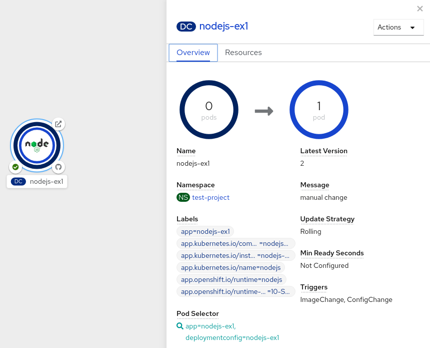
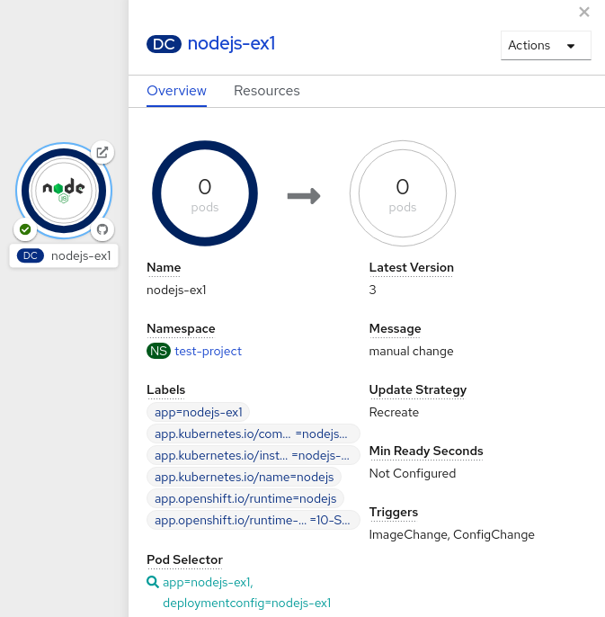

# Using deployment strategies { #deployment-strategies }

To upgrade applications with little or no downtime in OpenShift Container Platform, you can use a deployment strategy. Choose strategies that use `DeploymentConfig` object features or router features depending on whether you need to affect all routes or only specific ones.

Because users generally access applications through a route handled by a router, deployment strategies can focus on `DeploymentConfig` object features or routing features. Strategies that focus on `DeploymentConfig` object features impact all routes that use the application. Strategies that use router features target individual routes.

Most deployment strategies are supported through the `DeploymentConfig` object, and some additional strategies are supported through router features.

## Choosing a deployment strategy { #choosing-deployment-strategies }

Consider the following when choosing a deployment strategy:

- Long-running connections must be handled gracefully.
- Database conversions can be complex and must be done and rolled back along with the application.
- If the application is a hybrid of microservices and traditional components, downtime might be required to complete the transition.
- You must have the infrastructure to do this.
- If you have a non-isolated test environment, you can break both new and old versions.

A deployment strategy uses readiness checks to determine if a new pod is ready for use. If a readiness check fails, the `DeploymentConfig` object retries to run the pod until it times out. The default timeout is `10m`, a value set in `TimeoutSeconds` in `dc.spec.strategy.*params`.

## Rolling strategy { #deployments-rolling-strategy_deployment-strategies }

To update an application with little or no downtime in OpenShift Container Platform, you can use the rolling deployment strategy. New pods replace previous instances gradually after readiness checks succeed. This strategy is the default when none is specified on a `DeploymentConfig` object.

A rolling deployment typically waits for new pods to become `ready` via a readiness check before scaling down the old components. If a significant issue occurs, the rolling deployment can be aborted.

**When to use a rolling deployment:**

- When you want to take no downtime during an application update.
- When your application supports having old code and new code running at the same time.

A rolling deployment means you have both old and new versions of your code running at the same time. This typically requires that your application handle N-1 compatibility.

```yaml title="Example rolling strategy definition"
kind: DeploymentConfig
apiVersion: apps.openshift.io/v1
metadata:
  name: example-dc
# ...
spec:
# ...
  strategy:
    type: Rolling
    rollingParams:
      updatePeriodSeconds: 1
      intervalSeconds: 1
      timeoutSeconds: 120
      maxSurge: "20%"
      maxUnavailable: "10%"
      pre: {}
     post: {}
```

- `spec.strategy.rollingParams.updatePeriodSeconds` is the time to wait between individual pod updates. If unspecified, this value defaults to `1`.
- `spec.strategy.rollingParams.intervalSeconds` is the time to wait between polling the deployment status after update. If unspecified, this value defaults to `1`.
- `spec.strategy.rollingParams.timeoutSeconds` is the time to wait for a scaling event before giving up. Optional; the default is `600`. Here, *giving up* means automatically rolling back to the previous complete deployment.
- `spec.strategy.rollingParams.maxSurge` is optional and defaults to `25%` if not specified. See the information below the following procedure.
- `spec.strategy.rollingParams.maxUnavailable` is optional and defaults to `25%` if not specified. See the information below the following procedure.
- `spec.strategy.rollingParams.pre` and `spec.strategy.rollingParams.post` are lifecycle hooks.

The rolling strategy:

1. Executes any `pre` lifecycle hook.
2. Scales up the new replication controller based on the surge count.
3. Scales down the old replication controller based on the max unavailable count.
4. Repeats this scaling until the new replication controller has reached the desired replica count and the old replication controller has been scaled to zero.
5. Executes any `post` lifecycle hook.

!!! warning

    When scaling down, the rolling strategy waits for pods to become ready so it can decide whether further scaling would affect availability. If scaled up pods never become ready, the deployment process will eventually time out and result in a deployment failure.

The `maxUnavailable` parameter is the maximum number of pods that can be unavailable during the update. The `maxSurge` parameter is the maximum number of pods that can be scheduled above the original number of pods. Both parameters can be set to either a percentage (e.g., `10%`) or an absolute value (e.g., `2`). The default value for both is `25%`.

These parameters allow the deployment to be tuned for availability and speed. For example:

- `maxUnavailable*=0` and `maxSurge*=20%` ensures full capacity is maintained during the update and rapid scale up.
- `maxUnavailable*=10%` and `maxSurge*=0` performs an update using no extra capacity (an in-place update).
- `maxUnavailable*=10%` and `maxSurge*=10%` scales up and down quickly with some potential for capacity loss.

Generally, if you want fast rollouts, use `maxSurge`. If you have to take into account resource quota and can accept partial unavailability, use `maxUnavailable`.

!!! warning

    The default setting for `maxUnavailable` is `1` for all the machine config pools in OpenShift Container Platform. It is recommended to not change this value and update one control plane node at a time. Do not change this value to `3` for the control plane pool.

### Canary deployments { #deployments-canary-deployments_deployment-strategies }

To validate a new application version before replacing all pods in OpenShift Container Platform, you can use a canary deployment. All rolling deployments are canary deployments: the new instance is tested with readiness checks and automatically rolled back if it never becomes ready.

The readiness check is part of the application code and can be as sophisticated as necessary to ensure the new instance is ready to be used. If you must implement more complex checks of the application (such as sending real user workloads to the new instance), consider implementing a custom deployment or using a blue-green deployment strategy.

### Creating a rolling deployment { #deployments-creating-rolling-deployment_deployment-strategies }

To update an application with minimal downtime in OpenShift Container Platform, you can create a rolling deployment. Use the CLI to deploy an application, expose it, and trigger a new rollout so pods are gradually replaced.

**Procedure**

1. Create an application based on the example deployment images found in [Quay.io](https://quay.io/repository/openshifttest/deployment-example):

    ```terminal
    $ oc new-app quay.io/openshifttest/deployment-example:latest
    ```

    !!! note

        This image does not expose any ports. If you want to expose your applications over an external LoadBalancer service or enable access to the application over the public internet, create a service by using the `oc expose dc/deployment-example --port=<port>` command after completing this procedure.

2. If you have the router installed, make the application available via a route or use the service IP directly.

    ```terminal
    $ oc expose svc/deployment-example
    ```

3. Browse to the application at `deployment-example.<project>.<router_domain>` to verify you see the `v1` image.

4. Scale the `DeploymentConfig` object up to three replicas:

    ```terminal
    $ oc scale dc/deployment-example --replicas=3
    ```

5. Trigger a new deployment automatically by tagging a new version of the example as the `latest` tag:

    ```terminal
    $ oc tag deployment-example:v2 deployment-example:latest
    ```

6. In your browser, refresh the page until you see the `v2` image.

7. When using the CLI, the following command shows how many pods are on version 1 and how many are on version 2. In the web console, the pods are progressively added to v2 and removed from v1:

    ```terminal
    $ oc describe dc deployment-example
    ```

    During the deployment process, the new replication controller is incrementally scaled up. After the new pods are marked as `ready` (by passing their readiness check), the deployment process continues. If the pods do not become ready, the process aborts, and the deployment rolls back to its previous version.

### Editing a deployment by using the Developer perspective { #odc-editing-deployments_rolling-strategy }

To change the strategy, images, environment variables, or advanced options for a deployment in OpenShift Container Platform, you can edit the deployment in the **Developer** perspective. 

Open the application in the **Topology** view and use **Edit Deployment** to update settings such as rollouts and replicas.

**Prerequisites**

- You are in the **Developer** perspective of the web console.
- You have created an application.

**Procedure**

1. Navigate to the **Topology** view.

2. Click your application to see the **Details** panel.

3. In the **Actions** drop-down menu, select **Edit Deployment** to view the **Edit Deployment** page.

4. You can edit the following **Advanced options** for your deployment:

    1. Optional: You can pause rollouts by clicking **Pause rollouts**, and then selecting the **Pause rollouts for this deployment** checkbox.

        By pausing rollouts, you can make changes to your application without triggering a rollout. You can resume rollouts at any time.

    2. Optional: Click **Scaling** to change the number of instances of your image by modifying the number of **Replicas**.

5. Click **Save**.

### Starting a rolling deployment using the Developer perspective { #odc-starting-rolling-deployment_rolling-strategy }

To upgrade an application with minimal downtime in OpenShift Container Platform, you can start a rolling deployment in the **Developer** perspective. From the **Topology** view, select **Start Rollout** to spin up the new version and then terminate the old pods.

**Prerequisites**

- You are in the **Developer** perspective of the web console.
- You have created an application.

**Procedure**

1. In the **Topology** view, click the application node to see the **Overview** tab in the side panel. Note that the **Update Strategy** is set to the default **Rolling** strategy.

2. In the **Actions** drop-down menu, select **Start Rollout** to start a rolling update. The rolling deployment spins up the new version of the application and then terminates the old one.

    **Figure 1. Rolling update**

    

**Additional resources**

- [Creating and deploying applications on OpenShift Container Platform using the **Developer** perspective](../creating_applications/odc-creating-applications-using-developer-perspective.md#odc-creating-applications-using-developer-perspective)
- [Viewing the applications in your project, verifying their deployment status, and interacting with them in the **Topology** view](../odc-viewing-application-composition-using-topology-view.md#odc-viewing-application-composition-using-topology-view)

## Recreate strategy { #deployments-recreate-strategy_rolling-strategy }

To replace all previous pods before starting the new version in OpenShift Container Platform, you can use the recreate deployment strategy. Scale the old deployment to zero, then scale up the new one, optionally running `pre`, `mid`, and `post` lifecycle hooks.

```yaml title="Example recreate strategy definition"
kind: Deployment
apiVersion: apps/v1
metadata:
  name: hello-openshift
# ...
spec:
# ...
  strategy:
    type: Recreate
    recreateParams:
      pre: {} 
      mid: {}
      post: {}
```

- `spec.strategy.recreateParams` are optional.
- `spec.strategy.recreateParams.pre`, `spec.strategy.recreateParams.mid`, and `spec.strategy.recreateParams.post` are lifecycle hooks.

The recreate strategy:

1. Executes any `pre` lifecycle hook.
2. Scales down the previous deployment to zero.
3. Executes any `mid` lifecycle hook.
4. Scales up the new deployment.
5. Executes any `post` lifecycle hook.

!!! warning

    During scale up, if the replica count of the deployment is greater than one, the first replica of the deployment will be validated for readiness before fully scaling up the deployment. If the validation of the first replica fails, the deployment will be considered a failure.

**When to use a recreate deployment:**

- When you must run migrations or other data transformations before your new code starts.
- When you do not support having new and old versions of your application code running at the same time.
- When you want to use a RWO volume, which is not supported being shared between multiple replicas.

A recreate deployment incurs downtime because, for a brief period, no instances of your application are running. However, your old code and new code do not run at the same time.

### Editing a deployment by using the Developer perspective { #odc-editing-deployments_recreate-strategy }

To change the strategy, images, environment variables, or advanced options for a deployment in OpenShift Container Platform, you can edit the deployment in the **Developer** perspective. 

Open the application in the **Topology** view and use **Edit Deployment** to update settings such as rollouts and replicas.

**Prerequisites**

- You are in the **Developer** perspective of the web console.
- You have created an application.

**Procedure**

1. Navigate to the **Topology** view.

2. Click your application to see the **Details** panel.

3. In the **Actions** drop-down menu, select **Edit Deployment** to view the **Edit Deployment** page.

4. You can edit the following **Advanced options** for your deployment:

    1. Optional: You can pause rollouts by clicking **Pause rollouts**, and then selecting the **Pause rollouts for this deployment** checkbox.

        By pausing rollouts, you can make changes to your application without triggering a rollout. You can resume rollouts at any time.

    2. Optional: Click **Scaling** to change the number of instances of your image by modifying the number of **Replicas**.

5. Click **Save**.

### Starting a recreate deployment using the Developer perspective { #odc-starting-recreate-deployment_recreate-strategy }

To switch from a rolling update to a recreate rollout in OpenShift Container Platform, you can change the deployment strategy in the **Developer** perspective. Set the strategy type to `Recreate` in the YAML editor, then start a rollout from the **Topology** view.

**Prerequisites**

- Ensure that you are in the **Developer** perspective of the web console.
- Ensure that you have created an application using the **Add** view and see it deployed in the **Topology** view.

**Procedure**

1. Click your application to see the **Details** panel.

2. In the **Actions** drop-down menu, select **Edit Deployment Config** to see the deployment configuration details of the application.

3. In the YAML editor, change the `spec.strategy.type` to `Recreate` and click **Save**.

4. In the **Topology** view, select the node to see the **Overview** tab in the side panel. The **Update Strategy** is now set to **Recreate**.

5. Use the **Actions** drop-down menu to select **Start Rollout** to start an update using the recreate strategy. The recreate strategy first terminates pods for the older version of the application and then spins up pods for the new version.

    **Figure 2. Recreate update**



**Additional resources**

- [Creating and deploying applications on OpenShift Container Platform using the **Developer** perspective](../creating_applications/odc-creating-applications-using-developer-perspective.md#odc-creating-applications-using-developer-perspective)
- [Viewing the applications in your project, verifying their deployment status, and interacting with them in the **Topology** view](../odc-viewing-application-composition-using-topology-view.md#odc-viewing-application-composition-using-topology-view)

## Custom strategy { #deployments-custom-strategy_recreate-strategy }

To define your own rollout behavior in OpenShift Container Platform, you can use a custom deployment strategy. Provide a container image, command, and environment variables that control how the new deployment becomes active.

```yaml title="Example custom strategy definition"
kind: DeploymentConfig
apiVersion: apps.openshift.io/v1
metadata:
  name: example-dc
# ...
spec:
# ...
  strategy:
    type: Custom
    customParams:
      image: organization/strategy
      command: [ "command", "arg1" ]
      environment:
        - name: ENV_1
          value: VALUE_1
```

In the above example, the `organization/strategy` container image provides the deployment behavior. The optional `command` array overrides any `CMD` directive specified in the image’s `Dockerfile`. The optional environment variables provided are added to the execution environment of the strategy process.

Additionally, OpenShift Container Platform provides the following environment variables to the deployment process:

<table>
<thead>
<tr>
  <th>Environment variable</th>
  <th>Description</th>
</tr>
</thead>
<tbody>
<tr>
  <td><code>OPENSHIFT_DEPLOYMENT_NAME</code></td>
  <td>The name of the new deployment, a replication controller.</td>
</tr>
<tr>
  <td><code>OPENSHIFT_DEPLOYMENT_NAMESPACE</code></td>
  <td>The name space of the new deployment.</td>
</tr>
</tbody>
</table>


The replica count of the new deployment will initially be zero. The responsibility of the strategy is to make the new deployment active using the logic that best serves the needs of the user.

Alternatively, use the `customParams` object to inject the custom deployment logic into the existing deployment strategies. Provide a custom shell script logic and call the `openshift-deploy` binary. Users do not have to supply their custom deployer container image; in this case, the default OpenShift Container Platform deployer image is used instead:

```yaml
kind: DeploymentConfig
apiVersion: apps.openshift.io/v1
metadata:
  name: example-dc
# ...
spec:
# ...
  strategy:
    type: Rolling
    customParams:
      command:
      - /bin/sh
      - -c
      - |
        set -e
        openshift-deploy --until=50%
        echo Halfway there
        openshift-deploy
        echo Complete
```

This results in following deployment:

```terminal
Started deployment #2
--> Scaling up custom-deployment-2 from 0 to 2, scaling down custom-deployment-1 from 2 to 0 (keep 2 pods available, don't exceed 3 pods)
    Scaling custom-deployment-2 up to 1
--> Reached 50% (currently 50%)
Halfway there
--> Scaling up custom-deployment-2 from 1 to 2, scaling down custom-deployment-1 from 2 to 0 (keep 2 pods available, don't exceed 3 pods)
    Scaling custom-deployment-1 down to 1
    Scaling custom-deployment-2 up to 2
    Scaling custom-deployment-1 down to 0
--> Success
Complete
```

If the custom deployment strategy process requires access to the OpenShift Container Platform API or the Kubernetes API the container that executes the strategy can use the service account token available inside the container for authentication.

### Editing a deployment by using the Developer perspective { #odc-editing-deployments_custom-strategy }

To change the strategy, images, environment variables, or advanced options for a deployment in OpenShift Container Platform, you can edit the deployment in the **Developer** perspective. 

Open the application in the **Topology** view and use **Edit Deployment** to update settings such as rollouts and replicas.

**Prerequisites**

- You are in the **Developer** perspective of the web console.
- You have created an application.

**Procedure**

1. Navigate to the **Topology** view.

2. Click your application to see the **Details** panel.

3. In the **Actions** drop-down menu, select **Edit Deployment** to view the **Edit Deployment** page.

4. You can edit the following **Advanced options** for your deployment:

    1. Optional: You can pause rollouts by clicking **Pause rollouts**, and then selecting the **Pause rollouts for this deployment** checkbox.

        By pausing rollouts, you can make changes to your application without triggering a rollout. You can resume rollouts at any time.

    2. Optional: Click **Scaling** to change the number of instances of your image by modifying the number of **Replicas**.

5. Click **Save**.

## Lifecycle hooks { #deployments-lifecycle-hooks_custom-strategy }

To run custom logic at specific points during a rollout in OpenShift Container Platform, you can use lifecycle hooks with the rolling or recreate strategy. Configure hooks such as `pre` with a failure policy to abort, retry, or ignore when a hook fails.

The rolling and recreate strategies support *lifecycle hooks*, or deployment hooks, which allow behavior to be injected into the deployment process at predefined points within the strategy as shown in the following example:

```yaml
pre:
  failurePolicy: Abort
  execNewPod: {}
```

`pre.execNewPod` is a pod-based lifecycle hook.

Every hook has a *failure policy*, which defines the action the strategy should take when a hook failure is encountered:

<table>
<tbody>
<tr>
  <td><code>Abort</code></td>
  <td>The deployment process will be considered a failure if the hook fails.</td>
</tr>
<tr>
  <td><code>Retry</code></td>
  <td>The hook execution should be retried until it succeeds.</td>
</tr>
<tr>
  <td><code>Ignore</code></td>
  <td>Any hook failure should be ignored and the deployment should proceed.</td>
</tr>
</tbody>
</table>


Hooks have a type-specific field that describes how to execute the hook. Currently, pod-based hooks are the only supported hook type, specified by the `execNewPod` field.

## Pod-based lifecycle hook { #deployments-lifecycle-hooks-pod-based_custom-strategy }

Pod-based lifecycle hooks execute hook code in a new pod derived from the template in a `DeploymentConfig` object.

The following simplified example deployment uses the rolling strategy. Triggers and some other minor details are omitted for brevity:

```yaml
kind: DeploymentConfig
apiVersion: apps.openshift.io/v1
metadata:
  name: frontend
spec:
  template:
    metadata:
      labels:
        name: frontend
    spec:
      containers:
        - name: helloworld
          image: openshift/origin-ruby-sample
  replicas: 5
  selector:
    name: frontendasciiditavale modules/creating-rolling-deployments-CLI.adoc

  strategy:
    type: Rolling
    rollingParams:
      pre:
        failurePolicy: Abort
        execNewPod:
          containerName: helloworld
          command: [ "/usr/bin/command", "arg1", "arg2" ]
          env: 
            - name: CUSTOM_VAR1
              value: custom_value1
          volumes:
            - data
```

- `strategy.rollingParams.pre.execNewPod.containername.helloworld` refers to `spec.template.spec.containers[0].name`.
- `strategy.rollingParams.pre.execNewPod.command` overrides any `ENTRYPOINT` defined by the `openshift/origin-ruby-sample` image.
- `strategy.rollingParams.pre.execNewPod.env` is an optional set of environment variables for the hook container.
- `strategy.rollingParams.pre.execNewPod.volumes` is an optional set of volume references for the hook container.

In this example, the `pre` hook will be executed in a new pod using the `openshift/origin-ruby-sample` image from the `helloworld` container. The hook pod has the following properties:

- The hook command is `/usr/bin/command arg1 arg2`.
- The hook container has the `CUSTOM_VAR1=custom_value1` environment variable.
- The hook failure policy is `Abort`, meaning the deployment process fails if the hook fails.
- The hook pod inherits the `data` volume from the `DeploymentConfig` object pod.

## Setting lifecycle hooks { #deployments-setting-lifecycle-hooks_custom-strategy }

You can set lifecycle hooks, or deployment hooks, for a deployment using the CLI.

**Procedure**

1. Use the `oc set deployment-hook` command to set the type of hook you want: `--pre`, `--mid`, or `--post`. For example, to set a pre-deployment hook:

    ```terminal
    $ oc set deployment-hook dc/frontend \
        --pre -c helloworld -e CUSTOM_VAR1=custom_value1 \
        --volumes data --failure-policy=abort -- /usr/bin/command arg1 arg2
    ```
