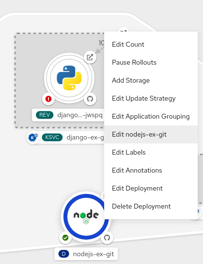
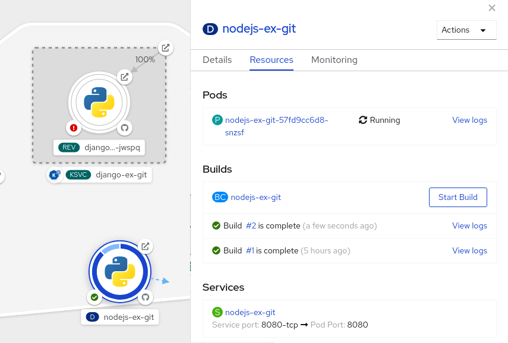

# Editing applications { #odc-editing-applications }

You can edit the configuration and the source code of the application you create using the **Topology** view.

## Prerequisites { #_prerequisites }

- You have the appropriate [roles and permissions](../authentication/using-rbac.md#default-roles_using-rbac) in a project to create and modify applications in OpenShift Container Platform.
- You have [created and deployed an application on OpenShift Container Platform using the **Developer** perspective](creating_applications/odc-creating-applications-using-developer-perspective.md#odc-creating-applications-using-developer-perspective).
- You have [logged in to the web console](../web_console/web-console.md#web-console) and have switched to [the **Developer** perspective](../web_console/web-console-overview.md#about-developer-perspective_web-console-overview).

## Editing the source code of an application using the Developer perspective { #odc-editing-source-code-using-developer-perspective_odc-editing-applications }

You can use the **Topology** view in the **Developer** perspective to edit the source code of your application.

**Procedure**

- In the **Topology** view, click the **Edit Source code** icon, displayed at the bottom-right of the deployed application, to access your source code and modify it.

    !!! note

        This feature is available only when you create applications using the **From Git**, **From Catalog**, and the **From Dockerfile** options.

    If the **Eclipse Che** Operator is installed in your cluster, a Che workspace () is created and you are directed to the workspace to edit your source code. If it is not installed, you will be directed to the Git repository () your source code is hosted in.

## Editing the application configuration using the Developer perspective { #odc-editing-application-configuration-using-developer-perspective_odc-editing-applications }

You can use the **Topology** view in the **Developer** perspective to edit the configuration of your application.

!!! note

    Currently, only configurations of applications created by using the **From Git**, **Container Image**, **From Catalog**, or **From Dockerfile** options in the **Add** workflow of the **Developer** perspective can be edited. Configurations of applications created by using the CLI or the **YAML** option from the **Add** workflow cannot be edited.

**Prerequisites**

Ensure that you have created an application using  the **From Git**, **Container Image**, **From Catalog**, or **From Dockerfile** options in the **Add** workflow.

**Procedure**

1. After you have created an application and it is displayed in the **Topology** view, right-click the application to see the edit options available.

    **Figure 1. Edit application**

    

2. Click **Edit *****application-name*** to see the **Add** workflow you used to create the application. The form is pre-populated with the values you had added while creating the application.

3. Edit the necessary values for the application.

    !!! note

        You cannot edit the **Name** field in the **General** section, the CI/CD pipelines, or the **Create a route to the application** field in the **Advanced Options** section.

4. Click **Save** to restart the build and deploy a new image.

    **Figure 2. Edit and redeploy application**

    
