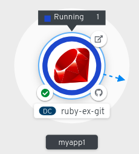
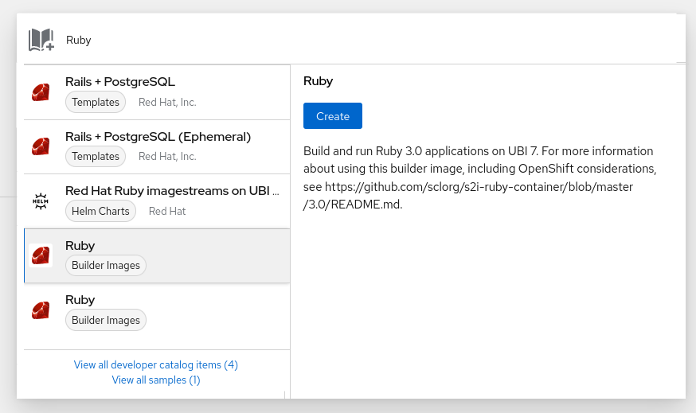
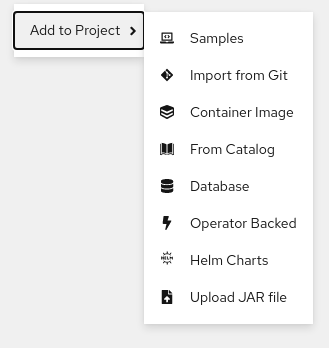
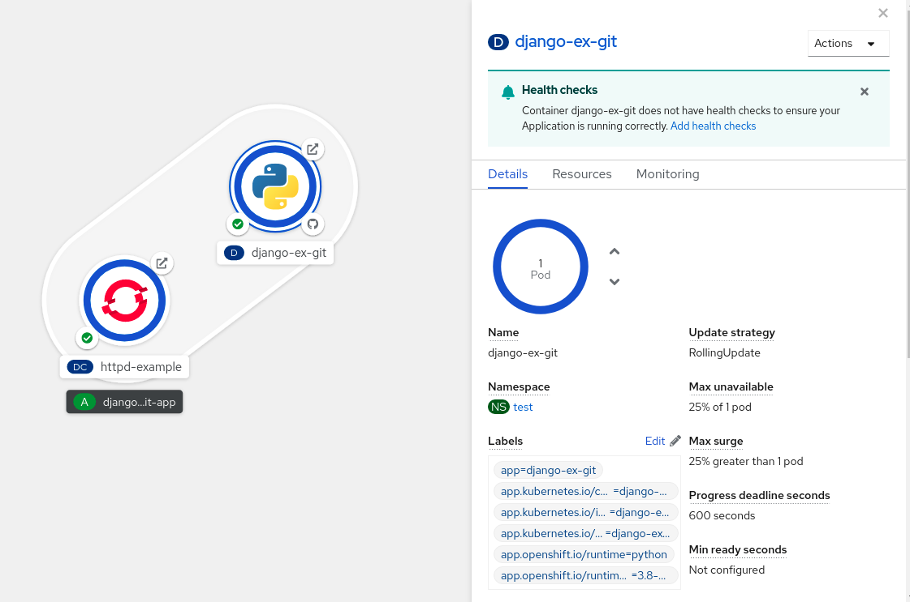
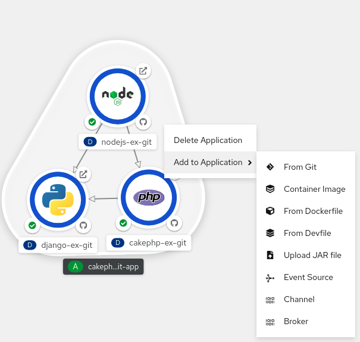
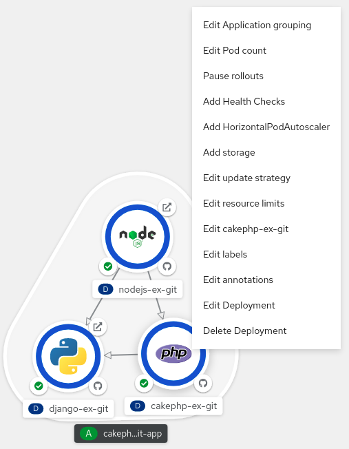

# Viewing application composition by using the Topology view { #odc-viewing-application-composition-using-topology-view }

The **Topology** view in the **Developer** perspective of the web console provides a visual representation of all the applications within a project, their build status, and the components and services associated with them.

## Prerequisites { #_prerequisites }

To view your applications in the **Topology** view and interact with them, ensure that:

- You have [logged in to the web console](../web_console/web-console.md#web-console).
- You have the appropriate [roles and permissions](../authentication/using-rbac.md#default-roles_using-rbac) in a project to create applications and other workloads in OpenShift Container Platform.
- You are in [the **Developer** perspective](../web_console/web-console-overview.md#about-developer-perspective_web-console-overview).

## Viewing the topology of your application { #odc-viewing-application-topology_viewing-application-composition-using-topology-view }

You can navigate to the **Topology** view using the left navigation panel in the **Developer** perspective. After you deploy an application, you are directed automatically to the **Graph view** where you can see the status of the application pods, quickly access the application on a public URL, access the source code to modify it, and see the status of your last build. You can zoom in and out to see more details for a particular application.

The **Topology** view provides you the option to monitor your applications using the **List** view. Use the **List view** icon () to see a list of all your applications and use the **Graph view** icon () to switch back to the graph view.

You can customize the views as required using the following:

- Use the **Find by name** field to find the required components. Search results may appear outside of the visible area; click **Fit to Screen** from the lower-left toolbar to resize the **Topology** view to show all components.

- Use the **Display Options** drop-down list to configure the **Topology** view of the various application groupings. The options are available depending on the types of components deployed in the project:

    - **Expand** group

        - Virtual Machines: Toggle to show or hide the virtual machines.
        - Application Groupings: Clear to condense the application groups into cards with an overview of an application group and alerts associated with it.
        - Helm Releases: Clear to condense the components deployed as Helm Release into cards with an overview of a given release.
        - Knative Services: Clear to condense the Knative Service components into cards with an overview of a given component.
        - Operator Groupings: Clear to condense the components deployed with an Operator into cards with an overview of the given group.

    - **Show** elements based on **Pod Count** or **Labels**

        - Pod Count: Select to show the number of pods of a component in the component icon.
        - Labels: Toggle to show or hide the component labels. The **Topology** view also provides you the **Export application** option to download your application in the ZIP file format. You can then import the downloaded application to another project or cluster. For more details, see *Exporting an application to another project or cluster* in the *Additional resources* section.

## Interacting with applications and components { #odc-interacting-with-applications-and-components_viewing-application-composition-using-topology-view }

In the **Topology** view in the **Developer** perspective of the web console, the **Graph view** provides the following options to interact with applications and components:

- Click **Open URL** () to see your application exposed by the route on a public URL.

- Click **Edit Source code** to access your source code and modify it.

    !!! note

        This feature is available only when you create applications using the **From Git**, **From Catalog**, and the **From Dockerfile** options.

- Hover your cursor over the lower left icon on the pod to see the name of the latest build and its status. The status of the application build is indicated as **New** (), **Pending** (), **Running** (), **Completed** (), **Failed** (), and **Canceled** ().

- The status or phase of the pod is indicated by different colors and tooltips as:

    - **Running** (): The pod is bound to a node and all of the containers are created. At least one container is still running or is in the process of starting or restarting.
    - **Not Ready** (): The pods which are running multiple containers, not all containers are ready.
    - **Warning**(): Containers in pods are being terminated, however termination did not succeed. Some containers may be other states.
    - **Failed**(): All containers in the pod terminated but least one container has terminated in failure. That is, the container either exited with non-zero status or was terminated by the system.
    - **Pending**(): The pod is accepted by the Kubernetes cluster, but one or more of the containers has not been set up and made ready to run. This includes time a pod spends waiting to be scheduled as well as the time spent downloading container images over the network.
    - **Succeeded**(): All containers in the pod terminated successfully and will not be restarted.
    - **Terminating**(): When a pod is being deleted, it is shown as **Terminating** by some kubectl commands. **Terminating** status is not one of the pod phases. A pod is granted a graceful termination period, which defaults to 30 seconds.
    - **Unknown**(): The state of the pod could not be obtained. This phase typically occurs due to an error in communicating with the node where the pod should be running.

- After you create an application and an image is deployed, the status is shown as **Pending**. After the application is built, it is displayed as **Running**.

    **Figure 1. Application topology**

    

    The application resource name is appended with indicators for the different types of resource objects as follows:

    - **CJ**: `CronJob`

    - **D**: `Deployment`

    - **DC**: `DeploymentConfig`

    - **DS**: `DaemonSet`

    - **J**: `Job`

    - **P**: `Pod`

    - **SS**: `StatefulSet`

    -  (Knative): A serverless application

        !!! note

            Serverless applications take some time to load and display on the **Graph view**. When you deploy a serverless application, it first creates a service resource and then a revision. After that, it is deployed and displayed on the **Graph view**. If it is the only workload, you might be redirected to the **Add** page. After the revision is deployed, the serverless application is displayed on the **Graph view**.

## Scaling application pods and checking builds and routes { #odc-scaling-application-pods-and-checking-builds-and-routes_viewing-application-composition-using-topology-view }

The **Topology** view provides the details of the deployed components in the **Overview** panel. You can use the **Overview** and **Details** tabs to scale the application pods, check build status, services, and routes as follows:

- Click on the component node to see the **Overview** panel to the right. Use the **Details** tab to:

    - Scale your pods using the up and down arrows to increase or decrease the number of instances of the application manually. For serverless applications, the pods are automatically scaled down to zero when idle and scaled up depending on the channel traffic.
    - Check the **Labels**, **Annotations**, and **Status** of the application.

- Click the **Resources** tab to:

    - See the list of all the pods, view their status, access logs, and click on the pod to see the pod details.

    - See the builds, their status, access logs, and start a new build if needed.

    - See the services and routes used by the component.

        For serverless applications, the **Resources** tab provides information on the revision, routes, and the configurations used for that component.

## Adding components to an existing project { #odc-adding-components-to-an-existing-project_viewing-application-composition-using-topology-view }

You can add components to a project.

**Procedure**

1. Navigate to the **+Add** view.

2. Click **Add to Project** () next to left navigation pane or press <kbd>Ctrl+Space</kbd>

3. Search for the component and click the **Start**/**Create**/**Install** button or click <kbd>Enter</kbd> to add the component to the project and see it in the topology **Graph view**.

    **Figure 2. Adding component via quick search**

    

Alternatively, you can also use the available  options in the context menu, such as **Import from Git**, **Container Image**, **Database**, **From Catalog**, **Operator Backed**, **Helm Charts**, **Samples**, or **Upload JAR file**, by right-clicking in the topology **Graph view** to add a component to your project.

**Figure 3. Context menu to add services**

## Grouping multiple components within an application { #odc-grouping-multiple-components_viewing-application-composition-using-topology-view }

You can use the **+Add** view to add multiple components or services to your project and use the topology **Graph view** to group applications and resources within an application group.

**Prerequisites**

- You have created and deployed minimum two or more components on OpenShift Container Platform using the **Developer** perspective.

**Procedure**

- To add a service to the existing application group, press <kbd>Shift</kbd>+ drag it to the existing application group. Dragging a component and adding it to an application group adds the required labels to the component.

    **Figure 4. Application grouping**

    

Alternatively, you can also add the component to an application as follows:

1. Click the service pod to see the **Overview** panel to the right.
2. Click the **Actions** drop-down menu and select **Edit Application Grouping**.
3. In the **Edit Application Grouping** dialog box, click the **Application** drop-down list, and select an appropriate application group.
4. Click **Save** to add the service to the application group.

You can remove a component from an application group by selecting the component and using <kbd>Shift</kbd>+ drag to drag it out of the application group.

## Adding services to your application { #odc-adding-services-to-your-application_viewing-application-composition-using-topology-view }

To add a service to your application use the **+Add** actions using the context menu in the topology **Graph view**.

!!! note

    In addition to the context menu, you can add services by using the sidebar or hovering and dragging the dangling arrow from the application group.

**Procedure**

1. Right-click an application group in the topology **Graph view** to display the context menu.

    **Figure 5. Add resource context menu**

    

2. Use **Add to Application** to select a method for adding a service to the application group, such as **From Git**, **Container Image**, **From Dockerfile**, **From Devfile**, **Upload JAR file**, **Event Source**, **Channel**, or **Broker**.

3. Complete the form for the method you choose and click **Create**. For example, to add a service based on the source code in your Git repository, choose the **From Git** method, fill in the **Import from Git** form, and click **Create**.

## Removing services from your application { #odc-removing-services-from-your-application_viewing-application-composition-using-topology-view }

In the topology **Graph view** remove a service from your application using the context menu.

**Procedure**

1. Right-click on a service in an application group in the topology **Graph view** to display the context menu.

2. Select **Delete Deployment** to delete the service.

    **Figure 6. Deleting deployment option**

    

## Labels and annotations used for the Topology view { #odc-labels-and-annotations-used-for-topology-view_viewing-application-composition-using-topology-view }

The **Topology** view uses the following labels and annotations:

Icon displayed in the node
:   Icons in the node are defined by looking for matching icons using the `app.openshift.io/runtime` label, followed by the `app.kubernetes.io/name` label. This matching is done using a predefined set of icons.

Link to the source code editor or the source
:   The `app.openshift.io/vcs-uri` annotation is used to create links to the source code editor.

Node Connector
:   The `app.openshift.io/connects-to` annotation is used to connect the nodes.

App grouping
:   The `app.kubernetes.io/part-of=<appname>` label is used to group the applications, services, and components.

For detailed information on the labels and annotations OpenShift Container Platform applications must use, see [Guidelines for labels and annotations for OpenShift applications](https://github.com/redhat-developer/app-labels/blob/master/labels-annotation-for-openshift.adoc).

**Additional resources**

- See [Importing a codebase from Git to create an application](creating_applications/odc-creating-applications-using-developer-perspective.md#odc-importing-codebase-from-git-to-create-application_odc-creating-applications-using-developer-perspective) for more information on creating an application from Git.
- See [Exporting applications](odc-exporting-applications.md#odc-exporting-applications).
