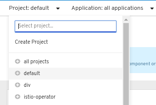
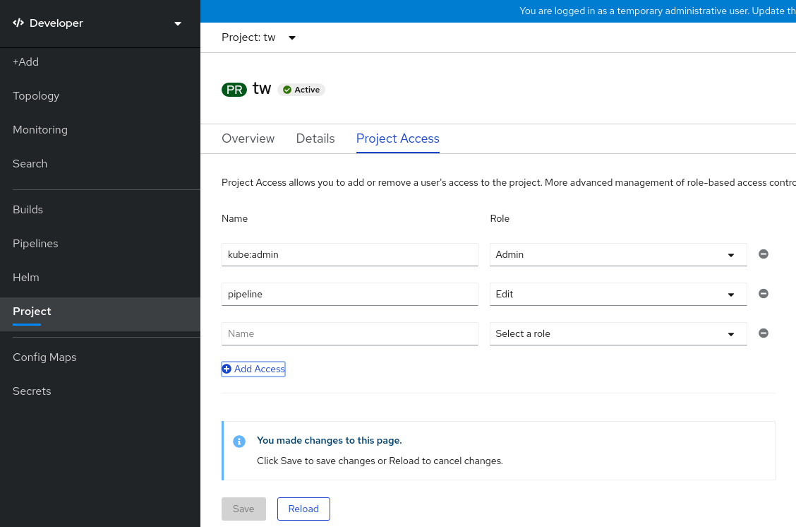

# Working with projects { #working-with-projects }

A *project* allows a community of users to organize and manage their content in isolation from other communities.

!!! note

    Projects starting with `openshift-` and `kube-` are default projects. For more information, see "Default projects". These projects host cluster components that run as pods and other infrastructure components. As such, OpenShift Container Platform does not allow you to create projects starting with `openshift-` or `kube-` using the `oc new-project` command. Cluster administrators can create these projects using the `oc adm new-project` command.

!!! warning

    Do not run workloads in or share access to default projects. Default projects are reserved for running core cluster components.

    The following default projects are considered highly privileged: `default`, `kube-public`, `kube-system`, `openshift`, `openshift-infra`, `openshift-node`, and other system-created projects that have the `openshift.io/run-level` label set to `0` or `1`. Functionality that relies on admission plugins, such as pod security admission, security context constraints, cluster resource quotas, and image reference resolution, does not work in highly privileged projects.

You can complete the following tasks on either the OpenShift Container Platform web console or the OpenShift CLI (`oc`):

- Create a project in your cluster.
- View a project.
- Check the status of a project.
- Delete a project.

!!! warning

    When you delete a project, the server updates the project status to **Terminating** from **Active**. The server then clears all content from a project that is in the **Terminating** state before finally removing the project. While a project is in **Terminating** status, you cannot add new content to the project.

## Creating a project by using the web console { #creating-a-project-using-the-web-console_projects }

You can use the OpenShift Container Platform web console to create a project in your cluster.

!!! note

    Projects starting with `openshift-` and `kube-` are considered critical by OpenShift Container Platform. As such, OpenShift Container Platform does not allow you to create projects starting with `openshift-` using the web console.

**Prerequisites**

- You have the appropriate roles and permissions to create projects, applications, and other workloads in OpenShift Container Platform.

**Procedure**

- If you are using the **Administrator** perspective:

    1. Navigate to **Home** → **Projects**.

    2. Click **Create Project**:

        1. In the **Create Project** dialog box, enter a unique name, such as `myproject`, in the **Name** field.

        2. Optional: Add the **Display name** and **Description** details for the project.

        3. Click **Create**.

            The dashboard for your project is displayed.

    3. Optional: Select the **Details** tab to view the project details.

    4. Optional: If you have adequate permissions for a project, you can use the **Project Access** tab to provide or revoke `admin`, `edit`, and `view` privileges for the project.

- If you are using the **Developer** perspective:

    1. Click the **Project** menu and select **Create Project**:

        **Figure 1. Create project**

        

        1. In the **Create Project** dialog box, enter a unique name, such as `myproject`, in the **Name** field.
        2. Optional: Add the **Display name** and **Description** details for the project.
        3. Click **Create**.

    2. Optional: Use the left navigation panel to navigate to the **Project** view and see the dashboard for your project.

    3. Optional: In the project dashboard, select the **Details** tab to view the project details.

    4. Optional: If you have adequate permissions for a project, you can use the **Project Access** tab of the project dashboard to provide or revoke admin, edit, and view privileges for the project.

**Additional resources**

- [Customizing the available cluster roles using the web console](working-with-projects.md#odc-customizing-available-cluster-roles-using-the-web-console_projects)

## Creating a project by using the CLI { #creating-a-project-using-the-CLI_projects }

If your cluster administrator has provided you with the required permissions, you can create a new project.

!!! note

    Projects starting with `openshift-` and `kube-` are considered critical by OpenShift Container Platform. OpenShift Container Platform does not allow you to create projects that start with `openshift-` or `kube-` by using the `oc new-project` command. Cluster administrators can create these projects by using the `oc adm new-project` command.

**Procedure**

- To create a project, enter the following command:

    ```terminal
    $ oc new-project <project_name> \
        --description="<description>" --display-name="<display_name>"
    ```

    The following example uses actual values:

    ```terminal
    $ oc new-project hello-openshift \
        --description="This is an example project" \
        --display-name="Hello OpenShift"
    ```

    !!! note

        The number of projects that you can create might be limited by the system administrator. After your limit is reached, you might have to delete an existing project to create a new one.

## Viewing a project by using the web console { #viewing-a-project-using-the-web-console_projects }

You can view the projects that you have access to by using the OpenShift Container Platform web console.

!!! warning

    Starting with OpenShift Container Platform 4.19, the perspectives in the web console have unified. The **Developer** perspective is no longer enabled by default.

    All users can interact with all OpenShift Container Platform web console features. However, if you are not the cluster owner, you might need to request permission to access certain features from the cluster owner.

    You can still enable the **Developer** perspective. On the **Getting Started** pane in the web console, you can take a tour of the console, find information on setting up your cluster, view a quick start for enabling the **Developer** perspective, and follow links to explore new features and capabilities.

**Procedure**

- If you are logged in as an administrator, complete the following steps:

    1. Navigate to **Home** → **Projects** in the navigation menu.
    2. Select a project to view. The **Overview** tab includes a dashboard for your project.
    3. Select the **Details** tab to view the project details.
    4. Select the **YAML** tab to view and update the YAML configuration for the project resource.
    5. Select the **Workloads** tab to see workloads in the project.
    6. Select the **RoleBindings** tab to view and create role bindings for your project.

- If you are logged in as a developer, complete the following steps:

    1. Navigate to the **Project** page in the navigation menu.
    2. Select **All Projects** from the **Project** drop-down menu at the top of the screen to list all of the projects in your cluster.
    3. Select a project to view.
    4. Select the **Details** tab to view the project details.
    5. If you have adequate permissions for a project, select the **Project access** tab to view and update the privileges for the project.

## Viewing a project using the CLI { #viewing-a-project-using-the-CLI_projects }

When viewing projects, you are restricted to seeing only the projects you have access to view based on the authorization policy.

**Procedure**

1. To view a list of projects, enter the following command:

    ```terminal
    $ oc get projects
    ```

2. To change from the current project to a different project for CLI operations, enter the following command. The specified project is then used in all subsequent operations that manipulate project-scoped content.

    ```terminal
    $ oc project <project_name>
    ```

## Providing access permissions to your project using the Developer perspective { #odc-providing-project-permissions-using-developer-perspective_projects }

You can use the **Project** view in the **Developer** perspective to grant or revoke access permissions to your project. You can add users to your project and provide them with **Admin**, **Edit**, or **View** access.

**Prerequisites**

- You have created a project.

**Procedure**

1. In the **Developer** perspective, navigate to the **Project** page.

2. Select your project from the **Project** menu.

3. Select the **Project Access** tab.

4. Click **Add access** to add a new row of permissions to the default ones.

    **Figure 2. Project permissions**

    

5. Enter the user name, click the **Select a role** drop-down list, and select an appropriate role.

6. Click **Save** to add the new permissions.

7. Optional: You can complete any of the following additional tasks:

    - The **Select a role** drop-down list, to modify the access permissions of an existing user.

    - The **Remove Access** icon, to completely remove the access permissions of an existing user to the project.

        !!! note

            Advanced role-based access control is managed in the **Roles** and **Roles Binding** views in the **Administrator** perspective.

## Customizing the available cluster roles using the web console { #odc-customizing-available-cluster-roles-using-the-web-console_projects }

In the **Developer** perspective of the web console, the **Project** → **Project access** page enables a project administrator to grant roles to users in a project. By default, the available cluster roles that can be granted to users in a project are `admin`, `edit`, and `view`.

As a cluster administrator, you can define which cluster roles are available in the **Project access** page for all projects cluster-wide. You can specify the available roles by customizing the `spec.customization.projectAccess.availableClusterRoles` object in the `Console` configuration resource.

**Prerequisites**

- You have access to the cluster as a user with the `cluster-admin` role.

**Procedure**

1. In the **Administrator** perspective, navigate to **Administration** → **Cluster settings**.

2. Click the **Configuration** tab.

3. From the **Configuration resource** list, select **Console `operator.openshift.io`**.

4. Navigate to the **YAML** tab to view and edit the YAML code.

5. In the YAML code under `spec`, customize the list of available cluster roles for project access. The following example specifies the default `admin`, `edit`, and `view` roles:

    ```yaml
    apiVersion: operator.openshift.io/v1
    kind: Console
    metadata:
      name: cluster
    # ...
    spec:
      customization:
        projectAccess:
          availableClusterRoles:
          - admin
          - edit
          - view
    ```

6. Click **Save** to save the changes to the `Console` configuration resource.

**Verification**

1. In the **Developer** perspective, navigate to the **Project** page.
2. Select a project from the **Project** menu.
3. Select the **Project access** tab.
4. Click the menu in the **Role** column and verify that the available roles match the configuration that you applied to the `Console` resource configuration.

## Adding to a project { #adding-to-a-project_projects }

You can add items to your project by using the **+Add** page.

**Prerequisites**

- You have created a project.

**Procedure**

1. Navigate to the **+Add** page.

2. Select your project from the **Project** menu.

3. Click an item on the **+Add** page and then follow the workflow.

    !!! note

        You can also use the search feature in the **+Add** page to find additional items to add to your project. Click **+** under **Add** at the top of the page and type the name of a component in the search field.

## Checking project status by using the web console { #checking-project-status-using-the-web-console_projects }

You can review the status of your project by using the web console.

**Prerequisites**

- You have created a project.

**Procedure**

1. Navigate to **Home** → **Projects**.
2. Select a project from the list.
3. Review the project status in the **Overview** page.

## Checking project status by using the CLI { #checking-project-status-using-the-CLI_projects }

You can review the status of your project by using the OpenShift CLI (`oc`).

**Prerequisites**

- You have installed the OpenShift CLI (`oc`).
- You have created a project.

**Procedure**

1. Switch to your project:

    ```terminal
    $ oc project <project_name>
    ```

    - Replace `<project_name>` with the name of your project.

2. Obtain a high-level overview of the project:

    ```terminal
    $ oc status
    ```

## Deleting a project by using the web console { #deleting-a-project-using-the-web-console_projects }

You can delete a project by using the web console.

**Prerequisites**

- You have created a project.
- You have the required permissions to delete the project.

**Procedure**

- If you are using the **Administrator** perspective, complete the following steps:

    1. Navigate to **Home** → **Projects**.

    2. Select a project from the list.

    3. Click the **Actions** drop-down menu for the project and select **Delete Project**.

        !!! note

            The **Delete Project** option is not available if you do not have the required permissions to delete the project.

    4. In the **Delete Project?** pane, confirm the deletion by entering the name of your project.

    5. Click **Delete**.

- If you are using the **Developer** perspective, complete the following steps:

    1. Navigate to the **Project** page.

    2. Select the project that you want to delete from the **Project** menu.

    3. Click the **Actions** drop-down menu for the project and select **Delete Project**.

        !!! note

            If you do not have the required permissions to delete the project, the **Delete Project** option is not available.

    4. In the **Delete Project?** pane, confirm the deletion by entering the name of your project.

    5. Click **Delete**.

## Deleting a project by using the CLI { #deleting-a-project-using-the-CLI_projects }

You can delete a project by using the OpenShift CLI (`oc`).

**Prerequisites**

- You have installed the OpenShift CLI (`oc`).
- You have created a project.
- You have the required permissions to delete the project.

**Procedure**

- Delete your project by entering the following command:

    ```terminal
    $ oc delete project <project_name>
    ```

    - Replace `<project_name>` with the name of the project that you want to delete.

**Additional resources**

- [Default projects](../../authentication/using-rbac.md#rbac-default-projects_using-rbac)
