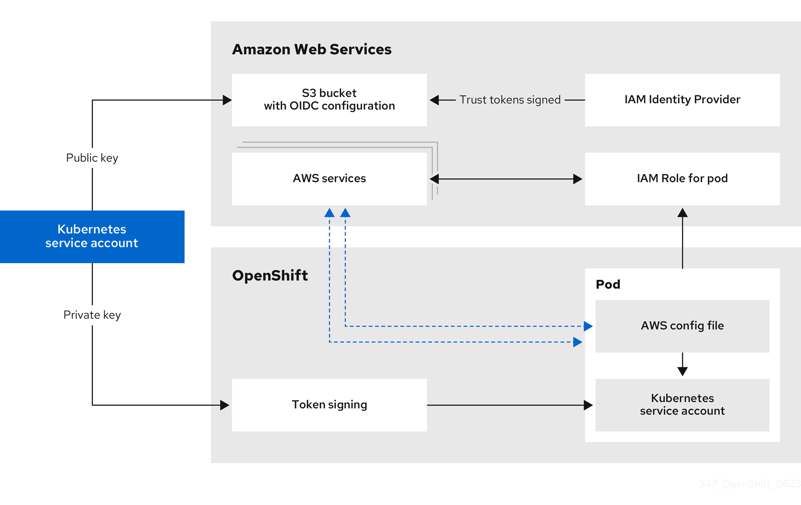
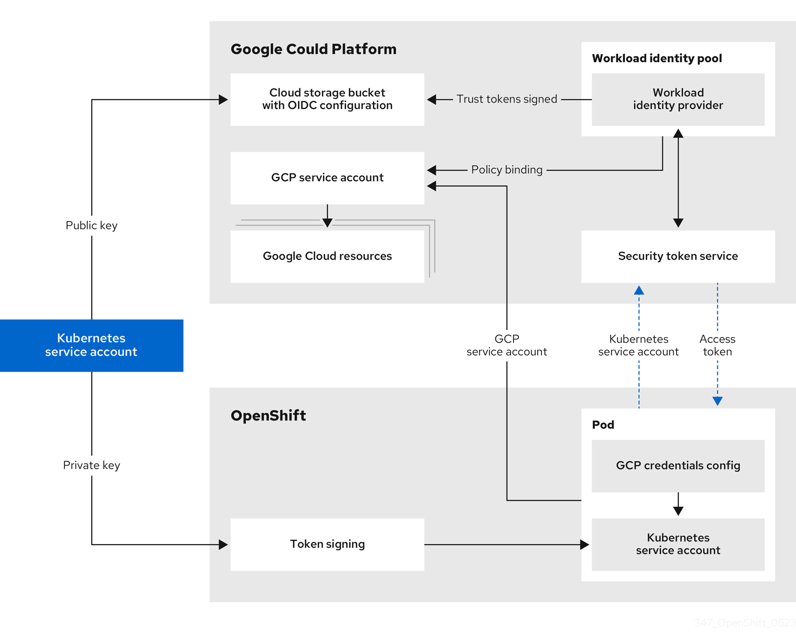
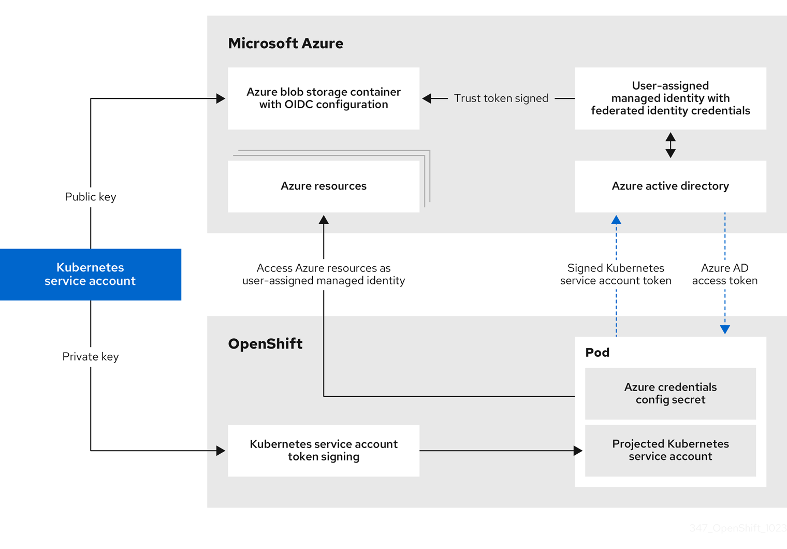

# About the Cloud Credential Operator in manual mode with short-term credentials for components { #cco-short-term-creds }

During installation, you can configure the Cloud Credential Operator (CCO) to operate in manual mode and use the CCO utility (`ccoctl`) to implement short-term security credentials for individual components that are created and managed outside the OpenShift Container Platform cluster.

!!! note

    This credentials strategy is supported for Amazon Web Services (AWS), Google Cloud, and global Microsoft Azure only.

    For AWS and Google Cloud clusters, you must configure your cluster to use this strategy during installation of a new OpenShift Container Platform cluster. You cannot configure an existing AWS or Google Cloud cluster that uses a different credentials strategy to use this feature.

    If you did not configure your Azure cluster to use Microsoft Entra Workload ID during installation, you can enable this authentication method on an existing cluster. For information, see "Enabling token-based authentication".

Cloud providers use different terms for their implementation of this authentication method.

**Short-term credentials provider terminology**

| Cloud provider            | Provider nomenclature            |
| ------------------------- | -------------------------------- |
| Amazon Web Services (AWS) | AWS Security Token Service (STS) |
| Google Cloud              | GCP Workload Identity            |
| Global Microsoft Azure    | Microsoft Entra Workload ID      |

## About AWS Security Token Service { #cco-short-term-creds-aws-sts_cco-short-term-creds }

To assign IAM roles that provide short-term, limited-privilege security credentials to your cluster components, you can configure your cluster to use manual mode with Security Token Service (STS), allowing the individual OpenShift Container Platform components to use the AWS STS.

These credentials are associated with IAM roles that are specific to each component that makes AWS API calls.

**Additional resources**

- [Configuring an AWS cluster to use short-term credentials](../../installing/installing_aws/ipi/installing-aws-customizations.md#installing-aws-with-short-term-creds_installing-aws-customizations)

### AWS Security Token Service authentication process { #cco-short-term-creds-auth-flow-aws_cco-short-term-creds }

You should familiarize yourself with the process that the AWS Security Token Service (STS) and the [`AssumeRole`](https://docs.aws.amazon.com/STS/latest/APIReference/API_AssumeRole.html) API action perform to allow pods to retrieve access keys that are defined by an IAM role policy.

The OpenShift Container Platform cluster includes a Kubernetes service account signing service. This service uses a private key to sign service account JSON web tokens (JWT). A pod that requires a service account token requests one through the pod specification. When the pod is created and assigned to a node, the node retrieves a signed service account from the service account signing service and mounts it onto the pod.

Clusters that use STS contain an IAM role ID in their Kubernetes configuration secrets. Workloads assume the identity of this IAM role ID. The signed service account token issued to the workload aligns with the configuration in AWS, which allows AWS STS to grant access keys for the specified IAM role to the workload.

AWS STS grants access keys only for requests that include service account tokens that meet the following conditions:

- The token name and namespace match the service account name and namespace.
- The token is signed by a key that matches the public key.

The public key pair for the service account signing key used by the cluster is stored in an AWS S3 bucket. AWS STS federation validates that the service account token signature aligns with the public key stored in the S3 bucket.

#### Authentication flow for AWS STS { #cco-short-term-creds-auth-flow-aws-diagram_cco-short-term-creds }

The following diagram illustrates the authentication flow between AWS and the OpenShift Container Platform cluster when using AWS STS.

- *Token signing* is the Kubernetes service account signing service on the OpenShift Container Platform cluster.
- The *Kubernetes service account* in the pod is the signed service account token.

**Figure 1. AWS Security Token Service authentication flow**



Requests for new and refreshed credentials are automated by using an appropriately configured AWS IAM OpenID Connect (OIDC) identity provider combined with AWS IAM roles. Service account tokens that are trusted by AWS IAM are signed by OpenShift Container Platform and can be projected into a pod and used for authentication.

#### Token refreshing for AWS STS { #cco-short-term-creds-auth-flow-aws-refresh-policy_cco-short-term-creds }

The signed service account token that a pod uses expires after a period of time. For clusters that use AWS STS, this time period is 3600 seconds, or one hour.

The kubelet on the node that the pod is assigned to ensures that the token is refreshed. The kubelet attempts to rotate a token when it is older than 80 percent of its time to live.

#### OpenID Connect requirements for AWS STS { #cco-short-term-creds-auth-flow-aws-oidc_cco-short-term-creds }

You can store the public portion of the encryption keys for your OIDC configuration in a public or private S3 bucket.

The OIDC spec requires the use of HTTPS. AWS services require a public endpoint to expose the OIDC documents in the form of JSON web key set (JWKS) public keys. This allows AWS services to validate the bound tokens signed by Kubernetes and determine whether to trust certificates. As a result, both S3 bucket options require a public HTTPS endpoint and private endpoints are not supported.

To use AWS STS, the public AWS backbone for the AWS STS service must be able to communicate with a public S3 bucket or a private S3 bucket with a public CloudFront endpoint. You can choose which type of bucket to use when you process `CredentialsRequest` objects during installation:

- By default, the CCO utility (`ccoctl`) stores the OIDC configuration files in a public S3 bucket and uses the S3 URL as the public OIDC endpoint.
- As an alternative, you can have the `ccoctl` utility store the OIDC configuration in a private S3 bucket that is accessed by the IAM identity provider through a public CloudFront distribution URL.

### AWS component secret formats { #cco-short-term-creds-format-aws_cco-short-term-creds }

To change the content of the AWS credentials that are provided to individual OpenShift Container Platform components, you can use manual mode with the AWS Security Token Service (STS) . 

Compare the following secret formats:

```yaml title="AWS secret format using long-term credentials"
apiVersion: v1
kind: Secret
metadata:
  namespace: <target_namespace>
  name: <target_secret_name>
data:
  aws_access_key_id: <base64_encoded_access_key_id>
  aws_secret_access_key: <base64_encoded_secret_access_key>
```

where:

`metadata.namespace`
:   Specifies the namespace for the component.

`metadata.name`
:   Specifies the name of the component secret.

```yaml title="AWS secret format using AWS STS"
apiVersion: v1
kind: Secret
metadata:
  namespace: <target_namespace>
  name: <target_secret_name>
stringData:
  credentials: |-
    [default]
    sts_regional_endpoints = regional
    role_name: <operator_role_name>
    web_identity_token_file: <path_to_token>
```

where:

`metadata.namespace`
:   Specifies the namespace for the component.

`metadata.name`
:   Specifies the name of the component secret.

`stringData.credentials.role_name`
:   Specifies the IAM role for the component.

`stringData.credentials.web_identity_token_file`
:   Specifies the path to the service account token inside the pod. By convention, this is `/var/run/secrets/openshift/serviceaccount/token` for OpenShift Container Platform components.

### AWS component secret permissions requirements { #cco-short-term-creds-component-permissions-aws_cco-short-term-creds }

You should familiarize yourself with the permissions required by the OpenShift Container Platform components. These values are in the `CredentialsRequest` custom resource (CR) for each component.

OpenShift Container Platform components require the following permissions:

!!! note

    These permissions apply to all resources. Unless specified, there are no request conditions on these permissions.

<table>
<tbody>
<tr>
  <td>Component</td>
  <td>Custom resource</td>
  <td>Required permissions for services</td>
</tr>
<tr>
  <td>Cluster CAPI Operator</td>
  <td><code>openshift-cluster-api-aws</code></td>
  <td><strong>EC2</strong><br><br><ul><li><code>ec2:CreateTags</code></li><li><code>ec2:DescribeAvailabilityZones</code></li><li><code>ec2:DescribeDhcpOptions</code></li><li><code>ec2:DescribeImages</code></li><li><code>ec2:DescribeInstances</code></li><li><code>ec2:DescribeInternetGateways</code></li><li><code>ec2:DescribeSecurityGroups</code></li><li><code>ec2:DescribeSubnets</code></li><li><code>ec2:DescribeVpcs</code></li><li><code>ec2:DescribeNetworkInterfaces</code></li><li><code>ec2:DescribeNetworkInterfaceAttribute</code></li><li><code>ec2:ModifyNetworkInterfaceAttribute</code></li><li><code>ec2:RunInstances</code></li><li><code>ec2:TerminateInstances</code></li></ul><strong>Elastic load balancing</strong><br><br><ul><li><code>elasticloadbalancing:DescribeLoadBalancers</code></li><li><code>elasticloadbalancing:DescribeTargetGroups</code></li><li><code>elasticloadbalancing:DescribeTargetHealth</code></li><li><code>elasticloadbalancing:RegisterInstancesWithLoadBalancer</code></li><li><code>elasticloadbalancing:RegisterTargets</code></li><li><code>elasticloadbalancing:DeregisterTargets</code></li></ul><strong>Identity and Access Management (IAM)</strong><br><br><ul><li><code>iam:PassRole</code></li><li><code>iam:CreateServiceLinkedRole</code></li></ul><strong>Key Management Service (KMS)</strong><br><br><ul><li><code>kms:Decrypt</code></li><li><code>kms:Encrypt</code></li><li><code>kms:GenerateDataKey</code></li><li><code>kms:GenerateDataKeyWithoutPlainText</code></li><li><code>kms:DescribeKey</code></li><li><code>kms:RevokeGrant</code><sup>[1]</sup></li><li><code>kms:CreateGrant</code> <sup>[1]</sup></li><li><code>kms:ListGrants</code> <sup>[1]</sup></li></ul></td>
</tr>
<tr>
  <td>Machine API Operator</td>
  <td><code>openshift-machine-api-aws</code></td>
  <td><strong>EC2</strong><br><br><ul><li><code>ec2:CreateTags</code></li><li><code>ec2:DescribeAvailabilityZones</code></li><li><code>ec2:DescribeDhcpOptions</code></li><li><code>ec2:DescribeImages</code></li><li><code>ec2:DescribeInstances</code></li><li><code>ec2:DescribeInstanceTypes</code></li><li><code>ec2:DescribeInternetGateways</code></li><li><code>ec2:DescribeSecurityGroups</code></li><li><code>ec2:DescribeRegions</code></li><li><code>ec2:DescribeSubnets</code></li><li><code>ec2:DescribeVpcs</code></li><li><code>ec2:RunInstances</code></li><li><code>ec2:TerminateInstances</code></li></ul><strong>Elastic load balancing</strong><br><br><ul><li><code>elasticloadbalancing:DescribeLoadBalancers</code></li><li><code>elasticloadbalancing:DescribeTargetGroups</code></li><li><code>elasticloadbalancing:DescribeTargetHealth</code></li><li><code>elasticloadbalancing:RegisterInstancesWithLoadBalancer</code></li><li><code>elasticloadbalancing:RegisterTargets</code></li><li><code>elasticloadbalancing:DeregisterTargets</code></li></ul><strong>Identity and Access Management (IAM)</strong><br><br><ul><li><code>iam:PassRole</code></li><li><code>iam:CreateServiceLinkedRole</code></li></ul><strong>Key Management Service (KMS)</strong><br><br><ul><li><code>kms:Decrypt</code></li><li><code>kms:Encrypt</code></li><li><code>kms:GenerateDataKey</code></li><li><code>kms:GenerateDataKeyWithoutPlainText</code></li><li><code>kms:DescribeKey</code></li><li><code>kms:RevokeGrant</code><sup>[1]</sup></li><li><code>kms:CreateGrant</code> <sup>[1]</sup></li><li><code>kms:ListGrants</code> <sup>[1]</sup></li></ul></td>
</tr>
<tr>
  <td>Cloud Credential Operator</td>
  <td><code>cloud-credential-operator-iam-ro</code></td>
  <td><strong>Identity and Access Management (IAM)</strong><br><br><ul><li><code>iam:GetUser</code></li><li><code>iam:GetUserPolicy</code></li><li><code>iam:ListAccessKeys</code></li></ul></td>
</tr>
<tr>
  <td>Cluster Image Registry Operator</td>
  <td><code>openshift-image-registry</code></td>
  <td><strong>S3</strong><br><br><ul><li><code>s3:CreateBucket</code></li><li><code>s3:DeleteBucket</code></li><li><code>s3:PutBucketTagging</code></li><li><code>s3:GetBucketTagging</code></li><li><code>s3:PutBucketPublicAccessBlock</code></li><li><code>s3:GetBucketPublicAccessBlock</code></li><li><code>s3:PutEncryptionConfiguration</code></li><li><code>s3:GetEncryptionConfiguration</code></li><li><code>s3:PutLifecycleConfiguration</code></li><li><code>s3:GetLifecycleConfiguration</code></li><li><code>s3:GetBucketLocation</code></li><li><code>s3:ListBucket</code></li><li><code>s3:GetObject</code></li><li><code>s3:PutObject</code></li><li><code>s3:DeleteObject</code></li><li><code>s3:ListBucketMultipartUploads</code></li><li><code>s3:AbortMultipartUpload</code></li><li><code>s3:ListMultipartUploadParts</code></li></ul></td>
</tr>
<tr>
  <td>Ingress Operator</td>
  <td><code>openshift-ingress</code></td>
  <td><strong>Elastic load balancing</strong><br><br><ul><li><code>elasticloadbalancing:DescribeLoadBalancers</code></li></ul><strong>Route 53</strong><br><br><ul><li><code>route53:ListHostedZones</code></li><li><code>route53:ListTagsForResources</code></li><li><code>route53:ChangeResourceRecordSets</code></li></ul><strong>Tag</strong><br><br><ul><li><code>tag:GetResources</code></li></ul><strong>Security Token Service (STS)</strong><br><br><ul><li><code>sts:AssumeRole</code></li></ul></td>
</tr>
<tr>
  <td>Cluster Network Operator</td>
  <td><code>openshift-cloud-network-config-controller-aws</code></td>
  <td><strong>EC2</strong><br><br><ul><li><code>ec2:DescribeInstances</code></li><li><code>ec2:DescribeInstanceStatus</code></li><li><code>ec2:DescribeInstanceTypes</code></li><li><code>ec2:UnassignPrivateIpAddresses</code></li><li><code>ec2:AssignPrivateIpAddresses</code></li><li><code>ec2:UnassignIpv6Addresses</code></li><li><code>ec2:AssignIpv6Addresses</code></li><li><code>ec2:DescribeSubnets</code></li><li><code>ec2:DescribeNetworkInterfaces</code></li></ul></td>
</tr>
<tr>
  <td>AWS Elastic Block Store CSI Driver Operator</td>
  <td><code>aws-ebs-csi-driver-operator</code></td>
  <td><strong>EC2</strong><br><br><ul><li><code>ec2:AttachVolume</code></li><li><code>ec2:CreateSnapshot</code></li><li><code>ec2:CreateTags</code></li><li><code>ec2:CreateVolume</code></li><li><code>ec2:DeleteSnapshot</code></li><li><code>ec2:DeleteTags</code></li><li><code>ec2:DeleteVolume</code></li><li><code>ec2:DescribeInstances</code></li><li><code>ec2:DescribeSnapshots</code></li><li><code>ec2:DescribeTags</code></li><li><code>ec2:DescribeVolumes</code></li><li><code>ec2:DescribeVolumesModifications</code></li><li><code>ec2:DetachVolume</code></li><li><code>ec2:ModifyVolume</code></li><li><code>ec2:DescribeAvailabilityZones</code></li><li><code>ec2:EnableFastSnapshotRestores</code></li></ul><strong>Key Management Service (KMS)</strong><br><br><ul><li><code>kms:ReEncrypt*</code></li><li><code>kms:Decrypt</code></li><li><code>kms:Encrypt</code></li><li><code>kms:GenerateDataKey</code></li><li><code>kms:GenerateDataKeyWithoutPlainText</code></li><li><code>kms:DescribeKey</code></li><li><code>kms:RevokeGrant</code><sup>[1]</sup></li><li><code>kms:CreateGrant</code> <sup>[1]</sup></li><li><code>kms:ListGrants</code> <sup>[1]</sup></li></ul></td>
</tr>
</tbody>
</table>


1. Request condition: `kms:GrantIsForAWSResource: true`

### OLM-managed Operator support for authentication with AWS STS { #cco-short-term-creds-aws-olm_cco-short-term-creds }

To allow certain Operators that are managed by the Operator Lifecycle Manager (OLM) on AWS clusters to authenticate with limited-privilege, short-term credentials that are managed outside the cluster, you can use manual mode with STS. 

To determine if an Operator supports authentication with AWS STS, see the Operator description in the software catalog.

**Additional resources**

- [CCO-based workflow for OLM-managed Operators with AWS STS](../../operators/operator_sdk/token_auth/osdk-cco-aws-sts.md#osdk-cco-aws-sts)

## About GCP Workload Identity { #cco-short-term-creds-gcp-wid_cco-short-term-creds }

To allow components to use the Google Cloud Platform Workload Identity to impersonate Google Cloud service accounts using short-term, limited-privilege credentials, you can configure your cluster to use manual mode with GCP Workload Identity.

**Additional resources**

- [Configuring a Google Cloud cluster to use short-term credentials](../../installing/installing_gcp/installing-gcp-customizations.md#installing-gcp-with-short-term-creds_installing-gcp-customizations)

### Google Cloud Workload Identity authentication process { #cco-short-term-creds-auth-flow-gcp_cco-short-term-creds }

You should familiarize yourself with the Google Cloud Workload Identity authentication process.

Requests for new and refreshed credentials are automated by using an appropriately configured OpenID Connect (OIDC) identity provider combined with IAM service accounts. Service account tokens that are trusted by Google Cloud are signed by OpenShift Container Platform and can be projected into a pod and used for authentication. Tokens are refreshed after one hour.

The following diagram details the authentication flow between Google Cloud and the OpenShift Container Platform cluster when using Google Cloud Workload Identity.

**Figure 2. Google Cloud Workload Identity authentication flow**



### Google Cloud component secret formats { #cco-short-term-creds-format-gcp_cco-short-term-creds }

To change the content of the Google Cloud credentials that are provided to individual OpenShift Container Platform components, you can use manual mode with Google Cloud Workload Identity. 

Compare the following secret content:

```yaml title="Google Cloud secret format"
apiVersion: v1
kind: Secret
metadata:
  namespace: <target_namespace>
  name: <target_secret_name>
data:
  service_account.json: <service_account>
```

where:

`metadata.namespace`
:   Specifies the namespace for the component.

`metadata.name`
:   Specifies the name of the component secret.

`data.service_account.json`
:   Specifies the Base64 encoded service account.

```json title="Content of the Base64 encoded service_account.json file using long-term credentials"
{
   "type": "service_account",
   "project_id": "<project_id>",
   "private_key_id": "<private_key_id>",
   "private_key": "<private_key>",
   "client_email": "<client_email_address>",
   "client_id": "<client_id>",
   "auth_uri": "https://accounts.google.com/o/oauth2/auth",
   "token_uri": "https://oauth2.googleapis.com/token",
   "auth_provider_x509_cert_url": "https://www.googleapis.com/oauth2/v1/certs",
   "client_x509_cert_url": "https://www.googleapis.com/robot/v1/metadata/x509/<client_email_address>"
}
```

where:

`type`
:   Specifies the credential type, in this example the type is `service_account`.

`private_key`
:   Specifies the private RSA key that is used to authenticate to Google Cloud. This key must be kept secure and is not rotated.

```json title="Content of the Base64 encoded service_account.json file using Google Cloud Workload Identity"
{
   "type": "external_account",
   "audience": "//iam.googleapis.com/projects/123456789/locations/global/workloadIdentityPools/test-pool/providers/test-provider",
   "subject_token_type": "urn:ietf:params:oauth:token-type:jwt",
   "token_url": "https://sts.googleapis.com/v1/token",
   "service_account_impersonation_url": "https://iamcredentials.googleapis.com/v1/projects/-/serviceAccounts/<client_email_address>:generateAccessToken",
   "credential_source": {
      "file": "<path_to_token>",
      "format": {
         "type": "text"
      }
   }
}
```

where:

`type`
:   Specifies the credential type, in this example the type is `external_account`.

`audience`
:   Specifies the target audience is the Google Cloud Workload Identity provider.

`service_account_impersonation_url`
:   Specifies the resource URL of the service account that can be impersonated with these credentials.

`credential_source.file`
:   Specifies the path to the service account token inside the pod. By convention, this is `/var/run/secrets/openshift/serviceaccount/token` for OpenShift Container Platform components.

### Google Cloud component secret permissions requirements { #cco-short-term-creds-component-permissions-gcp_cco-short-term-creds }

OpenShift Container Platform components require the following permissions. These values are in the `CredentialsRequest` custom resource (CR) for each component.

!!! note

    These permissions apply to all resources. Unless specified, there are no request conditions on these permissions.

<table>
<tbody>
<tr>
  <td>Component</td>
  <td>Custom resource</td>
  <td>Required permissions for services</td>
</tr>
<tr>
  <td>Cloud Controller Manager Operator</td>
  <td><code>openshift-gcp-ccm</code></td>
  <td>Compute Engine<br><br><ul><li><code>compute.addresses.create</code></li><li><code>compute.addresses.delete</code></li><li><code>compute.addresses.get</code></li><li><code>compute.addresses.list</code></li><li><code>compute.firewalls.create</code></li><li><code>compute.firewalls.delete</code></li><li><code>compute.firewalls.get</code></li><li><code>compute.firewalls.update</code></li><li><code>compute.forwardingRules.create</code></li><li><code>compute.forwardingRules.delete</code></li><li><code>compute.forwardingRules.get</code></li><li><code>compute.healthChecks.create</code></li><li><code>compute.healthChecks.delete</code></li><li><code>compute.healthChecks.get</code></li><li><code>compute.healthChecks.update</code></li><li><code>compute.httpHealthChecks.create</code></li><li><code>compute.httpHealthChecks.delete</code></li><li><code>compute.httpHealthChecks.get</code></li><li><code>compute.httpHealthChecks.update</code></li><li><code>compute.instanceGroups.create</code></li><li><code>compute.instanceGroups.delete</code></li><li><code>compute.instanceGroups.get</code></li><li><code>compute.instanceGroups.update</code></li><li><code>compute.instances.get</code></li><li><code>compute.instances.use</code></li><li><code>compute.regionBackendServices.create</code></li><li><code>compute.regionBackendServices.delete</code></li><li><code>compute.regionBackendServices.get</code></li><li><code>compute.regionBackendServices.update</code></li><li><code>compute.targetPools.addInstance</code></li><li><code>compute.targetPools.create</code></li><li><code>compute.targetPools.delete</code></li><li><code>compute.targetPools.get</code></li><li><code>compute.targetPools.removeInstance</code></li><li><code>compute.zones.list</code></li></ul></td>
</tr>
<tr>
  <td>Cloud Credential Operator</td>
  <td><code>cloud-credential-operator-gcp-ro-creds</code></td>
  <td>Identity and Access Management (IAM)<br><br><ul><li><code>iam.roles.get</code></li><li><code>iam.serviceAccountKeys.list</code></li><li><code>iam.serviceAccounts.get</code></li></ul>Resource Manager<br><br><ul><li><code>resourcemanager.projects.get</code></li><li><code>resourcemanager.projects.getIamPolicy</code></li></ul>Service Usage<br><br><ul><li><code>serviceusage.services.list</code></li></ul></td>
</tr>
<tr>
  <td>Cluster Image Registry Operator</td>
  <td><code>openshift-image-registry-gcs</code></td>
  <td>Cloud Storage<br><br><ul><li><code>storage.buckets.create</code></li><li><code>storage.buckets.createTagBinding</code></li><li><code>storage.buckets.delete</code></li><li><code>storage.buckets.get</code></li><li><code>storage.buckets.list</code></li><li><code>storage.buckets.listEffectiveTags</code></li><li><code>storage.objects.create</code></li><li><code>storage.objects.delete</code></li><li><code>storage.objects.get</code></li><li><code>storage.objects.list</code></li></ul>Resource Manager<br><br><ul><li><code>resourcemanager.tagValueBindings.create</code></li><li><code>resourcemanager.tagValues.get</code></li><li><code>resourcemanager.tagValues.list</code></li></ul></td>
</tr>
<tr>
  <td>Cluster Ingress Operator</td>
  <td><code>openshift-ingress-gcp</code></td>
  <td>Cloud DNS<br><br><ul><li><code>dns.changes.create</code></li><li><code>dns.resourceRecordSets.create</code></li><li><code>dns.resourceRecordSets.delete</code></li><li><code>dns.resourceRecordSets.list</code></li><li><code>dns.resourceRecordSets.update</code></li></ul></td>
</tr>
<tr>
  <td>Cluster Network Operator</td>
  <td><code>openshift-cloud-network-config-controller-gcp</code></td>
  <td>Compute Engine<br><br><ul><li><code>compute.instances.get</code></li><li><code>compute.instances.updateNetworkInterface</code></li><li><code>compute.subnetworks.get</code></li><li><code>compute.subnetworks.use</code></li><li><code>compute.zoneOperations.get</code></li></ul></td>
</tr>
<tr>
  <td>Cluster Storage Operator</td>
  <td><code>openshift-gcp-pd-csi-driver-operator</code></td>
  <td>Compute Engine<br><br><ul><li><code>compute.instances.attachDisk</code></li><li><code>compute.instances.detachDisk</code></li><li><code>compute.instances.get</code></li></ul>This component also requires the following Google Cloud predefined roles:<br><br><ul><li><code>roles/compute.storageAdmin</code></li><li><code>roles/iam.serviceAccountUser</code></li><li><code>roles/resourcemanager.tagUser</code></li></ul></td>
</tr>
<tr>
  <td>Machine API Operator</td>
  <td><code>openshift-machine-api-gcp</code></td>
  <td>Compute Engine<br><br><ul><li><code>compute.acceleratorTypes.get</code></li><li><code>compute.acceleratorTypes.list</code></li><li><code>compute.disks.create</code></li><li><code>compute.disks.createTagBinding</code></li><li><code>compute.disks.setLabels</code></li><li><code>compute.globalOperations.get</code></li><li><code>compute.globalOperations.list</code></li><li><code>compute.healthChecks.useReadOnly</code></li><li><code>compute.images.get</code></li><li><code>compute.images.getFromFamily</code></li><li><code>compute.images.useReadOnly</code></li><li><code>compute.instanceGroups.create</code></li><li><code>compute.instanceGroups.delete</code></li><li><code>compute.instanceGroups.get</code></li><li><code>compute.instanceGroups.list</code></li><li><code>compute.instanceGroups.update</code></li><li><code>compute.instances.create</code></li><li><code>compute.instances.createTagBinding</code></li><li><code>compute.instances.delete</code></li><li><code>compute.instances.get</code></li><li><code>compute.instances.list</code></li><li><code>compute.instances.setLabels</code></li><li><code>compute.instances.setMetadata</code></li><li><code>compute.instances.setServiceAccount</code></li><li><code>compute.instances.setTags</code></li><li><code>compute.instances.update</code></li><li><code>compute.instances.use</code></li><li><code>compute.machineTypes.get</code></li><li><code>compute.machineTypes.list</code></li><li><code>compute.projects.get</code></li><li><code>compute.regionBackendServices.create</code></li><li><code>compute.regionBackendServices.get</code></li><li><code>compute.regionBackendServices.update</code></li><li><code>compute.regions.get</code></li><li><code>compute.regions.list</code></li><li><code>compute.subnetworks.use</code></li><li><code>compute.subnetworks.useExternalIp</code></li><li><code>compute.targetPools.addInstance</code></li><li><code>compute.targetPools.delete</code></li><li><code>compute.targetPools.get</code></li><li><code>compute.targetPools.removeInstance</code></li><li><code>compute.zoneOperations.get</code></li><li><code>compute.zoneOperations.list</code></li><li><code>compute.zones.get</code></li><li><code>compute.zones.list</code></li></ul>Identity and Access Management (IAM)<br><br><ul><li><code>iam.serviceAccounts.actAs</code></li><li><code>iam.serviceAccounts.get</code></li><li><code>iam.serviceAccounts.list</code></li></ul>Resource Manager<br><br><ul><li><code>resourcemanager.tagValues.get</code></li><li><code>resourcemanager.tagValues.list</code></li></ul>Service Usage<br><br><ul><li><code>serviceusage.quotas.get</code></li><li><code>serviceusage.services.get</code></li><li><code>serviceusage.services.list</code></li></ul></td>
</tr>
</tbody>
</table>


### OLM-managed Operator support for authentication with GCP Workload Identity { #cco-short-term-creds-gcp-olm_cco-short-term-creds }

To allow certain Operators that are managed by the Operator Lifecycle Manager (OLM) on Google Cloud clusters to authenticate with limited-privilege, short-term credentials that are managed outside the cluster, you can use manual mode with GCP Workload Identity. 

To determine if an Operator supports authentication with GCP Workload Identity, see the Operator description in the software catalog.

**Additional resources**

- [CCO-based workflow for OLM-managed Operators with Google Cloud Platform Workload Identity](../../operators/operator_sdk/token_auth/osdk-cco-gcp.md#osdk-cco-gcp)

### Application support for GCP Workload Identity service account tokens { #cco-short-term-creds-workloads_gcp }

You can use GCP Workload Identity authentication with applications in customer workloads on OpenShift Container Platform clusters that use Google Cloud Platform Workload Identity.

To use this authentication method with your applications, you must complete configuration steps on the cloud provider console and your OpenShift Container Platform cluster.

**Additional resources**

- [Configuring GCP Workload Identity authentication for applications on Google Cloud](../../nodes/pods/nodes-pods-short-term-auth.md#nodes-pods-short-term-auth-configuring-gcp_nodes-pods-short-term-auth)

## About Microsoft Entra Workload ID { #cco-short-term-creds-gcp-entra_cco-short-term-creds }

When you configure your cluster to use manual mode with Microsoft Entra Workload ID, the individual OpenShift Container Platform cluster components use the Workload ID provider to assign to components short-term security credentials.

**Additional resources**

- [Configuring a global Microsoft Azure cluster to use short-term credentials](../../installing/installing_azure/ipi/installing-azure-customizations.md#installing-azure-with-short-term-creds_installing-azure-customizations)

### Microsoft Entra Workload ID authentication process { #cco-short-term-creds-auth-flow-azure_cco-short-term-creds }

You should familiarize yourself with the Microsoft Entra Workload ID authentication flow.

The following diagram details the authentication flow between Microsoft Azure and the OpenShift Container Platform cluster when using Workload ID.

**Figure 3. Workload ID authentication flow**



### Azure component secret formats { #cco-short-term-creds-format-azure_cco-short-term-creds }

To change the content of the Azure credentials that are provided to individual OpenShift Container Platform components, you can use manual mode with with Microsoft Entra Workload ID. 

Compare the following secret formats:

```yaml title="Azure secret format using long-term credentials"
apiVersion: v1
kind: Secret
metadata:
  namespace: <target_namespace>
  name: <target_secret_name>
data:
  azure_client_id: <client_id>
  azure_client_secret: <client_secret>
  azure_region: <region>
  azure_resource_prefix: <resource_group_prefix>
  azure_resourcegroup: <resource_group_prefix>-rg
  azure_subscription_id: <subscription_id>
  azure_tenant_id: <tenant_id>
type: Opaque
```

where:

`metadata.namespace`
:   Specifies the namespace for the component.

`metadata.name`
:   Specifies the name of the component secret.

`data.azure_client_id`
:   Specifies the client ID of the Microsoft Entra ID identity that the component uses to authenticate.

`data.azure_client_secret`
:   Specifies the component secret that is used to authenticate with Microsoft Entra ID for the `<client_id>` identity.

`data.azure_resource_prefix`
:   Specifies the resource group prefix.

`data.azure_resourcegroup`
:   Specifies the resource group. This value is formed by the `<resource_group_prefix>` and the suffix `-rg`.

```yaml title="Azure secret format using Microsoft Entra Workload ID"
apiVersion: v1
kind: Secret
metadata:
  namespace: <target_namespace>
  name: <target_secret_name>
data:
  azure_client_id: <client_id>
  azure_federated_token_file: <path_to_token_file>
  azure_region: <region>
  azure_subscription_id: <subscription_id>
  azure_tenant_id: <tenant_id>
type: Opaque
```

where:

`metadata.namespace`
:   Specifies the namespace for the component.

`metadata.name`
:   Specifies the name of the component secret.

`data.azure_client_id`
:   Specifies the client ID of the user-assigned managed identity that the component uses to authenticate.

`data.azure_federated_token_file`
:   Specifies the path to the mounted service account token file.

### Azure component secret permissions requirements { #cco-short-term-creds-component-permissions-azure_cco-short-term-creds }

You should familiarize yourself with the permissions required by the OpenShift Container Platform components. These values are in the `CredentialsRequest` custom resource (CR) for each component.

<table>
<tbody>
<tr>
  <td>Component</td>
  <td>Custom resource</td>
  <td>Required permissions for services</td>
</tr>
<tr>
  <td>Cloud Controller Manager Operator</td>
  <td><code>openshift-azure-cloud-controller-manager</code></td>
  <td><ul><li><code>Microsoft.Compute/virtualMachines/read</code></li><li><code>Microsoft.Network/loadBalancers/read</code></li><li><code>Microsoft.Network/loadBalancers/write</code></li><li><code>Microsoft.Network/networkInterfaces/read</code></li><li><code>Microsoft.Network/networkSecurityGroups/read</code></li><li><code>Microsoft.Network/networkSecurityGroups/write</code></li><li><code>Microsoft.Network/publicIPAddresses/join/action</code></li><li><code>Microsoft.Network/publicIPAddresses/read</code></li><li><code>Microsoft.Network/publicIPAddresses/write</code></li></ul></td>
</tr>
<tr>
  <td>Cluster CAPI Operator</td>
  <td><code>openshift-cluster-api-azure</code></td>
  <td>role: <code>Contributor</code> <sup>[1]</sup></td>
</tr>
<tr>
  <td>Machine API Operator</td>
  <td><code>openshift-machine-api-azure</code></td>
  <td><ul><li><code>Microsoft.Compute/availabilitySets/delete</code></li><li><code>Microsoft.Compute/availabilitySets/read</code></li><li><code>Microsoft.Compute/availabilitySets/write</code></li><li><code>Microsoft.Compute/diskEncryptionSets/read</code></li><li><code>Microsoft.Compute/disks/delete</code></li><li><code>Microsoft.Compute/galleries/images/versions/read</code></li><li><code>Microsoft.Compute/skus/read</code></li><li><code>Microsoft.Compute/virtualMachines/delete</code></li><li><code>Microsoft.Compute/virtualMachines/extensions/delete</code></li><li><code>Microsoft.Compute/virtualMachines/extensions/read</code></li><li><code>Microsoft.Compute/virtualMachines/extensions/write</code></li><li><code>Microsoft.Compute/virtualMachines/read</code></li><li><code>Microsoft.Compute/virtualMachines/write</code></li><li><code>Microsoft.ManagedIdentity/userAssignedIdentities/assign/action</code></li><li><code>Microsoft.Network/applicationSecurityGroups/read</code></li><li><code>Microsoft.Network/loadBalancers/backendAddressPools/join/action</code></li><li><code>Microsoft.Network/loadBalancers/read</code></li><li><code>Microsoft.Network/loadBalancers/write</code></li><li><code>Microsoft.Network/networkInterfaces/delete</code></li><li><code>Microsoft.Network/networkInterfaces/join/action</code></li><li><code>Microsoft.Network/networkInterfaces/loadBalancers/read</code></li><li><code>Microsoft.Network/networkInterfaces/read</code></li><li><code>Microsoft.Network/networkInterfaces/write</code></li><li><code>Microsoft.Network/networkSecurityGroups/read</code></li><li><code>Microsoft.Network/networkSecurityGroups/write</code></li><li><code>Microsoft.Network/publicIPAddresses/delete</code></li><li><code>Microsoft.Network/publicIPAddresses/join/action</code></li><li><code>Microsoft.Network/publicIPAddresses/read</code></li><li><code>Microsoft.Network/publicIPAddresses/write</code></li><li><code>Microsoft.Network/routeTables/read</code></li><li><code>Microsoft.Network/virtualNetworks/delete</code></li><li><code>Microsoft.Network/virtualNetworks/read</code></li><li><code>Microsoft.Network/virtualNetworks/subnets/join/action</code></li><li><code>Microsoft.Network/virtualNetworks/subnets/read</code></li><li><code>Microsoft.Resources/subscriptions/resourceGroups/read</code></li></ul></td>
</tr>
<tr>
  <td>Cluster Image Registry Operator</td>
  <td><code>openshift-image-registry-azure</code></td>
  <td><strong>Data permissions</strong><br><br><ul><li><code>Microsoft.Storage/storageAccounts/blobServices/containers/blobs/delete</code></li><li><code>Microsoft.Storage/storageAccounts/blobServices/containers/blobs/write</code></li><li><code>Microsoft.Storage/storageAccounts/blobServices/containers/blobs/read</code></li><li><code>Microsoft.Storage/storageAccounts/blobServices/containers/blobs/add/action</code></li><li><code>Microsoft.Storage/storageAccounts/blobServices/containers/blobs/move/action</code></li></ul><strong>General permissions</strong><br><br><ul><li><code>Microsoft.Storage/storageAccounts/blobServices/read</code></li><li><code>Microsoft.Storage/storageAccounts/blobServices/containers/read</code></li><li><code>Microsoft.Storage/storageAccounts/blobServices/containers/write</code></li><li><code>Microsoft.Storage/storageAccounts/blobServices/generateUserDelegationKey/action</code></li><li><code>Microsoft.Storage/storageAccounts/read</code></li><li><code>Microsoft.Storage/storageAccounts/write</code></li><li><code>Microsoft.Storage/storageAccounts/delete</code></li><li><code>Microsoft.Storage/storageAccounts/listKeys/action</code></li><li><code>Microsoft.Resources/tags/write</code></li></ul></td>
</tr>
<tr>
  <td>Ingress Operator</td>
  <td><code>openshift-ingress-azure</code></td>
  <td><ul><li><code>Microsoft.Network/dnsZones/A/delete</code></li><li><code>Microsoft.Network/dnsZones/A/write</code></li><li><code>Microsoft.Network/privateDnsZones/A/delete</code></li><li><code>Microsoft.Network/privateDnsZones/A/write</code></li></ul></td>
</tr>
<tr>
  <td>Cluster Network Operator</td>
  <td><code>openshift-cloud-network-config-controller-azure</code></td>
  <td><ul><li><code>Microsoft.Network/networkInterfaces/read</code></li><li><code>Microsoft.Network/networkInterfaces/write</code></li><li><code>Microsoft.Compute/virtualMachines/read</code></li><li><code>Microsoft.Network/virtualNetworks/read</code></li><li><code>Microsoft.Network/virtualNetworks/subnets/join/action</code></li><li><code>Microsoft.Network/loadBalancers/backendAddressPools/join/action</code></li></ul></td>
</tr>
<tr>
  <td>Azure File CSI Driver Operator</td>
  <td><code>azure-file-csi-driver-operator</code></td>
  <td><ul><li><code>Microsoft.Network/networkSecurityGroups/join/action</code></li><li><code>Microsoft.Network/virtualNetworks/subnets/read</code></li><li><code>Microsoft.Network/virtualNetworks/subnets/write</code></li><li><code>Microsoft.Storage/storageAccounts/delete</code></li><li><code>Microsoft.Storage/storageAccounts/fileServices/read</code></li><li><code>Microsoft.Storage/storageAccounts/fileServices/shares/delete</code></li><li><code>Microsoft.Storage/storageAccounts/fileServices/shares/read</code></li><li><code>Microsoft.Storage/storageAccounts/fileServices/shares/write</code></li><li><code>Microsoft.Storage/storageAccounts/listKeys/action</code></li><li><code>Microsoft.Storage/storageAccounts/read</code></li><li><code>Microsoft.Storage/storageAccounts/write</code></li></ul></td>
</tr>
<tr>
  <td>Azure Disk CSI Driver Operator</td>
  <td><code>azure-disk-csi-driver-operator</code></td>
  <td><ul><li><code>Microsoft.Compute/disks/*</code></li><li><code>Microsoft.Compute/snapshots/*</code></li><li><code>Microsoft.Compute/virtualMachineScaleSets/*/read</code></li><li><code>Microsoft.Compute/virtualMachineScaleSets/read</code></li><li><code>Microsoft.Compute/virtualMachineScaleSets/virtualMachines/write</code></li><li><code>Microsoft.Compute/virtualMachines/*/read</code></li><li><code>Microsoft.Compute/virtualMachines/write</code></li><li><code>Microsoft.Resources/subscriptions/resourceGroups/read</code></li></ul></td>
</tr>
</tbody>
</table>


1. This component requires a role rather than a set of permissions.

### OLM-managed Operator support for authentication with Microsoft Entra Workload ID { #cco-short-term-creds-azure-olm_cco-short-term-creds }

To allow certain Operators that are managed by the Operator Lifecycle Manager (OLM) on Azure clusters to authenticate with limited-privilege, short-term credentials that are managed outside the cluster, you can use manual mode with Microsoft Entra Workload ID. 

To determine if an Operator supports authentication with Workload ID, see the Operator description in the software catalog.

**Additional resources**

- [CCO-based workflow for OLM-managed Operators with Microsoft Entra Workload ID](../../operators/operator_sdk/token_auth/osdk-cco-azure.md#osdk-cco-azure)

**Additional resources**

- [Enabling token-based authentication](../../post_installation_configuration/changing-cloud-credentials-configuration.md#post-install-enable-token-auth_changing-cloud-credentials-configuration)
- [Configuring an AWS cluster to use short-term credentials](../../installing/installing_aws/ipi/installing-aws-customizations.md#installing-aws-with-short-term-creds_installing-aws-customizations)
- [Configuring a Google Cloud cluster to use short-term credentials](../../installing/installing_gcp/installing-gcp-customizations.md#installing-gcp-with-short-term-creds_installing-gcp-customizations)
- [Configuring a global Microsoft Azure cluster to use short-term credentials](../../installing/installing_azure/ipi/installing-azure-customizations.md#installing-azure-with-short-term-creds_installing-azure-customizations)
- [Preparing to update a cluster with manually maintained credentials](../../updating/preparing_for_updates/preparing-manual-creds-update.md#preparing-manual-creds-update)
