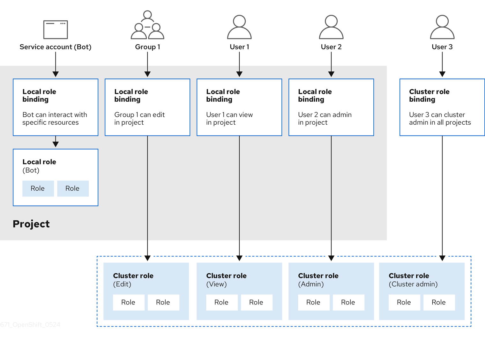

# Using RBAC to define and apply permissions { #using-rbac }

## RBAC overview { #authorization-overview_using-rbac }

You can use role-based access control to configure whether users and groups can perform specific actions on cluster or project resources by evaluating roles, rules, and bindings.

Role-based access control (RBAC) objects determine whether a user is allowed to perform a given action within a project.

Cluster administrators

can use the cluster roles and bindings to control who has various access levels to the OpenShift Container Platform platform itself and all projects.

Developers can use local roles and bindings to control who has access to their projects. Note that authorization is a separate step from authentication, which is more about determining the identity of who is taking the action.

Authorization is managed using:

| Authorization object | Description                                                                                                    |
| -------------------- | -------------------------------------------------------------------------------------------------------------- |
| Rules                | Sets of permitted verbs on a set of objects. For example, whether a user or service account can `create` pods. |
| Roles                | Collections of rules. You can associate, or bind, users and groups to multiple roles.                          |
| Bindings             | Associations between users and/or groups with a role.                                                          |

There are two levels of RBAC roles and bindings that control authorization:

| RBAC level   | Description                                                                                                                                                                  |
| ------------ | ---------------------------------------------------------------------------------------------------------------------------------------------------------------------------- |
| Cluster RBAC | Roles and bindings that are applicable across all projects. *Cluster roles* exist cluster-wide, and *cluster role bindings* can reference only cluster roles.                |
| Local RBAC   | Roles and bindings that are scoped to a given project. While *local roles* exist only in a single project, local role bindings can reference *both* cluster and local roles. |

A cluster role binding is a binding that exists at the cluster level. A role binding exists at the project level. The cluster role *view* must be bound to a user using a local role binding for that user to view the project. Create local roles only if a cluster role does not provide the set of permissions needed for a particular situation.

This two-level hierarchy allows reuse across multiple projects through the cluster roles while allowing customization inside of individual projects through local roles.

During evaluation, both the cluster role bindings and the local role bindings are used. For example:

1. Cluster-wide "allow" rules are checked.
2. Locally-bound "allow" rules are checked.
3. Deny by default.

### Default cluster roles { #default-roles_using-rbac }

OpenShift Container Platform includes a set of default cluster roles that you can bind to users and groups cluster-wide or locally.

!!! warning

    It is not recommended to manually modify the default cluster roles. Modifications to these system roles can prevent a cluster from functioning properly.

| Default cluster role | Description                                                                                                                                                                              |
| -------------------- | ---------------------------------------------------------------------------------------------------------------------------------------------------------------------------------------- |
| `admin`              | A project manager. If used in a local binding, an `admin` has rights to view any resource in the project and modify any resource in the project except for quota.                        |
| `basic-user`         | A user that can get basic information about projects and users.                                                                                                                          |
| `cluster-admin`      | A super-user that can perform any action in any project. When bound to a user with a local binding, they have full control over quota and every action on every resource in the project. |
| `cluster-status`     | A user that can get basic cluster status information.                                                                                                                                    |
| `cluster-reader`     | A user that can get or view most of the objects but cannot modify them.                                                                                                                  |
| `edit`               | A user that can modify most objects in a project but does not have the power to view or modify roles or bindings.                                                                        |
| `self-provisioner`   | A user that can create their own projects.                                                                                                                                               |
| `view`               | A user who cannot make any modifications, but can see most objects in a project. They cannot view or modify roles or bindings.                                                           |

Be mindful of the difference between local and cluster bindings. For example, if you bind the `cluster-admin` role to a user by using a local role binding, it might appear that this user has the privileges of a cluster administrator. This is not the case. Binding the `cluster-admin` to a user in a project grants super administrator privileges for only that project to the user. That user has the permissions of the cluster role `admin`, plus a few additional permissions like the ability to edit rate limits, for that project. This binding can be confusing via the web console UI, which does not list cluster role bindings that are bound to true cluster administrators. However, it does list local role bindings that you can use to locally bind `cluster-admin`.

The relationships between cluster roles, local roles, cluster role bindings, local role bindings, users, groups and service accounts are illustrated below.



!!! warning

    The `get pods/exec`, `get pods/*`, and `get *` rules grant execution privileges when they are applied to a role. Apply the principle of least privilege and assign only the minimal RBAC rights required for users and agents. For more information, see "RBAC rules allow execution privileges".

### Evaluating authorization { #evaluating-authorization_using-rbac }

OpenShift Container Platform evaluates authorization by using:

Identity
:   The user name and list of groups that the user belongs to.

Action
:   The action you perform. In most cases, this consists of:

    - **Project**: The project you access. A project is a Kubernetes namespace with additional annotations that allows a community of users to organize and manage their content in isolation from other communities.
    - **Verb** : The action itself:  `get`, `list`, `create`, `update`, `delete`, `deletecollection`, or `watch`.
    - **Resource name**: The API endpoint that you access.

Bindings
:   The full list of bindings, the associations between users or groups with a role.

OpenShift Container Platform evaluates authorization by using the following steps:

1. The identity and the project-scoped action is used to find all bindings that apply to the user or their groups.
2. Bindings are used to locate all the roles that apply.
3. Roles are used to find all the rules that apply.
4. The action is checked against each rule to find a match.
5. If no matching rule is found, the action is then denied by default.

!!! tip

    Remember that users and groups can be associated with, or bound to, multiple roles at the same time.

Project administrators can use the CLI to

view local roles and bindings, including a matrix of the verbs and resources each are associated with.

!!! warning

    The cluster role bound to the project administrator is limited in a project through a local binding. It is not bound cluster-wide like the cluster roles granted to the **cluster-admin** or **system:admin**.

    Cluster roles are roles defined at the cluster level but can be bound either at the cluster level or at the project level.

### Cluster role aggregation { #cluster-role-aggregations_using-rbac }

The default admin, edit, view, and cluster-reader cluster roles support cluster role aggregation, where the cluster rules for each role are dynamically updated as new rules are created. This feature is relevant only if you extend the Kubernetes API by creating custom resources.

**Additional resources**

- [RBAC rules allow execution privileges](https://access.redhat.com/solutions/6989997)
- [Aggregated ClusterRoles (Kubernetes documentation)](https://kubernetes.io/docs/reference/access-authn-authz/rbac/#aggregated-clusterroles)

## Projects and namespaces { #rbac-projects-namespaces_using-rbac }

You can use projects and namespaces to organize and isolate cluster resources. These resources provide boundaries for access control, policies, quotas, and service accounts.

A Kubernetes *namespace* provides a mechanism to scope resources in a cluster. The Kubernetes documentation has more information on namespaces.

Namespaces provide a unique scope for:

- Named resources to avoid basic naming collisions.
- Delegated management authority to trusted users.
- The ability to limit community resource consumption.

Most objects in the system are scoped by namespace, but some are excepted and have no namespace, including nodes and users.

A *project* is a Kubernetes namespace with additional annotations and is the central vehicle by which access to resources for regular users is managed. A project allows a community of users to organize and manage their content in isolation from other communities. Users must be given access to projects by administrators, or if allowed to create projects, automatically have access to their own projects.

Projects can have a separate `name`, `displayName`, and `description`.

- The mandatory `name` is a unique identifier for the project and is most visible when using the CLI tools or API. The maximum name length is 63 characters.
- The optional `displayName` is how the project is displayed in the web console (defaults to `name`).
- The optional `description` can be a more detailed description of the project and is also visible in the web console.

Each project scopes its own set of:

| Object             | Description                                                                          |
| ------------------ | ------------------------------------------------------------------------------------ |
| `Objects`          | Pods, services, replication controllers, etc.                                        |
| `Policies`         | Rules for which users can or cannot perform actions on objects.                      |
| `Constraints`      | Quotas for each kind of object that can be limited.                                  |
| `Service accounts` | Service accounts act automatically with designated access to objects in the project. |

Cluster administrators

can create projects and delegate administrative rights for the project to any member of the user community. Cluster administrators can also allow developers to create their own projects.

Developers and administrators can interact with projects by using the CLI or the web console.

**Additional resources**

- [Kubernetes documentation on namespaces](https://kubernetes.io/docs/tasks/administer-cluster/namespaces/)

## Default projects { #rbac-default-projects_using-rbac }

Default projects host critical cluster and infrastructure components. By understanding their purpose, you can avoid making changes that could disrupt essential cluster services.

OpenShift Container Platform includes several default projects, and projects starting with `openshift-` are the most essential to users. These projects host master components that run as pods and other infrastructure components. The pods created in these namespaces that have a critical pod annotation are considered critical, and they have guaranteed admission by kubelet. Pods created for master components in these namespaces are already marked as critical.

!!! warning

    Do not run workloads in or share access to default projects. Default projects are reserved for running core cluster components.

    The following default projects are considered highly privileged: `default`, `kube-public`, `kube-system`, `openshift`, `openshift-infra`, `openshift-node`, and other system-created projects that have the `openshift.io/run-level` label set to `0` or `1`. Functionality that relies on admission plugins, such as pod security admission, security context constraints, cluster resource quotas, and image reference resolution, does not work in highly privileged projects.

**Additional resources**

- [Guaranteed Scheduling For Critical Add-On Pods (Kubernetes documentation)](https://kubernetes.io/docs/tasks/administer-cluster/guaranteed-scheduling-critical-addon-pods/#rescheduler-guaranteed-scheduling-of-critical-add-ons)

## Viewing cluster roles and bindings { #viewing-cluster-roles_using-rbac }

You can view cluster roles and bindings by using the `oc` CLI to determine the permissions associated with roles and identify the users, groups, and service accounts assigned to them.

You can use the `oc` CLI to view cluster roles and bindings by using the `oc describe` command.

**Prerequisites**

- Install the `oc` CLI.
- Obtain permission to view the cluster roles and bindings.

Users with the `cluster-admin` default cluster role bound cluster-wide can perform any action on any resource, including viewing cluster roles and bindings.

**Procedure**

1. To view the cluster roles and their associated rule sets:

    ```terminal
    $ oc describe clusterrole.rbac
    ```

    ```terminal title="Example output"
    Name:         admin
    Labels:       kubernetes.io/bootstrapping=rbac-defaults
    Annotations:  rbac.authorization.kubernetes.io/autoupdate: true
    PolicyRule:
      Resources                                                  Non-Resource URLs  Resource Names  Verbs
      ---------                                                  -----------------  --------------  -----
      .packages.apps.redhat.com                                  []                 []              [* create update patch delete get list watch]
      imagestreams                                               []                 []              [create delete deletecollection get list patch update watch create get list watch]
      imagestreams.image.openshift.io                            []                 []              [create delete deletecollection get list patch update watch create get list watch]
      secrets                                                    []                 []              [create delete deletecollection get list patch update watch get list watch create delete deletecollection patch update]
      buildconfigs/webhooks                                      []                 []              [create delete deletecollection get list patch update watch get list watch]
      buildconfigs                                               []                 []              [create delete deletecollection get list patch update watch get list watch]
      buildlogs                                                  []                 []              [create delete deletecollection get list patch update watch get list watch]
      deploymentconfigs/scale                                    []                 []              [create delete deletecollection get list patch update watch get list watch]
      deploymentconfigs                                          []                 []              [create delete deletecollection get list patch update watch get list watch]
      imagestreamimages                                          []                 []              [create delete deletecollection get list patch update watch get list watch]
      imagestreammappings                                        []                 []              [create delete deletecollection get list patch update watch get list watch]
      imagestreamtags                                            []                 []              [create delete deletecollection get list patch update watch get list watch]
      processedtemplates                                         []                 []              [create delete deletecollection get list patch update watch get list watch]
      routes                                                     []                 []              [create delete deletecollection get list patch update watch get list watch]
      templateconfigs                                            []                 []              [create delete deletecollection get list patch update watch get list watch]
      templateinstances                                          []                 []              [create delete deletecollection get list patch update watch get list watch]
      templates                                                  []                 []              [create delete deletecollection get list patch update watch get list watch]
      deploymentconfigs.apps.openshift.io/scale                  []                 []              [create delete deletecollection get list patch update watch get list watch]
      deploymentconfigs.apps.openshift.io                        []                 []              [create delete deletecollection get list patch update watch get list watch]
      buildconfigs.build.openshift.io/webhooks                   []                 []              [create delete deletecollection get list patch update watch get list watch]
      buildconfigs.build.openshift.io                            []                 []              [create delete deletecollection get list patch update watch get list watch]
      buildlogs.build.openshift.io                               []                 []              [create delete deletecollection get list patch update watch get list watch]
      imagestreamimages.image.openshift.io                       []                 []              [create delete deletecollection get list patch update watch get list watch]
      imagestreammappings.image.openshift.io                     []                 []              [create delete deletecollection get list patch update watch get list watch]
      imagestreamtags.image.openshift.io                         []                 []              [create delete deletecollection get list patch update watch get list watch]
      routes.route.openshift.io                                  []                 []              [create delete deletecollection get list patch update watch get list watch]
      processedtemplates.template.openshift.io                   []                 []              [create delete deletecollection get list patch update watch get list watch]
      templateconfigs.template.openshift.io                      []                 []              [create delete deletecollection get list patch update watch get list watch]
      templateinstances.template.openshift.io                    []                 []              [create delete deletecollection get list patch update watch get list watch]
      templates.template.openshift.io                            []                 []              [create delete deletecollection get list patch update watch get list watch]
      serviceaccounts                                            []                 []              [create delete deletecollection get list patch update watch impersonate create delete deletecollection patch update get list watch]
      imagestreams/secrets                                       []                 []              [create delete deletecollection get list patch update watch]
      rolebindings                                               []                 []              [create delete deletecollection get list patch update watch]
      roles                                                      []                 []              [create delete deletecollection get list patch update watch]
      rolebindings.authorization.openshift.io                    []                 []              [create delete deletecollection get list patch update watch]
      roles.authorization.openshift.io                           []                 []              [create delete deletecollection get list patch update watch]
      imagestreams.image.openshift.io/secrets                    []                 []              [create delete deletecollection get list patch update watch]
      rolebindings.rbac.authorization.k8s.io                     []                 []              [create delete deletecollection get list patch update watch]
      roles.rbac.authorization.k8s.io                            []                 []              [create delete deletecollection get list patch update watch]
      networkpolicies.extensions                                 []                 []              [create delete deletecollection patch update create delete deletecollection get list patch update watch get list watch]
      networkpolicies.networking.k8s.io                          []                 []              [create delete deletecollection patch update create delete deletecollection get list patch update watch get list watch]
      configmaps                                                 []                 []              [create delete deletecollection patch update get list watch]
      endpoints                                                  []                 []              [create delete deletecollection patch update get list watch]
      persistentvolumeclaims                                     []                 []              [create delete deletecollection patch update get list watch]
      pods                                                       []                 []              [create delete deletecollection patch update get list watch]
      replicationcontrollers/scale                               []                 []              [create delete deletecollection patch update get list watch]
      replicationcontrollers                                     []                 []              [create delete deletecollection patch update get list watch]
      services                                                   []                 []              [create delete deletecollection patch update get list watch]
      daemonsets.apps                                            []                 []              [create delete deletecollection patch update get list watch]
      deployments.apps/scale                                     []                 []              [create delete deletecollection patch update get list watch]
      deployments.apps                                           []                 []              [create delete deletecollection patch update get list watch]
      replicasets.apps/scale                                     []                 []              [create delete deletecollection patch update get list watch]
      replicasets.apps                                           []                 []              [create delete deletecollection patch update get list watch]
      statefulsets.apps/scale                                    []                 []              [create delete deletecollection patch update get list watch]
      statefulsets.apps                                          []                 []              [create delete deletecollection patch update get list watch]
      horizontalpodautoscalers.autoscaling                       []                 []              [create delete deletecollection patch update get list watch]
      cronjobs.batch                                             []                 []              [create delete deletecollection patch update get list watch]
      jobs.batch                                                 []                 []              [create delete deletecollection patch update get list watch]
      daemonsets.extensions                                      []                 []              [create delete deletecollection patch update get list watch]
      deployments.extensions/scale                               []                 []              [create delete deletecollection patch update get list watch]
      deployments.extensions                                     []                 []              [create delete deletecollection patch update get list watch]
      ingresses.extensions                                       []                 []              [create delete deletecollection patch update get list watch]
      replicasets.extensions/scale                               []                 []              [create delete deletecollection patch update get list watch]
      replicasets.extensions                                     []                 []              [create delete deletecollection patch update get list watch]
      replicationcontrollers.extensions/scale                    []                 []              [create delete deletecollection patch update get list watch]
      poddisruptionbudgets.policy                                []                 []              [create delete deletecollection patch update get list watch]
      deployments.apps/rollback                                  []                 []              [create delete deletecollection patch update]
      deployments.extensions/rollback                            []                 []              [create delete deletecollection patch update]
      catalogsources.operators.coreos.com                        []                 []              [create update patch delete get list watch]
      clusterserviceversions.operators.coreos.com                []                 []              [create update patch delete get list watch]
      installplans.operators.coreos.com                          []                 []              [create update patch delete get list watch]
      packagemanifests.operators.coreos.com                      []                 []              [create update patch delete get list watch]
      subscriptions.operators.coreos.com                         []                 []              [create update patch delete get list watch]
      buildconfigs/instantiate                                   []                 []              [create]
      buildconfigs/instantiatebinary                             []                 []              [create]
      builds/clone                                               []                 []              [create]
      deploymentconfigrollbacks                                  []                 []              [create]
      deploymentconfigs/instantiate                              []                 []              [create]
      deploymentconfigs/rollback                                 []                 []              [create]
      imagestreamimports                                         []                 []              [create]
      localresourceaccessreviews                                 []                 []              [create]
      localsubjectaccessreviews                                  []                 []              [create]
      podsecuritypolicyreviews                                   []                 []              [create]
      podsecuritypolicyselfsubjectreviews                        []                 []              [create]
      podsecuritypolicysubjectreviews                            []                 []              [create]
      resourceaccessreviews                                      []                 []              [create]
      routes/custom-host                                         []                 []              [create]
      subjectaccessreviews                                       []                 []              [create]
      subjectrulesreviews                                        []                 []              [create]
      deploymentconfigrollbacks.apps.openshift.io                []                 []              [create]
      deploymentconfigs.apps.openshift.io/instantiate            []                 []              [create]
      deploymentconfigs.apps.openshift.io/rollback               []                 []              [create]
      localsubjectaccessreviews.authorization.k8s.io             []                 []              [create]
      localresourceaccessreviews.authorization.openshift.io      []                 []              [create]
      localsubjectaccessreviews.authorization.openshift.io       []                 []              [create]
      resourceaccessreviews.authorization.openshift.io           []                 []              [create]
      subjectaccessreviews.authorization.openshift.io            []                 []              [create]
      subjectrulesreviews.authorization.openshift.io             []                 []              [create]
      buildconfigs.build.openshift.io/instantiate                []                 []              [create]
      buildconfigs.build.openshift.io/instantiatebinary          []                 []              [create]
      builds.build.openshift.io/clone                            []                 []              [create]
      imagestreamimports.image.openshift.io                      []                 []              [create]
      routes.route.openshift.io/custom-host                      []                 []              [create]
      podsecuritypolicyreviews.security.openshift.io             []                 []              [create]
      podsecuritypolicyselfsubjectreviews.security.openshift.io  []                 []              [create]
      podsecuritypolicysubjectreviews.security.openshift.io      []                 []              [create]
      jenkins.build.openshift.io                                 []                 []              [edit view view admin edit view]
      builds                                                     []                 []              [get create delete deletecollection get list patch update watch get list watch]
      builds.build.openshift.io                                  []                 []              [get create delete deletecollection get list patch update watch get list watch]
      projects                                                   []                 []              [get delete get delete get patch update]
      projects.project.openshift.io                              []                 []              [get delete get delete get patch update]
      namespaces                                                 []                 []              [get get list watch]
      pods/attach                                                []                 []              [get list watch create delete deletecollection patch update]
      pods/exec                                                  []                 []              [get list watch create delete deletecollection patch update]
      pods/portforward                                           []                 []              [get list watch create delete deletecollection patch update]
      pods/proxy                                                 []                 []              [get list watch create delete deletecollection patch update]
      services/proxy                                             []                 []              [get list watch create delete deletecollection patch update]
      routes/status                                              []                 []              [get list watch update]
      routes.route.openshift.io/status                           []                 []              [get list watch update]
      appliedclusterresourcequotas                               []                 []              [get list watch]
      bindings                                                   []                 []              [get list watch]
      builds/log                                                 []                 []              [get list watch]
      deploymentconfigs/log                                      []                 []              [get list watch]
      deploymentconfigs/status                                   []                 []              [get list watch]
      events                                                     []                 []              [get list watch]
      imagestreams/status                                        []                 []              [get list watch]
      limitranges                                                []                 []              [get list watch]
      namespaces/status                                          []                 []              [get list watch]
      pods/log                                                   []                 []              [get list watch]
      pods/status                                                []                 []              [get list watch]
      replicationcontrollers/status                              []                 []              [get list watch]
      resourcequotas/status                                      []                 []              [get list watch]
      resourcequotas                                             []                 []              [get list watch]
      resourcequotausages                                        []                 []              [get list watch]
      rolebindingrestrictions                                    []                 []              [get list watch]
      deploymentconfigs.apps.openshift.io/log                    []                 []              [get list watch]
      deploymentconfigs.apps.openshift.io/status                 []                 []              [get list watch]
      controllerrevisions.apps                                   []                 []              [get list watch]
      rolebindingrestrictions.authorization.openshift.io         []                 []              [get list watch]
      builds.build.openshift.io/log                              []                 []              [get list watch]
      imagestreams.image.openshift.io/status                     []                 []              [get list watch]
      appliedclusterresourcequotas.quota.openshift.io            []                 []              [get list watch]
      imagestreams/layers                                        []                 []              [get update get]
      imagestreams.image.openshift.io/layers                     []                 []              [get update get]
      builds/details                                             []                 []              [update]
      builds.build.openshift.io/details                          []                 []              [update]


    Name:         basic-user
    Labels:       <none>
    Annotations:  openshift.io/description: A user that can get basic information about projects.
    	              rbac.authorization.kubernetes.io/autoupdate: true
    PolicyRule:
    	Resources                                           Non-Resource URLs  Resource Names  Verbs
    	  ---------                                           -----------------  --------------  -----
    	  selfsubjectrulesreviews                             []                 []              [create]
    	  selfsubjectaccessreviews.authorization.k8s.io       []                 []              [create]
    	  selfsubjectrulesreviews.authorization.openshift.io  []                 []              [create]
    	  clusterroles.rbac.authorization.k8s.io              []                 []              [get list watch]
    	  clusterroles                                        []                 []              [get list]
    	  clusterroles.authorization.openshift.io             []                 []              [get list]
    	  storageclasses.storage.k8s.io                       []                 []              [get list]
    	  users                                               []                 [~]             [get]
    	  users.user.openshift.io                             []                 [~]             [get]
    	  projects                                            []                 []              [list watch]
    	  projects.project.openshift.io                       []                 []              [list watch]
    	  projectrequests                                     []                 []              [list]
    	  projectrequests.project.openshift.io                []                 []              [list]

    Name:         cluster-admin
    Labels:       kubernetes.io/bootstrapping=rbac-defaults
    Annotations:  rbac.authorization.kubernetes.io/autoupdate: true
    PolicyRule:
    Resources  Non-Resource URLs  Resource Names  Verbs
    ---------  -----------------  --------------  -----
    *.*        []                 []              [*]
               [*]                []              [*]

    ...
    ```

2. To view the current set of cluster role bindings, which shows the users and groups that are bound to various roles:

    ```terminal
    $ oc describe clusterrolebinding.rbac
    ```

    ```terminal title="Example output"
    Name:         alertmanager-main
    Labels:       <none>
    Annotations:  <none>
    Role:
      Kind:  ClusterRole
      Name:  alertmanager-main
    Subjects:
      Kind            Name               Namespace
      ----            ----               ---------
      ServiceAccount  alertmanager-main  openshift-monitoring


    Name:         basic-users
    Labels:       <none>
    Annotations:  rbac.authorization.kubernetes.io/autoupdate: true
    Role:
      Kind:  ClusterRole
      Name:  basic-user
    Subjects:
      Kind   Name                  Namespace
      ----   ----                  ---------
      Group  system:authenticated


    Name:         cloud-credential-operator-rolebinding
    Labels:       <none>
    Annotations:  <none>
    Role:
      Kind:  ClusterRole
      Name:  cloud-credential-operator-role
    Subjects:
      Kind            Name     Namespace
      ----            ----     ---------
      ServiceAccount  default  openshift-cloud-credential-operator


    Name:         cluster-admin
    Labels:       kubernetes.io/bootstrapping=rbac-defaults
    Annotations:  rbac.authorization.kubernetes.io/autoupdate: true
    Role:
      Kind:  ClusterRole
      Name:  cluster-admin
    Subjects:
      Kind   Name            Namespace
      ----   ----            ---------
      Group  system:masters


    Name:         cluster-admins
    Labels:       <none>
    Annotations:  rbac.authorization.kubernetes.io/autoupdate: true
    Role:
      Kind:  ClusterRole
      Name:  cluster-admin
    Subjects:
      Kind   Name                   Namespace
      ----   ----                   ---------
      Group  system:cluster-admins
      User   system:admin


    Name:         cluster-api-manager-rolebinding
    Labels:       <none>
    Annotations:  <none>
    Role:
      Kind:  ClusterRole
      Name:  cluster-api-manager-role
    Subjects:
      Kind            Name     Namespace
      ----            ----     ---------
      ServiceAccount  default  openshift-machine-api

    ...
    ```

## Viewing local roles and bindings { #viewing-local-roles_using-rbac }

You can view local role bindings by using the `oc` CLI to identify the users, groups, and service accounts that have roles within the current project or another project.

You can use the `oc` CLI to view local roles and bindings by using the `oc describe` command.

**Prerequisites**

- Install the `oc` CLI.

- Obtain permission to view the local roles and bindings:

    - Users with the `cluster-admin` default cluster role bound cluster-wide can perform any action on any resource, including viewing local roles and bindings.
    - Users with the `admin` default cluster role bound locally can view and manage roles and bindings in that project.

**Procedure**

1. To view the current set of local role bindings, which show the users and groups that are bound to various roles for the current project:

    ```terminal
    $ oc describe rolebinding.rbac
    ```

2. To view the local role bindings for a different project, add the `-n` flag to the command:

    ```terminal
    $ oc describe rolebinding.rbac -n joe-project
    ```

    ```terminal title="Example output"
    Name:         admin
    Labels:       <none>
    Annotations:  <none>
    Role:
      Kind:  ClusterRole
      Name:  admin
    Subjects:
      Kind  Name        Namespace
      ----  ----        ---------
      User  kube:admin


    Name:         system:deployers
    Labels:       <none>
    Annotations:  openshift.io/description:
                    Allows deploymentconfigs in this namespace to rollout pods in
                    this namespace.  It is auto-managed by a controller; remove
                    subjects to disa...
    Role:
      Kind:  ClusterRole
      Name:  system:deployer
    Subjects:
      Kind            Name      Namespace
      ----            ----      ---------
      ServiceAccount  deployer  joe-project


    Name:         system:image-builders
    Labels:       <none>
    Annotations:  openshift.io/description:
                    Allows builds in this namespace to push images to this
                    namespace.  It is auto-managed by a controller; remove subjects
                    to disable.
    Role:
      Kind:  ClusterRole
      Name:  system:image-builder
    Subjects:
      Kind            Name     Namespace
      ----            ----     ---------
      ServiceAccount  builder  joe-project


    Name:         system:image-pullers
    Labels:       <none>
    Annotations:  openshift.io/description:
                    Allows all pods in this namespace to pull images from this
                    namespace.  It is auto-managed by a controller; remove subjects
                    to disable.
    Role:
      Kind:  ClusterRole
      Name:  system:image-puller
    Subjects:
      Kind   Name                                Namespace
      ----   ----                                ---------
      Group  system:serviceaccounts:joe-project
    ```

## Adding roles to users { #adding-roles_using-rbac }

To grant a user access within a project, you can bind an appropriate role to the user and verify the resulting role binding.

You can use the `oc adm` administrator CLI to manage the roles and bindings.

Binding, or adding, a role to users or groups gives the user or group the access that is granted by the role. You can add and remove roles to and from users and groups using `oc adm policy` commands.

You can bind any of the default cluster roles to local users or groups in your project.

**Procedure**

1. Add a role to a user in a specific project:

    ```terminal
    $ oc adm policy add-role-to-user <role> <user> -n <project>
    ```

    For example, you can add the `admin` role to the `alice` user in `joe` project by running:

    ```terminal
    $ oc adm policy add-role-to-user admin alice -n joe
    ```

    !!! tip

        You can alternatively apply the following YAML to add the role to the user:

        ```yaml
        apiVersion: rbac.authorization.k8s.io/v1
        kind: RoleBinding
        metadata:
          name: admin-0
          namespace: joe
        roleRef:
          apiGroup: rbac.authorization.k8s.io
          kind: ClusterRole
          name: admin
        subjects:
        - apiGroup: rbac.authorization.k8s.io
          kind: User
          name: alice
        ```

2. View the local role bindings and verify the addition in the output:

    ```terminal
    $ oc describe rolebinding.rbac -n <project>
    ```

    For example, to view the local role bindings for the `joe` project:

    ```terminal
    $ oc describe rolebinding.rbac -n joe
    ```

    ```terminal title="Example output"

    Name:         admin
    Labels:       <none>
    Annotations:  <none>
    Role:
      Kind:  ClusterRole
      Name:  admin
    Subjects:
      Kind  Name        Namespace
      ----  ----        ---------
      User  kube:admin


    Name:         admin-0
    Labels:       <none>
    Annotations:  <none>
    Role:
      Kind:  ClusterRole
      Name:  admin
    Subjects:
      Kind  Name   Namespace
      ----  ----   ---------
      User  alice


    Name:         system:deployers
    Labels:       <none>
    Annotations:  openshift.io/description:
                    Allows deploymentconfigs in this namespace to rollout pods in
                    this namespace.  It is auto-managed by a controller; remove
                    subjects to disa...
    Role:
      Kind:  ClusterRole
      Name:  system:deployer
    Subjects:
      Kind            Name      Namespace
      ----            ----      ---------
      ServiceAccount  deployer  joe


    Name:         system:image-builders
    Labels:       <none>
    Annotations:  openshift.io/description:
                    Allows builds in this namespace to push images to this
                    namespace.  It is auto-managed by a controller; remove subjects
                    to disable.
    Role:
      Kind:  ClusterRole
      Name:  system:image-builder
    Subjects:
      Kind            Name     Namespace
      ----            ----     ---------
      ServiceAccount  builder  joe


    Name:         system:image-pullers
    Labels:       <none>
    Annotations:  openshift.io/description:
                    Allows all pods in this namespace to pull images from this
                    namespace.  It is auto-managed by a controller; remove subjects
                    to disable.
    Role:
      Kind:  ClusterRole
      Name:  system:image-puller
    Subjects:
      Kind   Name                                Namespace
      ----   ----                                ---------
      Group  system:serviceaccounts:joe
    ```

    The `alice` user has been added to the `admins` `RoleBinding`.

## Creating a local role { #creating-local-role_using-rbac }

You can create a local role and bind it to a user to define custom permissions within a project.

**Procedure**

1. To create a local role for a project, run the following command:

    ```terminal
    $ oc create role <name> --verb=<verb> --resource=<resource> -n <project>
    ```

    In this command, specify:

    - `<name>`, the local role’s name
    - `<verb>`, a comma-separated list of the verbs to apply to the role
    - `<resource>`, the resources that the role applies to
    - `<project>`, the project name

    For example, to create a local role that allows a user to view pods in the `blue` project, run the following command:

    ```terminal
    $ oc create role podview --verb=get --resource=pod -n blue
    ```

2. To bind the new role to a user, run the following command:

    ```terminal
    $ oc adm policy add-role-to-user podview user2 --role-namespace=blue -n blue
    ```

## Creating a cluster role { #creating-cluster-role_using-rbac }

To define custom cluster-wide permissions, you can create a cluster role that specifies the verbs and resources users can access.

**Procedure**

- To create a cluster role, run the following command:

    ```terminal
    $ oc create clusterrole <name> --verb=<verb> --resource=<resource>
    ```

    In this command, specify:

    - `<name>`, the local role’s name
    - `<verb>`, a comma-separated list of the verbs to apply to the role
    - `<resource>`, the resources that the role applies to

    For example, to create a cluster role that allows a user to view pods, run the following command:

    ```terminal
    $ oc create clusterrole podviewonly --verb=get --resource=pod
    ```

## Local role binding commands { #local-role-binding-commands_using-rbac }

You can use local role binding commands to review, grant, or remove user and group permissions within the current or a specified project.

When you manage a user or group’s associated roles for local role bindings using the following operations, a project may be specified with the `-n` flag. If it is not specified, then the current project is used.

You can use the following commands for local RBAC management.

**Local role binding operations**

| Command                                                         | Description                                                             |
| --------------------------------------------------------------- | ----------------------------------------------------------------------- |
| `$ oc adm policy who-can _<verb>_ _<resource>_`                 | Indicates which users can perform an action on a resource.              |
| `$ oc adm policy add-role-to-user _<role>_ _<username>_`        | Binds a specified role to specified users in the current project.       |
| `$ oc adm policy remove-role-from-user _<role>_ _<username>_`   | Removes a given role from specified users in the current project.       |
| `$ oc adm policy remove-user _<username>_`                      | Removes specified users and all of their roles in the current project.  |
| `$ oc adm policy add-role-to-group _<role>_ _<groupname>_`      | Binds a given role to specified groups in the current project.          |
| `$ oc adm policy remove-role-from-group _<role>_ _<groupname>_` | Removes a given role from specified groups in the current project.      |
| `$ oc adm policy remove-group _<groupname>_`                    | Removes specified groups and all of their roles in the current project. |

## Cluster role binding commands { #cluster-role-binding-commands_using-rbac }

You can use cluster role binding commands to grant or remove roles for users and groups across all projects in the cluster.

You can also manage cluster role bindings using the following operations. The `-n` flag is not used for these operations because cluster role bindings use non-namespaced resources.

**Cluster role binding operations**

| Command                                                                 | Description                                                                 |
| ----------------------------------------------------------------------- | --------------------------------------------------------------------------- |
| `$ oc adm policy add-cluster-role-to-user _<role>_ _<username>_`        | Binds a given role to specified users for all projects in the cluster.      |
| `$ oc adm policy remove-cluster-role-from-user _<role>_ _<username>_`   | Removes a given role from specified users for all projects in the cluster.  |
| `$ oc adm policy add-cluster-role-to-group _<role>_ _<groupname>_`      | Binds a given role to specified groups for all projects in the cluster.     |
| `$ oc adm policy remove-cluster-role-from-group _<role>_ _<groupname>_` | Removes a given role from specified groups for all projects in the cluster. |

## Creating a cluster admin { #creating-cluster-admin_using-rbac }

To grant a user full administrative access to the cluster, you can bind the `cluster-admin` cluster role to that user.

The `cluster-admin` role is required to perform administrator level tasks on the OpenShift Container Platform cluster, such as modifying cluster resources.

**Prerequisites**

- You must have created a user to define as the cluster admin.

**Procedure**

- Define the user as a cluster admin:

    ```terminal
    $ oc adm policy add-cluster-role-to-user cluster-admin <user>
    ```

## Cluster role bindings for unauthenticated groups { #unauthenticated-users-cluster-role-bindings-concept_using-rbac }

Unauthenticated groups do not have default access to cluster roles. As a cluster administrator, you can grant limited unauthenticated access when required, while ensuring that the change complies with organizational security standards.

!!! note

    Before OpenShift Container Platform 4.17, unauthenticated groups were allowed access to some cluster roles. Clusters updated from versions before OpenShift Container Platform 4.17 retain this access for unauthenticated groups.

For security reasons OpenShift Container Platform 4.22 does not allow unauthenticated groups to have default access to cluster roles.

There are use cases where it might be necessary to add `system:unauthenticated` to a cluster role.

Cluster administrators can add unauthenticated users to the following cluster roles:

- `system:scope-impersonation`
- `system:webhook`
- `system:oauth-token-deleter`
- `self-access-reviewer`

!!! warning

    Always verify compliance with your organization’s security standards when modifying unauthenticated access.
