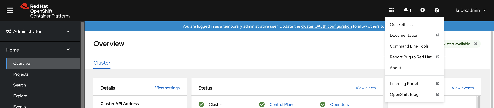
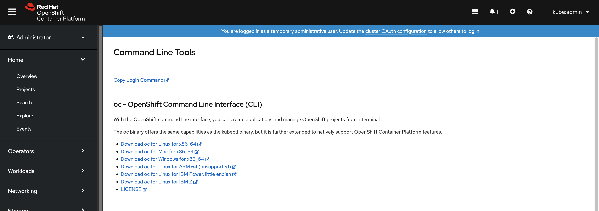

# Getting started with the OpenShift CLI { #cli-getting-started }

Install and configure the OpenShift CLI (`oc`) to manage OpenShift Container Platform clusters and deploy applications directly from a terminal.

## About the OpenShift CLI { #cli-about-cli_cli-developer-commands }

With the OpenShift CLI (`oc`), you can create applications and manage OpenShift Container Platform projects from a terminal.

The OpenShift CLI is ideal in the following situations:

- Working directly with project source code.
- Scripting OpenShift Container Platform operations
- Managing projects while restricted by bandwidth resources and the web console is unavailable.

## Installing the OpenShift CLI { #cli-installing-cli_cli-developer-commands }

To interact with a OpenShift Container Platform cluster from the terminal, install the OpenShift CLI (`oc`). Depending on your operating system, you can install `oc` by downloading the binary from the Customer Portal or OpenShift Container Platform web console, by using an RPM, or by using Homebrew.

### Installing the OpenShift CLI by downloading the binary from the Customer Portal { #cli-installing-cli-portal_cli-developer-commands }

You can download the OpenShift CLI (`oc`) from the Customer Portal and install it to interact with OpenShift Container Platform clusters from a terminal on Linux, Windows, or macOS.

#### Installing the OpenShift CLI on Linux { #cli-installing-cli-linux_cli-developer-commands }

To manage your cluster and deploy applications from the command line on Linux, install the OpenShift CLI (`oc`) binary. You can download the OpenShift CLI (`oc`) from the Red  Customer Portal.

!!! warning

    If you installed an earlier version of `oc`, you cannot use it to complete all of the commands in OpenShift Container Platform.

    Download and install the new version of `oc`.

**Procedure**

1. Navigate to the [Download OpenShift Container Platform](https://access.redhat.com/downloads/content/290) page on the Red Hat Customer Portal.

2. Select the architecture from the **Product Variant** list.

3. Select the appropriate version from the **Version** list.

4. Click **Download Now** next to the **OpenShift v4.22 Linux Clients** entry and save the file.

5. Unpack the archive:

    ```terminal
    $ tar xvf <file>
    ```

6. Place the `oc` binary in a directory that is on your `PATH`.

    To check your `PATH`, execute the following command:

    ```terminal
    $ echo $PATH
    ```

**Verification**

- After you install the OpenShift CLI, it is available using the `oc` command:

    ```terminal
    $ oc <command>
    ```

#### Installing the OpenShift CLI on Windows { #cli-installing-cli-windows_cli-developer-commands }

To manage your cluster and deploy applications from the command line on Windows, install the OpenShift CLI (`oc`) binary. You can download the OpenShift CLI (`oc`) from the Red  Customer Portal.

!!! warning

    If you installed an earlier version of `oc`, you cannot use it to complete all of the commands in OpenShift Container Platform.

    Download and install the new version of `oc`.

**Procedure**

1. Navigate to the [Download OpenShift Container Platform](https://access.redhat.com/downloads/content/290) page on the Red Hat Customer Portal.

2. Select the appropriate version from the **Version** list.

3. Click **Download Now** next to the **OpenShift v4.22 Windows Client** entry and save the file.

4. Extract the archive with a ZIP program.

5. Move the `oc` binary to a directory that is on your `PATH` variable.

    To check your `PATH` variable, open the command prompt and execute the following command:

    ```terminal
    C:\> path
    ```

**Verification**

- After you install the OpenShift CLI, it is available using the `oc` command:

    ```terminal
    C:\> oc <command>
    ```

#### Installing the OpenShift CLI on macOS { #cli-installing-cli-macos_cli-developer-commands }

To manage your cluster and deploy applications from the command line on macOS, install the OpenShift CLI (`oc`) binary. You can download the OpenShift CLI (`oc`) from the Red  Customer Portal.

!!! warning

    If you installed an earlier version of `oc`, you cannot use it to complete all of the commands in OpenShift Container Platform.

    Download and install the new version of `oc`.

**Procedure**

1. Navigate to the [Download OpenShift Container Platform](https://access.redhat.com/downloads/content/290) page on the Red Hat Customer Portal.

2. Select the architecture from the **Product Variant** list.

3. Select the appropriate version from the **Version** list.

4. Click **Download Now** next to the **OpenShift v4.22 macOS Clients** entry and save the file.

    !!! note

        For macOS arm64, choose the **OpenShift v4.22 macOS arm64 Client** entry.

5. Unpack and unzip the archive.

6. Move the `oc` binary to a directory on your `PATH` variable.

    To check your `PATH` variable, open a terminal and execute the following command:

    ```terminal
    $ echo $PATH
    ```

**Verification**

- Verify your installation by using an `oc` command:

    ```terminal
    $ oc <command>
    ```

### Installing the OpenShift CLI by downloading the binary from the web console { #cli-installing-cli-web-console_cli-developer-commands }

You can download the OpenShift CLI (`oc`) from the web OpenShift Container Platform console and install it to interact with OpenShift Container Platform clusters from a terminal on Linux, Windows, or macOS.

!!! warning

    If you installed an earlier version of `oc`, you cannot use it to complete all of the commands in OpenShift Container Platform 4.22. Download and install the new version of `oc`.

#### Installing the OpenShift CLI on Linux using the web console { #cli-installing-cli-web-console-macos-linux_cli-developer-commands }

To manage your cluster and deploy applications from the command line on Linux, install the OpenShift CLI (`oc`) binary. You can download the OpenShift CLI (`oc`) from the web console.

**Procedure**

1. From the web console, click **?**. 

2. Click **Command Line Tools**. 

3. Select appropriate `oc` binary for your Linux platform, and then click **Download oc for Linux**.

4. Save the file.

5. Unpack the archive.

    ```terminal
    $ tar xvf <file>
    ```

6. Move the `oc` binary to a directory that is on your `PATH`.

    To check your `PATH`, execute the following command:

    ```terminal
    $ echo $PATH
    ```

**Verification**

- After you install the OpenShift CLI, you can use the `oc` command:

    ```terminal
    $ oc <command>
    ```

#### Installing the OpenShift CLI on Windows using the web console { #cli-installing-cli-web-console-macos-windows_cli-developer-commands }

To manage your cluster and deploy applications from the command line on Windows, install the OpenShift CLI (`oc`) binary. You can download the OpenShift CLI (`oc`) from the web console.

**Procedure**

1. From the web console, click **?**. 

2. Click **Command Line Tools**. 

3. Select the `oc` binary for Windows platform, and then click **Download oc for Windows for x86_64**.

4. Save the file.

5. Unzip the archive with a ZIP program.

6. Move the `oc` binary to a directory that is on your `PATH`.

    To check your `PATH`, open the command prompt and execute the following command:

    ```terminal
    C:\> path
    ```

**Verification**

- After you install the OpenShift CLI, you can use the `oc` command:

    ```terminal
    C:\> oc <command>
    ```

#### Installing the OpenShift CLI on macOS using the web console { #cli-installing-cli-web-console-macos_cli-developer-commands }

To manage your cluster and deploy applications from the command line on macOS, install the OpenShift CLI (`oc`) binary. You can download the OpenShift CLI (`oc`) from the web console.

**Procedure**

1. From the web console, click **?**. 

2. Click **Command Line Tools**. 

3. Select the `oc` binary for macOS platform, and then click **Download oc for Mac for x86_64**.

    !!! note

        For macOS arm64, click **Download oc for Mac for ARM 64**.

4. Save the file.

5. Unpack and unzip the archive.

6. Move the `oc` binary to a directory on your PATH.

    To check your `PATH`, open a terminal and execute the following command:

    ```terminal
    $ echo $PATH
    ```

**Verification**

- After you install the OpenShift CLI, you can use the `oc` command:

    ```terminal
    $ oc <command>
    ```

### Installing the OpenShift CLI by using an RPM { #cli-installing-cli-rpm_cli-developer-commands }

For Red Hat Enterprise Linux (RHEL), you can install the OpenShift CLI (`oc`) as an RPM if you have an active OpenShift Container Platform subscription on your Red Hat account.

!!! warning

    You must install `oc` for RHEL 9 by downloading the binary. Installing `oc` by using an RPM package is not supported on Red Hat Enterprise Linux (RHEL) 9.

**Prerequisites**

- You must have root or sudo privileges.

**Procedure**

1. Register with Red Hat Subscription Manager:

    ```terminal
    # subscription-manager register
    ```

2. Pull the latest subscription data:

    ```terminal
    # subscription-manager refresh
    ```

3. List the available subscriptions:

    ```terminal
    # subscription-manager list --available --matches '*OpenShift*'
    ```

4. In the output for the previous command, find the pool ID for an OpenShift Container Platform subscription and attach the subscription to the registered system:

    ```terminal
    # subscription-manager attach --pool=<pool_id>
    ```

5. Enable the repositories required by OpenShift Container Platform 4.22.

    ```terminal
    # subscription-manager repos --enable="rhocp-4.22-for-rhel-8-x86_64-rpms"
    ```

6. Install the `openshift-clients` package:

    ```terminal
    # yum install openshift-clients
    ```

**Verification**

- Verify your installation by using an `oc` command:

    ```terminal
    $ oc <command>
    ```

### Installing the OpenShift CLI by using Homebrew { #cli-installing-cli-brew_cli-developer-commands }

For macOS, you can install the OpenShift CLI (`oc`) by using the [Homebrew](https://brew.sh) package manager.

**Prerequisites**

- You must have Homebrew (`brew`) installed.

**Procedure**

- Install the [openshift-cli](https://formulae.brew.sh/formula/openshift-cli) package by running the following command:

    ```terminal
    $ brew install openshift-cli
    ```

**Verification**

- Verify your installation by using an `oc` command:

    ```terminal
    $ oc <command>
    ```

## Logging in to the OpenShift CLI { #cli-logging-in_cli-developer-commands }

You can log in to the OpenShift CLI (`oc`) to access and manage your cluster.

!!! note

    To access a cluster that is accessible only over an HTTP proxy server, you can set the `HTTP_PROXY`, `HTTPS_PROXY` and `NO_PROXY` variables. These environment variables are respected by the `oc` CLI so that all communication with the cluster goes through the HTTP proxy.

    Authentication headers are sent only when using HTTPS transport.

**Prerequisites**

- You must have access to a OpenShift Container Platform cluster.
- The OpenShift CLI (`oc`) is installed.

**Procedure**

1. Enter the `oc login` command and pass in a user name:

    ```terminal
    $ oc login -u user1
    ```

2. When prompted, enter the required information:

    ```terminal title="Example output"
    Server [https://localhost:8443]: https://openshift.example.com:6443
    The server uses a certificate signed by an unknown authority.
    You can bypass the certificate check, but any data you send to the server could be intercepted by others.
    Use insecure connections? (y/n): y

    Authentication required for https://openshift.example.com:6443 (openshift)
    Username: user1
    Password:
    Login successful.

    You don't have any projects. You can try to create a new project, by running

        oc new-project <projectname>

    Welcome! See 'oc help' to get started.
    ```

    - For the `Server` prompt, enter the OpenShift Container Platform server URL.
    - For the `Use insecure connections?` prompt, enter whether to use insecure connections.
    - For the `Username` prompt, enter the username to log in with.
    - For the `Password` prompt, enter the user’s password.

    !!! note

        If you are logged in to the web console, you can generate an `oc login` command that includes your token and server information. You can use the command to log in to the OpenShift CLI (`oc`) without the interactive prompts. To generate the command, select **Copy login command** from the username drop-down menu at the top right of the web console.

    You can now create a project or issue other commands for managing your cluster.

## Logging in to the OpenShift CLI using a web browser { #cli-logging-in-web_cli-developer-commands }

You can log in to the OpenShift CLI (`oc`) with the help of a web browser to access and manage your cluster. This allows you to avoid inserting your access token into the command line.

!!! warning

    Logging in to the CLI through the web browser runs a server on localhost with HTTP, not HTTPS; use with caution on multi-user workstations.

**Prerequisites**

- You must have access to an OpenShift Container Platform cluster.
- You must have installed the OpenShift CLI (`oc`).
- You must have a browser installed.

**Procedure**

1. Enter the `oc login` command with the `--web` flag:

    ```terminal
    $ oc login <cluster_url> --web
    ```

    Optionally, you can specify the server URL and callback port. For example, `oc login <cluster_url> --web --callback-port 8280 localhost:8443`.

2. The web browser opens automatically. If it does not, click the link in the command output. If you do not specify the OpenShift Container Platform server `oc` tries to open the web console of the cluster specified in the current `oc` configuration file. If no `oc` configuration exists, `oc` prompts interactively for the server URL.

    ```terminal title="Example output"
    Opening login URL in the default browser: https://openshift.example.com
    Opening in existing browser session.
    ```

3. If more than one identity provider is available, select your choice from the options provided.

4. Enter your username and password into the corresponding browser fields. After you are logged in, the browser displays the text `access token received successfully; please return to your terminal`.

5. Check the CLI for a login confirmation.

    ```terminal title="Example output"
    Login successful.

    You don't have any projects. You can try to create a new project, by running

        oc new-project <projectname>
    ```

    !!! note

        The web console defaults to the profile used in the previous session. To switch between Administrator and Developer profiles, log out of the OpenShift Container Platform web console and clear the cache.

    You can now create a project or issue other commands for managing your cluster.

## Using the OpenShift CLI { #cli-using-cli_cli-developer-commands }

Review how to complete common tasks with the OpenShift CLI (`oc`).

### Creating a project { #cli-using-cli-project_cli-developer-commands }

Use the `oc new-project` command to create a new project.

**Procedure**

- Create a new project by running the following command:

    ```terminal
    $ oc new-project my-project
    ```

    ```terminal title="Example output"
    Now using project "my-project" on server "https://openshift.example.com:6443".
    ```

### Creating a new application { #cli-using-cli-new-app_cli-developer-commands }

Use the `oc new-app` command to create a new application.

**Procedure**

- Create a new application by running the following command:

    ```terminal
    $ oc new-app https://github.com/sclorg/cakephp-ex
    ```

    ```terminal title="Example output"
    --> Found image 40de956 (9 days old) in imagestream "openshift/php" under tag "7.2" for "php"

    ...

        Run 'oc status' to view your app.
    ```

### Viewing pods { #cli-using-cli-pods_cli-developer-commands }

Use the `oc get pods` command to view the pods for the current project.

!!! note

    When you run `oc` inside a pod and do not specify a namespace, the namespace of the pod is used by default.

**Procedure**

- View pods for the current project by running the following command:

    ```terminal
    $ oc get pods -o wide
    ```

    ```terminal title="Example output"
    NAME                  READY   STATUS      RESTARTS   AGE     IP            NODE                           NOMINATED NODE
    cakephp-ex-1-build    0/1     Completed   0          5m45s   10.131.0.10   ip-10-0-141-74.ec2.internal    <none>
    cakephp-ex-1-deploy   0/1     Completed   0          3m44s   10.129.2.9    ip-10-0-147-65.ec2.internal    <none>
    cakephp-ex-1-ktz97    1/1     Running     0          3m33s   10.128.2.11   ip-10-0-168-105.ec2.internal   <none>
    ```

### Viewing pod logs { #cli-using-cli-pod-logs_cli-developer-commands }

Use the `oc logs` command to view logs for a particular pod.

**Procedure**

- View logs for a pod by running the following command:

    ```terminal
    $ oc logs cakephp-ex-1-deploy
    ```

    ```terminal title="Example output"
    --> Scaling cakephp-ex-1 to 1
    --> Success
    ```

### Viewing the current project { #cli-using-cli-current-project_cli-developer-commands }

Use the `oc project` command to view the current project.

**Procedure**

- View the current project by running the following command:

    ```terminal
    $ oc project
    ```

    ```terminal title="Example output"
    Using project "my-project" on server "https://openshift.example.com:6443".
    ```

### Viewing the status of the current project { #cli-using-cli-project-status_cli-developer-commands }

Use the `oc status` command to view information about the current project, such as services, deployments, and build configs.

**Procedure**

- View the status of the current project by running the following command:

    ```terminal
    $ oc status
    ```

    ```terminal title="Example output"
    In project my-project on server https://openshift.example.com:6443

    svc/cakephp-ex - 172.30.236.80 ports 8080, 8443
      dc/cakephp-ex deploys istag/cakephp-ex:latest <-
        bc/cakephp-ex source builds https://github.com/sclorg/cakephp-ex on openshift/php:7.2
        deployment #1 deployed 2 minutes ago - 1 pod

    3 infos identified, use 'oc status --suggest' to see details.
    ```

### Listing supported API resources { #cli-using-cli-list-api-resources_cli-developer-commands }

Use the `oc api-resources` command to view the list of supported API resources on the server.

**Procedure**

- View the supported API resources by running the following command:

    ```terminal
    $ oc api-resources
    ```

    ```terminal title="Example output"
    NAME                                  SHORTNAMES       APIGROUP                              NAMESPACED   KIND
    bindings                                                                                     true         Binding
    componentstatuses                     cs                                                     false        ComponentStatus
    configmaps                            cm                                                     true         ConfigMap
    ...
    ```

## Getting help { #cli-getting-help_cli-developer-commands }

Review the ways to  get help with CLI commands and OpenShift Container Platform resources.

**Procedure**

- Use `oc help` to get a list and description of all available CLI commands:

    ```terminal title="Example: Get general help for the CLI"
    $ oc help
    ```

    ```terminal title="Example output"
    OpenShift Client

    This client helps you develop, build, deploy, and run your applications on any OpenShift or Kubernetes compatible
    platform. It also includes the administrative commands for managing a cluster under the 'adm' subcommand.

    Usage:
      oc [flags]

    Basic Commands:
      login           Log in to a server
      new-project     Request a new project
      new-app         Create a new application

    ...
    ```

- Use the `--help` flag to get help about a specific CLI command:

    ```terminal title="Example: Get help for the oc create command"
    $ oc create --help
    ```

    ```terminal title="Example output"
    Create a resource by filename or stdin

    JSON and YAML formats are accepted.

    Usage:
      oc create -f FILENAME [flags]

    ...
    ```

- Use the `oc explain` command to view the description and fields for a particular resource:

    ```terminal title="Example: View documentation for the Pod resource"
    $ oc explain pods
    ```

    ```terminal title="Example output"
    KIND:     Pod
    VERSION:  v1

    DESCRIPTION:
         Pod is a collection of containers that can run on a host. This resource is
         created by clients and scheduled onto hosts.

    FIELDS:
       apiVersion	<string>
         APIVersion defines the versioned schema of this representation of an
         object. Servers should convert recognized schemas to the latest internal
         value, and may reject unrecognized values. More info:
         https://git.k8s.io/community/contributors/devel/api-conventions.md#resources

    ...
    ```

## Logging out of the OpenShift CLI { #cli-logging-out_cli-developer-commands }

You can log out the OpenShift CLI (`oc`) to end your current session.

**Procedure**

- Use the `oc logout` command.

    ```terminal
    $ oc logout
    ```

    ```terminal title="Example output"
    Logged "user1" out on "https://openshift.example.com"
    ```

    This deletes the saved authentication token from the server and removes it from your configuration file.
