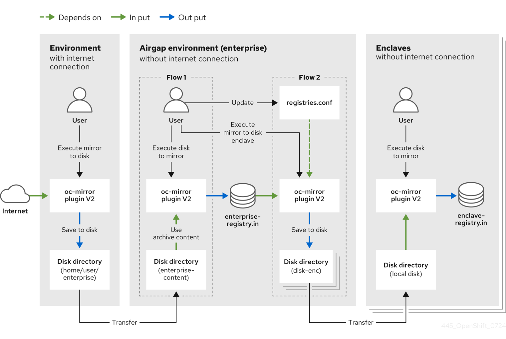

# Mirroring images for a disconnected installation by using the oc-mirror plugin v2 { #about-installing-oc-mirror-v2 }

You can run your cluster in a disconnected environment if you install the cluster from a mirrored set of OpenShift Container Platform container images in a private registry. This registry must be running whenever your cluster is running.

You can use oc-mirror plugin v2 to mirror images to a mirror registry in your fully or partially disconnected environments. To download the required images from the official Red Hat registries, you must run oc-mirror plugin v2 from a system with internet connectivity.

## About oc-mirror plugin v2 { #installation-oc-mirror-v2-about_about-installing-oc-mirror-v2 }

The oc-mirror OpenShift CLI (`oc`) plugin is a single tool that mirrors all required OpenShift Container Platform content and other images to your mirror registry.

To use the new version of oc-mirror, add the `--v2` flag to the oc-mirror plugin v2 command line.

oc-mirror plugin v2 has the following features:

- Provides a centralized method to mirror OpenShift Container Platform releases, Operators, helm charts, and other images.
- Verifies that the complete image set specified in the image set configuration file is mirrored to the mirrored registry, regardless of whether the images were previously mirrored or not.
- Uses a cache system instead of metadata, which prevents the need to start the mirroring process over in the case of a failure for a single step of the process.
- Maintains minimal archive sizes by incorporating only new images into the archive.
- Generates mirroring archives with content selected by mirroring date.
- Can generate `ImageDigestMirrorSet` (IDMS) and `ImageTagMirrorSet` (ITMS) resources, which cover the full image set, instead of an `ImageContentSourcePolicy` (ICSP) resource, which only covered incremental changes to the image set for each mirroring operation with v1.
- Does not perform automatic pruning. v2 now uses a `Delete` feature, which grants users more control over deleting images.
- Introduces support for `registries.conf` files. This change facilitates mirroring to multiple enclaves while using the same cache.

### High level workflow { #oc-mirror-v2-workflow_about-installing-oc-mirror-v2 }

The following steps outline the high-level workflow on how to use the oc-mirror plugin v2 to mirror images to a mirror registry:

1. Create an image set configuration file.

2. Mirror the image set to the target mirror registry by using one of the following workflows:

    - Mirror an image set directly to the target mirror registry (mirror to mirror).
    - Mirror an image set to disk (mirror to disk), transfer the `tar` file to the target environment, then mirror the image set to the target mirror registry (disk to mirror).

3. Configure your cluster to use the resources generated by the oc-mirror plugin v2.

4. Repeat these steps to update your target mirror registry as necessary.

### oc-mirror plugin v2 compatibility and support { #oc-mirror-v2-support_about-installing-oc-mirror-v2 }

The oc-mirror plugin v2 is supported for OpenShift Container Platform.

!!! note

    On `aarch64`, `ppc64le`, and `s390x` architectures the oc-mirror plugin v2 is supported only for OpenShift Container Platform 4.14 and later.

Use the latest available version of the oc-mirror plugin v2 regardless of which versions of OpenShift Container Platform you need to mirror.

## Prerequisites { #prerequisites_oc-mirror-v2_about-installing-oc-mirror-v2 }

Before you can mirror images with the oc-mirror plugin v2, you must meet several prerequisites.

The following prerequisites must be met:

- You must have a container image registry that supports [Docker V2-2](https://docs.docker.com/registry/spec/manifest-v2-2) in the location that hosts the OpenShift Container Platform cluster, such as Red Hat Quay.

    !!! note

        - If you use Red Hat Quay, use version 3.6 or later with the oc-mirror plugin. See [Deploying the Red Hat Quay Operator on OpenShift Container Platform (Red Hat Quay documentation)](https://access.redhat.com/documentation/en-us/red_hat_quay/3/html/deploying_the_red_hat_quay_operator_on_openshift_container_platform/index). If you need additional assistance selecting and installing a registry, contact your sales representative or Red Hat Support.
        - If you do not have an existing solution for a container image registry, OpenShift Container Platform subscribers receive a mirror registry for Red Hat OpenShift. This mirror registry is included with your subscription and serves as a small-scale container registry. You can use this registry to mirror the necessary container images of OpenShift Container Platform for disconnected installations.

- Every machine in the provisioned clusters must have access to the mirror registry. If the registry is unreachable, tasks like installation, updating, or routine operations such as workload relocation, might fail. Mirror registries must be operated in a highly available manner, ensuring their availability aligns with the production availability of your OpenShift Container Platform clusters.

## Preparing your mirror hosts { #oc-mirror-preparing-mirror-hosts_about-installing-oc-mirror-v2 }

To use the oc-mirror plugin v2 for image mirroring, you must install the plugin and create a file with credentials for container images, enabling you to mirror from Red Hat to your mirror.

### Installing the oc-mirror OpenShift CLI plugin { #installation-oc-mirror-installing-plugin_about-installing-oc-mirror-v2 }

You can install the oc-mirror OpenShift CLI plugin to manage image sets in disconnected environments.

**Prerequisites**

- You have installed the OpenShift CLI (`oc`). If you are mirroring image sets in a fully disconnected environment, ensure the following:

    - You have installed the oc-mirror plugin on the host that has internet access.
    - The host in the disconnected environment has access to the target mirror registry.

- You have set the `umask` parameter to `0022` on the operating system that uses oc-mirror.

- You have installed the correct binary for the RHEL version that you are using.

**Procedure**

1. Download the oc-mirror CLI plugin:

    1. Navigate to the [Downloads](https://console.redhat.com/openshift/downloads) page of the Red Hat Hybrid Cloud Console.
    2. In the **OpenShift disconnected installation tools** section, select the **OS type** and **Architecture type** of the **OpenShift Client (oc) mirror plugin** from the dropdown menus.
    3. Click **Download** to save the file.

2. Extract the archive by running the following command:

    ```terminal
    $ tar xvzf oc-mirror.tar.gz
    ```

3. If necessary, update the plugin file to be executable by running the following command:

    ```terminal
    $ chmod +x oc-mirror
    ```

    !!! note

        Do not rename the `oc-mirror` file.

4. Install the oc-mirror CLI plugin by placing the file in your `PATH`, for example `/usr/local/bin`, by running the following command:

    ```terminal
    $ sudo mv oc-mirror /usr/local/bin/.
    ```

**Verification**

- Verify that the oc-mirror plugin v2 is successfully installed by running the following command:

    ```terminal
    $ oc mirror --v2 --help
    ```

### Configuring credentials that allow images to be mirrored { #installation-adding-registry-pull-secret_about-installing-oc-mirror-v2 }

Create a container image registry credentials file so that you can mirror images from Red Hat to your mirror. Complete the following steps on the installation host.

!!! warning

    Do not use this image registry credentials file as the pull secret when you install a cluster. If you provide this file when you install cluster, all of the machines in the cluster will have write access to your mirror registry.

**Prerequisites**

- You configured a mirror registry to use in your disconnected environment.
- You identified an image repository location on your mirror registry to mirror images into.
- You provisioned a mirror registry account that allows images to be uploaded to that image repository.
- You have write access to the mirror registry.

**Procedure**

1. Download your `registry.redhat.io` [pull secret from Red Hat OpenShift Cluster Manager](https://console.redhat.com/openshift/install/pull-secret).

2. Make a copy of your pull secret in JSON format by running the following command:

    ```terminal
    $ cat ./pull-secret | jq . > <path>/<pull_secret_file_in_json>
    ```

    Specify the path to the directory to store the pull secret in and a name for the JSON file that you create.

    ```json title="Example pull secret"
    {
      "auths": {
        "cloud.openshift.com": {
          "auth": "b3BlbnNo...",
          "email": "you@example.com"
        },
        "quay.io": {
          "auth": "b3BlbnNo...",
          "email": "you@example.com"
        },
        "registry.connect.redhat.com": {
          "auth": "NTE3Njg5Nj...",
          "email": "you@example.com"
        },
        "registry.redhat.io": {
          "auth": "NTE3Njg5Nj...",
          "email": "you@example.com"
        }
      }
    }
    ```

3. If the `$XDG_RUNTIME_DIR/containers` directory does not exist, create one by entering the following command:

    ```terminal
    $ mkdir -p $XDG_RUNTIME_DIR/containers
    ```

4. Save the pull secret file as `$XDG_RUNTIME_DIR/containers/auth.json`.

5. Generate the base64-encoded user name and password or token for your mirror registry by running the following command:

    ```terminal
    $ echo -n '<user_name>:<password>' | base64 -w0
    ```

    For `<user_name>` and `<password>`, specify the user name and password that you configured for your registry.

    ```terminal title="Example output"
    BGVtbYk3ZHAtqXs=
    ```

6. Edit the JSON file and add a section that describes your registry to it:

    ```json
      "auths": {
        "<mirror_registry>": {
          "auth": "<credentials>",
          "email": "you@example.com"
        }
      },
    ```

    - For the `<mirror_registry>` value, specify the registry domain name, and optionally the port, that your mirror registry uses to serve content. For example, `registry.example.com` or `registry.example.com:8443`.

    - For the `<credentials>` value, specify the base64-encoded user name and password for the mirror registry.

        ```json title="Example modified pull secret"
        {
          "auths": {
            "registry.example.com": {
              "auth": "BGVtbYk3ZHAtqXs=",
              "email": "you@example.com"
            },
            "cloud.openshift.com": {
              "auth": "b3BlbnNo...",
              "email": "you@example.com"
            },
            "quay.io": {
              "auth": "b3BlbnNo...",
              "email": "you@example.com"
            },
            "registry.connect.redhat.com": {
              "auth": "NTE3Njg5Nj...",
              "email": "you@example.com"
            },
            "registry.redhat.io": {
              "auth": "NTE3Njg5Nj...",
              "email": "you@example.com"
            }
          }
        }
        ```

## Mirroring an image set to a mirror registry { #using-oc-mirror_about-installing-oc-mirror-v2 }

Mirroring an image set to a mirror registry ensures that the required images are available in a secure and controlled environment, facilitating smoother deployments, updates, and maintenance tasks.

### Creating the image set configuration { #oc-mirror-building-image-set-config-v2_about-installing-oc-mirror-v2 }

Before you can use the oc-mirror plugin v2 to mirror images, you must create an image set configuration file. This image set configuration file defines which OpenShift Container Platform releases, Operators, and other images to mirror, along with other configuration settings for the oc-mirror plugin v2.

**Prerequisites**

- You have created a container image registry credentials file. For instructions, see *Configuring credentials that allow images to be mirrored*.

**Procedure**

- Create an `ImageSetConfiguration` YAML file and modify it to include your required images.

    ```yaml title="Example ImageSetConfiguration YAML file"
    kind: ImageSetConfiguration
    apiVersion: mirror.openshift.io/v2alpha1
    mirror:
      platform:
        channels:
        - name: stable-4.22 (1)
          minVersion: 4.22.0
          maxVersion: 4.22.0
        graph: true (2)
      operators:
        - catalog: registry.redhat.io/redhat/redhat-operator-index:v4.22 (3)
          packages: (4)
           - name: aws-load-balancer-operator
           - name: 3scale-operator
           - name: node-observability-operator
             channels:
             - name: stable
      additionalImages: (5)
       - name: registry.redhat.io/ubi8/ubi:latest
       - name: registry.redhat.io/ubi9/ubi@sha256:20f695d2a91352d4eaa25107535126727b5945bff38ed36a3e59590f495046f0
    ```

    `mirror.platform.channels.name`
    :   Set the channel to retrieve OpenShift Container Platform images from.

    `mirror.platform.graph`
    :   Add `graph: true` to build and push the graph-data image to the mirror registry. The graph-data image is required to create OpenShift Update Service (OSUS). The `graph: true` field also generates the `UpdateService` custom resource manifest. The `oc` command-line interface (CLI) can use the `UpdateService` custom resource manifest to create OSUS. For more information, see *About the OpenShift Update Service*.

    `mirror.operators.catalog`
    :   Set the Operator catalog to retrieve the OpenShift Container Platform images from.

    `mirror.operators.packages`
    :   Specify only certain Operator packages to include in the image set. Remove this field to retrieve all packages in the catalog.

    `mirror.operators.packages.channels.name`
    :   Specifies only certain channels of the Operator packages to include in the image set. You must always include the default channel for the Operator package even if you do not use the bundles in that channel. You can find the default channel by running the following command: `oc mirror list operators --catalog=<catalog_name> --package=<package_name> --v2`.

    `mirror.additionalImages`
    :   Specify any additional images to include in image set.

    !!! note

        You must use explicit registry hostnames for all images listed under `additionalImages`. Without explicit hostnames, the plugin mirrors the images to unexpected target paths.

**Additional resources**

- [About the OpenShift Update Service](../updating/understanding_updates/intro-to-updates.md#update-service-about_understanding-openshift-updates)

### Comparison of oc-mirror workflows { #oc-mirror-workflows-table_about-installing-oc-mirror-v2 }

Use the following table to compare the supported use cases for the mirror-to-disk (m2d), disk-to-mirror (d2m), and mirror-to-mirror (m2m) workflows.

<table>
<thead>
<tr>
  <th><strong>Use Case</strong></th>
  <th><strong>Mirror To Disk (m2d) and Disk To Mirror (d2m)</strong></th>
  <th><strong>Mirror To Mirror (m2m)</strong></th>
</tr>
</thead>
<tbody>
<tr>
  <td>The target registry exists in an environment with no internet access and no external access.</td>
  <td>&#10003;</td>
  <td></td>
</tr>
<tr>
  <td>The target registry exists in an environment with no internet access but is accessible from another machine. For example, the target registry resides in a bastion host.</td>
  <td></td>
  <td>&#10003;</td>
</tr>
<tr>
  <td>You must move content to the disconnected environment by using a physical method, such as USB devices.</td>
  <td>&#10003;</td>
  <td></td>
</tr>
<tr>
  <td>The workflow moves content directly to the target registry without generating an intermediate tar file.</td>
  <td></td>
  <td>&#10003;</td>
</tr>
<tr>
  <td>The workflow uses an internal cache to resume after failures but requires additional disk space.</td>
  <td>&#10003;</td>
  <td></td>
</tr>
<tr>
  <td>The workflow does not use a cache, restarts from the beginning after a failure, and requires no additional disk space.</td>
  <td></td>
  <td>&#10003;</td>
</tr>
</tbody>
</table>


### Mirroring an image set in a partially disconnected environment { #oc-mirror-workflows-partially-disconnected-v2_about-installing-oc-mirror-v2 }

You can mirror image sets to a registry using the oc-mirror plugin v2 in environments with restricted internet access.

During the mirroring process, the plugin automatically generates the `ImageSetConfiguration` and `DeleteImageSetConfiguration` files that are pinned by digest in your working directory, along with your original files that reference tags. Pinning by digest maintains consistency across your disconnected environments ensuring that you always deploy the same image, regardless of any later changes to the upstream tags.

**Prerequisites**

- You have access to the internet and the mirror registry in the environment where you are running the oc-mirror plugin v2.

**Procedure**

- Mirror the images from the specified image set configuration to a specified registry by running the following command:

    ```terminal
    $ oc mirror -c <image_set_configuration> --workspace file://<file_path> docker://<mirror_registry_url> --v2 (1)
    ```

    where:

    &lt;image_set_configuration>
    :   Specifies the name of the image set configuration file.

    &lt;file_path>
    :   Specifies the directory where cluster resources will be generated in.

    &lt;mirror_registry_url>
    :   Specifies the URL or address of the mirror registry where the images are stored and from which they need to be deleted.

**Verification**

1. Navigate to the `working-dir/cluster-resources` directory that was generated in the `<file_path>` directory.
2. Verify that the YAML files are present for the `ImageDigestMirrorSet`, `ImageTagMirrorSet`, and `CatalogSource` resources.

**Next steps**

- Configure your cluster to use the resources generated by oc-mirror plugin v2.

### Mirroring an image set in a fully disconnected environment { #oc-mirror-workflows-fully-disconnected-v2_about-installing-oc-mirror-v2 }

You can mirror image sets in a fully disconnected environment where the OpenShift Container Platform cluster cannot access the public internet.

The following high-level workflow describes the mirroring process:

1. **Mirror to disk**: Mirror the image set to an archive.
2. **Disk transfer**: Manually transfer the archive to the network of the disconnected mirror registry.
3. **Disk to mirror**: Mirror the image set from the archive to the target disconnected registry.

#### Mirroring from mirror to disk { #mirror-to-disk-v2_about-installing-oc-mirror-v2 }

You can use the oc-mirror plugin v2 to generate an image set and save the content to disk. Afterwards, you can transfer the generated image set to the disconnected environment and mirror it to the target registry. The plugin retrieves the container images from the source specified in the image set configuration file and packs them into a tar archive in a local directory.

Additionally, the plugin automatically generates the `ImageSetConfiguration` and `DeleteImageSetConfiguration` files that are pinned by digest in your working directory and tar archive. Pinning by digest maintains consistency across your disconnected environments ensuring that you always deploy the same image, regardless of any later changes to the upstream tags.

**Procedure**

- Mirror the images from the specified image set configuration to the disk by running the following command:

    ```terminal
    $ oc mirror -c <image_set_configuration> file://<file_path> --v2
    ```

    where:

    &lt;image_set_configuration>
    :   Specifies the name of the image set configuration file.

    &lt;file_path>
    :   Specifies the directory where the archives containing the image sets will be generated in.

**Verification**

1. Navigate to the `<file_path>` directory that was generated.
2. Verify that the archive files have been generated.

**Next steps**

- Mirroring from disk to mirror

#### Mirroring from disk to mirror { #disk-mirror-v2_about-installing-oc-mirror-v2 }

You can use the oc-mirror plugin v2 to mirror image sets from a disk to a target mirror registry.

The oc-mirror plugin v2 retrieves container images from a local disk and transfers them to the specified mirror registry.

**Procedure**

1. Transfer the disk containing mirrored image sets to the environment that contains the target mirror registry.

2. Process the image set file on the disk and mirror the contents to a target mirror registry by running the following command:

    ```terminal
    $ oc mirror -c <image_set_configuration> --from file://<file_path> docker://<mirror_registry_url> --v2
    ```

    where:

    &lt;image_set_configuration>
    :   Specifies the name of the image set configuration file.

    &lt;file_path>
    :   Specifies the directory on the disk containing the archives. This folder will also contain cluster resources generated for you apply to the cluster, for example the ImageDigestMirrorSet (IDMS) or ImageTagMirrorSet (ITMS) resources.

    &lt;mirror_registry_url>
    :   Specifies the URL or address of the mirror registry where the images are stored.

**Verification**

1. Navigate to the `cluster-resources` directory within the `working-dir` directory that was generated in the `<file_path>` directory.
2. Verify that the YAML files are present for the `ImageDigestMirrorSet`, `ImageTagMirrorSet`, and `CatalogSource` resources.

**Next steps**

- Configure your cluster to use the resources generated by oc-mirror plugin v2.

## About custom resources generated by oc-mirror plugin v2 { #oc-mirror-custom-resources-v2_about-installing-oc-mirror-v2 }

The oc-mirror plugin v2 automatically generates several resources during mirroring operations.

The plugin generates the following custom resources:

`ImageDigestMirrorSet` (IDMS)
:   Handles registry mirror rules when using image digest pull specifications. Generated if at least one image of the image set is mirrored by digest.

`ImageTagMirrorSet` (ITMS)
:   Handles registry mirror rules when using image tag pull specifications. Generated if at least one image from the image set is mirrored by tag.

`CatalogSource`
:   Retrieves information about the available Operators in the mirror registry. Used by Operator Lifecycle Manager (OLM) Classic.

`ClusterCatalog`
:   Retrieves information about the available cluster extensions (which includes Operators) in the mirror registry. Used by OLM v1.

`UpdateService`
:   Provides update graph data to the disconnected environment. Used by the OpenShift Update Service.

**Additional resources**

- [CatalogSource](../rest_api/operatorhub_apis/catalogsource-operators-coreos-com-v1alpha1.md)
- [ImageDigestMirrorSet](../rest_api/config_apis/imagedigestmirrorset-config-openshift-io-v1.md#imagedigestmirrorset-config-openshift-io-v1)
- [ImageTagMirrorSet](../rest_api/config_apis/imagetagmirrorset-config-openshift-io-v1.md#imagetagmirrorset-config-openshift-io-v1)
- [About catalogs in OLM v1](../extensions/catalogs/managing-catalogs.md#olmv1-about-catalogs_managing-catalogs)

### Restrictions on modifying resources that are generated by the oc-mirror plugin { #oc-mirror-restricted-fields_about-installing-oc-mirror-v2 }

When using resources that are generated by the oc-mirror plugin v2 to configure your cluster, you must not change certain fields. Modifying these fields can cause errors and is not supported.

The following table lists the resources and their fields that must remain unchanged:

**Fields that must not be modified in the resources generated by oc-mirror**

<table>
<thead>
<tr>
  <th>Resource</th>
  <th>Fields that must not be changed</th>
</tr>
</thead>
<tbody>
<tr>
  <td><code>CatalogSource</code></td>
  <td><code>apiVersion</code>, <code>kind</code>, <code>spec.image</code></td>
</tr>
<tr>
  <td><code>ClusterCatalog</code></td>
  <td><code>apiVersion</code>, <code>kind</code>, <code>spec.source.image.ref</code></td>
</tr>
<tr>
  <td><code>ImageDigestMirrorSet</code></td>
  <td><code>apiVersion</code>, <code>kind</code>, <code>spec.imageDigestMirrors</code></td>
</tr>
<tr>
  <td><code>ImageTagMirrorSet</code></td>
  <td><code>apiVersion</code>, <code>kind</code>, <code>spec.imageTagMirrors</code></td>
</tr>
<tr>
  <td>Signature <code>ConfigMap</code></td>
  <td><code>apiVersion</code>, <code>kind</code>, <code>metadata.namespace</code>, <code>binaryData</code></td>
</tr>
<tr>
  <td><code>UpdateService</code></td>
  <td><code>apiVersion</code>, <code>kind</code>, <code>spec.graphDataImage</code>, <code>spec.releases</code></td>
</tr>
</tbody>
</table>


For more information about these resources, see the OpenShift API documentation for `CatalogSource`, `ImageDigestMirrorSet`, and `ImageTagMirrorSet`.

### Configuring your cluster to use the resources generated by oc-mirror plugin v2 { #oc-mirror-updating-cluster-manifests-v2_about-installing-oc-mirror-v2 }

After you have mirrored your image set to the mirror registry, you must apply the generated `ImageDigestMirrorSet` (IDMS), `ImageTagMirrorSet` (ITMS), `CatalogSource`, and `UpdateService` resources to the cluster.

!!! warning

    In oc-mirror plugin v2, the IDMS and ITMS files cover the entire image set, unlike the `ImageContentSourcePolicy` (ICSP) files in oc-mirror plugin v1. Therefore, the IDMS and ITMS files contain all images of the set even if you only add new images during incremental mirroring.

**Prerequisites**

- You have access to the cluster as a user with the `cluster-admin` role.

**Procedure**

1. Log in to the OpenShift CLI as a user with the `cluster-admin` role.

2. Apply the YAML files from the results directory to the cluster by running the following command:

    ```terminal
    $ oc apply -f <path_to_oc_mirror_workspace>/working-dir/cluster-resources
    ```

3. If you mirrored release images, apply the release image signatures to the cluster by running the following command:

    ```terminal
    $ oc apply -f working-dir/cluster-resources/signature-configmap.json
    ```

    !!! warning

        If you are mirroring Operators instead of clusters, do not run the preceding command. Running the command results in an error because there are no release image signatures to apply.

        Additionally, a YAML file is available in the same directory `working-dir/cluster-resources/`. You can use either the JSON or YAML format.

**Verification**

1. Verify that the `ImageDigestMirrorSet` resources are successfully installed by running the following command:

    ```terminal
    $ oc get imagedigestmirrorset
    ```

    To view only the resources created by `oc-mirror`, run the following command:

    ```terminal
    $ oc get imagedigestmirrorset -o jsonpath='{.items[?(@.metadata.annotations.createdBy=="oc-mirror v2")].metadata.name}'
    ```

2. Verify that the `ImageTagMirrorSet` resources are successfully installed by running the following command:

    ```terminal
    $ oc get imagetagmirrorset
    ```

    To view only the resources created by `oc-mirror`, run the following command:

    ```terminal
    $ oc get imagetagmirrorset -o jsonpath='{.items[?(@.metadata.annotations.createdBy=="oc-mirror v2")].metadata.name}'
    ```

3. Verify that the `CatalogSource` resources are successfully installed by running the following command:

    ```terminal
    $ oc get catalogsource -n openshift-marketplace
    ```

    To view only the resources created by `oc-mirror`, run the following command:

    ```terminal
    $ oc get catalogsource -o jsonpath='{.items[?(@.metadata.annotations.createdBy=="oc-mirror v2")].metadata.name}'
    ```

4. Verify that the `ClusterCatalog` resources are successfully installed by running the following command:

    ```terminal
    $ oc get clustercatalog
    ```

    To view only the resources created by `oc-mirror`, run the following command:

    ```terminal
    $ oc get clustercatalog -o jsonpath='{.items[?(@.metadata.annotations.createdBy=="oc-mirror v2")].metadata.name}'
    ```

**Additional resources**

- [Disconnected environment support in OLM v1](../extensions/catalogs/disconnected-catalogs.md#disconnected-catalogs)

## Deletion of images from your disconnected environment { #oc-mirror-workflows-delete-v2_about-installing-oc-mirror-v2 }

If you have previously deployed images using the oc-mirror plugin v2, you can delete these images to free up space in your mirror registry.

oc-mirror plugin v2 does not automatically prune images that are not included in the `ImageSetConfiguration` file. This prevents accidentally deleting necessary or deployed images when making changes to the `ImageSetConfig.yaml` file.

To delete images, you can use the `DeleteImageSetConfiguration` file that was automatically pinned by digest during the mirroring process, or you can manually create a new file.

In the following example, the `DeleteImageSetConfiguration` file removes the following images:

- All release images for OpenShift Container Platform 4.13.3.
- The `aws-load-balancer-operator` v0.0.1 bundle and all its related images.
- The additional images for `ubi` and `ubi-minimal`, referenced by their corresponding digests.

```yaml title="Example DeleteImageSetConfiguration file"
apiVersion: mirror.openshift.io/v2alpha1
kind: DeleteImageSetConfiguration
delete:
  platform:
    channels:
      - name: stable-4.13
        minVersion: 4.13.3
        maxVersion: 4.13.3
  operators:
    - catalog: registry.redhat.io/redhat/redhat-operator-index:v4.12
      packages:
      - name: aws-load-balancer-operator
         minVersion: 0.0.1
         maxVersion: 0.0.1
  additionalImages:
    - name: registry.redhat.io/ubi8/ubi@sha256:bce7e9f69fb7d4533447232478fd825811c760288f87a35699f9c8f030f2c1a6
    - name: registry.redhat.io/ubi8/ubi-minimal@sha256:8bedbe742f140108897fb3532068e8316900d9814f399d676ac78b46e740e34e
```

!!! warning

    - Consider using the mirror-to-disk and disk-to-mirror workflows to reduce deletion issues.
    - In oc-mirror plugin v2, you must use explicit registry hostnames for all images listed under `additionalImages`. Otherwise, images are mirrored to incorrect target paths.

oc-mirror plugin v2 deletes only the manifests of the images, which does not reduce the storage occupied in the registry.

To free up storage space from unnecessary images, such as those with deleted manifests, you must enable the garbage collector on your container registry. With the garbage collector enabled, the registry will delete the image blobs that no longer have references to any manifests, reducing the storage previously occupied by the deleted blobs. The process for enabling the garbage collector differs depending on your container registry.

For more information, see "Resolving storage cleanup issues in the distribution registry".

!!! warning

    - To skip deleting the Operator catalog image while you are deleting Operator images, you must list the specific Operators under the Operator catalog image in the `DeleteImageSetConfiguration` file. This ensures that only the specified Operators are deleted, not the catalog image.

        If only the Operator catalog image is specified, all Operators within that catalog, as well as the catalog image itself, will be deleted.

    - oc-mirror plugin v2 does not delete Operator catalog images automatically because other Operators may still be deployed and depend on these images.

        If you are certain that no Operators from a catalog remain in the registry or cluster, you can explicitly add the catalog image to `additionalImages` in `DeleteImageSetConfiguration` to remove it.

    - Garbage collection behavior depends on the registry. Some registries do not automatically remove deleted images, requiring a system administrator to manually trigger garbage collection to free up space.

**Additional resources**

- [Resolving storage cleanup issues in the distribution registry](about-installing-oc-mirror-v2.md#oc-mirror-v2-procedure-garbage-collector_about-installing-oc-mirror-v2)

### Resolving storage cleanup issues in the distribution registry { #oc-mirror-v2-procedure-garbage-collector_about-installing-oc-mirror-v2 }

A known issue in the distribution registry prevents the garbage collector from freeing up storage as expected. This issue does not occur when you use Red Hat Quay.

**Procedure**

- Choose the appropriate method to work around the known issue in the distribution registry:

    - To restart the container registry, run the following command:

        ```terminal
        $ podman restart <registry_container>
        ```

    - To disable caching in the registry configuration, perform the following steps:

        1. To disable the `blobdescriptor` cache, modify the `/etc/docker/registry/config.yml` file:

            ```yaml
            version: 0.1
            log:
              fields:
                service: registry
            storage:
              cache:
                blobdescriptor: ""
              filesystem:
                rootdirectory: /var/lib/registry
            http:
              addr: :5000
              headers:
                X-Content-Type-Options: [nosniff]
            health:
              storagedriver:
                enabled: true
                interval: 10s
                threshold: 3
            ```

        2. To apply the changes, restart the container registry by running the following command:

            ```terminal
            $ podman restart <registry_container>
            ```

### Deleting images from a disconnected environment { #oc-mirror-procedure-delete-v2_about-installing-oc-mirror-v2 }

You can delete images from a disconnected environment using the oc-mirror plugin.

**Prerequisites**

- You have enabled garbage collection in your environment to delete images that no longer reference manifests.

**Procedure**

1. Create a `delete-image-set-config.yaml` file and include the following content:

    ```yaml title="DeleteImageSetConfiguration file"
    apiVersion: mirror.openshift.io/v2alpha1
    kind: DeleteImageSetConfiguration
    delete:
      platform:
        channels:
          - name: <channel_name>
            minVersion: <channel_min_version>
            maxVersion: <channel_max_version>
      operators:
        - catalog: <operator_catalog_name>
          packages:
          - name: <operator_name>
             minVersion: <operator_max_version>
             maxVersion: <operator_min_version>
      additionalImages:
        - name: <additional_images>
    ```

    where:

    `delete.platform.channels.name`
    :   Specifies the name of the OpenShift Container Platform channel to delete, for example `stable-4.15`.

    `delete.platform.channels.minVersion` and `delete.platform.channels.maxVersion`
    :   Specifies a version range of the images to delete within the channel, for example `4.15.0` for the minimum version and `4.15.1` for the maximum version. To delete only one version’s images, use that version number for both the `minVersion` and `maxVersion` fields.

    `delete.operators.catalog`
    :   Specifies an Operator catalog image containing the Operators to delete, for example `registry.redhat.io/redhat/redhat-operator-index:v4.14`. The Operator catalog image will not get deleted. Its presence in the registry might be necessary for other Operators still remaining on the cluster.

    `delete.operators.packages.name`
    :   Specifies a specific Operator to delete, for example `aws-load-balancer-operator`.

    `delete.operators.packages.minVersion` and `delete.operators.packages.maxVersion`
    :   Specifies a version range of the images to delete for the Operator, for example `0.0.1` for the minimum version and `0.0.2` for the maximum version.

2. Create a `delete-images.yaml` file by running the following command:

    ```terminal
    $ oc-mirror delete --config delete-image-set-config.yaml --workspace file://<previously_mirrored_work_folder> --v2 --generate docker://<remote_registry>
    ```

    where:

    `<previously_mirrored_work_folder>`
    :   Specifies the directory where images were previously mirrored to or stored during the mirroring process.

    `<remote_registry>`
    :   Specifies the URL or address of the remote container registry from which images will be deleted.

    !!! warning

        When deleting images, specify the correct workspace directory. Modify or delete the cache directory only when starting mirroring from scratch, such as setting up a new cluster. Incorrect changes to the cache directory might disrupt further mirroring operations.

3. Go to the `<previously_mirrored_work_folder>/delete` directory that was created.

4. Verify that the `delete-images.yaml` file has been generated.

5. Manually ensure that each image listed in the file is no longer needed by the cluster and can be safely removed from the registry.

6. After you generate the `delete-images` YAML file, delete the images from the remote registry by running the following command:

    ```terminal
    $ oc-mirror delete --v2 --delete-yaml-file <previously_mirrored_work_folder>/working-dir/delete/delete-images.yaml docker://<remote_registry>
    ```

    where:

    &lt;previously_mirrored_work_folder>
    :   Specifies the directory where images were previously mirrored or stored during the mirroring process.

    &lt;remote_registry>
    :   Specifies the URL or address of the remote container registry from which images will be deleted.

    !!! warning

        When using the mirror-to-mirror method to mirror images, images are not cached locally, so you cannot delete images from a local cache.

## Verifying your selected images for mirroring { #oc-mirror-v2-about-dry-run_about-installing-oc-mirror-v2 }

You can use oc-mirror plugin v2 to perform a test run (dry run) that does not actually mirror any images. This enables you to review the list of images that would be mirrored.

You can also use a dry run to catch any errors with your image set configuration early. When running a dry run on a mirror-to-disk workflow, the oc-mirror plugin v2 checks if all the images within the image set are available in its cache. Any missing images are listed in the `missing.txt` file. When a dry run is performed before mirroring, both `missing.txt` and `mapping.txt` files contain the same list of images.

### Performing a dry run for oc-mirror plugin v2 { #oc-mirror-dry-run-v2_about-installing-oc-mirror-v2 }

Verify your image set configuration by performing a dry run without mirroring any images. This ensures your setup is correct and prevents unintended changes.

**Procedure**

- To perform a test run, run the `oc mirror` command and append the `--dry-run` argument to the command:

    ```terminal
    $ oc mirror -c <image_set_config_yaml> file://<oc_mirror_workspace_path> --dry-run --v2
    ```

    where:

    `<image_set_config_yaml>`
    :   Specifies the image set configuration file that you created.

    `<oc_mirror_workspace_path>`
    :   Insert the address of the workspace path.

    `<mirror_registry_url>`
    :   Insert the URL or address of the remote container registry from which images will be mirrored or deleted.

    ```terminal title="Example output"
    [INFO]   : :wave: Hello, welcome to oc-mirror
    [INFO]   : :gear:  setting up the environment for you...
    [INFO]   : :twisted_rightwards_arrows: workflow mode: mirrorToDisk
    [INFO]   : :sleuth_or_spy:  going to discover the necessary images...
    [INFO]   : :mag: collecting release images...
    [INFO]   : :mag: collecting operator images...
    [INFO]   : :mag: collecting additional images...
    [WARN]   : :warning:  54/54 images necessary for mirroring are not available in the cache.
    [WARN]   : List of missing images in : CLID-19/working-dir/dry-run/missing.txt.
    please re-run the mirror to disk process
    [INFO]   : :page_facing_up: list of all images for mirroring in : CLID-19/working-dir/dry-run/mapping.txt
    [INFO]   : mirror time     : 9.641091076s
    [INFO]   : :wave: Goodbye, thank you for using oc-mirror
    ```

**Verification**

1. Navigate to the workspace directory that was generated:

    ```terminal
    $ cd <oc_mirror_workspace_path>
    ```

2. Review the `mapping.txt` and `missing.txt` files that were generated. These files contain a list of all images that would be mirrored.

## Troubleshooting oc-mirror plugin v2 errors { #oc-mirror-troubleshooting-v2_about-installing-oc-mirror-v2 }

oc-mirror plugin v2 now logs all image mirroring errors in a separate file, making it easier to track and diagnose failures.

!!! warning

    When errors occur while mirroring release or release component images, they are critical. This stops the mirroring process immediately.

    Errors with mirroring Operators, Operator-related images, or additional images do not stop the mirroring process. Mirroring continues, and oc-mirror plugin v2 saves a file under the `working-dir/logs` directory describing which Operator failed to mirror.

When an image fails to mirror, and that image is mirrored as part of one or more Operator bundles, oc-mirror plugin v2 notifies the user which Operators are incomplete, providing clarity on the Operator bundles affected by the error.

By following these steps, you can better diagnose issues and ensure smoother mirroring.

**Procedure**

1. Check for server-related issues:

    ```terminal title="Example error"
    [ERROR]  : [Worker] error mirroring image localhost:55000/openshift/graph-image:latest error: copying image 1/4 from manifest list: trying to reuse blob sha256:edab65b863aead24e3ed77cea194b6562143049a9307cd48f86b542db9eecb6e at destination: pinging container registry localhost:5000: Get "https://localhost:5000/v2/": http: server gave HTTP response to HTTPS client
    ```

    1. Open the `mirroring_error_date_time.log` file in the  `working-dir/logs` folder located in the oc-mirror plugin v2 output directory.
    2. Look for error messages that typically indicate server-side issues, such as `HTTP 500` errors, expired tokens, or timeouts.
    3. Retry the mirroring process or contact support if the issue persists.

2. Check for incomplete mirroring of Operators:

    ```terminal title="Example error"
    error mirroring image docker://registry.redhat.io/3scale-amp2/zync-rhel9@sha256:8bb6b31e108d67476cc62622f20ff8db34efae5d58014de9502336fcc479d86d (Operator bundles: [3scale-operator.v0.11.12] - Operators: [3scale-operator]) error: initializing source docker://localhost:55000/3scale-amp2/zync-rhel9:8bb6b31e108d67476cc62622f20ff8db34efae5d58014de9502336fcc479d86d: reading manifest 8bb6b31e108d67476cc62622f20ff8db34efae5d58014de9502336fcc479d86d in localhost:55000/3scale-amp2/zync-rhel9: manifest unknown
    error mirroring image docker://registry.redhat.io/3scale-amp2/3scale-rhel7-operator-metadata@sha256:de0a70d1263a6a596d28bf376158056631afd0b6159865008a7263a8e9bf0c7d error: skipping operator bundle docker://registry.redhat.io/3scale-amp2/3scale-rhel7-operator-metadata@sha256:de0a70d1263a6a596d28bf376158056631afd0b6159865008a7263a8e9bf0c7d because one of its related images failed to mirror
    error mirroring image docker://registry.redhat.io/3scale-amp2/system-rhel7@sha256:fe77272021867cc6b6d5d0c9bd06c99d4024ad53f1ab94ec0ab69d0fda74588e (Operator bundles: [3scale-operator.v0.11.12] - Operators: [3scale-operator]) error: initializing source docker://localhost:55000/3scale-amp2/system-rhel7:fe77272021867cc6b6d5d0c9bd06c99d4024ad53f1ab94ec0ab69d0fda74588e: reading manifest fe77272021867cc6b6d5d0c9bd06c99d4024ad53f1ab94ec0ab69d0fda74588e in localhost:55000/3scale-amp2/system-rhel7: manifest unknown
    ```

    1. Check for warnings in the console or log file indicating which Operators are incomplete.

        If an Operator is flagged as incomplete, the image related to that Operator likely failed to mirror.

    2. Manually mirror the missing image or retry the mirroring process.

3. Check for errors related to generated cluster resources. Even if some images fail to mirror, oc-mirror v2 will still generate cluster resources such as `IDMS.yaml` and `ITMS.yaml` files for the successfully mirrored images.

    1. Check the output directory for the generated files.
    2. If these files are missing for specific images, ensure that no critical errors occurred for those images during the mirroring process.

## Benefits of enclave support { #oc-mirror-enclave-support-about_about-installing-oc-mirror-v2 }

Enclave support restricts internal access to a specific part of a network. Unlike a demilitarized zone (DMZ) network, which allows inbound and outbound traffic access through firewall boundaries, enclaves do not cross firewall boundaries.

The new enclave support functionality is for scenarios where mirroring is needed for multiple enclaves that are secured behind at least one intermediate disconnected network.

Enclave support has the following benefits:

- You can mirror content for multiple enclaves and centralize it in a single internal registry. Because some customers want to run security checks on the mirrored content, with this setup they can run these checks all at once. The content is then vetted before being mirrored to downstream enclaves.
- You can mirror content directly from the centralized internal registry to enclaves without restarting the mirroring process from the internet for each enclave.
- You can minimize data transfer between network stages, so to ensure that a blob or image is transferred only once from one stage to another.

### Enclave mirroring workflow { #oc-mirror-enclave-how-to_about-installing-oc-mirror-v2 }



The previous image outlines the flow for using the oc-mirror plugin in different environments, including environments with and without an internet connection.

**Environment with Internet Connection**:

1. The user executes oc-mirror plugin v2 to mirror content from an online registry to a local disk directory.
2. The mirrored content is saved to the disk for transfer to offline environments.

**Disconnected Enterprise Environment (No Internet)**:

- Flow 1:

    - The user runs oc-mirror plugin v2 to load the mirrored content from the disk directory, which was transferred from the online environment, into the `enterprise-registry.in` registry.

- Flow 2:

    1. After updating the `registries.conf` file, the user executes the oc-mirror plugin v2 to mirror content from the `enterprise-registry.in` registry to an enclave environment.
    2. The content is saved to a disk directory for transfer to the enclave.

**Enclave Environment (No Internet)**:

- The user runs oc-mirror plugin v2 to load content from the disk directory into the `enclave-registry.in` registry.

The image visually represents the data flow across these environments and emphasizes the use of oc-mirror to handle disconnected and enclave environments without an internet connection.

### Mirroring to an enclave { #oc-mirror-enclave-support_about-installing-oc-mirror-v2 }

When you mirror to an enclave, you must first transfer the necessary images from one or more enclaves into the enterprise central registry.

The central registry is situated within a secure network, specifically a disconnected environment, and is not directly linked to the public internet. But the user must execute `oc mirror` in an environment with access to the public internet.

**Procedure**

1. Before running oc-mirror plugin v2 in the disconnected environment, create a `registries.conf` file. The TOML format of the file is described in this specification:

    !!! note

        It is recommended to store the file under `$HOME/.config/containers/registries.conf` or `/etc/containers/registries.conf`.

    ```toml title="Example registries.conf"
    [[registry]]
    location="registry.redhat.io"
    [[registry.mirror]]
    location="<enterprise-registry.in>"

    [[registry]]
    location="quay.io"
    [[registry.mirror]]
    location="<enterprise-registry.in>"
    ```

2. Generate a mirror archive.

    1. To collect all the OpenShift Container Platform content into an archive on the disk under `<file_path>/enterprise-content`, run the following command:

        ```terminal
        $ oc mirror --v2 -c isc.yaml file://<file_path>/enterprise-content
        ```

        ```yaml title="Example of isc.yaml"
        apiVersion: mirror.openshift.io/v2alpha1
        kind: ImageSetConfiguration
        mirror:
          platform:
            architectures:
              - "amd64"
            channels:
              - name: stable-4.15
                minVersion: 4.15.0
                maxVersion: 4.15.3
        ```

        After the archive is generated, it is transferred to the disconnected environment. The transport mechanism is not part of oc-mirror plugin v2. The enterprise network administrators determine the transfer strategy.

        In some cases, the transfer is done manually, in that the disk is physically unplugged from one location, and plugged to another computer in the disconnected environment. In other cases, the Secure File Transfer Protocol (SFTP) or other protocols are used.

3. After the transfer of the archive is done, you can execute oc-mirror plugin v2 again in order to mirror the relevant archive contents to the registry (`entrerpise_registry.in` in the example) as demonstrated in the following example:

    ```terminal
    $ oc mirror --v2 -c isc.yaml --from file://<disconnected_environment_file_path>/enterprise-content docker://<enterprise_registry.in>/
    ```

    Where:

    - `--from` points to the folder containing the archive. It starts with the `file://`.
    - `docker://` is the destination of the mirroring is the final argument. Because it is a docker registry.
    - `-c` (`--config`) is a mandatory argument. It enables oc-mirror plugin v2 to eventually mirror only sub-parts of the archive to the registry. One archive might contain several OpenShift Container Platform releases, but the disconnected environment or an enclave might mirror only a few.

4. Prepare the `imageSetConfig` YAML file, which describes the content to mirror to the enclave:

    ```yaml title="Example isc-enclave.yaml"
    apiVersion: mirror.openshift.io/v2alpha1
    kind: ImageSetConfiguration
    mirror:
      platform:
        architectures:
          - "amd64"
        channels:
          - name: stable-4.15
            minVersion: 4.15.2
            maxVersion: 4.15.2
    ```

    You must run oc-mirror plugin v2 on a machine with access to the disconnected registry. In the previous example, the disconnected environment, `enterprise-registry.in`, is accessible.

5. Update the graph URL

    If you are using `graph:true`, oc-mirror plugin v2 attempts to reach the `cincinnati` API endpoint. Because this environment is disconnected, be sure to export the environment variable `UPDATE_URL_OVERRIDE` to refer to the URL for the OpenShift Update Service (OSUS):

    ```terminal
    $ export UPDATE_URL_OVERRIDE=https://<osus.enterprise.in>/graph
    ```

    For more information on setting up OSUS on an OpenShift cluster, see "Updating a cluster in a disconnected environment using the OpenShift Update Service".

    !!! note

        When updating between OpenShift Container Platform Extended Update Support (EUS) versions, you must also include images for an intermediate minor version between the current and target versions. The oc-mirror plugin v2 might not always detect this requirement automatically, so check the [Red Hat OpenShift Container Platform Update Graph page](https://access.redhat.com/labs/ocpupgradegraph/update_path) to confirm any required intermediate versions.

        Use the Update Graph page to find the intermediate minor versions suggested by the application, and include any of these versions in the `ImageSetConfiguration` file when using the oc-mirror plugin v2.

6. Generate a mirror archive from the enterprise registry for the enclave.

    To prepare an archive for the `enclave1`, the user executes oc-mirror plugin v2 in the enterprise disconnected environment by using the `imageSetConfiguration` specific for that enclave. This ensures that only images needed by that enclave are mirrored:

    ```terminal
    $ oc mirror --v2 -c isc-enclave.yaml
    file:///disk-enc1/
    ```

    This action collects all the OpenShift Container Platform content into an archive and generates an archive on disk.

7. After the archive is generated, it will be transferred to the `enclave1` network. The transport mechanism is not the responsibility of oc-mirror plugin v2.

8. Mirror contents to the enclave registry

    After the transfer of the archive is done, the user can execute oc-mirror plugin v2 again in order to mirror the relevant archive contents to the registry.

    ```terminal
    $ oc mirror --v2 -c isc-enclave.yaml --from file://local-disk docker://registry.enc1.in
    ```

    The administrators of the OpenShift Container Platform cluster in `enclave1` are now ready to install or upgrade that cluster.

## oc-mirror plugin v2 support proxy setting { #oc-mirror-proxy-support_about-installing-oc-mirror-v2 }

The oc-mirror plugin v2 can operate in a proxy-configured environment. The plugin can use system proxy settings to retrieve images for OpenShift Container Platform, Operator catalog, and the `additionalImages` registry.

**Additional resources**

- [Updating a cluster in a disconnected environment using the OpenShift Update Service](updating/disconnected-update-osus.md#updating-disconnected-cluster-osus)
- [Resolving storage cleanup issues in the distribution registry](about-installing-oc-mirror-v2.md#oc-mirror-v2-procedure-garbage-collector_about-installing-oc-mirror-v2)

## Mirroring and verifying image signatures in oc-mirror plugin v2 { #oc-mirror-signature-mirroring_about-installing-oc-mirror-v2 }

The oc-mirror plugin v2 supports mirroring and verifying cosign tag-based signatures for container images. By default, signature mirroring is enabled. When enabled, the oc-mirror plugin v2 mirrors `Sigstore` tag-based signatures for the following images:

- OpenShift Container Platform release images
- Operator images
- Additional images
- Helm charts

The oc-mirror plugin v2 manages image signature mirroring with the following behaviors:

- By default, the oc-mirror plugin v2 mirrors signatures for all images. To override this behavior, you must disable the signature mirroring.
- Because the certified, marketplace, and community catalogs contain third-party content, Red Hat does not ensure the availability or validity of their signatures. In such cases, you must disable signature mirroring.

For more information on disabling signature mirroring, see "Disabling signature mirroring for oc-mirror plugin v2".

For more details on configuration formats, see "containers-registries.d(5) manual".

**Additional resources**

- [containers-registries.d(5) manual](https://github.com/containers/container-libs/blob/main/image/docs/containers-registries.d.5.md)

### Disabling signature mirroring for oc-mirror plugin v2 { #oc-mirror-signature-mirroring-procedure_about-installing-oc-mirror-v2 }

You can disable signature mirroring for all images by providing the `--remove-signatures` flag for the `oc mirror` command. You can disable signature mirroring when your destination registry does not support signature storage or when you need to bypass failures caused by invalid or expired signatures at the source.

**Procedure**

1. If you want to disable signature mirroring for all images, add `remove-signatures` flag while mirroring images. For example:

    ```terminal
    $ oc mirror --config=imageset-config.yaml <destination_registry> --remove-signatures
    ```

2. If you want to enable or disable signature mirroring for specific elements, such as transport protocol, registry, namespace or image, use the following steps:

    1. Create a YAML file in either the `$HOME/.config/containers/registries.d/` or `/etc/containers/registries.d/` directory.

    2. Specify the `use-sigstore-attachments` parameter and set it to either `true` or `false` under the specific element you want to control, as seen in the following examples:

        ```yaml title="Example: Disable signature mirroring for the quay.io registry"
        # ...
        docker:
          quay.io:
            use-sigstore-attachments: false
        # ...
        ```

        ```yaml title="Example: Enable signature mirroring for all registries"
        # ...
        default-docker:
          use-sigstore-attachments: true
        # ...
        ```

### Enabling signature verification for oc-mirror plugin v2 { #oc-mirror-about-sig-mirroring-verification_about-installing-oc-mirror-v2 }

Starting with OpenShift Container Platform 4.19, the oc-mirror plugin v2 supports signature verification, which is disabled by default.

When enabled, the plugin verifies that container images match their signatures, ensuring they have not been altered and come from trusted sources. If a signature mismatch is detected, the mirroring workflow will fail.

**Procedure**

1. If you want to enable signature verification for all images, run the following command:

    ```terminal
    $ oc mirror --secure-policy=true
    ```

2. If you want to enable or disable signature verification for specific elements — such as a transport protocol, registry, namespace, or image — follow these steps:

    1. Create a `policy.json` file in either the `$HOME/.config/containers/` or `/etc/containers/` directory.

        !!! note

            If your policy configuration file is located outside the default directory, you can specify its path by using the `--policy` flag with the `oc mirror` command.

            For more information, see [`containers-policy.json(5)`](https://github.com/containers/image/blob/main/docs/containers-policy.json.5.md).

    2. Define verification rules for the desired scope (for example, registry or image) using the appropriate policy configuration. You can set the verification requirement by specifying the desired rule under each element.

        ```json title="Example: Enable verification for only a specific image, and reject all other images"
        {
          "default": [{"type": "reject"}],
          "transports": {
            "docker": {
              "hostname:5000/myns/sigstore-signed-image": [
                {
                  "type": "sigstoreSigned",
                  "keyPath": "/path/to/sigstore-pubkey.pub",
                  "signedIdentity": {"type": "matchRepository"}
                }
              ]
            }
          }
        }
        ```

## How filtering works in the operator catalog { #oc-mirror-operator-catalog-filtering_about-installing-oc-mirror-v2 }

oc-mirror plugin v2 selects the list of bundles for mirroring by processing the information in `imageSetConfig`.

When oc-mirror plugin v2 selects bundles for mirroring, it does not infer Group Version Kind (GVK) or bundle dependencies, omitting them from the mirroring set. Instead, it strictly adheres to the user instructions. You must explicitly specify any required dependent packages and their versions.

**Use the following table to see what bundle versions are included in different scenarios**

<table>
<thead>
<tr>
  <th>ImageSetConfig operator filtering</th>
  <th>Expected bundle versions</th>
</tr>
</thead>
<tbody>
<tr>
  <td>Scenario 1<br><br><pre>mirror:&#10; operators:&#10;   - catalog: registry.redhat.io/redhat/redhat-operator-index:v4.10</pre></td>
  <td>For each package in the catalog, one bundle, corresponding to the head version for each channel of that package.</td>
</tr>
<tr>
  <td>Scenario 2<br><br><pre>mirror:&#10;  operators:&#10;    - catalog: registry.redhat.io/redhat/redhat-operator-index:v4.10&#10;      full: true</pre></td>
  <td>All bundles of all channels of the specified catalog.</td>
</tr>
<tr>
  <td>Scenario 3<br><br><pre>mirror:&#10;  operators:&#10;    - catalog: registry.redhat.io/redhat/redhat-operator-index:v4.10&#10;     packages:&#10;    - name: compliance-operator</pre></td>
  <td>One bundle, corresponding to the head version for each channel of that package.</td>
</tr>
<tr>
  <td>Scenario 4<br><br><pre>mirror:&#10;  operators:&#10;    - catalog: registry.redhat.io/redhat/redhat-operator-index:v4.10&#10;      full: true&#10;      - packages:&#10;          - name: elasticsearch-operator</pre></td>
  <td>All bundles of all channels for the packages specified.</td>
</tr>
<tr>
  <td>Scenario 5<br><br><pre>mirror:&#10;  operators:&#10;  - catalog: registry.redhat.io/redhat/redhat-operator-index:v4.15&#10;    packages:&#10;    - name: compliance-operator&#10;       minVersion: 5.6.0</pre></td>
  <td>All bundles in all channels, from the <code>minVersion</code>, up to the channel head for that package.</td>
</tr>
<tr>
  <td>Scenario 6<br><br><pre>mirror:&#10;  operators:&#10;  - catalog: registry.redhat.io/redhat/redhat-operator-index:v4.15&#10;    packages:&#10;    - name: compliance-operator&#10;        maxVersion: 6.0.0</pre></td>
  <td>All bundles in all channels that are lower than the <code>maxVersion</code> for that package.</td>
</tr>
<tr>
  <td>Scenario 7<br><br><pre>mirror:&#10;  operators:&#10;  - catalog: registry.redhat.io/redhat/redhat-operator-index:v4.15&#10;    packages:&#10;    - name: compliance-operator&#10;        minVersion: 5.6.0&#10;        maxVersion: 6.0.0</pre></td>
  <td>All bundles in all channels, between the <code>minVersion</code> and <code>maxVersion</code> for that package. The head of the channel is not included, even if multiple channels are included in the filtering.</td>
</tr>
<tr>
  <td>Scenario 8<br><br><pre>mirror:&#10;  operators:&#10;  - catalog: registry.redhat.io/redhat/redhat-operator-index:v4.15&#10;    packages:&#10;    - name: compliance-operator&#10;        channels&#10;          - name: stable</pre></td>
  <td>The head bundle for the selected channel of that package. You must use the <code>defaultChannel</code> field in case the filtered channels are not the default.</td>
</tr>
<tr>
  <td>Scenario 9<br><br><pre>mirror:&#10;  operators:&#10;    - catalog: registry.redhat.io/redhat/redhat-operator-index:v4.10&#10;      full: true&#10;      - packages:&#10;          - name: elasticsearch-operator&#10;            channels:&#10;               - name: 'stable-v0'</pre></td>
  <td>All bundles for the packages and channels specified. The <code>defaultChannel</code> should be used in case the filtered channels are not the default.</td>
</tr>
<tr>
  <td>Scenario 10<br><br><pre>mirror:&#10;  operators:&#10;  - catalog: registry.redhat.io/redhat/redhat-operator-index:v4.15&#10;    packages:&#10;    - name: compliance-operator&#10;        channels&#10;          - name: stable&#10;          - name: stable-5.5</pre></td>
  <td>The head bundle for each selected channel of that package.</td>
</tr>
<tr>
  <td>Scenario 11<br><br><pre>mirror:&#10;  operators:&#10;  - catalog: registry.redhat.io/redhat/redhat-operator-index:v4.15&#10;    packages:&#10;    - name: compliance-operator&#10;        channels&#10;          - name: stable&#10;            minVersion: 5.6.0</pre></td>
  <td>Within the selected channel of that package, all versions starting with the <code>minVersion</code> up to the channel head. You must use the <code>defaultChannel</code> field in case the filtered channels are not the default.</td>
</tr>
<tr>
  <td>Scenario 12<br><br><pre>mirror:&#10;  operators:&#10;  - catalog: registry.redhat.io/redhat/redhat-operator-index:v4.15&#10;    packages:&#10;    - name: compliance-operator&#10;        channels&#10;          - name: stable&#10;            maxVersion: 6.0.0</pre></td>
  <td>Within the selected channel of that package, all versions up to <code>maxVersion</code>. Head of channel is not included, even if multiple channels are included in the filtering. You might see errors if this filtering leads to a channel with multiple heads. You must use the <code>defaultChannel</code> field in case the filtered channels are not the default.</td>
</tr>
<tr>
  <td>Scenario 13<br><br><pre>mirror:&#10;  operators:&#10;  - catalog: registry.redhat.io/redhat/redhat-operator-index:v4.15&#10;    packages:&#10;    - name: compliance-operator&#10;       channels&#10;          - name: stable&#10;            minVersion: 5.6.0&#10;            maxVersion: 6.0.0</pre></td>
  <td>Within the selected channel of that package, all versions between the <code>minVersion</code> and <code>maxVersion</code>. The head of channel is not included, even if multiple channels are included in the filtering. You might see errors if this filtering leads to a channel with multiple heads. You must use the <code>defaultChannel</code> field in case the filtered channels are not the default.</td>
</tr>
<tr>
  <td>Scenario 14<br><br><pre>mirror:&#10;  operators:&#10;  - catalog: registry.redhat.io/redhat/redhat-operator-index:v4.15&#10;    packages:&#10;    - name: compliance-operator&#10;        channels&#10;          - name: stable&#10;        minVersion: 5.6.0&#10;        maxVersion: 6.0.0</pre></td>
  <td>Do not use this scenario. filtering by channel and by package with a <code>minVersion</code> or <code>maxVersion</code> is not allowed.</td>
</tr>
<tr>
  <td>Scenario 15<br><br><pre>mirror:&#10;  operators:&#10;   - catalog: registry.redhat.io/redhat/redhat-operator-index:v4.15&#10;    packages:&#10;    - name: compliance-operator&#10;        channels&#10;          - name: stable&#10;        minVersion: 5.6.0&#10;        maxVersion: 6.0.0</pre></td>
  <td>Do not use this scenario. You cannot filter using <code>full:true</code> and the <code>minVersion</code> or <code>maxVersion</code>.</td>
</tr>
<tr>
  <td>Scenario 16<br><br><pre>mirror:&#10;  operators:&#10;    - catalog: registry.redhat.io/redhat/redhat-operator-index:v4.15&#10;      full: true&#10;    packages:&#10;    - name: compliance-operator&#10;        channels&#10;          - name: stable&#10;            minVersion: 5.6.0&#10;            maxVersion: 6.0.0</pre></td>
  <td>Do not use this scenario. You cannot filter using <code>full:true</code> and the <code>minVersion</code> or <code>maxVersion</code>.</td>
</tr>
</tbody>
</table>


## ImageSet configuration parameters for oc-mirror plugin v2 { #oc-mirror-imageset-config-parameters-v2_about-installing-oc-mirror-v2 }

The oc-mirror plugin v2 requires an image set configuration file that defines what images to mirror.

The following table lists the available parameters for the \`ImageSetConfiguration resource.

!!! note

    - When selecting bundles for mirroring, the oc-mirror plugin v2 does not automatically detect group/version/kind (GVK) and bundle dependencies. You must explicitly specify the required Operators, their channels, and the Operator versions in the `ImageSetConfiguration` file. For more information, see "opm CLI reference".
    - Using the `minVersion` and `maxVersion` properties to filter for a specific Operator version range can result in a multiple channel heads error. The error message states that there are `multiple channel heads`. This is because when the filter is applied, the update graph of the Operator is truncated.
    - OLM requires that every Operator channel contains versions that form an update graph with exactly one end point, that is, the latest version of the Operator. When the filter range is applied, that graph can turn into two or more separate graphs or a graph that has more than one end point.
    - To avoid this error, do not filter out the latest version of an Operator. If you still run into the error, depending on the Operator, either the `maxVersion` property must be increased or the `minVersion` property must be decreased. Because every Operator graph can be different, you might need to adjust these values until the error resolves.

**`ImageSetConfiguration` parameters**

<table>
<thead>
<tr>
  <th>Parameter</th>
  <th>Description</th>
  <th>Values</th>
</tr>
</thead>
<tbody>
<tr>
  <td><code>apiVersion</code></td>
  <td>The API version of the <code>ImageSetConfiguration</code> content.</td>
  <td>String Example: <code>mirror.openshift.io/v2alpha1</code></td>
</tr>
<tr>
  <td><code>archiveSize</code></td>
  <td>The maximum size, in GiB, of each archive file within the image set.</td>
  <td>Integer Example: <code>4</code></td>
</tr>
<tr>
  <td><code>kubeVirtContainer</code></td>
  <td>When set to <code>true</code>, includes images from the HyperShift KubeVirt CoreOS container.</td>
  <td>Boolean Example <code>ImageSetConfiguration</code> file:<pre>apiVersion: mirror.openshift.io/v2alpha1&#10;kind: ImageSetConfiguration&#10;mirror:&#10;  platform:&#10;    channels:&#10;    - name: stable-4.16&#10;      minVersion: 4.16.0&#10;      maxVersion: 4.16.0&#10;    kubeVirtContainer: true</pre></td>
</tr>
<tr>
  <td><code>mirror</code></td>
  <td>The configuration of the image set.</td>
  <td>Object</td>
</tr>
<tr>
  <td><code>mirror.additionalImages</code></td>
  <td>The additional images configuration of the image set.</td>
  <td>Array of objects<br><br>Example:<pre>additionalImages:&#10;  - name: registry.redhat.io/ubi8/ubi:latest</pre></td>
</tr>
<tr>
  <td><code>mirror.additionalImages.name</code></td>
  <td>The tag or digest of the image to mirror.</td>
  <td>String Example: <code>registry.redhat.io/ubi8/ubi:latest</code></td>
</tr>
<tr>
  <td><code>mirror.additionalImages.targetRepo</code></td>
  <td>Optional. Specifies the custom repository path and URL for the target image on the disconnected registry. This value overrides the default repository path.</td>
  <td>String</td>
</tr>
<tr>
  <td><code>mirror.additionalImages.targetTag</code></td>
  <td>Optional. Specifies the tag applied to the mirrored image. If you do not configure this field, the image is mirrored using the tag provided in the <code>name</code> field. If no tag is provided in the <code>name</code> field, <code>oc-mirror</code> calculates and applies a tag based on the image's partial digest.</td>
  <td>String</td>
</tr>
<tr>
  <td><code>mirror.blockedImages</code></td>
  <td>List of images with a tag or digest (SHA) to block from mirroring.</td>
  <td>Array of strings Example: <code>docker.io/library/alpine</code></td>
</tr>
<tr>
  <td><code>mirror.helm</code></td>
  <td>The helm configuration of the image set. The oc-mirror plugin does not support helm charts with manually modified <code>values.yaml</code> files.</td>
  <td>Object</td>
</tr>
<tr>
  <td><code>mirror.helm.local</code></td>
  <td>The local helm charts to mirror.</td>
  <td>Array of objects. For example:<br><br><pre>local:&#10;  - name: podinfo&#10;    path: /test/podinfo-5.0.0.tar.gz</pre></td>
</tr>
<tr>
  <td><code>mirror.helm.local.charts.imagePaths</code></td>
  <td>The custom path of a container image inside of the local helm chart.<br><br><div class="admonition note"><p class="admonition-title">Note</p><p><code>oc-mirror</code> detects and mirrors container images from the helm chart by searching well-known paths. You can also specify custom paths using this field.</p></div><br><br><div class="admonition note"><p class="admonition-title">Note</p><p>Operand images, dynamically deployed by Operator controllers at runtime, are typically referenced by environment variables within the controller's deployment template. Before OpenShift Container Platform 4.20, while <code>oc-mirror</code> could access these environment variables, it attempted to mirror all values, including non-image references, for example, log levels, leading to failures. With this update, you can mirror only the container images referenced in these environment variables.</p></div></td>
  <td>Array of string. For example:  <code>"- {.spec.template.spec.custom[*].image}"</code>.</td>
</tr>
<tr>
  <td><code>mirror.helm.local.name</code></td>
  <td>The name of the local helm chart to mirror.</td>
  <td>String. For example: <code>podinfo</code>.</td>
</tr>
<tr>
  <td><code>mirror.helm.local.path</code></td>
  <td>The path of the local helm chart to mirror.</td>
  <td>String. For example: <code>/test/podinfo-5.0.0.tar.gz</code>.</td>
</tr>
<tr>
  <td><code>mirror.helm.repositories</code></td>
  <td>The remote helm repositories to mirror from.</td>
  <td>Array of objects. For example:<br><br><pre>repositories:&#10;  - name: podinfo&#10;    url: https://example.github.io/podinfo&#10;    charts:&#10;      - name: podinfo&#10;        version: 5.0.0&#10;         imagePaths:&#10;         - "{.spec.template.spec.custom[*].image}"</pre></td>
</tr>
<tr>
  <td><code>mirror.helm.repositories.name</code></td>
  <td>The name of the helm repository to mirror from.</td>
  <td>String. For example: <code>podinfo</code>.</td>
</tr>
<tr>
  <td><code>mirror.helm.repositories.url</code></td>
  <td>The URL of the helm repository to mirror from.</td>
  <td>String. For example: [x-]<code>https://example.github.io/podinfo</code>.</td>
</tr>
<tr>
  <td><code>mirror.helm.repositories.charts</code></td>
  <td>The remote helm charts to mirror.</td>
  <td>Array of objects.</td>
</tr>
<tr>
  <td><code>mirror.helm.repositories.charts.name</code></td>
  <td>The name of the helm chart to mirror.</td>
  <td>String. For example: <code>podinfo</code>.</td>
</tr>
<tr>
  <td><code>mirror.helm.repositories.charts.imagePaths</code></td>
  <td>The custom path of a container image inside of the helm chart.<br><br><div class="admonition note"><p class="admonition-title">Note</p><p><code>oc-mirror</code> detects and mirrors container images from the helm chart by searching well-known paths. You can also specify custom paths using this field.</p></div><br><br><div class="admonition note"><p class="admonition-title">Note</p><p>Operand images, dynamically deployed by Operator controllers at runtime, are typically referenced by environment variables within the controller's deployment template. Before OpenShift Container Platform 4.20, while <code>oc-mirror</code> could access these environment variables, it attempted to mirror all values, including non-image references, for example, log levels, leading to failures. With this update, you can mirror only the container images referenced in these environment variables.</p></div></td>
  <td>Array of string. For example:  <code>"- {.spec.template.spec.custom[*].image}"</code>.</td>
</tr>
<tr>
  <td><code>mirror.operators</code></td>
  <td>The Operators configuration of the image set.</td>
  <td>Array of objects<br><br>Example:<pre>operators:&#10;  - catalog: registry.redhat.io/redhat/redhat-operator-index:{product-version}&#10;    packages:&#10;      - name: elasticsearch-operator&#10;        minVersion: '2.4.0'</pre></td>
</tr>
<tr>
  <td><code>mirror.operators.catalog</code></td>
  <td>The Operator catalog to include in the image set.</td>
  <td>String Example: <code>registry.redhat.io/redhat/redhat-operator-index:v4.15</code></td>
</tr>
<tr>
  <td><code>mirror.operators.full</code></td>
  <td>When <code>true</code>, downloads the full catalog, Operator package, or Operator channel.</td>
  <td>Boolean The default value is <code>false</code>.</td>
</tr>
<tr>
  <td><code>mirror.operators.packages</code></td>
  <td>The Operator packages configuration.</td>
  <td>Array of objects<br><br>Example:<pre>operators:&#10;  - catalog: registry.redhat.io/redhat/redhat-operator-index:{product-version}&#10;    packages:&#10;      - name: elasticsearch-operator&#10;        minVersion: '5.2.3-31'</pre></td>
</tr>
<tr>
  <td><code>mirror.operators.packages.name</code></td>
  <td>The Operator package name to include in the image set.</td>
  <td>String Example: <code>elasticsearch-operator</code></td>
</tr>
<tr>
  <td><code>mirror.operators.packages.channels</code></td>
  <td>Operator package channel configuration</td>
  <td>Object</td>
</tr>
<tr>
  <td><code>mirror.operators.packages.channels.name</code></td>
  <td>The Operator channel name, unique within a package, to include in the image set.<br><br><div class="admonition note"><p class="admonition-title">Note</p><p>You must use explicit registry hostnames for all images listed under <code>additionalImages</code>. Without explicit hostnames, the plugin mirrors the images to unexpected target paths.</p></div></td>
  <td>String Example: <code>fast</code> or <code>stable-v4.15</code></td>
</tr>
<tr>
  <td><code>mirror.operators.packages.channels.maxVersion</code></td>
  <td>The highest version of the Operator mirror across all channels in which it exists.</td>
  <td>String Example: <code>5.2.3-31</code></td>
</tr>
<tr>
  <td><code>mirror.operators.packages.channels.minVersion</code></td>
  <td>The lowest version of the Operator to mirror across all channels in which it exists</td>
  <td>String Example: <code>5.2.3-31</code></td>
</tr>
<tr>
  <td><code>mirror.operators.packages.maxVersion</code></td>
  <td>The highest version of the Operator to mirror across all channels in which it exists.</td>
  <td>String Example: <code>5.2.3-31</code></td>
</tr>
<tr>
  <td><code>mirror.operators.packages.minVersion</code></td>
  <td>The lowest version of the Operator to mirror across all channels in which it exists.</td>
  <td>String Example: <code>5.2.3-31</code></td>
</tr>
<tr>
  <td><code>mirror.operators.targetCatalog</code></td>
  <td>An alternative name and optional namespace hierarchy to mirror the referenced catalog as</td>
  <td>String Example: <code>my-namespace/my-operator-catalog</code></td>
</tr>
<tr>
  <td><code>mirror.operators.targetCatalogSourceTemplate</code></td>
  <td>Path on disk for a template to use to complete catalogSource custom resource generated by oc-mirror plugin v2.</td>
  <td>String Example: <code>/tmp/catalog-source_template.yaml</code> Example of a template file:<pre>apiVersion: operators.coreos.com/v1alpha1&#10;kind: CatalogSource&#10;metadata:&#10;  name: discarded&#10;  namespace: openshift-marketplace&#10;spec:&#10;  image: discarded&#10;  sourceType: grpc&#10;  updateStrategy:&#10;    registryPoll:&#10;      interval: 30m0s</pre></td>
</tr>
<tr>
  <td><code>mirror.operators.targetTag</code></td>
  <td>An alternative tag to append to the <code>targetName</code> or <code>targetCatalog</code>.</td>
  <td>String Example: <code>v1</code></td>
</tr>
<tr>
  <td><code>mirror.platform</code></td>
  <td>The platform configuration of the image set.</td>
  <td>Object</td>
</tr>
<tr>
  <td><code>mirror.platform.architectures</code></td>
  <td>The architecture of the platform release payload to mirror.</td>
  <td>Array of strings Example:<pre>architectures:&#10;  - amd64&#10;  - arm64&#10;  - multi&#10;  - ppc64le&#10;  - s390x</pre><br><br>The default value is <code>amd64</code>. The value <code>multi</code> ensures that the mirroring is supported for all available architectures, eliminating the need to specify individual architectures</td>
</tr>
<tr>
  <td><code>mirror.platform.channels</code></td>
  <td>The platform channel configuration of the image set.</td>
  <td>Array of objects Example:<pre>channels:&#10;  - name: stable-4.12&#10;  - name: stable-{product-version}</pre></td>
</tr>
<tr>
  <td><code>mirror.platform.channels.full</code></td>
  <td>When <code>true</code>, sets the <code>minVersion</code> to the first release in the channel and the <code>maxVersion</code> to the last release in the channel.</td>
  <td>Boolean The default value is <code>false</code></td>
</tr>
<tr>
  <td><code>mirror.platform.channels.name</code></td>
  <td>Name of the release channel</td>
  <td>String Example: <code>stable-4.15</code></td>
</tr>
<tr>
  <td><code>mirror.platform.channels.minVersion</code></td>
  <td>The minimum version of the referenced platform to be mirrored.</td>
  <td>String Example: <code>4.12.6</code></td>
</tr>
<tr>
  <td><code>mirror.platform.channels.maxVersion</code></td>
  <td>The highest version of the referenced platform to be mirrored.</td>
  <td>String Example: <code>4.15.1</code></td>
</tr>
<tr>
  <td><code>mirror.platform.channels.shortestPath</code></td>
  <td>Toggles shortest path mirroring or full range mirroring.</td>
  <td>Boolean The default value is <code>false</code></td>
</tr>
<tr>
  <td><code>mirror.platform.channels.type</code></td>
  <td>Type of the platform to be mirrored</td>
  <td>String Example: <code>ocp</code> or <code>okd</code>. The default is <code>ocp</code>.</td>
</tr>
<tr>
  <td><code>mirror.platform.graph</code></td>
  <td>Indicates whether the OSUS graph is added to the image set and subsequently published to the mirror.</td>
  <td>Boolean The default value is <code>false</code></td>
</tr>
<tr>
  <td><code>mirror.operators.packages.defaultChannel</code></td>
  <td>Must be defined when excluding the default channel from the filtering.</td>
  <td>Array of objects. For example:<br><br><pre> mirror:&#10;  operators:&#10;    - catalog: registry.redhat.io/redhat/redhat-operator-index:v4.22&#10;      packages:&#10;        - name: rhods-operator&#10;          defaultChannel: fast&#10;          channels:&#10;            - name: fast</pre></td>
</tr>
</tbody>
</table>


### DeleteImageSetConfiguration parameters { #delete-imagset-config-parameters_about-installing-oc-mirror-v2 }

To remove images with the oc-mirror plugin v2, you must use a `DeleteImageSetConfiguration.yaml` configuration file that defines which images to delete from the mirror registry. The following table lists the available parameters for the `DeleteImageSetConfiguration` resource.

**`DeleteImageSetConfiguration` parameters**

<table>
<thead>
<tr>
  <th>Parameter</th>
  <th>Description</th>
  <th>Values</th>
</tr>
</thead>
<tbody>
<tr>
  <td><code>apiVersion</code></td>
  <td>The API version for the <code>DeleteImageSetConfiguration</code> content.</td>
  <td>String Example: <code>mirror.openshift.io/v2alpha1</code></td>
</tr>
<tr>
  <td><code>delete</code></td>
  <td>The configuration of the image set to delete.</td>
  <td>Object</td>
</tr>
<tr>
  <td><code>delete.additionalImages</code></td>
  <td>The additional images configuration of the delete image set.</td>
  <td>Array of objects Example:<pre>additionalImages:&#10;  - name: registry.redhat.io/ubi8/ubi:latest</pre></td>
</tr>
<tr>
  <td><code>delete.additionalImages.name</code></td>
  <td>The tag or digest of the image to delete.</td>
  <td>String Example: <code>registry.redhat.io/ubi8/ubi:latest</code></td>
</tr>
<tr>
  <td><code>delete.additionalImages.targetRepo</code></td>
  <td>Specifies the repository path and URL of the image you want to delete.</td>
  <td>String</td>
</tr>
<tr>
  <td><code>delete.additionalImages.targetTag</code></td>
  <td>Specifies the tag applied to the image you want to delete.</td>
  <td>String</td>
</tr>
<tr>
  <td><code>delete.operators</code></td>
  <td>The Operators configuration of the delete image set.</td>
  <td>Array of objects Example:<pre>operators:&#10;  - catalog: registry.redhat.io/redhat/redhat-operator-index:{product-version}&#10;    packages:&#10;      - name: elasticsearch-operator&#10;        minVersion: '2.4.0'</pre></td>
</tr>
<tr>
  <td><code>delete.operators.catalog</code></td>
  <td>The Operator catalog to include in the delete image set.</td>
  <td>String Example: <code>registry.redhat.io/redhat/redhat-operator-index:v4.15</code></td>
</tr>
<tr>
  <td><code>delete.operators.full</code></td>
  <td>When true, deletes the full catalog, Operator package, or Operator channel.</td>
  <td>Boolean The default value is <code>false</code></td>
</tr>
<tr>
  <td><code>delete.operators.packages</code></td>
  <td>Operator packages configuration</td>
  <td>Array of objects Example:<pre>operators:&#10;  - catalog: registry.redhat.io/redhat/redhat-operator-index:{product-version}&#10;    packages:&#10;      - name: elasticsearch-operator&#10;        minVersion: '5.2.3-31'</pre></td>
</tr>
<tr>
  <td><code>delete.operators.packages.name</code></td>
  <td>The Operator package name to include in the delete image set.</td>
  <td>String Example: <code>elasticsearch-operator</code></td>
</tr>
<tr>
  <td><code>delete.operators.packages.channels</code></td>
  <td>Operator package channel configuration</td>
  <td>Object</td>
</tr>
<tr>
  <td><code>delete.operators.packages.channels.name</code></td>
  <td>The Operator channel name, unique within a package, to include in the delete image set.</td>
  <td>String Example: <code>fast</code> or <code>stable-v4.15</code></td>
</tr>
<tr>
  <td><code>delete.operators.packages.channels.maxVersion</code></td>
  <td>The highest version of the Operator to delete within the selected channel.</td>
  <td>String Example: <code>5.2.3-31</code></td>
</tr>
<tr>
  <td><code>delete.operators.packages.channels.minVersion</code></td>
  <td>The lowest version of the Operator to delete within the selection in which it exists.</td>
  <td>String Example: <code>5.2.3-31</code></td>
</tr>
<tr>
  <td><code>delete.operators.packages.maxVersion</code></td>
  <td>The highest version of the Operator to delete across all channels in which it exists.</td>
  <td>String Example: <code>5.2.3-31</code></td>
</tr>
<tr>
  <td><code>delete.operators.packages.minVersion</code></td>
  <td>The lowest version of the Operator to delete across all channels in which it exists.</td>
  <td>String Example: <code>5.2.3-31</code></td>
</tr>
<tr>
  <td><code>delete.platform</code></td>
  <td>The platform configuration of the image set</td>
  <td>Object</td>
</tr>
<tr>
  <td><code>delete.platform.architectures</code></td>
  <td>The architecture of the platform release payload to delete.</td>
  <td>Array of strings Example:<pre>architectures:&#10;  - amd64&#10;  - arm64&#10;  - multi&#10;  - ppc64le&#10;  - s390x</pre><br><br>The default value is <code>amd64</code></td>
</tr>
<tr>
  <td><code>delete.platform.channels</code></td>
  <td>The platform channel configuration of the image set.</td>
  <td>Array of objects<br><br>Example:<pre>channels:&#10;  - name: stable-4.12&#10;  - name: stable-{product-version}</pre></td>
</tr>
<tr>
  <td><code>delete.platform.channels.full</code></td>
  <td>When <code>true</code>, sets the <code>minVersion</code> to the first release in the channel and the <code>maxVersion</code> to the last release in the channel.</td>
  <td>Boolean The default value is <code>false</code></td>
</tr>
<tr>
  <td><code>delete.platform.channels.name</code></td>
  <td>Name of the release channel</td>
  <td>String Example: <code>stable-4.15</code></td>
</tr>
<tr>
  <td><code>delete.platform.channels.minVersion</code></td>
  <td>The minimum version of the referenced platform to be deleted.</td>
  <td>String Example: <code>4.12.6</code></td>
</tr>
<tr>
  <td><code>delete.platform.channels.maxVersion</code></td>
  <td>The highest version of the referenced platform to be deleted.</td>
  <td>String Example: <code>4.15.1</code></td>
</tr>
<tr>
  <td><code>delete.platform.channels.shortestPath</code></td>
  <td>Toggles between deleting the shortest path and deleting the full range.</td>
  <td>Boolean The default value is <code>false</code></td>
</tr>
<tr>
  <td><code>delete.platform.channels.type</code></td>
  <td>Type of the platform to be deleted</td>
  <td>String Example: <code>ocp</code> or <code>okd</code> The default is <code>ocp</code></td>
</tr>
<tr>
  <td><code>delete.platform.graph</code></td>
  <td>Determines whether the OSUS graph is deleted as well on the mirror registry as well.</td>
  <td>Boolean The default value is <code>false</code></td>
</tr>
</tbody>
</table>


**Additional resources**

- [opm CLI reference](../cli_reference/opm/cli-opm-ref.md#cli-opm-ref)

## Command reference for oc-mirror plugin v2 { #oc-mirror-command-reference-v2_about-installing-oc-mirror-v2 }

You can use the `oc mirror` subcommands and flags to modify the behavior of the oc-mirror plugin v2 and control your mirroring workflow.

The following tables describe the `oc mirror` subcommands and flags for oc-mirror plugin v2:

**Subcommands and flags for the oc-mirror plugin v2**

| Subcommand | Description                                        |
| ---------- | -------------------------------------------------- |
| `help`     | Show help about any subcommand                     |
| `version`  | Output the oc-mirror version                       |
| `delete`   | Deletes images in remote registry and local cache. |

**oc mirror flags**

| Flag                               | Description                                                                                                                                                                                                                                                                                                                                                                                                                                                                                                                                                                                      |
| ---------------------------------- | ------------------------------------------------------------------------------------------------------------------------------------------------------------------------------------------------------------------------------------------------------------------------------------------------------------------------------------------------------------------------------------------------------------------------------------------------------------------------------------------------------------------------------------------------------------------------------------------------ |
| `--authfile`                       | Displays the string path of the authentication file. Default is `${XDG_RUNTIME_DIR}/containers/auth.json`.                                                                                                                                                                                                                                                                                                                                                                                                                                                                                       |
| `-c`, `--config` `<string>`        | Specifies the path to an image set configuration file.                                                                                                                                                                                                                                                                                                                                                                                                                                                                                                                                           |
| `--cache-dir <string>`             | Use this flag to specify a directory where the oc-mirror plugin stores a persistent cache of image blobs and manifests for use during mirroring operations. The oc-mirror plugin uses the cache in the `disk-to-mirror` and `mirror-to-disk` workflows but does not use the cache in the `mirror-to-mirror` workflow. The plugin uses the cache to perform incremental mirroring and avoids remirroring unchanged images, which saves time and reduces network bandwidth usage. The default cache directory is `$HOME`. For more information, see "About the --cache-dir and --workspace flags". |
| `--dest-tls-verify`                | Requires HTTPS and verifies certificates when accessing the container registry or daemon. The default value is `true`.                                                                                                                                                                                                                                                                                                                                                                                                                                                                           |
| `--dry-run`                        | Prints actions without mirroring images.                                                                                                                                                                                                                                                                                                                                                                                                                                                                                                                                                         |
| `--from <string>`                  | Specifies the path to an image set archive that was generated by executing oc-mirror plugin v2 to load a target registry.                                                                                                                                                                                                                                                                                                                                                                                                                                                                        |
| `-h`, `--help`                     | Displays help                                                                                                                                                                                                                                                                                                                                                                                                                                                                                                                                                                                    |
| `--image-timeout duration`         | Timeout for mirroring an image. The default is 10m0s. Valid time units are `ns`, `us` or `µs`, `ms`, `s`, `m`, and `h`.                                                                                                                                                                                                                                                                                                                                                                                                                                                                          |
| `--log-level <string>`             | Displays string log levels. Supported values include info, debug, trace, error. The default value is `info`.                                                                                                                                                                                                                                                                                                                                                                                                                                                                                     |
| `-p`, `--port`                     | Determines the HTTP port used by oc-mirror plugin v2 local storage instance. The default value is `55000`.                                                                                                                                                                                                                                                                                                                                                                                                                                                                                       |
| `--parallel-images <unit>`         | Specifies the number of images mirrored in parallel. The value must be in the range of 1–10. The default value is `4`.                                                                                                                                                                                                                                                                                                                                                                                                                                                                           |
| `--parallel-layers <unit>`         | Specifies the number of image layers mirrored in parallel. The value must be in the range of 1–10. The default value is `5`.                                                                                                                                                                                                                                                                                                                                                                                                                                                                     |
| `--max-nested-paths <int>`         | Specifies the maximum number of nested paths for destination registries that limit nested paths. The default value is `0`.                                                                                                                                                                                                                                                                                                                                                                                                                                                                       |
| `--secure-policy`                  | The default value is `false`. If you set a non-default value, the command enables signature verification, which is the secure policy for signature verification.                                                                                                                                                                                                                                                                                                                                                                                                                                 |
| `--since`                          | Includes all new content since a specified date (format: `yyyy-mm-dd`). When not provided, new content since previous mirroring is mirrored.                                                                                                                                                                                                                                                                                                                                                                                                                                                     |
| `--src-tls-verify`                 | Requires HTTPS and verifies certificates when accessing the container registry or daemon.                                                                                                                                                                                                                                                                                                                                                                                                                                                                                                        |
| `--strict-archive`                 | The default value is `false`. If you set a value, the command generates archives that are strictly less than the `archiveSize` that was set in the `imageSetConfig` custom resource (CR). Mirroring exist in error if a file being archived exceeds `archiveSize` (GB).                                                                                                                                                                                                                                                                                                                          |
| `-v`, `--version`                  | Displays the version for oc-mirror plugin v2.                                                                                                                                                                                                                                                                                                                                                                                                                                                                                                                                                    |
| `--workspace`                      | You can use the `--workspace` flag to specify a directory where the oc-mirror plugin stores the working files that it creates during a mirroring operation, such as the `ImageDigestMirrorSet` and `ImageTagMirrorSet` manifests. Use this directory to apply the generated configuration to clusters and repeat mirroring operations. For more information, see "About the --cache-dir and --workspace flags".                                                                                                                                                                                  |
| `--retry-delay duration`           | Delay between 2 retries. The default value is `1s`.                                                                                                                                                                                                                                                                                                                                                                                                                                                                                                                                              |
| `--retry-times <int>`              | The number of times to retry. The default value is `2`.                                                                                                                                                                                                                                                                                                                                                                                                                                                                                                                                          |
| `--rootless-storage-path <string>` | Overrides the default container rootless storage path (usually in `etc/containers/storage.conf`).                                                                                                                                                                                                                                                                                                                                                                                                                                                                                                |
| `--remove-signatures`              | Does not copy signatures from the source image.                                                                                                                                                                                                                                                                                                                                                                                                                                                                                                                                                  |
| `--registries.d`                   | Specifies the directory that contains registry configuration files.                                                                                                                                                                                                                                                                                                                                                                                                                                                                                                                              |
| `--secure-policy=true`             | Enables signature verification for all images.                                                                                                                                                                                                                                                                                                                                                                                                                                                                                                                                                   |
| `--policy`                         | Specifies the path to the signature verification policy file.                                                                                                                                                                                                                                                                                                                                                                                                                                                                                                                                    |

### Command reference for deleting images { #oc-mirror-command-reference-delete-v2_about-installing-oc-mirror-v2 }

You can use the `oc mirror` subcommands and flags to modify how the oc-mirror plugin v2 deletes mirrored images.

The following tables describe the `oc mirror` subcommands and flags for deleting images:

**Subcommands and flags for the deleting images**

| Subcommand                         | Description                                                                                                                                                                                                                                                                                                                                                                                                                                                                                                                                                                                      |
| ---------------------------------- | ------------------------------------------------------------------------------------------------------------------------------------------------------------------------------------------------------------------------------------------------------------------------------------------------------------------------------------------------------------------------------------------------------------------------------------------------------------------------------------------------------------------------------------------------------------------------------------------------ |
| `--authfile <string>`              | Path of the authentication file. The default value is `${XDG_RUNTIME_DIR}/containers/auth.json`.                                                                                                                                                                                                                                                                                                                                                                                                                                                                                                 |
| `--cache-dir <string>`             | Use this flag to specify a directory where the oc-mirror plugin stores a persistent cache of image blobs and manifests for use during mirroring operations. The oc-mirror plugin uses the cache in the `disk-to-mirror` and `mirror-to-disk` workflows but does not use the cache in the `mirror-to-mirror` workflow. The plugin uses the cache to perform incremental mirroring and avoids remirroring unchanged images, which saves time and reduces network bandwidth usage. The default cache directory is `$HOME`. For more information, see "About the --cache-dir and --workspace flags". |
| `-c <string>`, `--config <string>` | Path to the delete imageset configuration file.                                                                                                                                                                                                                                                                                                                                                                                                                                                                                                                                                  |
| `--delete-id <string>`             | Used to differentiate between versions for files created by the delete functionality.                                                                                                                                                                                                                                                                                                                                                                                                                                                                                                            |
| `--delete-v1-images`               | Used during the migration, along with `--generate`, in order to target images previously mirrored with oc-mirror plugin v1.                                                                                                                                                                                                                                                                                                                                                                                                                                                                      |
| `--delete-yaml-file <string>`      | If set, uses the generated or updated yaml file to delete contents.                                                                                                                                                                                                                                                                                                                                                                                                                                                                                                                              |
| `--dest-tls-verify`                | Require HTTPS and verify certificates when talking to the container registry or daemon. The default value is `true`.                                                                                                                                                                                                                                                                                                                                                                                                                                                                             |
| `--force-cache-delete`             | Used to force delete the local cache manifests and blobs.                                                                                                                                                                                                                                                                                                                                                                                                                                                                                                                                        |
| `--generate`                       | Used to generate the delete yaml for the list of manifests and blobs, used when deleting from local cache and remote registry.                                                                                                                                                                                                                                                                                                                                                                                                                                                                   |
| `-h`, `--help`                     | Displays help.                                                                                                                                                                                                                                                                                                                                                                                                                                                                                                                                                                                   |
| `--log-level <string>`             | Log level one of `info`, `debug`, `trace`, and `error`. The default value is `info`.                                                                                                                                                                                                                                                                                                                                                                                                                                                                                                             |
| `--parallel-images <unit>`         | Indicates the number of images deleted in parallel. The value must be in the range of 1–10. The default value is `4`.                                                                                                                                                                                                                                                                                                                                                                                                                                                                            |
| `--parallel-layers <unit>`         | Indicates the number of image layers deleted in parallel. The value must be in the range of 1–10. The default value is `5`.                                                                                                                                                                                                                                                                                                                                                                                                                                                                      |
| `-p <unit>`, `--port <unit>`       | HTTP port used by oc-mirror’s local storage instance. The default value is `55000`.                                                                                                                                                                                                                                                                                                                                                                                                                                                                                                              |
| `--retry-delay`                    | Duration delay between 2 retries. The default value is `1s`.                                                                                                                                                                                                                                                                                                                                                                                                                                                                                                                                     |
| `--retry-times <int>`              | The number of times to retry. The default value is `2`.                                                                                                                                                                                                                                                                                                                                                                                                                                                                                                                                          |
| `--src-tls-verify`                 | Require HTTPS and verify certificates when talking to the container registry or daemon. The default value is `true`.                                                                                                                                                                                                                                                                                                                                                                                                                                                                             |
| `--workspace <string>`             | You can use the `--workspace` flag to specify a directory where the oc-mirror plugin stores the working files that it creates during a mirroring operation, such as the `ImageDigestMirrorSet` and `ImageTagMirrorSet` manifests. Use this directory to apply the generated configuration to clusters and repeat mirroring operations. For more information, see "About the --cache-dir and --workspace flags".                                                                                                                                                                                  |

### About the --cache-dir and --workspace flags { #oc-mirror-about-cache-and-workspace-dirs_about-installing-oc-mirror-v2 }

You can use the `--cache-dir` flag to specify a directory where the oc-mirror plugin stores a persistent cache of image blobs and manifests for use during mirroring operations.

The oc-mirror plugin uses the cache in the `mirror-to-disk` and `disk-to-mirror` workflows but does not use the cache in the `mirror-to-mirror` workflow. The plugin uses the cache to perform incremental mirroring and avoids remirroring unchanged images, which saves time and reduces network bandwidth usage.

The cache directory only contains data up to the last successful mirroring operation. If you delete or corrupt the cache directory, the oc-mirror plugin pulls the image blobs and manifests again, which can force a full remirror and increase network usage.

You can use the `--workspace` flag to specify a directory where the oc-mirror plugin stores the working files that it creates during a mirroring operation, such as the `ImageDigestMirrorSet` and `ImageTagMirrorSet` manifests. You can also use the workspace directory to perform the following actions:

- Store the untarred metadata for release and operator images.
- Generate tar archives for use in `disk-to-mirror` workflows.
- Apply the generated configuration to clusters.
- Repeat or resume previous mirroring operations.

If you remove or modify the workspace directory, future mirroring operations might fail, or clusters may use inconsistent image sources.

!!! warning

    Deleting or modifying the contents of cache or workspace directories can cause the following issues:

    - Failed or incomplete mirroring operations.
    - Loss of incremental mirroring data.
    - Full remirroring requirements and increased network overhead.

    Do not modify, relocate, or delete these directories unless you fully understand the impact. You must regularly back up the cache directory after successful mirroring operations. It is not necessary to back up the workspace directory because its contents are regenerated during each mirroring cycle.

Consider the following best practices so that you can better manage the cache and workspace directories effectively:

- Use persistent storage: Place the cache and workspace directories on reliable and backed‑up storage.
- Back up after successful operations: Regularly back up the cache directory, especially after completing a mirroring cycle.
- Restore when needed: In case of data loss, restore the cache and workspace directories from backup to resume mirroring operations without performing a full remirror.
- Separate environments: Use dedicated directories for different environments to prevent conflicts.

Use the following example to specify the cache and workspace directories when running the oc-mirror command:

```terminal
$ oc mirror --config=imageset-config.yaml \
    file://local_mirror \
    --workspace /mnt/mirror-data/workspace \
    --cache-dir /mnt/mirror-data/cache
    --v2
```

After the mirroring operation completes, your directory structure is as follows:

```text
/mnt/mirror-data/
├── cache/
│   ├── manifests/
│   ├── metadata.db
│   └── previous-mirror-state.json
└── workspace/
    ├── imageset-config-state.yaml
    ├── manifests/
    └── icsp/
```

You must back up the `/mnt/mirror-data/cache` directory after each successful mirroring operation.

**Additional resources**

- [Installing a cluster in a disconnected environment](installing.md#installing-disconnected-environments)
- [Using Operator Lifecycle Manager in disconnected environments](using-olm.md#olm-restricted-networks)
- [Updating a cluster in a disconnected environment using the OpenShift Update Service](updating/disconnected-update-osus.md#updating-disconnected-cluster-osus)
