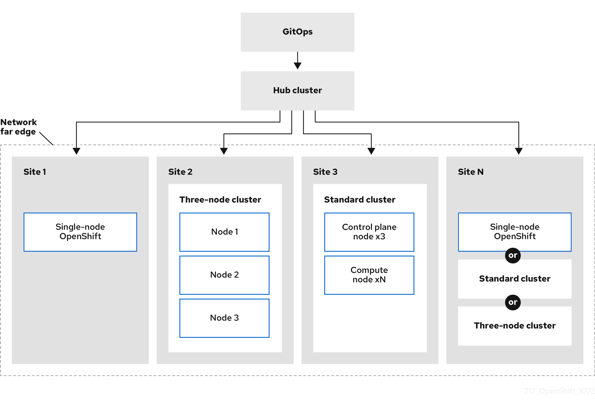
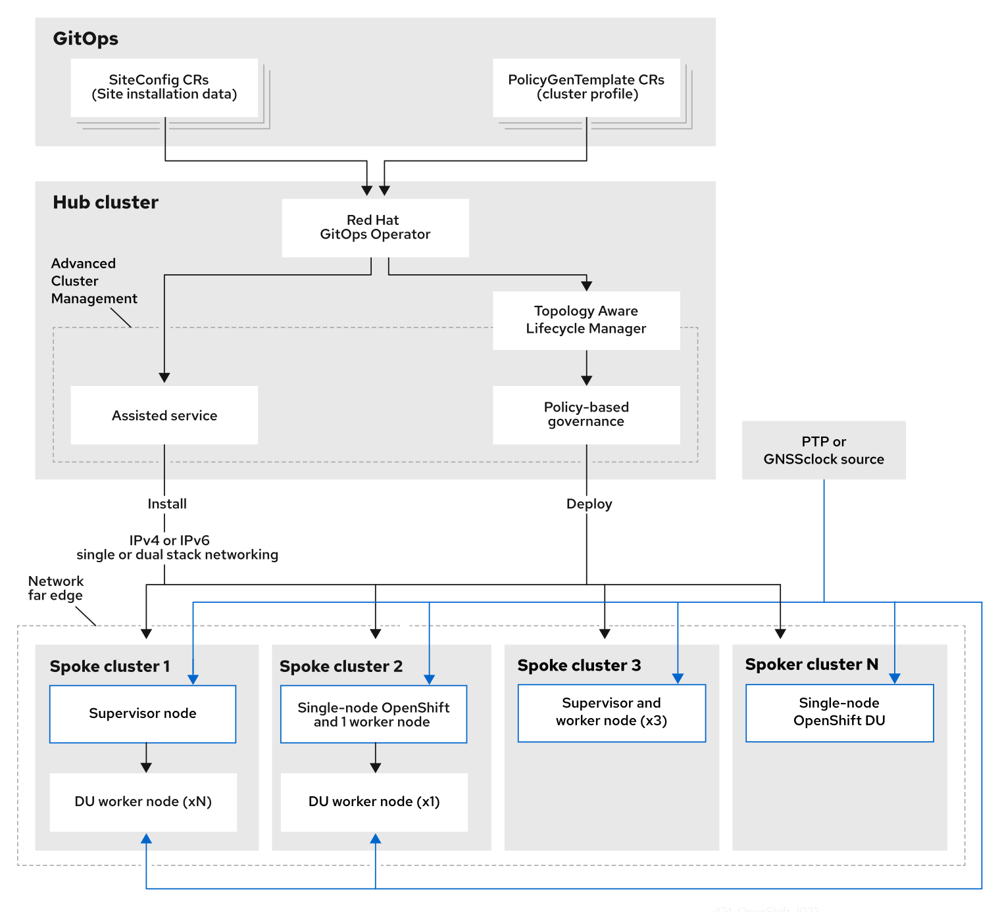
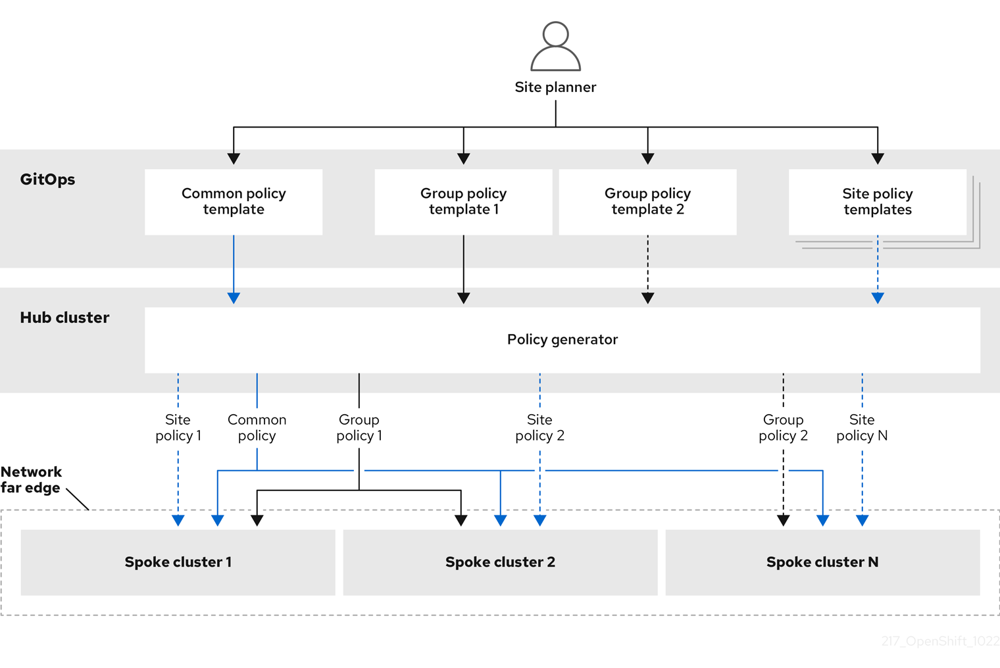

# Challenges of the network far edge { #ztp-deploying-far-edge-clusters-at-scale }

Edge computing presents complex challenges when managing many sites in geographically displaced locations. Use GitOps Zero Touch Provisioning (ZTP) to provision and manage sites at the far edge of the network.

## Overcoming the challenges of the network far edge { #ztp-challenges-of-far-edge-deployments_ztp-deploying-far-edge-clusters-at-scale }

Today, service providers want to deploy their infrastructure at the edge of the network. This presents significant challenges:

- How do you handle deployments of many edge sites in parallel?
- What happens when you need to deploy sites in disconnected environments?
- How do you manage the lifecycle of large fleets of clusters?

GitOps Zero Touch Provisioning (ZTP) and *GitOps* meets these challenges by allowing you to provision remote edge sites at scale with declarative site definitions and configurations for bare-metal equipment. Template or overlay configurations install OpenShift Container Platform features that are required for CNF workloads. The full lifecycle of installation and upgrades is handled through the GitOps ZTP pipeline.

GitOps ZTP uses GitOps for infrastructure deployments. With GitOps, you use declarative YAML files and other defined patterns stored in Git repositories. Red Hat Advanced Cluster Management (RHACM) uses your Git repositories to drive the deployment of your infrastructure.

GitOps provides traceability, role-based access control (RBAC), and a single source of truth for the desired state of each site. Scalability issues are addressed by Git methodologies and event driven operations through webhooks.

You start the GitOps ZTP workflow by creating declarative site definition and configuration custom resources (CRs) that the GitOps ZTP pipeline delivers to the edge nodes.

The following diagram shows how GitOps ZTP works within the far edge framework.

## Using GitOps ZTP to provision clusters at the network far edge { #about-ztp_ztp-deploying-far-edge-clusters-at-scale }

Red Hat Advanced Cluster Management (RHACM) manages clusters in a hub-and-spoke architecture, where a single hub cluster manages many spoke clusters. Hub clusters running RHACM provision and deploy the managed clusters by using GitOps Zero Touch Provisioning (ZTP) and the assisted service that is deployed when you install RHACM.

The assisted service handles provisioning of OpenShift Container Platform on single node clusters, three-node clusters, or standard clusters running on bare metal.

A high-level overview of using GitOps ZTP to provision and maintain bare-metal hosts with OpenShift Container Platform is as follows:

- A hub cluster running RHACM manages an OpenShift image registry that mirrors the OpenShift Container Platform release images. RHACM uses the OpenShift image registry to provision the managed clusters.
- You manage the bare-metal hosts in a YAML format inventory file, versioned in a Git repository.
- You make the hosts ready for provisioning as managed clusters, and use RHACM and the assisted service to install the bare-metal hosts on site.

Installing and deploying the clusters is a two-stage process, involving an initial installation phase, and a subsequent configuration and deployment phase. The following diagram illustrates this workflow:

## Installing managed clusters with ClusterInstance resources and RHACM { #ztp-creating-ztp-crs-for-multiple-managed-clusters_ztp-deploying-far-edge-clusters-at-scale }

GitOps Zero Touch Provisioning (ZTP) uses `ClusterInstance` custom resources (CRs) in a Git repository to manage the processes that install OpenShift Container Platform clusters. The `ClusterInstance` CR contains cluster-specific parameters required for installation. It has options for applying select configuration CRs during installation including user defined extra manifests.

The GitOps ZTP plugin processes `ClusterInstance` CRs to generate a collection of CRs on the hub cluster. This triggers the assisted service in Red Hat Advanced Cluster Management (RHACM) to install OpenShift Container Platform on the bare-metal host. You can find installation status and error messages in these CRs on the hub cluster. You can provision single clusters manually or in batches with GitOps ZTP:

Provisioning a single cluster
:   Create a single `ClusterInstance` CR and related configuration CRs for the cluster, and apply them in the hub cluster to begin cluster provisioning. This is a good way to test your CRs before deploying on a larger scale.

Provisioning many clusters
:   Install managed clusters in batches of up to 500 by defining `ClusterInstance` and related CRs in a Git repository. ArgoCD uses the `ClusterInstance` CRs to deploy the clusters. The RHACM policy generator creates the manifests and applies them to the hub cluster. This starts the cluster provisioning process.

## Configuring managed clusters with policies and PolicyGenerator resources { #ztp-configuring-cluster-policies_ztp-deploying-far-edge-clusters-at-scale }

GitOps Zero Touch Provisioning (ZTP) uses Red Hat Advanced Cluster Management (RHACM) to configure clusters by using a policy-based governance approach to applying the configuration.

The policy generator is a plugin for the GitOps Operator that enables the creation of RHACM policies from a concise template. The tool can combine multiple CRs into a single policy, and you can generate multiple policies that apply to various subsets of clusters in your fleet.

!!! note

    For scalability and to reduce the complexity of managing configurations across the fleet of clusters, use configuration CRs with as much commonality as possible.

    - Where possible, apply configuration CRs using a fleet-wide common policy.
    - The next preference is to create logical groupings of clusters to manage as much of the remaining configurations as possible under a group policy.
    - When a configuration is unique to an individual site, use RHACM templating on the hub cluster to inject the site-specific data into a common or group policy. Alternatively, apply an individual site policy for the site.

The following diagram shows how the policy generator interacts with GitOps and RHACM in the configuration phase of cluster deployment.

For large fleets of clusters, it is typical for there to be a high-level of consistency in the configuration of those clusters.

The following recommended structuring of policies combines configuration CRs to meet several goals:

- Describe common configurations once and apply to the fleet.
- Minimize the number of maintained and managed policies.
- Support flexibility in common configurations for cluster variants.

**Recommended PolicyGenerator policy categories**

| Policy category | Description                                                                                                                                                                                                                                                                                     |
| --------------- | ----------------------------------------------------------------------------------------------------------------------------------------------------------------------------------------------------------------------------------------------------------------------------------------------- |
| Common          | A policy that exists in the common category is applied to all clusters in the fleet. Use common `PolicyGenerator` CRs to apply common installation settings across all cluster types.                                                                                                           |
| Groups          | A policy that exists in the groups category is applied to a group of clusters in the fleet. Use group `PolicyGenerator` CRs to manage specific aspects of single-node, three-node, and standard cluster installations. Cluster groups can also follow geographic region, hardware variant, etc. |
| Sites           | A policy that exists in the sites category is applied to a specific cluster site. Any cluster can have its own specific policies maintained.                                                                                                                                                    |

!!! warning

    Using `PolicyGenTemplate` CRs to manage and deploy policies to managed clusters will be deprecated in an upcoming OpenShift Container Platform release. Equivalent and improved functionality is available using Red Hat Advanced Cluster Management (RHACM) and `PolicyGenerator` CRs.

    For more information about `PolicyGenerator` resources, see the RHACM [Integrating Policy Generator](https://docs.redhat.com/en/documentation/red_hat_advanced_cluster_management_for_kubernetes/2.17/html-single/governance/index#integrate-policy-generator) documentation.

**Additional resources**

- [Configuring managed cluster policies by using PolicyGenerator resources](policygenerator_for_ztp/ztp-configuring-managed-clusters-policygenerator.md#ztp-configuring-managed-clusters-policygenerator)
- [Comparing RHACM PolicyGenerator and PolicyGenTemplate resource patching](policygenerator_for_ztp/ztp-configuring-managed-clusters-policygenerator.md#ztp-comparing-pgt-and-rhacm-pg-patching-strategies_ztp-configuring-managed-clusters-policygenerator)
- [Preparing the GitOps ZTP Git repository](ztp-preparing-the-hub-cluster.md#ztp-preparing-the-ztp-git-repository_ztp-preparing-the-hub-cluster)
