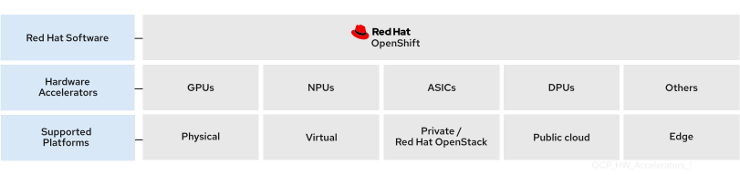

# About hardware accelerators { #about-hardware-accelerators }

Specialized hardware accelerators play a key role in the emerging generative artificial intelligence and machine learning (AI/ML) industry. Specifically, hardware accelerators are essential to the training and serving of large language and other foundational models that power this new technology. Data scientists, data engineers, ML engineers, and developers can take advantage of the specialized hardware acceleration for data-intensive transformations and model development and serving. Much of that ecosystem is open source, with several contributing partners and open source foundations.

Red Hat OpenShift Container Platform provides support for cards and peripheral hardware that add processing units that comprise hardware accelerators:

- Graphical processing units (GPUs)
- Neural processing units (NPUs)
- Application-specific integrated circuits (ASICs)
- Data processing units (DPUs)

Specialized hardware accelerators provide a rich set of benefits for AI/ML development:

One platform for all
:   A collaborative environment for developers, data engineers, data scientists, and DevOps

Extended capabilities with Operators
:   Operators allow for bringing AI/ML capabilities to OpenShift Container Platform

Hybrid-cloud support
:   On-premise support for model development, delivery, and deployment

Support for AI/ML workloads
:   Model testing, iteration, integration, promotion, and serving into production as services

Red Hat provides an optimized platform to enable these specialized hardware accelerators in Red Hat Enterprise Linux (RHEL) and OpenShift Container Platform platforms at the Linux (kernel and userspace) and Kubernetes layers. To do this, Red Hat combines the proven capabilities of Red Hat OpenShift AI and Red Hat OpenShift Container Platform in a single enterprise-ready AI application platform.

Hardware Operators use the operating framework of a Kubernetes cluster to enable the required accelerator resources. You can also deploy the provided device plugin manually or as a daemon set. This plugin registers the GPU in the cluster.

Certain specialized hardware accelerators are designed to work within disconnected environments where a secure environment must be maintained for development and testing.

## Hardware accelerators { #hardware-accelerators_about-hardware-accelerators }

Red Hat OpenShift Container Platform enables the following hardware accelerators:

- NVIDIA GPU
- AMD Instinct® GPU
- Intel® Gaudi®

**Additional resources**

- [Introduction to Red Hat OpenShift AI](https://docs.redhat.com/en/documentation/red_hat_openshift_ai_self-managed/2-latest/html/introduction_to_red_hat_openshift_ai/index)
- [ NVIDIA GPU Operator on Red Hat OpenShift Container Platform](https://docs.nvidia.com/datacenter/cloud-native/openshift/latest/index.html)
- [AMD Instinct Accelerators](https://www.amd.com/en/products/accelerators/instinct.html)
- [Intel Gaudi Al Accelerators](https://www.intel.com/content/www/us/en/products/details/processors/ai-accelerators/gaudi-overview.html)
