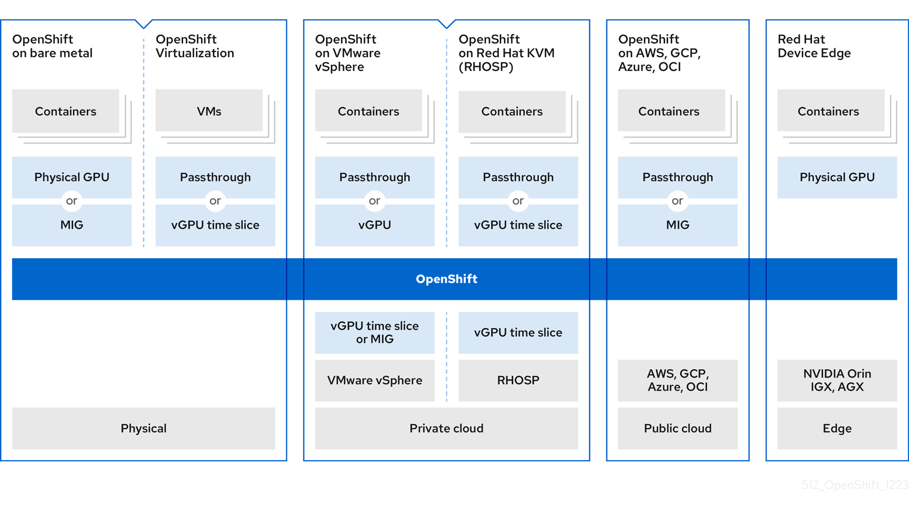

# NVIDIA GPU architecture { #nvidia-gpu-architecture }

NVIDIA supports the use of graphics processing unit (GPU) resources on OpenShift Container Platform. OpenShift Container Platform is a security-focused and hardened Kubernetes platform developed and supported by Red Hat for deploying and managing Kubernetes clusters at scale. OpenShift Container Platform includes enhancements to Kubernetes so that users can easily configure and use NVIDIA GPU resources to accelerate workloads.

The NVIDIA GPU Operator uses the Operator framework within OpenShift Container Platform to manage the full lifecycle of NVIDIA software components required to run GPU-accelerated workloads.

These components include the NVIDIA drivers (to enable CUDA), the Kubernetes device plugin for GPUs, the NVIDIA Container Toolkit, automatic node tagging using GPU feature discovery (GFD), DCGM-based monitoring, and others.

!!! note

    The NVIDIA GPU Operator is only supported by NVIDIA. For more information about obtaining support from NVIDIA, see [Obtaining Support from NVIDIA](https://access.redhat.com/solutions/5174941).

## NVIDIA GPU prerequisites { #nvidia-gpu-prerequisites_nvidia-gpu-architecture }

Before using graphics processing unit (GPU) resources on OpenShift Container Platform, you must meet certain prerequisites so that NVIDIA GPU resources can effectively accelerate workloads.

The following list details these prerequisites:

- You have a working OpenShift Container Platform cluster with at least one GPU worker node.
- You have access to the OpenShift Container Platform cluster as a `cluster-admin` to perform the required steps.
- You installed OpenShift CLI (`oc`).
- You installed the node feature discovery (NFD) Operator and created a `nodefeaturediscovery` instance.

## NVIDIA GPU enablement { #nvidia-gpu-enablement_nvidia-gpu-architecture }

The following diagram shows how the GPU architecture is enabled for OpenShift:

**Figure 1. NVIDIA GPU enablement**

!!! note

    MIG is supported on GPUs starting with the NVIDIA Ampere generation. For a list of GPUs that support MIG, see the [NVIDIA MIG User Guide](https://docs.nvidia.com/datacenter/tesla/mig-user-guide/#supported-gpus).

### GPUs and bare metal { #nvidia-gpu-bare-metal_nvidia-gpu-architecture }

You can deploy OpenShift Container Platform on an NVIDIA-certified bare-metal server. However, consider several limitations that might affect your objectives.

The following list details these limitations:

- Control plane nodes can be CPU nodes.

- Worker nodes must be GPU nodes, provided that AI/ML workloads are executed on these worker nodes.

    In addition, the worker nodes can host one or more GPUs, but they must be of the same type. For example, a node can have two NVIDIA A100 GPUs, but a node with one A100 GPU and one T4 GPU is not supported. The NVIDIA Device Plugin for Kubernetes does not support mixing different GPU models on the same node.

- When using OpenShift Container Platform, note that one or three or more servers are required. Clusters with two servers are not supported. The single server deployment is called single-node OpenShift and using this configuration results in a non-high availability OpenShift Container Platform environment.

You can choose one of the following methods to access the containerized GPUs:

- GPU passthrough
- Multi-Instance GPU (MIG)

**Additional resources**

- [Red Hat OpenShift on Bare Metal Stack](https://docs.nvidia.com/ai-enterprise/deployment-guide-openshift-on-bare-metal/0.1.0/on-bare-metal.html)

### GPUs and virtualization { #nvidia-gpu-virtualization_nvidia-gpu-architecture }

With OpenShift Virtualization, you can develop and maintain applications that run on virtual machines (VMs). These capabilities enable enterprises to incorporate VMs into containerized workflows within clusters.

Many developers and enterprises are moving to containerized applications and serverless infrastructures, but interest exists in developing and maintaining applications that run on virtual machines (VMs).

You can choose one of the following methods to connect the worker nodes to the GPUs:

- GPU passthrough to access and use GPU hardware within a VM.
- GPU (vGPU) time-slicing, when GPU compute capacity is not saturated by workloads.

**Additional resources**

- [NVIDIA GPU Operator with OpenShift Virtualization](https://docs.nvidia.com/datacenter/cloud-native/gpu-operator/latest/openshift/openshift-virtualization.html)

### GPUs and vSphere { #nvidia-gpu-vsphere_nvidia-gpu-architecture }

You can deploy OpenShift Container Platform on an NVIDIA-certified VMware vSphere server that can host different GPU types.

An NVIDIA GPU driver must be installed in the hypervisor if vGPU instances are used by the VMs. For vSphere, this host driver is provided in the form of a VIB file.

The maximum number of vGPUs that can be allocated to worker node VMs depends on the version of vSphere:

- vSphere 7.0: maximum 4 vGPU per VM

- vSphere 8.0: maximum 8 vGPU per VM

    !!! note

        vSphere 8.0 introduced support for multiple full or fractional heterogeneous profiles associated with a VM.

You can choose one of the following methods to attach the worker nodes to the GPUs:

- GPU passthrough for accessing and using GPU hardware within a virtual machine (VM)
- GPU (vGPU) time-slicing, when not all of the GPU is needed

Similar to bare-metal deployments, one or three or more servers are required. Clusters with two servers are not supported.

**Additional resources**

- [OpenShift Container Platform on VMware vSphere with NVIDIA vGPUs](https://docs.nvidia.com/datacenter/cloud-native/gpu-operator/latest/openshift/nvaie-with-ocp.html#openshift-container-platform-on-vmware-vsphere-with-nvidia-vgpus)

### GPUs and Red Hat KVM { #nvidia-gpu-kvm_nvidia-gpu-architecture }

You can use OpenShift Container Platform on an NVIDIA-certified kernel-based virtual machine (KVM) server. Similar to bare metal deployments, one or three or more servers are required. 

Clusters with two servers are not supported.

However, unlike bare metal deployments, you can use different types of GPUs in the server. This is because you can assign these GPUs to different VMs that act as Kubernetes nodes. The only limitation is that a Kubernetes node must have the same set of GPU types at its own level.

You can choose one of the following methods to access the containerized GPUs:

- GPU passthrough for accessing and using GPU hardware within a virtual machine (VM)
- GPU (vGPU) time-slicing when not all of the GPU is needed

To enable the vGPU capability, a special driver must be installed at the host level. This driver is delivered as an RPM package. This host driver is not required for GPU passthrough allocation.

### GPUs and CSPs { #nvidia-gpu-csps_nvidia-gpu-architecture }

You can deploy OpenShift Container Platform to one of the major cloud service providers (CSPs): Amazon Web Services (AWS), Google Cloud, or Microsoft Azure.

Two modes of operation are available: a fully managed deployment and a self-managed deployment.

- In a fully managed deployment, everything is automated by Red Hat in collaboration with CSP. You can request an OpenShift Container Platform instance through the CSP web console, and the cluster is automatically created and fully managed by Red Hat. Red Hat manages infrastructure operations, including node failure recovery and environment maintenance. Red Hat is fully responsible for maintaining the uptime of the cluster. The fully managed services are available on AWS, Azure, and Google Cloud. For AWS, the OpenShift Container Platform service is called (Red Hat OpenShift Container Platform Service on AWS). For Azure, the service is called Azure Red Hat OpenShift. For Google Cloud, the service is called OpenShift Dedicated on Google Cloud.
- In a self-managed deployment, you are responsible for instantiating and maintaining the OpenShift Container Platform cluster. Red Hat provides the OpenShift Container Platform install utility to support the deployment of the OpenShift Container Platform cluster in this case. The self-managed services are available globally to all CSPs.

!!! warning

    The compute instance must be a GPU-accelerated compute instance. Additionally, the GPU type must match the list of supported GPUs from NVIDIA AI Enterprise. For example, T4, V100, and A100 are part of this list.

You can choose one of the following methods to access the containerized GPUs:

- GPU passthrough to access and use GPU hardware within a virtual machine (VM).
- GPU (vGPU) time slicing when the entire GPU is not required.

**Additional resources**

- [Red Hat Openshift in the Cloud](https://docs.nvidia.com/ai-enterprise/deployment-guide-cloud/0.1.0/aws-redhat-openshift.html)

### GPUs and Red Hat Device Edge { #nvidia-gpu-red-hat-device-edge_nvidia-gpu-architecture }

Red Hat Device Edge provides access to MicroShift. MicroShift provides the simplicity of a single-node deployment with the functionality and services you need for resource-constrained (edge) computing. 

Red Hat Device Edge meets the needs of bare-metal, virtual, containerized, or Kubernetes workloads deployed in resource-constrained environments.

You can enable NVIDIA GPUs on containers in a Red Hat Device Edge environment.

You use GPU passthrough to access the containerized GPUs.

**Additional resources**

- [How to accelerate workloads with NVIDIA GPUs on Red Hat Device Edge](https://cloud.redhat.com/blog/how-to-accelerate-workloads-with-nvidia-gpus-on-red-hat-device-edge)

## GPU sharing methods { #nvidia-gpu-sharing-methods_nvidia-gpu-architecture }

Red Hat and NVIDIA have developed GPU concurrency and sharing mechanisms to simplify GPU-accelerated computing on an enterprise-level OpenShift Container Platform cluster.

Applications typically have different compute requirements that can leave GPUs underutilized. Providing the right amount of compute resources for each workload is critical to reduce deployment cost and maximize GPU utilization.

Concurrency mechanisms for improving GPU utilization exist in the range from programming model APIs to system software and hardware partitioning, including virtualization.

The following list shows the GPU concurrency mechanisms:

- Compute Unified Device Architecture (CUDA) streams
- Time-slicing
- CUDA Multi-Process Service (MPS)
- Multi-instance GPU (MIG)
- Virtualization with vGPU

Consider the following GPU sharing suggestions when using the GPU concurrency mechanisms for different OpenShift Container Platform scenarios:

Bare metal
:   vGPU is not available. Consider using MIG-enabled cards.

VMs
:   vGPU is the preferred choice.

Older NVIDIA cards with no MIG on bare metal
:   Consider using time-slicing.

VMs with multiple GPUs and you want passthrough and vGPU
:   Consider using separate VMs.

Bare metal with OpenShift Virtualization and multiple GPUs
:   Consider using pass-through for hosted VMs and time-slicing for containers.

**Additional resources**

- [Improving GPU Utilization](https://developer.nvidia.com/blog/improving-gpu-utilization-in-kubernetes/)

### CUDA streams { #nvidia-gpu-cuda-streams_nvidia-gpu-architecture }

Compute Unified Device Architecture (CUDA) is a parallel computing platform and programming model developed by NVIDIA for general computing on GPUs.

A stream is a sequence of operations that executes in issue-order on the GPU. CUDA commands are typically executed sequentially in a default stream and a task does not start until a preceding task has completed.

Asynchronous processing of operations across different streams allows for parallel execution of tasks. A task issued in one stream runs before, during, or after another task is issued into another stream. This task process allows the GPU to run multiple tasks simultaneously in no prescribed order, leading to improved performance.

**Additional resources**

- [Asynchronous Concurrent Execution](https://docs.nvidia.com/cuda/cuda-c-programming-guide/index.html#asynchronous-concurrent-execution)

### Time-slicing { #nvidia-gpu-time-slicing_nvidia-gpu-architecture }

GPU time-slicing interleaves workloads scheduled on overloaded GPUs when you are running multiple CUDA applications.

You can enable time-slicing of GPUs on Kubernetes by defining a set of replicas for a GPU, each of which can be independently distributed to a pod to run workloads on. Unlike multi-instance GPU (MIG), no memory or fault isolation between replicas, but for some workloads this is better than not sharing at all. Internally, GPU time-slicing is used to multiplex workloads from replicas of the same underlying GPU.

You can apply a cluster-wide default configuration for time-slicing. You can also apply node-specific configurations. For example, you can apply a time-slicing configuration only to nodes with Tesla T4 GPUs and not modify nodes with other GPU models.

You can combine these two approaches by applying a cluster-wide default configuration and then labeling nodes to give those nodes a node-specific configuration.

### CUDA Multi-Process Service { #nvidia-gpu-cuda-mps_nvidia-gpu-architecture }

CUDA Multi-Process Service (MPS) allows a single GPU to use multiple CUDA processes. The processes run in parallel on the GPU, eliminating saturation of the GPU compute resources. 

MPS also enables concurrent execution, or overlapping, of kernel operations and memory copying from different processes to enhance utilization.

**Additional resources**

- [CUDA MPS](https://docs.nvidia.com/deploy/mps/index.html)

### Multi-instance GPU { #nvidia-gpu-mig-gpu_nvidia-gpu-architecture }

Using Multi-instance GPU (MIG), you can split GPU compute units and memory into multiple MIG instances. Each of these instances represents a standalone GPU device from a system perspective and can be connected to any application, container, or virtual machine running on the node. 

The software that uses the GPU treats each of these MIG instances as an individual GPU.

MIG is useful when you have an application that does not require the full power of an entire GPU. By using the MIG feature of the new NVIDIA Ampere architecture, you can split your hardware resources into multiple GPU instances, each of which is available to the operating system as an independent CUDA-enabled GPU.

NVIDIA GPU Operator version 1.7.0 and later provides MIG support for the A100 and A30 Ampere cards. These GPU instances are designed to support up to seven independent CUDA applications so that they operate completely isolated with dedicated hardware resources.

**Additional resources**

- [NVIDIA Multi-Instance GPU User Guide](https://docs.nvidia.com/datacenter/tesla/mig-user-guide/)

### Virtualization with vGPU { #nvidia-gpu-virtualization-with-gpu_nvidia-gpu-architecture }

Virtual machines (VMs) can directly access a single physical GPU using NVIDIA vGPU. You can create virtual GPUs that can be shared by VMs across the enterprise and accessed by other devices.

This capability combines the power of GPU performance with the management and security benefits that vGPU provides. The following list details additional benefits provided by vGPU:

- Proactive management and monitoring for your VM environment
- Workload balancing for mixed VDI and compute workloads
- Resource sharing across multiple VMs

**Additional resources**

- [Virtual GPUs](https://www.nvidia.com/en-us/data-center/virtual-solutions/)

## NVIDIA GPU features for OpenShift Container Platform { #nvidia-gpu-features_nvidia-gpu-architecture }

Learn about the NVIDIA GPU features, software components, and monitoring tools available to accelerate containerized workloads in OpenShift Container Platform.

NVIDIA Container Toolkit
:   By using the NVIDIA Container Toolkit, you can create and run GPU-accelerated containers. The toolkit includes a container runtime library and utilities to automatically configure containers to use NVIDIA GPUs.

NVIDIA AI Enterprise
:   NVIDIA AI Enterprise is an end-to-end, cloud-native suite of AI and data analytics software optimized, certified, and supported with NVIDIA-Certified systems.

    NVIDIA AI Enterprise includes support for Red Hat OpenShift Container Platform. The following installation methods are supported:

    - OpenShift Container Platform on bare metal or VMware vSphere with GPU Passthrough.
    - OpenShift Container Platform on VMware vSphere with NVIDIA vGPU.

GPU Feature Discovery
:   NVIDIA GPU Feature Discovery for Kubernetes is a software component that you can use to automatically generate labels for the GPUs available on a node. GPU Feature Discovery uses node feature discovery (NFD) to perform this labeling.

    The Node Feature Discovery Operator (NFD) manages the discovery of hardware features and configurations in an OpenShift Container Platform cluster by labeling nodes with hardware-specific information. NFD labels the host with node-specific attributes, such as PCI cards, kernel, OS version, and so on.

    You can find the NFD Operator in the Operator Hub by searching for “Node Feature Discovery”.

NVIDIA GPU Operator with OpenShift Virtualization
:   The GPU Operator only provisioned worker nodes to run GPU-accelerated containers. The GPU Operator can also provision worker nodes for running GPU-accelerated virtual machines (VMs).

    You can configure the GPU Operator to deploy different software components to worker nodes depending on which GPU workload is configured to run on those nodes.

GPU Monitoring dashboard
:   You can install a monitoring dashboard to display GPU usage information on the cluster **Observe** page in the OpenShift Container Platform web console. GPU utilization information includes the number of available GPUs, power consumption (in watts), temperature (in degrees Celsius), utilization (in percent), and other metrics for each GPU.

**Additional resources**

- [NVIDIA-Certified Systems](https://docs.nvidia.com/ngc/ngc-deploy-on-premises/nvidia-certified-systems/index.html)
- [NVIDIA AI Enterprise](https://docs.nvidia.com/ai-enterprise/index.html#deployment-guides)
- [NVIDIA Container Toolkit](https://docs.nvidia.com/datacenter/cloud-native/container-toolkit/overview.html#)
- [Enabling the GPU Monitoring Dashboard](https://docs.nvidia.com/datacenter/cloud-native/openshift/latest/enable-gpu-monitoring-dashboard.html)
- [MIG Support in OpenShift Container Platform](https://docs.nvidia.com/datacenter/cloud-native/openshift/latest/mig-ocp.html)
- [Time-slicing NVIDIA GPUs in OpenShift](https://docs.nvidia.com/datacenter/cloud-native/openshift/latest/time-slicing-gpus-in-openshift.html)
- [Deploy GPU Operators in a disconnected or airgapped environment](https://docs.nvidia.com/datacenter/cloud-native/openshift/latest/mirror-gpu-ocp-disconnected.html)
- [Node Feature Discovery Operator](../hardware_enablement/psap-node-feature-discovery-operator.md)
