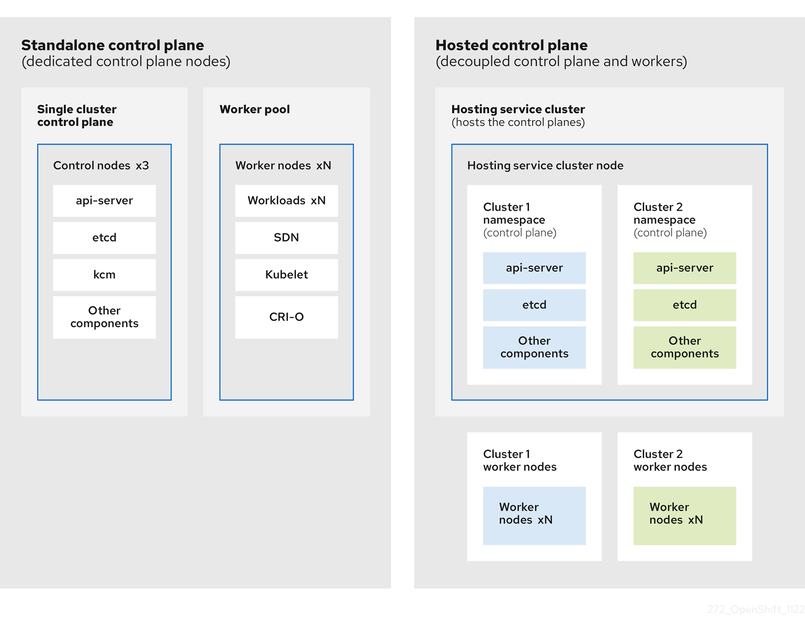
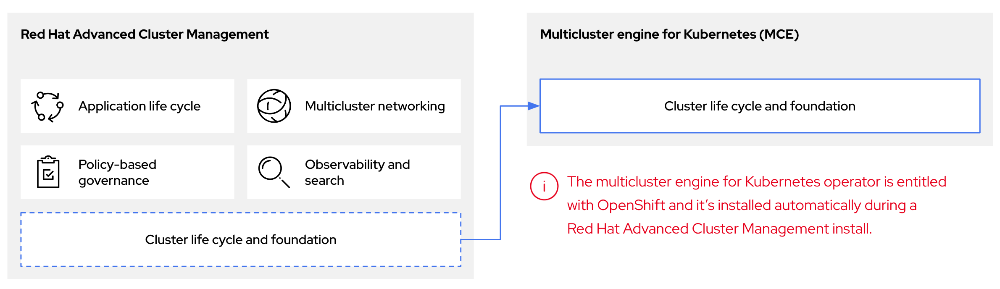
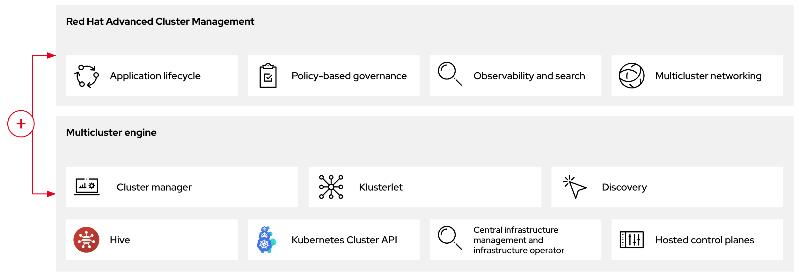

# Hosted control planes overview { #hcp-overview }

You can deploy OpenShift Container Platform clusters by using two different control plane configurations: standalone or hosted control planes. 

The standalone configuration uses dedicated virtual machines or physical machines to host the control plane. With hosted control planes for OpenShift Container Platform, you create control planes as pods on a management cluster without the need for dedicated virtual or physical machines for each control plane.

## Introduction to hosted control planes { #hosted-control-planes-overview_hcp-overview }

Hosted control planes is available by using a supported version of multicluster engine for Kubernetes Operator on several platforms.

You can deploy hosted control planes on the following platforms:

- Bare metal by using the Agent provider
- Non-bare-metal Agent machines, as a Technology Preview feature
- OpenShift Virtualization
- Amazon Web Services (AWS)
- IBM Z
- IBM Power
- Red Hat OpenStack Platform (RHOSP) 17.1, as a Technology Preview feature

The hosted control planes feature is enabled by default.

!!! note

    The multicluster engine Operator is an integral part of Red Hat Advanced Cluster Management (RHACM) and is enabled by default with RHACM. However, you do not need RHACM to use hosted control planes.

### Architecture of hosted control planes { #hosted-control-planes-architecture_hcp-overview }

OpenShift Container Platform is often deployed in a coupled, or standalone, model, where a cluster consists of a control plane and a data plane. The control plane includes an API endpoint, a storage endpoint, a workload scheduler, and an actuator that ensures state. The data plane includes compute, storage, and networking where workloads and applications run.

The standalone control plane is hosted by a dedicated group of nodes, which can be physical or virtual, with a minimum number to ensure quorum. The network stack is shared. Administrator access to a cluster offers visibility into the cluster’s control plane, machine management APIs, and other components that contribute to the state of a cluster.

Although the standalone model works well, some situations require an architecture where the control plane and data plane are decoupled. In those cases, the data plane is on a separate network domain with a dedicated physical hosting environment. The control plane is hosted by using high-level primitives such as deployments and stateful sets that are native to Kubernetes. The control plane is treated as any other workload.



### Benefits of hosted control planes { #hosted-control-planes-benefits_hcp-overview }

With hosted control planes, you can pave the way for a true hybrid-cloud approach and enjoy several other benefits.

- The security boundaries between management and workloads are stronger because the control plane is decoupled and hosted on a dedicated hosting service cluster. As a result, you are less likely to leak credentials for clusters to other users. Because infrastructure secret account management is also decoupled, cluster infrastructure administrators cannot accidentally delete control plane infrastructure.
- With hosted control planes, you can run many control planes on fewer nodes. As a result, clusters are more affordable.
- Because the control planes consist of pods that are launched on OpenShift Container Platform, control planes start quickly. The same principles apply to control planes and workloads, such as monitoring, logging, and auto-scaling.
- From an infrastructure perspective, you can push registries, HAProxy, cluster monitoring, storage nodes, and other infrastructure components to the tenant’s cloud provider account, isolating usage to the tenant.
- From an operational perspective, multicluster management is more centralized, which results in fewer external factors that affect the cluster status and consistency. Site reliability engineers have a central place to debug issues and navigate to the cluster data plane, which can lead to shorter Time to Resolution (TTR) and greater productivity.

**Additional resources**

- [Cluster lifecycle with multicluster engine for Kubernetes Operator overview (Red Hat Advanced Cluster Management official documentation)](https://docs.redhat.com/en/documentation/red_hat_advanced_cluster_management_for_kubernetes/2.16/html/clusters/cluster_mce_overview#cluster_mce_overview)

## Differences between hosted control planes and OpenShift Container Platform { #hcp-ocp-differences_hcp-overview }

Hosted control planes is a form factor of OpenShift Container Platform. Hosted clusters and the standalone OpenShift Container Platform clusters are configured and managed differently. 

See the following tables to understand the differences between OpenShift Container Platform and hosted control planes:

### Cluster creation and lifecycle { #cluster-creation_hcp-overview }

<table>
<thead>
<tr>
  <th>OpenShift Container Platform</th>
  <th>Hosted control planes</th>
</tr>
</thead>
<tbody>
<tr>
  <td>You install a standalone OpenShift Container Platform cluster by using the <code>openshift-install</code> binary or the Assisted Installer.</td>
  <td>You install a hosted cluster by using the <code>hypershift.openshift.io</code> API resources such as <code>HostedCluster</code> and <code>NodePool</code>, on an existing OpenShift Container Platform cluster.</td>
</tr>
</tbody>
</table>


### Cluster configuration { #cluster-configuration_hcp-overview }

<table>
<thead>
<tr>
  <th>OpenShift Container Platform</th>
  <th>Hosted control planes</th>
</tr>
</thead>
<tbody>
<tr>
  <td>You configure cluster-scoped resources such as authentication, API server, and proxy by using the <code>config.openshift.io</code> API group.</td>
  <td>You configure resources that impact the control plane in the <code>HostedCluster</code> resource.</td>
</tr>
</tbody>
</table>


### etcd encryption { #etcd-encryption_hcp-overview }

<table>
<thead>
<tr>
  <th>OpenShift Container Platform</th>
  <th>Hosted control planes</th>
</tr>
</thead>
<tbody>
<tr>
  <td>You configure etcd encryption by using the <code>APIServer</code> resource with AES-GCM or AES-CBC. For more information, see "Enabling etcd encryption".</td>
  <td>You configure etcd encryption by using the <code>HostedCluster</code> resource in the <code>SecretEncryption</code> field with AES-CBC or KMS for Amazon Web Services.</td>
</tr>
</tbody>
</table>


### Operators and control plane { #operators-and-control-plane_hcp-overview }

<table>
<thead>
<tr>
  <th>OpenShift Container Platform</th>
  <th>Hosted control planes</th>
</tr>
</thead>
<tbody>
<tr>
  <td>A standalone OpenShift Container Platform cluster contains separate Operators for each control plane component.</td>
  <td>A hosted cluster contains a single Operator named Control Plane Operator that runs in the hosted control plane namespace on the management cluster.</td>
</tr>
<tr>
  <td>etcd uses storage that is mounted on the control plane nodes. The etcd cluster Operator manages etcd.</td>
  <td>etcd uses a persistent volume claim for storage and is managed by the Control Plane Operator.</td>
</tr>
<tr>
  <td>The Ingress Operator, network related Operators, and Operator Lifecycle Manager (OLM) run on the cluster.</td>
  <td>The Ingress Operator, network related Operators, and Operator Lifecycle Manager (OLM) run in the hosted control plane namespace on the management cluster.</td>
</tr>
<tr>
  <td>The OAuth server runs inside the cluster and is exposed through a route in the cluster.</td>
  <td>The OAuth server runs inside the control plane and is exposed through a route, node port, or load balancer on the management cluster.</td>
</tr>
</tbody>
</table>


### Updates { #upgrades_hcp-overview }

<table>
<thead>
<tr>
  <th>OpenShift Container Platform</th>
  <th>Hosted control planes</th>
</tr>
</thead>
<tbody>
<tr>
  <td>The Cluster Version Operator (CVO) orchestrates the update process and monitors the <code>ClusterVersion</code> resource. Administrators and OpenShift components can interact with the CVO through the <code>ClusterVersion</code> resource. The <code>oc adm upgrade</code> command results in a change to the <code>ClusterVersion.Spec.DesiredUpdate</code> field in the <code>ClusterVersion</code> resource.</td>
  <td>The hosted control planes update results in a change to the <code>.spec.release.image</code> field in the <code>HostedCluster</code> and <code>NodePool</code> resources. Any changes to the <code>ClusterVersion</code> resource are ignored.</td>
</tr>
<tr>
  <td>After you update an OpenShift Container Platform cluster, both the control plane and compute machines are updated.</td>
  <td>After you update the hosted cluster, only the control plane is updated. You perform node pool updates separately.</td>
</tr>
</tbody>
</table>


### Machine configuration and management { #machine-config-manage_hcp-overview }

<table>
<thead>
<tr>
  <th>OpenShift Container Platform</th>
  <th>Hosted control planes</th>
</tr>
</thead>
<tbody>
<tr>
  <td>The <code>MachineSets</code> resource manages machines in the <code>openshift-machine-api</code> namespace.</td>
  <td>The <code>NodePool</code> resource manages machines on the management cluster.</td>
</tr>
<tr>
  <td>A set of control plane machines are available.</td>
  <td>A set of control plane machines do not exist.</td>
</tr>
<tr>
  <td>You enable a machine health check by using the <code>MachineHealthCheck</code> resource.</td>
  <td>You enable a machine health check through the <code>.spec.management.autoRepair</code> field in the <code>NodePool</code> resource.</td>
</tr>
<tr>
  <td>You enable autoscaling by using the <code>ClusterAutoscaler</code> and <code>MachineAutoscaler</code> resources.</td>
  <td>You enable autoscaling through the <code>spec.autoScaling</code> field in the <code>NodePool</code> resource.</td>
</tr>
<tr>
  <td>Machines and machine sets are exposed in the cluster.</td>
  <td>Machines, machine sets, and machine deployments from upstream Cluster CAPI Operator are used to manage machines but are not exposed to the user.</td>
</tr>
<tr>
  <td>All machine sets are upgraded automatically when you update the cluster.</td>
  <td>You update your node pools independently from the hosted cluster updates.</td>
</tr>
<tr>
  <td>Only an in-place upgrade is supported in the cluster.</td>
  <td>Both replace and in-place upgrades are supported in the hosted cluster.</td>
</tr>
<tr>
  <td>The Machine Config Operator manages configurations for machines.</td>
  <td>The Machine Config Operator does not exist in hosted control planes.</td>
</tr>
<tr>
  <td>You configure machine Ignition by using the <code>MachineConfig</code>, <code>KubeletConfig</code>, and <code>ContainerRuntimeConfig</code> resources that are selected from a <code>MachineConfigPool</code> selector.</td>
  <td>You configure the <code>MachineConfig</code>, <code>KubeletConfig</code>, and <code>ContainerRuntimeConfig</code> resources through the config map referenced in the <code>spec.config</code> field of the <code>NodePool</code> resource.</td>
</tr>
<tr>
  <td>The Machine Config Daemon (MCD) manages configuration changes and updates on each of the nodes.</td>
  <td>For an in-place upgrade, the node pool controller creates a run-once pod that updates a machine based on your configuration.</td>
</tr>
<tr>
  <td>You can modify the machine configuration resources such as the SR-IOV Operator.</td>
  <td>You cannot modify the machine configuration resources.</td>
</tr>
</tbody>
</table>


### Networking { #netowrking_hcp-overview }

<table>
<thead>
<tr>
  <th>OpenShift Container Platform</th>
  <th>Hosted control planes</th>
</tr>
</thead>
<tbody>
<tr>
  <td>The Kube API server communicates with nodes directly, because the Kube API server and nodes exist in the same Virtual Private Cloud (VPC).</td>
  <td>The Kube API server communicates with nodes through Konnectivity. The Kube API server and nodes exist in a different Virtual Private Cloud (VPC).</td>
</tr>
<tr>
  <td>Nodes communicate with the Kube API server through the internal load balancer.</td>
  <td>Nodes communicate with the Kube API server through an external load balancer or a node port.</td>
</tr>
</tbody>
</table>


### Web console { #web-console_hcp-overview }

<table>
<thead>
<tr>
  <th>OpenShift Container Platform</th>
  <th>Hosted control planes</th>
</tr>
</thead>
<tbody>
<tr>
  <td>The web console shows the status of a control plane.</td>
  <td>The web console does not show the status of a control plane.</td>
</tr>
<tr>
  <td>You can update your cluster by using the web console.</td>
  <td>You cannot update the hosted cluster by using the web console.</td>
</tr>
<tr>
  <td>The web console displays the infrastructure resources such as machines.</td>
  <td>The web console does not display the infrastructure resources.</td>
</tr>
<tr>
  <td>You can configure machines through the <code>MachineConfig</code> resource by using the web console.</td>
  <td>You cannot configure machines by using the web console.</td>
</tr>
</tbody>
</table>


**Additional resources**

- [Enabling etcd encryption](etcd/etcd-encrypt.md#etcd-encrypt)

## Relationship between hosted control planes, multicluster engine Operator, and RHACM { #hcp-mce-acm-relationship-intro_hcp-overview }

You can configure hosted control planes by using the multicluster engine for Kubernetes Operator. The multicluster engine Operator cluster lifecycle defines the process of creating, importing, managing, and destroying Kubernetes clusters across various infrastructure cloud providers, private clouds, and on-premise data centers.

!!! note

    The multicluster engine Operator is an integral part of Red Hat Advanced Cluster Management and is enabled by default with RHACM. However, you do not need Red Hat Advanced Cluster Management to use hosted control planes.

The multicluster engine Operator is the cluster lifecycle Operator that provides cluster management capabilities for OpenShift Container Platform and RHACM hub clusters. The multicluster engine Operator enhances cluster fleet management and supports OpenShift Container Platform cluster lifecycle management across clouds and data centers.

**Figure 1. Cluster life cycle and foundation**



You can use the multicluster engine Operator with OpenShift Container Platform as a standalone cluster manager or as part of a RHACM hub cluster.

!!! tip

    A management cluster is also known as the hosting cluster.

You can deploy OpenShift Container Platform clusters by using two different control plane configurations: standalone or hosted control planes. The standalone configuration uses dedicated virtual machines or physical machines to host the control plane. With hosted control planes for OpenShift Container Platform, you create control planes as pods on a management cluster without the need for dedicated virtual or physical machines for each control plane.

**Figure 2. RHACM and the multicluster engine Operator introduction diagram**



### Hosted clusters in Red Hat Advanced Cluster Management { #hcp-acm-discover_hcp-overview }

You can bring hosted clusters to a Red Hat Advanced Cluster Management hub cluster to manage them with Red Hat Advanced Cluster Management management components.

For more information, see "Discovering multicluster engine Operator hosted clusters in Red Hat Advanced Cluster Management".

**Additional resources**

- [Discovering multicluster engine Operator hosted clusters in Red Hat Advanced Cluster Management (Red Hat Advanced Cluster Management official documentation)](https://docs.redhat.com/en/documentation/red_hat_advanced_cluster_management_for_kubernetes/2.11/html/clusters/cluster_mce_overview#discover-hosted-acm)

## Versioning for hosted control planes { #hosted-control-planes-version-support_hcp-overview }

The hosted control planes feature includes several components that might require independent versioning and support levels.

Those components are as follows:

- Management cluster
- HyperShift Operator
- Hosted control planes (`hcp`) command-line interface (CLI)
- `hypershift.openshift.io` API
- Control Plane Operator

### Management cluster { #hcp-versioning-mgmt_hcp-overview }

In management clusters for production use, you need multicluster engine for Kubernetes Operator, which is available through the software catalog. The multicluster engine Operator bundles a supported build of the HyperShift Operator. For your management clusters to remain supported, you must use the version of OpenShift Container Platform that multicluster engine Operator runs on. In general, a new release of multicluster engine Operator runs on the following versions of OpenShift Container Platform:

- The latest General Availability version of OpenShift Container Platform
- Two versions before the latest General Availability version of OpenShift Container Platform

The full list of OpenShift Container Platform versions that you can install through the HyperShift Operator on a management cluster depends on the version of your HyperShift Operator. However, the list always includes at least the same OpenShift Container Platform version as the management cluster and two previous minor versions relative to the management cluster. For example, if the management cluster is running 4.17 and a supported version of multicluster engine Operator, the HyperShift Operator can install 4.17, 4.16, 4.15, and 4.14 hosted clusters.

With each major, minor, or patch version release of OpenShift Container Platform, two components of hosted control planes are released:

- The HyperShift Operator
- The `hcp` command-line interface (CLI)

### HyperShift Operator { #hcp-versioning-ho_hcp-overview }

The HyperShift Operator manages the lifecycle of hosted clusters that are represented by the `HostedCluster` API resources. The HyperShift Operator is released with each OpenShift Container Platform release. The HyperShift Operator creates the `supported-versions` config map in the `hypershift` namespace. The config map contains the supported hosted cluster versions.

You can host different versions of control planes on the same management cluster.

```yaml title="Example supported-versions config map object"
    apiVersion: v1
    data:
      supported-versions: '{"versions":["4.22"]}'
    kind: ConfigMap
    metadata:
      labels:
        hypershift.openshift.io/supported-versions: "true"
      name: supported-versions
      namespace: hypershift
```

### hosted control planes CLI { #hcp-versioning-cli_hcp-overview }

You can use the `hcp` CLI to create hosted clusters. You can download the CLI from multicluster engine Operator. When you run the `hcp version` command, the output shows the latest OpenShift Container Platform that the CLI supports against your `kubeconfig` file.

### hypershift.openshift.io API { #hcp-versioning-api_hcp-overview }

You can use the `hypershift.openshift.io` API resources, such as, `HostedCluster` and `NodePool`, to create and manage OpenShift Container Platform clusters at scale. A `HostedCluster` resource contains the control plane and common data plane configuration. When you create a `HostedCluster` resource, you have a fully functional control plane with no attached nodes. A `NodePool` resource is a scalable set of worker nodes that is attached to a `HostedCluster` resource.

The API version policy generally aligns with the policy for Kubernetes API versioning.

Updates for hosted control planes involve updating the hosted cluster and the node pools. For more information, see "Updates for hosted control planes".

### Control Plane Operator { #hcp-versioning-cpo_hcp-overview }

The Control Plane Operator is released as part of each OpenShift Container Platform payload release image for the following architectures:

- amd64
- arm64
- multi-arch

**Additional resources**

- [Kubernetes API versioning](https://kubernetes.io/docs/reference/using-api/#api-versioning)
- [AMD64 release images](https://amd64.ocp.releases.ci.openshift.org/)
- [ARM64 release images](https://arm64.ocp.releases.ci.openshift.org/)
- [Multi-arch release images](https://multi.ocp.releases.ci.openshift.org/)

## Glossary of common concepts and personas for hosted control planes { #hosted-control-planes-concepts-personas_hcp-overview }

When you use hosted control planes for OpenShift Container Platform, it is important to understand its key concepts and the personas that are involved.

### Concepts { #hosted-control-planes-concepts_hcp-overview }

data plane
:   The part of the cluster that includes the compute, storage, and networking where workloads and applications run.

hosted cluster
:   An OpenShift Container Platform cluster with its control plane and API endpoint hosted on a management cluster. The hosted cluster includes the control plane and its corresponding data plane.

hosted cluster infrastructure
:   Network, compute, and storage resources that exist in the tenant or end-user cloud account.

hosted control plane
:   An OpenShift Container Platform control plane that runs on the management cluster, which is exposed by the API endpoint of a hosted cluster. The components of a control plane include etcd, the Kubernetes API server, the Kubernetes controller manager, and a VPN.

hosting cluster
:   See *management cluster*.

managed cluster
:   A cluster that the hub cluster manages. This term is specific to the cluster lifecycle that the multicluster engine for Kubernetes Operator manages in Red Hat Advanced Cluster Management. A managed cluster is not the same thing as a *management cluster*. For more information, see [Managed cluster](https://docs.redhat.com/en/documentation/red_hat_advanced_cluster_management_for_kubernetes/2.16/html/about/welcome-to-red-hat-advanced-cluster-management-for-kubernetes#managed-cluster).

management cluster
:   An OpenShift Container Platform cluster where the HyperShift Operator is deployed and where the control planes for hosted clusters are hosted. The management cluster is synonymous with the *hosting cluster*.

management cluster infrastructure
:   Network, compute, and storage resources of the management cluster.

node pool
:   A resource that manages a set of compute nodes that are associated with a hosted cluster. The compute nodes run applications and workloads within the hosted cluster.

### Personas { #hosted-control-planes-personas_hcp-overview }

cluster instance administrator
:   Users who assume this role are the equivalent of administrators in standalone OpenShift Container Platform. This user has the `cluster-admin` role in the provisioned cluster, but might not have power over when or how the cluster is updated or configured. This user might have read-only access to see some configuration projected into the cluster.

cluster instance user
:   Users who assume this role are the equivalent of developers in standalone OpenShift Container Platform. This user does not have a view into the software catalog or machines.

cluster service consumer
:   Users who assume this role can request control planes and worker nodes, drive updates, or modify externalized configurations. Typically, this user does not manage or access cloud credentials or infrastructure encryption keys. The cluster service consumer persona can request hosted clusters and interact with node pools. Users who assume this role have role-based access control (RBAC) to create, read, update, or delete hosted clusters and node pools within a logical boundary.

cluster service provider
:   Users who assume this role typically have the `cluster-admin` role on the management cluster and have RBAC to monitor and own the availability of the HyperShift Operator and the control planes for the tenant’s hosted clusters. The cluster service provider persona is responsible for several activities, including the following examples:

    - Owning service-level objects for control plane availability, uptime, and stability
    - Configuring the cloud account for the management cluster to host control planes
    - Configuring the user-provisioned infrastructure, which includes the host awareness of available compute resources
