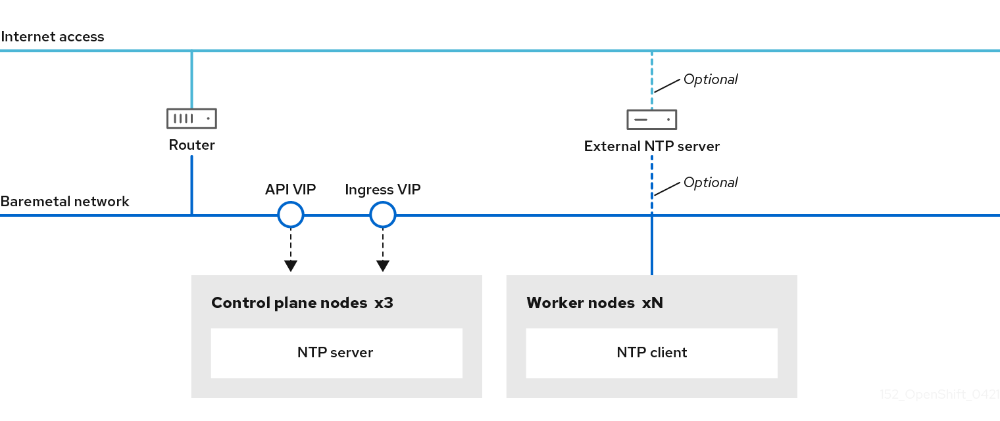
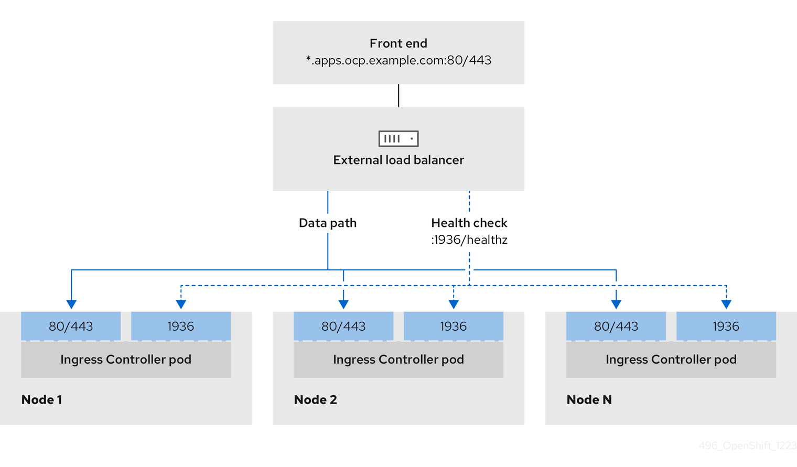
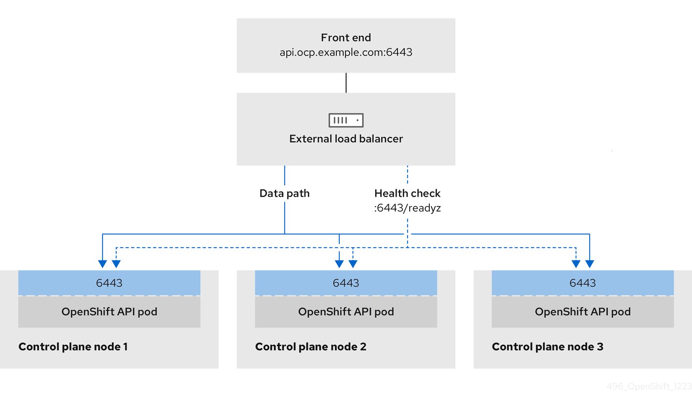
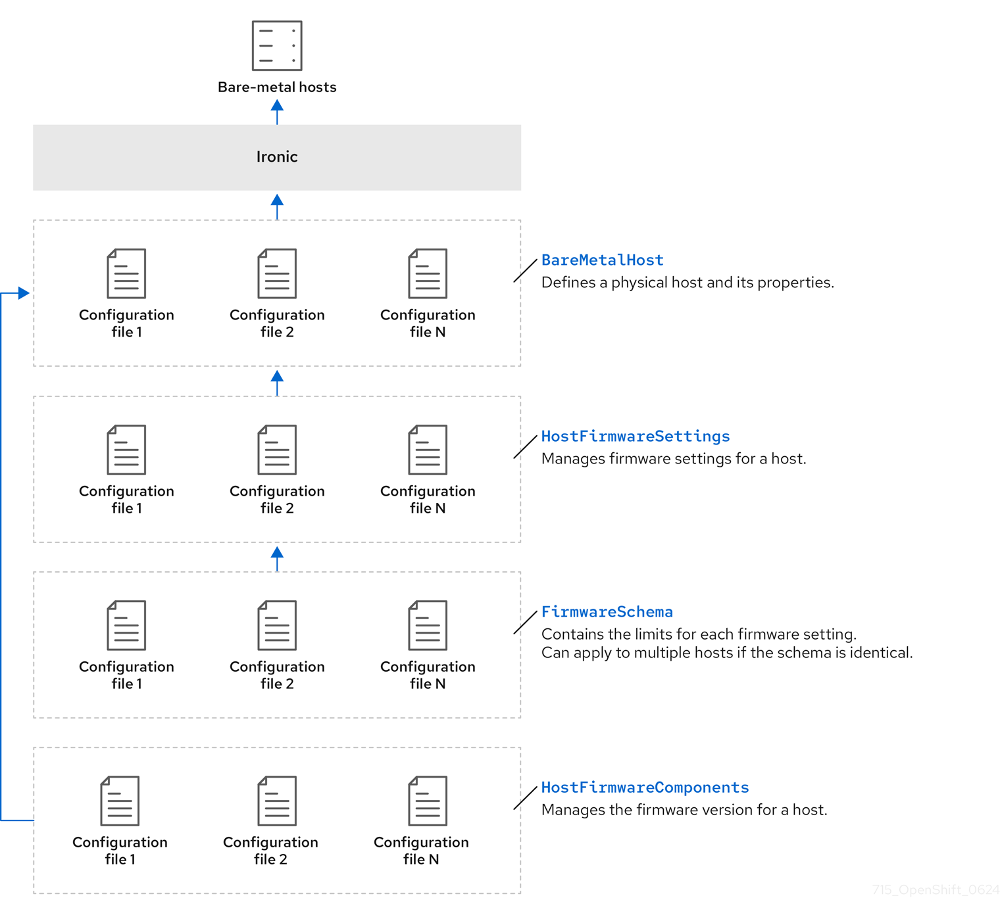

# Postinstallation configuration { #bare-metal-post-installation-configuration }

After successfully deploying a bare-metal cluster, you can perform post installation procedures such as configuring NTP, enabling a provisioning network, and configuring a user-managed load balancer. Customizing your cluster can help you prepare the cluster for specific workloads and deployment requirements.

## About the cluster API { #bare-metal-about-the-cluster-api_bare-metal-postinstallation-configuration }

OpenShift Container Platform 4.19 and later releases can manage machines by using the Cluster API.

!!! warning

    Managing machines with the Cluster API is a Technology Preview feature only. Technology Preview features are not supported with Red Hat production service level agreements (SLAs) and might not be functionally complete. Red Hat does not recommend using them in production. These features provide early access to upcoming product features, enabling customers to test functionality and provide feedback during the development process.

    For more information about the support scope of Red Hat Technology Preview features, see [Technology Preview Features Support Scope](https://access.redhat.com/support/offerings/techpreview/).

You can use the Cluster API to perform compute node provisioning management actions after the cluster installation finishes. The Cluster API allows dynamic management of compute node machine sets and machines. However, there is no support for control plane machines.

**Additional resources**

- [About the Cluster API](../../machine_management/cluster_api_machine_management/cluster-api-about.md#luster-api-about)
- [Getting started with the Cluster API](../../machine_management/cluster_api_machine_management/cluster-api-getting-started.md#cluster-api-getting-started)

## Configuring NTP for disconnected clusters { #configuring-ntp-for-disconnected-clusters_bare-metal-postinstallation-configuration }

You can configure NTP servers on control plane nodes and set compute nodes as NTP clients to ensure time synchronization in disconnected clusters that lack access to external NTP servers.

OpenShift Container Platform installs the `chrony` Network Time Protocol (NTP) service on the cluster nodes. Use the following procedure to configure NTP servers on the control plane nodes and configure compute nodes as NTP clients of the control plane nodes after a successful deployment.

**Figure 1. Configuring NTP for disconnected clusters**



OpenShift Container Platform nodes must agree on a date and time to run properly. When compute nodes retrieve the date and time from the NTP servers on the control plane nodes, it enables the installation and operation of clusters that are not connected to a routable network and thereby do not have access to a higher stratum NTP server.

**Procedure**

1. Install Butane on your installation host by using the following command:

    ```terminal
    $ sudo dnf -y install butane
    ```

2. Create a Butane config, `99-master-chrony-conf-override.bu`, including the contents of the `chrony.conf` file for the control plane nodes.

    !!! note

        See "Creating machine configs with Butane" for information about Butane.

    ```yaml
    variant: openshift
    version: 4.22.0
    metadata:
      name: 99-master-chrony-conf-override
      labels:
        machineconfiguration.openshift.io/role: master
    storage:
      files:
        - path: /etc/chrony.conf
          mode: 0644
          overwrite: true
          contents:
            inline: |
              # Use public servers from the pool.ntp.org project.
              # Please consider joining the pool (https://www.pool.ntp.org/join.html).

              # The Machine Config Operator manages this file
              server openshift-master-0.<cluster-name>.<domain> iburst
              server openshift-master-1.<cluster-name>.<domain> iburst
              server openshift-master-2.<cluster-name>.<domain> iburst

              stratumweight 0
              driftfile /var/lib/chrony/drift
              rtcsync
              makestep 10 3
              bindcmdaddress 127.0.0.1
              bindcmdaddress ::1
              keyfile /etc/chrony.keys
              commandkey 1
              generatecommandkey
              noclientlog
              logchange 0.5
              logdir /var/log/chrony

              # Configure the control plane nodes to serve as local NTP servers
              # for all compute nodes, even if they are not in sync with an
              # upstream NTP server.

              # Allow NTP client access from the local network.
              allow all
              # Serve time even if not synchronized to a time source.
              local stratum 3 orphan
    ```

    where:

    `<cluster-name>`
    :   Specifies the name of the cluster.

    `<domain>`
    :   Specifies the fully qualified domain name.

3. Use Butane to generate a `MachineConfig` object file, `99-master-chrony-conf-override.yaml`, containing the configuration to be delivered to the control plane nodes:

    ```terminal
    $ butane 99-master-chrony-conf-override.bu -o 99-master-chrony-conf-override.yaml
    ```

4. Create a Butane config, `99-worker-chrony-conf-override.bu`, including the contents of the `chrony.conf` file for the compute nodes that references the NTP servers on the control plane nodes.

    ```yaml
    variant: openshift
    version: 4.22.0
    metadata:
      name: 99-worker-chrony-conf-override
      labels:
        machineconfiguration.openshift.io/role: worker
    storage:
      files:
        - path: /etc/chrony.conf
          mode: 0644
          overwrite: true
          contents:
            inline: |
              # The Machine Config Operator manages this file.
              server openshift-master-0.<cluster-name>.<domain> iburst
              server openshift-master-1.<cluster-name>.<domain> iburst
              server openshift-master-2.<cluster-name>.<domain> iburst

              stratumweight 0
              driftfile /var/lib/chrony/drift
              rtcsync
              makestep 10 3
              bindcmdaddress 127.0.0.1
              bindcmdaddress ::1
              keyfile /etc/chrony.keys
              commandkey 1
              generatecommandkey
              noclientlog
              logchange 0.5
              logdir /var/log/chrony
    ```

    where:

    `<cluster-name>`
    :   Specifies the name of the cluster.

    `<domain>`
    :   Specifies the fully qualified domain name.

5. Use Butane to generate a `MachineConfig` object file, `99-worker-chrony-conf-override.yaml`, containing the configuration to be delivered to the worker nodes:

    ```terminal
    $ butane 99-worker-chrony-conf-override.bu -o 99-worker-chrony-conf-override.yaml
    ```

6. Apply the `99-master-chrony-conf-override.yaml` policy to the control plane nodes.

    ```terminal
    $ oc apply -f 99-master-chrony-conf-override.yaml
    ```

    ```terminal title="Example output"
    machineconfig.machineconfiguration.openshift.io/99-master-chrony-conf-override created
    ```

7. Apply the `99-worker-chrony-conf-override.yaml` policy to the compute nodes.

    ```terminal
    $ oc apply -f 99-worker-chrony-conf-override.yaml
    ```

    ```terminal title="Example output"
    machineconfig.machineconfiguration.openshift.io/99-worker-chrony-conf-override created
    ```

8. Check the status of the applied NTP settings.

    ```terminal
    $ oc describe machineconfigpool
    ```

## Configuring a local or self-signed Baseboard Management Controller CA certificate { #bare-metal-self-signed-cert-post-install_bare-metal-postinstallation-configuration }

You can configure a local or self-signed Baseboard Management Controller (BMC) CA certificate on a cluster that already has a CA certificate, or add one to a cluster that was installed without a CA certificate. Providing a local or self-signed CA certificate gives you more control over secure communication with bare metal BMC’s.

### Replacing an existing BMC CA certificate { #bare-metal-replace-existing-bmc-ca_bare-metal-postinstallation-configuration }

You can replace the BMC CA certificate with your own local or self-signed CA certificate by editing the `bmc-verify-ca` ConfigMap in the `openshift-machine-api` namespace. Providing your own CA certificate gives you control over the secure communications between your cluster and BMC’s.

**Prerequisites**

- You have installed a cluster on bare metal.
- You configured a CA certificate for BMC communication when you installed the cluster.
- You have a local or self-signed CA certificate.

**Procedure**

1. Edit the `bmc-verify-ca` ConfigMap by running the following command:

    ```terminal
    $ oc edit configmap bmc-verify-ca -n openshift-machine-api
    ```

2. Replace the contents of the `verify_ca.crt` stanza with your local or self-signed CA certificate, as in the following example:

    ```yaml
    apiVersion: v1
    data:
      verify_ca.crt: |
        -----BEGIN CERTIFICATE-----
        <self_signed_certificate_contents>
        -----END CERTIFICATE-----
    kind: ConfigMap
    ```

    where:

    `<self_signed_certificate_contents>`
    :   Specifies the contents of your local or self-signed CA certificate.

### Installing a new BMC CA certificate { #bare-metal-install-new-bmc-ca_bare-metal-postinstallation-configuration }

You can install a local or self-signed BMC CA certificate on a cluster which was installed without a BMC CA certificate. Providing your own BMC CA certificate secures the communication between your cluster and BMC’s.

**Prerequisites**

- You installed a cluster on bare metal without a BMC CA certificate.
- You have a local or self-signed CA certificate.

**Procedure**

1. Create a file called `bmc-verify-ca.yaml` using a text editor, with the following contents:

    ```yaml
    apiVersion: v1
    data:
      verify_ca.crt: |
        -----BEGIN CERTIFICATE-----
        <self_signed_certificate_contents>
        -----END CERTIFICATE-----
    kind: ConfigMap
    metadata:
      name: bmc-verify-ca
      namespace: openshift-machine-api
    ```

    where:

    `<self_signed_certificate_contents>`
    :   Specifies the contents of your local or self-signed CA certificate.

2. Apply the ConfigMap by running the following command:

    ```terminal
    $ oc apply -f bmc-verify-ca.yaml
    ```

3. Verify that the ConfigMap has been mounted in the Ironic container by running the following command:

    ```terminal
    $ oc exec -n openshift-machine-api \
      $(oc get pods -n openshift-machine-api -l app=metal3 -o jsonpath='{.items[0].metadata.name}') \
      -c metal3-ironic -- ls -l /certs/ca/bmc
    ```

    If successful, the command should display the certificate file.

4. For each bare metal host in your cluster that you want to secure BMC communications with, follow the procedure titled *Editing a BareMetalHost resource* and ensure that the `disableCertificateVerification` parameter is set to `false`.

**Additional resources**

- [Editing a `BareMetalHost` resource](bare-metal-postinstallation-configuration.md#bmo-editing-a-baremetalhost-resource_bare-metal-postinstallation-configuration)

## Enabling a provisioning network after installation { #enabling-a-provisioning-network-after-installation_bare-metal-postinstallation-configuration }

The Assisted Installer and installer-provisioned installation for bare-metal clusters provide the ability to deploy a cluster without a `provisioning` network. This capability is for scenarios such as proof-of-concept clusters or deploying exclusively with Redfish virtual media when each node’s baseboard management controller is routable via the `bare-metal` network.

You can enable a `provisioning` network after installation using the Cluster Baremetal Operator (CBO).

**Prerequisites**

- A dedicated physical network must exist, connected to all worker and control plane nodes.
- You must isolate the native, untagged physical network.
- The network cannot have a DHCP server when the `provisioningNetwork` configuration setting is set to `Managed`.
- You can omit the `provisioningInterface` setting in OpenShift Container Platform 4.10 to use the `bootMACAddress` configuration setting.

**Procedure**

1. When setting the `provisioningInterface` setting, first identify the provisioning interface name for the cluster nodes. For example, `eth0` or `eno1`.

2. Enable the Preboot eXecution Environment (PXE) on the `provisioning` network interface of the cluster nodes.

3. Retrieve the current state of the `provisioning` network and save it to a provisioning custom resource (CR) file:

    ```terminal
    $ oc get provisioning -o yaml > enable-provisioning-nw.yaml
    ```

4. Modify the provisioning CR file:

    ```terminal
    $ vim ~/enable-provisioning-nw.yaml
    ```

    Scroll down to the `provisioningNetwork` configuration setting and change it from `Disabled` to `Managed`. Then, add the `provisioningIP`, `provisioningNetworkCIDR`, `provisioningDHCPRange`, `provisioningInterface`, and `watchAllNameSpaces` configuration settings after the `provisioningNetwork` setting. Provide appropriate values for each setting.

    ```yaml
    apiVersion: v1
    items:
    - apiVersion: metal3.io/v1alpha1
      kind: Provisioning
      metadata:
        name: provisioning-configuration
      spec:
        provisioningNetwork:
        provisioningIP:
        provisioningNetworkCIDR:
        provisioningDHCPRange:
        provisioningInterface:
        watchAllNameSpaces:
    ```

    where:

    `items.spec.provisioningNetwork:`
    :   Specifies the provisioning network type: `Managed`, `Unmanaged`, or `Disabled`. When set to `Managed`, Metal3 manages the provisioning network and the CBO deploys the Metal3 pod with a configured DHCP server. When set to `Unmanaged`, the system administrator configures the DHCP server manually.

    `items.spec.provisioningIP:`
    :   Specifies the static IP address that the DHCP server and ironic use to provision the network. This static IP address must be within the `provisioning` subnet, and outside of the DHCP range. If you configure this setting, it must have a valid IP address even if the `provisioning` network is `Disabled`. The static IP address is bound to the metal3 pod. If the metal3 pod fails and moves to another server, the static IP address also moves to the new server.

    `items.spec.provisioningNetworkCIDR:`
    :   Specifies the Classless Inter-Domain Routing (CIDR) address. If you configure this setting, it must have a valid CIDR address even if the `provisioning` network is `Disabled`. For example: `192.168.0.1/24`.

    `items.spec.provisioningDHCPRange:`
    :   Specifies the DHCP range. This setting is only applicable to a `Managed` provisioning network. Omit this configuration setting if the `provisioning` network is `Disabled`. For example: `192.168.0.64, 192.168.0.253`.

    `items.spec.provisioningInterface:`
    :   Specifies the NIC name for the `provisioning` interface on cluster nodes. The `provisioningInterface` setting is only applicable to `Managed` and `Unmanaged` provisioning networks. Omit the `provisioningInterface` configuration setting if the `provisioning` network is `Disabled`. Omit the `provisioningInterface` configuration setting to use the `bootMACAddress` configuration setting instead.

    `items.spec.watchAllNameSpaces:`
    :   Specifies whether metal3 watches namespaces other than the default `openshift-machine-api` namespace. Set to `true` to watch all namespaces. The default value is `false`.

5. Save the changes to the provisioning CR file.

6. Apply the provisioning CR file to the cluster:

    ```terminal
    $ oc apply -f enable-provisioning-nw.yaml
    ```

## Creating a manifest object that includes a customized br-ex bridge { #creating-manifest-file-customized-br-ex-bridge-post_bare-metal-postinstallation-configuration }

Use the default OVS br-ex bridge configuration for standard environments. This configuration applies when you have a single network interface controller (NIC) and standard OVS settings. 

By default, OpenShift Container Platform automatically configures the Open vSwitch (OVS) `br-ex` bridge on bare-metal nodes. For advanced networking requirements, you can override this default behavior on bare-metal platforms. To do this, create an `NodeNetworkConfigurationPolicy` (NNCP) custom resource (CR) that includes an NMState configuration file.

The Kubernetes NMState Operator uses the NMState configuration file to create a customized `br-ex` bridge network configuration. This configuration applies to each node in your cluster.

!!! warning

    After creating the `NodeNetworkConfigurationPolicy` CR, copy content from the installation NMState configuration file into the NNCP CR. An incomplete NNCP CR can result in loss of network connectivity, because the NNCP overrides all existing policies.

Consider using the customized `br-ex` bridge configuration for any of the following tasks:

- You need to modify the `br-ex` bridge after you installed the cluster.
- You need to modify the maximum transmission unit (MTU) for your cluster.
- You need to update DNS values.
- You need to modify attributes for a different bond interface, such as MIImon (Media Independent Interface Monitor), bonding mode, or Quality of Service (QoS).
- You need to enable Link Layer Discovery Protocol (LLDP) to discover and troubleshoot switch connectivity.

!!! warning

    The following list of interface names are reserved and you cannot use the names with NMstate configurations:

    - `br-ext`
    - `br-int`
    - `br-local`
    - `br-nexthop`
    - `br0`
    - `ext-vxlan`
    - `ext`
    - `genev_sys_*`
    - `int`
    - `k8s-*`
    - `ovn-k8s-*`
    - `patch-br-*`
    - `tun0`
    - `vxlan_sys_*`

**Prerequisites**

- You have installed the Kubernetes NMState Operator.
- You have identified the specific nodes where you want to apply the policy.

**Procedure**

- Create a `NodeNetworkConfigurationPolicy` (NNCP) CR and define a customized `br-ex` bridge network configuration. The `br-ex` NNCP CR must include the OVN-Kubernetes masquerade IP address and subnet of your network. The example NNCP CR includes default values in the `ipv4.address.ip` and `ipv6.address.ip` parameters. You can set the masquerade IP address in the `ipv4.address.ip`, `ipv6.address.ip`, or both parameters.

    !!! warning

        As a post-installation task, you cannot change the primary IP address of the customized `br-ex` bridge. If you want to convert your single-stack cluster network to a dual-stack cluster network, you can add or change a secondary IPv6 address in the NNCP CR, but the existing primary IP address cannot be changed.

    ```yaml
    apiVersion: nmstate.io/v1
    kind: NodeNetworkConfigurationPolicy
    metadata:
      name: worker-0-br-ex
    spec:
      nodeSelector:
        kubernetes.io/hostname: worker-0
      desiredState:
        interfaces:
        - name: enp2s0
          type: ethernet
          state: up
          mtu: 9000
          ipv4:
            enabled: false
          ipv6:
            enabled: false
        - name: br-ex
          type: ovs-bridge
          state: up
          ipv4:
            enabled: false
            dhcp: false
          ipv6:
            enabled: false
            dhcp: false
          bridge:
            options:
              mcast-snooping-enable: true
            port:
            - name: enp2s0
            - name: br-ex
        - name: br-ex
          type: ovs-interface
          state: up
          copy-mac-from: enp2s0
          mtu: 9000
          ipv4:
            enabled: true
            dhcp: true
            auto-route-metric: 48
            address:
            - ip: "169.254.0.2"
              prefix-length: 17
          ipv6:
            enabled: true
            dhcp: true
            auto-route-metric: 48
            address:
            - ip: "fd69::2"
            prefix-length: 112
    # ...
    ```

    where:

    `metadata.name`
    :   Specifies the name of the policy.

    `interfaces.name`
    :   Specifies the name of the interface.

    `interfaces.type`
    :   Specifies the type of ethernet.

    `interfaces.state`
    :   Specifies the requested state for the interface after creation.

    `mtu`
    :   To ensure network stability and performance, you must explicitly declare the MTU in the manifest for every interface. Do not rely on automatic MTU configuration. The MTU configured on a bridge port or VLAN-tagged interface must not exceed the maximum frame size supported by the attached physical medium. A mismatch causes packet fragmentation or connectivity loss.

    `ipv4.enabled`
    :   Disables IPv4 and IPv6 in this example.

    `port.name`
    :   Specifies the node NIC to which the bridge is attached.

    `address.ip`
    :   Shows the default IPv4 and IPv6 IP addresses. Ensure that you set the masquerade IPv4 and IPv6 IP addresses of your network.

    `auto-route-metric`
    :   Set the parameter to `48` to ensure the `br-ex` default route always has the highest precedence (lowest metric). This configuration prevents routing conflicts with any other interfaces automatically configured by the `NetworkManager` service.

**Next steps**

- Scaling compute nodes to apply the manifest object that includes a customized `br-ex` bridge to each compute node that exists in your cluster. For more information, see "Expanding the cluster" in the *Additional resources* section.

**Additional resources**

- [Converting to IPv4/IPv6 dual-stack networking](../../networking/ovn_kubernetes_network_provider/converting-to-dual-stack.md#nw-dual-stack-convert_converting-to-dual-stack)
- [Expanding the cluster](bare-metal-expanding-the-cluster.md#bare-metal-expanding-the-cluster)

## Making disruptive changes to a customized br-ex bridge { #making-disruptive-changes-br-ex-bridge.adoc_bare-metal-postinstallation-configuration }

For certain situations, you might need to make disruptive changes to a `br-ex` bridge for planned maintenance or network configuration updates. A `br-ex` bridge is a gateway for all external network traffic from your workloads, so any change to the bridge might temporarily disconnect pods and virtual machines (VMs) from an external network.

The following procedure shows how to make disruptive changes to a `br-ex` bridge while minimizing the impact to running cluster workloads.

For all the nodes in your cluster to receive the `br-ex` bridge changes, you must reboot your cluster. Editing the existing `MachineConfig` object does not force a reboot operation. You must create an additional `MachineConfig` object to force a cluster reboot.

!!! warning

    Red Hat does not support changing IP addresses for nodes as a postinstallation task.

**Prerequisites**

- You created a manifest object that includes a `br-ex` bridge.
- You deployed your cluster that has the configured `br-ex` bridge.

**Procedure**

1. Make changes to the NMState configuration file you created during cluster installation to customize your br-ex bridge network interface.

    !!! warning

        Before you save the `MachineConfig` object, check the changed parameter values. If you enter wrong values and save the file, you cannot recover the file to its original state and this impacts networking functionality for your cluster.

        To ensure network stability and performance, you must explicitly declare the MTU in the manifest for every interface. Do not rely on automatic MTU configuration. The MTU configured on a bridge port or VLAN-tagged interface must not exceed the maximum frame size supported by the attached physical medium. A mismatch causes packet fragmentation or connectivity loss.

2. Use the `base64` command to re-encode the contents of the NMState configuration by entering the following command:

    ```terminal
    $ base64 -w0 <nmstate_configuration>.yml
    ```

    Replace `<nmstate_configuration>` with the name of your NMState resource YAML file.

3. Update the `MachineConfig` manifest file that you created during cluster installation and re-define the customized `br-ex` bridge network interface.

4. Apply the updates from the `MachineConfig` object to your cluster by entering the following command:

    ```terminal
    $ oc apply -f <machine_config>.yml
    ```

5. Create a bare `MachineConfig` object but do not make any configuration changes to the file:

    ```yaml
    apiVersion: machineconfiguration.openshift.io/v1
    kind: MachineConfig
    metadata:
      labels:
        machineconfiguration.openshift.io/role: master
      name: 10-force-reboot-master
    spec:
      config:
        ignition:
          version: 3.2.0
        storage:
          files:
          - contents:
              source: data:text/plain;charset=utf-8;base64,
            mode: 0644
            overwrite: true
            path: /etc/force-reboot
    ---
    apiVersion: machineconfiguration.openshift.io/v1
    kind: MachineConfig
    metadata:
      labels:
        machineconfiguration.openshift.io/role: worker
      name: 10-force-reboot-worker
    spec:
      config:
        ignition:
          version: 3.2.0
        storage:
          files:
          - contents:
              source: data:text/plain;charset=utf-8;base64,
            mode: 0644
            overwrite: true
            path: /etc/force-reboot
    # ...
    ```

6. Start a reboot operation by applying the bare `MachineConfig` object configuration to your cluster by entering the following command:

    ```terminal
    $ oc apply -f <bare_machine_config>.yml
    ```

7. Check that each node in your cluster has the `Ready` status to indicate that they have finished rebooting by entering the following command:

    ```terminal
    $ oc get nodes
    ```

8. Delete the bare `MachineConfig` object by entering the following command:

    ```terminal
    $ oc delete machineconfig <machine_config_name>
    ```

**Verification**

- Use the `nmstatectl` tool to check the `br-ex` bridge interface configuration by running the following command. The tool checks a node that runs the `br-ex` bridge interface. The tool does not check the location where you deployed the `MachineConfig` objects.

    ```terminal
    $ sudo nmstatectl show br-ex
    ```

## Migrating a configured br-ex bridge to NMState { #migrating-br-ex-bridge-nmstate_bare-metal-postinstallation-configuration }

If you used the `configure-ovs.sh` shell script to set a `br-ex` bridge during cluster installation, you can migrate the `br-ex` bridge to NMState as a postinstallation task. NMState provides a declarative and idempotent way to handle configuring the `br-ex` bridge.

!!! note

    The initial steps in the procedure do not show example configurations. For detailed example configurations that would represent objects to create during cluster installation, see the "Creating a manifest object that includes a customized br-ex bridge" link in the *Additional resources* section.

After you migrate your configured `br-ex` bridge to NMState, you cannot reverse the operation. This means that you cannot migrate back to the shell script version of the `br-ex` bridge.

!!! warning

    Misconfiguring any files that form part of the migration operation can cause disruptive changes to your cluster. Reverting these changes might not always be possible.

**Prerequisites**

- You used the `configure-ovs.sh` shell script to set a `br-ex` bridge for your cluster.

**Procedure**

1. Create an NMState configuration file for your customized `br-ex` bridge network. In a later step, the `MachineConfig` object saves the NMState configuration file in the `/etc/nmstate/openshift` directory path.

2. Use the `cat` command to base64-encode the contents of the NMState configuration file:

    ```terminal
    $ cat <nmstate_configuration>.yaml | base64
    ```

    Replace `<nmstate_configuration>` with the name of your NMState resource YAML file.

3. Create a `MachineConfig` manifest file and define a customized `br-ex` bridge network configuration in the file. Specify the path to the `base64-encoded` NMState configuration file. This embeds the file contents in the `MachineConfig` manifest file.

    !!! warning

        To ensure network stability and performance, you must explicitly declare the MTU in the manifest for every interface. Do not rely on automatic MTU configuration. The MTU configured on a bridge port or VLAN-tagged interface must not exceed the maximum frame size supported by the attached physical medium. A mismatch causes packet fragmentation or connectivity loss.

        The following example sets the MTU to `9000` for both the physical device and the bridge interface in the NMState configuration file. You must base64-encode the file and then embed the output in a `MachineConfig` manifest file. The `MachineConfig` manifest file writes to `/etc/nmstate/openshift/cluster.yml` or a per-node path under `/etc/nmstate/openshift/`.

        ```yaml title="NMState file before encoding"
        # ...
        interfaces:
        # ...
        - name: enp2s0
          type: ethernet
          state: up
          mtu: 9000
        # ...
        - name: br-ex
          type: ovs-interface
          state: up
          copy-mac-from: enp2s0
          mtu: 9000
        # ...
        ```

        ```yaml title="MachineConfig embeds the encoded file"
        # ...
          kind: MachineConfig
          metadata:
        # ...
        spec:
          config:
        # ...
            storage:
              files:
              - contents:
                  source: data:text/plain;charset=utf-8;base64,<base64_encoded_nmstate_configuration>
        # ...
                path: /etc/nmstate/openshift/cluster.yml
        # ...
        ```

4. Apply the updates from the `MachineConfig` object to your cluster by entering the following command:

    ```terminal
    $ oc apply -f <machine_config>.yml
    ```

5. Create a bare `MachineConfig` object but do not make any configuration changes to the file:

    ```yaml
    apiVersion: machineconfiguration.openshift.io/v1
    kind: MachineConfig
    metadata:
      labels:
        machineconfiguration.openshift.io/role: master
      name: 10-force-reboot-master
    spec:
      config:
        ignition:
          version: 3.2.0
        storage:
          files:
          - contents:
              source: data:text/plain;charset=utf-8;base64,
            mode: 0644
            overwrite: true
            path: /etc/force-reboot
    ---
    apiVersion: machineconfiguration.openshift.io/v1
    kind: MachineConfig
    metadata:
      labels:
        machineconfiguration.openshift.io/role: worker
      name: 10-force-reboot-worker
    spec:
      config:
        ignition:
          version: 3.2.0
        storage:
          files:
          - contents:
              source: data:text/plain;charset=utf-8;base64,
            mode: 0644
            overwrite: true
            path: /etc/force-reboot
    # ...
    ```

6. Start a reboot operation by applying the bare `MachineConfig` object configuration to your cluster by entering the following command:

    ```terminal
    $ oc apply -f <bare_machine_config>.yml
    ```

7. Delete the bare `MachineConfig` object by entering the following command:

    ```terminal
    $ oc delete machineconfig <machine_config_name>
    ```

**Verification**

- Use the `nmstatectl` tool to check the configuration for the `br-ex` bridge interface by running the following command. The tool checks a node that runs the `br-ex` bridge interface. The tool does not check the location where you deployed the `MachineConfig` objects.

    ```terminal
    $ sudo nmstatectl show br-ex
    ```

**Additional resources**

- [Installer-provisioned infrastructure: Creating a manifest object that includes a customized `br-ex` bridge](ipi/ipi-install-installation-workflow.md#creating-manifest-file-customized-br-ex-bridge_ipi-install-installation-workflow)
- [User-provisioned infrastructure: Creating a manifest object that includes a customized `br-ex` bridge](upi/installing-bare-metal.md#creating-manifest-file-customized-br-ex-bridge_installing-bare-metal)

## Services for a user-managed load balancer { #nw-osp-services-external-load-balancer_bare-metal-postinstallation-configuration }

You can configure an OpenShift Container Platform cluster to use a user-managed load balancer in place of the default load balancer.

!!! warning

    Configuring a user-managed load balancer depends on your vendor’s load balancer.

    The information and examples in this section are for guideline purposes only. Consult the vendor documentation for more specific information about the vendor’s load balancer.

Red Hat supports the following services for a user-managed load balancer:

- Ingress Controller
- OpenShift API
- OpenShift MachineConfig API

You can choose whether you want to configure one or all of these services for a user-managed load balancer. Configuring only the Ingress Controller service is a common configuration option. To better understand each service, view the following diagrams:

**Figure 2. Example network workflow that shows an Ingress Controller operating in an OpenShift Container Platform environment**



**Figure 3. Example network workflow that shows an OpenShift API operating in an OpenShift Container Platform environment**



**Figure 4. Example network workflow that shows an OpenShift `MachineConfig` API operating in an OpenShift Container Platform environment**


The following configuration options are supported for user-managed load balancers:

- Use a node selector to map the Ingress Controller to a specific set of nodes. You must assign a static IP address to each node in this set, or configure each node to receive the same IP address from the Dynamic Host Configuration Protocol (DHCP). Infrastructure nodes commonly receive this type of configuration.

- Target all IP addresses on a subnet. This configuration can reduce the effort required to maintain the load balancer, because you can create and destroy nodes within those networks without reconfiguring the load balancer targets. If you deploy your ingress pods by using a machine set on a smaller network, such as a `/27` or `/28`, you can simplify your load balancer targets.

    !!! tip

        You can list all IP addresses that exist in a network by checking the machine config pool’s resources.

Before you configure a user-managed load balancer for your OpenShift Container Platform cluster, consider the following information:

- For a front-end IP address, you can use the same IP address for the front-end IP address, the Ingress Controller load balancer, and API load balancer. Check the vendor’s documentation for this capability.

- For a back-end IP address, ensure that an IP address for an OpenShift Container Platform control plane node does not change during the lifetime of the user-managed load balancer. You can achieve this by completing one of the following actions:

    - Assign a static IP address to each control plane node.
    - Configure each node to receive the same IP address from the DHCP every time the node requests a DHCP lease. Depending on the vendor, the DHCP lease might be in the form of an IP reservation or a static DHCP assignment.

- Manually define each node that runs the Ingress Controller in the user-managed load balancer for the Ingress Controller back-end service. For example, if the Ingress Controller moves to an undefined node, a connection outage can occur.

### Configuring a user-managed load balancer { #nw-osp-configuring-external-load-balancer_bare-metal-postinstallation-configuration }

You can configure an OpenShift Container Platform cluster to use a user-managed load balancer in place of the default load balancer.

!!! warning

    Before you configure a user-managed load balancer, ensure that you read the "Services for a user-managed load balancer" section.

Read the following prerequisites that apply to the service that you want to configure for your user-managed load balancer.

!!! note

    MetalLB, which runs on a cluster, functions as a user-managed load balancer.

**Prerequisites**

The following list details OpenShift API prerequisites:

- You defined a front-end IP address.

- TCP ports 6443 and 22623 are exposed on the front-end IP address of your load balancer. Check the following items:

    - Port 6443 provides access to the OpenShift API service.
    - Port 22623 can provide ignition startup configurations to nodes.

- The front-end IP address and port 6443 are reachable by all users of your system with a location external to your OpenShift Container Platform cluster.

- The front-end IP address and port 22623 are reachable only by OpenShift Container Platform nodes.

- The load balancer backend can communicate with OpenShift Container Platform control plane nodes on port 6443 and 22623.

The following list details Ingress Controller prerequisites:

- You defined a front-end IP address.
- TCP port 443 and port 80 are exposed on the front-end IP address of your load balancer.
- The front-end IP address, port 80 and port 443 are reachable by all users of your system with a location external to your OpenShift Container Platform cluster.
- The front-end IP address, port 80 and port 443 are reachable by all nodes that operate in your OpenShift Container Platform cluster.
- The load balancer backend can communicate with OpenShift Container Platform nodes that run the Ingress Controller on ports 80, 443, and 1936.

The following list details prerequisites for health check URL specifications:

You can configure most load balancers by setting health check URLs that determine if a service is available or unavailable. OpenShift Container Platform provides these health checks for the OpenShift API, Machine Configuration API, and Ingress Controller backend services.

The following example shows a Kubernetes API health check specification for a backend service:

```terminal
Path: HTTPS:6443/readyz
Healthy threshold: 2
Unhealthy threshold: 2
Timeout: 10
Interval: 10
```

The following example shows a Machine Config API health check specification for a backend service:

```terminal
Path: HTTPS:22623/healthz
Healthy threshold: 2
Unhealthy threshold: 2
Timeout: 10
Interval: 10
```

The following example shows a Ingress Controller health check specification for a backend service:

```terminal
Path: HTTP:1936/healthz/ready
Healthy threshold: 2
Unhealthy threshold: 2
Timeout: 5
Interval: 10
```

**Procedure**

1. Configure the HAProxy Ingress Controller, so that you can enable access to the cluster from your load balancer on ports 6443, 22623, 443, and 80. Depending on your needs, you can specify the IP address of a single subnet or IP addresses from multiple subnets in your HAProxy configuration.

    ```terminal title="Example HAProxy configuration with one listed subnet"
    # ...
    listen my-cluster-api-6443
        bind 192.168.1.100:6443
        mode tcp
        balance roundrobin
      option httpchk
      http-check connect
      http-check send meth GET uri /readyz
      http-check expect status 200
        server my-cluster-master-2 192.168.1.101:6443 check inter 10s rise 2 fall 2
        server my-cluster-master-0 192.168.1.102:6443 check inter 10s rise 2 fall 2
        server my-cluster-master-1 192.168.1.103:6443 check inter 10s rise 2 fall 2

    listen my-cluster-machine-config-api-22623
        bind 192.168.1.100:22623
        mode tcp
        balance roundrobin
      option httpchk
      http-check connect
      http-check send meth GET uri /healthz
      http-check expect status 200
        server my-cluster-master-2 192.168.1.101:22623 check inter 10s rise 2 fall 2
        server my-cluster-master-0 192.168.1.102:22623 check inter 10s rise 2 fall 2
        server my-cluster-master-1 192.168.1.103:22623 check inter 10s rise 2 fall 2

    listen my-cluster-apps-443
        bind 192.168.1.100:443
        mode tcp
        balance roundrobin
      option httpchk
      http-check connect
      http-check send meth GET uri /healthz/ready
      http-check expect status 200
        server my-cluster-worker-0 192.168.1.111:443 check port 1936 inter 10s rise 2 fall 2
        server my-cluster-worker-1 192.168.1.112:443 check port 1936 inter 10s rise 2 fall 2
        server my-cluster-worker-2 192.168.1.113:443 check port 1936 inter 10s rise 2 fall 2

    listen my-cluster-apps-80
       bind 192.168.1.100:80
       mode tcp
       balance roundrobin
      option httpchk
      http-check connect
      http-check send meth GET uri /healthz/ready
      http-check expect status 200
        server my-cluster-worker-0 192.168.1.111:80 check port 1936 inter 10s rise 2 fall 2
        server my-cluster-worker-1 192.168.1.112:80 check port 1936 inter 10s rise 2 fall 2
        server my-cluster-worker-2 192.168.1.113:80 check port 1936 inter 10s rise 2 fall 2
    # ...
    ```

    ```terminal title="Example HAProxy configuration with multiple listed subnets"
    # ...
    listen api-server-6443
        bind *:6443
        mode tcp
          server master-00 192.168.83.89:6443 check inter 1s
          server master-01 192.168.84.90:6443 check inter 1s
          server master-02 192.168.85.99:6443 check inter 1s
          server bootstrap 192.168.80.89:6443 check inter 1s

    listen machine-config-server-22623
        bind *:22623
        mode tcp
          server master-00 192.168.83.89:22623 check inter 1s
          server master-01 192.168.84.90:22623 check inter 1s
          server master-02 192.168.85.99:22623 check inter 1s
          server bootstrap 192.168.80.89:22623 check inter 1s

    listen ingress-router-80
        bind *:80
        mode tcp
        balance source
          server worker-00 192.168.83.100:80 check inter 1s
          server worker-01 192.168.83.101:80 check inter 1s

    listen ingress-router-443
        bind *:443
        mode tcp
        balance source
          server worker-00 192.168.83.100:443 check inter 1s
          server worker-01 192.168.83.101:443 check inter 1s

    listen ironic-api-6385
        bind *:6385
        mode tcp
        balance source
          server master-00 192.168.83.89:6385 check inter 1s
          server master-01 192.168.84.90:6385 check inter 1s
          server master-02 192.168.85.99:6385 check inter 1s
          server bootstrap 192.168.80.89:6385 check inter 1s

    listen inspector-api-5050
        bind *:5050
        mode tcp
        balance source
          server master-00 192.168.83.89:5050 check inter 1s
          server master-01 192.168.84.90:5050 check inter 1s
          server master-02 192.168.85.99:5050 check inter 1s
          server bootstrap 192.168.80.89:5050 check inter 1s
    # ...
    ```

2. Use the `curl` CLI command to verify that the user-managed load balancer and its resources are operational:

    1. Verify that the cluster machine configuration API is accessible to the Kubernetes API server resource, by running the following command and observing the response:

        ```terminal
        $ curl https://<loadbalancer_ip_address>:6443/version --insecure
        ```

        If the configuration is correct, you receive a JSON object in response:

        ```json
        {
          "major": "1",
          "minor": "11+",
          "gitVersion": "v1.11.0+ad103ed",
          "gitCommit": "ad103ed",
          "gitTreeState": "clean",
          "buildDate": "2019-01-09T06:44:10Z",
          "goVersion": "go1.10.3",
          "compiler": "gc",
          "platform": "linux/amd64"
        }
        ```

    2. Verify that the cluster machine configuration API is accessible to the Machine config server resource, by running the following command and observing the output:

        ```terminal
        $ curl -v https://<loadbalancer_ip_address>:22623/healthz --insecure
        ```

        If the configuration is correct, the output from the command shows the following response:

        ```terminal
        HTTP/1.1 200 OK
        Content-Length: 0
        ```

    3. Verify that the controller is accessible to the Ingress Controller resource on port 80, by running the following command and observing the output:

        ```terminal
        $ curl -I -L -H "Host: console-openshift-console.apps.<cluster_name>.<base_domain>" http://<load_balancer_front_end_IP_address>
        ```

        If the configuration is correct, the output from the command shows the following response:

        ```terminal
        HTTP/1.1 302 Found
        content-length: 0
        location: https://console-openshift-console.apps.ocp4.private.opequon.net/
        cache-control: no-cache
        ```

    4. Verify that the controller is accessible to the Ingress Controller resource on port 443, by running the following command and observing the output:

        ```terminal
        $ curl -I -L --insecure --resolve console-openshift-console.apps.<cluster_name>.<base_domain>:443:<Load Balancer Front End IP Address> https://console-openshift-console.apps.<cluster_name>.<base_domain>
        ```

        If the configuration is correct, the output from the command shows the following response:

        ```terminal
        HTTP/1.1 200 OK
        referrer-policy: strict-origin-when-cross-origin
        set-cookie: csrf-token=UlYWOyQ62LWjw2h003xtYSKlh1a0Py2hhctw0WmV2YEdhJjFyQwWcGBsja261dGLgaYO0nxzVErhiXt6QepA7g==; Path=/; Secure; SameSite=Lax
        x-content-type-options: nosniff
        x-dns-prefetch-control: off
        x-frame-options: DENY
        x-xss-protection: 1; mode=block
        date: Wed, 04 Oct 2023 16:29:38 GMT
        content-type: text/html; charset=utf-8
        set-cookie: 1e2670d92730b515ce3a1bb65da45062=1bf5e9573c9a2760c964ed1659cc1673; path=/; HttpOnly; Secure; SameSite=None
        cache-control: private
        ```

3. Configure the DNS records for your cluster to target the front-end IP addresses of the user-managed load balancer. You must update records to your DNS server for the cluster API and applications over the load balancer. The following examples shows modified DNS records:

    ```dns
    <load_balancer_ip_address>  A  api.<cluster_name>.<base_domain>
    A record pointing to Load Balancer Front End
    ```

    ```dns
    <load_balancer_ip_address>   A apps.<cluster_name>.<base_domain>
    A record pointing to Load Balancer Front End
    ```

    !!! warning

        DNS propagation might take some time for each DNS record to become available. Ensure that each DNS record propagates before validating each record.

4. For your OpenShift Container Platform cluster to use the user-managed load balancer, you must specify the following configuration in your cluster’s `install-config.yaml` file:

    ```yaml
    # ...
    platform:
        loadBalancer:
          type: <loadBalancer_type>
        apiVIPs:
        - <api_ip>
        ingressVIPs:
        - <ingress_ip>
    # ...
    ```

    where:

    `<loadBalancer_type>`
    :   Specifies the load balancer type. Set to `UserManaged` to specify a user-managed load balancer for your cluster. The parameter defaults to `OpenShiftManagedDefault`, which denotes the default internal load balancer. For services defined in an `openshift-kni-infra` namespace, a user-managed load balancer can deploy the `coredns` service to pods in your cluster but ignores `keepalived` and `haproxy` services.

    `<api_ip>`
    :   Specifies the user-managed load balancer’s public IP address for the Kubernetes API. Mandatory parameter.

    `<ingress_ip>`
    :   Specifies the user-managed load balancer’s public IP address for ingress traffic. Mandatory parameter.

**Verification**

1. Use the `curl` CLI command to verify that the user-managed load balancer and DNS record configuration are operational:

    1. Verify that you can access the cluster API, by running the following command and observing the output:

        ```terminal
        $ curl https://api.<cluster_name>.<base_domain>:6443/version --insecure
        ```

        If the configuration is correct, you receive a JSON object in response:

        ```json
        {
          "major": "1",
          "minor": "11+",
          "gitVersion": "v1.11.0+ad103ed",
          "gitCommit": "ad103ed",
          "gitTreeState": "clean",
          "buildDate": "2019-01-09T06:44:10Z",
          "goVersion": "go1.10.3",
          "compiler": "gc",
          "platform": "linux/amd64"
          }
        ```

    2. Verify that you can access the cluster machine configuration, by running the following command and observing the output:

        ```terminal
        $ curl -v https://api.<cluster_name>.<base_domain>:22623/healthz --insecure
        ```

        If the configuration is correct, the output from the command shows the following response:

        ```terminal
        HTTP/1.1 200 OK
        Content-Length: 0
        ```

    3. Verify that you can access each cluster application on port 80, by running the following command and observing the output:

        ```terminal
        $ curl http://console-openshift-console.apps.<cluster_name>.<base_domain> -I -L --insecure
        ```

        If the configuration is correct, the output from the command shows the following response:

        ```terminal
        HTTP/1.1 302 Found
        content-length: 0
        location: https://console-openshift-console.apps.<cluster-name>.<base domain>/
        cache-control: no-cacheHTTP/1.1 200 OK
        referrer-policy: strict-origin-when-cross-origin
        set-cookie: csrf-token=39HoZgztDnzjJkq/JuLJMeoKNXlfiVv2YgZc09c3TBOBU4NI6kDXaJH1LdicNhN1UsQWzon4Dor9GWGfopaTEQ==; Path=/; Secure
        x-content-type-options: nosniff
        x-dns-prefetch-control: off
        x-frame-options: DENY
        x-xss-protection: 1; mode=block
        date: Tue, 17 Nov 2020 08:42:10 GMT
        content-type: text/html; charset=utf-8
        set-cookie: 1e2670d92730b515ce3a1bb65da45062=9b714eb87e93cf34853e87a92d6894be; path=/; HttpOnly; Secure; SameSite=None
        cache-control: private
        ```

    4. Verify that you can access each cluster application on port 443, by running the following command and observing the output:

        ```terminal
        $ curl https://console-openshift-console.apps.<cluster_name>.<base_domain> -I -L --insecure
        ```

        If the configuration is correct, the output from the command shows the following response:

        ```terminal
        HTTP/1.1 200 OK
        referrer-policy: strict-origin-when-cross-origin
        set-cookie: csrf-token=UlYWOyQ62LWjw2h003xtYSKlh1a0Py2hhctw0WmV2YEdhJjFyQwWcGBsja261dGLgaYO0nxzVErhiXt6QepA7g==; Path=/; Secure; SameSite=Lax
        x-content-type-options: nosniff
        x-dns-prefetch-control: off
        x-frame-options: DENY
        x-xss-protection: 1; mode=block
        date: Wed, 04 Oct 2023 16:29:38 GMT
        content-type: text/html; charset=utf-8
        set-cookie: 1e2670d92730b515ce3a1bb65da45062=1bf5e9573c9a2760c964ed1659cc1673; path=/; HttpOnly; Secure; SameSite=None
        cache-control: private
        ```

## Hardware metrics in the Monitoring stack { #bm-about-ipe_bare-metal-postinstallation-configuration }

Hardware metrics can be exported to the cluster by enabling the Ironic Prometheus Exporter (IPE).

IPE is a tool that exposes the hardware sensor data of cluster nodes in the Prometheus format. When you enable IPE in your cluster, the tool collects data from the baseboard management controller (BMC) of each node and exports the data to the cluster’s monitoring stack.

!!! note

    This method of collecting hardware metrics works only on Redfish-compatible BMCs.

You can then view these hardware metrics alongside other metrics in the **Observe** tab of the web console.

!!! warning

    Monitoring bare metal hardware metrics is a Technology Preview feature only. Technology Preview features are not supported with Red Hat production service level agreements (SLAs) and might not be functionally complete. Red Hat does not recommend using them in production. These features provide early access to upcoming product features, enabling customers to test functionality and provide feedback during the development process.

    For more information about the support scope of Red Hat Technology Preview features, see [Technology Preview Features Support Scope](https://access.redhat.com/support/offerings/techpreview/).

### Adding node hardware metrics to the Monitoring stack { #bm-configuring-ipe_bare-metal-postinstallation-configuration }

To access hardware metrics for your bare-metal nodes in the web console, enable the Ironic Prometheus Exporter in your cluster.

**Prerequisites**

- You have enabled the `TechPreviewNoUpgrade` feature set in your cluster’s `FeatureGate` custom resource (CR). For more information, see "Enabling features using feature gates".
- You bare-metal nodes use Redfish-compatible baseboard management controllers (BMCs).

**Procedure**

1. Enable the Ironic Prometheus Exporter by running the following command:

    ```terminal
    $ oc patch provisioning provisioning-configuration \
        --type=merge \
        -p '{"spec":{"prometheusExporter":{"enabled":true}}}'
    ```

2. Optional: Configure the data collection interval by running the following command:

    ```terminal
    $ oc patch provisioning provisioning-configuration \
        --type=merge \
        -p '{"spec":{"prometheusExporter":{"sensorCollectionInterval":<interval>}}}'
    ```

    Replace `<interval>` with the interval in seconds for collecting sensor data from BMCs. The minimum value is `60`.

3. Optional: Disable default alerting rules for hardware metrics by running the following command:

    ```terminal
    $ oc patch provisioning provisioning-configuration \
        --type=merge \
        -p '{"spec":{"prometheusExporter":{"disableDefaultPrometheusRules":true}}}'
    ```

    When `disableDefaultPrometheusRules` is set to `true`, the configuration prevents deployment of default alerting rules for hardware metrics.

4. Optional: Disable the Ironic Prometheus Exporter by running the following command:

    ```terminal
    $ oc patch provisioning provisioning-configuration \
        --type=merge \
        -p '{"spec":{"prometheusExporter":{"enabled":false}}}'
    ```

**Verification**

1. From the web console, click **Observe** → **Metrics** and enter "baremetal" into the **Expression** field. Several autocomplete suggestions should appear, such as the following examples:

    `baremetal_power_status`

    `baremetal_temperature_status`

    `baremetal_drive_status`

    `baremetal_fan_status`

2. Select one of the autocomplete suggestions and click **Run Queries**.

3. Verify that the queried hardware metrics appear in the UI.

4. If you did not disable default alerting rules, view them by running the following command:

    ```terminal
    $ oc -n openshift-machine-api get promrule metal3-defaults -oyaml
    ```

**Additional resources**

- [Enabling features using feature gates](../../nodes/clusters/nodes-cluster-enabling-features.md#nodes-cluster-enabling-features)

## Configuration using the Bare Metal Operator { #bmo-config-using-bare-metal-operator_bare-metal-postinstallation-configuration }

When deploying OpenShift Container Platform on bare-metal hosts, there are times when you need to make changes to the host either before or after provisioning. This can include inspecting the host’s hardware, firmware, and firmware details. It can also include formatting disks or changing modifiable firmware settings.

You can use the Bare Metal Operator (BMO) to provision, manage, and inspect bare-metal hosts in your cluster. The BMO can complete the following operations:

- Provision bare-metal hosts to the cluster with a specific image.
- Turn a host on or off.
- Inspect hardware details of the host and report them to the bare-metal host.
- Upgrade or downgrade a host’s firmware to a specific version.
- Inspect firmware and configure BIOS settings.
- Clean disk contents for the host before or after provisioning the host.

The BMO uses the following resources to complete these tasks:

- `BareMetalHost`
- `HostFirmwareSettings`
- `FirmwareSchema`
- `HostFirmwareComponents`
- `HostUpdatePolicy`

The BMO maintains an inventory of the physical hosts in the cluster by mapping each bare-metal host to an instance of the `BareMetalHost` custom resource definition. Each `BareMetalHost` resource features hardware, software, and firmware details. The BMO continually inspects the bare-metal hosts in the cluster to ensure each `BareMetalHost` resource accurately details the components of the corresponding host.

The BMO also uses the `HostFirmwareSettings` resource, the `FirmwareSchema` resource, and the `HostFirmwareComponents` resource to detail firmware specifications and upgrade or downgrade firmware for the bare-metal host.

The BMO interfaces with bare-metal hosts in the cluster by using the Ironic API service. The Ironic service uses the Baseboard Management Controller (BMC) on the host to interface with the machine.

The BMO `HostUpdatePolicy` can enable or disable live updates to the firmware settings, BMC settings, or BIOS settings of a bare-metal host after provisioning the host. By default, the BMO disables live updates.

### Bare Metal Operator architecture { #bmo-bare-metal-operator-architecture_bare-metal-postinstallation-configuration }

The Bare Metal Operator uses multiple resources to provision, manage, and inspect bare-metal hosts, including the `BareMetalHost`, `HostFirmwareSettings`, `FirmwareSchema`, `HostFirmwareComponents`, and `HostUpdatePolicy` resources.



BareMetalHost
:   The `BareMetalHost` resource defines a physical host and its properties. When you provision a bare-metal host to the cluster, you must define a `BareMetalHost` resource for that host. For ongoing management of the host, you can inspect the information in the `BareMetalHost` resource or update this information.

The `BareMetalHost` resource features provisioning information such as the following:

- Deployment specifications such as the operating system boot image or the custom RAM disk
- Provisioning state
- Baseboard Management Controller (BMC) address
- Desired power state

The `BareMetalHost` resource features hardware information such as the following:

- Number of CPUs
- MAC address of a NIC
- Size of the host’s storage device
- Current power state

HostFirmwareSettings
:   You can use the `HostFirmwareSettings` resource to retrieve and manage the firmware settings for a host. When a host moves to the `Available` state, the Ironic service reads the host’s firmware settings and creates the `HostFirmwareSettings` resource. There is a one-to-one mapping between the `BareMetalHost` resource and the `HostFirmwareSettings` resource.

You can use the `HostFirmwareSettings` resource to inspect the firmware specifications for a host or to update a host’s firmware specifications.

!!! note

    You must adhere to the schema specific to the vendor firmware when you edit the `spec` field of the `HostFirmwareSettings` resource. This schema is defined in the read-only `FirmwareSchema` resource.

FirmwareSchema
:   Firmware settings vary among hardware vendors and host models. A `FirmwareSchema` resource is a read-only resource that contains the types and limits for each firmware setting on each host model. The data comes directly from the BMC by using the Ironic service. You can use the `FirmwareSchema` resource to identify valid values that you can specify in the `spec` field of the `HostFirmwareSettings` resource.

A `FirmwareSchema` resource can apply to many `BareMetalHost` resources if the schema is the same.

HostFirmwareComponents
:   Metal^3^ provides the `HostFirmwareComponents` resource, which describes BIOS and baseboard management controller (BMC) firmware versions. You can upgrade or downgrade the host’s firmware to a specific version by editing the `spec` field of the `HostFirmwareComponents` resource. This is useful when deploying with validated patterns that have been tested against specific firmware versions.

HostUpdatePolicy
:   The `HostUpdatePolicy` resource can enable or disable live updates to the firmware settings, BMC settings, or BIOS settings of bare-metal hosts. By default, the `HostUpdatePolicy` resource for each bare-metal host restricts updates to hosts during provisioning. You must modify the `HostUpdatePolicy` resource for a host when you want to update the firmware settings, BMC settings, or BIOS settings after provisioning the host.

**Additional resources**

- [Metal^3^ API service for provisioning bare-metal hosts](https://metal3.io/)
- [Ironic API service for managing bare-metal infrastructure](https://ironicbaremetal.org/)

### About the `BareMetalHost` resource { #bmo-about-the-baremetalhost-resource_bare-metal-postinstallation-configuration }

You can use the `BareMetalHost` resource to define physical hosts and their properties, including deployment specifications, hardware information, and provisioning state.

The `BareMetalHost` resource contains two sections:

1. The `BareMetalHost` spec
2. The `BareMetalHost` status

Hardware data is available in the `status.hardware` section of the `BareMetalHost` object and in the `HardwareData` object. You can access the `HardwareData` object by running the following command:

```terminal
$ oc get hardwaredata <machine_name> -n openshift-machine-api
```

where:

`<machine_name>`
:   Specifies the name of a bare-metal host.

#### The `BareMetalHost` spec { #_the_baremetalhost_spec }

The `spec` section of the `BareMetalHost` resource defines the desired state of the host.

**BareMetalHost spec**

<table>
<thead>
<tr>
  <th>Parameters</th>
  <th>Description</th>
</tr>
</thead>
<tbody>
<tr>
  <td><code>architecture</code></td>
  <td>Specifies the CPU architecture of the underlying machine. Supported values are <code>aarch64</code> and <code>x86_64</code>. If this value is not specified, it will default to the architecture of the control plane. You can add <code>aarch64</code> machines to a cluster with <code>x86_64</code> control plane machines, but you cannot add <code>x86_64</code> machines to a cluster with <code>aarch64</code> control plane machines.</td>
</tr>
<tr>
  <td><code>automatedCleaningMode</code></td>
  <td>An interface to enable or disable automated cleaning during provisioning and de-provisioning. When set to <code>disabled</code>, it skips automated cleaning. When set to <code>metadata</code>, automated cleaning is enabled. The default setting is <code>metadata</code>.</td>
</tr>
<tr>
  <td><pre>bmc:&#10;  address:&#10;  credentialsName:&#10;  disableCertificateVerification:</pre></td>
  <td>The <code>bmc</code> configuration setting contains the connection information for the baseboard management controller (BMC) on the host. The fields are:<br><br><ul><li><code>address</code>: The URL for communicating with the host's BMC controller.</li><li><code>credentialsName</code>: A reference to a secret containing the username and password for the BMC.</li><li><code>disableCertificateVerification</code>: A boolean to skip certificate validation when set to <code>true</code>.</li></ul></td>
</tr>
<tr>
  <td><code>bootMACAddress</code></td>
  <td>The MAC address of the network interface controller (NIC) used for provisioning the host.</td>
</tr>
<tr>
  <td><code>bootMode</code></td>
  <td>The boot mode of the host. It defaults to <code>UEFI</code>, but it can also be set to <code>legacy</code> for BIOS boot, or <code>UEFISecureBoot</code>.</td>
</tr>
<tr>
  <td><code>consumerRef</code></td>
  <td>A reference to another resource that is using the host. It could be empty if another resource is not currently using the host. For example, a <code>Machine</code> resource might use the host when the <code>machine-api</code> is using the host.</td>
</tr>
<tr>
  <td><code>description</code></td>
  <td>A human-provided string to help identify the host.</td>
</tr>
<tr>
  <td><code>externallyProvisioned</code></td>
  <td>A boolean indicating whether the host provisioning and deprovisioning are managed externally. When set:<br><br><ul><li>Power status can still be managed using the online field.</li><li>Hardware inventory will be monitored, but no provisioning or deprovisioning operations are performed on the host.</li></ul></td>
</tr>
<tr>
  <td><code>firmware</code></td>
  <td>Contains information about the BIOS configuration of bare-metal hosts. Currently, <code>firmware</code> is only supported by iRMC, iDRAC, iLO4 and iLO5 BMCs. The sub fields are:<br><br><ul><li><ul><li><code>simultaneousMultithreadingEnabled</code>: Allows a single physical processor core to appear as several logical processors. Valid settings are <code>true</code> or <code>false</code>.</li><li><code>sriovEnabled</code>: SR-IOV support enables a hypervisor to create virtual instances of a PCI-express device, potentially increasing performance. Valid settings are <code>true</code> or <code>false</code>.</li><li><code>virtualizationEnabled</code>: Supports the virtualization of platform hardware. Valid settings are <code>true</code> or <code>false</code>.</li></ul></li></ul></td>
</tr>
<tr>
  <td><pre>image:&#10;  url:&#10;  checksum:&#10;  checksumType:&#10;  format:</pre></td>
  <td>The <code>image</code> configuration setting holds the details for the image to be deployed on the host. Ironic requires the image fields. However, when the <code>externallyProvisioned</code> configuration setting is set to <code>true</code> and the external management does not require power control, the fields can be empty. The setting supports the following fields:<br><br><ul><li><code>url</code>: The URL of an image to deploy to the host.</li><li><code>checksum</code>: The actual checksum or a URL to a file containing the checksum for the image at <code>image.url</code>.</li><li><code>checksumType</code>: You can specify checksum algorithms. Currently <code>image.checksumType</code> only supports <code>md5</code>, <code>sha256</code>, and <code>sha512</code>. The default checksum type is <code>md5</code>.</li><li><code>format</code>: This is the disk format of the image. It can be one of <code>raw</code>, <code>qcow2</code>, <code>vdi</code>, <code>vmdk</code>, <code>live-iso</code> or be left unset. Setting it to <code>raw</code> enables raw image streaming in the Ironic agent for that image. Setting it to <code>live-iso</code> enables ISO images to live boot without deploying to disk, and it ignores the <code>checksum</code> fields.</li></ul></td>
</tr>
<tr>
  <td><code>networkData</code></td>
  <td>A reference to the secret containing the network configuration data and its namespace, so that it can be attached to the host before the host boots to set up the network.</td>
</tr>
<tr>
  <td><code>online</code></td>
  <td>A boolean indicating whether the host should be powered on (<code>true</code>) or off (<code>false</code>). Changing this value will trigger a change in the power state of the physical host.</td>
</tr>
<tr>
  <td><pre>raid:&#10;  hardwareRAIDVolumes:&#10;  softwareRAIDVolumes:</pre></td>
  <td>(Optional) Contains the information about the RAID configuration for bare-metal hosts. If not specified, it retains the current configuration.<br><br><div class="admonition note"><p class="admonition-title">Note</p><p>OpenShift Container Platform 4.22 supports hardware RAID on the installation drive for BMCs, including:<br><br><ul><li>Fujitsu iRMC with support for RAID levels 0, 1, 5, 6, and 10</li><li>Dell iDRAC using the Redfish API with firmware version 6.10.30.20 or later and RAID levels 0, 1, and 5</li></ul>OpenShift Container Platform 4.22 does not support software RAID on the installation drive.</p></div><br><br>See the following configuration settings:<br><br><ul><li><code>hardwareRAIDVolumes</code>: Contains the list of logical drives for hardware RAID, and defines the desired volume configuration in the hardware RAID. If you do not specify <code>rootDeviceHints</code>, the first volume is the root volume. The sub-fields are:<ul><li><code>level</code>: The RAID level for the logical drive. The following levels are supported: <code>0</code>,<code>1</code>,<code>2</code>,<code>5</code>,<code>6</code>,<code>1+0</code>,<code>5+0</code>,<code>6+0</code>.</li><li><code>name</code>: The name of the volume as a string. It should be unique within the server. If not specified, the volume name will be autogenerated.</li><li><code>numberOfPhysicalDisks</code>: The number of physical drives as an integer to use for the logical drove. Defaults to the minimum number of disk drives required for the particular RAID level.</li><li><code>physicalDisks</code>: The list of names of physical disk drives as a string. This is an optional field. If specified, the controller field must be specified too.</li><li><code>controller</code>: (Optional) The name of the RAID controller as a string to use in the hardware RAID volume.</li><li><code>rotational</code>: If set to <code>true</code>, it will only select rotational disk drives. If set to <code>false</code>, it will only select solid-state and NVMe drives. If not set, it selects any drive types, which is the default behavior.</li><li><code>sizeGibibytes</code>: The size of the logical drive as an integer to create in GiB. If unspecified or set to <code>0</code>, it will use the maximum capacity of physical drive for the logical drive.</li></ul></li><li><code>softwareRAIDVolumes</code>: OpenShift Container Platform 4.22 does not support software RAID on the installation drive. This configuration contains the list of logical disks for software RAID. If you do not specify <code>rootDeviceHints</code>, the first volume is the root volume. If you set <code>HardwareRAIDVolumes</code>, this item will be invalid. Software RAIDs will always be deleted. The number of created software RAID devices must be <code>1</code> or <code>2</code>. If there is only one software RAID device, it must be <code>RAID-1</code>. If there are two RAID devices, the first device must be <code>RAID-1</code>, while the RAID level for the second device can be <code>0</code>, <code>1</code>, or <code>1+0</code>. The first RAID device will be the deployment device, which cannot be a software RAID volume. Enforcing <code>RAID-1</code> reduces the risk of a non-booting node in case of a device failure. The <code>softwareRAIDVolume</code> field defines the desired configuration of the volume in the software RAID. The sub-fields are:<ul><li><code>level</code>: The RAID level for the logical drive. The following levels are supported: <code>0</code>,<code>1</code>,<code>1+0</code>.</li><li><code>physicalDisks</code>: A list of device hints. The number of items should be greater than or equal to <code>2</code>.</li><li><code>sizeGibibytes</code>: The size of the logical disk drive as an integer to be created in GiB. If unspecified or set to <code>0</code>, it will use the maximum capacity of physical drive for logical drive.</li></ul></li></ul>You can set the <code>hardwareRAIDVolume</code> as an empty slice to clear the hardware RAID configuration. For example:<br><br><pre>spec:&#10;   raid:&#10;     hardwareRAIDVolume: []</pre><br><br>If you receive an error message indicating that the driver does not support RAID, set the <code>raid</code>, <code>hardwareRAIDVolumes</code> or <code>softwareRAIDVolumes</code> to nil. You might need to ensure the host has a RAID controller.</td>
</tr>
<tr>
  <td><pre>rootDeviceHints:&#10;  deviceName:&#10;  hctl:&#10;  model:&#10;  vendor:&#10;  serialNumber:&#10;  minSizeGigabytes:&#10;  wwn:&#10;  wwnWithExtension:&#10;  wwnVendorExtension:&#10;  rotational:</pre></td>
  <td>The <code>rootDeviceHints</code> parameter enables provisioning of the RHCOS image to a particular device. It examines the devices in the order it discovers them, and compares the discovered values with the hint values. It uses the first discovered device that matches the hint value. The configuration can combine multiple hints, but a device must match all hints to get selected. The fields are:<br><br><ul><li><code>deviceName</code>: A string containing a Linux device name like <code>/dev/vda</code>. The hint must match the actual value exactly.</li><li><code>hctl</code>: A string containing a SCSI bus address like <code>0:0:0:0</code>. The hint must match the actual value exactly.</li><li><code>model</code>: A string containing a vendor-specific device identifier. The hint can be a substring of the actual value.</li><li><code>vendor</code>: A string containing the name of the vendor or manufacturer of the device. The hint can be a sub-string of the actual value.</li><li><code>serialNumber</code>: A string containing the device serial number. The hint must match the actual value exactly.</li><li><code>minSizeGigabytes</code>: An integer representing the minimum size of the device in gigabytes.</li><li><code>wwn</code>: A string containing the unique storage identifier. The hint must match the actual value exactly.</li><li><code>wwnWithExtension</code>: A string containing the unique storage identifier with the vendor extension appended. The hint must match the actual value exactly.</li><li><code>wwnVendorExtension</code>: A string containing the unique vendor storage identifier. The hint must match the actual value exactly.</li><li><code>rotational</code>: A boolean indicating whether the device should be a rotating disk (true) or not (false).</li></ul></td>
</tr>
</tbody>
</table>


#### The `BareMetalHost` status { #_the_baremetalhost_status }

The `BareMetalHost` status represents the host’s current state, and includes tested credentials, current hardware details, and other information.

**BareMetalHost status**

<table>
<thead>
<tr>
  <th>Parameters</th>
  <th>Description</th>
</tr>
</thead>
<tbody>
<tr>
  <td><code>goodCredentials</code></td>
  <td>A reference to the secret and its namespace holding the last set of baseboard management controller (BMC) credentials the system was able to validate as working.</td>
</tr>
<tr>
  <td><code>errorMessage</code></td>
  <td>Details of the last error reported by the provisioning backend, if any.</td>
</tr>
<tr>
  <td><code>errorType</code></td>
  <td>Indicates the class of problem that has caused the host to enter an error state. The error types are:<br><br><ul><li><code>provisioned registration error</code>: Occurs when the controller is unable to reregister an already provisioned host.</li><li><code>registration error</code>: Occurs when the controller is unable to connect to the host's baseboard management controller.</li><li><code>inspection error</code>: Occurs when an attempt to obtain hardware details from the host fails.</li><li><code>preparation error</code>: Occurs when cleaning fails.</li><li><code>provisioning error</code>: Occurs when the controller fails to provision or deprovision the host.</li><li><code>power management error</code>: Occurs when the controller is unable to modify the power state of the host.</li><li><code>detach error</code>: Occurs when the controller is unable to detach the host from the provisioner.</li></ul></td>
</tr>
<tr>
  <td><pre>hardware:&#10;  cpu&#10;    arch:&#10;    model:&#10;    clockMegahertz:&#10;    flags:&#10;    count:</pre></td>
  <td>The <code>hardware.cpu</code> field details of the CPU(s) in the system. The fields include:<br><br><ul><li><code>arch</code>: The architecture of the CPU.</li><li><code>model</code>: The CPU model as a string.</li><li><code>clockMegahertz</code>: The speed in MHz of the CPU.</li><li><code>flags</code>: The list of CPU flags. For example, <code>'mmx','sse','sse2','vmx'</code> etc.</li><li><code>count</code>: The number of CPUs available in the system.</li></ul></td>
</tr>
<tr>
  <td><pre>hardware:&#10;  firmware:</pre></td>
  <td>Contains BIOS firmware information. For example, the hardware vendor and version.</td>
</tr>
<tr>
  <td><pre>hardware:&#10;  nics:&#10;  - ip:&#10;    name:&#10;    mac:&#10;    speedGbps:&#10;    vlans:&#10;    vlanId:&#10;    pciAddress:&#10;    pxe:</pre></td>
  <td>The <code>hardware.nics</code> field contains a list of network interfaces for the host. The fields include:<br><br><ul><li><code>ip</code>: The IP address of the network interface controller (NIC), if one was assigned when the discovery agent ran.</li><li><code>name</code>: A string identifying the network device. For example, <code>nic-1</code>.</li><li><code>mac</code>: The MAC address of the NIC.</li><li><code>speedGbps</code>: The speed of the device in Gbps.</li><li><code>vlans</code>: A list holding all the VLANs available for this NIC.</li><li><code>vlanId</code>: The untagged VLAN ID.</li><li><code>pciAddress</code>: The PCI address of the NIC. For example, <code>0000:00:03.0</code>.</li><li><code>pxe</code>: Whether the NIC is able to boot using PXE.</li></ul></td>
</tr>
<tr>
  <td><pre>hardware:&#10;  ramMebibytes:</pre></td>
  <td>The host's amount of memory in Mebibytes (MiB).</td>
</tr>
<tr>
  <td><pre>hardware:&#10;  storage:&#10;  - name:&#10;    rotational:&#10;    sizeBytes:&#10;    serialNumber:</pre></td>
  <td>The <code>hardware.storage</code> field contains a list of storage devices available to the host. The fields include:<br><br><ul><li><code>name</code>: A string identifying the storage device. For example, <code>disk 1 (boot)</code>.</li><li><code>rotational</code>: Indicates whether the disk is rotational, and returns either <code>true</code> or <code>false</code>.</li><li><code>sizeBytes</code>: The size of the storage device.</li><li><code>serialNumber</code>: The device's serial number.</li></ul></td>
</tr>
<tr>
  <td><pre>hardware:&#10;  systemVendor:&#10;    manufacturer:&#10;    productName:&#10;    serialNumber:</pre></td>
  <td>Contains information about the host's <code>manufacturer</code>, the <code>productName</code>, and the <code>serialNumber</code>.</td>
</tr>
<tr>
  <td><code>lastUpdated</code></td>
  <td>The timestamp of the last time the status of the host was updated.</td>
</tr>
<tr>
  <td><code>operationalStatus</code></td>
  <td>The status of the server. The status is one of the following:<br><br><ul><li><code>OK</code>: Indicates all the details for the host are known, correctly configured, working, and manageable.</li><li><code>discovered</code>: Implies some of the host's details are either not working correctly or missing. For example, the BMC address is known but the login credentials are not.</li><li><code>error</code>: Indicates the system found some sort of unrecoverable error. Refer to the <code>errorMessage</code> field in the status section for more details.</li><li><code>delayed</code>: Indicates that provisioning is delayed to limit simultaneous provisioning of multiple hosts.</li><li><code>detached</code>: Indicates the host is marked <code>unmanaged</code>.</li></ul></td>
</tr>
<tr>
  <td><code>poweredOn</code></td>
  <td>Boolean indicating whether the host is powered on.</td>
</tr>
<tr>
  <td><pre>provisioning:&#10;  state:&#10;  id:&#10;  image:&#10;  raid:&#10;  firmware:&#10;  rootDeviceHints:</pre></td>
  <td>The <code>provisioning</code> field contains values related to deploying an image to the host. The sub-fields include:<br><br><ul><li><code>state</code>: The current state of any ongoing provisioning operation. The states include:<ul><li><code>&lt;empty string&gt;</code>: There is no provisioning happening at the moment.</li><li><code>unmanaged</code>: There is insufficient information available to register the host.</li><li><code>registering</code>: The agent is checking the host's BMC details.</li><li><code>match profile</code>: The agent is comparing the discovered hardware details on the host against known profiles.</li><li><code>available</code>: The host is available for provisioning. This state was previously known as <code>ready</code>.</li><li><code>preparing</code>: The existing configuration will be removed, and the new configuration will be set on the host.</li><li><code>provisioning</code>: The provisioner is writing an image to the host's storage.</li><li><code>provisioned</code>: The provisioner wrote an image to the host's storage.</li><li><code>externally provisioned</code>: Metal^3^ does not manage the image on the host.</li><li><code>deprovisioning</code>: The provisioner is wiping the image from the host's storage.</li><li><code>inspecting</code>: The agent is collecting hardware details for the host.</li><li><code>deleting</code>: The agent is deleting the from the cluster.</li></ul></li><li><code>id</code>: The unique identifier for the service in the underlying provisioning tool.</li><li><code>image</code>: The image most recently provisioned to the host.</li><li><code>raid</code>: The list of hardware or software RAID volumes recently set.</li><li><code>firmware</code>: The BIOS configuration for the bare-metal server.</li><li><code>rootDeviceHints</code>: The root device selection instructions used for the most recent provisioning operation.</li></ul></td>
</tr>
<tr>
  <td><code>triedCredentials</code></td>
  <td>A reference to the secret and its namespace holding the last set of BMC credentials that were sent to the provisioning backend.</td>
</tr>
</tbody>
</table>


**Additional resources**

- [NICs](../../rest_api/provisioning_apis/hardwaredata-metal3-io-v1alpha1.md#spec-hardware-nics-2)

### Getting the BareMetalHost resource { #bmo-getting-the-baremetalhost-resource_bare-metal-postinstallation-configuration }

You can retrieve the `BareMetalHost` resource to review hardware details, provisioning state, BMC configuration, and power status for a physical host.

**Procedure**

1. Get the list of `BareMetalHost` resources:

    ```terminal
    $ oc get bmh -n openshift-machine-api -o yaml
    ```

    !!! note

        You can use `baremetalhost` as the long form of `bmh` with `oc get` command.

2. Get the list of hosts:

    ```terminal
    $ oc get bmh -n openshift-machine-api
    ```

3. Get the `BareMetalHost` resource for a specific host:

    ```terminal
    $ oc get bmh <host_name> -n openshift-machine-api -o yaml
    ```

    Where `<host_name>` is the name of the host.

    ```yaml title="Example"
    apiVersion: metal3.io/v1alpha1
    kind: BareMetalHost
    metadata:
      creationTimestamp: "2022-06-16T10:48:33Z"
      finalizers:
      - baremetalhost.metal3.io
      generation: 2
      name: openshift-worker-0
      namespace: openshift-machine-api
      resourceVersion: "30099"
      uid: 1513ae9b-e092-409d-be1b-ad08edeb1271
    spec:
      automatedCleaningMode: metadata
      bmc:
        address: redfish://10.46.61.19:443/redfish/v1/Systems/1
        credentialsName: openshift-worker-0-bmc-secret
        disableCertificateVerification: true
      bootMACAddress: 48:df:37:c7:f7:b0
      bootMode: UEFI
      consumerRef:
        apiVersion: machine.openshift.io/v1beta1
        kind: Machine
        name: ocp-edge-958fk-worker-0-nrfcg
        namespace: openshift-machine-api
      customDeploy:
        method: install_coreos
      online: true
      rootDeviceHints:
        deviceName: /dev/disk/by-id/scsi-<serial_number>
      userData:
        name: worker-user-data-managed
        namespace: openshift-machine-api
    status:
      errorCount: 0
      errorMessage: ""
      goodCredentials:
        credentials:
          name: openshift-worker-0-bmc-secret
          namespace: openshift-machine-api
        credentialsVersion: "16120"
      hardware:
        cpu:
          arch: x86_64
          clockMegahertz: 2300
          count: 64
          flags:
          - 3dnowprefetch
          - abm
          - acpi
          - adx
          - aes
          model: Intel(R) Xeon(R) Gold 5218 CPU @ 2.30GHz
        firmware:
          bios:
            date: 10/26/2020
            vendor: HPE
            version: U30
        hostname: openshift-worker-0
        nics:
        - mac: 48:df:37:c7:f7:b3
          model: 0x8086 0x1572
          name: ens1f3
        ramMebibytes: 262144
        storage:
        - hctl: "0:0:0:0"
          model: VK000960GWTTB
          name: /dev/disk/by-id/scsi-<serial_number>
          sizeBytes: 960197124096
          type: SSD
          vendor: ATA
        systemVendor:
          manufacturer: HPE
          productName: ProLiant DL380 Gen10 (868703-B21)
          serialNumber: CZ200606M3
      lastUpdated: "2022-06-16T11:41:42Z"
      operationalStatus: OK
      poweredOn: true
      provisioning:
        ID: 217baa14-cfcf-4196-b764-744e184a3413
        bootMode: UEFI
        customDeploy:
          method: install_coreos
        image:
          url: ""
        raid:
          hardwareRAIDVolumes: null
          softwareRAIDVolumes: []
        rootDeviceHints:
          deviceName: /dev/disk/by-id/scsi-<serial_number>
        state: provisioned
      triedCredentials:
        credentials:
          name: openshift-worker-0-bmc-secret
          namespace: openshift-machine-api
        credentialsVersion: "16120"
    ```

### Editing a BareMetalHost resource { #bmo-editing-a-baremetalhost-resource_bare-metal-postinstallation-configuration }

You can edit a node’s `BareMetalHost` resource to update BMC information, move nodes between clusters, or modify provisioning configuration.

Consider the following examples:

- You deploy a cluster with the Assisted Installer and need to add or edit the baseboard management controller (BMC) host name or IP address.
- You want to move a node from one cluster to another without deprovisioning it.

**Prerequisites**

- Ensure the node is in the `Provisioned`, `ExternallyProvisioned`, or `Available` state.

**Procedure**

1. Get the list of nodes:

    ```terminal
    $ oc get bmh -n openshift-machine-api
    ```

2. Before editing the node’s `BareMetalHost` resource, detach the node from Ironic by running the following command:

    ```terminal
    $ oc annotate baremetalhost <node_name> -n openshift-machine-api 'baremetalhost.metal3.io/detached=true'
    ```

    Replace `<node_name>` with the name of the node.

3. Edit the  `BareMetalHost` resource by running the following command:

    ```terminal
    $ oc edit bmh <node_name> -n openshift-machine-api
    ```

4. Reattach the node to Ironic by running the following command:

    ```terminal
    $ oc annotate baremetalhost <node_name> -n openshift-machine-api 'baremetalhost.metal3.io/detached'-
    ```

### Troubleshooting latency when deleting a BareMetalHost resource { #ipi-install-troubleshooothing-latency-when-deleting-a-baremetalhost-resource_bare-metal-postinstallation-configuration }

You can disable the cleaning process to resolve latency when deleting a `BareMetalHost` resource if Ironic’s cleanup retries cause the provisioning status to remain in the deleting state.

When the Bare Metal Operator (BMO) deletes a `BareMetalHost` resource, Ironic deprovisions the bare-metal host with a process called cleaning. When cleaning fails, Ironic retries the cleaning process three times, which is the source of the latency. The cleaning process might not succeed, causing the provisioning status of the bare-metal host to remain in the **deleting** state indefinitely. When this occurs, use the following procedure to disable the cleaning process.

!!! warning

    Do not remove finalizers from the `BareMetalHost` resource.

**Procedure**

1. If the cleaning process fails and restarts, wait for it to finish. This might take about 5 minutes.
2. If the provisioning status remains in the **deleting** state, disable the cleaning process by modifying the `BareMetalHost` resource and setting the `automatedCleaningMode` field to `disabled`. See "Editing a `BareMetalHost` resource" for additional details.

### Attaching a non-bootable ISO to a bare-metal node { #bmo-attaching-a-non-bootable-iso-to-a-bare-metal-node_bare-metal-postinstallation-configuration }

You can attach a generic, non-bootable ISO virtual media image to a provisioned node by using the `DataImage` resource. After you apply the resource, the ISO image becomes accessible to the operating system after it has booted. This is useful for configuring a node after provisioning the operating system and before the node boots for the first time.

**Prerequisites**

- The node must use Redfish or drivers derived from it to support this feature.
- The node must be in the `Provisioned` or `ExternallyProvisioned` state.
- The `name` must be the same as the name of the node defined in its `BareMetalHost` resource.
- You have a valid `url` to the ISO image.

**Procedure**

1. Create a `DataImage` resource:

    ```yaml
    apiVersion: metal3.io/v1alpha1
    kind: DataImage
    metadata:
      name: <node_name>
    spec:
      url: "http://dataimage.example.com/non-bootable.iso"
    ```

    where:

    `<node_name>`
    :   Specifies the name of the node as defined in its `BareMetalHost` resource.

    `spec.url`
    :   Specifies the URL and path to the ISO image.

2. Save the `DataImage` resource to a file by running the following command:

    ```terminal
    $ vim <node_name>-dataimage.yaml
    ```

3. Apply the `DataImage` resource by running the following command:

    ```terminal
    $ oc apply -f <node_name>-dataimage.yaml -n <node_namespace>
    ```

    Replace `<node_namespace>` so that the namespace matches the namespace for the `BareMetalHost` resource. For example, `openshift-machine-api`.

4. Reboot the node.

    !!! note

        To reboot the node, attach the `reboot.metal3.io` annotation, or reset set the `online` status in the `BareMetalHost` resource. A forced reboot of the bare-metal node will change the state of the node to `NotReady` for awhile. For example, 5 minutes or more.

5. View the `DataImage` resource by running the following command:

    ```terminal
    $ oc get dataimage <node_name> -n openshift-machine-api -o yaml
    ```

    ```yaml title="Example output"
    apiVersion: v1
    items:
    - apiVersion: metal3.io/v1alpha1
      kind: DataImage
      metadata:
        annotations:
          kubectl.kubernetes.io/last-applied-configuration: |
            {"apiVersion":"metal3.io/v1alpha1","kind":"DataImage","metadata":{"annotations":{},"name":"bmh-node-1","namespace":"openshift-machine-api"},"spec":{"url":"http://dataimage.example.com/non-bootable.iso"}}
        creationTimestamp: "2024-06-10T12:00:00Z"
        finalizers:
        - dataimage.metal3.io
        generation: 1
        name: bmh-node-1
        namespace: openshift-machine-api
        ownerReferences:
        - apiVersion: metal3.io/v1alpha1
          blockOwnerDeletion: true
          controller: true
          kind: BareMetalHost
          name: bmh-node-1
          uid: 046cdf8e-0e97-485a-8866-e62d20e0f0b3
        resourceVersion: "21695581"
        uid: c5718f50-44b6-4a22-a6b7-71197e4b7b69
      spec:
        url: http://dataimage.example.com/non-bootable.iso
      status:
        attachedImage:
          url: http://dataimage.example.com/non-bootable.iso
        error:
          count: 0
          message: ""
        lastReconciled: "2024-06-10T12:05:00Z"
    ```

### Configuring NC-SI and DisablePowerOff for shared NICs { #bmo-configuring-ncsi-disable-poweroff_bare-metal-postinstallation-configuration }

The Network Controller Sideband Interface (NC-SI) enables the Baseboard Management Controller (BMC) to share a system network interface card (NIC) with the host for management traffic, using protocols like Redfish, IPMI, or vendor-specific interfaces. The `DisablePowerOff` feature prevents hard power-offs, ensuring soft reboots to maintain BMC connectivity.

**Prerequisites**

- NC-SI-capable hardware and NICs.
- BMC configured with an IP address and network connection.
- Administrative access to the BMC.
- Access to the OpenShift cluster with `cluster-admin` privileges.

**Procedure**

1. Configure the BMC to enable NC-SI for a shared NIC.

2. Verify BMC connectivity using Redfish or IPMI by running one of the following commands:

    ```terminal
    $ curl -k https://<bmc_ip>/redfish/v1/Systems/1
    ```

    ```terminal
    $ ipmitool -I lanplus -H <bmc_ip> -U <user> -P <pass> power status
    ```

3. Enable the `DisablePowerOff` feature by editing the `BareMetalHost` resource in the `openshift-machine-api` namespace:

    ```yaml
    apiVersion: metal3.io/v1alpha1
    kind: BareMetalHost
    metadata:
      name: example-host
      namespace: openshift-machine-api
    spec:
      online: true
      bmc:
        address: <protocol>://<bmc_ip>/<bmc_address_format>
        credentialsName: bmc-secret
      disablePowerOff: true
    ```

    See the "BMC addressing" sections for details on supported protocols and BMC address formats.

4. Apply the changes by running the following command:

    ```terminal
    $ oc apply -f <filename>.yaml
    ```

**Verification**

- Check the `BareMetalHost` status by running the following command:

    ```terminal
    $ oc get baremetalhost example-host -n openshift-machine-api -o yaml
    ```

    Confirm that `disablePowerOff: true` is in the `spec` section.

- Test a reboot by restarting a node pod and verify that BMC connectivity remains active.

- Attempt to set `BareMetalHost.spec.online=false`. It should fail with an error indicating power-off is disabled.

### About the `HostFirmwareSettings` resource { #bmo-about-the-hostfirmwaresettings-resource_bare-metal-postinstallation-configuration }

You can use the `HostFirmwareSettings` resource to retrieve and manage BIOS settings for a host, providing vendor-specific configuration beyond the basic firmware fields in the `BareMetalHost` resource.

When a host moves to the `Available` state, Ironic reads the host’s BIOS settings and creates the `HostFirmwareSettings` resource. The resource contains the complete BIOS configuration returned from the baseboard management controller (BMC). Whereas, the `firmware` field in the `BareMetalHost` resource returns three vendor-independent fields, the `HostFirmwareSettings` resource typically comprises many BIOS settings of vendor-specific fields per host.

The `HostFirmwareSettings` resource contains two sections:

1. The `HostFirmwareSettings` spec.
2. The `HostFirmwareSettings` status.

!!! note

    Reading and modifying firmware settings is only supported for drivers based on the vendor-independent Redfish protocol, Fujitsu iRMC or HP iLO.

#### The `HostFirmwareSettings` spec { #_the_hostfirmwaresettings_spec }

The `spec` section of the `HostFirmwareSettings` resource defines the desired state of the host’s BIOS, and it is empty by default. Ironic uses the settings in the `spec.settings` section to update the baseboard management controller (BMC) when the host is in the `Preparing` state. Use the `FirmwareSchema` resource to ensure that you do not send invalid name/value pairs to hosts. See "About the `FirmwareSchema` resource" for additional details.

```terminal title="Example"
spec:
  settings:
    ProcTurboMode: Disabled
```

where:

`spec.settings.ProcTurboMode: Disabled`
:   Specifies a name/value pair that sets the `ProcTurboMode` BIOS setting to `Disabled`.

!!! note

    Integer parameters listed in the `status` section appear as strings. For example, `"1"`. When setting integers in the `spec.settings` section, the values should be set as integers without quotes. For example, `1`.

#### The `HostFirmwareSettings` status { #_the_hostfirmwaresettings_status }

The `status` represents the current state of the host’s BIOS.

**HostFirmwareSettings**

<table>
<thead>
<tr>
  <th>Parameters</th>
  <th>Description</th>
</tr>
</thead>
<tbody>
<tr>
  <td><pre>status:&#10;  conditions:&#10;  - lastTransitionTime:&#10;    message:&#10;    observedGeneration:&#10;    reason:&#10;    status:&#10;    type:</pre></td>
  <td>The <code>conditions</code> field contains a list of state changes. The sub-fields include:<br><br><ul><li><code>lastTransitionTime</code>: The last time the state changed.</li><li><code>message</code>: A description of the state change.</li><li><code>observedGeneration</code>: The current generation of the <code>status</code>. If <code>metadata.generation</code> and this field are not the same, the <code>status.conditions</code> might be out of date.</li><li><code>reason</code>: The reason for the state change.</li><li><code>status</code>: The status of the state change. The status can be <code>True</code>, <code>False</code> or <code>Unknown</code>.</li><li><code>type</code>: The type of state change. The types are <code>Valid</code> and <code>ChangeDetected</code>.</li></ul></td>
</tr>
<tr>
  <td><pre>status:&#10;  schema:&#10;    name:&#10;    namespace:&#10;    lastUpdated:</pre></td>
  <td>The <code>FirmwareSchema</code> for the firmware settings. The fields include:<br><br><ul><li><code>name</code>: The name or unique identifier referencing the schema.</li><li><code>namespace</code>: The namespace where the schema is stored.</li><li><code>lastUpdated</code>: The last time the resource was updated.</li></ul></td>
</tr>
<tr>
  <td><pre>status:&#10;  settings:</pre></td>
  <td>The <code>settings</code> field contains a list of name/value pairs of a host's current BIOS settings.</td>
</tr>
</tbody>
</table>


### Getting the HostFirmwareSettings resource { #bmo-getting-the-hostfirmwaresettings-resource_bare-metal-postinstallation-configuration }

The `HostFirmwareSettings` resource contains the vendor-specific BIOS properties of a physical host. You must get the `HostFirmwareSettings` resource for a physical host to review its BIOS properties.

**Procedure**

1. Get the detailed list of `HostFirmwareSettings` resources by running the following command:

    ```terminal
    $ oc get hfs -n openshift-machine-api -o yaml
    ```

    !!! note

        You can use `hostfirmwaresettings` as the long form of `hfs` with the `oc get` command.

2. Get the list of `HostFirmwareSettings` resources by running the following command:

    ```terminal
    $ oc get hfs -n openshift-machine-api
    ```

3. Get the `HostFirmwareSettings` resource for a particular host by running the following command:

    ```terminal
    $ oc get hfs <host_name> -n openshift-machine-api -o yaml
    ```

    Where `<host_name>` is the name of the host.

### Editing the HostFirmwareSettings resource of a provisioned host { #bmo-editing-the-hostfirmwaresettings-resource-of-a-provisioned-host_bare-metal-postinstallation-configuration }

You can modify BIOS settings on a provisioned host by editing the `HostFirmwareSettings` resource, then scaling the machine set down and up to apply the changes.

!!! warning

    You can only edit hosts when they are in the `provisioned` state, excluding read-only values. You cannot edit hosts in the `externally provisioned` state.

**Procedure**

1. Get the list of `HostFirmwareSettings` resources by running the following command:

    ```terminal
    $ oc get hfs -n openshift-machine-api
    ```

2. Edit the host `HostFirmwareSettings` resource by running the following command:

    ```terminal
    $ oc edit hfs <hostname> -n openshift-machine-api
    ```

    Where `<hostname>` is the name of a provisioned host. The `HostFirmwareSettings` resource will open in the default editor for your terminal.

3. Add name and value pairs to the `spec.settings` section by running the following command:

    ```terminal title="Example"
    spec:
      settings:
        name: value
    ```

    where:

    `spec.settings.name`
    :   Specifies the firmware setting name and value. Use the `FirmwareSchema` resource to identify the available settings for the host. You cannot set values that are read-only.

4. Save the changes and exit the editor.

5. Get the host machine name by running the following command:

    ```terminal
     $ oc get bmh <hostname> -n openshift-machine name
    ```

    Where `<hostname>` is the name of the host. The terminal displays the machine name under the `CONSUMER` field.

6. Annotate the machine to delete it from the machine set by running the following command:

    ```terminal
    $ oc annotate machine <machine_name> machine.openshift.io/delete-machine=true -n openshift-machine-api
    ```

    Where `<machine_name>` is the name of the machine to delete.

7. Get a list of nodes and count the number of worker nodes by running the following command:

    ```terminal
    $ oc get nodes
    ```

8. Get the machine set by running the following command:

    ```terminal
    $ oc get machinesets -n openshift-machine-api
    ```

9. Scale the machine set by running the following command:

    ```terminal
    $ oc scale machineset <machineset_name> -n openshift-machine-api --replicas=<n-1>
    ```

    Where `<machineset_name>` is the name of the machine set and `<n-1>` is the decremented number of worker nodes.

10. When the host enters the `Available` state, scale up the machine set to make the `HostFirmwareSettings` resource changes take effect by running the following command:

    ```terminal
    $ oc scale machineset <machineset_name> -n openshift-machine-api --replicas=<n>
    ```

    Where `<machineset_name>` is the name of the machine set and `<n>` is the number of worker nodes.

### Performing a live update to the HostFirmwareSettings resource { #bmo-performing-a-live-update-to-the-hostfirmwaresettings-resource_bare-metal-postinstallation-configuration }

You can perform a live update to the `HostFirmwareSettings` resource after it has begun running workloads. Live updates do not trigger deprovisioning and reprovisioning the host.

!!! warning

    Performing a live update to the `HostFirmwareSettings` resource can be a destructive and destabilizing action. Perform these updates only after careful consideration.

    Before you apply a live update in a production cluster, validate the update in a development or test cluster. Ensure that these updates comply with your organization’s test policies before you apply them to a production cluster.

    If a cluster has fewer than three compute nodes, use caution. Firmware updates in such clusters can result in the cluster entering a degraded state.

    Do not interrupt firmware updates. If the update stops responding, engage the support of your hardware vendor.

**Prerequisites**

- The `HostUpdatePolicy` resource must have the `firmwareSettings` parameter set to `onReboot`.

**Procedure**

1. Update the `HostFirmwareSettings` resource by running the following command:

    ```terminal
    $ oc patch hostfirmwaresettings <hostname> --type merge -p \
        '{"spec": {"settings": {"<name>": "<value>"}}}'
    ```

    where:

    `<hostname>`
    :   Specifies the name of the host.

    `<name>`
    :   Specifies the name of the setting.

    `<value>`
    :   Specifies the value of the setting. You can set multiple name-value pairs.

    !!! note

        Get the `FirmwareSchema` resource to determine which settings the hardware supports and what settings and values you can update. You cannot update read-only values and you cannot update the `FirmwareSchema` resource. You can also use the `oc edit <hostname> hostfirmwaresettings -n openshift-machine-api` command to update the `HostFirmwareSettings` resource.

2. Cordon and drain the node by running the following command:

    ```terminal
    $ oc drain <node_name> --force
    ```

    For `<node_name>`, specify the name of the node.

3. Power off the host for a period of 5 minutes by running the following command:

    ```terminal
    $ oc patch bmh <hostname> --type merge -p '{"spec": {"online": false}}'
    ```

    This step ensures that daemonsets or controllers can mark any infrastructure pods that might be running on the host as offline, while the remaining hosts handle incoming requests.

4. After 5 minutes, power on the host by running the following command:

    ```terminal
    $ oc patch bmh <hostname> --type merge -p '{"spec": {"online": true}}'
    ```

    The servicing operation commences and the Bare Metal Operator (BMO) sets the `operationalStatus` parameter of the `BareMetalHost` to `servicing`. The BMO updates the `operationalStatus` parameter to `OK` after updating the resource. If an error occurs, the BMO updates the `operationalStatus` parameter to `error` and retries the operation.

5. Once Ironic completes the update and the host powers up, uncordon the node by running the following command:

    ```terminal
    $ oc uncordon <node_name>
    ```

### Verifying the HostFirmware Settings resource is valid { #bmo-verifying-the-hostfirmware-settings-resource-is-valid_bare-metal-postinstallation-configuration }

You can verify that changes to the `HostFirmwareSettings` resource are valid by checking the status conditions, ensuring that BIOS setting values comply with the `FirmwareSchema` constraints.

**Procedure**

1. Get a list of `HostFirmwareSetting` resources:

    ```terminal
    $ oc get hfs -n openshift-machine-api
    ```

2. Verify that the `HostFirmwareSettings` resource for a particular host is valid:

    ```terminal
    $ oc describe hfs <host_name> -n openshift-machine-api
    ```

    Where `<host_name>` is the name of the host.

    ```terminal title="Example output:"
    Events:
      Type    Reason            Age    From                                    Message
      ----    ------            ----   ----                                    -------
      Normal  ValidationFailed  2m49s  metal3-hostfirmwaresettings-controller  Invalid BIOS setting: Setting ProcTurboMode is invalid, unknown enumeration value - Foo
    ```

    !!! warning

        If the response returns `ValidationFailed`, there is an error in the resource configuration and you must update the values to conform to the `FirmwareSchema` resource.

### About the `FirmwareSchema` resource { #bmo-about-the-firmwareschema-resource_bare-metal-postinstallation-configuration }

The `FirmwareSchema` resource contains valid types and limits for BIOS settings on each host model, enabling you to identify valid values when configuring the `HostFirmwareSettings` resource.

**FirmwareSchema specification**

<table>
<thead>
<tr>
  <th>Parameters</th>
  <th>Description</th>
</tr>
</thead>
<tbody>
<tr>
  <td><pre>&lt;BIOS_setting_name&gt;&#10;  attribute_type:&#10;  allowable_values:&#10;  lower_bound:&#10;  upper_bound:&#10;  min_length:&#10;  max_length:&#10;  read_only:&#10;  unique:</pre></td>
  <td>The <code>spec</code> is a simple map consisting of the BIOS setting name and the limits of the setting. The fields include:<br><br><ul><li><code>attribute_type</code>: The type of setting. The supported types are:<ul><li><code>Enumeration</code></li><li><code>Integer</code></li><li><code>String</code></li><li><code>Boolean</code></li></ul></li><li><code>allowable_values</code>: A list of allowable values when the <code>attribute_type</code> is <code>Enumeration</code>.</li><li><code>lower_bound</code>: The lowest allowed value when <code>attribute_type</code> is <code>Integer</code>.</li><li><code>upper_bound</code>: The highest allowed value when <code>attribute_type</code> is <code>Integer</code>.</li><li><code>min_length</code>: The shortest string length that the value can have when <code>attribute_type</code> is <code>String</code>.</li><li><code>max_length</code>: The longest string length that the value can have when <code>attribute_type</code> is <code>String</code>.</li><li><code>read_only</code>: The setting is read only and cannot be modified.</li><li><code>unique</code>: The setting is specific to this host.</li></ul></td>
</tr>
</tbody>
</table>


### Getting the FirmwareSchema resource { #bmo-getting-the-firmwareschema-resource_bare-metal-postinstallation-configuration }

Each host model from each vendor has different BIOS settings. When editing the `HostFirmwareSettings` resource’s `spec` section, the name/value pairs you set must conform to that host’s firmware schema. To ensure you are setting valid name/value pairs, get the `FirmwareSchema` for the host and review it.

**Procedure**

1. Get the list of `FirmwareSchema` resource instances by running the following command:

    ```terminal
    $ oc get firmwareschema -n openshift-machine-api
    ```

2. Get a particular `FirmwareSchema` instance by running the following command:

    ```terminal
    $ oc get firmwareschema <instance_name> -n openshift-machine-api -o yaml
    ```

    Where `<instance_name>` is the name of the schema instance stated in the `HostFirmwareSettings` resource (see Table 3).

### About the `HostFirmwareComponents` resource { #bmo-about-the-hostfirmwarecomponents-resource_bare-metal-postinstallation-configuration }

You can use the `HostFirmwareComponents` resource to view and update Basic Input/Output System (BIOS), baseboard management controller (BMC), and network interface controller (NIC) firmware versions for bare-metal hosts.

To update NIC host firmware components, the server must support Redfish and must permit you to use Redfish to update NIC firmware. You can use Metal^3^ to update NIC host firmware components for the Intel Ethernet 800 Series (`ice` driver) and the NVIDIA Mellanox ConnectX-6 (CX6) and ConnectX-7 (CX7) (`mlx_5` driver). The updates are validated on Dell hardware. The following list outlines important considerations before you update the NICs:

- If you have more than one network adapter with the same type of NIC, for example, Intel Ethernet 800 Series, when you update one NIC the update might be applied to multiple NICs. Redfish identifies all components that can benefit from the update and then applies the image to all these components.
- You cannot necessarily update a listed network adapter. A machine might use Redfish to display their NIC and firmware information, but prevent you from updating the adapter through Redfish. For more information about checking if you can update a network adapter, see "Identifying the NICs `HostFirmwareComponents` resources you can update".

The `HostFirmwareComponents` resource contains two sections:

1. The `HostFirmwareComponents` spec
2. The `HostFirmwareComponents` status

#### `HostFirmwareComponents` spec { #_hostfirmwarecomponents_spec }

The `spec` section of the `HostFirmwareComponents` resource defines the desired state of the BIOS and BMC versions of the host, and the NIC firmware components of the host if the information is available by using Redfish.

**HostFirmwareComponents spec**

<table>
<thead>
<tr>
  <th>Parameters</th>
  <th>Description</th>
</tr>
</thead>
<tbody>
<tr>
  <td><pre>updates:&#10;  component:&#10;  url:</pre></td>
  <td>The <code>updates</code> configuration setting contains the components to update. The fields are:<br><br><ul><li><code>component</code>: The name of the component. The valid settings are <code>bios</code>, <code>bmc</code>, or <code>nic:&lt;ID&gt;</code>.</li><li><code>url</code>: The URL to the component's firmware specification and version.</li></ul></td>
</tr>
</tbody>
</table>


#### `HostFirmwareComponents` status { #_hostfirmwarecomponents_status }

The `status` section of the `HostFirmwareComponents` resource returns the current status of the BIOS and BMC versions of the host, and the NIC firmware components of the host if the information is available by using Redfish.

**HostFirmwareComponents status**

<table>
<thead>
<tr>
  <th>Parameters</th>
  <th>Description</th>
</tr>
</thead>
<tbody>
<tr>
  <td><pre>components:&#10;  component:&#10;  initialVersion:&#10;  currentVersion:&#10;  lastVersionFlashed:&#10;  updatedAt:</pre></td>
  <td>The <code>components</code> section contains the status of the components. The fields are:<br><br><ul><li><code>component</code>: The name of the firmware component. It returns <code>bios</code>, <code>bmc</code>, <code>nic:&lt;ID1&gt;</code>, or <code>nic:&lt;ID2&gt;</code>.</li><li><code>initialVersion</code>: The initial firmware version of the component. Ironic retrieves this information when creating the <code>BareMetalHost</code> resource. You cannot change it.</li><li><code>currentVersion</code>: The current firmware version of the component. Initially, the value matches the <code>initialVersion</code> value until Ironic updates the firmware on the bare-metal host.</li><li><code>lastVersionFlashed</code>: The last firmware version of the component flashed on the bare-metal host. This field returns <code>null</code> until Ironic updates the firmware.</li><li><code>updatedAt</code>: The timestamp when Ironic updated the bare-metal host's firmware.</li></ul></td>
</tr>
<tr>
  <td><pre>updates:&#10;  component:&#10;  url:</pre></td>
  <td>The <code>updates</code> configuration setting contains the updated components. The fields are:<br><br><ul><li><code>component</code>: The name of the component.</li><li><code>url</code>: The URL to the component's firmware specification and version.</li></ul></td>
</tr>
</tbody>
</table>


### Getting the HostFirmwareComponents resource { #bmo-getting-the-hostfirmwarecomponents-resource_bare-metal-postinstallation-configuration }

The `HostFirmwareComponents` resource contains the specific firmware version of the BIOS and baseboard management controller (BMC) of a physical host. You must get the `HostFirmwareComponents` resource for a physical host to review the firmware version and status.

**Procedure**

1. Get the detailed list of `HostFirmwareComponents` resources by running the following command:

    ```terminal
    $ oc get hostfirmwarecomponents -n openshift-machine-api -o yaml
    ```

2. Get the list of `HostFirmwareComponents` resources by running the following command:

    ```terminal
    $ oc get hostfirmwarecomponents -n openshift-machine-api
    ```

3. Get the `HostFirmwareComponents` resource for a particular host by running the following command:

    ```terminal
    $ oc get hostfirmwarecomponents <host_name> -n openshift-machine-api -o yaml
    ```

    Where `<host_name>` is the name of the host.

    ```yaml title="Example"
    ---
    apiVersion: metal3.io/v1alpha1
    kind: HostFirmwareComponents
    metadata:
      creationTimestamp: 2024-04-25T20:32:06Z"
      generation: 1
      name: ostest-master-2
      namespace: openshift-machine-api
      ownerReferences:
      - apiVersion: metal3.io/v1alpha1
        blockOwnerDeletion: true
        controller: true
        kind: BareMetalHost
        name: ostest-master-2
        uid: 16022566-7850-4dc8-9e7d-f216211d4195
      resourceVersion: "2437"
      uid: 2038d63f-afc0-4413-8ffe-2f8e098d1f6c
    spec:
      updates: []
    status:
      components:
      - component: bios
        currentVersion: 1.0.0
        initialVersion: 1.0.0
      - component: bmc
        currentVersion: "1.00"
        initialVersion: "1.00"
      - component: nic:<ID1>
        currentVersion: 0.10.0
        initialVersion: 0.10.0
      - component: nic:<ID2>
        currentVersion: 1.8.1
        initialVersion: 1.8.1
      conditions:
      - lastTransitionTime: "2024-04-25T20:32:06Z"
        message: ""
        observedGeneration: 1
        reason: OK
        status: "True"
        type: Valid
      - lastTransitionTime: "2024-04-25T20:32:06Z"
        message: ""
        observedGeneration: 1
        reason: OK
        status: "False"
        type: ChangeDetected
      lastUpdated: "2024-04-25T20:32:06Z"
      updates: []
    ```

### Editing the HostFirmwareComponents resource of a provisioned host { #bmo-editing-the-hostfirmwarecomponents-resource-of-a-provisioned-host_bare-metal-postinstallation-configuration }

You can edit the `HostFirmwareComponents` resource to upgrade or downgrade BIOS and BMC firmware versions on a provisioned host without deprovisioning it.

**Procedure**

1. Get the detailed list of `HostFirmwareComponents` resources by running the following command:

    ```terminal
    $ oc get hostfirmwarecomponents -n openshift-machine-api -o yaml
    ```

2. Edit the `HostFirmwareComponents` resource by running the following command:

    ```terminal
    $ oc edit <hostname> hostfirmwarecomponents -n openshift-machine-api
    ```

    Where `<hostname>` is the name of the host. The `HostFirmwareComponents` resource will open in the default editor for your terminal.

3. Make the appropriate edits.

    ```yaml title="Example output"
    ---
    apiVersion: metal3.io/v1alpha1
    kind: HostFirmwareComponents
    metadata:
      creationTimestamp: 2024-04-25T20:32:06Z"
      generation: 1
      name: ostest-master-2
      namespace: openshift-machine-api
      ownerReferences:
      - apiVersion: metal3.io/v1alpha1
        blockOwnerDeletion: true
        controller: true
        kind: BareMetalHost
        name: ostest-master-2
        uid: 16022566-7850-4dc8-9e7d-f216211d4195
      resourceVersion: "2437"
      uid: 2038d63f-afc0-4413-8ffe-2f8e098d1f6c
    spec:
      updates:
        - name: bios
          url: https://myurl.with.firmware.for.bios
        - name: bmc
          url: https://myurl.with.firmware.for.bmc
    status:
      components:
      - component: bios
        currentVersion: 1.0.0
        initialVersion: 1.0.0
      - component: bmc
        currentVersion: "1.00"
        initialVersion: "1.00"
      conditions:
      - lastTransitionTime: "2024-04-25T20:32:06Z"
        message: ""
        observedGeneration: 1
        reason: OK
        status: "True"
        type: Valid
      - lastTransitionTime: "2024-04-25T20:32:06Z"
        message: ""
        observedGeneration: 1
        reason: OK
        status: "False"
        type: ChangeDetected
      lastUpdated: "2024-04-25T20:32:06Z"
    ```

    where:

    `spec.updates.- name`
    :   Specifies the firmware component to update. Set to `bios` to update the BIOS version or `bmc` to update the BMC version.

    `spec.updates.- name.url`
    :   Specifies the URL for the firmware version.

4. Save the changes and exit the editor.

5. Get the host machine name by running the following command:

    ```terminal
    $ oc get bmh <host_name> -n openshift-machine name
    ```

    Where `<host_name>` is the name of the host. The terminal displays the machine name under the `CONSUMER` field.

6. Annotate the machine to delete it from the machine set by running the following command:

    ```terminal
    $ oc annotate machine <machine_name> machine.openshift.io/delete-machine=true -n openshift-machine-api
    ```

    Where `<machine_name>` is the name of the machine to delete.

7. Get a list of nodes and count the number of worker nodes by running the following command:

    ```terminal
    $ oc get nodes
    ```

8. Get the machine set by running the following command:

    ```terminal
    $ oc get machinesets -n openshift-machine-api
    ```

9. Scale down the machine set by running the following command:

    ```terminal
    $ oc scale machineset <machineset_name> -n openshift-machine-api --replicas=<n-1>
    ```

    Where `<machineset_name>` is the name of the machine set and `<n-1>` is the decremented number of worker nodes.

10. When the host enters the `Available` state, scale up the machine set to make the `HostFirmwareComponents` resource changes take effect by running the following command:

    ```terminal
    $ oc scale machineset <machineset_name> -n openshift-machine-api --replicas=<n>
    ```

    Where `<machineset_name>` is the name of the machine set and `<n>` is the number of worker nodes.

### Performing a live update to the HostFirmwareComponents resource { #bmo-performing-a-live-update-to-the-hostfirmwarecomponents-resource_bare-metal-postinstallation-configuration }

You can perform a live update to the `HostFirmwareComponents` resource on an already provisioned host. Live updates do not trigger deprovisioning and reprovisioning the host.

!!! warning

    Performing a live update to the `HostFirmwareComponents` resource can be a destructive and destabilizing action. Perform these updates only after careful consideration.

    Before you apply a live update in a production cluster, validate the update in a development or test cluster. Ensure that these updates comply with your organization’s test policies before you apply them to a production cluster.

    If a cluster has fewer than three compute nodes, use caution. Firmware updates in such clusters can result in the cluster entering a degraded state.

    Do not interrupt firmware updates. If the update stops responding, engage the support of your hardware vendor.

**Prerequisites**

- The `HostUpdatePolicy` resource must have the `firmwareUpdates` parameter set to `onReboot`.

**Procedure**

1. Update the `HostFirmwareComponents` resource by running the following command:

    ```terminal
    $ oc patch hostfirmwarecomponents <hostname> --type merge -p \
        '{"spec": {"updates": [{"component": "<type>", \
                            "url": "<url>"}]}}'
    ```

    where:

    `<hostname>`
    :   Specifies the name of the host.

    `<type>`
    :   Specifies the type of component, either `bios` or `bmc`.

    `<url>`
    :   Specifies the URL for the component.

    !!! note

        You can also use the `oc edit <hostname> hostfirmwarecomponents -n openshift-machine-api` command to update the resource.

2. Cordon and drain the node by running the following command:

    ```terminal
    $ oc drain <node_name> --force
    ```

    For `<node_name>`, specify the name of the node.

3. Power off the host for a period of 5 minutes by running the following command:

    ```terminal
    $ oc patch bmh <hostname> --type merge -p '{"spec": {"online": false}}'
    ```

    This step ensures that daemonsets or controllers mark any infrastructure pods that might be running on the node as offline, while the remaining nodes handle incoming requests.

4. After 5 minutes, power on the host by running the following command:

    ```terminal
    $ oc patch bmh <hostname> --type merge -p '{"spec": {"online": true}}'
    ```

    The servicing operation commences and the Bare Metal Operator (BMO) sets the `operationalStatus` parameter of the `BareMetalHost` to `servicing`. The BMO updates the `operationalStatus` parameter to `OK` after updating the resource. If an error occurs, the BMO updates the `operationalStatus` parameter to `error` and retries the operation.

5. Uncordon the node by running the following command:

    ```terminal
    $ oc uncordon <node_name>
    ```

### Identifying the NICs HostFirmwareComponents resources you can update { #bmo-getting-the-hostfirmwarecomponents-resource_nic_bare-metal-postinstallation-configuration }

You can use the Redfish `NetworkAdapters` resource to identify network interface controllers (NICs) that were added to the `HostFirmwareComponents` custom resource (CR). The NIC is displayed in the CR with the prefix `nic:` followed by the network adapter ID of the resource. For example, `nic:AD007`.

**Procedure**

1. Get the detailed list of `HostFirmwareComponents` NIC resources by running the following command:

    ```terminal
    $ curl -ksu “$USER:$PASS” https://<BMC>/redfish/v1/Chassis/<SystemID>/NetworkAdapters | jq .
    ```

    The `<SystemID>` is based on the value that you set for `bmh` in the `spec.bmc.address`.

    ```yaml title="Example output"
    {
      "@odata.context": "/redfish/v1/$metadata#NetworkAdapterCollection.NetworkAdapterCollection",
      "@odata.id": "/redfish/v1/Chassis/System.Embedded.1/NetworkAdapters",
      "@odata.type": "#NetworkAdapterCollection.NetworkAdapterCollection",
      "Description": "Collection Of Network Adapter",
      "Members": [
        {
          "@odata.id": "/redfish/v1/Chassis/System.Embedded.1/NetworkAdapters/NIC.Integrated.1"
        },
        {
          "@odata.id": "/redfish/v1/Chassis/System.Embedded.1/NetworkAdapters/NIC.Slot.3"
        }
      ],
      "Members@odata.count":2,
      "Name": "Network Adapter Collection"
    }
    ```

2. Identify the corresponding network adapter in the firmware inventory resource, as the network adapter does not indicate if you can update firmware with Redfish, by running the following command:

    ```terminal
    $ curl -ksu “$USER:$PASS” https://<BMC>/redfish/v1/UpdateService/FirmwareInventory | jq .
    ```

    ```yaml title="Example output"
    {
      "@odata.context": "/redfish/v1/$metadata#SoftwareInventoryCollection.SoftwareInventoryCollection",
      "@odata.id": "/redfish/v1/UpdateService/FirmwareInventory",
      "@odata.type": "#SoftwareInventoryCollection.SoftwareInventoryCollection",
      "Description": "Collection of Firmware Inventory",
      "Members": [
        {
          "@odata.id": "/redfish/v1/UpdateService/FirmwareInventory/Current-102303-22.0.9__NIC.Integrated.1-2-1"
        },
        {
          "@odata.id": "/redfish/v1/UpdateService/FirmwareInventory/Current-102303-22.0.9__NIC.Integrated.1-3-1"
        },
        {
          "@odata.id": "/redfish/v1/UpdateService/FirmwareInventory/Current-102303-22.0.9__NIC.Integrated.1-4-1"
        },
        {
          "@odata.id": "/redfish/v1/UpdateService/FirmwareInventory/Current-102378-22.0.9__NIC.Integrated.1-1-1"
        },
        {
          "@odata.id": "/redfish/v1/UpdateService/FirmwareInventory/Current-104480-14.31.22.50__NIC.Slot.3-1-1"
        },
        {
          "@odata.id": "/redfish/v1/UpdateService/FirmwareInventory/Current-104480-14.31.22.50__NIC.Slot.3-2-1"
        },
        {
          "@odata.id": "/redfish/v1/UpdateService/FirmwareInventory/Installed-102303-22.0.9__NIC.Integrated.1-2-1"
        },
        {
          "@odata.id": "/redfish/v1/UpdateService/FirmwareInventory/Installed-102303-22.0.9__NIC.Integrated.1-3-1"
        },
        {
          "@odata.id": "/redfish/v1/UpdateService/FirmwareInventory/Installed-102303-22.0.9__NIC.Integrated.1-4-1"
        },
        {
          "@odata.id": "/redfish/v1/UpdateService/FirmwareInventory/Installed-102378-22.0.9__NIC.Integrated.1-1-1"
        },
        {
          "@odata.id": "/redfish/v1/UpdateService/FirmwareInventory/Installed-104480-14.31.22.50__NIC.Slot.3-1-1"
        },
        {
          "@odata.id": "/redfish/v1/UpdateService/FirmwareInventory/Installed-104480-14.31.22.50__NIC.Slot.3-2-1"
        },
        {
          "@odata.id": "/redfish/v1/UpdateService/FirmwareInventory/Previous-102303-20.0.17__NIC.Integrated.1-2-1"
        },
        {
          "@odata.id": "/redfish/v1/UpdateService/FirmwareInventory/Previous-102303-20.0.17__NIC.Integrated.1-3-1"
        },
        {
          "@odata.id": "/redfish/v1/UpdateService/FirmwareInventory/Previous-102303-20.0.17__NIC.Integrated.1-4-1"
        },
        {
          "@odata.id": "/redfish/v1/UpdateService/FirmwareInventory/Previous-102378-20.0.17__NIC.Integrated.1-1-1"
        },
        {
          "@odata.id": "/redfish/v1/UpdateService/FirmwareInventory/Previous-104480-14.24.80.00__NIC.Slot.3-1-1"
        },
        {
          "@odata.id": "/redfish/v1/UpdateService/FirmwareInventory/Previous-104480-14.24.80.00__NIC.Slot.3-2-1"
        }
      ],
      "Members@odata.count": 18,
      "Name": "Firmware Inventory Collection"
    }
    ```

3. Check if the parameter is set to `true` by running the following command:

    ```terminal
    $ curl -ksu "$USER:$PASS" https://<BMC>/redfish/v1/UpdateService/FirmwareInventory/Current-102303-22.0.9__NIC.Integrated.1-2-1 | jq .
    ```

    ```yaml title="Example output"
    {
      "@odata.context": "/redfish/v1/$metadata#SoftwareInventory.SoftwareInventory",
      "@odata.id": "/redfish/v1/UpdateService/FirmwareInventory/Current-102303-22.0.9__NIC.Integrated.1-2-1",
      "@odata.type": "#SoftwareInventory.v1_9_0.SoftwareInventory",
      "Description": "Represents Firmware Inventory",
      "Id": "Current-102303-22.0.9__NIC.Integrated.1-2-1",
      "Name": "Intel(R) Ethernet 10G X710 rNDC - E4:43:4B:4B:60:B1",
      "Oem": {
        "Dell": {
          "@odata.type": "#DellOem.v1_3_0.DellOemResources",
          "DellSoftwareInventory": {
            "@odata.context": "/redfish/v1/$metadata#DellSoftwareInventory.DellSoftwareInventory",
            "@odata.id": "/redfish/v1/UpdateService/FirmwareInventory/Current-102303-22.0.9__NIC.Integrated.1-2-1/Oem/Dell/DellSoftwareInventory/DCIM:CURRENT_0x23_701__NIC.Integrated.1-2-1",
            "@odata.type": "#DellSoftwareInventory.v1_2_0.DellSoftwareInventory",
            "BuildNumber": 0,
            "Classifications": [
              "Firmware"
            ],
            "Classifications@odata.count": 1,
            "ComponentID": "102303",
            "ComponentType": "FRMW",
            "Description": "The DellSoftwareInventory resource is a representation of an available device firmware in the managed system.",
            "DeviceID": "1572",
            "ElementName": "Intel(R) Ethernet 10G X710 rNDC - E4:43:4B:4B:60:B1",
            "HashValue": "1158cfbfdf6cb387bc0806999b28b83892cfaf1307b466abd6546ff8e5ea1459",
            "Id": "DCIM:CURRENT_0x23_701__NIC.Integrated.1-2-1",
            "IdentityInfoType": [
              "OrgID:ComponentType:VendorID:DeviceID:SubVendorID:SubDeviceID"
            ],
            "IdentityInfoType@odata.count": 1,
            "IdentityInfoValue": [
              "DCIM:firmware:8086:1572:1028:0000"
            ],
            "IdentityInfoValue@odata.count": 1,
            "InstallationDate": "NA",
            "IsEntity": true,
            "MajorVersion": 22,
            "MinorVersion": 0,
            "Name": "DellSoftwareInventory",
            "PLDMCapabilitiesDuringUpdate": "0x00000000",
            "PLDMFDPCapabilitiesDuringUpdate": "0x00000000",
            "RevisionNumber": 9,
            "RevisionString": null,
            "SidebandUpdateCapable": false,
            "Status": "AvailableForInstallation",
            "SubDeviceID": "0000",
            "SubVendorID": "1028",
            "VendorID": "8086",
            "impactsTPMmeasurements": true
          }
        }
      },
      "ReleaseDate": "2023-03-03T00:00:00Z",
      "SoftwareId": "102303",
      "Status": {
        "Health": "OK",
        "State": "Enabled"
      },
      "Updateable": true,
      "Version": "22.0.9"
    }
    ```

    - `Updateable`: Indicates the value the parameter is set to.

4. Where the `Updateable` parameter is set to `true`, you can use Redfish to update the network adapter.

### About the `HostUpdatePolicy` resource { #bmo-about-the-hostupdatepolicy-resource_bare-metal-postinstallation-configuration }

You can use the `HostUpdatePolicy` resource to enable or disable applying live updates to the firmware settings, BMC settings, or firmware settings of each bare-metal host. By default, the Operator disables live updates to already provisioned bare-metal hosts by default.

The `HostUpdatePolicy` spec
:   The `spec` section of the `HostUpdatePolicy` resource provides two settings:

`firmwareSettings`
:   This setting corresponds to the `HostFirmwareSettings` resource.

`firmwareUpdates`
:   This setting corresponds to the `HostFirmwareComponents` resource.

When you set the value to `onPreparing`, you can only update the host during provisioning, which is the default setting. When you set the value to `onReboot`, you can update a provisioned host by applying the resource and rebooting the bare-metal host. Then, follow the procedure for editing the `HostFirmwareSettings` or `HostFirmwareComponents` resource.

```yaml title="Example HostUpdatePolicy resource"
apiVersion: metal3.io/v1alpha1
kind: HostUpdatePolicy
metadata:
  name: <hostname>
  namespace: openshift-machine-api
spec:
  firmwareSettings: <setting>
  firmwareUpdates: <setting>
```

where:

`<hostname>`
:   Specifies the name of the bare-metal host.

`spec.firmwareSettings`
:   Specifies the update policy setting. Specify `onPreparing` to disable live updates. Specify `onReboot` to enable live updates.

### Setting the HostUpdatePolicy resource { #bmo-setting-the-hostupdatepolicy-resource_bare-metal-postinstallation-configuration }

By default, the `HostUpdatePolicy` disables live updates. To enable live updates, create the `HostUpdatePolicy` resource.

!!! warning

    Performing a live update to the `HostUpdatePolicy` resource can be a destructive and destabilizing action. Perform these updates only after careful consideration.

    Before you apply a live update in a production cluster, validate the update in a development or test cluster. Ensure that these updates comply with your organization’s test policies before you apply them to a production cluster.

    If a cluster has fewer than three compute nodes, use caution. Firmware updates in such clusters can result in the cluster entering a degraded state.

    Do not interrupt firmware updates. If the update stops responding, engage the support of your hardware vendor.

**Procedure**

1. Create the `HostUpdatePolicy` resource by running the following command:

    ```terminal
    $ vim hup.yaml
    ```

    You can use any text editor you prefer.

    ```yaml title="Example HostUpdatePolicy resource:"
    apiVersion: metal3.io/v1alpha1
    kind: HostUpdatePolicy
    metadata:
      name: <hostname>
      namespace: openshift-machine-api
    spec:
      firmwareSettings: onReboot
      firmwareUpdates: onReboot
    ```

    Replace `<hostname>` with the name of the host.

2. Save the changes to the `hup.yaml` file.

3. Apply the policy by running the following command:

    ```terminal
    $ oc apply -f hup.yaml
    ```
