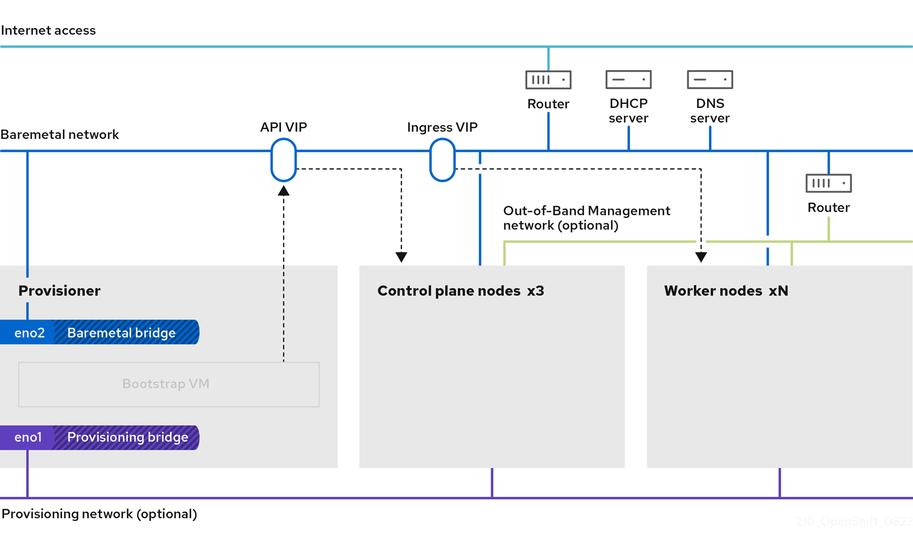

# Prerequisites { #ipi-install-prerequisites }

You must meet several prerequisites before installing a cluster on bare metal by using installer-provisioned infrastructure.

Installer-provisioned installation of OpenShift Container Platform requires:

1. One provisioner node with Red Hat Enterprise Linux (RHEL) 9.x installed. The provisioner can be removed after installation.

2. Three control plane nodes

3. Baseboard management controller (BMC) access to each node

4. At least one network:

    1. One required routable network
    2. One optional provisioning network
    3. One optional management network

Before starting an installer-provisioned installation of OpenShift Container Platform, ensure the hardware environment meets the following requirements.

## Node requirements { #node-requirements_ipi-install-prerequisites }

Before starting an installer-provisioned installation of OpenShift Container Platform, ensure the hardware environment is set up correctly.

Installer-provisioned installation involves several hardware node requirements:

- **CPU architecture:** All nodes must use `x86_64` or `aarch64` CPU architecture.

- **Similar nodes:** Red Hat recommends nodes have an identical configuration per role. That is, Red Hat recommends nodes be the same brand and model with the same CPU, memory, and storage configuration.

- **Baseboard Management Controller:** The `provisioner` node must be able to access the baseboard management controller (BMC) of each OpenShift Container Platform cluster node. You may use IPMI, Redfish, or a proprietary protocol.

- **Latest generation:** Nodes must be of the most recent generation. Installer-provisioned installation relies on BMC protocols, which must be compatible across nodes. Additionally, RHEL 9.x ships with the most recent drivers for RAID controllers. Ensure that the nodes are recent enough to support RHEL 9.x for the `provisioner` node and RHCOS 9.x for the control plane and worker nodes.

- **Registry node:** (Optional) If setting up a disconnected mirrored registry, it is recommended the registry reside in its own node.

- **Provisioner node:** Installer-provisioned installation requires one `provisioner` node.

- **Control plane:** Installer-provisioned installation requires three control plane nodes for high availability. You can deploy an OpenShift Container Platform cluster with only three control plane nodes, making the control plane nodes schedulable as worker nodes. Smaller clusters are more resource efficient for administrators and developers during development, production, and testing.

- **Worker nodes:** While not required, a typical production cluster has two or more worker nodes.

    !!! warning

        Do not deploy a cluster with only one worker node, because the cluster will deploy with routers and ingress traffic in a degraded state.

- **Network interfaces:** Each node must have at least one network interface for the routable `baremetal` network. Each node must have one network interface for a `provisioning` network when using the `provisioning` network for deployment. Using the `provisioning` network is the default configuration.

    !!! note

        Only one network card (NIC) on the same subnet can route traffic through the gateway. By default, Address Resolution Protocol (ARP) uses the lowest numbered NIC. Use a single NIC for each node in the same subnet to ensure that network load balancing works as expected. When using multiple NICs for a node in the same subnet, use a single bond or team interface. Then add the other IP addresses to that interface in the form of an alias IP address. If you require fault tolerance or load balancing at the network interface level, use an alias IP address on the bond or team interface. Alternatively, you can disable a secondary NIC on the same subnet or ensure that it has no IP address.

- **Unified Extensible Firmware Interface (UEFI):** Installer-provisioned installation requires UEFI boot on all OpenShift Container Platform nodes when using IPv6 addressing on the `provisioning` network. In addition, UEFI Device PXE Settings must be set to use the IPv6 protocol on the `provisioning` network NIC, but omitting the `provisioning` network removes this requirement.

    !!! warning

        When starting the installation from virtual media such as an ISO image, delete all old UEFI boot table entries. If the boot table includes entries that are not generic entries provided by the firmware, the installation might fail.

- **Secure Boot:** Many production scenarios require nodes with Secure Boot enabled to verify the node only boots with trusted software, such as UEFI firmware drivers, EFI applications, and the operating system. You may deploy with Secure Boot manually or managed.

    1. **Manually:** To deploy an OpenShift Container Platform cluster with Secure Boot manually, you must enable UEFI boot mode and Secure Boot on each control plane node and each worker node. Red Hat supports Secure Boot with manually enabled UEFI and Secure Boot only when installer-provisioned installations use Redfish virtual media. See "Configuring nodes for Secure Boot manually" in the "Configuring nodes" section for additional details.

    2. **Managed:** To deploy an OpenShift Container Platform cluster with managed Secure Boot, you must set the `bootMode` value to `UEFISecureBoot` in the `install-config.yaml` file. Red Hat only supports installer-provisioned installation with managed Secure Boot on 10th generation HPE hardware and 13th generation Dell hardware running firmware version `2.75.75.75` or greater. Deploying with managed Secure Boot does not require Redfish virtual media. See "Configuring managed Secure Boot" in the "Setting up the environment for an OpenShift installation" section for details.

        !!! note

            Red Hat does not support managing self-generated keys, or other keys, for Secure Boot.

## Minimum resource requirements for cluster installation { #installation-minimum-resource-requirements_ipi-install-prerequisites }

To ensure that your OpenShift Container Platform cluster runs as expected, each cluster machine must meet minimum CPU, memory, and storage requirements.

**Minimum resource requirements**

<table>
<thead>
<tr>
  <th>Machine</th>
  <th>Operating system</th>
  <th>CPU</th>
  <th>RAM</th>
  <th>Storage</th>
  <th>Input/Output Per Second (IOPS)</th>
</tr>
</thead>
<tbody>
<tr>
  <td>Bootstrap</td>
  <td>RHEL</td>
  <td>4</td>
  <td>16 GB</td>
  <td>100 GB</td>
  <td>300</td>
</tr>
<tr>
  <td>Control plane</td>
  <td>RHCOS</td>
  <td>4</td>
  <td>16 GB</td>
  <td>100 GB</td>
  <td>300</td>
</tr>
<tr>
  <td>Compute</td>
  <td>RHCOS</td>
  <td>2</td>
  <td>8 GB</td>
  <td>100 GB</td>
  <td>300</td>
</tr>
</tbody>
</table>


- One CPU is equal to one physical core when simultaneous multithreading (SMT), or Hyper-Threading, is not enabled. When enabled, use the following formula to calculate the corresponding ratio: (threads per core × cores) × sockets = CPUs.
- OpenShift Container Platform and Kubernetes are sensitive to disk performance, and Red Hat recommends faster storage, particularly for etcd on the control plane nodes. On many cloud platforms, storage size and IOPS scale together, so you might need to provision more storage to get enough performance.

!!! note

    In OpenShift Container Platform version 4.22, RHCOS uses RHEL version 9.8, which updates the micro-architecture requirements. Each architecture requires the following minimum instruction set architectures (ISA):

    - x86-64 architecture requires x86-64-v2 ISA
    - ARM64 architecture requires ARMv8.0-A ISA
    - ppc64le architecture requires IBM(R) Power9 ISA
    - s390x architecture requires IBM(R) z14 ISA

    For more information, see [Architectures](https://access.redhat.com/documentation/en-us/red_hat_enterprise_linux/9/html-single/9.8_release_notes/index#architectures) in the RHEL documentation.

If an instance type for your platform meets the minimum requirements for cluster machines, it is supported to use in OpenShift Container Platform.

## Bare-metal cluster installation requirements for OpenShift Virtualization { #virt-planning-bare-metal-cluster-for-ocp-virt_ipi-install-prerequisites }

Configure your bare-metal cluster correctly during installation to support OpenShift Virtualization, as certain required settings cannot be changed after installation.

### High availability requirements for OpenShift Virtualization { #virt-planning-bare-metal-cluster-for-ocp-virt-HA_ipi-install-prerequisites }

When discussing high availability (HA) features in the context of OpenShift Virtualization, this refers only to the replication model of the core cluster components, determined by the `controlPlaneTopology` and `infrastructureTopology` fields in the `Infrastructure` custom resource (CR). Setting these fields to `HighlyAvailable` offers component redundancy, which is distinct from general cluster-wide application HA. Setting these fields to `SingleReplica` disables component redundancy, and therefore disables OpenShift Virtualization HA features.

If you plan to use OpenShift Virtualization HA features, you must have three control plane nodes at the time of cluster installation. The `controlPlaneTopology` status in the `Infrastructure` CR for the cluster must be `HighlyAvailable`.

!!! note

    You can install OpenShift Virtualization on a single-node cluster, but single-node OpenShift does not support HA features.

### Live migration requirements for OpenShift Virtualization { #virt-planning-bare-metal-cluster-for-ocp-virt-LM_ipi-install-prerequisites }

- If you plan to use live migration, you must have multiple worker nodes. The `infrastructureTopology` status in the `Infrastructure` CR for the cluster must be `HighlyAvailable`. A minimum of three worker nodes is recommended.

    !!! note

        You can install OpenShift Virtualization on a single-node cluster, but single-node OpenShift does not support live migration.

- Live migration requires shared storage. Storage for OpenShift Virtualization must support and use the ReadWriteMany (RWX) access mode.

### SR-IOV requirements for OpenShift Virtualization { #virt-planning-bare-metal-cluster-for-ocp-virt-SR-IOV_ipi-install-prerequisites }

If you plan to use Single Root I/O Virtualization (SR-IOV), ensure that your network interface controllers (NICs) are supported by OpenShift Container Platform.

**Additional resources**

- [Preparing your cluster for OpenShift Virtualization](../../../virt/install/preparing-cluster-for-virt.md#preparing-cluster-for-virt)
- [About Single Root I/O Virtualization (SR-IOV) hardware networks](../../../networking/hardware_networks/about-sriov.md#about-sriov)
- [Connecting a virtual machine to an SR-IOV network](../../../virt/vm_networking/virt-connecting-vm-to-sriov.md#virt-connecting-vm-to-sriov)

## Firmware requirements for installing with virtual media { #ipi-install-firmware-requirements-for-installing-with-virtual-media_ipi-install-prerequisites }

The installation program for installer-provisioned OpenShift Container Platform clusters depends on the hardware and firmware compatibility with Redfish virtual media. The installation may not succeed if the node firmware is not compatible.

The following tables list the firmware versions tested and verified to work for installer-provisioned OpenShift Container Platform clusters deployed by using Redfish virtual media.

!!! note

    Red Hat does not test every combination of firmware, hardware, or other third-party components. For further information about third-party support, see "Red Hat third-party support policy". For information about updating the firmware, see the hardware documentation for the nodes or contact the hardware vendor.

**Firmware compatibility for HP hardware with Redfish virtual media**

| Model           | Management | Firmware versions |
| --------------- | ---------- | ----------------- |
| 11th Generation | iLO6       | 1.57 or later     |
| 10th Generation | iLO5       | 2.63 or later     |

**Firmware compatibility for Dell hardware with Redfish virtual media**

| Model           | Management | Firmware versions                         |
| --------------- | ---------- | ----------------------------------------- |
| 17th Generation | iDRAC 10   | v1.20.25.00, v1.20.60.50, and v1.20.70.50 |
| 16th Generation | iDRAC 9    | v7.10.70.00                               |
| 15th Generation | iDRAC 9    | v6.10.30.00, v7.10.50.00, and v7.10.70.00 |
| 14th Generation | iDRAC 9    | v6.10.30.00                               |

**Firmware compatibility for Cisco UCS hardware with Redfish virtual media**

| Model                            | Management              | Firmware versions |
| -------------------------------- | ----------------------- | ----------------- |
| UCS X-Series servers             | Intersight Managed Mode | 5.2(2) or later   |
| FI-Attached UCS C-Series servers | Intersight Managed Mode | 4.3 or later      |
| Standalone UCS C-Series servers  | Standalone / Intersight | 4.3 or later      |

!!! note

    Always confirm that your server supports Red Hat Enterprise Linux CoreOS (RHCOS) on UCS Hardware and Software Compatibility. For more information, see "UCSHCL".

**Additional resources**

- [Red Hat third-party support policy](https://access.redhat.com/third-party-software-support)
- [UCSHCL](https://ucshcltool.cloudapps.cisco.com/public/)
- [Unable to discover new bare-metal hosts by using the BMC](ipi-install-troubleshooting.md#unable-to-discover-new-bare-metal-hosts-using-the-bmc_ipi-install-troubleshooting)

## NC-SI hardware requirements for bare metal { #ncsi-hardware-requirements-for-bare-metal_ipi-install-prerequisites }

To deploy OpenShift Container Platform 4.19 and later with a Network Controller Sideband Interface (NC-SI) on bare metal, you must use hardware with baseboard management controllers (BMCs) and network interface cards (NICs) that support NC-SI. 

NC-SI enables the BMC to share a system NIC with the host, requiring the `DisablePowerOff` feature to prevent loss of BMC connectivity during power-offs.

**Server compatibility for NC-SI**

| Vendor     | Models         | Generation                | Management                                             |
| ---------- | -------------- | ------------------------- | ------------------------------------------------------ |
| Dell       | PowerEdge      | 14th generation and later | iDRAC 9 and later (Redfish, IPMI, racadm, WS-MAN)      |
| HPE        | ProLiant       | 10th generation and later | iLO 5 and later (Redfish, IPMI, iLO RESTful API)       |
| Lenovo     | ThinkSystem SR | 1st generation and later  | XClarity Controller (Redfish, IPMI, proprietary APIs)  |
| Supermicro | SuperServer    | X11 series and later      | Supermicro BMC (Redfish, IPMI, proprietary web/CLI)    |
| Intel      | Server Systems | S2600BP and later         | Intel BMC (Redfish, IPMI, proprietary APIs)            |
| Fujitsu    | PRIMERGY       | M4 series and later       | iRMC S5 and later (Redfish, IPMI, proprietary web/CLI) |
| Cisco      | UCS C-Series   | M5 series and later       | Cisco IMC (Redfish, IPMI, proprietary XML API)         |

**Compatible Network Interface Cards (NICs) for NC-SI**

| Vendor            | Models                                | Specifications                                                                            |
| ----------------- | ------------------------------------- | ----------------------------------------------------------------------------------------- |
| Broadcom          | NetXtreme BCM5720, BCM57416, BCM57504 | Gigabit and 10/25/100GbE, RMII sideband, supports Redfish, IPMI, and vendor protocols.    |
| Intel             | I210, X710, XXV710, E810              | Gigabit to 100GbE, RMII and SMBus sideband, supports Redfish, IPMI, and vendor protocols. |
| NVIDIA            | ConnectX-5, ConnectX-6, ConnectX-7    | 25/50/100/200/400GbE, RMII sideband, supports Redfish, IPMI, and NVIDIA BMC APIs.         |
| NVIDIA            | BlueField-2 and later                 | 200/400GbE, supports Redfish, IPMI, and NVIDIA BMC APIs.                                  |
| Marvell/Cavium    | ThunderX CN88xx, FastLinQ QL41000     | 10/25/50GbE, RMII sideband, supports Redfish, IPMI, and vendor protocols.                 |
| Mellanox (NVIDIA) | MCX4121A-ACAT, MCX512A-ACAT           | 10/25/50GbE, RMII sideband, supports Redfish, IPMI, and Mellanox APIs.                    |

!!! note

    Verify NC-SI support with vendor documentation, because compatibility depends on BMC, NIC, and firmware configurations. NC-SI NICs require a compatible BMC to enable shared NIC functionality.

**Additional resources**

- [Ironic NC-SI Specification](https://specs.openstack.org/openstack/ironic-specs/specs/approved/nc-si.html)
- [DMTF: Network Controller Sideband Interface (NC-SI) Specification](https://www.dmtf.org/sites/default/files/standards/documents/DSP0222_1.1.1.pdf)

## Network requirements { #network-requirements_ipi-install-prerequisites }

Installer-provisioned installation of OpenShift Container Platform involves multiple network requirements. First, installer-provisioned installation involves an optional non-routable `provisioning` network for provisioning the operating system on each bare-metal node. Second, installer-provisioned installation involves a routable `baremetal` network.

**Figure 1. Installer-provisioned networking**



!!! warning

    Red Hat supports any valid host network configuration that meets the documented requirements, regardless of how that configuration is applied. However, Red Hat only supports the configuration application process when approved tools are used. The following list details examples of these tools:

    - A documented tool, such as NMState or Kubernetes-NMState.
    - Other tools might be supported to perform a specific task. Red Hat does not support these other tools for general network configurations.

### One IP address for each subnet { #network-requirements-one-ip-per-subnet_ipi-install-prerequisites }

For the primary interface, assign one IP address for each subnet. This configuration ensures the node IP address selection handles traffic without experiencing traffic handling issues.

You can assign multiple IP addresses from the same subnet to a single interface, in a process known as *IP aliasing*. However, the node IP address selection process cannot consistently determine which address to use, causing routing conflicts and unpredictable IP selection.

### Ensuring required ports are open { #network-requirements-ensuring-required-ports-are-open_ipi-install-prerequisites }

Certain ports must be open between cluster nodes for installer-provisioned installations to complete successfully. In certain situations, such as using separate subnets for far edge worker nodes, you must ensure that the nodes in these subnets can communicate with nodes in the other subnets on the following required ports.

**Required ports**

| Port      | Description                                                                                                                                                                                                                                                                                                                                                       |
| --------- | ----------------------------------------------------------------------------------------------------------------------------------------------------------------------------------------------------------------------------------------------------------------------------------------------------------------------------------------------------------------- |
| `67`,`68` | When using a provisioning network, cluster nodes access the `dnsmasq` DHCP server over their provisioning network interfaces using ports `67` and `68`.                                                                                                                                                                                                           |
| `69`      | When using a provisioning network, cluster nodes communicate with the TFTP server on port `69` using their provisioning network interfaces. The TFTP server runs on the bootstrap VM. The bootstrap VM runs on the provisioner node.                                                                                                                              |
| `80`      | When not using the image caching option or when using virtual media, the provisioner node must have port `80` open on the `baremetal` machine network interface to stream the Red Hat Enterprise Linux CoreOS (RHCOS) image from the provisioner node to the cluster nodes.                                                                                       |
| `123`     | The cluster nodes must access the NTP server on port `123` using the `baremetal` machine network.                                                                                                                                                                                                                                                                 |
| `5050`    | The Ironic Inspector API runs on the control plane nodes and listens on port `5050`. The Inspector API is responsible for hardware introspection, which collects information about the hardware characteristics of the bare-metal nodes.                                                                                                                          |
| `5051`    | Port `5050` uses port `5051` as a proxy.                                                                                                                                                                                                                                                                                                                          |
| `6180`    | When deploying with virtual media and not using TLS, the provisioner node and the control plane nodes must have port `6180` open on the `baremetal` machine network interface so that the baseboard management controller (BMC) of the worker nodes can access the RHCOS image. Starting with OpenShift Container Platform 4.13, the default HTTP port is `6180`. |
| `6183`    | When deploying with virtual media and using TLS, the provisioner node and the control plane nodes must have port `6183` open on the `baremetal` machine network interface so that the BMC of the worker nodes can access the RHCOS image.                                                                                                                         |
| `6385`    | The Ironic API server runs initially on the bootstrap VM and later on the control plane nodes and listens on port `6385`. The Ironic API allows clients to interact with Ironic for bare-metal node provisioning and management, including operations such as enrolling new nodes, managing their power state, deploying images, and cleaning the hardware.       |
| `6388`    | Port `6385` uses port `6388` as a proxy.                                                                                                                                                                                                                                                                                                                          |
| `8080`    | When using image caching without TLS, port `8080` must be open on the provisioner node and accessible by the BMC interfaces of the cluster nodes.                                                                                                                                                                                                                 |
| `8083`    | When using the image caching option with TLS, port `8083` must be open on the provisioner node and accessible by the BMC interfaces of the cluster nodes.                                                                                                                                                                                                         |
| `9999`    | By default, the Ironic Python Agent (IPA) listens on TCP port `9999` for API calls from the Ironic conductor service. Communication between the bare-metal node where IPA is running and the Ironic conductor service uses this port.                                                                                                                             |

### Increase the network MTU { #network-requirements-increase-mtu_ipi-install-prerequisites }

Before deploying OpenShift Container Platform, increase the network maximum transmission unit (MTU) to 1500 or more. If the MTU is lower than 1500, the Ironic image that is used to boot the node might fail to communicate with the Ironic inspector pod, and inspection will fail. If this occurs, installation stops because the nodes are not available for installation.

### Configuring NICs { #network-requirements-config-nics_ipi-install-prerequisites }

OpenShift Container Platform deploys with two networks:

- `provisioning`: The `provisioning` network is an optional non-routable network used for provisioning the underlying operating system on each node that is a part of the OpenShift Container Platform cluster. The network interface for the `provisioning` network on each cluster node must have the BIOS or UEFI configured to PXE boot.

    The `provisioningNetworkInterface` configuration setting specifies the `provisioning` network NIC name on the control plane nodes, which must be identical on the control plane nodes. The `bootMACAddress` configuration setting provides a means to specify a particular NIC on each node for the `provisioning` network.

    The `provisioning` network is optional, but it is required for PXE booting. If you deploy without a `provisioning` network, you must use a virtual media BMC addressing option such as `redfish-virtualmedia` or `idrac-virtualmedia`.

- `baremetal`: The `baremetal` network is a routable network. You can use any NIC to interface with the `baremetal` network provided the NIC is not configured to use the `provisioning` network.

!!! warning

    When using a VLAN, each NIC must be on a separate VLAN corresponding to the appropriate network.

### DNS requirements { #network-requirements-dns_ipi-install-prerequisites }

Clients access the OpenShift Container Platform cluster nodes over the `baremetal` network. A network administrator must configure a subdomain or subzone where the canonical name extension is the cluster name.

```text
<cluster_name>.<base_domain>
```

For example:

```text
test-cluster.example.com
```

OpenShift Container Platform includes functionality that uses cluster membership information to generate A/AAAA records. This resolves the node names to their IP addresses. After the nodes are registered with the API, the cluster can disperse node information without using CoreDNS-mDNS. This eliminates the network traffic associated with multicast DNS.

CoreDNS requires both TCP and UDP connections to the upstream DNS server to function correctly. Ensure the upstream DNS server can receive both TCP and UDP connections from OpenShift Container Platform cluster nodes.

In OpenShift Container Platform deployments, DNS name resolution is required for the following components:

- The Kubernetes API
- The OpenShift Container Platform application wildcard ingress API

A/AAAA records are used for name resolution and PTR records are used for reverse name resolution. Red Hat Enterprise Linux CoreOS (RHCOS) uses the reverse records or DHCP to set the hostnames for all the nodes.

Installer-provisioned installation includes functionality that uses cluster membership information to generate A/AAAA records. This resolves the node names to their IP addresses. In each record, `<cluster_name>` is the cluster name and `<base_domain>` is the base domain that you specify in the `install-config.yaml` file. A complete DNS record takes the form: `<component>.<cluster_name>.<base_domain>.`.

**Required DNS records**

<table>
<thead>
<tr>
  <th>Component</th>
  <th>Record</th>
  <th>Description</th>
</tr>
</thead>
<tbody>
<tr>
  <td>Kubernetes API</td>
  <td><code>api.&lt;cluster_name&gt;.&lt;base_domain&gt;.</code></td>
  <td>An A/AAAA record and a PTR record identify the API load balancer. These records must be resolvable by both clients external to the cluster and from all the nodes within the cluster.</td>
</tr>
<tr>
  <td>Routes</td>
  <td><code>*.apps.&lt;cluster_name&gt;.&lt;base_domain&gt;.</code></td>
  <td>The wildcard A/AAAA record refers to the application ingress load balancer. The application ingress load balancer targets the nodes that run the Ingress Controller pods. The Ingress Controller pods run on the worker nodes by default. These records must be resolvable by both clients external to the cluster and from all the nodes within the cluster.<br><br>For example, <code>console-openshift-console.apps.&lt;cluster_name&gt;.&lt;base_domain&gt;</code> is used as a wildcard route to the OpenShift Container Platform console.</td>
</tr>
</tbody>
</table>


!!! tip

    You can use the `dig` command to verify DNS resolution.

### Dynamic Host Configuration Protocol (DHCP) requirements { #network-requirements-dhcp-reqs_ipi-install-prerequisites }

By default, installer-provisioned installation deploys `ironic-dnsmasq` with DHCP enabled for the `provisioning` network. No other DHCP servers should be running on the `provisioning` network when the `provisioningNetwork` configuration setting is set to `managed`, which is the default value. If you have a DHCP server running on the `provisioning` network, you must set the `provisioningNetwork` configuration setting to `unmanaged` in the `install-config.yaml` file.

Network administrators must reserve IP addresses for each node in the OpenShift Container Platform cluster for the `baremetal` network on an external DHCP server.

### Reserving IP addresses for nodes with the DHCP server { #network-requirements-reserving-ip-addresses_ipi-install-prerequisites }

For the `baremetal` network, a network administrator must reserve several IP addresses, including:

1. Two unique virtual IP addresses.

    - One virtual IP address for the API endpoint.
    - One virtual IP address for the wildcard ingress endpoint.

2. One IP address for the provisioner node.

3. One IP address for each control plane node.

4. One IP address for each worker node, if applicable.

!!! warning

    Reserving IP addresses so they become static IP addresses example:

    Some administrators prefer to use static IP addresses so that each node’s IP address remains constant in the absence of a DHCP server. To configure static IP addresses with NMState, see "(Optional) Configuring node network interfaces" in the "Setting up the environment for an OpenShift installation" section.

!!! warning

    Networking between external load balancers and control plane nodes example:

    External load balancing services and the control plane nodes must run on the same L2 network, and on the same VLAN when using VLANs to route traffic between the load balancing services and the control plane nodes.

!!! warning

    The storage interface requires a DHCP reservation or a static IP.

The following table provides an exemplary embodiment of fully qualified domain names. The API and name server addresses begin with canonical name extensions. The hostnames of the control plane and worker nodes are exemplary, so you can use any host naming convention you prefer.

| Usage             | Host Name                                                 | IP     |
| ----------------- | --------------------------------------------------------- | ------ |
| API               | `api.<cluster_name>.<base_domain>`                        | `<ip>` |
| Ingress LB (apps) | `*.apps.<cluster_name>.<base_domain>`                     | `<ip>` |
| Provisioner node  | `provisioner.<cluster_name>.<base_domain>`                | `<ip>` |
| Control-plane-0   | `openshift-control-plane-0.<cluster_name>.<base_domain>`  | `<ip>` |
| Control-plane-1   | `openshift-control-plane-1.<cluster_name>-.<base_domain>` | `<ip>` |
| Control-plane-2   | `openshift-control-plane-2.<cluster_name>.<base_domain>`  | `<ip>` |
| Worker-0          | `openshift-worker-0.<cluster_name>.<base_domain>`         | `<ip>` |
| Worker-1          | `openshift-worker-1.<cluster_name>.<base_domain>`         | `<ip>` |
| Worker-n          | `openshift-worker-n.<cluster_name>.<base_domain>`         | `<ip>` |

!!! note

    If you do not create DHCP reservations, the installation program requires reverse DNS resolution to set the hostnames for the Kubernetes API node, the provisioner node, the control plane nodes, and the worker nodes.

### Provisioner node requirements { #network-requirements-provisioner_ipi-install-prerequisites }

You must specify the MAC address for the provisioner node in your installation configuration. The `bootMacAddress` specification is typically associated with PXE network booting. However, the Ironic provisioning service also requires the `bootMacAddress` specification to identify nodes during the inspection of the cluster, or during node redeployment in the cluster.

The provisioner node requires layer 2 connectivity for network booting, DHCP and DNS resolution, and local network communication. The provisioner node requires layer 3 connectivity for virtual media booting.

### Network Time Protocol (NTP) { #network-requirements-ntp_ipi-install-prerequisites }

Each OpenShift Container Platform node in the cluster must have access to an NTP server. OpenShift Container Platform nodes use NTP to synchronize their clocks. For example, cluster nodes use SSL/TLS certificates that require validation, which might fail if the date and time between the nodes are not in sync.

!!! warning

    Define a consistent clock date and time format in each cluster node’s BIOS settings, or installation might fail.

You can reconfigure the control plane nodes to act as NTP servers on disconnected clusters, and reconfigure worker nodes to retrieve time from the control plane nodes.

### Port access for the out-of-band management IP address { #network-requirements-out-of-band_ipi-install-prerequisites }

The out-of-band management IP address is on a separate network from the node. To ensure that the out-of-band management can communicate with the provisioner node during installation, the out-of-band management IP address must be granted access to port `6180` on the provisioner node and on the OpenShift Container Platform control plane nodes. TLS port `6183` is required for virtual media installation, for example, by using Redfish.

**Additional resources**

- [Using DNS forwarding](../../../networking/networking_operators/dns-operator.md#nw-dns-forward_dns-operator)

## Nodes configuration { #configuring-nodes_ipi-install-prerequisites }

You can configure nodes for an installer-provisioned installation of OpenShift Container Platform on bare metal by using either a `provisioning` network, a `baremetal` network, or with manually configured secure boot.

### Node configuration when using the `provisioning` network { #_node_configuration_when_using_the_provisioning_network }

Each node in the cluster requires the following configuration for proper installation.

!!! warning

    A mismatch between nodes will cause an installation failure.

While the cluster nodes can contain more than two NICs, the installation process only focuses on the first two NICs. In the following table, NIC1 is a non-routable network (`provisioning`) that is only used for the installation of the OpenShift Container Platform cluster.

| NIC  | Network        | VLAN                  |
| ---- | -------------- | --------------------- |
| NIC1 | `provisioning` | `<provisioning_vlan>` |
| NIC2 | `baremetal`    | `<baremetal_vlan>`    |

The Red Hat Enterprise Linux (RHEL) 9.x installation process on the provisioner node might vary. To install Red Hat Enterprise Linux (RHEL) 9.x using a local Satellite server or a PXE server, PXE-enable NIC2.

| PXE                                                | Boot order |
| -------------------------------------------------- | ---------- |
| NIC1 PXE-enabled `provisioning` network            | 1          |
| NIC2 `baremetal` network. PXE-enabled is optional. | 2          |

!!! note

    Ensure PXE is disabled on all other NICs.

Configure the control plane and worker nodes as follows:

| PXE                                     | Boot order |
| --------------------------------------- | ---------- |
| NIC1 PXE-enabled (provisioning network) | 1          |

### Node configuration without the `provisioning` network { #_node_configuration_without_the_provisioning_network }

The installation process requires one NIC.

| NIC  | Network     | VLAN               |
| ---- | ----------- | ------------------ |
| NICx | `baremetal` | `<baremetal_vlan>` |

NICx is a routable network (`baremetal`) that is used for the installation of the OpenShift Container Platform cluster, and routable to the internet.

!!! warning

    The `provisioning` network is optional, but it is required for PXE booting. If you deploy without a `provisioning` network, you must use a virtual media BMC addressing option such as `redfish-virtualmedia` or `idrac-virtualmedia`.

### Configuring nodes for Secure Boot manually { #configuring-nodes-for-secure-boot_ipi-install-prerequisites }

Secure Boot prevents a node from booting unless it verifies the node is using only trusted software, such as UEFI firmware drivers, EFI applications, and the operating system.

!!! note

    Red Hat only supports manually configured Secure Boot when deploying with Redfish virtual media.

To enable Secure Boot manually, refer to the hardware guide for the node and execute the following:

**Procedure**

1. Boot the node and enter the BIOS menu.

2. Set the node’s boot mode to `UEFI Enabled`.

3. Enable Secure Boot.

    !!! warning

        Red Hat does not support Secure Boot with self-generated keys.

## Out-of-band management { #out-of-band-management_ipi-install-prerequisites }

Out-of-band management uses baseboard management controllers (BMCs) to provide the provisioner node with access to your cluster nodes. 

Nodes typically have an additional NIC used by the BMCs. These BMCs must be accessible from the provisioner node.

Each node must be accessible via out-of-band management. When using an out-of-band management network, the provisioner node requires access to the out-of-band management network for a successful OpenShift Container Platform installation.

The out-of-band management setup is out of scope for this document. Using a separate management network for out-of-band management can enhance performance and improve security. However, using the provisioning network or the bare metal network are valid options.

!!! note

    The bootstrap VM features a maximum of two network interfaces. If you configure a separate management network for out-of-band management, and you are using a provisioning network, the bootstrap VM requires routing access to the management network through one of the network interfaces. In this scenario, the bootstrap VM can then access three networks:

    - the bare metal network
    - the provisioning network
    - the management network routed through one of the network interfaces

## Required data for installation { #required-data-for-installation_ipi-install-prerequisites }

Before you deploy OpenShift Container Platform, collect the essential information required for your environment. 

Gather the following information from all cluster nodes:

- Out-of-band management IP

    - Examples

        - Dell (iDRAC) IP
        - HP (iLO) IP
        - Fujitsu (iRMC) IP

- When using the `provisioning` network

    - NIC (`provisioning`) MAC address
    - NIC (`baremetal`) MAC address

- When omitting the `provisioning` network

    - NIC (`baremetal`) MAC address

## Validation checklist for nodes { #validation-checklist-for-nodes_ipi-install-prerequisites }

- When using the `provisioning` network

    - \[ \] NIC1 VLAN is configured for the `provisioning` network.
    - \[ \] NIC1 for the `provisioning` network is PXE-enabled on the provisioner, control plane, and worker nodes.
    - \[ \] NIC2 VLAN is configured for the `baremetal` network.
    - \[ \] PXE has been disabled on all other NICs.
    - \[ \] DNS is configured with API and Ingress endpoints.
    - \[ \] Control plane and worker nodes are configured.
    - \[ \] All nodes accessible via out-of-band management.
    - \[ \] (Optional) A separate management network has been created.
    - \[ \] Required data for installation.

- When omitting the `provisioning` network

    - \[ \] NIC1 VLAN is configured for the `baremetal` network.
    - \[ \] DNS is configured with API and Ingress endpoints.
    - \[ \] Control plane and worker nodes are configured.
    - \[ \] All nodes accessible via out-of-band management.
    - \[ \] (Optional) A separate management network has been created.
    - \[ \] Required data for installation.

## Installation overview { #installation-overview_ipi-install-prerequisites }

The installation program supports interactive mode. However, you can prepare an `install-config.yaml` file containing the provisioning details for all of the bare-metal hosts, and the relevant cluster details, in advance.

The installation program loads the `install-config.yaml` file and the administrator generates the manifests and verifies all prerequisites.

The installation program performs the following tasks:

- Enrolls all nodes in the cluster

- Starts the bootstrap virtual machine (VM)

- Starts the metal platform components as `systemd` services, which have the following containers:

    - Ironic-dnsmasq: The DHCP server responsible for handing over the IP addresses to the provisioning interface of various nodes on the provisioning network. Ironic-dnsmasq is only enabled when you deploy an OpenShift Container Platform cluster with a provisioning network.
    - Ironic-httpd: The HTTP server that is used to ship the images to the nodes.
    - Image-customization
    - Ironic
    - Ironic-inspector (available in OpenShift Container Platform 4.16 and earlier)
    - Ironic-ramdisk-logs
    - Extract-machine-os
    - Provisioning-interface
    - Metal3-baremetal-operator

The nodes enter the validation phase, where each node moves to a *manageable* state after Ironic validates the credentials to access the Baseboard Management Controller (BMC).

When the node is in the manageable state, the *inspection* phase starts. The inspection phase ensures that the hardware meets the minimum requirements needed for a successful deployment of OpenShift Container Platform.

The `install-config.yaml` file details the provisioning network. On the bootstrap VM, the installation program uses the Pre-Boot Execution Environment (PXE) to push a live image to every node with the Ironic Python Agent (IPA) loaded. When using virtual media, it connects directly to the BMC of each node to virtually attach the image.

When using PXE boot, all nodes reboot to start the process:

- The `ironic-dnsmasq` service running on the bootstrap VM provides the IP address of the node and the TFTP boot server.
- The first-boot software loads the root file system over HTTP.
- The `ironic` service on the bootstrap VM receives the hardware information from each node.

The nodes enter the cleaning state, where each node must clean all the disks before continuing with the configuration.

After the cleaning state finishes, the nodes enter the available state and the installation program moves the nodes to the deploying state.

IPA runs the `coreos-installer` command to install the Red Hat Enterprise Linux CoreOS (RHCOS) image on the disk defined by the `rootDeviceHints` parameter in the `install-config.yaml` file. The node boots by using RHCOS.

After the installation program configures the control plane nodes, it moves control from the bootstrap VM to the control plane nodes and deletes the bootstrap VM.

The Bare-Metal Operator continues the deployment of the workers, storage, and infra nodes.

After the installation completes, the nodes move to the active state. You can then proceed with postinstallation configuration and other Day 2 tasks.
