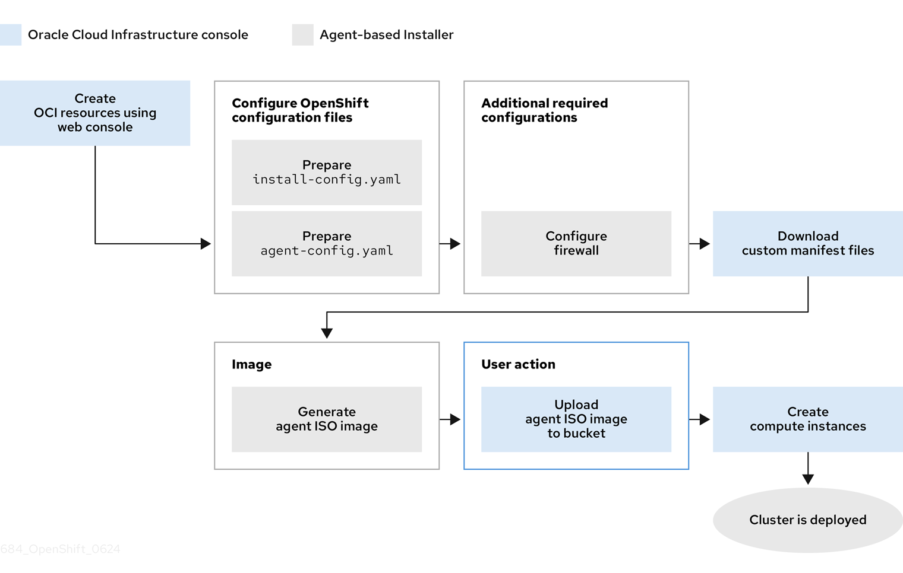
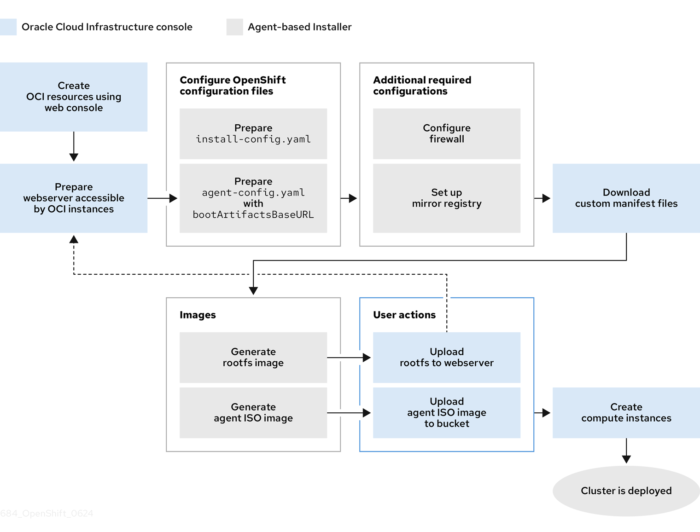

# Installing a cluster on Oracle Distributed Cloud by using the Agent-based Installer { #installing-oci-agent-based-installer }

You can use the Agent-based Installer to install a cluster on Oracle(R) Distributed Cloud, so that you can run cluster workloads on infrastructure that supports dedicated, hybrid, public, and multiple cloud environments.

Installing a cluster on Oracle Distributed Cloud is supported for virtual machines (VMs) and bare-metal machines.

## Supported Oracle Distributed Cloud infrastructures { #installing-oci-distributed-infra-support_installing-oci-agent-based-installer }

There are several different Oracle(R) Distributed Cloud infrastructure offerings you can choose for your installation.

The following table describes the support status of each Oracle(R) Distributed Cloud infrastructure offering:

**Oracle Distributed Cloud infrastructure support statuses**

| Infrastructure type     | Support status       |
| ----------------------- | -------------------- |
| Commercial Public Cloud | General Availability |
| Dedicated Region        | General Availability |
| US Government Cloud     | Technology Preview   |
| UK Government Cloud     | General Availability |
| EU Sovereign Cloud      | Technology Preview   |
| Isolated Region         | Technology Preview   |
| Oracle Alloy            | General Availability |

## The Agent-based Installer and Oracle Distributed Cloud overview { #installing-oci-about-agent-based-installer_installing-oci-agent-based-installer }

You can install an OpenShift Container Platform cluster on Oracle(R) Distributed Cloud by using the Agent-based Installer. Red Hat and Oracle test, validate, and support running Oracle Distributed Cloud workloads in an OpenShift Container Platform cluster.

The Agent-based Installer provides the ease of use of the Assisted Installation service, but with the capability to install a cluster in either a connected or disconnected environment.

The following diagrams show workflows for connected and disconnected environments:

**Figure 1. Workflow for using the Agent-based installer in a connected environment to install a cluster on Oracle Cloud Infrastructure (OCI)**



**Figure 2. Workflow for using the Agent-based installer in a disconnected environment to install a cluster on OCI**



Oracle Distributed Cloud provides services that can meet your regulatory compliance, performance, and cost-effectiveness needs. Oracle Distributed Cloud supports 64-bit `x86` instances and 64-bit `ARM` instances.

!!! note

    Consider selecting a nonvolatile memory express (NVMe) drive or a solid-state drive (SSD) for your boot disk, because these drives offer low latency and high throughput capabilities for your boot disk.

By running your OpenShift Container Platform cluster on Oracle Distributed Cloud, you can access the following capabilities:

- Compute flexible shapes, where you can customize the number of Oracle® CPUs (OCPUs) and memory resources for your VM. With access to this capability, a cluster’s workload can perform operations in a resource-balanced environment. You can find all RHEL-certified OCI shapes by going to the Oracle page on the Red Hat Ecosystem Catalog portal.
- Block Volume storage, where you can configure scaling and auto-tuning settings for your storage volume, so that the Block Volume service automatically adjusts the performance level to optimize performance.

!!! warning

    To ensure the best performance conditions for your cluster workloads that operate on Oracle Distributed Cloud and on the OCVS service, ensure volume performance units (VPUs) for your block volume is sized for your workloads. The following list provides some guidance in selecting the VPUs needed for specific performance needs:

    - Test or proof of concept environment: 100 GB, and 20 to 30 VPUs.
    - Basic environment: 500 GB, and 60 VPUs.
    - Heavy production environment: More than 500 GB, and 100 or more VPUs.

    Consider reserving additional VPUs to provide sufficient capacity for updates and scaling activities. For more information about VPUs, see Volume Performance Units (Oracle documentation).

**Additional resources**

- [Installation process](../../architecture/architecture-installation.md#installation-process_architecture-installation)
- [Internet access for OpenShift Container Platform](../installing_platform_agnostic/installing-platform-agnostic.md#cluster-entitlements_installing-platform-agnostic)
- [Understanding the Agent-based Installer](../installing_with_agent_based_installer/preparing-to-install-with-agent-based-installer.md#understanding-agent-install_preparing-to-install-with-agent-based-installer)
- [Overview of the Compute Service (Oracle documentation)](https://docs.oracle.com/en-us/iaas/Content/Compute/Concepts/computeoverview.htm)
- [Volume Performance Units (Oracle documentation)](https://docs.oracle.com/en-us/iaas/Content/Block/Concepts/blockvolumeperformance.htm#vpus)
- [Instance Sizing Recommendations for OpenShift Container Platform Nodes (Oracle documentation)](https://docs.oracle.com/iaas/Content/openshift-on-oci/installing-agent-about-instance-configurations.htm)

## Installation process workflow { #abi-oci-process-checklist_installing-oci-agent-based-installer }

To better understand the process, see a high-level outline of installing an OpenShift Container Platform cluster on Oracle Distributed Cloud using the Agent-based Installer.

The following workflow describes the general installation process:

1. Create Oracle Cloud Infrastructure (OCI) resources and services (Oracle).
2. Disconnected environments: Prepare a web server that is accessible by OCI instances (Red Hat).
3. Prepare configuration files for the Agent-based Installer (Red Hat).
4. Generate the agent ISO image (Red Hat).
5. Disconnected environments: Upload the rootfs image to the web server (Red Hat).
6. Configure your firewall for OpenShift Container Platform (Red Hat).
7. Upload the agent ISO image to a storage bucket (Oracle).
8. Create a custom image from the uploaded agent ISO image (Oracle).
9. Create compute instances on Oracle Distributed Cloud (Oracle).
10. Verify that your cluster runs on Oracle Distributed Cloud (Oracle).

## Creating OCI infrastructure resources and services { #abi-oci-resources-services_installing-oci-agent-based-installer }

You must create an Oracle Distributed Cloud environment on your virtual machine (VM) or bare-metal shape. By creating this environment, you can install OpenShift Container Platform and deploy a cluster on an infrastructure that supports a wide range of cloud options and strong security policies.

Having prior knowledge of Oracle Cloud Infrastructure (OCI) components can help you with understanding the concept of OCI resources and how you can configure them to meet your organizational needs.

The Agent-based Installer method for installing an OpenShift Container Platform cluster on Oracle Distributed Cloud requires that you manually create OCI resources and services.

!!! warning

    To ensure compatibility with OpenShift Container Platform, you must set `A` as the record type for each DNS record and name records as follows:

    - `api.<cluster_name>.<base_domain>`, which targets the `apiVIP` parameter of the API load balancer
    - `api-int.<cluster_name>.<base_domain>`, which targets the `apiVIP` parameter of the API load balancer
    - `*.apps.<cluster_name>.<base_domain>`, which targets the `ingressVIP` parameter of the Ingress load balancer

    The `api.&#42;` and `api-int.&#42;` DNS records relate to control plane machines, so you must ensure that all nodes in your installed OpenShift Container Platform cluster can access these DNS records.

**Prerequisites**

- You configured an OCI account to host the OpenShift Container Platform cluster. See [Prerequisites (Oracle documentation)](https://docs.oracle.com/iaas/Content/openshift-on-oci/install-prereq.htm).

**Procedure**

- Create the required OCI resources and services.

    For installations in a connected environment, see [Provisioning Cluster Infrastructure Using Terraform (Oracle documentation)](https://docs.oracle.com/en-us/iaas/Content/openshift-on-oci/agent-installer-using-stack.htm).

    For installations in a disconnected environment, see [Provisioning OCI Resources for the Agent-based Installer in Disconnected Environments (Oracle documentation)](https://docs.oracle.com/iaas/Content/openshift-on-oci/agent-prereq.htm).

**Additional resources**

- [Learn About Oracle Cloud Basics (Oracle documentation)](https://docs.oracle.com/en-us/iaas/Content/GSG/Concepts/concepts.htm)

## Creating configuration files for installing a cluster on Oracle Distributed Cloud { #creating-config-files-cluster-install-oci_installing-oci-agent-based-installer }

You must create the `install-config.yaml` and the `agent-config.yaml` configuration files so that you can use the Agent-based Installer to generate a bootable ISO image. The Agent-based installation comprises a bootable ISO that has the Assisted discovery agent and the Assisted Service.

Both of these components are required to perform the cluster installation, but the latter component runs on only one of the hosts.

!!! note

    You can also use the Agent-based Installer to generate or accept Zero Touch Provisioning (ZTP) custom resources.

**Prerequisites**

- You reviewed details about the OpenShift Container Platform installation and update processes.

- You read the documentation on selecting a cluster installation method and preparing the method for users.

- You have read the "Preparing to install with the Agent-based Installer" documentation.

- You downloaded the Agent-Based Installer and the command-line interface (CLI) from the [Red Hat Hybrid Cloud Console](https://console.redhat.com/openshift/install/metal/agent-based).

- If you are installing in a disconnected environment, you have prepared a mirror registry in your environment and mirrored release images to the registry.

    !!! warning

        Check that your `openshift-install` binary version relates to your local image container registry and not a shared registry, such as Red Hat Quay, by running the following command:

        ```terminal
        $ ./openshift-install version
        ```

        ```terminal title="Example output for a shared registry binary"
        ./openshift-install 4.22.0
        built from commit ae7977b7d1ca908674a0d45c5c243c766fa4b2ca
        release image registry.ci.openshift.org/origin/release:4.22ocp-release@sha256:0da6316466d60a3a4535d5fed3589feb0391989982fba59d47d4c729912d6363
        release architecture amd64
        ```

- You have logged in to the OpenShift Container Platform with administrator privileges.

**Procedure**

1. Create an installation directory to store configuration files in by running the following command:

    ```terminal
    $ mkdir ~/<directory_name>
    ```

2. Configure the `install-config.yaml` configuration file to meet the needs of your organization and save the file in the directory you created.

    ```yaml title="install-config.yaml file that sets an external platform"
    # install-config.yaml
    apiVersion: v1
    baseDomain: <base_domain>
    networking:
      clusterNetwork:
      - cidr: 10.128.0.0/14
        hostPrefix: 23
      network type: OVNKubernetes
      machineNetwork:
      - cidr: <ip_address_from_cidr>
      serviceNetwork:
      - 172.30.0.0/16
    compute:
      - architecture: amd64
      hyperthreading: Enabled
      name: worker
      replicas: 0
    controlPlane:
      architecture: amd64
      hyperthreading: Enabled
      name: master
      replicas: 3
    platform:
       external:
        platformName: oci
        cloudControllerManager: External
    sshKey: <public_ssh_key>
    pullSecret: '<pull_secret>'
    # ...
    ```

    where:

    `baseDomain`
    :   Specifies the base domain of your cloud provider.

    `machineNetwork.cidr`
    :   Specifies the IP address from the virtual cloud network (VCN) that the CIDR allocates to resources and components that operate on your network.

    `compute.architecture`
    :   Specifies the `compute.architecture` parameter. Depending on your infrastructure, you can select either `arm64` or `amd64`.

    `controlPlane.architecture`
    :   Specifies the `controlPlane.architecture` parameter. Depending on your infrastructure, you can select either `arm64` or `amd64`.

    `platformName`
    :   Specifies `OCI` as the external platform, so that OpenShift Container Platform can integrate with OCI.

    `sshKey`
    :   Specifies you SSH public key.

    `pullSecret`
    :   Specifies the pull secret that you need for authenticate purposes when downloading container images for OpenShift Container Platform components and services, such as Quay.io. See [Install OpenShift Container Platform 4](https://console.redhat.com/openshift/install/pull-secret) from the Red Hat Hybrid Cloud Console.

3. Create a directory on your local system named `openshift`. This must be a subdirectory of the installation directory.

    !!! warning

        Do not move the `install-config.yaml` or `agent-config.yaml` configuration files to the `openshift` directory.

4. If you used a stack to provision OCI infrastructure resources: Copy and paste the `dynamic_custom_manifest` output of the OCI stack into a file titled `manifest.yaml` and save the file in the `openshift` directory.

5. If you did not use a stack to provision OCI infrastructure resources: Download and prepare custom manifests to create an Agent ISO image:

    1. Go to [Configuration Files](https://docs.oracle.com/iaas/Content/openshift-on-oci/install-prereq.htm#install-configuration-files) (Oracle documentation) and follow the link to the custom manifests directory on GitHub.
    2. Copy the contents of the `condensed-manifest.yml` file and save it locally to a file in the `openshift` directory.
    3. In the `condensed-manifest.yml` file, update the sections marked with `TODO` to specify the compartment Oracle(R) Cloud Identifier (OCID), VCN OCID, subnet OCID from the load balancer, and the security lists OCID.

6. Configure the `agent-config.yaml` configuration file to meet your organization’s requirements.

    ```yaml title="Sample agent-config.yaml file for an IPv4 network."
    apiVersion: v1beta1
    metadata:
      name: <cluster_name>
      namespace: <cluster_namespace>
    rendezvousIP: <ip_address_from_CIDR>
    bootArtifactsBaseURL: <server_URL>
    # ...
    ```

    where:

    `name`
    :   Specifies the cluster name that you specified in your DNS record.

    `namespace`
    :   Specifies the namespace of your cluster on OpenShift Container Platform.

    `rendezvousIP`
    :   Specifies the `rendezvousIP` parameter. If you use IPv4 as the network IP address format, ensure that you set the `rendezvousIP` parameter to an IPv4 address that the VCN’s Classless Inter-Domain Routing (CIDR) method allocates on your network. Also ensure that at least one instance from the pool of instances that you booted with the ISO matches the IP address value you set for the `rendezvousIP` parameter.

    `bootArtifactsBaseURL`
    :   Specifies the URL of the server where you want to upload the rootfs image. This parameter is required only for disconnected environments.

7. Generate a minimal ISO image, which excludes the rootfs image, by entering the following command in your installation directory:

    ```terminal
    $ ./openshift-install agent create image --log-level debug
    ```

    The command also completes the following actions:

    - Creates a subdirectory, `./<installation_directory>/auth directory:`, and places `kubeadmin-password` and `kubeconfig` files in the subdirectory.

    - Creates a `rendezvousIP` file based on the IP address that you specified in the `agent-config.yaml` configuration file.

    - Optional: Any modifications you made to `agent-config.yaml` and `install-config.yaml` configuration files get imported to the Zero Touch Provisioning (ZTP) custom resources.

        !!! warning

            The Agent-based Installer uses Red Hat Enterprise Linux CoreOS (RHCOS). The rootfs image, which is mentioned in a later step, is required for booting, recovering, and repairing your operating system.

8. Disconnected environments only: Upload the rootfs image to a web server.

    1. Go to the `./<installation_directory>/boot-artifacts` directory that was generated when you created the minimal ISO image.

    2. Use your preferred web server, such as any Hypertext Transfer Protocol daemon (`httpd`), to upload the rootfs image to the location specified in the `bootArtifactsBaseURL` parameter of the `agent-config.yaml` file.

        For example, if the `bootArtifactsBaseURL` parameter states `http://192.168.122.20`, you would upload the generated rootfs image to this location so that the Agent-based installer can access the image from `http://192.168.122.20/agent.x86_64-rootfs.img`. After the Agent-based installer boots the minimal ISO for the external platform, the Agent-based Installer downloads the rootfs image from the `http://192.168.122.20/agent.x86_64-rootfs.img` location into the system memory.

        !!! note

            The Agent-based Installer also adds the value of the `bootArtifactsBaseURL` to the minimal ISO Image’s configuration, so that when the Operator boots a cluster’s node, the Agent-based Installer downloads the rootfs image into system memory.

        !!! warning

            Consider that the full ISO image, which is in excess of `1` GB, includes the rootfs image. The image is larger than the minimal ISO Image, which is typically less than `150` MB.

**Additional resources**

- [About OpenShift Container Platform installation](../../architecture/architecture-installation.md#installation-overview_architecture-installation)
- [Selecting a cluster installation type](../overview/installing-preparing.md#installing-preparing-selecting-cluster-type_installing-preparing)
- [Preparing to install with the Agent-based Installer](../installing_with_agent_based_installer/preparing-to-install-with-agent-based-installer.md#preparing-to-install-with-agent-based-installer)
- [Downloading the Agent-based Installer](../installing_with_agent_based_installer/installing-with-agent-based-installer.md#installing-ocp-agent-retrieve_installing-with-agent-based-installer)
- [Creating a mirror registry with mirror registry for Red Hat OpenShift](../../disconnected/installing-mirroring-creating-registry.md#installing-mirroring-creating-registry)
- [Mirroring the OpenShift Container Platform image repository](../../disconnected/installing-mirroring-installation-images.md#installation-mirror-repository_installing-mirroring-installation-images)
- [Optional: Using ZTP manifests](../installing_with_agent_based_installer/installing-with-agent-based-installer.md#installing-ocp-agent-ztp_installing-with-agent-based-installer)

## Configuring your firewall for OpenShift Container Platform { #configuring-firewall-module_installing-oci-agent-based-installer }

Before you install OpenShift Container Platform, you must configure your firewall to grant access to the sites that OpenShift Container Platform requires.

For a disconnected environment, you must mirror content from both Red Hat and Oracle. This environment requires that you create firewall rules to expose your firewall to specific ports and registries.

!!! note

    If your environment has a dedicated load balancer in front of your OpenShift Container Platform cluster, review the allowlists between your firewall and load balancer to prevent unwanted network restrictions to your cluster.

**Procedure**

1. Allowlist the following container registry URLs for cluster installation and upgrades:

    | URL                          | Port | Function                                                                                                                                                                                          |
    | ---------------------------- | ---- | ------------------------------------------------------------------------------------------------------------------------------------------------------------------------------------------------- |
    | `registry.redhat.io`         | 443  | Provides core container images                                                                                                                                                                    |
    | `access.redhat.com`          | 443  | Hosts a signature store that a container client requires for verifying images pulled from `registry.access.redhat.com`. In a firewall environment, ensure that this resource is on the allowlist. |
    | `registry.access.redhat.com` | 443  | Hosts all the container images that are stored on the Red Hat Ecosystem Catalog, including core container images.                                                                                 |
    | `quay.io`                    | 443  | Provides core container images                                                                                                                                                                    |
    | `cdn.quay.io`                | 443  | Provides core container images                                                                                                                                                                    |
    | `cdn01.quay.io`              | 443  | Provides core container images                                                                                                                                                                    |
    | `cdn02.quay.io`              | 443  | Provides core container images                                                                                                                                                                    |
    | `cdn03.quay.io`              | 443  | Provides core container images                                                                                                                                                                    |
    | `cdn04.quay.io`              | 443  | Provides core container images                                                                                                                                                                    |
    | `cdn05.quay.io`              | 443  | Provides core container images                                                                                                                                                                    |
    | `cdn06.quay.io`              | 443  | Provides core container images                                                                                                                                                                    |
    | `icr.io`                     | 443  | Provides IBM Cloud Pak container images. This domain is only required if you use IBM Cloud Paks.                                                                                                  |
    | `cp.icr.io`                  | 443  | Provides IBM Cloud Pak container images. This domain is only required if you use IBM Cloud Paks.                                                                                                  |

    - You can use the wildcard `*.quay.io` instead of `cdn.quay.io` and `cdn0[1-6].quay.io` in your allowlist.
    - You can use the wildcard `*.access.redhat.com` to simplify the configuration and ensure that all subdomains, including `registry.access.redhat.com`, are allowed.
    - When adding a site such as `quay.io` to your allowlist, do not add a wildcard entry such as `*.quay.io` to your denylist. In most cases, image registries use a content delivery network (CDN) to serve images. If a firewall blocks access, image downloads are denied when the initial download request redirects to a hostname such as `cdn01.quay.io`.

2. Allowlist the following URLs to enable cluster access, authentication, and updates:

    | URL                                   | Port | Function                                                                        |
    | ------------------------------------- | ---- | ------------------------------------------------------------------------------- |
    | `*.apps.<cluster_name>.<base_domain>` | 443  | Allowlist these URLs to enable cluster access, authentication, and updates.     |
    | `api.openshift.com`                   | 443  | API endpoint for cluster tokens and update checks.                              |
    | `console.redhat.com`                  | 443  | Authentication service for cluster tokens.                                      |
    | `sso.redhat.com`                      | 443  | The `https://console.redhat.com` site uses authentication from `sso.redhat.com` |

    For egress traffic, Operators require route access to perform health checks to establish a connection for reaching endpoints. The authentication and web console Operators connect to two routes to verify functionality. Cluster administrators who do not want to allow `*.apps.<cluster_name>.<base_domain>`, must allow the following routes:

    - `oauth-openshift.apps.<cluster_name>.<base_domain>`
    - `canary-openshift-ingress-canary.apps.<cluster_name>.<base_domain>`
    - `console-openshift-console.apps.<cluster_name>.<base_domain>`, or the hostname that is specified in the `spec.route.hostname` field of the `consoles.operator/cluster` object if the field is not empty.

3. Allowlist the following registry URLs that host related artifacts for cluster installation and upgrades, such as installation content, release images, and client tools:

    | URL                                        | Port | Function                                                                                                                                                                                           |
    | ------------------------------------------ | ---- | -------------------------------------------------------------------------------------------------------------------------------------------------------------------------------------------------- |
    | `mirror.openshift.com`                     | 443  | Required to access mirrored installation content and images. This site is also a source of release image signatures, although the Cluster Version Operator needs only a single functioning source. |
    | `quayio-production-s3.s3.amazonaws.com`    | 443  | Required to access Quay image content in AWS.                                                                                                                                                      |
    | `rhcos.mirror.openshift.com`               | 443  | Required to download Red Hat Enterprise Linux CoreOS (RHCOS) images.                                                                                                                               |
    | `storage.googleapis.com/openshift-release` | 443  | A source of release image signatures, although the Cluster Version Operator needs only a single functioning source.                                                                                |

4. Set your firewall’s allowlist to include any site that provides resources for a language or framework that your builds require.

5. If you do not disable Telemetry, you must grant access to the following URLs to access Telemetry and Red Hat Lightspeed:

    | URL                          | Port | Function                                           |
    | ---------------------------- | ---- | -------------------------------------------------- |
    | `cert-api.access.redhat.com` | 443  | Required for Telemetry                             |
    | `api.access.redhat.com`      | 443  | Required for Telemetry                             |
    | `infogw.api.openshift.com`   | 443  | Required for Telemetry                             |
    | `console.redhat.com`         | 443  | Required for Telemetry and for `insights-operator` |

6. Set your firewall’s allowlist to include the following registry URLs:

    | URL                          | Port | Function                                                                                    |
    | ---------------------------- | ---- | ------------------------------------------------------------------------------------------- |
    | `api.openshift.com`          | 443  | Required both for your cluster token and to check if updates are available for the cluster. |
    | `rhcos.mirror.openshift.com` | 443  | Required to download Red Hat Enterprise Linux CoreOS (RHCOS) images.                        |

7. Set your firewall’s allowlist to include the following external URLs. Each repository URL hosts OCI containers. Consider mirroring images to as few repositories as possible to reduce any performance issues.

    | URL                      | Port | Function                                                                                                                                                                                  |
    | ------------------------ | ---- | ----------------------------------------------------------------------------------------------------------------------------------------------------------------------------------------- |
    | `k8s.gcr.io`             | port | A Kubernetes registry that hosts container images for a community-based image registry. This image registry is hosted on a custom Google Container Registry (GCR) domain.                 |
    | `ghcr.io`                | port | A GitHub image registry where you can store and manage Open Container Initiative images. Requires an access token to publish, install, and delete private, internal, and public packages. |
    | `storage.googleapis.com` | 443  | A source of release image signatures, although the Cluster Version Operator needs only a single functioning source.                                                                       |
    | `registry.k8s.io`        | port | Replaces the `k8s.gcr.io` image registry because the `k8s.gcr.io` image registry does not support other platforms and vendors.                                                            |

## Running a cluster on Oracle Distributed Cloud { #running-cluster-oci-agent-based_installing-oci-agent-based-installer }

To run a cluster on Oracle(R) Distributed Cloud, you must upload the generated agent ISO image to the default Object Storage bucket on Oracle Distributed Cloud.

Additionally, you must create a compute instance from the supplied base image, so that OpenShift Container Platform and Oracle Distributed Cloud can communicate with each other for the purposes of running the cluster on Oracle Distributed Cloud.

!!! note

    Oracle Distributed Cloud supports the following OpenShift Container Platform cluster topologies:

    - Installing an OpenShift Container Platform cluster on a single node.
    - A highly available cluster that has a minimum of three control plane instances and two compute instances.
    - A compact three-node cluster that has a minimum of three control plane instances.

**Prerequisites**

- You generated an agent ISO image. See the "Creating configuration files for installing a cluster on OCI" section.

**Procedure**

1. Upload the agent ISO image to Oracle’s default Object Storage bucket and import the agent ISO image as a custom image to this bucket. Ensure you that you configure the custom image to boot in Unified Extensible Firmware Interface (UEFI) mode. For more information, see [Creating the OpenShift Container Platform ISO Image (Oracle documentation)](https://docs.oracle.com/iaas/Content/openshift-on-oci/installing-agent-image-creation.htm).

2. Create a compute instance from the supplied base image for your cluster topology. See [Creating the OpenShift Container Platform cluster on OCI (Oracle documentation)](https://docs.oracle.com/iaas/Content/openshift-on-oci/installing-agent-first-node.htm).

    !!! warning

        Before you create the compute instance, check that you have enough memory and disk resources for your cluster. Additionally, ensure that at least one compute instance has the same IP address as the address stated under `rendezvousIP` in the `agent-config.yaml` file.

**Additional resources**

- [Instance Sizing Recommendations for OpenShift Container Platform Nodes (Oracle documentation)](https://docs.oracle.com/iaas/Content/openshift-on-oci/installing-agent-about-instance-configurations.htm)
- [Troubleshooting OpenShift Container Platform on OCI (Oracle documentation)](https://docs.oracle.com/iaas/Content/openshift-on-oci/openshift-troubleshooting.htm)

## Verifying that your Agent-based cluster installation runs on Oracle Distributed Cloud { #verifying-cluster-install-oci-agent-based_installing-oci-agent-based-installer }

Verify that your cluster was installed and is running effectively on Oracle(R) Distributed Cloud.

**Prerequisites**

- You created all the required OCI resources and services. See the "Creating Oracle Distributed Cloud infrastructure resources and services" section.
- You created `install-config.yaml` and `agent-config.yaml` configuration files. See the "Creating configuration files for installing a cluster on Oracle Distributed Cloud" section.
- You uploaded the agent ISO image to a default Oracle Object Storage bucket, and you created a compute instance on Oracle Distributed Cloud. For more information, see "Running a cluster on Oracle Distributed Cloud".

**Procedure**

- After you deploy the compute instance on a self-managed node in your OpenShift Container Platform cluster, monitor the cluster’s status by choosing one of the following options:

    - From the OpenShift Container Platform CLI, enter the following command:

        ```terminal
        $ ./openshift-install agent wait-for install-complete --log-level debug
        ```

        Check the status of the `rendezvous` host node that runs the bootstrap node.  After the host reboots, the host forms part of the cluster.

    - Use the `kubeconfig` API to check the status of various OpenShift Container Platform components. For the  `KUBECONFIG` environment variable, set the relative path of the cluster’s `kubeconfig` configuration file:

        ```terminal
        $  export KUBECONFIG=~/auth/kubeconfig
        ```

        Check the status of each of the cluster’s self-managed nodes. CCM applies a label to each node to designate the node as running in a cluster on OCI.

        ```terminal
        $ oc get nodes -A
        ```

        ```terminal title="Output example"
        NAME                                   STATUS ROLES                 AGE VERSION
        main-0.private.agenttest.oraclevcn.com Ready  control-plane, master 7m  v1.27.4+6eeca63
        main-1.private.agenttest.oraclevcn.com Ready  control-plane, master 15m v1.27.4+d7fa83f
        main-2.private.agenttest.oraclevcn.com Ready  control-plane, master 15m v1.27.4+d7fa83f
        ```

        Check the status of each of the cluster’s Operators, with the CCM Operator status being a good indicator that your cluster is running.

        ```terminal
        $ oc get co
        ```

        ```terminal title="Truncated output example"
        NAME           VERSION     AVAILABLE  PROGRESSING    DEGRADED   SINCE   MESSAGE
        authentication 4.22.0-0    True       False          False      6m18s
        baremetal      4.22.0-0    True       False          False      2m42s
        network        4.22.0-0    True       True           False      5m58s  Progressing: …
            …
        ```

**Additional resources**

- [Gathering log data from a failed Agent-based installation](../installing_with_agent_based_installer/installing-with-agent-based-installer.md#installing-ocp-agent-gather-log_installing-with-agent-based-installer)
- [Adding worker nodes to an on-premise cluster](../../nodes/nodes/nodes-nodes-adding-node-iso.md#adding-node-iso)
