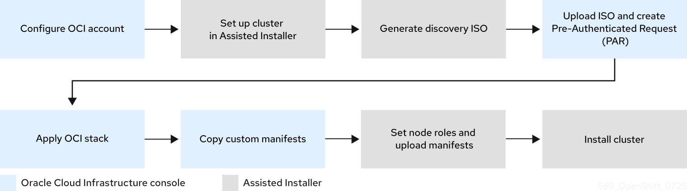
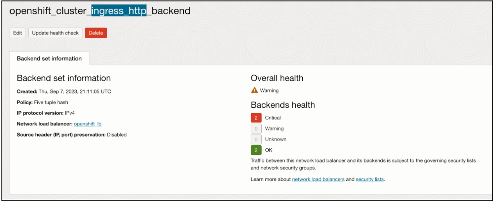

# Installing a cluster on Oracle Distributed Cloud by using the Assisted Installer { #installing-oci-assisted-installer }

You can use the Assisted Installer to install a cluster on Oracle(R) Distributed Cloud. This method is recommended for most users, and requires an internet connection.

If you want to set up the cluster manually or using other automation tools, or if you are working in a disconnected environment, you can use the Red Hat Agent-based Installer for the installation. For details, see "Installing a cluster on Oracle Distributed Cloud by using the Agent-based Installer".

## Supported Oracle Distributed Cloud infrastructures { #installing-oci-distributed-infra-support_installing-oci-assisted-installer }

There are several different Oracle(R) Distributed Cloud infrastructure offerings you can choose for your installation.

The following table describes the support status of each Oracle(R) Distributed Cloud infrastructure offering:

**Oracle Distributed Cloud infrastructure support statuses**

| Infrastructure type     | Support status       |
| ----------------------- | -------------------- |
| Commercial Public Cloud | General Availability |
| Dedicated Region        | General Availability |
| US Government Cloud     | Technology Preview   |
| UK Government Cloud     | General Availability |
| EU Sovereign Cloud      | Technology Preview   |
| Isolated Region         | Technology Preview   |
| Oracle Alloy            | General Availability |

## About the Assisted Installer and Oracle Distributed Cloud integration { #installing-oci-about-assisted-installer_installing-oci-assisted-installer }

You can run cluster workloads on Oracle(R) Distributed Cloud infrastructure that supports dedicated, hybrid, public, and multiple cloud environments. Both Red Hat and Oracle test, validate, and support running an OpenShift Container Platform cluster on Oracle Distributed Cloud.

This section explains how to use the Assisted Installer to install an OpenShift Container Platform cluster on the Oracle Cloud Infrastructure (OCI) platform. The installation deploys cloud-native components such as Oracle Cloud Controller Manager (CCM) and Oracle Container Storage Interface (CSI), and integrates your cluster with OCI API resources such as instance node, load balancer, and storage.

The installation process uses the OpenShift Container Platform discovery ISO image provided by Red Hat, together with the  scripts and manifests provided and maintained by Oracle.

### Preinstallation considerations { #installing-oci-preinstallation-considerations_installing-oci-assisted-installer }

Before installing OpenShift Container Platform on Oracle Distributed Cloud, you must consider the following configuration choices.

Deployment platforms
:   The integration between OpenShift Container Platform and Oracle Distributed Cloud is certified on both virtual machines (VMs) and bare-metal (BM) machines. Bare-metal installations using iSCSI boot drives require a secondary vNIC that is automatically created in the Terraform stack provided by Oracle.

    Before you create a virtual machine (VM) or bare-metal (BM) machine, you must identify the relevant OCI shape. For details, see "Cloud instance types".

VPU sizing recommendations
:   To ensure the best performance conditions for your cluster workloads that operate on Oracle Distributed Cloud, ensure that volume performance units (VPUs) for your block volume are sized for your workloads. The following list provides guidance for selecting the VPUs needed for specific performance needs:

    - Test or proof of concept environment: 100 GB, and 20 to 30 VPUs.
    - Basic environment: 500 GB, and 60 VPUs.
    - Heavy production environment: More than 500 GB, and 100 or more VPUs.

    Consider reserving additional VPUs to provide sufficient capacity for updates and scaling activities. For more information about VPUs, see "Volume Performance Units".

Instance sizing recommendations
:   Find recommended values for compute instance CPU, memory, VPU, and volume size for OpenShift Container Platform nodes. For details, see "Instance Sizing Recommendations for OpenShift Container Platform Nodes".

### Workflow { #installing-oci-workflow_installing-oci-assisted-installer }

**Figure 1. High-level workflow for using the Assisted Installer in a connected environment to install a cluster on Oracle Distributed Cloud**



The procedure for using the Assisted Installer in a connected environment to install a cluster on Oracle Distributed Cloud is outlined below:

1. In the Oracle Cloud Infrastructure (OCI) console, configure an OCI account to host the cluster:

    1. Create a new child compartment under an existing compartment.
    2. Create a new object storage bucket or use one provided by Oracle Distributed Cloud.
    3. Download the stack file template stored locally.

2. In the Assisted Installer console, set up a cluster:

    1. Enter the cluster configurations.
    2. Generate and download the discovery ISO image.

3. In the OCI console, create the infrastructure:

    1. Upload the discovery ISO image to the OCI bucket.
    2. Create a Pre-Authenticated Request (PAR) for the ISO image.
    3. Upload the stack file template, and use it to create and apply the stack.
    4. Copy the custom manifest YAML file from the stack.

4. In the Assisted Installer console, complete the cluster installation:

    1. Set roles for the cluster nodes.
    2. Upload the manifests provided by Oracle.
    3. Install the cluster.

    !!! warning

        The steps for provisioning OCI resources are provided as an example only. You can also choose to create the required resources through other methods; the scripts are just an example. Installing a cluster with infrastructure that you provide requires knowledge of the cloud provider and the installation process on OpenShift Container Platform. You can access OCI configurations to complete these steps, or use the configurations to model your own custom script.

**Additional resources**

- [Cloud instance types (Red Hat Ecosystem Catalog portal)](https://catalog.redhat.com/cloud/detail/216977)
- [Volume Performance Units (Oracle documentation)](https://docs.oracle.com/en-us/iaas/Content/Block/Concepts/blockvolumeperformance.htm#vpus)
- [Instance Sizing Recommendations for OpenShift Container Platform Nodes (Oracle documentation)](https://docs.oracle.com/en-us/iaas/Content/openshift-on-oci/installing-agent-about-instance-configurations.htm)
- [Assisted Installer for OpenShift Container Platform](https://access.redhat.com/documentation/en-us/assisted_installer_for_openshift_container_platform/)
- [Installing a Cluster with Red Hat’s Assisted Installer (Oracle documentation)](https://docs.oracle.com/en-us/iaas/Content/openshift-on-oci/installing-assisted.htm)
- [Internet access for OpenShift Container Platform](../installing_platform_agnostic/installing-platform-agnostic.md#cluster-entitlements_installing-platform-agnostic)

## Preparing the Oracle Distributed Cloud environment { #creating-oci-resources-services_installing-oci-assisted-installer }

Before installing OpenShift Container Platform using Assisted Installer, create the necessary resources and download the configuration file in the Oracle Distributed Cloud environment.

**Prerequisites**

- You have an Oracle Cloud Infrastructure (OCI) account to host the cluster.
- If you use a firewall and you plan to use a Telemetry service, you configured your firewall to allow OpenShift Container Platform to access the sites required.

**Procedure**

1. Log in to your [OCI](https://cloud.oracle.com/a/) account with administrator privileges.

2. Configure the account by defining the [Cloud Accounts and Resources (Oracle documentation)](https://docs.oracle.com/iaas/Content/openshift-on-oci/install-prereq.htm). Ensure that you create the following resources:

    1. Create a child compartment for organizing, restricting access, and setting usage limits to OCI resources. For the full procedure, see [Creating a Compartment (Oracle documentation)](https://docs.oracle.com/en-us/iaas/Content/Identity/compartments/To_create_a_compartment.htm#To).
    2. Create a new object storage bucket into which you will upload the discovery ISO image. For the full procedure, see [Creating an Object Storage Bucket (Oracle documentation)](https://docs.oracle.com/en-us/iaas/Content/Object/Tasks/managingbuckets_topic-To_create_a_bucket.htm#top).

3. Download the latest versions of the following configuration files from the [`oracle-quickstart/oci-openshift`](https://github.com/oracle-quickstart/oci-openshift/releases) releases page:

    - `create-resource-attribution-tags-vX.X.X.zip`: The Terraform stack for creating the required resource attribution tags in your OCI tenancy.

        !!! warning

            Resource attribution tags are mandatory for OpenShift Container Platform on Oracle Distributed Cloud. If you have not previously applied the `create-resource-attribution-tags` stack in your tenancy, you must download and apply it before proceeding. After the tags exist, later cluster deployments can reuse them. For more details, see [OpenShift on OCI (OSO) Prerequisites](https://github.com/oracle-quickstart/oci-openshift?tab=readme-ov-file#prerequisites).

    - `create-cluster-vX.X.X.zip`: The Terraform stack and custom manifests for provisioning OCI resources and installing OpenShift Container Platform clusters on Oracle Distributed Cloud.

        The `create-cluster` configuration file contains the following:

        - **Terraform Stacks**: The Terraform stack code for provisioning OCI resources to create and manage OpenShift Container Platform clusters on Oracle Distributed Cloud.
        - **Custom Manifests**: The manifest files needed for the installation of OpenShift Container Platform clusters on Oracle Distributed Cloud.

        !!! note

            To make any changes to the manifests, you can clone the entire Oracle GitHub repository and access the `custom_manifests` and `terraform-stacks` directories directly. For details, see [Configuration Files (Oracle documentation)](https://docs.oracle.com/iaas/Content/openshift-on-oci/install-prereq.htm#install-configuration-files).

## Using the Assisted Installer to generate a discovery ISO image { #using-assisted-installer-oci-agent-iso_installing-oci-assisted-installer }

Create the cluster configuration and generate the discovery ISO image in the Assisted Installer web console.

### Creating the cluster { #using-assisted-installer-oci-create-cluster_installing-oci-assisted-installer }

To begin creating the cluster, set the cluster details.

**Prerequisites**

- You created a child compartment and an object storage bucket on Oracle Distributed Cloud. For details, see *Preparing the Oracle Distributed Cloud environment*.
- You reviewed details about the OpenShift Container Platform installation and update processes.

**Procedure**

1. Log in to the [Assisted Installer web console](https://console.redhat.com/) with your credentials.

2. In the **Red Hat OpenShift** tile, select **OpenShift**.

3. In the **Red Hat OpenShift Container Platform** tile, select **Create Cluster**.

4. On the **Cluster Type** page, scroll down to the end of the **Cloud** tab, and select **Oracle Cloud Infrastructure (virtual machines)**.

5. On the **Create an OpenShift Cluster** page, select the **Interactive** tile.

6. On the **Cluster Details** page, complete the following fields:

    | Field                                         | Action required                                                                                                                                                                                    |
    | --------------------------------------------- | -------------------------------------------------------------------------------------------------------------------------------------------------------------------------------------------------- |
    | **Cluster name**                              | Specify the name of your cluster, such as `oci`. This is the same value as the cluster name in Oracle Distributed Cloud.                                                                           |
    | **Base domain**                               | Specify the base domain of the cluster, such as `openshift-demo.devcluster.openshift.com`.<br>This must be the same value as the zone DNS server in Oracle Distributed Cloud.                      |
    | **OpenShift version**                         | \* For installations on virtual machines only, specify `OpenShift 4.14` or a later version.<br>\* For installations that include bare metal machines, specify `OpenShift 4.16` or a later version. |
    | **CPU architecture**                          | Specify `x86_64` or `Arm64`.                                                                                                                                                                       |
    | **Integrate with external partner platforms** | Specify `Oracle Cloud Infrastructure`.<br>After you specify this value, the **Include custom manifests** checkbox is selected by default and the **Custom manifests** page is added to the wizard. |

7. Leave the default settings for the remaining fields, and click **Next**.

8. On the **Operators** page, click **Next**.

### Generating the Discovery ISO image { #using-assisted-installer-oci-generating-iso_installing-oci-assisted-installer }

After setting cluster details, generate and download the Discovery ISO image.

**Procedure**

1. On the **Host Discovery** page, click **Add hosts** and complete the following steps:

    1. For the **Provisioning type** field, select **Minimal image file**.

    2. For the **SSH public key** field, add the SSH public key from your local system, by copying the output of the following command:

        ```terminal
        $ cat ~/.ssh/id_rsa.put
        ```

        The SSH public key will be installed on all OpenShift Container Platform control plane and compute nodes.

    3. Click **Generate Discovery ISO** to generate the discovery ISO image file.

    4. Click **Download Discovery ISO** to save the file to your local system.

**Additional resources**

- [Installation and update](../../architecture/architecture-installation.md#architecture-installation)
- [Configuring your firewall](../install_config/configuring-firewall.md#configuring-firewall-module_configuring-firewall)

## Provisioning OCI infrastructure for your cluster { #provision-oci-infrastructure-ocp-cluster_installing-oci-assisted-installer }

When using the Assisted Installer to create details for your OpenShift Container Platform cluster, you specify these details in a Terraform stack.

A stack is an Oracle Cloud Infrastructure (OCI) feature that automates the provisioning of all necessary OCI infrastructure resources that are required for installing an OpenShift Container Platform cluster on Oracle Distributed Cloud.

**Prerequisites**

- You downloaded the discovery ISO image to a local directory. For details, see *Using the Assisted Installer to generate a discovery ISO image*.
- You downloaded the Terraform stack template to a local directory. For details, see "Preparing the Oracle Distributed Cloud environment".

**Procedure**

1. Log in to your [Oracle Distributed Cloud](https://cloud.oracle.com/a/) account.

2. Upload the discovery ISO image from your local drive to the new object storage bucket you created. For the full procedure, see [Uploading an Object Storage Object to a Bucket (Oracle documentation)](https://docs.oracle.com/en-us/iaas/Content/Object/Tasks/managingobjects_topic-To_upload_objects_to_a_bucket.htm).

3. Locate the uploaded discovery ISO, and complete the following steps:

    1. Create a Pre-Authenticated Request (PAR) for the ISO from the adjacent options menu.
    2. Copy the generated URL to use as the OpenShift Image Source URI in the next step.

    For the full procedure, see [Creating a Pre-Authenticated Requests in Object Storage (Oracle documentation)](https://docs.oracle.com/en-us/iaas/Content/Object/Tasks/usingpreauthenticatedrequests_topic-To_create_a_preauthenticated_request_for_all_objects_in_a_bucket.htm).

4. If you have not already done so, apply the `create-resource-attribution-tags` Terraform stack to create the required resource attribution tags:

    !!! warning

        Resource attribution tags are mandatory for OpenShift Container Platform on Oracle Distributed Cloud. If the tags do not already exist in your tenancy, you must apply the `create-resource-attribution-tags` stack before creating the cluster. You typically apply this stack once for the first cluster deployment in a tenancy. After the tags exist, later cluster deployments can reuse them.

    1. In the Oracle Distributed Cloud console, navigate to **Resource Manager** → **Stacks** and click **Create Stack**.
    2. Upload the `create-resource-attribution-tags-vX.X.X.zip` file and click **Next**.
    3. Click **Apply** to create the resource attribution tags.

    For details, see [create-resource-attribution-tags (Oracle GitHub)](https://github.com/oracle-quickstart/oci-openshift/tree/main/terraform-stacks/create-resource-attribution-tags).

5. Create and apply the `create-cluster` Terraform stack:

    !!! warning

        The Terraform stack includes files for creating cluster resources and custom manifests. The stack also includes a script, and when you apply the stack, the script creates OCI resources, such as DNS records, an instance, and other resources. For a list of the resources, see the `terraform-stacks` folder in [OpenShift on OCI (OSO)](https://github.com/oracle-quickstart/oci-openshift/tree/main).

    1. Upload the Terraform stacks template [terraform-stacks](https://github.com/oracle-quickstart/oci-openshift/tree/main/terraform-stacks) to the new object storage bucket.

    2. Complete the stack information and click **Next**.

        !!! warning

            - Make sure that **Cluster Name** matches **Cluster Name** in Assisted Installer, and **Zone DNS** matches **Base Domain** in Assisted Installer.
            - In the **OpenShift Image Source URI** field, paste the Pre-Authenticated Request URL link that you generated in the previous step.
            - Ensure that the correct **Compute Shape** field value is defined, depending on whether you are installing on bare metal or a virtual machine. If not, select a different shape from the list. For details, see [Compute Shapes (Oracle documentation)](docs.oracle.com/en-us/iaas/Content/Compute/References/computeshapes.htm).

    3. Click **Apply** to apply the stack.

    For the full procedure, see [Creating OpenShift Container Platform Infrastructure Using Resource Manager (Oracle documentation)](https://docs.oracle.com/en-us/iaas/Content/openshift-on-oci/installing-assisted.htm#install-cluster-apply-stack).

6. Copy the `dynamic_custom_manifest.yml` file from the **Outputs** page of the Terraform stack.

    !!! note

        The YAML file contains all the required manifests, concatenated and preformatted with the configuration values. For details, see the [Custom Manifests README file](https://github.com/oracle-openshift/oci-openshift/blob/main/custom_manifests/README.md).

    For the full procedure, see [Getting the OpenShift Container Platform Custom Manifests for Installation (Oracle documentation)](https://docs.oracle.com/en-us/iaas/Content/openshift-on-oci/installing-assisted.htm#install-cluster-edit-manifests).

## Completing the remaining Assisted Installer steps { #completing-assisted-installer-oci_installing-oci-assisted-installer }

After you provision Oracle(R) Distributed Cloud resources and upload OpenShift Container Platform custom manifest configuration files to Oracle Distributed Cloud, you must complete the remaining cluster installation steps on the Assisted Installer before you can create an Oracle Distributed Cloud instance. These steps include assigning node roles and adding custom manifests.

### Assigning node roles { #assigning-node-roles-oci_installing-oci-assisted-installer }

Following host discovery, the role of all nodes appears as **Auto-assign** by default. Change each of the node roles to either **Control Plane node** or **Worker**.

**Prerequisites**

- You created and applied the Terraform stack in Oracle Distributed Cloud. For details, see "Provisioning OCI infrastructure for your cluster".

**Procedure**

1. From the Assisted Installer user interface, go to the **Host discovery** page.

2. Under the **Role** column, select either **Control plane node** or **Worker** for each targeted hostname. Then click **Next**.

    !!! note

        1. Before continuing to the next step, wait for each node to reach `Ready` status.
        2. Expand the node to verify that the hardware type is bare metal.

3. Accept the default settings for the **Storage** and **Networking** pages. Then click **Next**.

### Adding custom manifests { #adding-custom-manifests-oci_installing-oci-assisted-installer }

Add the mandatory custom manifests provided by Oracle.

For details, see [Custom Manifests (Oracle documentation).](https://github.com/dfoster-oracle/oci-openshift/blob/v1.0.0-release-preview/custom_manifests/README.md)

**Prerequisites**

- You copied the `dynamic_custom_manifest.yml` file from the Terraform stack in Oracle Distributed Cloud. For details, see "Provisioning OCI infrastructure for your cluster".

**Procedure**

1. On the **Custom manifests** page, in the **Folder** field, select `manifests`. This is the Assisted Installer folder where you want to save the custom manifest file.

2. In the **File name** field, enter a filename, for example, `dynamic_custom_manifest.yml`.

3. Paste the contents of the `dynamic_custom_manifest.yml` file that you copied from Oracle Distributed Cloud:

    1. In the **Content** section, click the **Paste content** icon.
    2. If you are using Firefox, click **OK** to close the dialog box, and then press **Ctrl+V**. Otherwise, skip this step.

4. Click **Next** to save the custom manifest.

5. From the **Review and create** page, click **Install cluster** to create your OpenShift Container Platform cluster on Oracle Distributed Cloud.

    After the cluster installation and initialization operations, the Assisted Installer indicates the completion of the cluster installation operation. For more information, see "Completing the installation" section in the Assisted Installer for OpenShift Container Platform document.

**Additional resources**

- [Assisted Installer for OpenShift Container Platform](https://access.redhat.com/documentation/en-us/assisted_installer_for_openshift_container_platform/)

## Verifying a successful cluster installation on Oracle Distributed Cloud { #verifying-cluster-install-ai-oci_installing-oci-assisted-installer }

Verify that your cluster was installed and is running effectively on Oracle(R) Distributed Cloud.

**Procedure**

1. From the [Red Hat Hybrid Cloud Console](https://console.redhat.com/openshift), go to **Clusters > Assisted Clusters** and select your cluster’s name.

2. On the **Installation Progress** page, check that the Installation progress bar is at 100% and a message displays indicating `Installation completed successfully`.

3. Under **Host inventory**, confirm that the status of all control plane and compute nodes is `Installed`.

    !!! note

        OpenShift Container Platform designates one of the control plane nodes as the bootstrap virtual machine, eliminating the need for a separate bootstrap machine.

4. Click the Web Console URL, to access the OpenShift Container Platform web console.

5. From the menu, select **Compute > Nodes**.

6. Locate your node from the **Nodes** table.

7. From the **Terminal** tab, verify that iSCSI appears next to the serial number.

8. From the **Overview** tab, check that your node has a **Ready** status.

9. Select the **YAML** tab.

10. Check the `labels` parameter, and verify that the listed labels apply to your configuration. For example, the `topology.kubernetes.io/region=us-sanjose-1` label indicates in what Oracle Distributed Cloud region the node was deployed.

## Adding hosts to the cluster following the installation { #installing-oci-adding-hosts-day-two_installing-oci-assisted-installer }

After creating a cluster with the Assisted Installer, you can use the Red Hat Hybrid Cloud Console to add new host nodes to the cluster and approve their certificate signing requests (CSRs).

**Procedure**

- See the instructions in [Adding Nodes to a Cluster (Oracle documentation)](https://docs.oracle.com/en-us/iaas/Content/openshift-on-oci/adding-nodes.htm).

## Installation troubleshooting of a cluster on Oracle Distributed Cloud { #installing-troubleshooting-assisted-installer-oci_installing-oci-assisted-installer }

If you experience issues with using the Assisted Installer to install an OpenShift Container Platform cluster on Oracle(R) Distributed Cloud, you can troubleshoot the installation.

Read the following sections to troubleshoot common problems.

### The Ingress Load Balancer in Oracle Distributed Cloud is not at a healthy status { #installing-troubleshooting-load-balancer_installing-oci-assisted-installer }

This issue is classed as a `Warning` because by using Oracle Distributed Cloud to create a stack, you created a pool of compute nodes, 3 by default, that are automatically added as backend listeners for the Ingress Load Balancer. By default, the OpenShift Container Platform deploys 2 router pods, which are based on the default values from the OpenShift Container Platform manifest files. The `Warning` is expected because a mismatch exists with the number of router pods available, 2, to run on the 3 compute nodes.

**Figure 2. Example of a `Warning` message that is under the Backend set information tab on Oracle Distributed Cloud**



You do not need to modify the Ingress Load Balancer configuration. Instead, you can point the Ingress Load Balancer to specific compute nodes that operate in your cluster on OpenShift Container Platform. To do this, use placement mechanisms, such as annotations, on OpenShift Container Platform to ensure router pods only run on the compute nodes that you originally configured on the Ingress Load Balancer as backend listeners.

### Oracle Distributed Cloud create stack operation fails with an Error: 400-InvalidParameter message { #installing-troubleshooting-stack-operation_installing-oci-assisted-installer }

On attempting to create a stack on Oracle Distributed Cloud, you identified that the **Logs** section of the job outputs an error message. For example:

```terminal
Error: 400-InvalidParameter, DNS Label oci-demo does not follow Oracle requirements
Suggestion: Please update the parameter(s) in the Terraform config as per error message DNS Label oci-demo does not follow Oracle requirements
Documentation: https://registry.terraform.io/providers/oracle/oci/latest/docs/resources/core_vcn
```

Go to the **Install OpenShift with the Assisted Installer** page on the Hybrid Cloud Console, and check the **Cluster name** field on the **Cluster Details** step. Remove any special characters, such as a hyphen (`-`), from the name, because these special characters are not compatible with the OCI naming conventions. For example, change `oci-demo` to `ocidemo`.

For more information, see "Red Hat Hybrid Cloud Console".

**Additional resources**

- [Installing a cluster on Oracle Distributed Cloud by using the Agent-based Installer](installing-oci-agent-based-installer.md#installing-oci-agent-based-installer)
- [Red Hat Hybrid Cloud Console](https://console.redhat.com/openshift/assisted-installer/clusters/~new)
- [Troubleshooting OpenShift Container Platform on OCI (Oracle documentation)](https://docs.oracle.com/iaas/Content/openshift-on-oci/openshift-troubleshooting.htm)
- [Installing an on-premise cluster using the Assisted Installer](../installing_on_prem_assisted/installing-on-prem-assisted.md#installing-on-prem-assisted)
