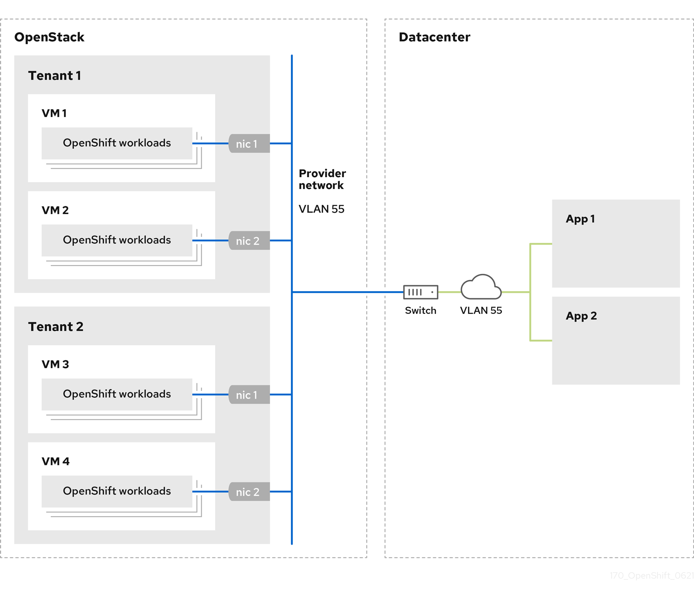

# Installing a cluster on OpenStack on your own infrastructure { #installing-openstack-user }

In OpenShift Container Platform version 4.22, you can install a cluster on Red Hat OpenStack Platform (RHOSP) that runs on user-provisioned infrastructure.

By using your own infrastructure, you can integrate your cluster with existing infrastructure and modifications. The process requires more effort on your part than installer-provisioned installations, because you must create all RHOSP resources, like Nova servers, Neutron ports, and security groups. However, Red Hat provides Ansible playbooks to help you in the deployment process.

Ensure that you meet the following prerequisites:

- You reviewed details about the OpenShift Container Platform installation and update processes.

- You read the documentation on selecting a cluster installation method and preparing it for users.

- You verified that OpenShift Container Platform 4.22 is compatible with your RHOSP version by using the "Supported platforms for OpenShift Container Platform clusters" section. You can also compare platform support across different versions by viewing the OpenShift Container Platform on RHOSP support matrix.

- You have an RHOSP account where you want to install OpenShift Container Platform.

- You understand performance and scalability practices for cluster scaling, control plane sizing, and etcd. For more information, see "Recommended control plane practices".

- On the machine from which you run the installation program, you have:

    - A single directory in which you can keep the files you create during the installation process
    - Python 3

You can complete the following configurations after you install a cluster on RHOSP on your own infrastructure:

- Customize your cluster.
- If necessary, you can use remote health reporting.
- If you need to enable external access to node ports, configure ingress cluster traffic by using a node port.
- If you did not configure RHOSP to accept application traffic over floating IP addresses, configure RHOSP access with floating IP addresses.

**Additional resources**

- [Installation and update](../../architecture/architecture-installation.md#architecture-installation)
- [Selecting a cluster installation method and preparing it for users](../overview/installing-preparing.md#installing-preparing)
- [Supported platforms for OpenShift Container Platform clusters](../../architecture/architecture-installation.md#supported-platforms-for-openshift-clusters_architecture-installation)
- [OpenShift Container Platform on RHOSP support matrix](https://access.redhat.com/articles/4679401)
- [Recommended control plane practices](../../scalability_and_performance/recommended-performance-scale-practices/recommended-control-plane-practices.md#recommended-host-practices)
- [Postinstallation cluster tasks](../../post_installation_configuration/cluster-tasks.md#available_cluster_customizations)
- [Remote health reporting](../../support/remote_health_monitoring/remote-health-reporting.md#remote-health-reporting)
- [Configuring ingress cluster traffic by using a NodePort](../../networking/ingress_load_balancing/configuring_ingress_cluster_traffic/configuring-ingress-cluster-traffic-nodeport.md#nw-using-nodeport_configuring-ingress-cluster-traffic-nodeport)
- [Configuring network settings after installing RHOSP](installing-openstack-network-config.md#installation-osp-configuring-api-floating-ip_installing-openstack-network-config)

## Internet access for OpenShift Container Platform { #cluster-entitlements_installing-openstack-user }

In OpenShift Container Platform 4.22, you require access to the internet to install your cluster.

You must have internet access to perform the following actions:

- Access Red Hat Hybrid Cloud Console to download the installation program and perform subscription management. If the cluster has internet access and you do not disable Telemetry, that service automatically entitles your cluster.
- Access Quay.io to obtain the packages that are required to install your cluster.
- Obtain the packages that are required to perform cluster updates.

!!! warning

    If your cluster cannot have direct internet access, you can perform a restricted network installation on some types of infrastructure that you provision. During that process, you download the required content and use it to populate a mirror registry with the installation packages. With some installation types, the environment that you install your cluster in will not require internet access. Before you update the cluster, you update the content of the mirror registry.

## Resource guidelines for installing OpenShift Container Platform on RHOSP { #installation-osp-default-deployment_installing-openstack-user }

To support an OpenShift Container Platform installation, your Red Hat OpenStack Platform (RHOSP) quota must meet certain requirements.

**Recommended resources for a default OpenShift Container Platform cluster on RHOSP**

| Resource              | Value                                                                 |
| --------------------- | --------------------------------------------------------------------- |
| Floating IP addresses | 3                                                                     |
| Ports                 | 15                                                                    |
| Routers               | 1                                                                     |
| Subnets               | 1                                                                     |
| RAM                   | 88 GB                                                                 |
| vCPUs                 | 22                                                                    |
| Volume storage        | 275 GB                                                                |
| Instances             | 7                                                                     |
| Security groups       | 3                                                                     |
| Security group rules  | 60                                                                    |
| Server groups         | 2 - plus 1 for each additional availability zone in each machine pool |

A cluster might function with fewer than recommended resources, but cluster performance is not guaranteed.

!!! warning

    If RHOSP object storage (Swift) is available and operated by a user account with the `swiftoperator` role, Swift is used as the default backend for the OpenShift Container Platform image registry. In this case, the volume storage requirement is 175 GB. Swift space requirements vary depending on the size of the image registry.

!!! note

    By default, your security group and security group rule quotas might be low. If you encounter problems, run `openstack quota set --secgroups 3 --secgroup-rules 60 <project>` as an administrator to increase them.

An OpenShift Container Platform deployment comprises control plane machines, compute machines, and a bootstrap machine.

### Control plane machines { #installation-osp-control-compute-machines_installing-openstack-user }

By default, the OpenShift Container Platform installation process creates three control plane machines.

Each machine requires:

- An instance from the RHOSP quota
- A port from the RHOSP quota
- A flavor with at least 16 GB memory and 4 vCPUs
- At least 100 GB storage space from the RHOSP quota

### Compute machines { #installation-osp-compute-machines_installing-openstack-user }

By default, the OpenShift Container Platform installation process creates three compute machines.

Each machine requires:

- An instance from the RHOSP quota
- A port from the RHOSP quota
- A flavor with at least 8 GB memory and 2 vCPUs
- At least 100 GB storage space from the RHOSP quota

!!! tip

    Compute machines host the applications that you run on OpenShift Container Platform; aim to run as many as you can.

### Bootstrap machine { #installation-osp-bootstrap-machine_installing-openstack-user }

During installation, a bootstrap machine is temporarily provisioned to stand up the control plane. After the production control plane is ready, the bootstrap machine is deprovisioned.

The bootstrap machine requires:

- An instance from the RHOSP quota
- A port from the RHOSP quota
- A flavor with at least 16 GB memory and 4 vCPUs
- At least 100 GB storage space from the RHOSP quota

## Downloading playbook dependencies { #installation-osp-downloading-modules_installing-openstack-user }

The Ansible playbooks that simplify the installation process on user-provisioned infrastructure require several ansible collections and Python modules. On the machine where you will run the installation program, add the Red Hat OpenStack Platform (RHOSP) repositories and then install the packages.

The following dependencies are required:

- Python modules:

    - `openstackclient`
    - `openstacksdk`
    - `netaddr`
    - `pip`

- Ansible collections:

    - `ansible-collections-openstack`, which installs Ansible Core
    - `ansible-collection-community-general`
    - `ansible-collection-ansible-netcommon`

!!! note

    These instructions assume that you are using Red Hat Enterprise Linux (RHEL) 8.

**Prerequisites**

- Python 3 is installed on your machine.

**Procedure**

1. On a command line, add the following repositories:

    1. Register with Red Hat Subscription Manager:

        ```terminal
        $ sudo subscription-manager register # If not done already
        ```

    2. Pull the latest subscription data:

        ```terminal
        $ sudo subscription-manager attach --pool=$YOUR_POOLID # If not done already
        ```

    3. Disable the current repositories:

        ```terminal
        $ sudo subscription-manager repos --disable=* # If not done already
        ```

    4. Add the required repositories:

        ```terminal
        $ sudo subscription-manager repos \
          --enable=rhel-9-for-x86_64-appstream-rpms \
          --enable=rhel-9-for-x86_64-baseos-rpms \
          --enable=openstack-17.1-for-rhel-9-x86_64-rpms
        ```

2. Install the modules:

    ```terminal
    $ sudo dnf install ansible-collection-ansible-netcommon \
        ansible-collection-community-general \
        ansible-collections-openstack \
        python3-netaddr \
        python3-openstackclient \
        python3-openstacksdk \
        python3-pip
    ```

3. Ensure that the `python` command points to `python3`:

    ```terminal
    $ sudo alternatives --set python /usr/bin/python3
    ```

## Downloading the installation playbooks { #installation-osp-downloading-playbooks_installing-openstack-user }

Download Ansible playbooks that you can use to install OpenShift Container Platform on your own Red Hat OpenStack Platform (RHOSP) infrastructure.

**Prerequisites**

- The curl command-line tool is available on your machine.

**Procedure**

- To download the playbooks to your working directory, run the following script from a command line:

    ```terminal
    $ xargs -n 1 curl -O <<< '
            https://raw.githubusercontent.com/openshift/installer/release-4.22/upi/openstack/bootstrap.yaml
            https://raw.githubusercontent.com/openshift/installer/release-4.22/upi/openstack/common.yaml
            https://raw.githubusercontent.com/openshift/installer/release-4.22/upi/openstack/compute-nodes.yaml
            https://raw.githubusercontent.com/openshift/installer/release-4.22/upi/openstack/control-plane.yaml
            https://raw.githubusercontent.com/openshift/installer/release-4.22/upi/openstack/down-bootstrap.yaml
            https://raw.githubusercontent.com/openshift/installer/release-4.22/upi/openstack/down-compute-nodes.yaml
            https://raw.githubusercontent.com/openshift/installer/release-4.22/upi/openstack/down-control-plane.yaml
            https://raw.githubusercontent.com/openshift/installer/release-4.22/upi/openstack/down-network.yaml
            https://raw.githubusercontent.com/openshift/installer/release-4.22/upi/openstack/down-security-groups.yaml
            https://raw.githubusercontent.com/openshift/installer/release-4.22/upi/openstack/down-containers.yaml
            https://raw.githubusercontent.com/openshift/installer/release-4.22/upi/openstack/inventory.yaml
            https://raw.githubusercontent.com/openshift/installer/release-4.22/upi/openstack/network.yaml
            https://raw.githubusercontent.com/openshift/installer/release-4.22/upi/openstack/security-groups.yaml
            https://raw.githubusercontent.com/openshift/installer/release-4.22/upi/openstack/update-network-resources.yaml'
    ```

    The playbooks are downloaded to your machine.

    !!! warning

        During the installation process, you can modify the playbooks to configure your deployment.

        Retain all playbooks for the life of your cluster. You must have the playbooks to remove your OpenShift Container Platform cluster from RHOSP.

    !!! warning

        You must match any edits you make in the `bootstrap.yaml`, `compute-nodes.yaml`, `control-plane.yaml`, `network.yaml`, and `security-groups.yaml` files to the corresponding playbooks that are prefixed with `down-`. For example, edits to the `bootstrap.yaml` file must be reflected in the `down-bootstrap.yaml` file, too. If you do not edit both files, the supported cluster removal process will fail.

## Obtaining the installation program { #installation-obtaining-installer_installing-openstack-user }

Before you install OpenShift Container Platform, download the installation file on the host you are using for installation, so that installation assets exist for deployment in your environment.

**Prerequisites**

- You have a computer that runs Linux or macOS, with 500 MB of local disk space.

**Procedure**

1. Go to the [Cluster Type](https://console.redhat.com/openshift/install) page on the Red Hat Hybrid Cloud Console. If you have a Red Hat account, log in with your credentials. If you do not, create an account.

    !!! tip

        You can also [download the binaries for a specific OpenShift Container Platform release](https://mirror.openshift.com/pub/openshift-v4/clients/ocp/).

2. Select your infrastructure provider from the **Run it yourself** section of the page.

3. Select your host operating system and architecture from the dropdown menus under **OpenShift Installer** and click **Download Installer**.

4. Place the downloaded file in the directory where you want to store the installation configuration files.

    !!! warning

        - The installation program creates several files on the computer that you use to install your cluster. You must keep the installation program and the files that the installation program creates after you finish installing the cluster. Both of the files are required to delete the cluster.
        - Deleting the files created by the installation program does not remove your cluster, even if the cluster failed during installation. To remove your cluster, complete the OpenShift Container Platform uninstallation procedures for your specific cloud provider.

5. Extract the installation program. For example, on a computer that uses a Linux operating system, run the following command:

    ```terminal
    $ tar -xvf openshift-install-linux.tar.gz
    ```

6. Download your installation [pull secret from Red Hat OpenShift Cluster Manager](https://console.redhat.com/openshift/install/pull-secret). This pull secret allows you to authenticate with the services that are provided by the included authorities, including Quay.io, which serves the container images for OpenShift Container Platform components.

    !!! tip

        Alternatively, you can retrieve the installation program from the [Red Hat Customer Portal](https://access.redhat.com/downloads/content/290/), where you can specify a version of the installation program to download. However, you must have an active subscription to access this page.

## Generating a key pair for cluster node SSH access { #ssh-agent-using_installing-openstack-user }

During an OpenShift Container Platform installation, you can provide an SSH public key to the installation program. The key is passed to the Red Hat Enterprise Linux CoreOS (RHCOS) nodes through their Ignition config files and is used to authenticate SSH access to the nodes. The key is added to the `~/.ssh/authorized_keys` list for the `core` user on each node, which enables password-less authentication.

The key is added to the `~/.ssh/authorized_keys` list for the `core` user on each node, which enables password-less authentication. After the key is passed to the nodes, you can use the key pair to SSH in to the RHCOS nodes as the user `core`. To access the nodes through SSH, the private key identity must be managed by SSH for your local user.

If you want to SSH in to your cluster nodes to perform installation debugging or disaster recovery, you must provide the SSH public key during the installation process. The `./openshift-install gather` command also requires the SSH public key to be in place on the cluster nodes.

!!! warning

    Do not skip this procedure in production environments, where disaster recovery and debugging is required.

!!! note

    You must use a local key, not one that you configured with platform-specific approaches.

**Procedure**

1. If you do not have an existing SSH key pair on your local machine to use for authentication onto your cluster nodes, create one. For example, on a computer that uses a Linux operating system, run the following command:

    ```terminal
    $ ssh-keygen -t ed25519 -N '' -f <path>/<file_name>
    ```

    Specifies the path and file name, such as `~/.ssh/id_ed25519`, of the new SSH key. If you have an existing key pair, ensure your public key is in the your `~/.ssh` directory.

    !!! note

        If you plan to install an OpenShift Container Platform cluster that uses the RHEL cryptographic libraries that have been submitted to NIST for FIPS 140-2/140-3 Validation on only the `x86_64`, `ppc64le`, and `s390x` architectures, do not create a key that uses the `ed25519` algorithm. Instead, create a key that uses the `rsa` or `ecdsa` algorithm.

2. View the public SSH key:

    ```terminal
    $ cat <path>/<file_name>.pub
    ```

    For example, run the following to view the `~/.ssh/id_ed25519.pub` public key:

    ```terminal
    $ cat ~/.ssh/id_ed25519.pub
    ```

3. Add the SSH private key identity to the SSH agent for your local user, if it has not already been added. SSH agent management of the key is required for password-less SSH authentication onto your cluster nodes, or if you want to use the `./openshift-install gather` command.

    !!! note

        On some distributions, default SSH private key identities such as `~/.ssh/id_rsa` and `~/.ssh/id_dsa` are managed automatically.

    1. If the `ssh-agent` process is not already running for your local user, start it as a background task:

        ```terminal
        $ eval "$(ssh-agent -s)"
        ```

        ```terminal title="Example output"
        Agent pid 31874
        ```

        !!! note

            If your cluster is in FIPS mode, only use FIPS-compliant algorithms to generate the SSH key. The key must be either RSA or ECDSA.

4. Add your SSH private key to the `ssh-agent`:

    ```terminal
    $ ssh-add <path>/<file_name>
    ```

    Specify the path and file name for your SSH private key, such as `~/.ssh/id_ed25519`.

    ```terminal title="Example output"
    Identity added: /home/<you>/<path>/<file_name> (<computer_name>)
    ```

**Next steps**

- When you install OpenShift Container Platform, provide the SSH public key to the installation program.

## Creating the Red Hat Enterprise Linux CoreOS (RHCOS) image { #installation-osp-creating-image_installing-openstack-user }

The OpenShift Container Platform installation program requires that a Red Hat Enterprise Linux CoreOS (RHCOS) image be present in the Red Hat OpenStack Platform (RHOSP) cluster. Retrieve the latest RHCOS image, then upload it using the RHOSP CLI.

**Prerequisites**

- The RHOSP CLI is installed.

**Procedure**

1. Log in to the Red Hat Customer Portal’s [Product Downloads page](https://access.redhat.com/downloads/content/290).

2. Under **Version**, select the most recent release of OpenShift Container Platform 4.22 for Red Hat Enterprise Linux (RHEL) 8.

    !!! warning

        The RHCOS images might not change with every release of OpenShift Container Platform. You must download images with the highest version that is less than or equal to the OpenShift Container Platform version that you install. Use the image versions that match your OpenShift Container Platform version if they are available.

3. Download the *Red Hat Enterprise Linux CoreOS (RHCOS) - OpenStack Image (QCOW)*.

4. Decompress the image.

    !!! note

        You must decompress the RHOSP image before the cluster can use it. The name of the downloaded file might not contain a compression extension, like `.gz` or `.tgz`. To find out if or how the file is compressed, in a command line, enter:

        ```terminal
        $ file <name_of_downloaded_file>
        ```

5. From the image that you downloaded, create an image that is named `rhcos` in your cluster by using the RHOSP CLI:

    ```terminal
    $ openstack image create --container-format=bare --disk-format=qcow2 --file rhcos-${RHCOS_VERSION}-openstack.qcow2 rhcos
    ```

    !!! warning

        Depending on your RHOSP environment, you might be able to upload the image in either [`.raw` or `.qcow2` formats](https://access.redhat.com/documentation/en-us/red_hat_openstack_platform/15/html/instances_and_images_guide/index). If you use Ceph, you must use the `.raw` format.

    !!! warning

        If the installation program finds multiple images with the same name, the program chooses one of them at random. To avoid this behavior, create unique names for resources in RHOSP.

        After you upload the image to RHOSP, the image is usable in the installation process.

## Verifying external network access { #installation-osp-verifying-external-network_installing-openstack-user }

The OpenShift Container Platform installation process requires external network access. You must provide an external network value to it, or deployment fails. Before you begin the process, verify that a network with the external router type exists in Red Hat OpenStack Platform (RHOSP).

**Prerequisites**

- [Configure OpenStack’s networking service to have DHCP agents forward instances' DNS queries](https://docs.openstack.org/neutron/rocky/admin/config-dns-res.html#case-2-dhcp-agents-forward-dns-queries-from-instances)

**Procedure**

- Using the RHOSP CLI, verify the name and ID of the 'External' network:

    ```terminal
    $ openstack network list --long -c ID -c Name -c "Router Type"
    ```

    ```terminal title="Example output"
    +--------------------------------------+----------------+-------------+
    | ID                                   | Name           | Router Type |
    +--------------------------------------+----------------+-------------+
    | 148a8023-62a7-4672-b018-003462f8d7dc | public_network | External    |
    +--------------------------------------+----------------+-------------+
    ```

    A network with an external router type appears in the network list. If at least one does not, see [Creating a default floating IP network](https://access.redhat.com/documentation/en-us/red_hat_openstack_platform/16.0/html/director_installation_and_usage/performing-overcloud-post-installation-tasks#creating-a-default-floating-ip-network) and [Creating a default provider network](https://access.redhat.com/documentation/en-us/red_hat_openstack_platform/16.0/html/director_installation_and_usage/performing-overcloud-post-installation-tasks#creating-a-default-provider-network).

    !!! note

        If the Neutron trunk service plugin is enabled, a trunk port is created by default. For more information, see [Neutron trunk port](https://wiki.openstack.org/wiki/Neutron/TrunkPort).

## Access to the environment { #installation-osp-accessing-api_installing-openstack-user }

At deployment, all OpenShift Container Platform machines are created in a Red Hat OpenStack Platform (RHOSP)-tenant network. Therefore, they are not accessible directly in most RHOSP deployments.

You can configure OpenShift Container Platform API and application access by using floating IP addresses (FIPs) during installation. You can also complete an installation without configuring FIPs, but the installer will not configure a way to reach the API or applications externally.

### Enabling access with floating IP addresses { #installation-osp-accessing-api-floating_installing-openstack-user }

Create floating IP (FIP) addresses for external access to the OpenShift Container Platform API, cluster applications, and the bootstrap process.

**Procedure**

1. Using the Red Hat OpenStack Platform (RHOSP) CLI, create the API FIP:

    ```terminal
    $ openstack floating ip create --description "API <cluster_name>.<base_domain>" <external_network>
    ```

2. Using the Red Hat OpenStack Platform (RHOSP) CLI, create the apps, or Ingress, FIP:

    ```terminal
    $ openstack floating ip create --description "Ingress <cluster_name>.<base_domain>" <external_network>
    ```

3. By using the Red Hat OpenStack Platform (RHOSP) CLI, create the bootstrap FIP:

    ```terminal
    $ openstack floating ip create --description "bootstrap machine" <external_network>
    ```

4. Add records that follow these patterns to your DNS server for the API and Ingress FIPs:

    ```dns
    api.<cluster_name>.<base_domain>.  IN  A  <API_FIP>
    *.apps.<cluster_name>.<base_domain>. IN  A <apps_FIP>
    ```

    !!! note

        If you do not control the DNS server, you can access the cluster by adding the cluster domain names such as the following to your `/etc/hosts` file:

        - `<api_floating_ip> api.<cluster_name>.<base_domain>`
        - `<application_floating_ip> grafana-openshift-monitoring.apps.<cluster_name>.<base_domain>`
        - `<application_floating_ip> prometheus-k8s-openshift-monitoring.apps.<cluster_name>.<base_domain>`
        - `<application_floating_ip> oauth-openshift.apps.<cluster_name>.<base_domain>`
        - `<application_floating_ip> console-openshift-console.apps.<cluster_name>.<base_domain>`
        - `application_floating_ip integrated-oauth-server-openshift-authentication.apps.<cluster_name>.<base_domain>`

        The cluster domain names in the `/etc/hosts` file grant access to the web console and the monitoring interface of your cluster locally. You can also use the `kubectl` or `oc`. You can access the user applications by using the additional entries pointing to the &lt;application_floating_ip>. This action makes the API and applications accessible to only you, which is not suitable for production deployment, but does allow installation for development and testing.

5. Add the FIPs to the `inventory.yaml` file as the values of the following variables:

    - `os_api_fip`

    - `os_bootstrap_fip`

    - `os_ingress_fip`

        If you use these values, you must also enter an external network as the value of the `os_external_network` variable in the `inventory.yaml` file.

        !!! tip

            You can make OpenShift Container Platform resources available outside of the cluster by assigning a floating IP address and updating your firewall configuration.

### Completing installation without floating IP addresses { #installation-osp-accessing-api-no-floating_installing-openstack-user }

You can install OpenShift Container Platform on Red Hat OpenStack Platform (RHOSP) without providing floating IP addresses.

**Procedure**

1. In the `inventory.yaml` file, do not define the following variables:

    - `os_api_fip`
    - `os_bootstrap_fip`
    - `os_ingress_fip`

2. If you cannot provide an external network, you can also leave `os_external_network` blank. If you do not provide a value for `os_external_network`, a router is not created for you, and, without additional action, the installer will fail to retrieve an image from Glance. Later in the installation process, when you create network resources, you must configure external connectivity on your own.

3. If you run the installer with the `wait-for` command from a system that cannot reach the cluster API due to a lack of floating IP addresses or name resolution, installation fails. To prevent installation failure in these cases, you can use a proxy network or run the installer from a system that is on the same network as your machines.

    !!! note

        You can enable name resolution by creating DNS records for the API and Ingress ports. For example:

        ```dns
        api.<cluster_name>.<base_domain>.  IN  A  <api_port_IP>
        *.apps.<cluster_name>.<base_domain>. IN  A <ingress_port_IP>
        ```

        If you do not control the DNS server, you can add the record to your `/etc/hosts` file. This action makes the API accessible to only you, which is not suitable for production deployment but does allow installation for development and testing.

## Defining parameters for the installation program { #installation-osp-describing-cloud-parameters_installing-openstack-user }

The OpenShift Container Platform installation program relies on a file that is called `clouds.yaml`. The file describes Red Hat OpenStack Platform (RHOSP) configuration parameters, including the project name, log in information, and authorization service URLs.

**Procedure**

1. Create the `clouds.yaml` file:

    - If your RHOSP distribution includes the Horizon web UI, generate a `clouds.yaml` file.

        !!! warning

            Remember to add a password to the `auth` field. You can also keep secrets in [a separate file](https://docs.openstack.org/os-client-config/latest/user/configuration.html#splitting-secrets) from `clouds.yaml`.

    - If your RHOSP distribution does not include the Horizon web UI, or you do not want to use Horizon, create the file yourself. For detailed information about `clouds.yaml`, see [Config files](https://docs.openstack.org/openstacksdk/latest/user/config/configuration.html#config-files) in the RHOSP documentation.

        ```yaml
        clouds:
          shiftstack:
            auth:
              auth_url: http://10.10.14.42:5000/v3
              project_name: shiftstack
              username: <username>
              password: <password>
              user_domain_name: Default
              project_domain_name: Default
          dev-env:
            region_name: RegionOne
            auth:
              username: <username>
              password: <password>
              project_name: 'devonly'
              auth_url: 'https://10.10.14.22:5001/v2.0'
        ```

2. If your RHOSP installation uses self-signed certificate authority (CA) certificates for endpoint authentication:

    1. Copy the certificate authority file to your machine.

    2. Add the `cacerts` key to the `clouds.yaml` file. The value must be an absolute, non-root-accessible path to the CA certificate:

        ```yaml
        clouds:
          shiftstack:
            ...
            cacert: "/etc/pki/ca-trust/source/anchors/ca.crt.pem"
        ```

        !!! tip

            After you run the installation program with a custom CA certificate, you can update the certificate by editing the value of the `ca-cert.pem` key in the `cloud-provider-config` keymap. You can then enter the following command:

            ```terminal
            $ oc edit configmap -n openshift-config cloud-provider-config
            ```

3. Place the `clouds.yaml` file in one of the following locations:

    1. The value of the `OS_CLIENT_CONFIG_FILE` environment variable

    2. The current directory

    3. A Unix-specific user configuration directory, for example `~/.config/openstack/clouds.yaml`

    4. A Unix-specific site configuration directory, for example `/etc/openstack/clouds.yaml`

        The installation program searches for `clouds.yaml` in that order.

## Creating network resources on RHOSP { #installation-osp-creating-network-resources_installing-openstack-user }

Create the network resources that an OpenShift Container Platform on Red Hat OpenStack Platform (RHOSP) installation on your own infrastructure requires. To save time, run supplied Ansible playbooks that generate security groups, networks, subnets, routers, and ports.

**Prerequisites**

- You downloaded the modules in "Downloading playbook dependencies".
- You downloaded the playbooks in "Downloading the installation playbooks".

**Procedure**

1. For a dual stack cluster deployment, edit the `inventory.yaml` file and uncomment the `os_subnet6` attribute.

2. To ensure that your network resources have unique names on the RHOSP deployment, create an environment variable and JSON file for use in the Ansible playbooks:

    1. Create an environment variable that has a unique name value by running the following command:

        ```terminal
        $ export OS_NET_ID="openshift-$(dd if=/dev/urandom count=4 bs=1 2>/dev/null |hexdump -e '"%02x"')"
        ```

    2. Verify that the variable is set by running the following command on a command line:

        ```terminal
        $ echo $OS_NET_ID
        ```

    3. Create a JSON object that includes the variable in a file called `netid.json` by running the following command:

        ```terminal
        $ echo "{\"os_net_id\": \"$OS_NET_ID\"}" | tee netid.json
        ```

3. On a command line, create the network resources by running the following command:

    ```terminal
    $ ansible-playbook -i inventory.yaml network.yaml
    ```

    !!! note

        The API and Ingress VIP fields will be overwritten in the `inventory.yaml` playbook with the IP addresses assigned to the network ports.

    !!! note

        The resources created by the `network.yaml` playbook are deleted by the `down-network.yaml` playbook.

## Creating the installation configuration file { #installation-initializing_installing-openstack-user }

You can customize the OpenShift Container Platform cluster you install on Red Hat OpenStack Platform (RHOSP).

**Prerequisites**

- You have the OpenShift Container Platform installation program and the pull secret for your cluster.

**Procedure**

1. Create the `install-config.yaml` file.

    1. Change to the directory that contains the installation program and run the following command:

        ```terminal
        $ ./openshift-install create install-config --dir <installation_directory>
        ```

        - `<installation_directory>`: For `<installation_directory>`, specify the directory name to store the files that the installation program creates.

            When specifying the directory:

        - Verify that the directory has the `execute` permission. This permission is required to run Terraform binaries under the installation directory.

        - Use an empty directory. Some installation assets, such as bootstrap X.509 certificates, have short expiration intervals, therefore you must not reuse an installation directory. If you want to reuse individual files from another cluster installation, you can copy them into your directory. However, the file names for the installation assets might change between releases. Use caution when copying installation files from an earlier OpenShift Container Platform version.

    2. At the prompts, provide the configuration details for your cloud:

        1. Optional: Select an SSH key to use to access your cluster machines.

            !!! note

                For production OpenShift Container Platform clusters on which you want to perform installation debugging or disaster recovery, specify an SSH key that your `ssh-agent` process uses.

        2. Select **openstack** as the platform to target.

        3. Specify the Red Hat OpenStack Platform (RHOSP) external network name to use for installing the cluster.

        4. Specify the floating IP address to use for external access to the OpenShift API.

        5. Specify a RHOSP flavor with at least 16 GB RAM to use for control plane nodes and 8 GB RAM for compute nodes.

        6. Select the base domain to deploy the cluster to. All DNS records will be sub-domains of this base and will also include the cluster name.

        7. Enter a name for your cluster. The name must be 14 or fewer characters long.

2. Modify the `install-config.yaml` file. You can find more information about the available parameters in the "Installation configuration parameters" section.

3. Back up the `install-config.yaml` file so that you can use it to install multiple clusters.

    !!! warning

        The `install-config.yaml` file is consumed during the installation process. If you want to reuse the file, you must back it up now.

You now have the file `install-config.yaml` in the directory that you specified.

**Additional resources**

- [Installation configuration parameters for OpenStack](installation-config-parameters-openstack.md#installation-config-parameters-openstack)

### Custom subnets in RHOSP deployments { #installation-osp-custom-subnet_installing-openstack-user }

Optionally, you can deploy a cluster on a Red Hat OpenStack Platform (RHOSP) subnet of your choice. The GUID of a subnet is passed as the value of `platform.openstack.machinesSubnet` in the `install-config.yaml` file.

This subnet is used as the cluster’s primary subnet. By default, nodes and ports are created on the subnet. You can create nodes and ports on a different RHOSP subnet by setting the value of the `platform.openstack.machinesSubnet` property to the subnet’s UUID.

Before you run the OpenShift Container Platform installer with a custom subnet, verify that your configuration meets the following requirements:

- The subnet that is used by `platform.openstack.machinesSubnet` has DHCP enabled.
- The CIDR of `platform.openstack.machinesSubnet` matches the CIDR of `networking.machineNetwork`.
- The installation program user has permission to create ports on this network, including ports with fixed IP addresses.

Clusters that use custom subnets have the following limitations:

- If you plan to install a cluster that uses floating IP addresses, the `platform.openstack.machinesSubnet` subnet must be attached to a router that is connected to the `externalNetwork` network.
- If the `platform.openstack.machinesSubnet` value is set in the `install-config.yaml` file, the installation program does not create a private network or subnet for your RHOSP machines.
- You cannot use the `platform.openstack.externalDNS` property at the same time as a custom subnet. To add DNS to a cluster that uses a custom subnet, configure DNS on the RHOSP network.

!!! note

    By default, the API VIP takes x.x.x.5 and the Ingress VIP takes x.x.x.7 from your network’s CIDR block. To override these default values, set values for `platform.openstack.apiVIPs` and `platform.openstack.ingressVIPs` that are outside of the DHCP allocation pool.

!!! warning

    The CIDR ranges for networks are not adjustable after cluster installation. Red Hat does not provide direct guidance on determining the range during cluster installation because it requires careful consideration of the number of created pods per namespace.

### Sample customized install-config.yaml file for RHOSP { #installation-osp-config-yaml_installing-openstack-user }

The example `install-config.yaml` files demonstrate all of the possible Red Hat OpenStack Platform (RHOSP) customization options.

!!! warning

    This sample file is provided for reference only. You must obtain your `install-config.yaml` file by using the installation program.

??? note "Example single stack `install-config.yaml` file"

    ```yaml
    apiVersion: v1
    baseDomain: example.com
    controlPlane:
      name: master
      platform: {}
      replicas: 3
    compute:
    - name: worker
      platform:
        openstack:
          type: ml.large
      replicas: 3
    metadata:
      name: example
    networking:
      clusterNetwork:
      - cidr: 10.128.0.0/14
        hostPrefix: 23
      machineNetwork:
      - cidr: 10.0.0.0/16
      serviceNetwork:
      - 172.30.0.0/16
      networkType: OVNKubernetes
    platform:
      openstack:
        cloud: mycloud
        externalNetwork: external
        computeFlavor: m1.xlarge
        apiFloatingIP: 128.0.0.1
    fips: false
    pullSecret: '{"auths": ...}'
    sshKey: ssh-ed25519 AAAA...
    ```

??? note "Example dual stack `install-config.yaml` file"

    ```yaml
    apiVersion: v1
    baseDomain: example.com
    controlPlane:
      name: master
      platform: {}
      replicas: 3
    compute:
    - name: worker
      platform:
        openstack:
          type: ml.large
      replicas: 3
    metadata:
      name: example
    networking:
      clusterNetwork:
      - cidr: 10.128.0.0/14
        hostPrefix: 23
      - cidr: fd01::/48
        hostPrefix: 64
      machineNetwork:
      - cidr: 192.168.25.0/24
      - cidr: fd2e:6f44:5dd8:c956::/64
      serviceNetwork:
      - 172.30.0.0/16
      - fd02::/112
      networkType: OVNKubernetes
    platform:
      openstack:
        cloud: mycloud
        externalNetwork: external
        computeFlavor: m1.xlarge
        apiVIPs:
        - 192.168.25.10
        - fd2e:6f44:5dd8:c956:f816:3eff:fec3:5955
        ingressVIPs:
        - 192.168.25.132
        - fd2e:6f44:5dd8:c956:f816:3eff:fe40:aecb
        controlPlanePort:
          fixedIPs:
          - subnet:
              name: openshift-dual4
          - subnet:
              name: openshift-dual6
          network:
            name: openshift-dual
    fips: false
    pullSecret: '{"auths": ...}'
    sshKey: ssh-ed25519 AAAA...
    ```

### Setting a custom subnet for machines { #installation-osp-fixing-subnet_installing-openstack-user }

The IP range that the installation program uses by default might not match the Neutron subnet that you create when you install OpenShift Container Platform. If necessary, update the CIDR value for new machines by editing the installation configuration file.

**Prerequisites**

- You have the `install-config.yaml` file that was generated by the OpenShift Container Platform installation program.
- You have Python 3 installed.

**Procedure**

1. On a command line, browse to the directory that contains the `install-config.yaml` and `inventory.yaml` files.

2. From that directory, either run a script to edit the `install-config.yaml` file or update the file manually:

    - To set the value by using a script, run the following command:

        ```terminal
        $ python -c 'import os
        import sys
        import yaml
        import re
        re_os_net_id = re.compile(r"{{\s*os_net_id\s*}}")
        os_net_id = os.getenv("OS_NET_ID")
        path = "common.yaml"
        facts = None
        for _dict in yaml.safe_load(open(path))[0]["tasks"]:
            if "os_network" in _dict.get("set_fact", {}):
                facts = _dict["set_fact"]
                break
        if not facts:
            print("Cannot find `os_network` in common.yaml file. Make sure OpenStack resource names are defined in one of the tasks.")
            sys.exit(1)
        os_network = re_os_net_id.sub(os_net_id, facts["os_network"])
        os_subnet = re_os_net_id.sub(os_net_id, facts["os_subnet"])
        path = "install-config.yaml"
        data = yaml.safe_load(open(path))
        inventory = yaml.safe_load(open("inventory.yaml"))["all"]["hosts"]["localhost"]
        machine_net = [{"cidr": inventory["os_subnet_range"]}]
        api_vips = [inventory["os_apiVIP"]]
        ingress_vips = [inventory["os_ingressVIP"]]
        ctrl_plane_port = {"network": {"name": os_network}, "fixedIPs": [{"subnet": {"name": os_subnet}}]}
        if inventory.get("os_subnet6_range"):
            os_subnet6 = re_os_net_id.sub(os_net_id, facts["os_subnet6"])
            machine_net.append({"cidr": inventory["os_subnet6_range"]})
            api_vips.append(inventory["os_apiVIP6"])
            ingress_vips.append(inventory["os_ingressVIP6"])
            data["networking"]["networkType"] = "OVNKubernetes"
            data["networking"]["clusterNetwork"].append({"cidr": inventory["cluster_network6_cidr"], "hostPrefix": inventory["cluster_network6_prefix"]})
            data["networking"]["serviceNetwork"].append(inventory["service_subnet6_range"])
            ctrl_plane_port["fixedIPs"].append({"subnet": {"name": os_subnet6}})
        data["networking"]["machineNetwork"] = machine_net
        data["platform"]["openstack"]["apiVIPs"] = api_vips
        data["platform"]["openstack"]["ingressVIPs"] = ingress_vips
        data["platform"]["openstack"]["controlPlanePort"] = ctrl_plane_port
        del data["platform"]["openstack"]["externalDNS"]
        open(path, "w").write(yaml.dump(data, default_flow_style=False))'
        ```

    - Where `if inventory.get("os_subnet6_range")` applies to dual stack (IPv4/IPv6) environments.

### Emptying compute machine pools { #installation-osp-emptying-worker-pools_installing-openstack-user }

To proceed with an installation that uses your own infrastructure, set the number of compute machines in the installation configuration file to zero. Later, you create these machines manually.

**Prerequisites**

- You have the `install-config.yaml` file that was generated by the OpenShift Container Platform installation program.

**Procedure**

1. On a command line, browse to the directory that contains `install-config.yaml`.

2. From that directory, either run a script to edit the `install-config.yaml` file or update the file manually:

    - To set the value by using a script, run:

        ```terminal
        $ python -c '
        import yaml;
        path = "install-config.yaml";
        data = yaml.safe_load(open(path));
        data["compute"][0]["replicas"] = 0;
        open(path, "w").write(yaml.dump(data, default_flow_style=False))'
        ```

    - To set the value manually, open the file and set the value of `compute.<first entry>.replicas` to `0`.

### Cluster deployment on RHOSP provider networks { #installation-osp-provider-networks_installing-openstack-user }

You can deploy your OpenShift Container Platform clusters on Red Hat OpenStack Platform (RHOSP) with a primary network interface on a provider network. Provider networks are commonly used to give projects direct access to a public network that can be used to reach the internet. You can also share provider networks among projects as part of the network creation process.

RHOSP provider networks map directly to an existing physical network in the data center. A RHOSP administrator must create them.

In the following example, OpenShift Container Platform workloads are connected to a data center by using a provider network:



OpenShift Container Platform clusters that are installed on provider networks do not require tenant networks or floating IP addresses. The installer does not create these resources during installation.

Example provider network types include flat (untagged) and VLAN (802.1Q tagged).

!!! note

    A cluster can support as many provider network connections as the network type allows. For example, VLAN networks typically support up to 4096 connections.

You can learn more about provider and tenant networks in the RHOSP documentation.

**Additional resources**

- [The RHOSP documentation](https://access.redhat.com/documentation/en-us/red_hat_openstack_platform/16.1/html/networking_guide/networking-overview_rhosp-network#tenant-provider-networks_network-overview)

#### RHOSP provider network requirements for cluster installation { #installation-osp-provider-network-preparation_installing-openstack-user }

Before you install an OpenShift Container Platform cluster, your Red Hat OpenStack Platform (RHOSP) deployment and provider network must meet several conditions.

These conditions are listed as follows:

- The [RHOSP networking service (Neutron) is enabled](https://access.redhat.com/documentation/en-us/red_hat_openstack_platform/16.1/html/networking_guide/networking-overview_rhosp-network#install-networking_network-overview) and accessible through the RHOSP networking API.

- The RHOSP networking service has the [port security and allowed address pairs extensions enabled](https://access.redhat.com/documentation/en-us/red_hat_openstack_platform/16.1/html/networking_guide/config-allowed-address-pairs_rhosp-network#overview-allow-addr-pairs_config-allowed-address-pairs).

- The provider network can be shared with other tenants.

    !!! tip

        Use the `openstack network create` command with the `--share` flag to create a network that can be shared.

- The RHOSP project that you use to install the cluster must own the provider network and an appropriate subnet.

To learn more about creating networks on RHOSP, read the provider networks documentation.

**Procedure**

1. To create a network for a project that is named "openshift," enter the following command:

    ```terminal
    $ openstack network create --project openshift
    ```

2. To create a subnet for a project that is named "openshift," enter the following command:

    ```terminal
    $ openstack subnet create --project openshift
    ```

3. If the cluster is owned by the `admin` user, you must run the installation program as that user to create ports on the network.

    !!! warning

        Provider networks must be owned by the RHOSP project that is used to create the cluster. If they are not, the RHOSP Compute service (Nova) cannot request a port from that network.

4. Verify that the provider network can reach the RHOSP metadata service IP address, which is `169.254.169.254` by default.

    Depending on your RHOSP SDN and networking service configuration, you might need to provide the route when you create the subnet. For example:

    ```terminal
    $ openstack subnet create --dhcp --host-route destination=169.254.169.254/32,gateway=192.0.2.2 ...
    ```

5. Optional: To secure the network, create role-based access control (RBAC) rules that limit network access to a single project.

**Additional resources**

- [The provider networks documentation](https://access.redhat.com/documentation/en-us/red_hat_openstack_platform/16.1/html/networking_guide/networking-overview_rhosp-network#tenant-provider-networks_network-overview)
- [role-based access control (RBAC)](https://access.redhat.com/documentation/en-us/red_hat_openstack_platform/16.1/html/networking_guide/config-rbac-policies_rhosp-network#proc_create-rbac-policies_config-rbac-policies)

#### Deploying a cluster that has a primary interface on a provider network { #installation-osp-deploying-provider-networks-installer_installing-openstack-user }

You can deploy an OpenShift Container Platform cluster that has its primary network interface on an Red Hat OpenStack Platform (RHOSP) provider network.

!!! tip

    You can add additional networks, including provider networks, to the `platform.openstack.additionalNetworkIDs` list.

    After you deploy your cluster, you can attach pods to additional networks. For more information, see "Understanding multiple networks".

**Prerequisites**

- Your Red Hat OpenStack Platform (RHOSP) deployment is configured as described by "RHOSP provider network requirements for cluster installation".

**Procedure**

1. In a text editor, open the `install-config.yaml` file.

2. Set the value of the `platform.openstack.apiVIPs` property to the IP address for the API VIP.

3. Set the value of the `platform.openstack.ingressVIPs` property to the IP address for the Ingress VIP.

4. Set the value of the `platform.openstack.machinesSubnet` property to the UUID of the provider network subnet.

5. Set the value of the `networking.machineNetwork.cidr` property to the CIDR block of the provider network subnet.

    !!! warning

        The `platform.openstack.apiVIPs` and `platform.openstack.ingressVIPs` properties must both be unassigned IP addresses from the `networking.machineNetwork.cidr` block.

    ```yaml title="Section of an installation configuration file for a cluster that relies on a RHOSP provider network"
            ...
            platform:
              openstack:
                apiVIPs:
                  - 192.0.2.13
                ingressVIPs:
                  - 192.0.2.23
                machinesSubnet: fa806b2f-ac49-4bce-b9db-124bc64209bf
                # ...
            networking:
              machineNetwork:
              - cidr: 192.0.2.0/24
    ```

    - In OpenShift Container Platform 4.12 and later, the `apiVIP` and `ingressVIP` configuration settings are deprecated. Instead, use a list format to enter values in the `apiVIPs` and `ingressVIPs` configuration settings.

        !!! warning

            You cannot set the `platform.openstack.externalNetwork` or `platform.openstack.externalDNS` parameters while using a provider network for the primary network interface.

        When you deploy the cluster, the installer uses the `install-config.yaml` file to deploy the cluster on the provider network.

## Creating the Kubernetes manifest and Ignition config files { #installation-user-infra-generate-k8s-manifest-ignition_installing-openstack-user }

Because you manually provision infrastructure, you must generate the Kubernetes manifest and Ignition config files that the cluster requires.

The installation program converts the installation configuration into Kubernetes manifests and then wraps them into Ignition configuration files. You use these Ignition files to configure the cluster machines.

!!! warning

    - The Ignition config files that the OpenShift Container Platform installation program generates contain certificates that expire after 24 hours, which the system then renews. If you shut down the cluster before the system renews the certificates and you later restart the cluster after the 24 hours have elapsed, the cluster automatically recovers the expired certificates. The exception is that you must manually approve the pending `node-bootstrapper` certificate signing requests (CSRs) to recover kubelet certificates. See the documentation for *Recovering from expired control plane certificates* for more information.
    - Use Ignition config files within 12 hours after you generate them, because the 24-hour certificate rotates from 16 to 22 hours after you install the cluster. By using the Ignition config files within 12 hours, you can avoid installation failure if the certificate update runs during installation.

**Prerequisites**

- You obtained the OpenShift Container Platform installation program.
- You created the `install-config.yaml` installation configuration file.

**Procedure**

1. Change to the directory that contains the OpenShift Container Platform installation program and generate the Kubernetes manifests for the cluster:

    ```terminal
    $ ./openshift-install create manifests --dir <installation_directory>
    ```

    where:

    `<installation_directory>`
    :   Specifies the installation directory that contains the `install-config.yaml` file you created.

2. Remove the Kubernetes manifest files that define the control plane machines, compute machine sets, and control plane machine sets:

    ```terminal
    $ rm -f openshift/99_openshift-cluster-api_master-machines-*.yaml openshift/99_openshift-cluster-api_worker-machineset-*.yaml openshift/99_openshift-machine-api_master-control-plane-machine-set.yaml
    ```

    Because you create and manage these resources yourself, you do not have to initialize them. You can preserve the compute machine set files to create compute machines by using the machine API, but you must update references to them to match your environment.

3. Verify that the `mastersSchedulable` parameter in the `<installation_directory>/manifests/cluster-scheduler-02-config.yml` Kubernetes manifest file is set to `false`. This setting prevents pods from being scheduled on the control plane machines:

    1. Open the `<installation_directory>/manifests/cluster-scheduler-02-config.yml` file.
    2. Locate the `mastersSchedulable` parameter and verify that it is set to `false`.
    3. Save and exit the file.

4. To create the Ignition configuration files, run the following command from the directory that contains the installation program:

    ```terminal
    $ ./openshift-install create ignition-configs --dir <installation_directory>
    ```

    where:

    `<installation_directory>`
    :   Specifies the same installation directory. The installation program creates Ignition config files for the bootstrap, control plane, and compute nodes in the installation directory. The program also creates the `kubeadmin-password` and `kubeconfig` files in the `./<installation_directory>/auth` directory:

    ```
    .
    ├── auth
    │   ├── kubeadmin-password
    │   └── kubeconfig
    ├── bootstrap.ign
    ├── master.ign
    ├── metadata.json
    └── worker.ign
    ```

5. Export the metadata file’s `infraID` key as an environment variable:

    ```terminal
    $ export INFRA_ID=$(jq -r .infraID metadata.json)
    ```

    !!! tip

        Extract the `infraID` key from `metadata.json` and use it as a prefix for all of the RHOSP resources that you create. By doing so, you avoid name conflicts when making multiple deployments in the same project.

## Preparing the bootstrap Ignition files { #installation-osp-converting-ignition-resources_installing-openstack-user }

The OpenShift Container Platform installation process relies on bootstrap machines that are created from a bootstrap Ignition configuration file.

Edit the file and upload it. Then, create a secondary bootstrap Ignition configuration file that Red Hat OpenStack Platform (RHOSP) uses to download the primary file.

**Prerequisites**

- You have the bootstrap Ignition file that the installer program generates, `bootstrap.ign`.

- The infrastructure ID from the installer’s metadata file is set as an environment variable (`$INFRA_ID`).

    - If the variable is not set, see **Creating the Kubernetes manifest and Ignition config files**.

- You have an HTTP(S)-accessible way to store the bootstrap Ignition file.

    - The documented procedure uses the RHOSP image service (Glance), but you can also use the RHOSP storage service (Swift), Amazon S3, an internal HTTP server, or an ad hoc Nova server.

**Procedure**

1. Run the following Python script. The script modifies the bootstrap Ignition file to set the hostname and, if available, CA certificate file when it runs:

    ```python
    import base64
    import json
    import os

    with open('bootstrap.ign', 'r') as f:
        ignition = json.load(f)

    files = ignition['storage'].get('files', [])

    infra_id = os.environ.get('INFRA_ID', 'openshift').encode()
    hostname_b64 = base64.standard_b64encode(infra_id + b'-bootstrap\n').decode().strip()
    files.append(
    {
        'path': '/etc/hostname',
        'mode': 420,
        'contents': {
            'source': 'data:text/plain;charset=utf-8;base64,' + hostname_b64
        }
    })

    ca_cert_path = os.environ.get('OS_CACERT', '')
    if ca_cert_path:
        with open(ca_cert_path, 'r') as f:
            ca_cert = f.read().encode()
            ca_cert_b64 = base64.standard_b64encode(ca_cert).decode().strip()

        files.append(
        {
            'path': '/opt/openshift/tls/cloud-ca-cert.pem',
            'mode': 420,
            'contents': {
                'source': 'data:text/plain;charset=utf-8;base64,' + ca_cert_b64
            }
        })

    ignition['storage']['files'] = files;

    with open('bootstrap.ign', 'w') as f:
        json.dump(ignition, f)
    ```

2. Using the RHOSP CLI, create an image that uses the bootstrap Ignition file:

    ```terminal
    $ openstack image create --disk-format=raw --container-format=bare --file bootstrap.ign <image_name>
    ```

3. Get the image’s details:

    ```terminal
    $ openstack image show <image_name>
    ```

    Make a note of the `file` value; it follows the pattern `v2/images/<image_ID>/file`.

    !!! note

        Verify that the image you created is active.

4. Retrieve the image service’s public address:

    ```terminal
    $ openstack catalog show image
    ```

5. Combine the public address with the image `file` value and save the result as the storage location. The location follows the pattern `<image_service_public_URL>/v2/images/<image_ID>/file`.

6. Generate an auth token and save the token ID:

    ```terminal
    $ openstack token issue -c id -f value
    ```

7. Insert the following content into a file called `$INFRA_ID-bootstrap-ignition.json` and edit the placeholders to match your own values:

    ```json
    {
      "ignition": {
        "config": {
          "merge": [{
            "source": "<storage_url>",
            "httpHeaders": [{
              "name": "X-Auth-Token",
              "value": "<token_ID>"
            }]
          }]
        },
        "security": {
          "tls": {
            "certificateAuthorities": [{
              "source": "data:text/plain;charset=utf-8;base64,<base64_encoded_certificate>"
            }]
          }
        },
        "version": "3.2.0"
      }
    }
    ```

    where:

    `ignition.config.merge.source`
    :   Replace the value of `ignition.config.merge.source` with the bootstrap Ignition file storage URL.

    `ignition.config.merge.source.httpHeaders.name`
    :   Specifies `name` in `httpHeaders` to `"X-Auth-Token"`.

    `ignition.config.merge.source.httpHeaders.value`
    :   Specifies `value` in `httpHeaders` to your token’s ID.

    `security.tls.certificateAuthorities.source`
    :   If the bootstrap Ignition file server uses a self-signed certificate, include the base64-encoded certificate.

8. Save the secondary Ignition config file.

    The bootstrap Ignition data will be passed to RHOSP during installation.

    !!! warning

        The bootstrap Ignition file contains sensitive information, like `clouds.yaml` credentials. Ensure that you store it in a secure place, and delete it after you complete the installation process.

## Creating control plane Ignition config files on RHOSP { #installation-osp-creating-control-plane-ignition_installing-openstack-user }

Installing OpenShift Container Platform on Red Hat OpenStack Platform (RHOSP) on your own infrastructure requires control plane Ignition config files. You must create multiple config files.

!!! note

    As with the bootstrap Ignition configuration, you must explicitly define a hostname for each control plane machine.

**Prerequisites**

- The infrastructure ID from the installation program’s metadata file is set as an environment variable (`$INFRA_ID`).

    - If the variable is not set, see "Creating the Kubernetes manifest and Ignition config files".

**Procedure**

- On a command line, run the following Python script:

    ```terminal
    $ for index in $(seq 0 2); do
        MASTER_HOSTNAME="$INFRA_ID-master-$index\n"
        python -c "import base64, json, sys;
    ignition = json.load(sys.stdin);
    storage = ignition.get('storage', {});
    files = storage.get('files', []);
    files.append({'path': '/etc/hostname', 'mode': 420, 'contents': {'source': 'data:text/plain;charset=utf-8;base64,' + base64.standard_b64encode(b'$MASTER_HOSTNAME').decode().strip(), 'verification': {}}, 'filesystem': 'root'});
    storage['files'] = files;
    ignition['storage'] = storage
    json.dump(ignition, sys.stdout)" <master.ign >"$INFRA_ID-master-$index-ignition.json"
    done
    ```

    You now have three control plane Ignition files: `<INFRA_ID>-master-0-ignition.json`, `<INFRA_ID>-master-1-ignition.json`, and `<INFRA_ID>-master-2-ignition.json`.

## Updating network resources on RHOSP { #installation-osp-updating-network-resources_installing-openstack-user }

Update the network resources that an OpenShift Container Platform on Red Hat OpenStack Platform (RHOSP) installation on your own infrastructure requires.

**Prerequisites**

- Python 3 is installed on your machine.
- You downloaded the modules in "Downloading playbook dependencies".
- You downloaded the playbooks in "Downloading the installation playbooks".

**Procedure**

1. Optional: Add an external network value to the `inventory.yaml` playbook:

    ```yaml title="Example external network value in the inventory.yaml Ansible Playbook"
    ...
          # The public network providing connectivity to the cluster. If not
          # provided, the cluster external connectivity must be provided in another
          # way.

          # Required for os_api_fip, os_ingress_fip, os_bootstrap_fip.
          os_external_network: 'external'
    ...
    ```

    !!! warning

        If you did not provide a value for `os_external_network` in the `inventory.yaml` file, you must ensure that VMs can access Glance and an external connection yourself.

2. Optional: Add external network and floating IP (FIP) address values to the `inventory.yaml` playbook:

    ```yaml title="Example FIP values in the inventory.yaml Ansible Playbook"
    ...
          # OpenShift API floating IP address. If this value is non-empty, the
          # corresponding floating IP will be attached to the Control Plane to
          # serve the OpenShift API.
          os_api_fip: '203.0.113.23'

          # OpenShift Ingress floating IP address. If this value is non-empty, the
          # corresponding floating IP will be attached to the worker nodes to serve
          # the applications.
          os_ingress_fip: '203.0.113.19'

          # If this value is non-empty, the corresponding floating IP will be
          # attached to the bootstrap machine. This is needed for collecting logs
          # in case of install failure.
          os_bootstrap_fip: '203.0.113.20'
    ```

    !!! warning

        If you do not define values for `os_api_fip` and `os_ingress_fip`, you must perform postinstallation network configuration.

        If you do not define a value for `os_bootstrap_fip`, the installation program cannot download debugging information from failed installations.

        See "Enabling access to the environment" for more information.

3. On a command line, create security groups by running the `security-groups.yaml` playbook:

    ```terminal
    $ ansible-playbook -i inventory.yaml security-groups.yaml
    ```

4. On a command line, update the network resources by running the `update-network-resources.yaml` playbook:

    ```terminal
    $ ansible-playbook -i inventory.yaml update-network-resources.yaml
    ```

    - The playbook adds tags to the network, subnets, ports, and router. The playbook also attaches floating IP addresses to the API and Ingress ports and sets the security groups for those ports.

5. Optional: If you want to control the default resolvers that Nova servers use, run the RHOSP CLI command:

    ```terminal
    $ openstack subnet set --dns-nameserver <server_1> --dns-nameserver <server_2> "$INFRA_ID-nodes"
    ```

6. Optional: You can use the `inventory.yaml` file that you created to customize your installation. For example, you can deploy a cluster that uses bare-metal machines.

### Deploying a cluster with bare-metal machines { #installation-osp-deploying-bare-metal-machines_installing-openstack-user }

If you want your cluster to use bare-metal machines, modify the `inventory.yaml` file. Your cluster can have compute machines running on bare metal.

!!! note

    Be sure that your `install-config.yaml` file reflects whether the RHOSP network that you use for bare-metal workers supports floating IP addresses or not.

**Prerequisites**

- The Bare Metal service (Ironic) is enabled and accessible via the RHOSP Compute API.
- Bare metal is available as a RHOSP flavor.
- If your cluster runs on an RHOSP version that is more than 16.1.6 and less than 16.2.4, bare-metal workers do not function due to a [known issue](https://bugzilla.redhat.com/show_bug.cgi?id=2033953) that causes the metadata service to be unavailable for services on OpenShift Container Platform nodes.
- The RHOSP network supports both VM and bare-metal server attachment.
- If you want to deploy the machines on a pre-existing network, a RHOSP subnet is provisioned.
- If you want to deploy the machines on an installer-provisioned network, the RHOSP Bare Metal service (Ironic) is able to listen for and interact with Preboot eXecution Environment (PXE) boot machines that run on tenant networks.
- You created an `inventory.yaml` file as part of the OpenShift Container Platform installation process.

**Procedure**

1. In the `inventory.yaml` file, edit the flavors for machines:

    1. Change the value of `os_flavor_worker` to a bare-metal flavor.

        ```yaml title="An example bare metal inventory.yaml file"
        all:
          hosts:
            localhost:
              ansible_connection: local
              ansible_python_interpreter: "{{ansible_playbook_python}}"

              # User-provided values
              os_subnet_range: '10.0.0.0/16'
              os_flavor_master: 'my-vm-flavor'
              os_flavor_worker: 'my-bare-metal-flavor'
              os_image_rhcos: 'rhcos'
              os_external_network: 'external'
        ...
        ```

        where:

        `all.hosts.localhost.os_flavor_worker`
        :   Specifies a bare-metal flavor to use for compute machines. Use the updated `inventory.yaml` file to complete the installation process. Machines that are created during deployment use the flavor that you added to the file.

        - 

        !!! note

            The installation program may time out while waiting for bare-metal machines to boot.

            If the installation program times out, restart and then complete the deployment by using the `wait-for` command of the installation program. For example:

            ```terminal
            $ ./openshift-install wait-for install-complete --log-level debug
            ```

**Additional resources**

- [Bare Metal service (Ironic)](https://access.redhat.com/documentation/en-us/red_hat_openstack_platform/16.1/html/bare_metal_provisioning/index)
- [A RHOSP flavor](https://docs.redhat.com/en/documentation/red_hat_openstack_platform/17.1/html/configuring_the_bare_metal_provisioning_service/assembly_configuring-the-bare-metal-provisioning-service-after-deployment#proc_creating-flavors-for-launching-bare-metal-instances_bare-metal-post-deployment)

## Creating the bootstrap machine on RHOSP { #installation-osp-creating-bootstrap-machine_installing-openstack-user }

Create a bootstrap machine and give it the network access it needs to run on Red Hat OpenStack Platform (RHOSP). Red Hat provides an Ansible playbook that you run to simplify this process.

**Prerequisites**

- You downloaded the modules in "Downloading playbook dependencies".
- You downloaded the playbooks in "Downloading the installation playbooks".
- The `inventory.yaml`, `common.yaml`, and `bootstrap.yaml` Ansible playbooks are in a common directory.
- The `metadata.json` file that the installation program created is in the same directory as the Ansible playbooks.

**Procedure**

1. On a command line, change the working directory to the location of the playbooks.

2. On a command line, run the `bootstrap.yaml` playbook:

    ```terminal
    $ ansible-playbook -i inventory.yaml bootstrap.yaml
    ```

3. After the bootstrap server is active, view the logs to verify that the Ignition files were received:

    ```terminal
    $ openstack console log show "$INFRA_ID-bootstrap"
    ```

## Creating the control plane machines on RHOSP { #installation-osp-creating-control-plane_installing-openstack-user }

Create three control plane machines by using the Ignition config files that you generated. Red Hat provides an Ansible playbook that you run to simplify this process.

**Prerequisites**

- You downloaded the modules in "Downloading playbook dependencies".
- You downloaded the playbooks in "Downloading the installation playbooks".
- The infrastructure ID from the installation program’s metadata file is set as an environment variable (`$INFRA_ID`).
- The `inventory.yaml`, `common.yaml`, and `control-plane.yaml` Ansible playbooks are in a common directory.
- You have the three Ignition files that were created in "Creating control plane Ignition config files".

**Procedure**

1. On a command line, change the working directory to the location of the playbooks.

2. If the control plane Ignition config files are not already in your working directory, copy them into it.

3. On a command line, run the `control-plane.yaml` playbook:

    ```terminal
    $ ansible-playbook -i inventory.yaml control-plane.yaml
    ```

4. Run the following command to monitor the bootstrapping process:

    ```terminal
    $ openshift-install wait-for bootstrap-complete
    ```

    You will see messages that confirm that the control plane machines are running and have joined the cluster.

    ```terminal
    INFO API v1.35.4 up
    INFO Waiting up to 45m0s for bootstrapping to complete...
    ...
    INFO It is now safe to remove the bootstrap resources
    ```

    The bootstrapping completion wait time varies per platform.

## Logging in to the cluster by using the CLI { #cli-logging-in-kubeadmin_installing-openstack-user }

To log in to your cluster as the default system user, export the `kubeconfig` file. This configuration enables the CLI to authenticate and connect to the specific API server created during OpenShift Container Platform installation.

The `kubeconfig` file is specific to a cluster and OpenShift Container Platform generates it during installation.

**Prerequisites**

- You deployed an OpenShift Container Platform cluster.
- You installed the OpenShift CLI (`oc`).

**Procedure**

1. Export the `kubeadmin` credentials by running the following command:

    ```terminal
    $ export KUBECONFIG=<installation_directory>/auth/kubeconfig
    ```

    where:

    `<installation_directory>`
    :   Specifies the path to the directory that stores the installation files.

2. Verify you can run `oc` commands successfully using the exported configuration by running the following command:

    ```terminal
    $ oc whoami
    ```

    ```terminal title="Example output"
    system:admin
    ```

**Next steps**

- "Customize your cluster"
- "Remote health reporting"

## Deleting bootstrap resources from RHOSP { #installation-osp-deleting-bootstrap-resources_installing-openstack-user }

Delete the bootstrap resources that you no longer need.

**Prerequisites**

- You downloaded the modules in "Downloading playbook dependencies".

- You downloaded the playbooks in "Downloading the installation playbooks".

- The `inventory.yaml`, `common.yaml`, and `down-bootstrap.yaml` Ansible playbooks are in a common directory.

- The control plane machines are running.

    - If you do not know the status of the machines, see "Verifying cluster status".

**Procedure**

1. On a command line, change the working directory to the location of the playbooks.

2. On a command line, run the `down-bootstrap.yaml` playbook:

    ```terminal
    $ ansible-playbook -i inventory.yaml down-bootstrap.yaml
    ```

    The bootstrap port, server, and floating IP address are deleted.

    !!! warning

        If you did not disable the bootstrap Ignition file URL earlier, do so now.

## Creating compute machines on RHOSP { #installation-osp-creating-compute-machines_installing-openstack-user }

After standing up the control plane, create compute machines. Red Hat provides an Ansible playbook that you run to simplify this process.

**Prerequisites**

- You downloaded the modules in "Downloading playbook dependencies".
- You downloaded the playbooks in "Downloading the installation playbooks".
- The `inventory.yaml`, `common.yaml`, and `compute-nodes.yaml` Ansible playbooks are in a common directory.
- The `metadata.json` file that the installation program created is in the same directory as the Ansible playbooks.
- The control plane is active.

**Procedure**

1. On a command line, change the working directory to the location of the playbooks.

2. On a command line, run the playbook:

    ```terminal
    $ ansible-playbook -i inventory.yaml compute-nodes.yaml
    ```

**Next steps**

- Approve the certificate signing requests for the machines.

## Approving the certificate signing requests for your machines { #installation-approve-csrs_installing-openstack-user }

To allow newly added machines to join your OpenShift Container Platform cluster, confirm that the cluster approves pending certificate signing requests (CSRs), or approve them yourself. Approve client requests first, then server requests.

**Prerequisites**

- You added machines to your cluster.

**Procedure**

1. Confirm that the cluster recognizes the machines:

    ```terminal
    $ oc get nodes
    ```

    ```terminal title="Example output"
    NAME      STATUS    ROLES   AGE  VERSION
    master-0  Ready     master  63m  v1.35.4
    master-1  Ready     master  63m  v1.35.4
    master-2  Ready     master  64m  v1.35.4
    ```

    The output lists all of the machines that you created.

    !!! note

        The preceding output might not include the compute nodes until you approve some CSRs.

2. Review the pending CSRs and ensure that you see the client requests with the `Pending` or `Approved` status for each machine that you added to the cluster:

    ```terminal
    $ oc get csr
    ```

    ```terminal title="Example output"
    NAME        AGE     REQUESTOR                                                                   CONDITION
    csr-8b2br   15m     system:serviceaccount:openshift-machine-config-operator:node-bootstrapper   Pending
    csr-8vnps   15m     system:serviceaccount:openshift-machine-config-operator:node-bootstrapper   Pending
    ...
    ```

    In this example, two machines are joining the cluster. You might see more approved CSRs in the list.

3. If the CSRs were not approved, after all of the pending CSRs for the machines you added are in `Pending` status, approve the CSRs for your cluster machines:

    !!! note

        You must approve your CSRs within an hour of adding the machines to the cluster. If you do not approve them within an hour, the certificates rotate, and more than two certificates are present for each node. You must approve all of these certificates. After you approve the client CSR, the kubelet creates a secondary CSR for the serving certificate, which requires manual approval. The `machine-approver` then automatically approves later serving certificate renewal requests if the kubelet requests a new certificate with the same parameters.

    !!! note

        For clusters running on platforms that are not machine API enabled, such as bare metal and other user-provisioned infrastructure, you must implement a method of automatically approving the kubelet serving certificate requests (CSRs). If you do not approve a request, the `oc exec`, `oc rsh`, and `oc logs` commands cannot succeed, because the API server requires a serving certificate when it connects to the kubelet. Any operation that contacts the kubelet endpoint requires this certificate approval to be in place. The method must watch for new CSRs, confirm that the `node-bootstrapper` service account in the `system:node` or `system:admin` groups submitted the CSR, and confirm the identity of the node.

    - To approve them individually, run the following command for each valid CSR:

        ```terminal
        $ oc adm certificate approve <csr_name>
        ```

        where:

        `<csr_name>`
        :   Specifies the name of a CSR from the list of current CSRs.

    - To approve all pending CSRs, run the following command:

        ```terminal
        $ oc get csr -o go-template='{{range .items}}{{if not .status}}{{.metadata.name}}{{"\n"}}{{end}}{{end}}' | xargs --no-run-if-empty oc adm certificate approve
        ```

        !!! note

            Some Operators might not become available until you approve some CSRs. Each node submits two CSRs, so you might need to run the command to approve CSRs many times.

4. After you approve your client requests, review the server requests for each machine that you added to the cluster:

    ```terminal
    $ oc get csr
    ```

    ```terminal title="Example output"
    NAME        AGE     REQUESTOR                                                                   CONDITION
    csr-bfd72   5m26s   system:node:ip-10-0-50-126.us-east-2.compute.internal                       Pending
    csr-c57lv   5m26s   system:node:ip-10-0-95-157.us-east-2.compute.internal                       Pending
    ...
    ```

5. If the remaining CSRs are not approved, and are in the `Pending` status, approve the CSRs for your cluster machines:

    - To approve them individually, run the following command for each valid CSR:

        ```terminal
        $ oc adm certificate approve <csr_name>
        ```

        where:

        `<csr_name>`
        :   Specifies the name of a CSR from the list of current CSRs.

    - To approve all pending CSRs, run the following command:

        ```terminal
        $ oc get csr -o go-template='{{range .items}}{{if not .status}}{{.metadata.name}}{{"\n"}}{{end}}{{end}}' | xargs oc adm certificate approve
        ```

6. After you approve all client and server CSRs, the machines have the `Ready` status. Verify this by running the following command:

    ```terminal
    $ oc get nodes
    ```

    ```terminal title="Example output"
    NAME      STATUS    ROLES   AGE  VERSION
    master-0  Ready     master  73m  v1.35.4
    master-1  Ready     master  73m  v1.35.4
    master-2  Ready     master  74m  v1.35.4
    worker-0  Ready     worker  11m  v1.35.4
    worker-1  Ready     worker  11m  v1.35.4
    ```

    !!! note

        You might need to wait a few minutes after approval of the server CSRs for the machines to change to the `Ready` status.

## Verifying a successful installation { #installation-osp-verifying-installation_installing-openstack-user }

Verify that the OpenShift Container Platform installation is complete.

**Prerequisites**

- You have the installation program (`openshift-install`)

**Procedure**

- On a command line, enter:

    ```terminal
    $ openshift-install --log-level debug wait-for install-complete
    ```

    The program outputs the console URL, as well as the administrator’s login information.

## Telemetry access for OpenShift Container Platform { #cluster-telemetry_installing-openstack-user }

To provide metrics about cluster health and the success of updates, the Telemetry service requires internet access. When connected, this service runs automatically by default and registers your cluster to [OpenShift Cluster Manager](https://console.redhat.com/openshift).

After you confirm that your [OpenShift Cluster Manager](https://console.redhat.com/openshift) inventory is correct, either maintained automatically by Telemetry or manually by using OpenShift Cluster Manager,use subscription watch to track your OpenShift Container Platform subscriptions at the account or multi-cluster level. For more information about subscription watch, see "Data Gathered and Used by Red Hat’s subscription services" in the *Additional resources* section.

**Additional resources**

- [About remote health monitoring](../../support/remote_health_monitoring/about-remote-health-monitoring.md#about-remote-health-monitoring)
