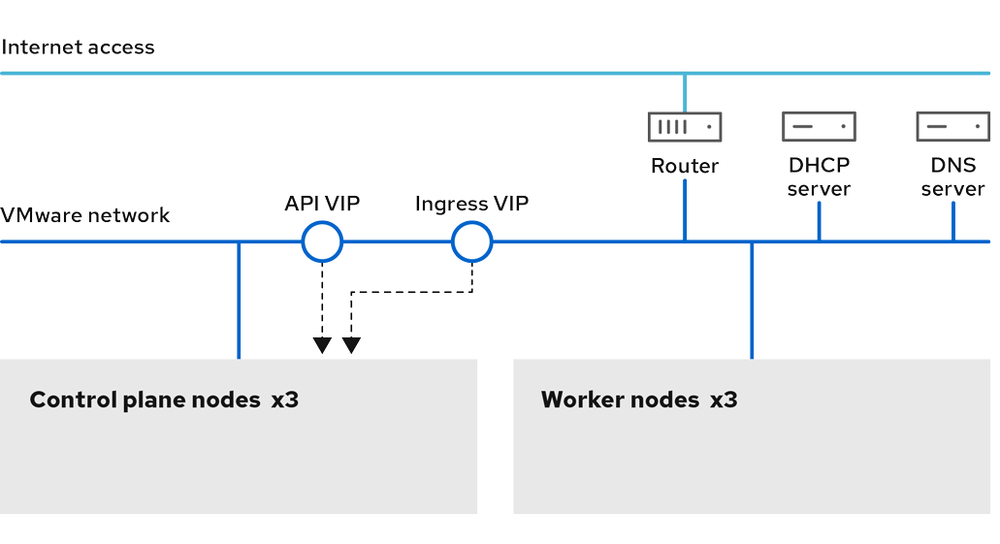

# Installing a cluster on vSphere with customizations { #installing-vsphere-installer-provisioned-customizations }

In OpenShift Container Platform version 4.22, you can install a cluster on your VMware vSphere instance by using installer-provisioned infrastructure with customizations, including network configuration options. In each, you modify parameters in the `install-config.yaml` file before you install the cluster.

By customizing your network configuration, your cluster can coexist with existing IP address allocations in your environment and integrate with existing MTU and VXLAN configurations.

You must set most of the network configuration parameters during installation, and you can modify only `kubeProxy` configuration parameters in a running cluster.

## Prerequisites { #prerequisites_installing-vsphere-installer-provisioned-customizations }

- You have completed the tasks in "Preparing to install a cluster using installer-provisioned infrastructure".

- You reviewed your vSphere platform licenses. Red Hat does not place any restrictions on your vSphere licenses, but some vSphere infrastructure components require licensing.

- You reviewed details about the OpenShift Container Platform installation and update processes.

- You read the documentation on selecting a cluster installation method and preparing it for users.

- You provisioned persistent storage for your cluster. To deploy a private image registry, your storage must provide `ReadWriteMany` access modes.

- The OpenShift Container Platform installer requires access to port 443 on the vCenter and ESXi hosts. You verified that port 443 is accessible.

- If you use a firewall, you confirmed with the administrator that port 443 is accessible. Control plane nodes must be able to reach vCenter and ESXi hosts on port 443 for the installation to succeed.

- If you use a firewall, you configured it to allow the sites that your cluster requires access to.

    !!! note

        Be sure to also review this site list if you are configuring a proxy.

## Internet access for OpenShift Container Platform { #cluster-entitlements_installing-vsphere-installer-provisioned-customizations }

In OpenShift Container Platform 4.22, you require access to the internet to install your cluster.

You must have internet access to perform the following actions:

- Access Red Hat Hybrid Cloud Console to download the installation program and perform subscription management. If the cluster has internet access and you do not disable Telemetry, that service automatically entitles your cluster.
- Access Quay.io to obtain the packages that are required to install your cluster.
- Obtain the packages that are required to perform cluster updates.

!!! warning

    If your cluster cannot have direct internet access, you can perform a restricted network installation on some types of infrastructure that you provision. During that process, you download the required content and use it to populate a mirror registry with the installation packages. With some installation types, the environment that you install your cluster in will not require internet access. Before you update the cluster, you update the content of the mirror registry.

## VMware vSphere region and zone enablement { #installation-vsphere-regions-zones_installing-vsphere-installer-provisioned-customizations }

You can deploy an OpenShift Container Platform cluster to multiple vSphere data centers. Each data center can run multiple clusters. This configuration reduces the risk of a hardware failure or network outage that can cause your cluster to fail. 

To enable regions and zones, you must define multiple failure domains for your OpenShift Container Platform cluster.

!!! warning

    The VMware vSphere region and zone enablement feature requires the vSphere Container Storage Interface (CSI) driver as the default storage driver in the cluster. As a result, the feature is only available on a newly installed cluster.

    For a cluster that was upgraded from a previous release, you must enable CSI automatic migration for the cluster. You can then configure multiple regions and zones for the upgraded cluster.

The default installation configuration deploys a cluster to a single vSphere data center. If you want to deploy a cluster to multiple vSphere data centers, you must create an installation configuration file that enables the region and zone feature.

The default `install-config.yaml` file includes `vcenters` and `failureDomains` fields, where you can specify multiple vSphere data centers and clusters for your OpenShift Container Platform cluster. You can use the default `failureDomains` from `install-config.yaml` if you want to install an OpenShift Container Platform cluster in a vSphere environment that consists of single data center.

The following list describes terms associated with defining zones and regions for your cluster:

- Failure domain: Establishes the relationships between a region and zone. You define a failure domain by using vCenter objects, such as a `datastore` object. A failure domain defines the vCenter location for OpenShift Container Platform cluster nodes.
- Region: Specifies a vCenter data center. You define a region by using a tag from the  `openshift-region` tag category.
- Zone: Specifies a vCenter cluster. You define a zone by using a tag from the `openshift-zone` tag category.

!!! note

    If you plan on specifying more than one failure domain in your `install-config.yaml` file, you must create tag categories, zone tags, and region tags in advance of creating the configuration file.

You must create a vCenter tag for each vCenter data center, which represents a region. Additionally, you must create a vCenter tag for each cluster than runs in a data center, which represents a zone. After you create the tags, you must attach each tag to their respective data centers and clusters.

The following table outlines an example of the relationship among regions, zones, and tags for a configuration with multiple vSphere data centers running in a single VMware vCenter.

<table>
<thead>
<tr>
  <th>Data center (region)</th>
  <th>Cluster (zone)</th>
  <th>Tags</th>
</tr>
</thead>
<tbody>
<tr>
  <td rowspan="4">us-east</td>
  <td rowspan="2">us-east-1</td>
  <td>us-east-1a</td>
</tr>
<tr>
  <td>us-east-1b</td>
</tr>
<tr>
  <td rowspan="2">us-east-2</td>
  <td>us-east-2a</td>
</tr>
<tr>
  <td>us-east-2b</td>
</tr>
<tr>
  <td rowspan="4">us-west</td>
  <td rowspan="2">us-west-1</td>
  <td>us-west-1a</td>
</tr>
<tr>
  <td>us-west-1b</td>
</tr>
<tr>
  <td rowspan="2">us-west-2</td>
  <td>us-west-2a</td>
</tr>
<tr>
  <td>us-west-2b</td>
</tr>
</tbody>
</table>


## VMware vSphere host group enablement { #installation-vsphere-regions-zones-host-groups_installing-vsphere-installer-provisioned-customizations }

When deploying an OpenShift Container Platform cluster to VMware vSphere, you can map your vSphere host groups onto OpenShift Container Platform failure domains. This is useful if you are using a stretched cluster configuration, where ESXi hosts are grouped into host groups by physical location.

To enable this feature, you must meet the following requirements:

- You must arrange your ESXi hosts into host groups.
- You must create a vCenter tag in the `openshift-region` tag category for your cluster. After you create the tag, you must attach the tag to the cluster.
- You must create a vCenter tag in the `openshift-zone` tag category for each host group and then attach the correct tag to each ESXi host.
- You must define multiple failure domains for your OpenShift Container Platform cluster in the `install-config.yaml` file.
- You must grant the `Host.Inventory.EditCluster` privilege on the vSphere vCenter cluster object.

Review the following key terms, which correspond to parameters in your `install-config.yaml` file that you must configure to enable this feature:

- Failure domain: Specifies the relationships between regions and zones in OpenShift Container Platform, and clusters and host groups in vSphere. You define a failure domain by using vCenter objects, such as a `datastore` object. A failure domain defines the vCenter location for OpenShift Container Platform cluster nodes.
- Region: Specifies a vCenter cluster. You define a region by using a tag from the `openshift-region` tag category.
- Zone: Specifies a vCenter host group. You define a zone by using a tag from the `openshift-zone` tag category.
- Region type: Specifies the `ComputeCluster` region type to enable this feature.
- Zone type: Specifies the `HostGroup` zone type to enable this feature.

**Additional resources**

- [Additional VMware vSphere configuration parameters](../installation-config-parameters-vsphere.md#installation-configuration-parameters-additional-vsphere_installation-config-parameters-vsphere)
- [Deprecated VMware vSphere configuration parameters](../installation-config-parameters-vsphere.md#deprecated-parameters-vsphere_installation-config-parameters-vsphere)
- [vSphere automatic migration](../../../storage/container_storage_interface/persistent-storage-csi-migration.md#persistent-storage-csi-migration-sc-vsphere_persistent-storage-csi-migration)
- [VMware vSphere CSI Driver Operator](../../../storage/container_storage_interface/persistent-storage-csi-vsphere.md#persistent-storage-csi-vsphere-top-aware_persistent-storage-csi-vsphere)

## Creating the installation configuration file { #installation-initializing_installing-vsphere-installer-provisioned-customizations }

You can customize the OpenShift Container Platform cluster you install on VMware vSphere.

**Prerequisites**

- You have the OpenShift Container Platform installation program and the pull secret for your cluster.

**Procedure**

1. Create the `install-config.yaml` file.

    1. Change to the directory that contains the installation program and run the following command:

        ```terminal
        $ ./openshift-install create install-config --dir <installation_directory>
        ```

        - `<installation_directory>`: For `<installation_directory>`, specify the directory name to store the files that the installation program creates.

            When specifying the directory:

        - Verify that the directory has the `execute` permission. This permission is required to run Terraform binaries under the installation directory.

        - Use an empty directory. Some installation assets, such as bootstrap X.509 certificates, have short expiration intervals, therefore you must not reuse an installation directory. If you want to reuse individual files from another cluster installation, you can copy them into your directory. However, the file names for the installation assets might change between releases. Use caution when copying installation files from an earlier OpenShift Container Platform version.

    2. At the prompts, provide the configuration details for your cloud:

        1. Optional: Select an SSH key to use to access your cluster machines.

            !!! note

                For production OpenShift Container Platform clusters on which you want to perform installation debugging or disaster recovery, specify an SSH key that your `ssh-agent` process uses.

        2. Select **vsphere** as the platform to target.

        3. Specify the name of your vCenter instance.

        4. Specify the user name and password for the vCenter account that has the required permissions to create the cluster.

            The installation program connects to your vCenter instance.

        5. Select the data center in your vCenter instance to connect to.

            !!! note

                After you create the installation configuration file, you can modify the file to create a multiple vSphere data center environment. This means that you can deploy an OpenShift Container Platform cluster to multiple vSphere data centers. For more information about creating this environment, see the section named *VMware vSphere region and zone enablement*.

        6. Select the default vCenter datastore to use.

            !!! warning

                You can specify the path of any datastore that exists in a datastore cluster. By default, Storage Distributed Resource Scheduler (SDRS), which uses Storage vMotion, is automatically enabled for a datastore cluster. Red Hat does not support Storage vMotion, so you must disable Storage DRS to avoid data loss issues for your OpenShift Container Platform cluster.

                You cannot specify more than one datastore path. If you must specify VMs across multiple datastores, use a `datastore` object to specify a failure domain in your cluster’s `install-config.yaml` configuration file. For more information, see "VMware vSphere region and zone enablement".

        7. Select the vCenter cluster to install the OpenShift Container Platform cluster in. The installation program uses the root resource pool of the vSphere cluster as the default resource pool.

        8. Select the network in the vCenter instance that contains the virtual IP addresses and DNS records that you configured.

        9. Enter the virtual IP address that you configured for control plane API access.

        10. Enter the virtual IP address that you configured for cluster ingress.

        11. Enter the base domain. This base domain must be the same one that you used in the DNS records that you configured.

        12. Enter a descriptive name for your cluster.

        The cluster name you enter must match the cluster name you specified when configuring the DNS records.

2. Modify the `install-config.yaml` file. You can find more information about the available parameters in the "Installation configuration parameters" section.

    !!! note

        If you are installing a three-node cluster, be sure to set the `compute.replicas` parameter to `0`. This ensures that the cluster’s control planes are schedulable. For more information, see "Installing a three-node cluster on vSphere".

3. Back up the `install-config.yaml` file so that you can use it to install multiple clusters.

    !!! warning

        The `install-config.yaml` file is consumed during the installation process. If you want to reuse the file, you must back it up now.

**Additional resources**

- [Installation configuration parameters](../installation-config-parameters-vsphere.md#installation-config-parameters-vsphere)

### Sample install-config.yaml file for a VMware vSphere cluster { #installation-vsphere-config-yaml_installing-vsphere-installer-provisioned-customizations }

You can customize the `install-config.yaml` file to specify more details about your OpenShift Container Platform cluster’s platform or change the values of the required parameters.

!!! warning

    Carefully review the "Installation configuration parameters for vSphere" page for detailed parameter explanations.

```yaml
apiVersion: v1
baseDomain: example.com
metadata:
  name: test
sshKey: ssh-ed25519 AAAA...
compute:
- name:  <worker_name>
  platform: {}
  replicas: 3
controlPlane:
  name: <control_plane_name>
  platform: {}
  replicas: 3
networking:
  clusterNetwork:
  - cidr: 10.128.0.0/14
    hostPrefix: 23
platform:
  vsphere:
    apiVIPs:
    - 10.0.0.1
    ingressVIPs:
    - 10.0.0.2
    failureDomains:
    - name: <failure_domain_name>
      region: <default_region_name>
      server: <fully_qualified_domain_name>
      topology:
        computeCluster: "/<data_center>/host/<cluster>"
        datacenter: <data_center>
        datastore: "/<data_center>/datastore/<datastore>"
        networks:
        - <VM_Network_name>
      zone: <default_zone_name>
    vcenters:
    - datacenters:
      - <data_center>
      server: <fully_qualified_domain_name>
      user: administrator@vsphere.local
```

where:

`compute`
:   Specifes the parameters that apply to compute nodes.

`controlPlane`
:   Specifies the parameters that apply to control plane nodes.

`networking`
:   Specifies the parameters that apply to cluster networking configuration.

`platform`
:   Specifies the parameters that apply to the configuration of the platform hosting the cluster.

### Configuring the cluster-wide proxy during installation { #installation-configure-proxy_installing-vsphere-installer-provisioned-customizations }

Production environments can deny direct access to the internet and instead have an HTTP or HTTPS proxy available. You can configure a new OpenShift Container Platform cluster to use a proxy by configuring the proxy settings in the `install-config.yaml` file.

**Prerequisites**

- You have an existing `install-config.yaml` file.

- You have reviewed the sites that your cluster requires access to and determined whether any of them need to bypass the proxy. By default, the proxy handles all cluster egress traffic, including calls to hosting cloud provider APIs. You added sites to the `Proxy` object’s `spec.noProxy` field to bypass the proxy if necessary.

    !!! note

        The `Proxy` object `status.noProxy` field includes the values of the `networking.machineNetwork[].cidr`, `networking.clusterNetwork[].cidr`, and `networking.serviceNetwork[]` fields from your installation configuration.

        For installations on Amazon Web Services (AWS), Google Cloud, Microsoft Azure, and Red Hat OpenStack Platform (RHOSP), the `Proxy` object `status.noProxy` field also includes the instance metadata endpoint (`169.254.169.254`).

**Procedure**

1. Edit your `install-config.yaml` file and add the proxy settings. For example:

    ```yaml
    apiVersion: v1
    baseDomain: my.domain.com
    proxy:
      httpProxy: http://<username>:<pswd>@<ip>:<port>
      httpsProxy: https://<username>:<pswd>@<ip>:<port>
      noProxy: example.com
    additionalTrustBundle: |
        -----BEGIN CERTIFICATE-----
        <MY_TRUSTED_CA_CERT>
        -----END CERTIFICATE-----
    additionalTrustBundlePolicy: <policy_to_add_additionalTrustBundle>
    # ...
    ```

    where:

    `proxy.httpProxy`
    :   Specifies a proxy URL to use for creating HTTP connections outside the cluster. The URL scheme must be `http`.

    `proxy.httpsProxy`
    :   Specifies a proxy URL to use for creating HTTPS connections outside the cluster.

    `proxy.noProxy`
    :   Specifies a comma-separated list of destination domain names, IP addresses, or other network CIDRs to exclude from proxying. Preface a domain with `.` to match subdomains only. For example, `.y.com` matches `x.y.com`, but not `y.com`. Use `*` to bypass the proxy for all destinations. You must include vCenter’s IP address and the IP range that you use for its machines.

    `additionalTrustBundle`
    :   If you specify this value, the installation program generates a config map named `user-ca-bundle` in the `openshift-config` namespace to hold the additional CA certificates. If you specify `additionalTrustBundle` and at least one proxy setting, the `Proxy` object references the `user-ca-bundle` config map in the `trustedCA` field. The Cluster Network Operator then creates a `trusted-ca-bundle` config map that merges the contents specified for the `trustedCA` parameter with the RHCOS trust bundle. You must set the `additionalTrustBundle` field unless an authority from the RHCOS trust bundle signs the proxy’s identity certificate.

    `additionalTrustBundlePolicy`
    :   Specifies the policy that determines the configuration of the `Proxy` object to reference the `user-ca-bundle` config map in the `trustedCA` field. The allowed values are `Proxyonly` and `Always`. Use `Proxyonly` to reference the `user-ca-bundle` config map only when you configure an `http/https` proxy. Use `Always` to always reference the `user-ca-bundle` config map. The default value is `Proxyonly`. Optional parameter.

    !!! note

        The installation program does not support the proxy `readinessEndpoints` field.

    !!! note

        If the installation program times out, restart and then complete the deployment by using the `wait-for` command of the installation program. For example:

        ```terminal
        $ ./openshift-install wait-for install-complete --log-level debug
        ```

2. Save the file and reference it when installing OpenShift Container Platform.

    The installation program creates a cluster-wide proxy named `cluster` that uses the proxy settings in the `install-config.yaml` file. If you do not give proxy settings, the installation program still creates a `cluster` `Proxy` object, but it has a nil `spec`.

    !!! note

        Only the `Proxy` object named `cluster` is supported, and you cannot create additional proxies.

### Deploying IP addressing with dual-stack networking { #modifying-install-config-for-dual-stack-network_installing-vsphere-installer-provisioned-customizations }

When deploying IP addressing with dual-stack networking for the bootstrap virtual machine (VM), the bootstrap VM functions with a single IP version.

!!! note

    The following examples are for DHCP. DHCP-based dual stack clusters can deploy with one IPv4 and one IPv6 virtual IP address (VIP) each from Day 1.

    Deploying a cluster with static IP addresses involves configuring IP addresses for the bootstrap VM, API, and ingress VIPs. Configuring dual-stack with a static IP set in `install-config` requires one VIP each for API and ingress. Add secondary VIPs after deployment.

For dual-stack networking in OpenShift Container Platform clusters, you can configure IPv4 and IPv6 address endpoints for cluster nodes. To configure IPv4 and IPv6 address endpoints for cluster nodes, edit the `machineNetwork`, `clusterNetwork`, and `serviceNetwork` configuration settings in the `install-config.yaml` file. Each setting must have two CIDR entries each. For a cluster with the IPv4 family as the primary address family, specify the IPv4 setting first. For a cluster with the IPv6 family as the primary address family, specify the IPv6 setting first.

```yaml
machineNetwork:
- cidr: {{ extcidrnet }}
- cidr: {{ extcidrnet6 }}
clusterNetwork:
- cidr: 10.128.0.0/14
  hostPrefix: 23
- cidr: fd02::/48
  hostPrefix: 64
serviceNetwork:
- 172.30.0.0/16
- fd03::/112
```

!!! warning

    On a bare metal platform, if you specified an NMState configuration in the `networkConfig` section of your `install-config.yaml` file, add `interfaces.wait-ip: ipv4+ipv6` to the NMState YAML file to resolve an issue that prevents your cluster from deploying on a dual-stack network.

    ```yaml title="Example NMState YAML configuration file that includes the wait-ip parameter"
    networkConfig:
      nmstate:
        interfaces:
        - name: <interface_name>
    # ...
          wait-ip: ipv4+ipv6
    # ...
    ```

To provide an interface to the cluster for applications that use IPv4 and IPv6 addresses, configure IPv4 and IPv6 virtual IP (VIP) address endpoints for the Ingress VIP and API VIP services. To configure IPv4 and IPv6 address endpoints, edit the `apiVIPs` and `ingressVIPs` configuration settings in the `install-config.yaml` file . The `apiVIPs` and `ingressVIPs` configuration settings use a list format. The order of the list indicates the primary and secondary VIP address for each service.

```yaml
platform:
  baremetal:
    apiVIPs:
      - <api_ipv4>
      - <api_ipv6>
    ingressVIPs:
      - <wildcard_ipv4>
      - <wildcard_ipv6>
```

!!! note

    For a cluster with dual-stack networking configuration, you must assign both IPv4 and IPv6 addresses to the same interface.

### Configuring regions and zones for a VMware vCenter { #configuring-vsphere-regions-zones_installing-vsphere-installer-provisioned-customizations }

You can modify the default installation configuration file, so that you can deploy an OpenShift Container Platform cluster to multiple vSphere data centers.

The default `install-config.yaml` file configuration from the previous release of OpenShift Container Platform is deprecated. You can continue to use the deprecated default configuration, but the `openshift-installer` will prompt you with a warning message that indicates the use of deprecated fields in the configuration file.

**Prerequisites**

- You have an existing `install-config.yaml` installation configuration file.

    !!! warning

        You must specify at least one failure domain for your OpenShift Container Platform cluster, so that you can provision data center objects for your VMware vCenter server. Consider specifying multiple failure domains if you need to provision virtual machine nodes in different data centers, clusters, datastores, and other components. To enable regions and zones, you must define multiple failure domains for your OpenShift Container Platform cluster.

- You have installed the `govc` command line tool.

    !!! warning

        The example uses the `govc` command. The `govc` command is an open source command available from VMware; it is not available from Red Hat. The Red Hat support team does not maintain the `govc` command. Instructions for downloading and installing `govc` are found on the VMware documentation website.

**Procedure**

1. Create the `openshift-region` and `openshift-zone` vCenter tag categories by running the following commands:

    !!! warning

        If you specify different names for the `openshift-region` and `openshift-zone` vCenter tag categories, the installation of the OpenShift Container Platform cluster fails.

    ```terminal
    $ govc tags.category.create -d "OpenShift region" openshift-region
    ```

    ```terminal
    $ govc tags.category.create -d "OpenShift zone" openshift-zone
    ```

2. For each region where you want to deploy your cluster, create a region tag by running the following command:

    ```terminal
    $ govc tags.create -c <region_tag_category> <region_tag>
    ```

3. For each zone where you want to deploy your cluster, create a zone tag by running the following command:

    ```terminal
    $ govc tags.create -c <zone_tag_category> <zone_tag>
    ```

4. Attach region tags to each vCenter data center object by running the following command:

    ```terminal
    $ govc tags.attach -c <region_tag_category> <region_tag_1> /<data_center_1>
    ```

5. Attach the zone tags to each vCenter cluster object by running the following command:

    ```terminal
    $ govc tags.attach -c <zone_tag_category> <zone_tag_1> /<data_center_1>/host/<cluster1>
    ```

6. Change to the directory that contains the installation program and initialize the cluster deployment according to your chosen installation requirements.

    ```yaml title="Sample install-config.yaml file with multiple data centers defined in a vSphere center"
    # ...
    compute:
    ---
      vsphere:
          zones:
            - "<machine_pool_zone_1>"
            - "<machine_pool_zone_2>"
    # ...
    controlPlane:
    # ...
    vsphere:
          zones:
            - "<machine_pool_zone_1>"
            - "<machine_pool_zone_2>"
    # ...
    platform:
      vsphere:
        vcenters:
    # ...
        datacenters:
          - <data_center_1_name>
          - <data_center_2_name>
        failureDomains:
        - name: <machine_pool_zone_1>
          region: <region_tag_1>
          zone: <zone_tag_1>
          server: <fully_qualified_domain_name>
          topology:
            datacenter: <data_center_1>
            computeCluster: "/<data_center_1>/host/<cluster1>"
            networks:
            - <VM_Network1_name>
            datastore: "/<data_center_1>/datastore/<datastore1>"
            resourcePool: "/<data_center_1>/host/<cluster1>/Resources/<resourcePool1>"
            folder: "/<data_center_1>/vm/<folder1>"
        - name: <machine_pool_zone_2>
          region: <region_tag_2>
          zone: <zone_tag_2>
          server: <fully_qualified_domain_name>
          topology:
            datacenter: <data_center_2>
            computeCluster: "/<data_center_2>/host/<cluster2>"
            networks:
            - <VM_Network2_name>
            datastore: "/<data_center_2>/datastore/<datastore2>"
            resourcePool: "/<data_center_2>/host/<cluster2>/Resources/<resourcePool2>"
            folder: "/<data_center_2>/vm/<folder2>"
    # ...
    ```

### Configuring host groups for a VMware vCenter { #configuring-vsphere-host-groups_installing-vsphere-installer-provisioned-customizations }

You can modify the default installation configuration file to deploy an OpenShift Container Platform cluster on a VMware vSphere stretched cluster, where ESXi hosts are grouped into host groups by physical location.

The default `install-config.yaml` file configuration from previous releases of OpenShift Container Platform is deprecated. Though you can still use it, the OpenShift Container Platform installer will display a warning message that indicates the use of deprecated fields in the configuration file.

**Prerequisites**

- You have an existing `install-config.yaml` installation configuration file.

- You have arranged your ESXi hosts into host groups.

- You have granted the `Host.Inventory.EditCluster` privilege on the vSphere vCenter cluster object.

- You have downloaded and installed the `govc` command line tool. Instructions can be found on the VMware documentation website. Note that `govc` is an open-source tool that is not maintained by the Red Hat support team.

    !!! warning

        To enable host group support, you must define multiple failure domains for your OpenShift Container Platform cluster.

**Procedure**

1. Create the `openshift-region` and `openshift-zone` vCenter tag categories by running the following commands:

    !!! warning

        If you specify different names for the `openshift-region` and `openshift-zone` vCenter tag categories, the installation of the OpenShift Container Platform cluster fails.

    ```terminal
    $ govc tags.category.create -d "OpenShift region" openshift-region
    ```

    ```terminal
    $ govc tags.category.create -d "OpenShift zone" openshift-zone
    ```

2. Create a region tag for the vSphere cluster where you want to deploy your OpenShift Container Platform cluster by entering the following command:

    ```terminal
    $ govc tags.create -c <region_tag_category> <region_tag>
    ```

3. Create a zone tag for each host group by entering the following command as needed:

    ```terminal
    $ govc tags.create -c <zone_tag_category> <zone_tag>
    ```

4. Attach the region tag to the vCenter cluster object by entering the following command:

    ```terminal
    $ govc tags.attach -c <region_tag_category> <region_tag_1> /<datacenter_1>/host/<cluster_1>
    ```

5. Use zone tags to associate each ESXi host with its host group, by entering the following command for each ESXi host:

    ```terminal
    $ govc tags.attach -c <zone_tag_category> <zone_tag_for_host_group_1> /<datacenter_1>/host/<cluster_1>/<esxi_host_in_host_group_1>
    ```

6. Change to the directory that contains the installation program and initialize the cluster deployment according to your chosen installation requirements.

    ```yaml title="Sample install-config.yaml file with multiple host groups"
    platform:
      vsphere:
        vcenters:
    # ...
        datacenters:
          - <data_center_1_name>
        failureDomains:
        - name: <host_group_1>
          region: <cluster_1_region_tag>
          zone: <host_group_1_zone_tag>
          regionType: "ComputeCluster"
          zoneType: "HostGroup"
          server: <fully_qualified_domain_name>
          topology:
            datacenter: <data_center_1>
            computeCluster: "/<data_center_1>/host/<cluster_1>"
            networks:
            - <VM_Network1_name>
            hostGroup: <host_group_1_name>
            datastore: "/<data_center_1>/datastore/<datastore_1>"
            resourcePool: "/<data_center_1>/host/<cluster_1>/Resources/<resourcePool_1>"
            folder: "/<data_center_1>/vm/<folder_1>"
        - name: <host_group_2>
          region: <cluster_1_region_tag>
          zone: <host_group_2_zone_tag>
          regionType: "ComputeCluster"
          zoneType: "HostGroup"
          server: <fully_qualified_domain_name>
          topology:
            datacenter: <data_center_1>
            computeCluster: "/<data_center_1>/host/<cluster_1>"
            networks:
            - <VM_Network1_name>
            hostGroup: <host_group_2_name>
            datastore: "/<data_center_1>/datastore/<datastore_1>"
            resourcePool: "/<data_center_1>/host/<cluster_1>/Resources/<resourcePool_1>"
            folder: "/<data_center_1>/vm/<folder_1>"
    ```

### Configuring multiple NICs { #installation-vsphere-multiple-nics_installing-vsphere-installer-provisioned-customizations }

For scenarios requiring multiple network interface controller (NIC), you can configure multiple network adapters per node.

**Procedure**

1. Specify the network adapter names in the networks section of `platform.vsphere.failureDomains[*].topology` as shown in the following `install-config.yaml` file:

    ```yaml
    platform:
      vsphere:
        vcenters:
          ...
        failureDomains:
        - name: <failure_domain_name>
          region: <default_region_name>
          zone: <default_zone_name>
          server: <fully_qualified_domain_name>
          topology:
            datacenter: <data_center>
            computeCluster: "/<data_center>/host/<cluster>"
            networks:
            - <VM_network1_name>
            - <VM_network2_name>
            - ...
            - <VM_network10_name>
    ```

    Where the `networks` section is a list that you populate with network adapter names. You can specify up to 10 network adapters.

2. Specify at least one of the following configurations in the `install-config.yaml` file:

    - `networking.machineNetwork`

        ```yaml title="Example configuration"
        networking:
          ...
          machineNetwork:
          - cidr: 10.0.0.0/16
          ...
        ```

        !!! note

            The `networking.machineNetwork.cidr` field must correspond to an address on the first adapter defined in `topology.networks`.

    - Add a `nodeNetworking` object to the `install-config.yaml` file and specify internal and external network subnet CIDR implementations for the object.

        ```yaml title="Example configuration"
        platform:
          vsphere:
            nodeNetworking:
             external:
               networkSubnetCidr:
               - <machine_network_cidr_ipv4>
               - <machine_network_cidr_ipv6>
             internal:
               networkSubnetCidr:
               - <machine_network_cidr_ipv4>
               - <machine_network_cidr_ipv6>
            failureDomains:
            - name: <failure_domain_name>
              region: <default_region_name>
        ```

**Additional resources**

- [Network configuration parameters](../installation-config-parameters-vsphere.md#installation-configuration-parameters-network_installation-config-parameters-vsphere)

## Network configuration phases { #nw-network-config_installing-vsphere-installer-provisioned-customizations }

There are two phases prior to OpenShift Container Platform installation where you can customize the network configuration. Customize settings in the `install-config.yaml` file and in the Cluster Network Operator manifest across two configuration phases.

Phase 1
:   You can customize the following network-related fields in the `install-config.yaml` file before you create the manifest files:

    - `networking.networkType`
    - `networking.clusterNetwork`
    - `networking.serviceNetwork`
    - `networking.machineNetwork`
    - `nodeNetworking`

    For more information, see "Installation configuration parameters".

    !!! note

        Set the `networking.machineNetwork` to match the Classless Inter-Domain Routing (CIDR) where the preferred subnet is located.

    !!! warning

        The CIDR range `172.17.0.0/16` is reserved by `libVirt`. You cannot use any other CIDR range that overlaps with the `172.17.0.0/16` CIDR range for networks in your cluster.

Phase 2
:   After creating the manifest files by running `openshift-install create manifests`, you can define a customized Cluster Network Operator manifest with only the fields you want to modify. You can use the manifest to specify an advanced network configuration.

During phase 2, you cannot override the values that you specified in phase 1 in the `install-config.yaml` file. However, you can customize the network plugin during phase 2.

## Specifying advanced network configuration { #modifying-nwoperator-config-startup_installing-vsphere-installer-provisioned-customizations }

To integrate your OpenShift Container Platform cluster with your existing network environment, you can specify advanced network configuration in a manifest before you install the cluster. Advanced network configuration can be configured only during cluster installation.

!!! warning

    Customizing your network configuration by modifying the OpenShift Container Platform manifest files created by the installation program is not supported. Applying a manifest file that you create, as in the following procedure, is supported.

**Prerequisites**

- You have created the `install-config.yaml` file and completed any modifications to it.

**Procedure**

1. Change to the directory that contains the installation program and create the manifests:

    ```terminal
    $ ./openshift-install create manifests --dir <installation_directory>
    ```

    The `<installation_directory>` specifies the name of the directory that contains the `install-config.yaml` file for your cluster.

2. Create a stub manifest file for the advanced network configuration that is named `cluster-network-03-config.yml` in the `<installation_directory>/manifests/` directory:

    ```yaml
    apiVersion: operator.openshift.io/v1
    kind: Network
    metadata:
      name: cluster
    spec:
    ```

3. Specify the advanced network configuration for your cluster in the `cluster-network-03-config.yml` file, such as in the following example:

    ```yaml title="Enable IPsec for the OVN-Kubernetes network provider"
    apiVersion: operator.openshift.io/v1
    kind: Network
    metadata:
      name: cluster
    spec:
      defaultNetwork:
        ovnKubernetesConfig:
          ipsecConfig:
            mode: Full
    ```

4. Optional: Back up the `manifests/cluster-network-03-config.yml` file. The installation program consumes the `manifests/` directory when you create the Ignition config files.

### Specifying multiple subnets for your network { #nw-operator-vsphere-multiple-subnets_installing-vsphere-installer-provisioned-customizations }

Before you install an OpenShift Container Platform cluster on a vSphere host, you can specify multiple subnets for a networking implementation so that the vSphere cloud controller manager (CCM) can select the appropriate subnet for a given networking situation. vSphere can use the subnet for managing pods and services on your cluster.

For this configuration, you must specify internal and external Classless Inter-Domain Routing (CIDR) implementations in the vSphere CCM configuration. Each CIDR implementation lists an IP address range that the CCM uses to decide what subnets interact with traffic from internal and external networks.

!!! warning

    Failure to configure internal and external CIDR implementations in the vSphere CCM configuration can cause the vSphere CCM to select the wrong subnet. This situation causes the following error:

    ```
    ERROR Bootstrap failed to complete: timed out waiting for the condition
    ERROR Failed to wait for bootstrapping to complete. This error usually happens when there is a problem with control plane hosts that prevents the control plane operators from creating the control plane.
    ```

    This configuration can cause new nodes that associate with a `MachineSet` object with a single subnet to become unusable as each new node receives the `node.cloudprovider.kubernetes.io/uninitialized` taint. These situations can cause communication issues with the Kubernetes API server that can cause installation of the cluster to fail.

**Prerequisites**

- You created Kubernetes manifest files for your OpenShift Container Platform cluster.

**Procedure**

1. From the directory where you store your OpenShift Container Platform cluster manifest files, open the `manifests/cluster-infrastructure-02-config.yml` manifest file.

2. Add a `nodeNetworking` object to the file and specify internal and external network subnet CIDR implementations for the object.

    !!! tip

        For most networking situations, consider setting the standard multiple-subnet configuration. This configuration requires that you set the same IP address ranges in the `nodeNetworking.internal.networkSubnetCidr` and `nodeNetworking.external.networkSubnetCidr` parameters.

    ```yaml title="Example of a configured cluster-infrastructure-02-config.yml manifest file"
    apiVersion: config.openshift.io/v1
    kind: Infrastructure
    metadata:
      name: cluster
    spec:
      cloudConfig:
        key: config
        name: cloud-provider-config
      platformSpec:
        type: VSphere
        vsphere:
          failureDomains:
          - name: generated-failure-domain
          ...
           nodeNetworking:
             external:
               networkSubnetCidr:
               - <machine_network_cidr_ipv4>
               - <machine_network_cidr_ipv6>
             internal:
               networkSubnetCidr:
               - <machine_network_cidr_ipv4>
               - <machine_network_cidr_ipv6>
    # ...
    ```

**Additional resources**

- [`.spec.platformSpec.vsphere.nodeNetworking`](../../../rest_api/config_apis/infrastructure-config-openshift-io-v1.md#spec-platformspec-vsphere-nodenetworking)

## Cluster Network Operator configuration { #nw-operator-cr_installing-vsphere-installer-provisioned-customizations }

To manage cluster networking, configure the Cluster Network Operator (CNO) `Network` custom resource (CR) named `cluster` so the cluster uses the correct IP ranges and network plugin settings for reliable pod and service connectivity. Some settings and fields are inherited at the time of install or by the `default.Network.type` plugin, OVN-Kubernetes.

The CNO configuration inherits the following fields during cluster installation from the `Network` API in the `Network.config.openshift.io` API group:

`clusterNetwork`
:   IP address pools from which pod IP addresses are allocated.

`serviceNetwork`
:   IP address pool for services.

`defaultNetwork.type`
:   Cluster network plugin. `OVNKubernetes` is the only supported plugin during installation.

You can specify the cluster network plugin configuration for your cluster by setting the fields for the `defaultNetwork` object in the CNO object named `cluster`.

### Cluster Network Operator configuration object { #nw-operator-cr-cno-object_installing-vsphere-installer-provisioned-customizations }

The fields for the Cluster Network Operator (CNO) are described in the following table:

**Cluster Network Operator configuration object**

<table>
<thead>
<tr>
  <th>Field</th>
  <th>Type</th>
  <th>Description</th>
</tr>
</thead>
<tbody>
<tr>
  <td><code>metadata.name</code></td>
  <td><code>string</code></td>
  <td>The name of the CNO object. This name is always <code>cluster</code>.</td>
</tr>
<tr>
  <td><code>spec.clusterNetwork</code></td>
  <td><code>array</code></td>
  <td>A list specifying the blocks of IP addresses from which pod IP addresses are allocated and the subnet prefix length assigned to each individual node in the cluster. If you use dual-stack networking, specify IPv4 and IPv6 address families. For example:<br><br><pre>spec:&#10;  clusterNetwork:&#10;  - cidr: 10.128.0.0/19&#10;    hostPrefix: 23&#10;  - cidr: fd01::/48&#10;    hostPrefix: 64</pre><br><br>If you install a cluster on AWS with dual-stack networking, the order of addresses must match the dual-stack configuration you selected. For example, if you specified the <code>DualStackIPv4Primary</code>, list the IPv4 address first.</td>
</tr>
<tr>
  <td><code>spec.serviceNetwork</code></td>
  <td><code>array</code></td>
  <td>A block of IP addresses for services. If you use dual-stack networking, specify IPv4 and IPv6 address families. For example:<br><br><pre>spec:&#10;  serviceNetwork:&#10;  - 172.30.0.0/14&#10;  - fd02::/112</pre><br><br>If you install a cluster on AWS with dual-stack networking, the order of addresses must match the dual-stack configuration you selected. For example, if you specified the <code>DualStackIPv4Primary</code>, list the IPv4 address first.<br><br>   You can customize this field only in the <code>install-config.yaml</code> file before you create the manifests. The value is read-only in the manifest file. </td>
</tr>
<tr>
  <td><code>spec.defaultNetwork</code></td>
  <td><code>object</code></td>
  <td>Configures the network plugin for the cluster network.</td>
</tr>
<tr>
  <td><code>spec.additionalRoutingCapabilities.providers</code></td>
  <td><code>array</code></td>
  <td>This setting enables a dynamic routing provider. The FRR routing capability provider is required for the route advertisement feature. The only supported value is <code>FRR</code>.<br><br><ul><li><code>FRR</code>: The FRR routing provider</li></ul><br><br><pre>spec:&#10;  additionalRoutingCapabilities:&#10;    providers:&#10;    - FRR</pre></td>
</tr>
</tbody>
</table>


!!! warning

    For a cluster that needs to deploy objects across multiple networks, ensure that you specify the same value for the `clusterNetwork.hostPrefix` parameter for each network type that is defined in the `install-config.yaml` file. Setting a different value for each `clusterNetwork.hostPrefix` parameter can impact the OVN-Kubernetes network plugin, where the plugin cannot effectively route object traffic among different nodes.

### defaultNetwork object configuration { #nw-operator-cr-defaultnetwork_installing-vsphere-installer-provisioned-customizations }

The values for the `defaultNetwork` object are defined in the following table:

**`defaultNetwork` object**

<table>
<thead>
<tr>
  <th>Field</th>
  <th>Type</th>
  <th>Description</th>
</tr>
</thead>
<tbody>
<tr>
  <td><code>type</code></td>
  <td><code>string</code></td>
  <td><code>OVNKubernetes</code>. The Red Hat OpenShift Networking network plugin is selected during installation. This value cannot be changed after cluster installation.<div class="admonition note"><p class="admonition-title">Note</p><p>OpenShift Container Platform uses the OVN-Kubernetes network plugin by default.</p></div></td>
</tr>
<tr>
  <td><code>ovnKubernetesConfig</code></td>
  <td><code>object</code></td>
  <td>This object is only valid for the OVN-Kubernetes network plugin.</td>
</tr>
</tbody>
</table>


### Configuration for the OVN-Kubernetes network plugin { #nw-operator-configuration-parameters-for-ovn-sdn_installing-vsphere-installer-provisioned-customizations }

The following table describes the configuration fields for the OVN-Kubernetes network plugin:

**`ovnKubernetesConfig` object**

<table>
<thead>
<tr>
  <th>Field</th>
  <th>Type</th>
  <th>Description</th>
</tr>
</thead>
<tbody>
<tr>
  <td><code>mtu</code></td>
  <td><code>integer</code></td>
  <td> The maximum transmission unit (MTU) for the Geneve (Generic Network Virtualization Encapsulation) overlay network. This is detected automatically based on the MTU of the primary network interface. You do not normally need to override the detected MTU.<br><br>If the auto-detected value is not what you expect it to be, confirm that the MTU on the primary network interface on your nodes is correct. You cannot use this option to change the MTU value of the primary network interface on the nodes.<br><br>If your cluster requires different MTU values for different nodes, you must set this value to <code>100</code> less than the lowest MTU value in your cluster. For example, if some nodes in your cluster have an MTU of <code>9001</code>, and some have an MTU of <code>1500</code>, you must set this value to <code>1400</code>.  </td>
</tr>
<tr>
  <td><code>genevePort</code></td>
  <td><code>integer</code></td>
  <td> The port to use for all Geneve packets. The default value is <code>6081</code>. This value cannot be changed after cluster installation.  </td>
</tr>
<tr>
  <td><code>ipsecConfig</code></td>
  <td><code>object</code></td>
  <td> Specify a configuration object for customizing the IPsec configuration.  </td>
</tr>
<tr>
  <td><code>ipv4</code></td>
  <td><code>object</code></td>
  <td>Specifies a configuration object for IPv4 settings.</td>
</tr>
<tr>
  <td><code>ipv6</code></td>
  <td><code>object</code></td>
  <td>Specifies a configuration object for IPv6 settings.</td>
</tr>
<tr>
  <td><code>policyAuditConfig</code></td>
  <td><code>object</code></td>
  <td>Specify a configuration object for customizing network policy audit logging. If unset, the defaults audit log settings are used.</td>
</tr>
<tr>
  <td><code>routeAdvertisements</code></td>
  <td><code>string</code></td>
  <td>Specifies whether to advertise cluster network routes. The default value is <code>Disabled</code>.<ul><li><code>Enabled</code>: Import routes to the cluster network and advertise cluster network routes as configured in <code>RouteAdvertisements</code> objects.</li><li><code>Disabled</code>: Do not import routes to the cluster network or advertise cluster network routes.</li></ul></td>
</tr>
<tr>
  <td><code>gatewayConfig</code></td>
  <td><code>object</code></td>
  <td>Optional: Specify a configuration object for customizing how egress traffic is sent to the node gateway. Valid values are <code>Shared</code> and <code>Local</code>. The default value is <code>Shared</code>. In the default setting, the Open vSwitch (OVS) outputs traffic directly to the node IP interface. If you are using hardware offloading, Red Hat recommends to use the default <code>Shared</code> gateway mode to bypass the host routing plane. In the <code>Local</code> setting, it traverses the host network; consequently, it gets applied to the routing table of the host.<br><br><div class="admonition note"><p class="admonition-title">Note</p><p>While migrating egress traffic, you can expect some disruption to workloads and service traffic until the Cluster Network Operator (CNO) successfully rolls out the changes.</p></div></td>
</tr>
</tbody>
</table>


**`ovnKubernetesConfig.ipv4` object**

<table>
<thead>
<tr>
  <th>Field</th>
  <th>Type</th>
  <th>Description</th>
</tr>
</thead>
<tbody>
<tr>
  <td><code>internalTransitSwitchSubnet</code></td>
  <td>string</td>
  <td>If your existing network infrastructure overlaps with the <code>100.88.0.0/16</code> IPv4 subnet, you can specify a different IP address range for internal use by OVN-Kubernetes. The subnet for the distributed transit switch that enables east-west traffic. This subnet cannot overlap with any other subnets used by OVN-Kubernetes or on the host itself. It must be large enough to accommodate one IP address per node in your cluster.<br><br>The default value is <code>100.88.0.0/16</code>.</td>
</tr>
<tr>
  <td><code>internalJoinSubnet</code></td>
  <td>string</td>
  <td>If your existing network infrastructure overlaps with the <code>100.64.0.0/16</code> IPv4 subnet, you can specify a different IP address range for internal use by OVN-Kubernetes. You must ensure that the IP address range does not overlap with any other subnet used by your OpenShift Container Platform installation. The IP address range must be larger than the maximum number of nodes that can be added to the cluster. For example, if the <code>clusterNetwork.cidr</code> value is <code>10.128.0.0/14</code> and the <code>clusterNetwork.hostPrefix</code> value is <code>/23</code>, then the maximum number of nodes is <code>2^(23-14)=512</code>.<br><br>The default value is <code>100.64.0.0/16</code>.</td>
</tr>
</tbody>
</table>


**`ovnKubernetesConfig.ipv6` object**

<table>
<thead>
<tr>
  <th>Field</th>
  <th>Type</th>
  <th>Description</th>
</tr>
</thead>
<tbody>
<tr>
  <td><code>internalTransitSwitchSubnet</code></td>
  <td>string</td>
  <td>If your existing network infrastructure overlaps with the <code>fd97::/64</code> IPv6 subnet, you can specify a different IP address range for internal use by OVN-Kubernetes. The subnet for the distributed transit switch that enables east-west traffic. This subnet cannot overlap with any other subnets used by OVN-Kubernetes or on the host itself. It must be large enough to accommodate one IP address per node in your cluster.<br><br>The default value is <code>fd97::/64</code>.</td>
</tr>
<tr>
  <td><code>internalJoinSubnet</code></td>
  <td>string</td>
  <td>If your existing network infrastructure overlaps with the <code>fd98::/64</code> IPv6 subnet, you can specify a different IP address range for internal use by OVN-Kubernetes. You must ensure that the IP address range does not overlap with any other subnet used by your OpenShift Container Platform installation. The IP address range must be larger than the maximum number of nodes that can be added to the cluster.<br><br>The default value is <code>fd98::/64</code>.</td>
</tr>
</tbody>
</table>


**`policyAuditConfig` object**

<table>
<thead>
<tr>
  <th>Field</th>
  <th>Type</th>
  <th>Description</th>
</tr>
</thead>
<tbody>
<tr>
  <td><code>rateLimit</code></td>
  <td>integer</td>
  <td>The maximum number of messages to generate every second per node. The default value is <code>20</code> messages per second.</td>
</tr>
<tr>
  <td><code>maxFileSize</code></td>
  <td>integer</td>
  <td>The maximum size for the audit log in bytes. The default value is <code>50000000</code> or 50 MB.</td>
</tr>
<tr>
  <td><code>maxLogFiles</code></td>
  <td>integer</td>
  <td>The maximum number of log files that are retained.</td>
</tr>
<tr>
  <td><code>destination</code></td>
  <td>string</td>
  <td>One of the following additional audit log targets:<br><br><dl><dt><code>libc</code></dt><dd>The libc <code>syslog()</code> function of the journald process on the host.</dd><dt><code>udp:&lt;host&gt;:&lt;port&gt;</code></dt><dd>A syslog server. Replace <code>&lt;host&gt;:&lt;port&gt;</code> with the host and port of the syslog server.</dd><dt><code>unix:&lt;file&gt;</code></dt><dd>A Unix Domain Socket file specified by <code>&lt;file&gt;</code>.</dd><dt><code>null</code></dt><dd>Do not send the audit logs to any additional target.</dd></dl></td>
</tr>
<tr>
  <td><code>syslogFacility</code></td>
  <td>string</td>
  <td>The syslog facility, such as <code>kern</code>, as defined by RFC5424. The default value is <code>local0</code>.</td>
</tr>
</tbody>
</table>


<a name="gatewayConfig-object_installing-vsphere-installer-provisioned-customizations"></a>

**`gatewayConfig` object**

<table>
<thead>
<tr>
  <th>Field</th>
  <th>Type</th>
  <th>Description</th>
</tr>
</thead>
<tbody>
<tr>
  <td><code>routingViaHost</code></td>
  <td><code>boolean</code></td>
  <td>Set this field to <code>true</code> to send egress traffic from pods to the host networking stack. For highly-specialized installations and applications that rely on manually configured routes in the kernel routing table, you might want to route egress traffic to the host networking stack. By default, egress traffic is processed in OVN to exit the cluster and is not affected by specialized routes in the kernel routing table. The default value is <code>false</code>.<br><br>This field has an interaction with the Open vSwitch hardware offloading feature. If you set this field to <code>true</code>, you do not receive the performance benefits of the offloading because egress traffic is processed by the host networking stack.</td>
</tr>
<tr>
  <td><code>ipForwarding</code></td>
  <td><code>object</code></td>
  <td>You can control IP forwarding for all traffic on OVN-Kubernetes managed interfaces by using the <code>ipForwarding</code> specification in the <code>Network</code> resource. Specify <code>Restricted</code> to only allow IP forwarding for Kubernetes related traffic. Specify <code>Global</code> to allow forwarding of all IP traffic. For new installations, the default is <code>Restricted</code>. For updates to OpenShift Container Platform 4.14 or later, the default is <code>Global</code>.<div class="admonition note"><p class="admonition-title">Note</p><p>The default value of <code>Restricted</code> sets the IP forwarding to drop.</p></div></td>
</tr>
<tr>
  <td><code>ipv4</code></td>
  <td><code>object</code></td>
  <td>Optional: Specify an object to configure the internal OVN-Kubernetes masquerade address for host to service traffic for IPv4 addresses.</td>
</tr>
<tr>
  <td><code>ipv6</code></td>
  <td><code>object</code></td>
  <td>Optional: Specify an object to configure the internal OVN-Kubernetes masquerade address for host to service traffic for IPv6 addresses.</td>
</tr>
</tbody>
</table>


<a name="gatewayconfig-ipv4-object_installing-vsphere-installer-provisioned-customizations"></a>

**`gatewayConfig.ipv4` object**

<table>
<thead>
<tr>
  <th>Field</th>
  <th>Type</th>
  <th>Description</th>
</tr>
</thead>
<tbody>
<tr>
  <td><code>internalMasqueradeSubnet</code></td>
  <td><code>string</code></td>
  <td>The masquerade IPv4 addresses that are used internally to enable host to service traffic. The host is configured with these IP addresses as well as the shared gateway bridge interface. The default value is <code>169.254.169.0/29</code>.<div class="admonition warning"><p class="admonition-title">Important</p><p>For OpenShift Container Platform 4.17 and later versions, clusters use <code>169.254.0.0/17</code> as the default masquerade subnet. For upgraded clusters, there is no change to the default masquerade subnet.</p></div></td>
</tr>
</tbody>
</table>


<a name="gatewayconfig-ipv6-object_installing-vsphere-installer-provisioned-customizations"></a>

**`gatewayConfig.ipv6` object**

<table>
<thead>
<tr>
  <th>Field</th>
  <th>Type</th>
  <th>Description</th>
</tr>
</thead>
<tbody>
<tr>
  <td><code>internalMasqueradeSubnet</code></td>
  <td><code>string</code></td>
  <td>The masquerade IPv6 addresses that are used internally to enable host to service traffic. The host is configured with these IP addresses as well as the shared gateway bridge interface. The default value is <code>fd69::/125</code>.<div class="admonition warning"><p class="admonition-title">Important</p><p>For OpenShift Container Platform 4.17 and later versions, clusters use <code>fd69::/112</code> as the default masquerade subnet. For upgraded clusters, there is no change to the default masquerade subnet.</p></div></td>
</tr>
</tbody>
</table>


<a name="nw-operator-cr-ipsec_installing-vsphere-installer-provisioned-customizations"></a>

**`ipsecConfig` object**

<table>
<thead>
<tr>
  <th>Field</th>
  <th>Type</th>
  <th>Description</th>
</tr>
</thead>
<tbody>
<tr>
  <td><code>mode</code></td>
  <td><code>string</code></td>
  <td>Specifies the behavior of the IPsec implementation. Must be one of the following values:<br><br><ul><li><code>Disabled</code>: IPsec is not enabled on cluster nodes.</li><li><code>External</code>: IPsec is enabled for network traffic with external hosts.</li><li><code>Full</code>: IPsec is enabled for pod traffic and network traffic with external hosts.</li></ul></td>
</tr>
</tbody>
</table>


```yaml title="Example OVN-Kubernetes configuration with IPSec enabled"
defaultNetwork:
  type: OVNKubernetes
  ovnKubernetesConfig:
    mtu: 1400
    genevePort: 6081
    ipsecConfig:
      mode: Full
```

## Services for a user-managed load balancer { #nw-osp-services-external-load-balancer_installing-vsphere-installer-provisioned-customizations }

You can configure an OpenShift Container Platform cluster to use a user-managed load balancer in place of the default load balancer.

!!! warning

    Configuring a user-managed load balancer depends on your vendor’s load balancer.

    The information and examples in this section are for guideline purposes only. Consult the vendor documentation for more specific information about the vendor’s load balancer.

Red Hat supports the following services for a user-managed load balancer:

- Ingress Controller
- OpenShift API
- OpenShift MachineConfig API

You can choose whether you want to configure one or all of these services for a user-managed load balancer. Configuring only the Ingress Controller service is a common configuration option. To better understand each service, view the following diagrams:

**Figure 1. Example network workflow that shows an Ingress Controller operating in an OpenShift Container Platform environment**


**Figure 2. Example network workflow that shows an OpenShift API operating in an OpenShift Container Platform environment**


**Figure 3. Example network workflow that shows an OpenShift `MachineConfig` API operating in an OpenShift Container Platform environment**


The following configuration options are supported for user-managed load balancers:

- Use a node selector to map the Ingress Controller to a specific set of nodes. You must assign a static IP address to each node in this set, or configure each node to receive the same IP address from the Dynamic Host Configuration Protocol (DHCP). Infrastructure nodes commonly receive this type of configuration.

- Target all IP addresses on a subnet. This configuration can reduce the effort required to maintain the load balancer, because you can create and destroy nodes within those networks without reconfiguring the load balancer targets. If you deploy your ingress pods by using a machine set on a smaller network, such as a `/27` or `/28`, you can simplify your load balancer targets.

    !!! tip

        You can list all IP addresses that exist in a network by checking the machine config pool’s resources.

Before you configure a user-managed load balancer for your OpenShift Container Platform cluster, consider the following information:

- For a front-end IP address, you can use the same IP address for the front-end IP address, the Ingress Controller load balancer, and API load balancer. Check the vendor’s documentation for this capability.

- For a back-end IP address, ensure that an IP address for an OpenShift Container Platform control plane node does not change during the lifetime of the user-managed load balancer. You can achieve this by completing one of the following actions:

    - Assign a static IP address to each control plane node.
    - Configure each node to receive the same IP address from the DHCP every time the node requests a DHCP lease. Depending on the vendor, the DHCP lease might be in the form of an IP reservation or a static DHCP assignment.

- Manually define each node that runs the Ingress Controller in the user-managed load balancer for the Ingress Controller back-end service. For example, if the Ingress Controller moves to an undefined node, a connection outage can occur.

### Configuring a user-managed load balancer { #nw-osp-configuring-external-load-balancer_installing-vsphere-installer-provisioned-customizations }

You can configure an OpenShift Container Platform cluster to use a user-managed load balancer in place of the default load balancer.

!!! warning

    Before you configure a user-managed load balancer, ensure that you read the "Services for a user-managed load balancer" section.

Read the following prerequisites that apply to the service that you want to configure for your user-managed load balancer.

!!! note

    MetalLB, which runs on a cluster, functions as a user-managed load balancer.

**Prerequisites**

The following list details OpenShift API prerequisites:

- You defined a front-end IP address.

- TCP ports 6443 and 22623 are exposed on the front-end IP address of your load balancer. Check the following items:

    - Port 6443 provides access to the OpenShift API service.
    - Port 22623 can provide ignition startup configurations to nodes.

- The front-end IP address and port 6443 are reachable by all users of your system with a location external to your OpenShift Container Platform cluster.

- The front-end IP address and port 22623 are reachable only by OpenShift Container Platform nodes.

- The load balancer backend can communicate with OpenShift Container Platform control plane nodes on port 6443 and 22623.

The following list details Ingress Controller prerequisites:

- You defined a front-end IP address.
- TCP port 443 and port 80 are exposed on the front-end IP address of your load balancer.
- The front-end IP address, port 80 and port 443 are reachable by all users of your system with a location external to your OpenShift Container Platform cluster.
- The front-end IP address, port 80 and port 443 are reachable by all nodes that operate in your OpenShift Container Platform cluster.
- The load balancer backend can communicate with OpenShift Container Platform nodes that run the Ingress Controller on ports 80, 443, and 1936.

The following list details prerequisites for health check URL specifications:

You can configure most load balancers by setting health check URLs that determine if a service is available or unavailable. OpenShift Container Platform provides these health checks for the OpenShift API, Machine Configuration API, and Ingress Controller backend services.

The following example shows a Kubernetes API health check specification for a backend service:

```terminal
Path: HTTPS:6443/readyz
Healthy threshold: 2
Unhealthy threshold: 2
Timeout: 10
Interval: 10
```

The following example shows a Machine Config API health check specification for a backend service:

```terminal
Path: HTTPS:22623/healthz
Healthy threshold: 2
Unhealthy threshold: 2
Timeout: 10
Interval: 10
```

The following example shows a Ingress Controller health check specification for a backend service:

```terminal
Path: HTTP:1936/healthz/ready
Healthy threshold: 2
Unhealthy threshold: 2
Timeout: 5
Interval: 10
```

**Procedure**

1. Configure the HAProxy Ingress Controller, so that you can enable access to the cluster from your load balancer on ports 6443, 22623, 443, and 80. Depending on your needs, you can specify the IP address of a single subnet or IP addresses from multiple subnets in your HAProxy configuration.

    ```terminal title="Example HAProxy configuration with one listed subnet"
    # ...
    listen my-cluster-api-6443
        bind 192.168.1.100:6443
        mode tcp
        balance roundrobin
      option httpchk
      http-check connect
      http-check send meth GET uri /readyz
      http-check expect status 200
        server my-cluster-master-2 192.168.1.101:6443 check inter 10s rise 2 fall 2
        server my-cluster-master-0 192.168.1.102:6443 check inter 10s rise 2 fall 2
        server my-cluster-master-1 192.168.1.103:6443 check inter 10s rise 2 fall 2

    listen my-cluster-machine-config-api-22623
        bind 192.168.1.100:22623
        mode tcp
        balance roundrobin
      option httpchk
      http-check connect
      http-check send meth GET uri /healthz
      http-check expect status 200
        server my-cluster-master-2 192.168.1.101:22623 check inter 10s rise 2 fall 2
        server my-cluster-master-0 192.168.1.102:22623 check inter 10s rise 2 fall 2
        server my-cluster-master-1 192.168.1.103:22623 check inter 10s rise 2 fall 2

    listen my-cluster-apps-443
        bind 192.168.1.100:443
        mode tcp
        balance roundrobin
      option httpchk
      http-check connect
      http-check send meth GET uri /healthz/ready
      http-check expect status 200
        server my-cluster-worker-0 192.168.1.111:443 check port 1936 inter 10s rise 2 fall 2
        server my-cluster-worker-1 192.168.1.112:443 check port 1936 inter 10s rise 2 fall 2
        server my-cluster-worker-2 192.168.1.113:443 check port 1936 inter 10s rise 2 fall 2

    listen my-cluster-apps-80
       bind 192.168.1.100:80
       mode tcp
       balance roundrobin
      option httpchk
      http-check connect
      http-check send meth GET uri /healthz/ready
      http-check expect status 200
        server my-cluster-worker-0 192.168.1.111:80 check port 1936 inter 10s rise 2 fall 2
        server my-cluster-worker-1 192.168.1.112:80 check port 1936 inter 10s rise 2 fall 2
        server my-cluster-worker-2 192.168.1.113:80 check port 1936 inter 10s rise 2 fall 2
    # ...
    ```

    ```terminal title="Example HAProxy configuration with multiple listed subnets"
    # ...
    listen api-server-6443
        bind *:6443
        mode tcp
          server master-00 192.168.83.89:6443 check inter 1s
          server master-01 192.168.84.90:6443 check inter 1s
          server master-02 192.168.85.99:6443 check inter 1s
          server bootstrap 192.168.80.89:6443 check inter 1s

    listen machine-config-server-22623
        bind *:22623
        mode tcp
          server master-00 192.168.83.89:22623 check inter 1s
          server master-01 192.168.84.90:22623 check inter 1s
          server master-02 192.168.85.99:22623 check inter 1s
          server bootstrap 192.168.80.89:22623 check inter 1s

    listen ingress-router-80
        bind *:80
        mode tcp
        balance source
          server worker-00 192.168.83.100:80 check inter 1s
          server worker-01 192.168.83.101:80 check inter 1s

    listen ingress-router-443
        bind *:443
        mode tcp
        balance source
          server worker-00 192.168.83.100:443 check inter 1s
          server worker-01 192.168.83.101:443 check inter 1s

    listen ironic-api-6385
        bind *:6385
        mode tcp
        balance source
          server master-00 192.168.83.89:6385 check inter 1s
          server master-01 192.168.84.90:6385 check inter 1s
          server master-02 192.168.85.99:6385 check inter 1s
          server bootstrap 192.168.80.89:6385 check inter 1s

    listen inspector-api-5050
        bind *:5050
        mode tcp
        balance source
          server master-00 192.168.83.89:5050 check inter 1s
          server master-01 192.168.84.90:5050 check inter 1s
          server master-02 192.168.85.99:5050 check inter 1s
          server bootstrap 192.168.80.89:5050 check inter 1s
    # ...
    ```

2. Use the `curl` CLI command to verify that the user-managed load balancer and its resources are operational:

    1. Verify that the cluster machine configuration API is accessible to the Kubernetes API server resource, by running the following command and observing the response:

        ```terminal
        $ curl https://<loadbalancer_ip_address>:6443/version --insecure
        ```

        If the configuration is correct, you receive a JSON object in response:

        ```json
        {
          "major": "1",
          "minor": "11+",
          "gitVersion": "v1.11.0+ad103ed",
          "gitCommit": "ad103ed",
          "gitTreeState": "clean",
          "buildDate": "2019-01-09T06:44:10Z",
          "goVersion": "go1.10.3",
          "compiler": "gc",
          "platform": "linux/amd64"
        }
        ```

    2. Verify that the cluster machine configuration API is accessible to the Machine config server resource, by running the following command and observing the output:

        ```terminal
        $ curl -v https://<loadbalancer_ip_address>:22623/healthz --insecure
        ```

        If the configuration is correct, the output from the command shows the following response:

        ```terminal
        HTTP/1.1 200 OK
        Content-Length: 0
        ```

    3. Verify that the controller is accessible to the Ingress Controller resource on port 80, by running the following command and observing the output:

        ```terminal
        $ curl -I -L -H "Host: console-openshift-console.apps.<cluster_name>.<base_domain>" http://<load_balancer_front_end_IP_address>
        ```

        If the configuration is correct, the output from the command shows the following response:

        ```terminal
        HTTP/1.1 302 Found
        content-length: 0
        location: https://console-openshift-console.apps.ocp4.private.opequon.net/
        cache-control: no-cache
        ```

    4. Verify that the controller is accessible to the Ingress Controller resource on port 443, by running the following command and observing the output:

        ```terminal
        $ curl -I -L --insecure --resolve console-openshift-console.apps.<cluster_name>.<base_domain>:443:<Load Balancer Front End IP Address> https://console-openshift-console.apps.<cluster_name>.<base_domain>
        ```

        If the configuration is correct, the output from the command shows the following response:

        ```terminal
        HTTP/1.1 200 OK
        referrer-policy: strict-origin-when-cross-origin
        set-cookie: csrf-token=UlYWOyQ62LWjw2h003xtYSKlh1a0Py2hhctw0WmV2YEdhJjFyQwWcGBsja261dGLgaYO0nxzVErhiXt6QepA7g==; Path=/; Secure; SameSite=Lax
        x-content-type-options: nosniff
        x-dns-prefetch-control: off
        x-frame-options: DENY
        x-xss-protection: 1; mode=block
        date: Wed, 04 Oct 2023 16:29:38 GMT
        content-type: text/html; charset=utf-8
        set-cookie: 1e2670d92730b515ce3a1bb65da45062=1bf5e9573c9a2760c964ed1659cc1673; path=/; HttpOnly; Secure; SameSite=None
        cache-control: private
        ```

3. Configure the DNS records for your cluster to target the front-end IP addresses of the user-managed load balancer. You must update records to your DNS server for the cluster API and applications over the load balancer. The following examples shows modified DNS records:

    ```dns
    <load_balancer_ip_address>  A  api.<cluster_name>.<base_domain>
    A record pointing to Load Balancer Front End
    ```

    ```dns
    <load_balancer_ip_address>   A apps.<cluster_name>.<base_domain>
    A record pointing to Load Balancer Front End
    ```

    !!! warning

        DNS propagation might take some time for each DNS record to become available. Ensure that each DNS record propagates before validating each record.

4. For your OpenShift Container Platform cluster to use the user-managed load balancer, you must specify the following configuration in your cluster’s `install-config.yaml` file:

    ```yaml
    # ...
    platform:
      vsphere:
        loadBalancer:
          type: <loadBalancer_type>
        apiVIPs:
        - <api_ip>
        ingressVIPs:
        - <ingress_ip>
    # ...
    ```

    where:

    `<loadBalancer_type>`
    :   Specifies the load balancer type. Set to `UserManaged` to specify a user-managed load balancer for your cluster. The parameter defaults to `OpenShiftManagedDefault`, which denotes the default internal load balancer. For services defined in an `openshift-kni-infra` namespace, a user-managed load balancer can deploy the `coredns` service to pods in your cluster but ignores `keepalived` and `haproxy` services.

    `<api_ip>`
    :   Specifies the user-managed load balancer’s public IP address for the Kubernetes API. Mandatory parameter.

    `<ingress_ip>`
    :   Specifies the user-managed load balancer’s public IP address for ingress traffic. Mandatory parameter.

**Verification**

1. Use the `curl` CLI command to verify that the user-managed load balancer and DNS record configuration are operational:

    1. Verify that you can access the cluster API, by running the following command and observing the output:

        ```terminal
        $ curl https://api.<cluster_name>.<base_domain>:6443/version --insecure
        ```

        If the configuration is correct, you receive a JSON object in response:

        ```json
        {
          "major": "1",
          "minor": "11+",
          "gitVersion": "v1.11.0+ad103ed",
          "gitCommit": "ad103ed",
          "gitTreeState": "clean",
          "buildDate": "2019-01-09T06:44:10Z",
          "goVersion": "go1.10.3",
          "compiler": "gc",
          "platform": "linux/amd64"
          }
        ```

    2. Verify that you can access the cluster machine configuration, by running the following command and observing the output:

        ```terminal
        $ curl -v https://api.<cluster_name>.<base_domain>:22623/healthz --insecure
        ```

        If the configuration is correct, the output from the command shows the following response:

        ```terminal
        HTTP/1.1 200 OK
        Content-Length: 0
        ```

    3. Verify that you can access each cluster application on port 80, by running the following command and observing the output:

        ```terminal
        $ curl http://console-openshift-console.apps.<cluster_name>.<base_domain> -I -L --insecure
        ```

        If the configuration is correct, the output from the command shows the following response:

        ```terminal
        HTTP/1.1 302 Found
        content-length: 0
        location: https://console-openshift-console.apps.<cluster-name>.<base domain>/
        cache-control: no-cacheHTTP/1.1 200 OK
        referrer-policy: strict-origin-when-cross-origin
        set-cookie: csrf-token=39HoZgztDnzjJkq/JuLJMeoKNXlfiVv2YgZc09c3TBOBU4NI6kDXaJH1LdicNhN1UsQWzon4Dor9GWGfopaTEQ==; Path=/; Secure
        x-content-type-options: nosniff
        x-dns-prefetch-control: off
        x-frame-options: DENY
        x-xss-protection: 1; mode=block
        date: Tue, 17 Nov 2020 08:42:10 GMT
        content-type: text/html; charset=utf-8
        set-cookie: 1e2670d92730b515ce3a1bb65da45062=9b714eb87e93cf34853e87a92d6894be; path=/; HttpOnly; Secure; SameSite=None
        cache-control: private
        ```

    4. Verify that you can access each cluster application on port 443, by running the following command and observing the output:

        ```terminal
        $ curl https://console-openshift-console.apps.<cluster_name>.<base_domain> -I -L --insecure
        ```

        If the configuration is correct, the output from the command shows the following response:

        ```terminal
        HTTP/1.1 200 OK
        referrer-policy: strict-origin-when-cross-origin
        set-cookie: csrf-token=UlYWOyQ62LWjw2h003xtYSKlh1a0Py2hhctw0WmV2YEdhJjFyQwWcGBsja261dGLgaYO0nxzVErhiXt6QepA7g==; Path=/; Secure; SameSite=Lax
        x-content-type-options: nosniff
        x-dns-prefetch-control: off
        x-frame-options: DENY
        x-xss-protection: 1; mode=block
        date: Wed, 04 Oct 2023 16:29:38 GMT
        content-type: text/html; charset=utf-8
        set-cookie: 1e2670d92730b515ce3a1bb65da45062=1bf5e9573c9a2760c964ed1659cc1673; path=/; HttpOnly; Secure; SameSite=None
        cache-control: private
        ```

## Deploying the cluster { #installation-launching-installer_installing-vsphere-installer-provisioned-customizations }

To deploy your OpenShift Container Platform cluster, you can initialize installation by running the `openshift-install create cluster` command from the directory that contains the installation program. The installation program provisions infrastructure and completes cluster setup.

!!! warning

    You can run the `create cluster` command of the installation program only once, during initial installation.

**Prerequisites**

- You have the OpenShift Container Platform installation program and the pull secret for your cluster.

- You have verified that the cloud provider account on your host has the correct permissions to deploy the cluster. An account with incorrect permissions causes the installation process to fail with an error message that displays the missing permissions.

- Optional: Before you create the cluster, you configured an external load balancer in place of the default load balancer.

    !!! warning

        You do not need to specify API and Ingress static addresses for your installation program. If you choose this configuration, you must take additional actions to define network targets that accept an IP address from each referenced vSphere subnet. See the section "Configuring a user-managed load balancer".

**Procedure**

- In the directory that contains the installation program, initialize the cluster deployment by running the following command:

```terminal
$ ./openshift-install create cluster --dir <installation_directory> \
    --log-level=info
```

- For `<installation_directory>`, specify the location of your customized `./install-config.yaml` file.
- To view different installation details, specify `warn`, `debug`, or `error` instead of `info`.

**Verification**

When the cluster deployment completes successfully:

- The terminal displays directions for accessing your cluster, including a link to the web console and credentials for the `kubeadmin` user.

- Credential information also outputs to `<installation_directory>/.openshift_install.log`.

    !!! warning

        Do not delete the installation program or the files that the installation program creates. Both are required to delete the cluster.

    ```terminal title="Example output"
    ...
    INFO Install complete!
    INFO To access the cluster as the system:admin user when using 'oc', run 'export KUBECONFIG=/home/myuser/install_dir/auth/kubeconfig'
    INFO Access the OpenShift web-console here: https://console-openshift-console.apps.mycluster.example.com
    INFO Login to the console with user: "kubeadmin", and password: "password"
    INFO Time elapsed: 36m22s
    ```

    !!! warning

        - The Ignition config files that the installation program generates contain certificates that expire after 24 hours, which are then renewed at that time. If the cluster is shut down before renewing the certificates and the cluster is later restarted after the 24 hours have elapsed, the cluster automatically recovers the expired certificates. The exception is that you must manually approve the pending `node-bootstrapper` certificate signing requests (CSRs) to recover kubelet certificates. See the documentation for *Recovering from expired control plane certificates* for more information.
        - It is recommended that you use Ignition config files within 12 hours after they are generated because the 24-hour certificate rotates from 16 to 22 hours after the cluster is installed. By using the Ignition config files within 12 hours, you can avoid installation failure if the certificate update runs during installation.

## Logging in to the cluster by using the CLI { #cli-logging-in-kubeadmin_installing-vsphere-installer-provisioned-customizations }

To log in to your cluster as the default system user, export the `kubeconfig` file. This configuration enables the CLI to authenticate and connect to the specific API server created during OpenShift Container Platform installation.

The `kubeconfig` file is specific to a cluster and OpenShift Container Platform generates it during installation.

**Prerequisites**

- You deployed an OpenShift Container Platform cluster.
- You installed the OpenShift CLI (`oc`).

**Procedure**

1. Export the `kubeadmin` credentials by running the following command:

    ```terminal
    $ export KUBECONFIG=<installation_directory>/auth/kubeconfig
    ```

    where:

    `<installation_directory>`
    :   Specifies the path to the directory that stores the installation files.

2. Verify you can run `oc` commands successfully using the exported configuration by running the following command:

    ```terminal
    $ oc whoami
    ```

    ```terminal title="Example output"
    system:admin
    ```

**Next steps**

- "Customize your cluster"
- "Remote health reporting"

## Image registry removed during installation { #registry-removed_installing-vsphere-installer-provisioned-customizations }

On platforms that do not provide shareable object storage, the OpenShift Image Registry Operator bootstraps itself as `Removed`. This allows `openshift-installer` to complete installations on these platform types.

After installation, you must edit the Image Registry Operator configuration to switch the `managementState` from `Removed` to `Managed`. When this has completed, you must configure storage.

## Image registry storage configuration { #installation-registry-storage-config_installing-vsphere-installer-provisioned-customizations }

The Image Registry Operator is not initially available for platforms that do not provide default storage. After installation, you must configure your registry to use storage so that the Registry Operator is made available.

Configure a persistent volume, which is required for production clusters. Where applicable, you can configure an empty directory as the storage location for non-production clusters.

You can also allow the image registry to use block storage types by using the `Recreate` rollout strategy during upgrades.

### Configuring registry storage for VMware vSphere { #registry-configuring-storage-vsphere_installing-vsphere-installer-provisioned-customizations }

As a cluster administrator, following installation you must configure your registry to use storage.

**Prerequisites**

- Cluster administrator permissions.

- A cluster on VMware vSphere.

- Persistent storage provisioned for your cluster, such as Red Hat OpenShift Data Foundation.

    !!! warning

        OpenShift Container Platform supports `ReadWriteOnce` access for image registry storage when you have only one replica. `ReadWriteOnce` access also requires that the registry uses the `Recreate` rollout strategy. To deploy an image registry that supports high availability with two or more replicas, `ReadWriteMany` access is required.

- Must have "100Gi" capacity.

!!! warning

    Testing shows issues with using the NFS server on RHEL as storage backend for core services. This includes the OpenShift Container Registry and Quay, Prometheus for monitoring storage, and Elasticsearch for logging storage. Therefore, using RHEL NFS to back PVs used by core services is not recommended.

    Other NFS implementations on the marketplace might not have these issues. Contact the individual NFS implementation vendor for more information on any testing that was possibly completed against these OpenShift Container Platform core components.

**Procedure**

1. Change the `spec.storage.pvc` field in the `configs.imageregistry/cluster` resource.

    !!! note

        When you use shared storage, review your security settings to prevent outside access.

2. Verify that you do not have a registry pod by running the following command:

    ```terminal
    $ oc get pod -n openshift-image-registry -l docker-registry=default
    ```

    ```terminal title="Example output"
    No resourses found in openshift-image-registry namespace
    ```

    !!! note

        If you do have a registry pod in your output, you do not need to continue with this procedure.

3. Check the registry configuration by running the following command:

    ```terminal
    $ oc edit configs.imageregistry.operator.openshift.io
    ```

    ```yaml title="Example output"
    storage:
      pvc:
        claim:
    ```

    Leave the `claim` field blank to allow the automatic creation of an `image-registry-storage` persistent volume claim (PVC). The PVC is generated based on the default storage class. However, be aware that the default storage class might provide ReadWriteOnce (RWO) volumes, such as a RADOS Block Device (RBD), which can cause issues when you replicate to more than one replica.

4. Check the `clusteroperator` status by running the following command:

    ```terminal
    $ oc get clusteroperator image-registry
    ```

    ```terminal title="Example output"
    NAME             VERSION   AVAILABLE   PROGRESSING   DEGRADED   SINCE   MESSAGE
    image-registry   4.7       True        False         False      6h50m
    ```

### Configuring block registry storage for VMware vSphere { #installation-registry-storage-block-recreate-rollout_installing-vsphere-installer-provisioned-customizations }

To allow the image registry to use block storage types such as vSphere Virtual Machine Disk (VMDK) during upgrades as a cluster administrator, you can use the `Recreate` rollout strategy.

!!! warning

    Block storage volumes are supported but not recommended for use with image registry on production clusters. An installation where the registry is configured on block storage is not highly available because the registry cannot have more than one replica.

**Procedure**

1. Enter the following command to set the image registry storage as a block storage type, patch the registry so that it uses the `Recreate` rollout strategy, and runs with only `1` replica:

    ```terminal
    $ oc patch config.imageregistry.operator.openshift.io/cluster --type=merge -p '{"spec":{"rolloutStrategy":"Recreate","replicas":1}}'
    ```

2. Provision the persistent volume (PV) for the block storage device, and create a persistent volume claim (PVC) for that volume. The requested block volume uses the ReadWriteOnce (RWO) access mode.

    1. Create a `pvc.yaml` file with the following contents to define a VMware vSphere `PersistentVolumeClaim` object:

        ```yaml
        kind: PersistentVolumeClaim
        apiVersion: v1
        metadata:
          name: image-registry-storage
          namespace: openshift-image-registry
        spec:
          accessModes:
          - ReadWriteOnce
          resources:
            requests:
              storage: 100Gi
        ```

        where:

`metadata.name`
:   Specifies a unique name that represents the `PersistentVolumeClaim` object.

`metadata.namespace`
:   Specifies the `namespace` for the `PersistentVolumeClaim` object, which is `openshift-image-registry`.

`spec.accessModes`
:   Specifies the access mode of the persistent volume claim. With `ReadWriteOnce`, the volume can be mounted with read and write permissions by a single node.

`spec.resources.requests.storage`
:   Specifies the size of the persistent volume claim.

1. Enter the following command to create the `PersistentVolumeClaim` object from the file:

    ```terminal
    $ oc create -f pvc.yaml -n openshift-image-registry
    ```

    1. Enter the following command to edit the registry configuration so that it references the correct PVC:

        ```terminal
        $ oc edit config.imageregistry.operator.openshift.io -o yaml
        ```

        ```yaml title="Example output"
        storage:
          pvc:
            claim:
        ```

        By creating a custom PVC, you can leave the `claim` field blank for the default automatic creation of an `image-registry-storage` PVC.

**Additional resources**

- [Configuring the registry for vSphere](../../../registry/configuring_registry_storage/configuring-registry-storage-vsphere.md#registry-configuring-storage-vsphere_configuring-registry-storage-vsphere)

## Telemetry access for OpenShift Container Platform { #cluster-telemetry_installing-vsphere-installer-provisioned-customizations }

To provide metrics about cluster health and the success of updates, the Telemetry service requires internet access. When connected, this service runs automatically by default and registers your cluster to [OpenShift Cluster Manager](https://console.redhat.com/openshift).

After you confirm that your [OpenShift Cluster Manager](https://console.redhat.com/openshift) inventory is correct, either maintained automatically by Telemetry or manually by using OpenShift Cluster Manager,use subscription watch to track your OpenShift Container Platform subscriptions at the account or multi-cluster level. For more information about subscription watch, see "Data Gathered and Used by Red Hat’s subscription services" in the *Additional resources* section.

**Additional resources**

- [About remote health monitoring](../../../support/remote_health_monitoring/about-remote-health-monitoring.md#about-remote-health-monitoring)

## Configuring network components to run on the control plane { #configure-network-components-to-run-on-the-control-plane_installing-vsphere-installer-provisioned-customizations }

You can configure networking components to run exclusively on the control plane nodes. By default, OpenShift Container Platform allows any node in the machine config pool to host the `ingressVIP` virtual IP address. However, some environments deploy compute nodes in separate subnets from the control plane nodes, which requires configuring the `ingressVIP` virtual IP address to run on the control plane nodes.

!!! note

    You can scale the remote nodes by creating a compute machine set in a separate subnet.

!!! warning

    When deploying remote nodes in separate subnets, you must place the `ingressVIP` virtual IP address exclusively with the control plane nodes.



**Procedure**

1. Change to the directory storing the `install-config.yaml` file:

    ```terminal
    $ cd ~/clusterconfigs
    ```

2. Switch to the `manifests` subdirectory:

    ```terminal
    $ cd manifests
    ```

3. Create a file named `cluster-network-avoid-workers-99-config.yaml`:

    ```terminal
    $ touch cluster-network-avoid-workers-99-config.yaml
    ```

4. Open the `cluster-network-avoid-workers-99-config.yaml` file in an editor and enter a custom resource (CR) that describes the Operator configuration:

    ```yaml
    apiVersion: machineconfiguration.openshift.io/v1
    kind: MachineConfig
    metadata:
      name: 50-worker-fix-ipi-rwn
      labels:
        machineconfiguration.openshift.io/role: worker
    spec:
      config:
        ignition:
          version: 3.2.0
        storage:
          files:
            - path: /etc/kubernetes/manifests/keepalived.yaml
              mode: 0644
              contents:
                source: data:,
    ```

    This manifest places the `ingressVIP` virtual IP address on the control plane nodes. Additionally, this manifest deploys the following processes on the control plane nodes only:

    - `openshift-ingress-operator`
    - `keepalived`

5. Save the `cluster-network-avoid-workers-99-config.yaml` file.

6. Create a `manifests/cluster-ingress-default-ingresscontroller.yaml` file:

    ```yaml
    apiVersion: operator.openshift.io/v1
    kind: IngressController
    metadata:
      name: default
      namespace: openshift-ingress-operator
    spec:
      nodePlacement:
        nodeSelector:
          matchLabels:
            node-role.kubernetes.io/master: ""
    ```

7. Consider backing up the `manifests` directory. The installation program deletes the `manifests/` directory when creating the cluster.

8. Modify the `cluster-scheduler-02-config.yml` manifest to make the control plane nodes schedulable by setting the `mastersSchedulable` field to `true`. Control plane nodes are not schedulable by default. For example:

    ```
    $ sed -i "s;mastersSchedulable: false;mastersSchedulable: true;g" clusterconfigs/manifests/cluster-scheduler-02-config.yml
    ```

    !!! note

        If control plane nodes are not schedulable after completing this procedure, deploying the cluster will fail.

**Additional resources**

- [Preparing to install a cluster using installer-provisioned infrastructure](ipi-vsphere-preparing-to-install.md#ipi-vsphere-preparing-to-install)
- [OpenShift Container Platform installation and update processes](../../../architecture/architecture-installation.md#architecture-installation)
- [Selecting a cluster installation method and preparing it for users](../../overview/installing-preparing.md#installing-preparing)
- [Persistent storage](../../../storage/understanding-persistent-storage.md#understanding-persistent-storage)
- [Configuring your firewall to allow required sites](../../install_config/configuring-firewall.md#configuring-firewall-module_configuring-firewall)
- [Customize your cluster](../../../post_installation_configuration/cluster-tasks.md#available_cluster_customizations)
- [Remote health reporting](../../../support/remote_health_monitoring/remote-health-reporting.md#remote-health-reporting)
- [Set up your registry and configure registry storage](../../../registry/configuring_registry_storage/configuring-registry-storage-vsphere.md#configuring-registry-storage-vsphere)
- [View the events from the vSphere Problem Detector Operator to determine if the cluster has permission or storage configuration issues](../using-vsphere-problem-detector-operator.md#vsphere-problem-detector-viewing-events_vsphere-problem-detector)
