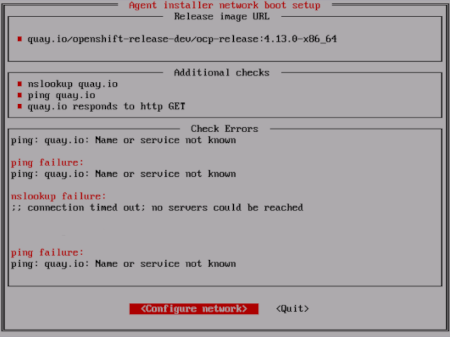

# Installing a cluster with customizations { #installing-with-agent-based-installer }

You can install an OpenShift Container Platform cluster using the Agent-based Installer, with customizations to meet your deployment needs.

The following procedures deploy a single-node OpenShift Container Platform cluster in a disconnected environment. You can use these procedures as a basis and modify according to your requirements.

## Prerequisites for installing a cluster with the Agent-based Installer { #prerequisites_installing-with-agent-based-installer }

Before beginning your cluster installation, you must complete prerequisite tasks that prepare your environment.

- You reviewed details about the OpenShift Container Platform installation and update processes. For more information, see "Installation and update".
- You read "Selecting a cluster installation method and preparing it for users".
- If you use a firewall or proxy, you configured it to allow the sites that your cluster requires access to. For more information, see "Configuring your firewall".
- You configured your firewall to allow TCP traffic on port `8090` from all hosts to the rendezvous host so that hosts can reach the Assisted Service API during discovery and bootstrap. For more information, see "Port requirements for the rendezvous host".

**Additional resources**

- [Installation and update](../../architecture/architecture-installation.md#architecture-installation)
- [Selecting a cluster installation method and preparing it for users](../overview/installing-preparing.md#installing-preparing)
- [Configuring your firewall](../install_config/configuring-firewall.md#configuring-firewall-module_configuring-firewall)
- [Port requirements for the rendezvous host](preparing-to-install-with-agent-based-installer.md#agent-install-networking-ports_preparing-to-install-with-agent-based-installer)

## Downloading the Agent-based Installer { #installing-ocp-agent-retrieve_installing-with-agent-based-installer }

Begin the installation process by downloading the Agent-based Installer and the CLI needed for your installation.

**Procedure**

1. Log in to the Red Hat Hybrid Cloud Console using your login credentials.
2. Navigate to [Datacenter](https://console.redhat.com/openshift/create/datacenter).
3. Click **Run Agent-based Installer locally**.
4. Select the operating system and architecture for the **OpenShift Installer** and **Command line interface**.
5. Click **Download Installer** to download and extract the install program.
6. Download or copy the pull secret by clicking on **Download pull secret** or **Copy pull secret**.
7. Click **Download command-line tools** and place the `openshift-install` binary in a directory that is on your `PATH`.

## Verifying the supported architecture for an Agent-based installation { #agent-install-verifying-architectures_installing-with-agent-based-installer }

Before installing an OpenShift Container Platform cluster using the Agent-based Installer, you can optionally verify the supported architecture on which you can install the cluster.

**Prerequisites**

- You installed the OpenShift CLI (`oc`).
- You have downloaded the installation program.

**Procedure**

1. Log in to the OpenShift CLI (`oc`).

2. Check your release payload by running the following command:

    ```terminal
    $ ./openshift-install version
    ```

    ```terminal title="Example output"
    ./openshift-install 4.22.0
    built from commit abc123def456
    release image quay.io/openshift-release-dev/ocp-release@sha256:123abc456def789ghi012jkl345mno678pqr901stu234vwx567yz0
    release architecture amd64
    ```

    If you are using the release image with the `multi` payload, the `release architecture` displayed in the output of this command is the default architecture.

3. To check the architecture of the payload, run the following command:

    ```terminal
    $ oc adm release info <release_image> -o jsonpath="{ .metadata.metadata}"
    ```

    Replace `<release_image>` with the release image. For example: `quay.io/openshift-release-dev/ocp-release@sha256:123abc456def789ghi012jkl345mno678pqr901stu234vwx567yz0`.

    ```terminal title="Example output when the release image uses the multi payload"
    {"release.openshift.io architecture":"multi"}
    ```

    If you are using the release image with the `multi` payload, you can install the cluster on different architectures such as `arm64`, `amd64`, `s390x`, and `ppc64le`. Otherwise, you can install the cluster only on the `release architecture` displayed in the output of the `openshift-install version` command.

## Creating the preferred configuration inputs { #installing-ocp-agent-inputs_installing-with-agent-based-installer }

Create the preferred configuration inputs used to create the agent image.

!!! note

    Configuring the `install-config.yaml` and `agent-config.yaml` files is the preferred method for using the Agent-based Installer. Using GitOps ZTP manifests is optional.

**Procedure**

1. Install the `nmstate` dependency by running the following command:

    ```terminal
    $ sudo dnf install /usr/bin/nmstatectl -y
    ```

2. Place the `openshift-install` binary in a directory that is on your PATH.

3. Create a directory to store the install configuration by running the following command:

    ```terminal
    $ mkdir ~/<directory_name>
    ```

4. Create the `install-config.yaml` file by running the following command:

    ```terminal
    $ cat << EOF > ./<directory_name>/install-config.yaml
    apiVersion: v1
    baseDomain: test.example.com
    compute:
    - architecture: amd64
      hyperthreading: Enabled
      name: worker
      replicas: 0
    controlPlane:
      architecture: amd64
      hyperthreading: Enabled
      name: master
      replicas: 1
    metadata:
      name: sno-cluster
    networking:
      clusterNetwork:
      - cidr: 10.128.0.0/14
        hostPrefix: 23
      machineNetwork:
      - cidr: 192.168.0.0/16
      networkType: OVNKubernetes
      serviceNetwork:
      - 172.30.0.0/16
    platform:
      none: {}
    pullSecret: '<pull_secret>'
    sshKey: '<ssh_pub_key>'
    additionalTrustBundle: |
      -----BEGIN CERTIFICATE-----
      ZZZZZZZZZZZZZZZZZZZZZZZZZZZZZZZZZZZZZZZZZZZZZZZZZZZZZZZZZZZZZZZZ
      -----END CERTIFICATE-----
    imageContentSources:
    - mirrors:
      - <local_registry>/<local_repository_name>/release
      source: quay.io/openshift-release-dev/ocp-release
    - mirrors:
      - <local_registry>/<local_repository_name>/release
      source: quay.io/openshift-release-dev/ocp-v4.0-art-dev
    EOF
    ```

    where:

    `compute.architecture`
    :   Specifies the system architecture. Valid values are `amd64`, `arm64`, `ppc64le`, and `s390x`.

        If you are using the release image with the `multi` payload, you can install the cluster on different architectures such as `arm64`, `amd64`, `s390x`, and `ppc64le`. Otherwise, you can install the cluster only on the `release architecture` displayed in the output of the `openshift-install version` command. For more information, see "Verifying the supported architecture for installing an Agent-based Installer cluster".

    `metadata.name`
    :   Specifies your cluster name. This value is required.

    `networking.networkingType`
    :   Specifies the cluster network plugin to install. The default value `OVNKubernetes` is the only supported value.

    `platform`
    :   Specifies your platform. If you set the platform to `vSphere`, `baremetal`, or `none`, you can configure IP address endpoints for cluster nodes in three ways: IPv4, IPv6, or IPv4 and IPv6 in parallel (dual-stack).

        ```yaml title="Example of dual-stack networking"
        networking:
          clusterNetwork:
            - cidr: 172.21.0.0/16
              hostPrefix: 23
            - cidr: fd02::/48
              hostPrefix: 64
          machineNetwork:
            - cidr: 192.168.11.0/16
            - cidr: 2001:DB8::/32
          serviceNetwork:
            - 172.22.0.0/16
            - fd03::/112
          networkType: OVNKubernetes
        platform:
          baremetal:
            apiVIPs:
            - 192.168.11.3
            - 2001:DB8::4
            ingressVIPs:
            - 192.168.11.4
            - 2001:DB8::5
        ```

        !!! note

            For bare-metal platforms, host settings made in the platform section of the `install-config.yaml` file are used by default, unless they are overridden by configurations made in the `agent-config.yaml` file.

    `pullSecret`
    :   Specifies your pull secret.

    `sshKey`
    :   Specifies your SSH public key.

    `additionalTrustBundle`
    :   Specifies the contents of the certificate file that you used for your mirror registry. The certificate file can be an existing, trusted certificate authority or the self-signed certificate that you generated for the mirror registry. You must specify this parameter if you are using a disconnected mirror registry.

    `imageContentSources`
    :   Specifies the `imageContentSources` section according to the output of the command that you used to mirror the repository. You must specify this parameter if you are using a disconnected mirror registry.

        !!! warning

            - When using the `oc adm release mirror` command, use the output from the `imageContentSources` section.
            - When using the `oc mirror` command, use the `repositoryDigestMirrors` section of the `ImageContentSourcePolicy` file that results from running the command.
            - The `ImageContentSourcePolicy` resource is deprecated.

5. Create the `agent-config.yaml` file by running the following command:

    ```terminal
    $ cat > agent-config.yaml << EOF
    apiVersion: v1beta1
    kind: AgentConfig
    metadata:
      name: sno-cluster
    rendezvousIP: 192.168.111.80
    hosts:
      - hostname: master-0
        interfaces:
          - name: eno1
            macAddress: 00:ef:44:21:e6:a5
        rootDeviceHints:
          deviceName: /dev/sdb
        networkConfig:
          interfaces:
            - name: eno1
              type: ethernet
              state: up
              mac-address: 00:ef:44:21:e6:a5
              ipv4:
                enabled: true
                address:
                  - ip: 192.168.111.80
                    prefix-length: 23
                dhcp: false
          dns-resolver:
            config:
              server:
                - 192.168.111.1
          routes:
            config:
              - destination: 0.0.0.0/0
                next-hop-address: 192.168.111.2
                next-hop-interface: eno1
                table-id: 254
    EOF
    ```

    where:

    `rendezvousIP`
    :   Specifies the IP address used to determine which node performs the bootstrapping process as well as running the `assisted-service` component. You must provide the rendezvous IP address when you do not specify at least one host’s IP address in the `networkConfig` parameter. If this address is not provided, one IP address is selected from the provided hosts' `networkConfig`.

    `hosts`
    :   Specifies host configuration. The number of hosts defined must not exceed the total number of hosts defined in the `install-config.yaml` file, which is the sum of the values of the `compute.replicas` and `controlPlane.replicas` parameters. This configuration is optional.

    `hosts.hostname`
    :   Specifies a value that overrides the hostname obtained from either the Dynamic Host Configuration Protocol (DHCP) or a reverse DNS lookup. Each host must have a unique hostname supplied by one of these methods. This configuration is optional.

    `hosts.rootDeviceHints`
    :   Specifies a configuration that enables provisioning of the Red Hat Enterprise Linux CoreOS (RHCOS) image to a particular device. The installation program examines the devices in the order it discovers them, and compares the discovered values with the hint values. It uses the first discovered device that matches the hint value.

        !!! note

            This parameter is mandatory for FCP multipath configurations on IBM Z.

    `hosts.networkConfig`
    :   Specifies the network interface configuration of a host in NMState format. This configuration is optional.

**Additional resources**

- [Deploying with dual-stack networking](../installing_bare_metal/ipi/ipi-install-installation-workflow.md#modifying-install-config-for-dual-stack-network_ipi-install-installation-workflow)
- [Configuring the install-config yaml file](../installing_bare_metal/ipi/ipi-install-installation-workflow.md#configuring-the-install-config-file_ipi-install-installation-workflow)
- [Configuring a three-node cluster](../installing_bare_metal/upi/installing-restricted-networks-bare-metal.md#installation-three-node-cluster_installing-restricted-networks-bare-metal)
- [About root device hints](preparing-to-install-with-agent-based-installer.md#root-device-hints_preparing-to-install-with-agent-based-installer)
- [NMState state examples (NMState documentation)](https://nmstate.io/examples.html)
- [Configuring regions and zones for a VMware vCenter](../installing_vsphere/ipi/installing-vsphere-installer-provisioned-customizations.md#configuring-vsphere-regions-zones_installing-vsphere-installer-provisioned-customizations)
- [Verifying the supported architecture for installing an Agent-based installer cluster](installing-with-agent-based-installer.md#agent-install-verifying-architectures_installing-with-agent-based-installer)
- [Configuring the Agent-based Installer to use mirrored images](understanding-disconnected-installation-mirroring.md#agent-install-configuring-for-disconnected-registry_understanding-disconnected-installation-mirroring)

## Creating additional manifest files { #installing-ocp-agent-opt-manifests_installing-with-agent-based-installer }

As an optional task, you can create additional manifests to further configure your cluster beyond the configurations available in the `install-config.yaml` and `agent-config.yaml` files.

!!! warning

    Customizations to the cluster made by additional manifests are not validated, are not guaranteed to work, and might result in a nonfunctional cluster.

### Creating a directory to contain additional manifests { #installing-ocp-agent-manifest-folder_installing-with-agent-based-installer }

If you create additional manifests to configure your Agent-based installation beyond the `install-config.yaml` and `agent-config.yaml` files, you must create an `openshift` subdirectory within your installation directory. All of your additional machine configurations must be located within this subdirectory.

!!! note

    The most common type of additional manifest you can add is a `MachineConfig` object. For examples of `MachineConfig` objects you can add during the Agent-based installation, see "Using MachineConfig objects to configure nodes" in the "Additional resources" section.

**Procedure**

- On your installation host, create an `openshift` subdirectory within the installation directory by running the following command:

    ```terminal
    $ mkdir <installation_directory>/openshift
    ```

**Additional resources**

- [Using MachineConfig objects to configure nodes](../../machine_configuration/machine-configs-configure.md#machine-configs-configure)

### Creating a manifest object that includes a customized br-ex bridge { #creating-manifest-file-customized-br-ex-bridge_installing-with-agent-based-installer }

By default, OpenShift Container Platform automatically configures the Open vSwitch (OVS) `br-ex` bridge on nodes. For advanced networking requirements, you can override this default behavior on bare-metal platforms. To do this, use the Agent-based Installer to create a `MachineConfig` object that includes an NMState configuration file.

!!! warning

    Customizations to the cluster made by additional manifests are not validated and not guaranteed to work. These manifests might result in a nonfunctional cluster.

    For more information about an additional manifest file, see "Creating a directory to contain additional manifests".

Consider using the customized `br-ex` bridge configuration for any of the following tasks:

- You need to modify the `br-ex` bridge after you installed the cluster.
- You need to modify the maximum transmission unit (MTU) for your cluster.
- You need to update DNS values.
- You need to modify attributes for a different bond interface. Examples include MIImon (Media Independent Interface Monitor), bonding mode or Quality of Service (QoS).
- You need to enable Link Layer Discovery Protocol (LLDP) to discover and troubleshoot switch connectivity.

!!! note

    Use the default OVS `br-ex` bridge for standard environments.

    Use the default OVS `br-ex` bridge mechanism for single network interface controller (NIC) environments with default network settings.

After you install Red Hat Enterprise Linux CoreOS (RHCOS) and the system reboots, the Machine Config Operator injects Ignition configuration files into each node. This operation ensures that each node receives the `br-ex` bridge network configuration. To prevent configuration conflicts, the default OVS `br-ex` bridge mechanism is disabled.

!!! warning

    The following list of interface names are reserved and you cannot use the names with NMstate configurations:

    - `br-ext`
    - `br-int`
    - `br-local`
    - `br-nexthop`
    - `br0`
    - `ext-vxlan`
    - `ext`
    - `genev_sys_*`
    - `int`
    - `k8s-*`
    - `ovn-k8s-*`
    - `patch-br-*`
    - `tun0`
    - `vxlan_sys_*`

**Prerequisites**

- Optional: You have installed the [`nmstatectl`](https://nmstate.io/user/quick_guide.html) CLI tool to validate your NMState configuration.
- You checked that an `openshift` subdirectory exists in your installation directory. If the subdirectory does not exist, create the subdirectory.

**Procedure**

1. Create an NMState configuration file and define a customized `br-ex` bridge network configuration in the file:

    ```yaml title="Example of an NMState configuration for a customized br-ex bridge network"
    interfaces:
    - name: enp2s0
      type: ethernet
      state: up
      mtu: 9000
      ipv4:
        enabled: false
      ipv6:
        enabled: false
    - name: br-ex
      type: ovs-bridge
      state: up
      ipv4:
        enabled: false
        dhcp: false
      ipv6:
        enabled: false
        dhcp: false
      bridge:
        options:
          mcast-snooping-enable: true
        port:
        - name: enp2s0
        - name: br-ex
    - name: br-ex
      type: ovs-interface
      state: up
      copy-mac-from: enp2s0
      mtu: 9000
      ipv4:
        enabled: true
        dhcp: true
        auto-route-metric: 48
      ipv6:
        enabled: true
        dhcp: true
        auto-route-metric: 48
    # ...
    ```

    where:

    `interfaces.name`
    :   Specifies the name of the interface.

    `interfaces.type`
    :   Specifies the type of ethernet.

    `interfaces.state`
    :   Specifies the requested state for the interface after creation.

    `mtu`
    :   To ensure network stability and performance, you must explicitly declare the MTU in the manifest for every interface. Do not rely on automatic MTU configuration. The MTU configured on a bridge port or VLAN-tagged interface must not exceed the maximum frame size supported by the attached physical medium. A mismatch causes packet fragmentation or connectivity loss.

    `ipv4.enabled`
    :   Disables IPv4 and IPv6 in this example.

    `port.name`
    :   Specifies the node NIC to which the bridge attaches.

    `auto-route-metric`
    :   Sets the parameter to `48` to ensure the `br-ex` default route always has the highest precedence (lowest metric). This configuration prevents routing conflicts with any other interfaces that are automatically configured by the `NetworkManager` service.

2. Use the `cat` command to base64-encode the contents of the NMState configuration:

    ```terminal
    $ cat <nmstate_configuration>.yml | base64
    ```

    where:

    `<nmstate_configuration>`
    :   Replace `<nmstate_configuration>` with the name of your NMState resource YAML file.

3. Create a `MachineConfig` file as an additional manifest file. Define a customized `br-ex` bridge network configuration analogous to the following example in the file. The Agent-based Installer automatically applies the updates from the `MachineConfig` object to your cluster.

    ```yaml
    apiVersion: machineconfiguration.openshift.io/v1
    kind: MachineConfig
    metadata:
      labels:
        machineconfiguration.openshift.io/role: worker
      name: 10-br-ex-worker
    spec:
      config:
        ignition:
          version: 3.2.0
        storage:
          files:
          - contents:
              source: data:text/plain;charset=utf-8;base64,<base64_encoded_nmstate_configuration>
            mode: 0644
            overwrite: true
            path: /etc/nmstate/openshift/worker-0.yml
          - contents:
              source: data:text/plain;charset=utf-8;base64,<base64_encoded_nmstate_configuration>
            mode: 0644
            overwrite: true
            path: /etc/nmstate/openshift/worker-1.yml
    # ...
    ```

    where:

    `metadata.name`
    :   Specifies the name of the policy.

    `contents.source`
    :   Writes the encoded base64 information to the specified path.

    `path`
    :   For each node in your cluster, specify the hostname path to your node and the base-64 encoded Ignition configuration file data for the machine type. The `worker` role is the default role for nodes in your cluster. You must use the `.yml` extension for configuration files. For example, use `$(hostname -s).yml` when specifying the short hostname path for each node or all nodes in the `MachineConfig` manifest file. You can apply a single global configuration to all nodes in your cluster by using the `/etc/nmstate/openshift/cluster.yml` configuration file. In this case, you do not need to specify the short hostname path for each node, such as `/etc/nmstate/openshift/<node_hostname>.yml`. For example:

    ```yaml title="Example /etc/nmstate/openshift/cluster.yml configuration file"
    # ...
          - contents:
              source: data:text/plain;charset=utf-8;base64,<base64_encoded_nmstate_configuration>
            mode: 0644
            overwrite: true
            path: /etc/nmstate/openshift/cluster.yml
    # ...
    ```

4. Save the additional manifest file in the `openshift` subdirectory of your installation directory.

    On completing other configuration inputs for your installation, such as encrypting the disk, you create the ISO image. After booting this image, the customized `br-ex` bridge configuration applies to each node in your cluster.

### Creating disk partitions { #installation-user-infra-machines-advanced-disk_installing-with-agent-based-installer }

In general, you must use the default disk partitioning that is created during the RHCOS installation. However, there are cases where you might want to create a separate partition for a directory that you expect to grow.

OpenShift Container Platform supports the addition of a single partition to attach storage to either the `/var` directory or a subdirectory of `/var`. For example:

- `/var/lib/containers`: Holds container-related content that can grow as more images and containers are added to a system.

- `/var/lib/etcd`: Holds data that you might want to keep separate for purposes such as performance optimization of etcd storage.

- `/var`: Holds data that you might want to keep separate for purposes such as auditing.

    !!! warning

        For disk sizes larger than 100GB, and especially larger than 1TB, create a separate `/var` partition.

Storing the contents of a `/var` directory separately makes it easier to grow storage for those areas as needed and reinstall OpenShift Container Platform at a later date to keep that data intact. This method eliminates the need to re-pull containers or copy large log files during system updates.

The use of a separate partition for the `/var` directory or a subdirectory of `/var` also prevents data growth in the partitioned directory from filling up the root file system.

The following procedure sets up a separate `/var` partition by adding a machine config manifest that is wrapped into the Ignition config file for a node type during the preparation phase of an installation.

**Prerequisites**

- You have created an `openshift` subdirectory within your installation directory.

**Procedure**

1. Create a Butane config that configures the additional partition. For example, name the file `$HOME/clusterconfig/98-var-partition.bu`, change the disk device name to the name of the storage device on the `worker` systems, and set the storage size as appropriate. This example places the `/var` directory on a separate partition:

    ```yaml
    variant: openshift
    version: 4.22.0
    metadata:
      labels:
        machineconfiguration.openshift.io/role: worker
      name: 98-var-partition
    storage:
      disks:
      - device: /dev/disk/by-id/<device_name>
        partitions:
        - label: var
          start_mib: <partition_start_offset>
          size_mib: <partition_size>
          number: 5
      filesystems:
        - device: /dev/disk/by-partlabel/var
          path: /var
          format: xfs
          mount_options: [defaults, prjquota]
          with_mount_unit: true
    ```

    where:

    `<device_name>`
    :   Specifies the storage device name of the disk that you want to partition.

    `<partition_start_offset>`
    :   Specifies the minimum offset value for the boot disk. For best performance, specify a minimum offset value of 25000 mebibytes. The root file system is automatically resized to fill all available space up to the specified offset. If no offset value is specified, or if the specified value is smaller than the recommended minimum, the resulting root file system will be too small, and future reinstalls of RHCOS might overwrite the beginning of the data partition.

    `<partition_size>`
    :   Specifies the size of the data partition in mebibytes.

    `mount_options`
    :   The `prjquota` mount option must be enabled for filesystems used for container storage.

    !!! note

        When creating a separate `/var` partition, you cannot use different instance types for compute nodes, if the different instance types do not have the same device name.

2. Create a manifest from the Butane config and save it to the `clusterconfig/openshift` directory. For example, run the following command:

    ```terminal
    $ butane $HOME/clusterconfig/98-var-partition.bu -o $HOME/clusterconfig/openshift/98-var-partition.yaml
    ```

### Using ZTP manifests { #installing-ocp-agent-ztp_installing-with-agent-based-installer }

As an optional task, you can use GitOps Zero Touch Provisioning (ZTP) manifests to configure your installation beyond the options available through the `install-config.yaml` and `agent-config.yaml` files.

See "Challenges of the network far edge" to learn more about GitOps Zero Touch Provisioning (ZTP).

!!! warning

    Zero Touch Provisioning (ZTP) is not supported for two-node clusters with fencing (TNF). Although you can use Red Hat Advanced Cluster Management (RHACM) for installations, the additional infrastructure components required for ZTP are not validated for this topology.

!!! note

    GitOps ZTP manifests can be generated with or without configuring the `install-config.yaml` and `agent-config.yaml` files beforehand. If you chose to configure the `install-config.yaml` and `agent-config.yaml` files, the configurations will be imported to the ZTP cluster manifests when they are generated.

**Prerequisites**

- You have placed the `openshift-install` binary in a directory that is on your `PATH`.
- Optional: You have created and configured the `install-config.yaml` and `agent-config.yaml` files.

**Procedure**

1. Generate ZTP cluster manifests by running the following command:

    ```terminal
    $ openshift-install agent create cluster-manifests --dir <installation_directory>
    ```

    !!! warning

        If you have created the `install-config.yaml` and `agent-config.yaml` files, those files are deleted and replaced by the cluster manifests generated through this command.

        Any configurations made to the `install-config.yaml` and `agent-config.yaml` files are imported to the ZTP cluster manifests when you run the `openshift-install agent create cluster-manifests` command.

2. Navigate to the `cluster-manifests` directory by running the following command:

    ```terminal
    $ cd <installation_directory>/cluster-manifests
    ```

3. Configure the manifest files in the `cluster-manifests` directory. For sample files, see the "Sample GitOps ZTP custom resources" section.

4. Disconnected clusters: If you did not define mirror configuration in the `install-config.yaml` file before generating the ZTP manifests, perform the following steps:

    1. Navigate to the `mirror` directory by running the following command:

        ```terminal
        $ cd ../mirror
        ```

    2. Configure the manifest files in the `mirror` directory.

**Additional resources**

- [Sample GitOps ZTP custom resources](installing-with-agent-based-installer.md#sample-ztp-custom-resources_installing-with-agent-based-installer)
- [Challenges of the network far edge](../../edge_computing/ztp-deploying-far-edge-clusters-at-scale.md#ztp-deploying-far-edge-clusters-at-scale)

### Encrypting the disk { #installing-ocp-agent-encrypt_installing-with-agent-based-installer }

As an optional task, you can encrypt your disk or partition while installing OpenShift Container Platform with the Agent-based Installer.

!!! warning

    If there are leftover TPM encryption keys from a previous operating system on the bare-metal host, the cluster deployment can get stuck. To avoid this situation, it is highly recommended to reset the TPM chip in the BIOS before booting the ISO.

**Prerequisites**

- You have created and configured the `install-config.yaml` and `agent-config.yaml` files, unless you are using ZTP manifests.
- You have placed the `openshift-install` binary in a directory that is on your `PATH`.

**Procedure**

1. Generate ZTP cluster manifests by running the following command:

    ```terminal
    $ openshift-install agent create cluster-manifests --dir <installation_directory>
    ```

    !!! warning

        If you have created the `install-config.yaml` and `agent-config.yaml` files, those files are deleted and replaced by the cluster manifests generated through this command.

        Any configurations made to the `install-config.yaml` and `agent-config.yaml` files are imported to the ZTP cluster manifests when you run the `openshift-install agent create cluster-manifests` command.

    !!! note

        If you have already generated ZTP manifests, skip this step.

2. Navigate to the `cluster-manifests` directory by running the following command:

    ```terminal
    $ cd <installation_directory>/cluster-manifests
    ```

3. Add the following section to the `agent-cluster-install.yaml` file:

    ```yaml
    diskEncryption:
        enableOn: all
        mode: tang
        tangServers: "server1": "http://tang-server-1.example.com:7500"
    ```

    where:

    `diskEncryption.enableOn`
    :   Specifies which nodes to enable disk encryption on. Valid values are `none`, `all`, `masters`, and `workers`.

    `diskEncryption.mode`
    :   Specifies which disk encryption mode to use. Valid values are `tpmv2` and `tang`.

    `diskEncryption.tangServers`
    :   Specifies the Tang servers if you are using Tang. This value is optional.

**Additional resources**

- [About disk encryption](../install_config/installing-customizing.md#installation-special-config-storage_installing-customizing)

### Configuring cluster network MTU at installation time { #installing-ocp-agent-cluster-network-mtu_installing-with-agent-based-installer }

You can explicitly set the cluster network maximum transmission unit (MTU) during installation by placing a `Network` custom resource (CR) as an additional manifest in the `openshift` directory of your Agent-based Installer configuration.

Setting the cluster network MTU with additional headroom during deployment prevents the need for a Day 2 MTU update that requires at least two rolling reboots of all cluster nodes.

During installation, the Cluster Network Operator (CNO) automatically calculates the cluster network MTU based on the primary network interface MTU. When you enable IPsec at installation time, the calculation includes both the OVN-Kubernetes overhead of 100 bytes and the IPsec overhead. If you plan to enable IPsec or another encapsulation technology as a Day 2 operation, the calculated MTU includes only the OVN-Kubernetes overhead and might be insufficient.

By explicitly setting the cluster network MTU at installation time, you can include additional headroom for those future needs and avoid a disruptive MTU migration.

!!! warning

    The cluster network MTU value must be lower than the machine network MTU by at least 100 bytes to account for OVN-Kubernetes overlay overhead. If you plan to enable IPsec as a Day 2 operation, allow an additional 46 bytes for IPsec headroom. For example, with a machine network MTU of `9100` bytes, set the cluster network MTU to `8900` bytes, which accounts for the following offset:

    - OVN-Kubernetes overhead: 100 bytes
    - IPsec headroom: 46 bytes
    - Extra headroom: 54 bytes
    - Total offset: 200 bytes

    To avoid selecting an MTU value that a node cannot support, verify the maximum MTU (`maxmtu`) that the network interface accepts by running the `ip -d link` command.

**Prerequisites**

- You have created the `install-config.yaml` and `agent-config.yaml` files for your installation.
- You have created the `openshift` subdirectory within your installation directory as described in "Creating a directory to contain additional manifests".

**Procedure**

1. In your `agent-config.yaml` file, set the machine network MTU on the network interface for each host by using NMState configuration.

    The following example configures an Ethernet interface with MTU `9100`:

    ```yaml
    apiVersion: v1beta1
    kind: AgentConfig
    metadata:
      name: sno-cluster
    rendezvousIP: 192.168.111.80
    hosts:
      - hostname: master-0
        interfaces:
          - name: eno1
            macAddress: 00:ef:44:21:e6:a5
        networkConfig:
          interfaces:
            - name: eno1
              type: ethernet
              state: up
              mtu: 9100
              ipv4:
                enabled: true
                dhcp: false
                address:
                  - ip: "192.168.111.80"
                    prefix-length: 24
    ```

2. Create a `Network` CR manifest file named `set-cluster-mtu.yaml` that sets the cluster network MTU:

    ```yaml
    apiVersion: operator.openshift.io/v1
    kind: Network
    metadata:
      name: cluster
    spec:
      defaultNetwork:
        ovnKubernetesConfig:
          mtu: 8900
    ```

    where:

    `mtu`
    :   Specifies the cluster network MTU value. This value must be at least 100 bytes less than the machine network MTU. In this example, the value is 200 bytes less than the machine network MTU of 9100 to allow headroom for IPsec and other future requirements.

3. Place the `set-cluster-mtu.yaml` manifest file in the `openshift` subdirectory of your installation directory:

    ```text
    <installation_directory>/
    ├── install-config.yaml
    ├── agent-config.yaml
    └── openshift/
        └── set-cluster-mtu.yaml
    ```

    !!! note

        Manifests in the `openshift` directory cannot override default cluster manifests. This restriction does not affect the `Network` CR for cluster network MTU because MTU configuration is not part of the default manifest set.

4. Create the agent image and boot your servers as described in "Creating and booting the agent image".

    During cluster installation, the installation program applies the `Network` CR as an additional manifest, and the CNO uses the specified MTU value instead of auto-calculating it.

**Verification**

- After the cluster installation is complete, verify the cluster network MTU by running the following command:

    ```terminal
    $ oc get networks.operator.openshift.io cluster -o yaml
    ```

    ```yaml title="Example output"
    apiVersion: operator.openshift.io/v1
    kind: Network
    metadata:
      name: cluster
    # ...
    spec:
      # ...
      defaultNetwork:
        ovnKubernetesConfig:
          # ...
          mtu: 8900
    ```

## Creating and booting the agent image { #installing-ocp-agent-boot_installing-with-agent-based-installer }

After you have prepared the configuration inputs for your installation, create the ISO image and boot it on your machines.

**Prerequisites**

- If you plan to boot the agent image from a USB drive, you have installed the `syslinux` package.

**Procedure**

1. Create the agent image by running the following command:

    ```terminal
    $ openshift-install --dir <install_directory> agent create image
    ```

    !!! note

        Red Hat Enterprise Linux CoreOS (RHCOS) supports multipathing on the primary disk, allowing stronger resilience to hardware failure to achieve higher host availability. Multipathing is enabled by default in the agent ISO image, with a default `/etc/multipath.conf` configuration.

2. If you plan to boot the ISO image from a USB drive, add a master boot record to the image by running the following command:

    ```terminal
    $ isohybrid --uefi <agent_iso_image>
    ```

    ```terminal title="Example command"
    $ isohybrid --uefi agent.x86_64.iso
    ```

3. Boot the `agent.x86_64.iso`, `agent.aarch64.iso`, or `agent.s390x.iso` image on the bare-metal machines.

## Adding IBM Z agents with RHEL KVM { #installing-ocp-agent-ibm-z-kvm_installing-with-agent-based-installer }

You can manually add IBM Z(R) agents with RHEL KVM.

Only use this procedure for IBM Z(R) clusters with RHEL KVM.

!!! note

    The `nmstateconfig` parameter must be configured for the KVM boot.

**Procedure**

1. Boot your RHEL KVM machine.

2. To deploy the virtual server, run the `virt-install` command with the following parameters:

    ```terminal title="ISO boot"
    $ virt-install
        --name <vm_name> \
        --autostart \
        --memory=<memory> \
        --cpu host \
        --vcpus=<vcpus> \
        --cdrom \<path_to_image>/<agent_iso_image> \
        --disk pool=default,size=<disk_pool_size> \
        --network network:default,mac=<mac_address> \
        --graphics none \
        --noautoconsole \
        --os-variant rhel9.0 \
        --wait=-1
    ```

    For the `--cdrom` parameter, specify the location of the ISO image on the local server, for example, `<path_to_image>/home/<image>.iso`.

    !!! note

        For KVM-based installations using DASD devices on IBM Z, a partition (for example, `/dev/dasdb1`) must be created using the `fdasd` partitioning tool.

3. Optional: Enable FIPS mode.

    To enable FIPS mode on IBM Z(R) clusters with RHEL KVM you must use PXE boot instead and run the `virt-install` command with the following parameters:

    ```terminal title="PXE boot"
    $ virt-install \
       --name <vm_name> \
       --autostart \
       --ram=16384 \
       --cpu host \
       --vcpus=8 \
       --location <path_to_kernel_initrd_image>,kernel=kernel.img,initrd=initrd.img \
       --disk <qcow_image_path> \
       --network network:macvtap ,mac=<mac_address> \
       --graphics none \
       --noautoconsole \
       --wait=-1 \
       --extra-args "rd.neednet=1 nameserver=<nameserver>" \
       --extra-args "ip=<IP>::<nameserver>::<hostname>:enc1:none" \
       --extra-args "coreos.live.rootfs_url=http://<http_server>:8080/agent.s390x-rootfs.img" \
       --extra-args "random.trust_cpu=on rd.luks.options=discard" \
       --extra-args "ignition.firstboot ignition.platform.id=metal" \
       --extra-args "console=tty1 console=ttyS1,115200n8" \
       --extra-args "coreos.inst.persistent-kargs=console=tty1 console=ttyS1,115200n8" \
       --extra-args "fips=1" \
       --osinfo detect=on,require=off
    ```

    where:

    `--location`
    :   Specifies the location of the kernel/initrd on the HTTP or HTTPS server.

    `--extra-args "fips=1"`
    :   Specifies the enablement of FIPS mode. This entry is required in addition to setting the `fips` parameter to `true` in the `install-config.yaml` file.

    !!! note

        - For KVM-based installations using DASD devices on IBM Z, a partition (for example, `/dev/dasdb1`) must be created using the `fdasd` partitioning tool.
        - Currently, only PXE boot is supported to enable FIPS mode on IBM Z(R).

## Verifying that the current installation host can pull release images { #installing-ocp-agent-tui_installing-with-agent-based-installer }

After you boot the agent image and network services are made available to the host, the agent console application performs a pull check to verify that the current host can retrieve release images.

If the primary pull check passes, you can quit the application to continue with the installation. If the pull check fails, the application performs additional checks, as seen in the `Additional checks` section of the TUI, to help you troubleshoot the problem. A failure for any of the additional checks is not necessarily critical as long as the primary pull check succeeds.

If there are host network configuration issues that might cause an installation to fail, you can use the console application to make adjustments to your network configurations.

!!! warning

    If the agent console application detects host network configuration issues, the installation workflow will be halted until the user manually stops the console application and signals the intention to proceed.

**Procedure**

1. Wait for the agent console application to check whether or not the configured release image can be pulled from a registry.

2. If the agent console application states that the installer connectivity checks have passed, wait for the prompt to time out to continue with the installation.

    !!! note

        You can still choose to view or change network configuration settings even if the connectivity checks have passed.

        However, if you choose to interact with the agent console application rather than letting it time out, you must manually quit the TUI to proceed with the installation.

3. If the agent console application checks have failed, which is indicated by a red icon beside the `Release image URL` pull check, use the following steps to reconfigure the host’s network settings:

    1. Read the `Check Errors` section of the TUI. This section displays error messages specific to the failed checks. 
    2. Select **Configure network** to launch the NetworkManager TUI.
    3. Select **Edit a connection** and select the connection you want to reconfigure.
    4. Edit the configuration and select **OK** to save your changes.
    5. Select **Back** to return to the main screen of the NetworkManager TUI.
    6. Select **Activate a Connection**.
    7. Select the reconfigured network to deactivate it.
    8. Select the reconfigured network again to reactivate it.
    9. Select **Back** and then select **Quit** to return to the agent console application.
    10. Wait at least five seconds for the continuous network checks to restart using the new network configuration.
    11. If the `Release image URL` pull check succeeds and displays a green icon beside the URL, select **Quit** to exit the agent console application and continue with the installation.

## Tracking and verifying installation progress { #installing-ocp-agent-verify_installing-with-agent-based-installer }

After the installation has started, you can track installation progress and verify a successful installation.

**Prerequisites**

- You have configured a DNS record for the Kubernetes API server.

**Procedure**

1. Optional: To know when the bootstrap host (rendezvous host) reboots, run the following command:

    ```terminal
    $ ./openshift-install --dir <install_directory> agent wait-for bootstrap-complete \
        --log-level=info
    ```

    where:

    `--dir`
    :   specifies the path to the directory where the agent ISO was generated.

    `--log-level`
    :   Specifies the level of installation details. Valid values are `info`, `warn`, `debug`, and `error`.

    ```terminal title="Example output"
    ...................................................................
    ...................................................................
    INFO Bootstrap configMap status is complete
    INFO cluster bootstrap is complete
    ```

    The command succeeds when the Kubernetes API server signals that it has been bootstrapped on the control plane machines.

2. Track the progress and verify successful installation by running the following command:

    ```terminal
    $ openshift-install --dir <install_directory> agent wait-for install-complete (1)
    ```

    Replace `<install_directory>` with the path to the directory where the agent ISO was generated.

    ```terminal title="Example output"
    ...................................................................
    ...................................................................
    INFO Cluster is installed
    INFO Install complete!
    INFO To access the cluster as the system:admin user when using 'oc', run
    INFO     export KUBECONFIG=/home/core/installer/auth/kubeconfig
    INFO Access the OpenShift web-console here: https://console-openshift-console.apps.sno-cluster.test.example.com
    ```

    !!! note

        If you are using the optional method of GitOps ZTP manifests, you can configure IP address endpoints for cluster nodes through the `AgentClusterInstall.yaml` file in three ways:

        - IPv4
        - IPv6
        - IPv4 and IPv6 in parallel (dual-stack)

        IPv6 is supported only on bare metal platforms.

    ```yaml title="Example of dual-stack networking"
    apiVIP: 192.168.11.3
    ingressVIP: 192.168.11.4
    clusterDeploymentRef:
      name: mycluster
    imageSetRef:
      name: openshift-4.22
    networking:
      clusterNetwork:
      - cidr: 172.21.0.0/16
        hostPrefix: 23
      - cidr: fd02::/48
        hostPrefix: 64
      machineNetwork:
      - cidr: 192.168.11.0/16
      - cidr: 2001:DB8::/32
      serviceNetwork:
      - 172.22.0.0/16
      - fd03::/112
      networkType: OVNKubernetes
    ```

## Sample GitOps ZTP custom resources { #sample-ztp-custom-resources_installing-with-agent-based-installer }

You can optionally use GitOps Zero Touch Provisioning (ZTP) custom resource (CR) objects to install an OpenShift Container Platform cluster with the Agent-based Installer.

You can customize the following GitOps ZTP custom resources to specify more details about your OpenShift Container Platform cluster. The following sample GitOps ZTP custom resources are for a single-node cluster.

```yaml title="Example agent-cluster-install.yaml file"
  apiVersion: extensions.hive.openshift.io/v1beta1
  kind: AgentClusterInstall
  metadata:
    name: test-agent-cluster-install
    namespace: cluster0
  spec:
    clusterDeploymentRef:
      name: ostest
    imageSetRef:
      name: openshift-4.22
    networking:
      clusterNetwork:
      - cidr: 10.128.0.0/14
        hostPrefix: 23
      serviceNetwork:
      - 172.30.0.0/16
    provisionRequirements:
      controlPlaneAgents: 1
      workerAgents: 0
    sshPublicKey: <ssh_public_key>
```

```yaml title="Example cluster-deployment.yaml file"
apiVersion: hive.openshift.io/v1
kind: ClusterDeployment
metadata:
  name: ostest
  namespace: cluster0
spec:
  baseDomain: test.metalkube.org
  clusterInstallRef:
    group: extensions.hive.openshift.io
    kind: AgentClusterInstall
    name: test-agent-cluster-install
    version: v1beta1
  clusterName: ostest
  controlPlaneConfig:
    servingCertificates: {}
  platform:
    agentBareMetal: {}
  pullSecretRef:
    name: pull-secret
```

To declaratively bind specific bare-metal hosts to a cluster, use the `bmac.agent-install.openshift.io/cluster-reference` annotation on `BareMetalHost` resources.

```yaml title="Example cluster-image-set.yaml file"
apiVersion: hive.openshift.io/v1
kind: ClusterImageSet
metadata:
  name: openshift-4.22
spec:
  releaseImage: registry.ci.openshift.org/ocp/release:4.22.0-0.nightly-2022-06-06-025509
```

```yaml title="Example infra-env.yaml file"
apiVersion: agent-install.openshift.io/v1beta1
kind: InfraEnv
metadata:
  name: myinfraenv
  namespace: cluster0
spec:
  clusterRef:
    name: ostest
    namespace: cluster0
  cpuArchitecture: aarch64
  pullSecretRef:
    name: pull-secret
  sshAuthorizedKey: <ssh_public_key>
  nmStateConfigLabelSelector:
    matchLabels:
      cluster0-nmstate-label-name: cluster0-nmstate-label-value
```

The `clusterRef` field and its child fields (`name` and `namespace`) are optional. To enable the late-binding workflow, remove the `clusterRef` field and its child fields from the `InfraEnv` CR. Hosts are then bound to clusters individually by using the `bmac.agent-install.openshift.io/cluster-reference` annotation on `BareMetalHost` resources.

```yaml title="Example nmstateconfig.yaml file"
apiVersion: agent-install.openshift.io/v1beta1
kind: NMStateConfig
metadata:
  name: master-0
  namespace: openshift-machine-api
  labels:
    cluster0-nmstate-label-name: cluster0-nmstate-label-value
spec:
  config:
    interfaces:
      - name: eth0
        type: ethernet
        state: up
        mac-address: 52:54:01:aa:aa:a1
        ipv4:
          enabled: true
          address:
            - ip: 192.168.122.2
              prefix-length: 23
          dhcp: false
    dns-resolver:
      config:
        server:
          - 192.168.122.1
    routes:
      config:
        - destination: 0.0.0.0/0
          next-hop-address: 192.168.122.1
          next-hop-interface: eth0
          table-id: 254
  interfaces:
    - name: "eth0"
      macAddress: 52:54:01:aa:aa:a1
```

```yaml title="Example pull-secret.yaml file"
apiVersion: v1
kind: Secret
type: kubernetes.io/dockerconfigjson
metadata:
  name: pull-secret
  namespace: cluster0
stringData:
  .dockerconfigjson: <pull_secret>
```

**Additional resources**

- [Challenges of the network far edge](../../edge_computing/ztp-deploying-far-edge-clusters-at-scale.md#ztp-deploying-far-edge-clusters-at-scale)

## Gathering log data from a failed Agent-based installation { #installing-ocp-agent-gather-log_installing-with-agent-based-installer }

If you encounter a failed Agent-based installation, you can gather log data to provide for a support case.

**Prerequisites**

- You have configured a DNS record for the Kubernetes API server.

**Procedure**

1. Run the following command and collect the output:

    ```terminal
    $ ./openshift-install --dir <installation_directory> agent wait-for bootstrap-complete --log-level=debug
    ```

    ```terminal title="Example error message"
    ...
    ERROR Bootstrap failed to complete: : bootstrap process timed out: context deadline exceeded
    ```

2. If the output from the previous command indicates a failure, or if the bootstrap is not progressing, run the following command to connect to the rendezvous host and collect the output:

    ```terminal
    $ ssh core@<node-ip> agent-gather -O >agent-gather.tar.xz
    ```

    !!! note

        Red Hat Support can diagnose most issues using the data gathered from the rendezvous host, but if some hosts are not able to register, gathering this data from every host might be helpful.

3. If the bootstrap completes and the cluster nodes reboot, run the following command and collect the output:

    ```terminal
    $ ./openshift-install --dir <install_directory> agent wait-for install-complete --log-level=debug
    ```

4. If the output from the previous command indicates a failure, perform the following steps:

    1. Export the `kubeconfig` file to your environment by running the following command:

        ```terminal
        $ export KUBECONFIG=<install_directory>/auth/kubeconfig
        ```

    2. Gather information for debugging by running the following command:

        ```terminal
        $ oc adm must-gather
        ```

    3. Create a compressed file from the `must-gather` directory that was just created in your working directory by running the following command:

        ```terminal
        $ tar cvaf must-gather.tar.gz <must_gather_directory>
        ```

5. Excluding the `/auth` subdirectory, attach the installation directory used during the deployment to your support case on the [Red Hat Customer Portal](https://access.redhat.com).

6. Attach all other data gathered from this procedure to your support case.
