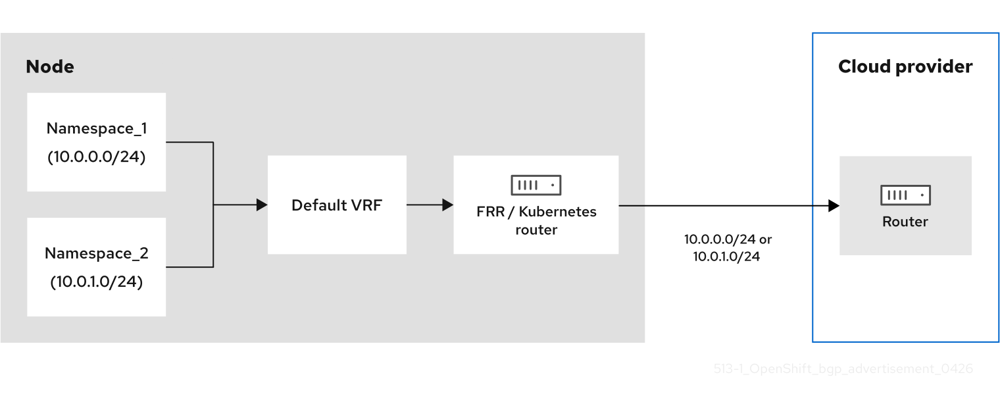
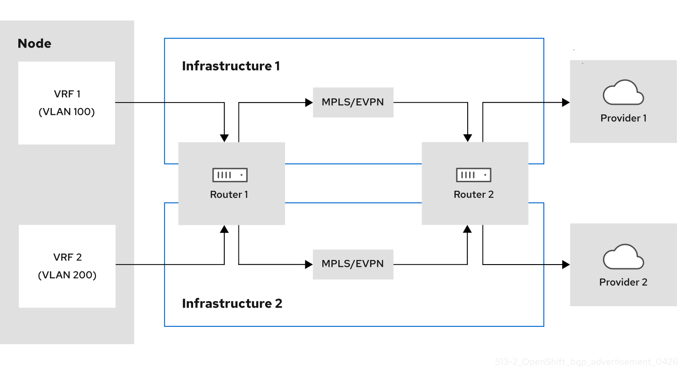

# About BGP routing { #about-bgp-routing }

To integrate BGP with MetalLB and FRR-K8s in OpenShift Container Platform, you can review how FRR-K8s resources model cluster routing. Migrate `FRRConfiguration` custom resources from `metallb-system` to `openshift-frr-k8s` when admins or third parties created them outside the MetalLB Operator.

!!! warning

    If you are using the MetalLB Operator and there are existing `FRRConfiguration` CRs in the `metallb-system` namespace created by cluster administrators or third-party cluster components other than the MetalLB Operator, you must ensure that they are copied to the `openshift-frr-k8s` namespace or that those third-party cluster components use the new namespace. For more information, see "Migrating FRR-K8s resources".

## About Border Gateway Protocol (BGP) routing { #nw-bgp-about_routing_about-bgp-routing }

To enable external routing for your cluster, configure Border Gateway Protocol (BGP) using FRRouting (FRR) and the FRR-K8s daemon. You can define routing behavior with the `FRRConfiguration` custom resource (CR) and ensure compatibility with the MetalLB Operator by using the required namespace and migration approach.

OpenShift Container Platform supports BGP routing through FRR, a free, open source internet routing protocol suite for Linux, UNIX, and similar operating systems. FRR-K8s is a Kubernetes-based daemon set that exposes a subset of the FRR API in a Kubernetes-compliant manner. As a cluster administrator, you can use the `FRRConfiguration` custom resource to access FRR services.

The following diagram shows a multi-tenancy environment where two namespaces exist on an OpenShift Container Platform node. When the OVN-Kubernetes gateway router sends traffic from a namespace to an external source, the traffic passes through the default virtual routing and forwarding (VRF) instance. BGP advertisement occurs when the FRR or OVN-Kubernetes router establishes a BGP session with the router of the cloud provider. This session ensures the router of the cloud provider knows that the node is the next-hop IP address for reaching the pod or service networks.

**Figure 1. BGP advertisement without a VPN**



The following diagram shows multiple VRF BGP instances that use VRF lite. This architecture supports only local gateway mode. VRF lite provides network virtualization by using UDNs to isolate pod traffic without incurring the heavy encapsulation typical of Multi-Protocol Label Switching (MPLS) or Ethernet Virtual Private Network (EVPN) protocols. Separate L3 links get mapped to specific VRFs, so independent BGP peering sessions route traffic to the next-hop router. Further, you can deploy this L3 mechanism to multi-cloud deployments to allow specific namespaces to exist over the network.

**Figure 2. Multiple VRF BGP instances that use VRF lite**



### Supported platforms { #supported-platforms_about-bgp-routing }

BGP routing is supported on the following infrastructure types:

- Bare metal

BGP routing requires that you have properly configured BGP for your network provider. Outages or misconfigurations of your network provider might cause disruptions to your cluster network.

### Considerations for use with the MetalLB Operator { #considerations-for-use-with-the-metallb-operator_about-bgp-routing }

The MetalLB Operator is installed as an add-on to the cluster. Deployment of the MetalLB Operator automatically enables FRR-K8s as an additional routing capability provider and uses the FRR-K8s daemon installed by this feature.

Before upgrading to 4.18, any existing `FRRConfiguration` in the `metallb-system` namespace not managed by the MetalLB operator (added by a cluster administrator or any other component) needs to be copied to the `openshift-frr-k8s` namespace manually, creating the namespace if necessary.

!!! warning

    If you are using the MetalLB Operator and there are existing `FRRConfiguration` CRs in the `metallb-system` namespace created by cluster administrators or third-party cluster components other than MetalLB Operator, you must:

    - Ensure that these existing `FRRConfiguration` CRs are copied to the `openshift-frr-k8s` namespace.
    - Ensure that the third-party cluster components use the new namespace for the `FRRConfiguration` CRs that they create.

### Cluster Network Operator configuration { #cluster-network-operator_about-bgp-routing }

The Cluster Network Operator API exposes the following API field to configure BGP routing:

- `spec.additionalRoutingCapabilities`: Enables deployment of the FRR-K8s daemon for the cluster, which can be used independently of route advertisements. When enabled, the FRR-K8s daemon is deployed on all nodes.

### BGP routing custom resources { #bgp-routing-custom-resources_about-bgp-routing }

The following custom resources are used to configure BGP routing:

`FRRConfiguration`
:   This custom resource defines the FRR configuration for the BGP routing. This CR is namespaced.

## Configuring the FRRConfiguration CR { #nw-metallb-frrconfiguration-crd_about-bgp-routing }

To customize routing behavior beyond standard MetalLB capabilities, configure the `FRRConfiguration` custom resource (CR).

The following reference examples demonstrate how to define specific FRRouting (FRR) parameters to enable advanced services, such as receiving routes:

The `routers` parameter
:   You can use the `routers` parameter to configure multiple routers, one for each Virtual Routing and Forwarding (VRF) resource. For each router, you must define the Autonomous System Number (ASN).

    You can also define a list of Border Gateway Protocol (BGP) neighbors to connect to, as in the following example:

    ```yaml title="Example FRRConfiguration CR"
    apiVersion: frrk8s.metallb.io/v1beta1
    kind: FRRConfiguration
    metadata:
      name: test
      namespace: frr-k8s-system
    spec:
      bgp:
        routers:
        - asn: 64512
          neighbors:
          - address: 172.30.0.3
            asn: 4200000000
            ebgpMultiHop: true
            port: 180
          - address: 172.18.0.6
            asn: 4200000000
            port: 179
    # ...
    ```

The `toAdvertise` parameter
:   By default, `FRR-K8s` does not advertise the prefixes configured as part of a router configuration. To advertise the prefixes, you use the `toAdvertise` parameter.

    You can advertise a subset of the prefixes, as in the following example:

    ```yaml title="Example FRRConfiguration CR"
    apiVersion: frrk8s.metallb.io/v1beta1
    kind: FRRConfiguration
    metadata:
      name: test
      namespace: frr-k8s-system
    spec:
      bgp:
        routers:
        - asn: 64512
          neighbors:
          - address: 172.30.0.3
            asn: 4200000000
            ebgpMultiHop: true
            port: 180
            toAdvertise:
              allowed:
                prefixes:
                - 192.168.2.0/24
          prefixes:
            - 192.168.2.0/24
            - 192.169.2.0/24
    # ...
    ```

    - `allowed.prefixes`: Advertises a subset of prefixes.

    The following example shows you how to advertise all of the prefixes:

    ```yaml title="Example FRRConfiguration CR"
    apiVersion: frrk8s.metallb.io/v1beta1
    kind: FRRConfiguration
    metadata:
      name: test
      namespace: frr-k8s-system
    spec:
      bgp:
        routers:
        - asn: 64512
          neighbors:
          - address: 172.30.0.3
            asn: 4200000000
            ebgpMultiHop: true
            port: 180
            toAdvertise:
              allowed:
                mode: all
          prefixes:
            - 192.168.2.0/24
            - 192.169.2.0/24
    # ...
    ```

    - `allowed.mode`: Advertises all prefixes.

The `toReceive` parameter
:   By default, `FRR-K8s` does not process any prefixes advertised by a neighbor. You can use the `toReceive` parameter to process such addresses.

    You can configure for a subset of the prefixes, as in this example:

    ```yaml title="Example FRRConfiguration CR"
    apiVersion: frrk8s.metallb.io/v1beta1
    kind: FRRConfiguration
    metadata:
      name: test
      namespace: frr-k8s-system
    spec:
      bgp:
        routers:
        - asn: 64512
          neighbors:
          - address: 172.18.0.5
              asn: 64512
              port: 179
              toReceive:
                allowed:
                  prefixes:
                  - prefix: 192.168.1.0/24
                  - prefix: 192.169.2.0/24
                    ge: 25
                    le: 28
    # ...
    ```

    - `prefixes`: The prefix is applied if the prefix length is less than or equal to the `le` prefix length and greater than or equal to the `ge` prefix length.

    The following example configures FRR to handle all the prefixes announced:

    ```yaml title="Example FRRConfiguration CR"
    apiVersion: frrk8s.metallb.io/v1beta1
    kind: FRRConfiguration
    metadata:
      name: test
      namespace: frr-k8s-system
    spec:
      bgp:
        routers:
        - asn: 64512
          neighbors:
          - address: 172.18.0.5
              asn: 64512
              port: 179
              toReceive:
                allowed:
                  mode: all
    # ...
    ```

The `bgp` parameter
:   You can use the `bgp` parameter to define various `BFD` profiles and associate them with a neighbor. In the following example, `BFD` backs up the `BGP` session and `FRR` can detect link failures:

    ```yaml title="Example FRRConfiguration CR"
    apiVersion: frrk8s.metallb.io/v1beta1
    kind: FRRConfiguration
    metadata:
      name: test
      namespace: frr-k8s-system
    spec:
      bgp:
        routers:
        - asn: 64512
          neighbors:
          - address: 172.30.0.3
            asn: 64512
            port: 180
            bfdProfile: defaultprofile
        bfdProfiles:
          - name: defaultprofile
    # ...
    ```

The `nodeSelector` parameter
:   By default, `FRR-K8s` applies the configuration to all nodes where the daemon is running. You can use the `nodeSelector` parameter to specify the nodes to which you want to apply the configuration. For example:

    ```yaml title="Example FRRConfiguration CR"
    apiVersion: frrk8s.metallb.io/v1beta1
    kind: FRRConfiguration
    metadata:
      name: test
      namespace: frr-k8s-system
    spec:
      bgp:
        routers:
        - asn: 64512
      nodeSelector:
        labelSelector:
        foo: "bar"
    # ...
    ```

The `interface` parameter
:   You can use the `interface` parameter to configure unnumbered BGP peering by using the following example configuration:

    ```yaml title="Example FRRConfiguration CR"
    apiVersion: frrk8s.metallb.io/v1beta1
    kind: FRRConfiguration
    metadata:
      name: test
      namespace: frr-k8s-system
    spec:
      bgp:
        bfdProfiles:
        - echoMode: false
          name: simple
          passiveMode: false
        routers:
        - asn: 64512
          neighbors:
          - asn: 64512
            bfdProfile: simple
            disableMP: false
            interface: net10
            port: 179
            toAdvertise:
              allowed:
                mode: filtered
                prefixes:
                - 5.5.5.5/32
            toReceive:
              allowed:
                mode: filtered
          prefixes:
          - 5.5.5.5/32
    # ...
    ```

    - `neighbors.interface`: Activates unnumbered BGP peering.

    !!! note

        To use the `interface` parameter, you must establish a point-to-point, layer 2 connection between the two BGP peers. You can use unnumbered BGP peering with IPv4, IPv6, or dual-stack, but you must enable IPv6 RAs (Router Advertisements). Each interface is limited to one BGP connection.

        If you use this parameter, you cannot specify a value in the `spec.bgp.routers.neighbors.address` parameter.

The parameters for the `FRRConfiguration` custom resource are described in the following table:

**MetalLB FRRConfiguration custom resource**

<table>
<thead>
<tr>
  <th>Parameter</th>
  <th>Type</th>
  <th>Description</th>
</tr>
</thead>
<tbody>
<tr>
  <td><code>spec.bgp.routers</code></td>
  <td><code>array</code></td>
  <td>Specifies the routers that FRR is to configure (one per VRF).</td>
</tr>
<tr>
  <td><code>spec.bgp.routers.asn</code></td>
  <td><code>integer</code></td>
  <td>The Autonomous System Number (ASN) to use for the local end of the session.</td>
</tr>
<tr>
  <td><code>spec.bgp.routers.id</code></td>
  <td><code>string</code></td>
  <td>Specifies the ID of the <code>bgp</code> router.</td>
</tr>
<tr>
  <td><code>spec.bgp.routers.vrf</code></td>
  <td><code>string</code></td>
  <td>Specifies the host VRF used to establish sessions from this router.</td>
</tr>
<tr>
  <td><code>spec.bgp.routers.neighbors</code></td>
  <td><code>array</code></td>
  <td>Specifies the neighbors to establish BGP sessions with.</td>
</tr>
<tr>
  <td><code>spec.bgp.routers.neighbors.asn</code></td>
  <td><code>integer</code></td>
  <td>Specifies the ASN to use for the remote end of the session. If you use this parameter, you cannot specify a value in the <code>spec.bgp.routers.neighbors.dynamicASN</code> parameter.</td>
</tr>
<tr>
  <td><code>spec.bgp.routers.neighbors.dynamicASN</code></td>
  <td><code>string</code></td>
  <td>Detects the ASN to use for the remote end of the session without explicitly setting it. Specify <code>internal</code> for a neighbor with the same ASN, or <code>external</code> for a neighbor with a different ASN. If you use this parameter, you cannot specify a value in the <code>spec.bgp.routers.neighbors.asn</code> parameter.</td>
</tr>
<tr>
  <td><code>spec.bgp.routers.neighbors.address</code></td>
  <td><code>string</code></td>
  <td>Specifies the IP address to establish the session with. If you use this parameter, you cannot specify a value in the <code>spec.bgp.routers.neighbors.interface</code> parameter.</td>
</tr>
<tr>
  <td><code>spec.bgp.routers.neighbors.interface</code></td>
  <td><code>string</code></td>
  <td>Specifies the interface name to use when establishing a session. Use this parameter to configure unnumbered BGP peering. There must be a point-to-point, layer 2 connection between the two BGP peers. You can use unnumbered BGP peering with IPv4, IPv6, or dual-stack, but you must enable IPv6 RAs (Router Advertisements). Each interface is limited to one BGP connection.</td>
</tr>
<tr>
  <td><code>spec.bgp.routers.neighbors.port</code></td>
  <td><code>integer</code></td>
  <td>Specifies the port to dial when establishing the session. Defaults to <code>179</code>.</td>
</tr>
<tr>
  <td><code>spec.bgp.routers.neighbors.password</code></td>
  <td><code>string</code></td>
  <td>Specifies the password to use for establishing the BGP session. <code>Password</code> and <code>PasswordSecret</code> are mutually exclusive.</td>
</tr>
<tr>
  <td><code>spec.bgp.routers.neighbors.passwordSecret</code></td>
  <td><code>string</code></td>
  <td>Specifies the name of the authentication secret for the neighbor. The secret must be of type "kubernetes.io/basic-auth", and in the same namespace as the FRR-K8s daemon. The key "password" stores the password in the secret. <code>Password</code> and <code>PasswordSecret</code> are mutually exclusive.</td>
</tr>
<tr>
  <td><code>spec.bgp.routers.neighbors.holdTime</code></td>
  <td><code>duration</code></td>
  <td>Specifies the requested BGP hold time, per RFC4271. Defaults to 180s.</td>
</tr>
<tr>
  <td><code>spec.bgp.routers.neighbors.keepaliveTime</code></td>
  <td><code>duration</code></td>
  <td>Specifies the requested BGP keepalive time, per RFC4271. Defaults to <code>60s</code>.</td>
</tr>
<tr>
  <td><code>spec.bgp.routers.neighbors.connectTime</code></td>
  <td><code>duration</code></td>
  <td>Specifies how long BGP waits between connection attempts to a neighbor.</td>
</tr>
<tr>
  <td><code>spec.bgp.routers.neighbors.ebgpMultiHop</code></td>
  <td><code>boolean</code></td>
  <td>Indicates if the BGPPeer is a multi-hop away.</td>
</tr>
<tr>
  <td><code>spec.bgp.routers.neighbors.bfdProfile</code></td>
  <td><code>string</code></td>
  <td>Specifies the name of the BFD Profile to use for the BFD session associated with the BGP session. If not set, the BFD session is not set up.</td>
</tr>
<tr>
  <td><code>spec.bgp.routers.neighbors.toAdvertise.allowed</code></td>
  <td><code>array</code></td>
  <td>Represents the list of prefixes to advertise to a neighbor, and the associated properties.</td>
</tr>
<tr>
  <td><code>spec.bgp.routers.neighbors.toAdvertise.allowed.prefixes</code></td>
  <td><code>string array</code></td>
  <td>Specifies the list of prefixes to advertise to a neighbor. This list must match the prefixes that you define in the router.</td>
</tr>
<tr>
  <td><code>spec.bgp.routers.neighbors.toAdvertise.allowed.mode</code></td>
  <td><code>string</code></td>
  <td>Specifies the mode to use when handling the prefixes. You can set to <code>filtered</code> to allow only the prefixes in the prefixes list. You can set to <code>all</code> to allow all the prefixes configured on the router.</td>
</tr>
<tr>
  <td><code>spec.bgp.routers.neighbors.toAdvertise.withLocalPref</code></td>
  <td><code>array</code></td>
  <td>Specifies the prefixes associated with an advertised local preference. You must specify the prefixes associated with a local preference in the prefixes allowed to be advertised.</td>
</tr>
<tr>
  <td><code>spec.bgp.routers.neighbors.toAdvertise.withLocalPref.prefixes</code></td>
  <td><code>string array</code></td>
  <td>Specifies the prefixes associated with the local preference.</td>
</tr>
<tr>
  <td><code>spec.bgp.routers.neighbors.toAdvertise.withLocalPref.localPref</code></td>
  <td><code>integer</code></td>
  <td>Specifies the local preference associated with the prefixes.</td>
</tr>
<tr>
  <td><code>spec.bgp.routers.neighbors.toAdvertise.withCommunity</code></td>
  <td><code>array</code></td>
  <td>Specifies the prefixes associated with an advertised BGP community. You must include the prefixes associated with a local preference in the list of prefixes that you want to advertise.</td>
</tr>
<tr>
  <td><code>spec.bgp.routers.neighbors.toAdvertise.withCommunity.prefixes</code></td>
  <td><code>string array</code></td>
  <td>Specifies the prefixes associated with the community.</td>
</tr>
<tr>
  <td><code>spec.bgp.routers.neighbors.toAdvertise.withCommunity.community</code></td>
  <td><code>string</code></td>
  <td>Specifies the community associated with the prefixes.</td>
</tr>
<tr>
  <td><code>spec.bgp.routers.neighbors.toReceive</code></td>
  <td><code>array</code></td>
  <td>Specifies the prefixes to receive from a neighbor.</td>
</tr>
<tr>
  <td><code>spec.bgp.routers.neighbors.toReceive.allowed</code></td>
  <td><code>array</code></td>
  <td>Specifies the information that you want to receive from a neighbor.</td>
</tr>
<tr>
  <td><code>spec.bgp.routers.neighbors.toReceive.allowed.prefixes</code></td>
  <td><code>array</code></td>
  <td>Specifies the prefixes allowed from a neighbor.</td>
</tr>
<tr>
  <td><code>spec.bgp.routers.neighbors.toReceive.allowed.mode</code></td>
  <td><code>string</code></td>
  <td>Specifies the mode to use when handling the prefixes. When set to <code>filtered</code>, only the prefixes in the <code>prefixes</code> list are allowed. When set to <code>all</code>, all the prefixes configured on the router are allowed.</td>
</tr>
<tr>
  <td><code>spec.bgp.routers.neighbors.disableMP</code></td>
  <td><code>boolean</code></td>
  <td>Disables MP BGP to prevent it from separating IPv4 and IPv6 route exchanges into distinct BGP sessions.</td>
</tr>
<tr>
  <td><code>spec.bgp.routers.prefixes</code></td>
  <td><code>string array</code></td>
  <td>Specifies all prefixes to advertise from this router instance.</td>
</tr>
<tr>
  <td><code>spec.bgp.bfdProfiles</code></td>
  <td><code>array</code></td>
  <td>Specifies the list of BFD profiles to use when configuring the neighbors.</td>
</tr>
<tr>
  <td><code>spec.bgp.bfdProfiles.name</code></td>
  <td><code>string</code></td>
  <td>The name of the BFD Profile to be referenced in other parts of the configuration.</td>
</tr>
<tr>
  <td><code>spec.bgp.bfdProfiles.receiveInterval</code></td>
  <td><code>integer</code></td>
  <td>Specifies the minimum interval at which this system can receive control packets, in milliseconds. Defaults to <code>300ms</code>.</td>
</tr>
<tr>
  <td><code>spec.bgp.bfdProfiles.transmitInterval</code></td>
  <td><code>integer</code></td>
  <td>Specifies the minimum transmission interval, excluding jitter, that this system wants to use to send BFD control packets, in milliseconds. Defaults to <code>300ms</code>.</td>
</tr>
<tr>
  <td><code>spec.bgp.bfdProfiles.detectMultiplier</code></td>
  <td><code>integer</code></td>
  <td>Configures the detection multiplier to determine packet loss. To determine the connection loss-detection timer, multiply the remote transmission interval by this value.</td>
</tr>
<tr>
  <td><code>spec.bgp.bfdProfiles.echoInterval</code></td>
  <td><code>integer</code></td>
  <td>Configures the minimal echo receive transmission-interval that this system can handle, in milliseconds. Defaults to <code>50ms</code>.</td>
</tr>
<tr>
  <td><code>spec.bgp.bfdProfiles.echoMode</code></td>
  <td><code>boolean</code></td>
  <td>Enables or disables the echo transmission mode. This mode is disabled by default, and not supported on multihop setups.</td>
</tr>
<tr>
  <td><code>spec.bgp.bfdProfiles.passiveMode</code></td>
  <td><code>boolean</code></td>
  <td>Mark session as passive. A passive session does not attempt to start the connection and waits for control packets from peers before it begins replying.</td>
</tr>
<tr>
  <td><code>spec.bgp.bfdProfiles.MinimumTtl</code></td>
  <td><code>integer</code></td>
  <td>For multihop sessions only. Configures the minimum expected TTL for an incoming BFD control packet.</td>
</tr>
<tr>
  <td><code>spec.nodeSelector</code></td>
  <td><code>string</code></td>
  <td>Limits the nodes that attempt to apply this configuration. If specified, only those nodes whose labels match the specified selectors attempt to apply the configuration. If it is not specified, all nodes attempt to apply this configuration.</td>
</tr>
<tr>
  <td><code>status</code></td>
  <td><code>string</code></td>
  <td>Defines the observed state of FRRConfiguration.</td>
</tr>
</tbody>
</table>


## Understanding no-overlay mode for layer-3 networks using Border Gateway Protocol (BGP) { #nw-no-overlay-overview_about-bgp-routing }

You can use no-overlay mode to route layer 3 pod traffic directly over the underlay network with BGP, which reduces encapsulation overhead and improves east-west performance.

No-overlay mode disables the default encapsulation for the default cluster network and uses BGP-learned routes to forward pod traffic across nodes. A cluster can run overlay and no-overlay networks at the same time.

For the default cluster network, no-overlay supports managed and unmanaged routing. With managed routing, OVN-Kubernetes creates a full-mesh BGP fabric between cluster nodes only, so no external BGP routers are required and pod routes are not advertised outside the cluster (intra-cluster traffic only). Managed routing requires nodes to be directly connected at layer 2; it is not suitable for clusters with nodes in different subnets. With unmanaged routing on the default network, you configure external BGP peers and use `RouteAdvertisements` custom resources (CRs) to advertise pod subnets to your existing BGP infrastructure.

For a primary network defined by a `ClusterUserDefinedNetwork` CR, no-overlay supports unmanaged routing only. Configure external BGP peers and `RouteAdvertisements` CRs for the CUDN.

Requirements
:   - A bare-metal cluster that uses the OVN-Kubernetes network plugin.
    - Single-node zone interconnect mode enabled for the cluster.
    - BGP routing enabled and FRR-K8s deployed.
    - Layer 3 networks only (the default network or a primary network defined by a `ClusterUserDefinedNetwork` CR).

Limitations
:   - No-overlay mode is not supported for layer 2 networks.
    - EgressIP, EgressService, IPsec, multicast, and multiple external gateways are not supported for no-overlay networks.
    - Switching an existing network between overlay and no-overlay modes is not supported using a `ClusterUserDefinedNetwork` CR.

Supported gateway modes
:   - On the default cluster network, no-overlay is supported in both local gateway (LGW) mode and shared gateway (SGW) mode.
    - On a primary network defined by a `ClusterUserDefinedNetwork` CR, no-overlay is supported in both LGW and SGW modes.

    !!! warning

        Pods running on a CUDN configured with `NoOverlay` transport mode cannot establish TCP connections to `NodePort` services when `externalTrafficPolicy` is set to `Cluster` and the backend pod resides on a different node than the one targeted by the request. This issue occurs regardless of whether outbound SNAT is enabled or disabled.

**Additional resources**

- [FRRouting User Guide: BGP](https://docs.frrouting.org/en/latest/bgp.html)
- [Migrating FRR-K8s resources](migrating-frr-k8s-resources.md#migrating-frr-k8s-resources)
- [Improve east-west performance by routing pods on the underlay with BGP](no-overlay-mode-bgp-routing.md#no-overlay-mode-bgp-routing)
