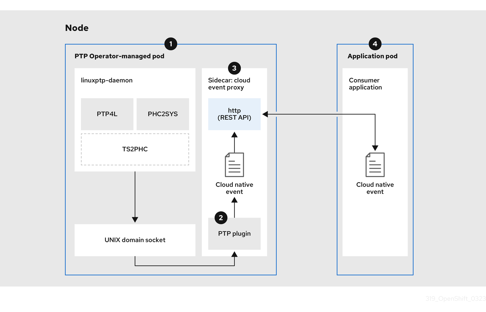

# Developing PTP events consumer applications with the REST API v2 { #ptp-cloud-events-consumer-dev-reference-v2 }

When developing consumer applications that make use of Precision Time Protocol (PTP) events on a bare-metal cluster node, you deploy your consumer application in a separate application pod. The consumer application subscribes to PTP events by using the PTP events REST API v2.

!!! note

    The following information provides general guidance for developing consumer applications that use PTP events. A complete events consumer application example is outside the scope of this information.

**Additional resources**

- [PTP events REST API v2 reference](ptp-events-rest-api-reference-v2.md#ptp-events-rest-api-reference-v2)

## About the PTP fast event notifications framework { #cnf-about-ptp-fast-event-notifications-framework-v2_ptp-consumer }

Use the Precision Time Protocol (PTP) fast event REST API v2 to subscribe cluster applications to PTP events that the bare-metal cluster node generates.

!!! note

    The fast events notifications framework uses a REST API for communication. The PTP events REST API v2 is based on the *O-RAN O-Cloud Notification API Specification for Event Consumers 4.0* that is available from [O-RAN ALLIANCE Specifications](https://orandownloadsweb.azurewebsites.net/specifications).

## Retrieving PTP events with the PTP events REST API v2 { #cnf-about-ptp-events-using-ptp-event-producer-with-o-ran-api_ptp-consumer }

Applications subscribe to PTP events by using an O-RAN v4 compatible REST API in the producer-side cloud event proxy sidecar. The `cloud-event-proxy` sidecar container can access the same resources as the primary application container without using any of the resources of the primary application and with no significant latency.

**Figure 1. Overview of consuming PTP fast events from the PTP event producer REST API v2**



 Event is generated on the cluster host
:   The `linuxptp-daemon` process in the PTP Operator-managed pod runs as a Kubernetes `DaemonSet` and manages the various `linuxptp` processes (`ptp4l`, `phc2sys`, and optionally for grandmaster clocks, `ts2phc`). The `linuxptp-daemon` passes the event to the UNIX domain socket.

 Event is passed to the cloud-event-proxy sidecar
:   The PTP plugin reads the event from the UNIX domain socket and passes it to the `cloud-event-proxy` sidecar in the PTP Operator-managed pod. `cloud-event-proxy` delivers the event from the Kubernetes infrastructure to Cloud-Native Network Functions (CNFs) with low latency.

 Event is published
:   The `cloud-event-proxy` sidecar in the PTP Operator-managed pod processes the event and publishes the event by using the PTP events REST API v2.

 Consumer application requests a subscription and receives the subscribed event
:   The consumer application sends an API request to the producer `cloud-event-proxy` sidecar to create a PTP events subscription. Once subscribed, the consumer application listens to the address specified in the resource qualifier and receives and processes the PTP events.

## Configuring the PTP fast event notifications publisher { #cnf-configuring-the-ptp-fast-event-publisher-v2_ptp-consumer }

To start using PTP fast event notifications for a network interface in your cluster, you must enable the fast event publisher in the PTP Operator `PtpOperatorConfig` custom resource (CR) and configure `ptpClockThreshold` values in a `PtpConfig` CR that you create.

**Prerequisites**

- You have installed the OpenShift Container Platform CLI (`oc`).
- You have logged in as a user with `cluster-admin` privileges.
- You have installed the PTP Operator.

**Procedure**

1. Modify the default PTP Operator config to enable PTP fast events.

    1. Save the following YAML in the `ptp-operatorconfig.yaml` file:

        ```yaml
        apiVersion: ptp.openshift.io/v1
        kind: PtpOperatorConfig
        metadata:
          name: default
          namespace: openshift-ptp
        spec:
          daemonNodeSelector:
            node-role.kubernetes.io/worker: ""
          ptpEventConfig:
            enableEventPublisher: true (1)
        ```

        1. Enable PTP fast event notifications by setting `enableEventPublisher` to `true`.

    2. Update the `PtpOperatorConfig` CR:

        ```terminal
        $ oc apply -f ptp-operatorconfig.yaml
        ```

2. Create a `PtpConfig` custom resource (CR) for the PTP enabled interface, and set the required values for `ptpClockThreshold` and `ptp4lOpts`. The following YAML illustrates the required values that you must set in the `PtpConfig` CR:

    ```yaml
    spec:
      profile:
      - name: "profile1"
        interface: "enp5s0f0"
        ptp4lOpts: "-2 -s --summary_interval -4" (1)
        phc2sysOpts: "-a -r -m -n 24 -N 8 -R 16" (2)
        ptp4lConf: "" (3)
        ptpClockThreshold: (4)
          holdOverTimeout: 5
          maxOffsetThreshold: 100
          minOffsetThreshold: -100
    ```

    1. Append `--summary_interval -4` to use PTP fast events.
    2. Required `phc2sysOpts` values. `-m` prints messages to `stdout`. The `linuxptp-daemon` `DaemonSet` parses the logs and generates Prometheus metrics.
    3. Specify a string that contains the configuration to replace the default `/etc/ptp4l.conf` file. To use the default configuration, leave the field empty.
    4. Optional. If the `ptpClockThreshold` stanza is not present, default values are used for the `ptpClockThreshold` fields. The stanza shows default `ptpClockThreshold` values. The `ptpClockThreshold` values configure how long after the PTP master clock is disconnected before PTP events are triggered. `holdOverTimeout` is the time value in seconds before the PTP clock event state changes to `FREERUN` when the PTP master clock is disconnected. The `maxOffsetThreshold` and `minOffsetThreshold` settings configure offset values in nanoseconds that compare against the values for `CLOCK_REALTIME` (`phc2sys`) or master offset (`ptp4l`). When the `ptp4l` or `phc2sys` offset value is outside this range, the PTP clock state is set to `FREERUN`. When the offset value is within this range, the PTP clock state is set to `LOCKED`.

**Additional resources**

- [Configuring linuxptp services as ordinary clock](configuring-ptp.md#configuring-linuxptp-services-as-ordinary-clock_configuring-ptp)

## PTP events REST API v2 consumer application reference { #ptp-events-consumer-application-v2_ptp-consumer }

PTP event consumer applications require the following features:

1. A web service running with a `POST` handler to receive the cloud native PTP events JSON payload
2. A `createSubscription` function to subscribe to the PTP events producer
3. A `getCurrentState` function to poll the current state of the PTP events producer

The following example Go snippets illustrate these requirements:

```go title="Example PTP events consumer server function in Go"
func server() {
  http.HandleFunc("/event", getEvent)
  http.ListenAndServe(":9043", nil)
}

func getEvent(w http.ResponseWriter, req *http.Request) {
  defer req.Body.Close()
  bodyBytes, err := io.ReadAll(req.Body)
  if err != nil {
    log.Errorf("error reading event %v", err)
  }
  e := string(bodyBytes)
  if e != "" {
    processEvent(bodyBytes)
    log.Infof("received event %s", string(bodyBytes))
  }
  w.WriteHeader(http.StatusNoContent)
}
```

```go title="Example PTP events createSubscription function in Go"
import (
"github.com/redhat-cne/sdk-go/pkg/pubsub"
"github.com/redhat-cne/sdk-go/pkg/types"
v1pubsub "github.com/redhat-cne/sdk-go/v1/pubsub"
)

// Subscribe to PTP events using v2 REST API
s1,_:=createsubscription("/cluster/node/<node_name>/sync/sync-status/sync-state")
s2,_:=createsubscription("/cluster/node/<node_name>/sync/ptp-status/lock-state")
s3,_:=createsubscription("/cluster/node/<node_name>/sync/gnss-status/gnss-sync-status")
s4,_:=createsubscription("/cluster/node/<node_name>/sync/sync-status/os-clock-sync-state")
s5,_:=createsubscription("/cluster/node/<node_name>/sync/ptp-status/clock-class")

// Create PTP event subscriptions POST
func createSubscription(resourceAddress string) (sub pubsub.PubSub, err error) {
  var status int
  apiPath := "/api/ocloudNotifications/v2/"
  localAPIAddr := "consumer-events-subscription-service.cloud-events.svc.cluster.local:9043" // vDU service API address
  apiAddr := "ptp-event-publisher-service-<node_name>.openshift-ptp.svc.cluster.local:9043" (1)
  apiVersion := "2.0"

  subURL := &types.URI{URL: url.URL{Scheme: "http",
    Host: apiAddr
    Path: fmt.Sprintf("%s%s", apiPath, "subscriptions")}}
  endpointURL := &types.URI{URL: url.URL{Scheme: "http",
    Host: localAPIAddr,
    Path: "event"}}

  sub = v1pubsub.NewPubSub(endpointURL, resourceAddress, apiVersion)
  var subB []byte

  if subB, err = json.Marshal(&sub); err == nil {
    rc := restclient.New()
    if status, subB = rc.PostWithReturn(subURL, subB); status != http.StatusCreated {
      err = fmt.Errorf("error in subscription creation api at %s, returned status %d", subURL, status)
    } else {
      err = json.Unmarshal(subB, &sub)
    }
  } else {
    err = fmt.Errorf("failed to marshal subscription for %s", resourceAddress)
  }
  return
}
```

1. Replace `<node_name>` with the FQDN of the node that is generating the PTP events. For example, `compute-1.example.com`.

```go title="Example PTP events consumer getCurrentState function in Go"
//Get PTP event state for the resource
func getCurrentState(resource string) {
  //Create publisher
  url := &types.URI{URL: url.URL{Scheme: "http",
    Host: "ptp-event-publisher-service-<node_name>.openshift-ptp.svc.cluster.local:9043", (1)
    Path: fmt.SPrintf("/api/ocloudNotifications/v2/%s/CurrentState",resource}}
  rc := restclient.New()
  status, event := rc.Get(url)
  if status != http.StatusOK {
    log.Errorf("CurrentState:error %d from url %s, %s", status, url.String(), event)
  } else {
    log.Debugf("Got CurrentState: %s ", event)
  }
}
```

1. Replace `<node_name>` with the FQDN of the node that is generating the PTP events. For example, `compute-1.example.com`.

## Reference event consumer deployment and service CRs using PTP events REST API v2 { #ptp-reference-deployment-and-service-crs-v2_ptp-consumer }

Use the following example PTP event consumer custom resources (CRs) as a reference when deploying your PTP events consumer application for use with the PTP events REST API v2.

```yaml title="Reference cloud event consumer namespace"
apiVersion: v1
kind: Namespace
metadata:
  name: cloud-events
  labels:
    security.openshift.io/scc.podSecurityLabelSync: "false"
    pod-security.kubernetes.io/audit: "privileged"
    pod-security.kubernetes.io/enforce: "privileged"
    pod-security.kubernetes.io/warn: "privileged"
    name: cloud-events
    openshift.io/cluster-monitoring: "true"
  annotations:
    workload.openshift.io/allowed: management
```

```yaml title="Reference cloud event consumer deployment"
apiVersion: apps/v1
kind: Deployment
metadata:
  name: cloud-consumer-deployment
  namespace: cloud-events
  labels:
    app: consumer
spec:
  replicas: 1
  selector:
    matchLabels:
      app: consumer
  template:
    metadata:
      annotations:
        target.workload.openshift.io/management: '{"effect": "PreferredDuringScheduling"}'
      labels:
        app: consumer
    spec:
      nodeSelector:
        node-role.kubernetes.io/worker: ""
      serviceAccountName: consumer-sa
      containers:
        - name: cloud-event-consumer
          image: cloud-event-consumer
          imagePullPolicy: Always
          args:
            - "--local-api-addr=consumer-events-subscription-service.cloud-events.svc.cluster.local:9043"
            - "--api-path=/api/ocloudNotifications/v2/"
            - "--http-event-publishers=ptp-event-publisher-service-NODE_NAME.openshift-ptp.svc.cluster.local:9043"
          env:
            - name: NODE_NAME
              valueFrom:
                fieldRef:
                  fieldPath: spec.nodeName
            - name: CONSUMER_TYPE
              value: "PTP"
            - name: ENABLE_STATUS_CHECK
              value: "true"
      volumes:
        - name: pubsubstore
          emptyDir: {}
```

```yaml title="Reference cloud event consumer service account"
apiVersion: v1
kind: ServiceAccount
metadata:
  name: consumer-sa
  namespace: cloud-events
```

```yaml title="Reference cloud event consumer service"
apiVersion: v1
kind: Service
metadata:
  annotations:
    prometheus.io/scrape: "true"
  name: consumer-events-subscription-service
  namespace: cloud-events
  labels:
    app: consumer-service
spec:
  ports:
    - name: sub-port
      port: 9043
  selector:
    app: consumer
  sessionAffinity: None
  type: ClusterIP
```

## Subscribing to PTP events with the REST API v2 { #ptp-subscribing-consumer-app-to-events-v2_ptp-consumer }

Deploy your `cloud-event-consumer` application container and subscribe the `cloud-event-consumer` application to PTP events posted by the `cloud-event-proxy` container in the pod managed by the PTP Operator.

Subscribe consumer applications to PTP events by sending a `POST` request to `http://ptp-event-publisher-service-NODE_NAME.openshift-ptp.svc.cluster.local:9043/api/ocloudNotifications/v2/subscriptions` passing the appropriate subscription request payload.

!!! note

    `9043` is the default port for the `cloud-event-proxy` container deployed in the PTP event producer pod. You can configure a different port for your application as required.

**Additional resources**

- [api/ocloudNotifications/v2/subscriptions](ptp-events-rest-api-reference-v2.md#api-ocloud-notifications-v2-subscriptions_using-ptp-hardware-fast-events-framework-v2)

## Verifying that the PTP events REST API v2 consumer application is receiving events { #ptp-verifying-events-consumer-app-is-receiving-events-v2_ptp-consumer }

Verify that the `cloud-event-consumer` container in the application pod is receiving Precision Time Protocol (PTP) events.

**Prerequisites**

- You have installed the OpenShift CLI (`oc`).
- You have logged in as a user with `cluster-admin` privileges.
- You have installed and configured the PTP Operator.
- You have deployed a cloud events application pod and PTP events consumer application.

**Procedure**

1. Check the logs for the deployed events consumer application. For example, run the following command:

    ```terminal
    $ oc -n cloud-events logs -f deployment/cloud-consumer-deployment
    ```

    ```terminal title="Example output"
    time = "2024-09-02T13:49:01Z"
    level = info msg = "transport host path is set to  ptp-event-publisher-service-compute-1.openshift-ptp.svc.cluster.local:9043"
    time = "2024-09-02T13:49:01Z"
    level = info msg = "apiVersion=2.0, updated apiAddr=ptp-event-publisher-service-compute-1.openshift-ptp.svc.cluster.local:9043, apiPath=/api/ocloudNotifications/v2/"
    time = "2024-09-02T13:49:01Z"
    level = info msg = "Starting local API listening to :9043"
    time = "2024-09-02T13:49:06Z"
    level = info msg = "transport host path is set to  ptp-event-publisher-service-compute-1.openshift-ptp.svc.cluster.local:9043"
    time = "2024-09-02T13:49:06Z"
    level = info msg = "checking for rest service health"
    time = "2024-09-02T13:49:06Z"
    level = info msg = "health check http://ptp-event-publisher-service-compute-1.openshift-ptp.svc.cluster.local:9043/api/ocloudNotifications/v2/health"
    time = "2024-09-02T13:49:07Z"
    level = info msg = "rest service returned healthy status"
    time = "2024-09-02T13:49:07Z"
    level = info msg = "healthy publisher; subscribing to events"
    time = "2024-09-02T13:49:07Z"
    level = info msg = "received event {\"specversion\":\"1.0\",\"id\":\"ab423275-f65d-4760-97af-5b0b846605e4\",\"source\":\"/sync/ptp-status/clock-class\",\"type\":\"event.sync.ptp-status.ptp-clock-class-change\",\"time\":\"2024-09-02T13:49:07.226494483Z\",\"data\":{\"version\":\"1.0\",\"values\":[{\"ResourceAddress\":\"/cluster/node/compute-1.example.com/ptp-not-set\",\"data_type\":\"metric\",\"value_type\":\"decimal64.3\",\"value\":\"0\"}]}}"
    ```

2. Optional. Test the REST API by using `oc` and port-forwarding port `9043` from the `linuxptp-daemon` deployment. For example, run the following command:

    ```terminal
    $ oc port-forward -n openshift-ptp ds/linuxptp-daemon 9043:9043
    ```

    ```terminal title="Example output"
    Forwarding from 127.0.0.1:9043 -> 9043
    Forwarding from [::1]:9043 -> 9043
    Handling connection for 9043
    ```

    Open a new shell prompt and test the REST API v2 endpoints:

    ```terminal
    $ curl -X GET http://localhost:9043/api/ocloudNotifications/v2/health
    ```

    ```terminal title="Example output"
    OK
    ```

## Monitoring PTP fast event metrics { #cnf-monitoring-fast-events-metrics-v2_ptp-consumer }

You can monitor PTP fast events metrics from cluster nodes where the `linuxptp-daemon` is running. You can also monitor PTP fast event metrics in the OpenShift Container Platform web console by using the preconfigured and self-updating Prometheus monitoring stack.

**Prerequisites**

- Install the OpenShift Container Platform CLI `oc`.
- Log in as a user with `cluster-admin` privileges.
- Install and configure the PTP Operator on a node with PTP-capable hardware.

**Procedure**

1. Start a debug pod for the node by running the following command:

    ```terminal
    $ oc debug node/<node_name>
    ```

2. Check for PTP metrics exposed by the `linuxptp-daemon` container. For example, run the following command:

    ```terminal
    sh-4.4# curl http://localhost:9091/metrics
    ```

    ```terminal title="Example output"
    # HELP cne_api_events_published Metric to get number of events published by the rest api
    # TYPE cne_api_events_published gauge
    cne_api_events_published{address="/cluster/node/compute-1.example.com/sync/gnss-status/gnss-sync-status",status="success"} 1
    cne_api_events_published{address="/cluster/node/compute-1.example.com/sync/ptp-status/lock-state",status="success"} 94
    cne_api_events_published{address="/cluster/node/compute-1.example.com/sync/ptp-status/class-change",status="success"} 18
    cne_api_events_published{address="/cluster/node/compute-1.example.com/sync/sync-status/os-clock-sync-state",status="success"} 27
    ```

3. Optional. You can also find PTP events in the logs for the `cloud-event-proxy` container. For example, run the following command:

    ```terminal
    $ oc logs -f linuxptp-daemon-cvgr6 -n openshift-ptp -c cloud-event-proxy
    ```

4. To view the PTP event in the OpenShift Container Platform web console, copy the name of the PTP metric you want to query, for example, `openshift_ptp_offset_ns`.

5. In the OpenShift Container Platform web console, click **Observe** → **Metrics**.

6. Paste the PTP metric name into the **Expression** field, and click **Run queries**.

**Additional resources**

- [Accessing metrics as a developer](https://docs.redhat.com/en/documentation/monitoring_stack_for_red_hat_openshift/latest/html/accessing_metrics/accessing-metrics-as-a-developer)

## PTP fast event metrics reference { #nw-ptp-operator-metrics-reference-v2_ptp-consumer }

The following table describes the PTP fast events metrics that are available from cluster nodes where the `linuxptp-daemon` service is running.

**PTP fast event metrics**

<table>
<thead>
<tr>
  <th>Metric</th>
  <th>Description</th>
  <th>Example</th>
</tr>
</thead>
<tbody>
<tr>
  <td><code>openshift_ptp_clock_class</code></td>
  <td>Returns the PTP clock class for the interface. Possible values for PTP clock class are 6 (<code>LOCKED</code>), 7 (<code>PRC UNLOCKED IN-SPEC</code>), 52 (<code>PRC UNLOCKED OUT-OF-SPEC</code>), 187 (<code>PRC UNLOCKED OUT-OF-SPEC</code>), 135 (<code>T-BC HOLDOVER IN-SPEC</code>), 165 (<code>T-BC HOLDOVER OUT-OF-SPEC</code>), 248 (<code>DEFAULT</code>), or 255 (<code>SLAVE ONLY CLOCK</code>).</td>
  <td><code>{node="compute-1.example.com",process="ptp4l"} 6</code></td>
</tr>
<tr>
  <td><code>openshift_ptp_clock_state</code></td>
  <td>Returns the current PTP clock state for the interface. Possible values for PTP clock state are <code>FREERUN</code>, <code>LOCKED</code>, or <code>HOLDOVER</code>.</td>
  <td><code>{iface="CLOCK_REALTIME", node="compute-1.example.com", process="phc2sys"} 1</code></td>
</tr>
<tr>
  <td><code>openshift_ptp_delay_ns</code></td>
  <td>Returns the delay in nanoseconds between the primary clock sending the timing packet and the secondary clock receiving the timing packet.</td>
  <td><code>{from="master", iface="ens2fx", node="compute-1.example.com", process="ts2phc"} 0</code></td>
</tr>
<tr>
  <td><code>openshift_ptp_ha_profile_status</code></td>
  <td>Returns the current status of the highly available system clock when there are multiple time sources on different NICs. Possible values are 0 (<code>INACTIVE</code>) and 1 (<code>ACTIVE</code>).</td>
  <td><code>{node="node1",process="phc2sys",profile="profile1"} 1</code> <code>{node="node1",process="phc2sys",profile="profile2"} 0</code></td>
</tr>
<tr>
  <td><code>openshift_ptp_frequency_adjustment_ns</code></td>
  <td>Returns the frequency adjustment in nanoseconds between 2 PTP clocks. For example, between the upstream clock and the NIC, between the system clock and the NIC, or between the PTP hardware clock (<code>phc</code>) and the NIC.</td>
  <td><code>{from="phc", iface="CLOCK_REALTIME", node="compute-1.example.com", process="phc2sys"} -6768</code></td>
</tr>
<tr>
  <td><code>openshift_ptp_interface_role</code></td>
  <td>Returns the configured PTP clock role for the interface. Possible values are 0 (<code>PASSIVE</code>), 1 (<code>SLAVE</code>), 2 (<code>MASTER</code>), 3 (<code>FAULTY</code>), 4 (<code>UNKNOWN</code>), or 5 (<code>LISTENING</code>).</td>
  <td><code>{iface="ens2f0", node="compute-1.example.com", process="ptp4l"} 2</code></td>
</tr>
<tr>
  <td><code>openshift_ptp_max_offset_ns</code></td>
  <td>Returns the maximum offset in nanoseconds between 2 clocks or interfaces. For example, between the upstream GNSS clock and the NIC (<code>ts2phc</code>), or between the PTP hardware clock (<code>phc</code>) and the system clock (<code>phc2sys</code>).</td>
  <td><code>{from="master", iface="ens2fx", node="compute-1.example.com", process="ts2phc"} 1.038099569e+09</code></td>
</tr>
<tr>
  <td><code>openshift_ptp_offset_ns</code></td>
  <td>Returns the offset in nanoseconds between the DPLL clock or the GNSS clock source and the NIC hardware clock.</td>
  <td><code>{from="phc", iface="CLOCK_REALTIME", node="compute-1.example.com", process="phc2sys"} -9</code></td>
</tr>
<tr>
  <td><code>openshift_ptp_process_restart_count</code></td>
  <td>Returns a count of the number of times the <code>ptp4l</code> and <code>ts2phc</code> processes were restarted.</td>
  <td><code>{config="ptp4l.0.config", node="compute-1.example.com",process="phc2sys"} 1</code></td>
</tr>
<tr>
  <td><code>openshift_ptp_process_status</code></td>
  <td>Returns a status code that shows whether the PTP processes are running or not.</td>
  <td><code>{config="ptp4l.0.config", node="compute-1.example.com",process="phc2sys"} 1</code></td>
</tr>
<tr>
  <td><code>openshift_ptp_threshold</code></td>
  <td>Returns values for <code>HoldOverTimeout</code>, <code>MaxOffsetThreshold</code>, and <code>MinOffsetThreshold</code>.<br><br><ul><li><code>holdOverTimeout</code> is the time value in seconds before the PTP clock event state changes to <code>FREERUN</code> when the PTP master clock is disconnected.</li><li><code>maxOffsetThreshold</code> and <code>minOffsetThreshold</code> are offset values in nanoseconds that compare against the values for <code>CLOCK_REALTIME</code> (<code>phc2sys</code>) or master offset (<code>ptp4l</code>) values that you configure in the <code>PtpConfig</code> CR for the NIC.</li></ul></td>
  <td><code>{node="compute-1.example.com", profile="grandmaster", threshold="HoldOverTimeout"} 5</code></td>
</tr>
</tbody>
</table>


### PTP fast event metrics only when T-GM is enabled { #_ptp_fast_event_metrics_only_when_t-gm_is_enabled }

The following table describes the PTP fast event metrics that are available only when PTP grandmaster clock (T-GM) is enabled.

**PTP fast event metrics when T-GM is enabled**

| Metric                           | Description                                                                                                                                                                                                                                                                                                              | Example                                                                      |
| -------------------------------- | ------------------------------------------------------------------------------------------------------------------------------------------------------------------------------------------------------------------------------------------------------------------------------------------------------------------------ | ---------------------------------------------------------------------------- |
| `openshift_ptp_frequency_status` | Returns the current status of the digital phase-locked loop (DPLL) frequency for the NIC. Possible values are -1 (`UNKNOWN`), 0 (`INVALID`), 1 (`FREERUN`), 2 (`LOCKED`), 3 (`LOCKED_HO_ACQ`), or 4 (`HOLDOVER`).                                                                                                        | `{from="dpll",iface="ens2fx",node="compute-1.example.com",process="dpll"} 3` |
| `openshift_ptp_nmea_status`      | Returns the current status of the NMEA connection. NMEA is the protocol that is used for 1PPS NIC connections. Possible values are 0 (`UNAVAILABLE`) and 1 (`AVAILABLE`).                                                                                                                                                | `{iface="ens2fx",node="compute-1.example.com",process="ts2phc"} 1`           |
| `openshift_ptp_phase_status`     | Returns the status of the DPLL phase for the NIC. Possible values are -1 (`UNKNOWN`), 0 (`INVALID`), 1 (`FREERUN`), 2 (`LOCKED`), 3 (`LOCKED_HO_ACQ`), or 4 (`HOLDOVER`).                                                                                                                                                | `{from="dpll",iface="ens2fx",node="compute-1.example.com",process="dpll"} 3` |
| `openshift_ptp_pps_status`       | Returns the current status of the NIC 1PPS connection. You use the 1PPS connection to synchronize timing between connected NICs. Possible values are 0 (`UNAVAILABLE`) and 1 (`AVAILABLE`).                                                                                                                              | `{from="dpll",iface="ens2fx",node="compute-1.example.com",process="dpll"} 1` |
| `openshift_ptp_gnss_status`      | Returns the current status of the global navigation satellite system (GNSS) connection. GNSS provides satellite-based positioning, navigation, and timing services globally. Possible values are 0 (`NOFIX`), 1 (`DEAD RECKONING ONLY`), 2 (`2D-FIX`), 3 (`3D-FIX`), 4 (`GPS+DEAD RECKONING FIX`), 5, (`TIME ONLY FIX`). | `{from="gnss",iface="ens2fx",node="compute-1.example.com",process="gnss"} 3` |
