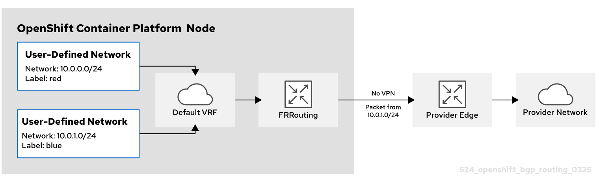
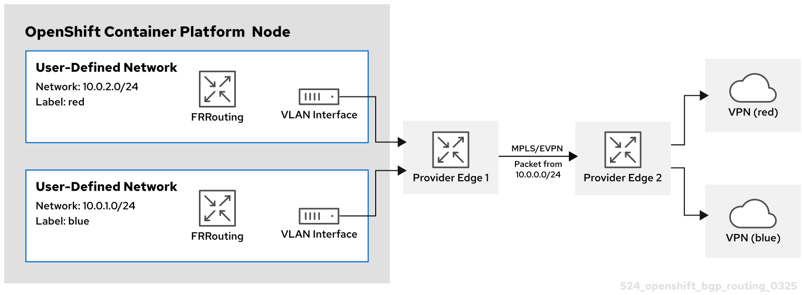

# About route advertisements { #about-route-advertisements }

To simplify network management and improve failover visibility, you can use route advertisements to share pod and egress IP routes between your cluster and the provider network. This feature requires the OVN-Kubernetes plugin and a Border Gateway Protocol (BGP) provider.

For more information, see [About BGP routing](../bgp_routing/about-bgp-routing.md#about-bgp-routing).

## Advertise cluster network routes with Border Gateway Protocol { #nw-routeadvertisements-about_about-route-advertisements }

To simplify routing and improve failover visibility without manual route management, you can enable route advertisements. Route advertisements allow you to advertise default and user-defined network routes, including EgressIPs, between your cluster and the provider network.

With route advertisements enabled, you can advertise network routes for the default pod network and user-defined networks to the provider network, including EgressIPs, and importing routes from the provider network to the default pod network and CUDNs. This simplifies routing while improving failover visibility, and eliminates manual route management.

From the provider network, IP addresses advertised from the default pod network and user defined networks can be reached directly and vice versa.

For example, you can import routes to the default pod network so you no longer need to manually configure routes on each node. Previously, you might have been setting the `routingViaHost` parameter to `true` and manually configuring routes on each node to approximate a similar configuration. With route advertisements you can accomplish this task seamlessly with `routingViaHost` parameter set to `false`.

You could also set the `routingViaHost` parameter to `true` in the `Network` custom resource CR for your cluster, but you must then manually configure routes on each node to simulate a similar configuration. When you enable route advertisements, you can set `routingViaHost=false` in the `Network` CR without having to then manually configure routes one each node.

Route reflectors on the provider network are supported and can reduce the number of BGP connections required to advertise routes on large networks.

If you use EgressIPs with route advertisements enabled, the layer 3 provider network is aware of EgressIP failovers. This means that you can locate cluster nodes that host EgressIPs on different layer 2 segments whereas before only the layer 2 provider network was aware so that required all the egress nodes to be on the same layer 2 segment.

### Supported platforms { #supported-platforms_about-route-advertisements }

Advertising routes with border gateway protocol (BGP) is supported on the bare-metal infrastructure type.

### Infrastructure requirements { #infrastructure-requirements_about-route-advertisements }

To use route advertisements, you must have configured BGP for your network infrastructure. Outages or misconfigurations of your network infrastructure might cause disruptions to your cluster network.

### Compatibility with other networking features { #compatibility-with-other-networking-features_about-route-advertisements }

Route advertisements support the following OpenShift Container Platform Networking features:

Multiple external gateways (MEG)
:   MEG is not supported with this feature.

EgressIPs
:   Supports the use and advertisement of EgressIPs. The node where an egress IP address resides advertises the EgressIP. An egress IP address must be on the same layer 2 network subnet as the egress node. The following limitations apply:

    - Advertising EgressIPs from a user-defined network (CUDN) operating in layer 2 mode are not supported.
    - Advertising EgressIPs for a network that has both egress IP addresses assigned to the primary network interface and egress IP addresses assigned to additional network interfaces is impractical. All EgressIPs are advertised on all of the BGP sessions of the selected FRRConfiguration instances, regardless of whether these sessions are established over the same interface that the EgressIP is assigned to or not, potentially leading to unwanted advertisements.

Services
:   Works with the MetalLB Operator to advertise services to the provider network.

Egress service
:   Full support.

Egress firewall
:   Full support.

Egress QoS
:   Full support.

Network policies
:   Full support.

Direct pod ingress
:   Full support for the default cluster network and cluster user-defined (CUDN) networks.

### Considerations for use with the MetalLB Operator { #considerations-for-use-with-the-metallb-operator_about-route-advertisements }

The MetalLB Operator is installed as an add-on to the cluster. Deployment of the MetalLB Operator automatically enables FRR-K8s as an additional routing capability provider. This feature and the MetalLB Operator use the same FRR-K8s deployment.

### Considerations for naming cluster user-defined networks (CUDNs) { #considerations-for-naming-cluster-user-defined-networks_about-route-advertisements }

When referencing a VRF device in a `FRRConfiguration` CR, the VRF name is the same as the CUDN name for VRF names that are less than or equal to 15 characters. It is recommended to use a VRF name no longer than 15 characters so that the VRF name can be inferred from the CUDN name.

### BGP routing custom resources { #bgp-routing-custom-resources_about-route-advertisements }

The following custom resources (CRs) are used to configure route advertisements with BGP:

`RouteAdvertisements`
:   This CR defines the advertisements for the BGP routing. From this CR, the OVN-Kubernetes controller generates a `FRRConfiguration` object that configures the FRR daemon to advertise cluster network routes. This CR is cluster scoped.

`FRRConfiguration`
:   This CR is used to define BGP peers and to configure route imports from the provider network into the cluster network. Before applying `RouteAdvertisements` objects, at least one FRRConfiguration object must be initially defined to configure the BGP peers. This CR is namespaced.

### OVN-Kubernetes controller generation of `FRRConfiguration` objects { #ovn-kubernetes-controller-generation-of-frrconfiguration-objects_about-route-advertisements }

An `FRRConfiguration` object is generated for each network and node selected by a `RouteAdvertisements` CR with the appropriate advertised prefixes that apply to each node. The OVN-Kubernetes controller checks whether the `RouteAdvertisements`-CR-selected nodes are a subset of the nodes that are selected by the `RouteAdvertisements`-CR-selected FRR configurations.

Any filtering or selection of prefixes to receive are not considered in `FRRConfiguration` objects that are generated from the `RouteAdvertisement` CRs. Configure any prefixes to receive on other `FRRConfiguration` objects. OVN-Kubernetes imports routes from the VRF into the appropriate network.

### Cluster Network Operator configuration { #cluster-network-operator_about-route-advertisements }

The Cluster Network Operator (CNO) API exposes several fields to configure route advertisements:

- `spec.additionalRoutingCapabilities.providers`: Specifies an additional routing provider, which is required to advertise routes. The only supported value is `FRR`, which enables deployment of the FRR-K8S daemon for the cluster. When enabled, the FRR-K8S daemon is deployed on all nodes.
- `spec.defaultNetwork.ovnKubernetesConfig.routeAdvertisements`: Enables route advertisements for the default cluster network and CUDN networks. The `spec.additionalRoutingCapabilities` field must be set to `FRR` to enable this feature.

## RouteAdvertisements object configuration { #nw-bgp-routeadvertisements-object_about-route-advertisements }

To control how cluster networks and egress IP addresses are advertised to external routers, configure the cluster-scoped `RouteAdvertisements` object to specify networks and select the appropriate nodes and routing targets for your environment.

You can define a `RouteAdvertisements` object, which is cluster scoped, with the following properties.

The fields for the `RouteAdvertisements` custom resource (CR) are described in the following table:

**`RouteAdvertisements` object**

| Field                      | Type     | Description                                                                                                                                                                                                                                                                                                                                                       |
| -------------------------- | -------- | ----------------------------------------------------------------------------------------------------------------------------------------------------------------------------------------------------------------------------------------------------------------------------------------------------------------------------------------------------------------- |
| `metadata.name`            | `string` | Specifies the name of the `RouteAdvertisements` object.                                                                                                                                                                                                                                                                                                           |
| `advertisements`           | `array`  | Specifies an array that can contain a list of different types of networks to advertise. Supports only the `"PodNetwork"` and `"EgressIP"` values.                                                                                                                                                                                                                 |
| `frrConfigurationSelector` | `object` | Determines which `FRRConfiguration` CR the OVN-Kubernetes-driven `FRRConfiguration` CR is based on.                                                                                                                                                                                                                                                               |
| `networkSelectors`         | `array`  | Specifies which networks to advertise among the default cluster network and cluster user-defined networks (CUDNs). Each entry sets `networkSelectionType` and the selector for that type (for example, `DefaultNetwork` or `ClusterUserDefinedNetworks` with `clusterUserDefinedNetworkSelector`).                                                                |
| `nodeSelector`             | `object` | Limits the advertisements to selected nodes. When `advertisements="PodNetwork"` is selected, all nodes must be selected. When `advertisements="EgressIP"` is selected, only the egress IP addresses assigned to the selected nodes are advertised.                                                                                                                |
| `targetVRF`                | `string` | Determines which router to advertise the routes in. Routes are advertised on the routers associated with this virtual routing and forwarding (VRF) target, as specified on the selected `FRRConfiguration` CR. When omitted, the default VRF is used as the target. When specified as `auto`, a VRF with the same name as the network name is used as the target. |

## Examples advertising pod IP addresses with BGP { #nw-bgp-examples_about-route-advertisements }

To implement Border Gateway Protocol (BGP) for your cluster, you can use these examples to configure route advertisements for pod IP addresses and egress IP addresses. Examples include configurations for default cluster networks, user-defined networks, and VRF-lite designs.

The following examples describe several configurations for advertising pod IP addresses and EgressIPs with Border Gateway Protocol (BGP). The external network border router has the `172.18.0.5` IP address. These configures assume that you have configured an external route reflector that can relay routes to all nodes on the cluster network.

### Advertising the default cluster network { #advertising-the-default-cluster-network_about-route-advertisements }

In this scenario, the default cluster network is exposed to the external network so that pod IP addresses and EgressIPs are advertised to the provider network.

This scenario relies upon the following `FRRConfiguration` object:

```yaml title="FRRConfiguration CR"
apiVersion: k8s.ovn.org/v1
kind: RouteAdvertisements
metadata:
  name: default
spec:
  advertisements:
  - PodNetwork
  - EgressIP
  networkSelectors:
  - networkSelectionType: DefaultNetwork
  frrConfigurationSelector:
    matchLabels:
      routeAdvertisements: receive-all
  nodeSelector: {}
```

When the OVN-Kubernetes controller sees this `RouteAdvertisements` CR, it generates further `FRRConfiguration` objects based on the selected ones that configure the FRR daemon to advertise the routes for the default cluster network.

```yaml title="An example of a FRRConfiguration CR generated by OVN-Kubernetes"
apiVersion: frrk8s.metallb.io/v1beta1
kind: FRRConfiguration
metadata:
  name: ovnk-generated-abcdef
  namespace: openshift-frr-k8s
spec:
  bgp:
    routers:
    - asn: 64512
      neighbors:
        - address: 172.18.0.5
          asn: 64512
          toReceive:
            allowed:
              mode: filtered
          toAdvertise:
            allowed:
              prefixes:
              - <default_network_host_subnet>
      prefixes:
      - <default_network_host_subnet>
  nodeSelector:
    matchLabels:
      kubernetes.io/hostname: ovn-worker
```

In the example generated `FRRConfiguration` object, `<default_network_host_subnet>` is the subnet of the default cluster network that is advertised to the provider network.

### Advertising pod IPs from a cluster user-defined network over BGP { #advertising-pod-ips-from-a-user-defined-network-over-bgp_about-route-advertisements }

In this scenario, the blue cluster user-defined network (CUDN) is exposed to the external network so that the network’s pod IP addresses and EgressIPs are advertised to the provider network.

This scenario relies upon the following `FRRConfiguration` object:

```yaml title="FRRConfiguration CR"
apiVersion: frrk8s.metallb.io/v1beta1
kind: FRRConfiguration
metadata:
  name: receive-all
  namespace: openshift-frr-k8s
  labels:
    routeAdvertisements: receive-all
spec:
  bgp:
    routers:
    - asn: 64512
      neighbors:
      - address: 172.18.0.5
        asn: 64512
        disableMP: true
        toReceive:
          allowed:
            mode: all
```

With this `FRRConfiguration` object, routes will be imported from neighbor `172.18.0.5` into the default VRF and are available to the default cluster network.

The CUDNs are advertised over the default VRF as illustrated in the following diagram:



Red CUDN
:   - A VRF named `red` associated with a CUDN named `red`
    - A subnet of `10.0.0.0/24`

Blue CUDN
:   - A VRF named `blue` associated with a CUDN named `blue`
    - A subnet of `10.0.1.0/24`

In this configuration, two separate CUDNs are defined. The red network covers the `10.0.0.0/24` subnet and the blue network covers the `10.0.1.0/24` subnet. The red and blue networks are labeled as `export: true`.

The following `RouteAdvertisements` CR describes the configuration for the red and blue tenants:

```yaml title="RouteAdvertisements CR for the red and blue tenants"
apiVersion: k8s.ovn.org/v1
kind: RouteAdvertisements
metadata:
  name: advertise-cudns
spec:
  advertisements:
  - PodNetwork
  - EgressIP
  networkSelectors:
  - networkSelectionType: ClusterUserDefinedNetworks
    clusterUserDefinedNetworkSelector:
      networkSelector:
        matchLabels:
          export: "true"
  frrConfigurationSelector:
    matchLabels:
      routeAdvertisements: receive-all
  nodeSelector: {}
```

When the OVN-Kubernetes controller sees this `RouteAdvertisements` CR, it generates further `FRRConfiguration` objects based on the selected ones that configure the FRR daemon to advertise the routes. The following example is of one such configuration object, with the number of `FRRConfiguration` objects created depending on the node and networks selected.

```yaml title="An example of a FRRConfiguration CR generated by OVN-Kubernetes"
apiVersion: frrk8s.metallb.io/v1beta1
kind: FRRConfiguration
metadata:
  name: ovnk-generated-abcdef
  namespace: openshift-frr-k8s
spec:
  bgp:
    routers:
    - asn: 64512
      vrf: blue
      imports:
      - vrf: default
    - asn: 64512
      neighbors:
        - address: 172.18.0.5
          asn: 64512
          toReceive:
            allowed:
              mode: filtered
          toAdvertise:
            allowed:
              prefixes:
              - 10.0.1.0/24
      prefixes:
      - 10.0.1.0/24
      imports:
      - vrf: blue
  nodeSelector:
    matchLabels:
      kubernetes.io/hostname: ovn-worker
```

The generated `FRRConfiguration` object configures the subnet `10.0.1.0/24`, which belongs to network blue, to be imported into the default VRF and advertised to the `172.18.0.5` neighbor. An `FRRConfiguration` object is generated for each network and nodes selected by a `RouteAdvertisements` CR with the appropriate prefixes that apply to each node.

When the `targetVRF` field is omitted, the routes are leaked and advertised over the default VRF. Additionally, routes that were imported to the default VRF after the definition of the initial FRRConfiguration object are also imported into the blue VRF.

### Advertising pod IPs from a cluster user-defined network over BGP with VPN { #advertising-pod-ips-from-a-user-defined-network-over-bgp-with-vpn_about-route-advertisements }

In this scenario, a VLAN interface is attached to the VRF device associated with the blue network. This setup provides a *VRF lite* design, where FRR-K8S is used to advertise the blue network only over the corresponding BGP session on the blue network VRF/VLAN link to the next hop Provide Edge (PE) router. The red tenant uses the same configuration. The blue and red networks are labeled as `export: true`.

!!! warning

    This scenario does not support the use of EgressIPs.

The following diagram illustrates this configuration:



Red CUDN
:   - A VRF named `red` associated with a CUDN named `red`
    - A VLAN interface attached to the VRF device and connected to the external PE router
    - An assigned subnet of `10.0.2.0/24`

Blue CUDN
:   - A VRF named `blue` associated with a CUDN named `blue`
    - A VLAN interface attached to the VRF device and connected to the external PE router
    - An assigned subnet of `10.0.1.0/24`

!!! note

    This approach is available only when you set `routingViaHost=true` in the `ovnKubernetesConfig.gatewayConfig` specification of the OVN-Kubernetes network plugin.

In the following configuration, an additional `FRRConfiguration` CR configures peering with the PE router on the blue and red VLANs:

```yaml title="FRRConfiguration CR manually configured for BGP VPN setup"
apiVersion: frrk8s.metallb.io/v1beta1
kind: FRRConfiguration
metadata:
  name: vpn-blue-red
  namespace: openshift-frr-k8s
  labels:
    routeAdvertisements: vpn-blue-red
spec:
  bgp:
    routers:
    - asn: 64512
      vrf: blue
      neighbors:
      - address: 182.18.0.5
        asn: 64512
        toReceive:
          allowed:
            mode: filtered
    - asn: 64512
      vrf: red
      neighbors:
      - address: 192.18.0.5
        asn: 64512
        toReceive:
          allowed:
            mode: filtered
```

The following `RouteAdvertisements` CR describes the configuration for the blue and red tenants:

```yaml title="RouteAdvertisements CR for the blue and red tenants"
apiVersion: k8s.ovn.org/v1
kind: RouteAdvertisements
metadata:
  name: advertise-vrf-lite
spec:
  targetVRF: auto
  advertisements:
  - "PodNetwork"
  nodeSelector: {}
  frrConfigurationSelector:
    matchLabels:
      routeAdvertisements: vpn-blue-red
  networkSelectors:
  - networkSelectionType: ClusterUserDefinedNetworks
    clusterUserDefinedNetworkSelector:
      networkSelector:
        matchLabels:
          export: "true"
```

In the `RouteAdvertisements` CR, the `targetVRF` is set to `auto` so that advertisements occur within the VRF device that corresponds to the individual networks that are selected. In this scenario, the pod subnet for blue is advertised over the blue VRF device, and the pod subnet for red is advertised over the red VRF device. Additionally, each BGP session imports routes to only the corresponding CUDN VRF as defined by the initial `FRRConfiguration` object.

When the OVN-Kubernetes controller sees this `RouteAdvertisements` CR, it generates further `FRRConfiguration` objects based on the selected ones that configure the FRR daemon to advertise the routes for the blue and red tenants.

```yaml title="FRRConfiguration CR generated by OVN-Kubernetes for blue and red tenants"
apiVersion: frrk8s.metallb.io/v1beta1
kind: FRRConfiguration
metadata:
  name: ovnk-generated-abcde
  namespace: openshift-frr-k8s
spec:
  bgp:
    routers:
    - asn: 64512
      neighbors:
      - address: 182.18.0.5
        asn: 64512
        toReceive:
          allowed:
            mode: filtered
        toAdvertise:
          allowed:
            prefixes:
            - 10.0.1.0/24
      vrf: blue
      prefixes:
        - 10.0.1.0/24
    - asn: 64512
      neighbors:
      - address: 192.18.0.5
        asn: 64512
        toReceive:
          allowed:
            mode: filtered
        toAdvertise:
          allowed:
            prefixes:
            - 10.0.2.0/24
      vrf: red
      prefixes:
         - 10.0.2.0/24
  nodeSelector:
     matchLabels:
        kubernetes.io/hostname: ovn-worker
```

In this scenario, any filtering or selection of routes to receive must be done in the `FRRConfiguration` CR that defines peering relationships.

**Additional resources**

- [Configuring the FRRConfiguration CRD](../../ingress_load_balancing/metallb/metallb-frr-k8s.md#nw-metallb-frrconfiguration-crd_configure-metallb-frr-k8s)
- [Starting a service within an isolated VRF network](https://docs.redhat.com/en/documentation/red_hat_enterprise_linux/8/html/configuring_and_managing_networking/assembly_starting-a-service-within-an-isolated-vrf-network_configuring-and-managing-networking)
- [FRRouting User Guide: BGP](https://docs.frrouting.org/en/latest/bgp.html)
