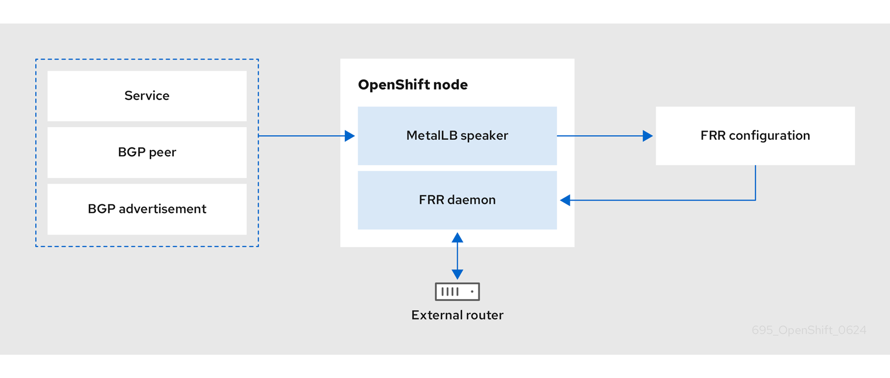

# Configuring the integration of MetalLB and FRR-K8s { #metallb-configure-frr-k8s }

To access advanced routing services not natively provided by MetalLB, configure the `FRRConfiguration` custom resource (CR). Defining the CR exposes specific FRRouting (FRR) capabilities and extends the routing functionality of your cluster beyond standard MetalLB advertisements.

FRRouting (FRR) is a free, open-source internet routing protocol suite for Linux and UNIX platforms. `FRR-K8s` is a Kubernetes-based DaemonSet that exposes a subset of the `FRR` API in a Kubernetes-compliant manner. `MetalLB` generates the `FRR-K8s` configuration corresponding to the MetalLB configuration applied.



!!! warning

    When configuring Virtual Route Forwarding (VRF), you must change the VRFs to a table ID lower than `1000` as higher than `1000` is reserved for OpenShift Container Platform.

## FRR configurations { #nw-metallb-configuring-frr-k8s-configurations_configure-metallb-frr-k8s }

You can create multiple `FRRConfiguration` CRs to use `FRR` services in `MetalLB`.

`MetalLB` generates an `FRRConfiguration` object which `FRR-K8s` merges with all other configurations that all users have created. For example, you can configure `FRR-K8s` to receive all of the prefixes advertised by a given neighbor. The following example configures `FRR-K8s` to receive all of the prefixes advertised by a `BGPPeer` with host `172.18.0.5`:

```yaml title="Example FRRConfiguration CR"
apiVersion: frrk8s.metallb.io/v1beta1
kind: FRRConfiguration
metadata:
 name: test
 namespace: metallb-system
spec:
 bgp:
   routers:
   - asn: 64512
     neighbors:
     - address: 172.18.0.5
       asn: 64512
       toReceive:
        allowed:
            mode: all
# ...
```

You can also configure FRR-K8s to always block a set of prefixes, regardless of the configuration applied. This is useful to prevent routes to pod or `ClusterIPs` CIDRs that might cause cluster malfunctions. For example, you might block the `clusterNetwork` and `serviceNetwork` CIDRs. Run `oc describe network.config/cluster` to find these values.

The following example blocks the prefix `192.168.1.0/24`:

```yaml title="Example MetalLB CR"
apiVersion: metallb.io/v1beta1
kind: MetalLB
metadata:
  name: metallb
  namespace: metallb-system
spec:
  frrk8sConfig:
    alwaysBlock:
    - 192.168.1.0/24
# ...
```

## Configuring the FRRConfiguration CR { #nw-metallb-frrconfiguration-crd_configure-metallb-frr-k8s }

To customize routing behavior beyond standard MetalLB capabilities, configure the `FRRConfiguration` custom resource (CR).

The following reference examples demonstrate how to define specific FRRouting (FRR) parameters to enable advanced services, such as receiving routes:

The `routers` parameter
:   You can use the `routers` parameter to configure multiple routers, one for each Virtual Routing and Forwarding (VRF) resource. For each router, you must define the Autonomous System Number (ASN).

    You can also define a list of Border Gateway Protocol (BGP) neighbors to connect to, as in the following example:

    ```yaml title="Example FRRConfiguration CR"
    apiVersion: frrk8s.metallb.io/v1beta1
    kind: FRRConfiguration
    metadata:
      name: test
      namespace: frr-k8s-system
    spec:
      bgp:
        routers:
        - asn: 64512
          neighbors:
          - address: 172.30.0.3
            asn: 4200000000
            ebgpMultiHop: true
            port: 180
          - address: 172.18.0.6
            asn: 4200000000
            port: 179
    # ...
    ```

The `toAdvertise` parameter
:   By default, `FRR-K8s` does not advertise the prefixes configured as part of a router configuration. To advertise the prefixes, you use the `toAdvertise` parameter.

    You can advertise a subset of the prefixes, as in the following example:

    ```yaml title="Example FRRConfiguration CR"
    apiVersion: frrk8s.metallb.io/v1beta1
    kind: FRRConfiguration
    metadata:
      name: test
      namespace: frr-k8s-system
    spec:
      bgp:
        routers:
        - asn: 64512
          neighbors:
          - address: 172.30.0.3
            asn: 4200000000
            ebgpMultiHop: true
            port: 180
            toAdvertise:
              allowed:
                prefixes:
                - 192.168.2.0/24
          prefixes:
            - 192.168.2.0/24
            - 192.169.2.0/24
    # ...
    ```

    - `allowed.prefixes`: Advertises a subset of prefixes.

    The following example shows you how to advertise all of the prefixes:

    ```yaml title="Example FRRConfiguration CR"
    apiVersion: frrk8s.metallb.io/v1beta1
    kind: FRRConfiguration
    metadata:
      name: test
      namespace: frr-k8s-system
    spec:
      bgp:
        routers:
        - asn: 64512
          neighbors:
          - address: 172.30.0.3
            asn: 4200000000
            ebgpMultiHop: true
            port: 180
            toAdvertise:
              allowed:
                mode: all
          prefixes:
            - 192.168.2.0/24
            - 192.169.2.0/24
    # ...
    ```

    - `allowed.mode`: Advertises all prefixes.

The `toReceive` parameter
:   By default, `FRR-K8s` does not process any prefixes advertised by a neighbor. You can use the `toReceive` parameter to process such addresses.

    You can configure for a subset of the prefixes, as in this example:

    ```yaml title="Example FRRConfiguration CR"
    apiVersion: frrk8s.metallb.io/v1beta1
    kind: FRRConfiguration
    metadata:
      name: test
      namespace: frr-k8s-system
    spec:
      bgp:
        routers:
        - asn: 64512
          neighbors:
          - address: 172.18.0.5
              asn: 64512
              port: 179
              toReceive:
                allowed:
                  prefixes:
                  - prefix: 192.168.1.0/24
                  - prefix: 192.169.2.0/24
                    ge: 25
                    le: 28
    # ...
    ```

    - `prefixes`: The prefix is applied if the prefix length is less than or equal to the `le` prefix length and greater than or equal to the `ge` prefix length.

    The following example configures FRR to handle all the prefixes announced:

    ```yaml title="Example FRRConfiguration CR"
    apiVersion: frrk8s.metallb.io/v1beta1
    kind: FRRConfiguration
    metadata:
      name: test
      namespace: frr-k8s-system
    spec:
      bgp:
        routers:
        - asn: 64512
          neighbors:
          - address: 172.18.0.5
              asn: 64512
              port: 179
              toReceive:
                allowed:
                  mode: all
    # ...
    ```

The `bgp` parameter
:   You can use the `bgp` parameter to define various `BFD` profiles and associate them with a neighbor. In the following example, `BFD` backs up the `BGP` session and `FRR` can detect link failures:

    ```yaml title="Example FRRConfiguration CR"
    apiVersion: frrk8s.metallb.io/v1beta1
    kind: FRRConfiguration
    metadata:
      name: test
      namespace: frr-k8s-system
    spec:
      bgp:
        routers:
        - asn: 64512
          neighbors:
          - address: 172.30.0.3
            asn: 64512
            port: 180
            bfdProfile: defaultprofile
        bfdProfiles:
          - name: defaultprofile
    # ...
    ```

The `nodeSelector` parameter
:   By default, `FRR-K8s` applies the configuration to all nodes where the daemon is running. You can use the `nodeSelector` parameter to specify the nodes to which you want to apply the configuration. For example:

    ```yaml title="Example FRRConfiguration CR"
    apiVersion: frrk8s.metallb.io/v1beta1
    kind: FRRConfiguration
    metadata:
      name: test
      namespace: frr-k8s-system
    spec:
      bgp:
        routers:
        - asn: 64512
      nodeSelector:
        labelSelector:
        foo: "bar"
    # ...
    ```

The `interface` parameter
:   You can use the `interface` parameter to configure unnumbered BGP peering by using the following example configuration:

    ```yaml title="Example FRRConfiguration CR"
    apiVersion: frrk8s.metallb.io/v1beta1
    kind: FRRConfiguration
    metadata:
      name: test
      namespace: frr-k8s-system
    spec:
      bgp:
        bfdProfiles:
        - echoMode: false
          name: simple
          passiveMode: false
        routers:
        - asn: 64512
          neighbors:
          - asn: 64512
            bfdProfile: simple
            disableMP: false
            interface: net10
            port: 179
            toAdvertise:
              allowed:
                mode: filtered
                prefixes:
                - 5.5.5.5/32
            toReceive:
              allowed:
                mode: filtered
          prefixes:
          - 5.5.5.5/32
    # ...
    ```

    - `neighbors.interface`: Activates unnumbered BGP peering.

    !!! note

        To use the `interface` parameter, you must establish a point-to-point, layer 2 connection between the two BGP peers. You can use unnumbered BGP peering with IPv4, IPv6, or dual-stack, but you must enable IPv6 RAs (Router Advertisements). Each interface is limited to one BGP connection.

        If you use this parameter, you cannot specify a value in the `spec.bgp.routers.neighbors.address` parameter.

The parameters for the `FRRConfiguration` custom resource are described in the following table:

**MetalLB FRRConfiguration custom resource**

<table>
<thead>
<tr>
  <th>Parameter</th>
  <th>Type</th>
  <th>Description</th>
</tr>
</thead>
<tbody>
<tr>
  <td><code>spec.bgp.routers</code></td>
  <td><code>array</code></td>
  <td>Specifies the routers that FRR is to configure (one per VRF).</td>
</tr>
<tr>
  <td><code>spec.bgp.routers.asn</code></td>
  <td><code>integer</code></td>
  <td>The Autonomous System Number (ASN) to use for the local end of the session.</td>
</tr>
<tr>
  <td><code>spec.bgp.routers.id</code></td>
  <td><code>string</code></td>
  <td>Specifies the ID of the <code>bgp</code> router.</td>
</tr>
<tr>
  <td><code>spec.bgp.routers.vrf</code></td>
  <td><code>string</code></td>
  <td>Specifies the host VRF used to establish sessions from this router.</td>
</tr>
<tr>
  <td><code>spec.bgp.routers.neighbors</code></td>
  <td><code>array</code></td>
  <td>Specifies the neighbors to establish BGP sessions with.</td>
</tr>
<tr>
  <td><code>spec.bgp.routers.neighbors.asn</code></td>
  <td><code>integer</code></td>
  <td>Specifies the ASN to use for the remote end of the session. If you use this parameter, you cannot specify a value in the <code>spec.bgp.routers.neighbors.dynamicASN</code> parameter.</td>
</tr>
<tr>
  <td><code>spec.bgp.routers.neighbors.dynamicASN</code></td>
  <td><code>string</code></td>
  <td>Detects the ASN to use for the remote end of the session without explicitly setting it. Specify <code>internal</code> for a neighbor with the same ASN, or <code>external</code> for a neighbor with a different ASN. If you use this parameter, you cannot specify a value in the <code>spec.bgp.routers.neighbors.asn</code> parameter.</td>
</tr>
<tr>
  <td><code>spec.bgp.routers.neighbors.address</code></td>
  <td><code>string</code></td>
  <td>Specifies the IP address to establish the session with. If you use this parameter, you cannot specify a value in the <code>spec.bgp.routers.neighbors.interface</code> parameter.</td>
</tr>
<tr>
  <td><code>spec.bgp.routers.neighbors.interface</code></td>
  <td><code>string</code></td>
  <td>Specifies the interface name to use when establishing a session. Use this parameter to configure unnumbered BGP peering. There must be a point-to-point, layer 2 connection between the two BGP peers. You can use unnumbered BGP peering with IPv4, IPv6, or dual-stack, but you must enable IPv6 RAs (Router Advertisements). Each interface is limited to one BGP connection.</td>
</tr>
<tr>
  <td><code>spec.bgp.routers.neighbors.port</code></td>
  <td><code>integer</code></td>
  <td>Specifies the port to dial when establishing the session. Defaults to <code>179</code>.</td>
</tr>
<tr>
  <td><code>spec.bgp.routers.neighbors.password</code></td>
  <td><code>string</code></td>
  <td>Specifies the password to use for establishing the BGP session. <code>Password</code> and <code>PasswordSecret</code> are mutually exclusive.</td>
</tr>
<tr>
  <td><code>spec.bgp.routers.neighbors.passwordSecret</code></td>
  <td><code>string</code></td>
  <td>Specifies the name of the authentication secret for the neighbor. The secret must be of type "kubernetes.io/basic-auth", and in the same namespace as the FRR-K8s daemon. The key "password" stores the password in the secret. <code>Password</code> and <code>PasswordSecret</code> are mutually exclusive.</td>
</tr>
<tr>
  <td><code>spec.bgp.routers.neighbors.holdTime</code></td>
  <td><code>duration</code></td>
  <td>Specifies the requested BGP hold time, per RFC4271. Defaults to 180s.</td>
</tr>
<tr>
  <td><code>spec.bgp.routers.neighbors.keepaliveTime</code></td>
  <td><code>duration</code></td>
  <td>Specifies the requested BGP keepalive time, per RFC4271. Defaults to <code>60s</code>.</td>
</tr>
<tr>
  <td><code>spec.bgp.routers.neighbors.connectTime</code></td>
  <td><code>duration</code></td>
  <td>Specifies how long BGP waits between connection attempts to a neighbor.</td>
</tr>
<tr>
  <td><code>spec.bgp.routers.neighbors.ebgpMultiHop</code></td>
  <td><code>boolean</code></td>
  <td>Indicates if the BGPPeer is a multi-hop away.</td>
</tr>
<tr>
  <td><code>spec.bgp.routers.neighbors.bfdProfile</code></td>
  <td><code>string</code></td>
  <td>Specifies the name of the BFD Profile to use for the BFD session associated with the BGP session. If not set, the BFD session is not set up.</td>
</tr>
<tr>
  <td><code>spec.bgp.routers.neighbors.toAdvertise.allowed</code></td>
  <td><code>array</code></td>
  <td>Represents the list of prefixes to advertise to a neighbor, and the associated properties.</td>
</tr>
<tr>
  <td><code>spec.bgp.routers.neighbors.toAdvertise.allowed.prefixes</code></td>
  <td><code>string array</code></td>
  <td>Specifies the list of prefixes to advertise to a neighbor. This list must match the prefixes that you define in the router.</td>
</tr>
<tr>
  <td><code>spec.bgp.routers.neighbors.toAdvertise.allowed.mode</code></td>
  <td><code>string</code></td>
  <td>Specifies the mode to use when handling the prefixes. You can set to <code>filtered</code> to allow only the prefixes in the prefixes list. You can set to <code>all</code> to allow all the prefixes configured on the router.</td>
</tr>
<tr>
  <td><code>spec.bgp.routers.neighbors.toAdvertise.withLocalPref</code></td>
  <td><code>array</code></td>
  <td>Specifies the prefixes associated with an advertised local preference. You must specify the prefixes associated with a local preference in the prefixes allowed to be advertised.</td>
</tr>
<tr>
  <td><code>spec.bgp.routers.neighbors.toAdvertise.withLocalPref.prefixes</code></td>
  <td><code>string array</code></td>
  <td>Specifies the prefixes associated with the local preference.</td>
</tr>
<tr>
  <td><code>spec.bgp.routers.neighbors.toAdvertise.withLocalPref.localPref</code></td>
  <td><code>integer</code></td>
  <td>Specifies the local preference associated with the prefixes.</td>
</tr>
<tr>
  <td><code>spec.bgp.routers.neighbors.toAdvertise.withCommunity</code></td>
  <td><code>array</code></td>
  <td>Specifies the prefixes associated with an advertised BGP community. You must include the prefixes associated with a local preference in the list of prefixes that you want to advertise.</td>
</tr>
<tr>
  <td><code>spec.bgp.routers.neighbors.toAdvertise.withCommunity.prefixes</code></td>
  <td><code>string array</code></td>
  <td>Specifies the prefixes associated with the community.</td>
</tr>
<tr>
  <td><code>spec.bgp.routers.neighbors.toAdvertise.withCommunity.community</code></td>
  <td><code>string</code></td>
  <td>Specifies the community associated with the prefixes.</td>
</tr>
<tr>
  <td><code>spec.bgp.routers.neighbors.toReceive</code></td>
  <td><code>array</code></td>
  <td>Specifies the prefixes to receive from a neighbor.</td>
</tr>
<tr>
  <td><code>spec.bgp.routers.neighbors.toReceive.allowed</code></td>
  <td><code>array</code></td>
  <td>Specifies the information that you want to receive from a neighbor.</td>
</tr>
<tr>
  <td><code>spec.bgp.routers.neighbors.toReceive.allowed.prefixes</code></td>
  <td><code>array</code></td>
  <td>Specifies the prefixes allowed from a neighbor.</td>
</tr>
<tr>
  <td><code>spec.bgp.routers.neighbors.toReceive.allowed.mode</code></td>
  <td><code>string</code></td>
  <td>Specifies the mode to use when handling the prefixes. When set to <code>filtered</code>, only the prefixes in the <code>prefixes</code> list are allowed. When set to <code>all</code>, all the prefixes configured on the router are allowed.</td>
</tr>
<tr>
  <td><code>spec.bgp.routers.neighbors.disableMP</code></td>
  <td><code>boolean</code></td>
  <td>Disables MP BGP to prevent it from separating IPv4 and IPv6 route exchanges into distinct BGP sessions.</td>
</tr>
<tr>
  <td><code>spec.bgp.routers.prefixes</code></td>
  <td><code>string array</code></td>
  <td>Specifies all prefixes to advertise from this router instance.</td>
</tr>
<tr>
  <td><code>spec.bgp.bfdProfiles</code></td>
  <td><code>array</code></td>
  <td>Specifies the list of BFD profiles to use when configuring the neighbors.</td>
</tr>
<tr>
  <td><code>spec.bgp.bfdProfiles.name</code></td>
  <td><code>string</code></td>
  <td>The name of the BFD Profile to be referenced in other parts of the configuration.</td>
</tr>
<tr>
  <td><code>spec.bgp.bfdProfiles.receiveInterval</code></td>
  <td><code>integer</code></td>
  <td>Specifies the minimum interval at which this system can receive control packets, in milliseconds. Defaults to <code>300ms</code>.</td>
</tr>
<tr>
  <td><code>spec.bgp.bfdProfiles.transmitInterval</code></td>
  <td><code>integer</code></td>
  <td>Specifies the minimum transmission interval, excluding jitter, that this system wants to use to send BFD control packets, in milliseconds. Defaults to <code>300ms</code>.</td>
</tr>
<tr>
  <td><code>spec.bgp.bfdProfiles.detectMultiplier</code></td>
  <td><code>integer</code></td>
  <td>Configures the detection multiplier to determine packet loss. To determine the connection loss-detection timer, multiply the remote transmission interval by this value.</td>
</tr>
<tr>
  <td><code>spec.bgp.bfdProfiles.echoInterval</code></td>
  <td><code>integer</code></td>
  <td>Configures the minimal echo receive transmission-interval that this system can handle, in milliseconds. Defaults to <code>50ms</code>.</td>
</tr>
<tr>
  <td><code>spec.bgp.bfdProfiles.echoMode</code></td>
  <td><code>boolean</code></td>
  <td>Enables or disables the echo transmission mode. This mode is disabled by default, and not supported on multihop setups.</td>
</tr>
<tr>
  <td><code>spec.bgp.bfdProfiles.passiveMode</code></td>
  <td><code>boolean</code></td>
  <td>Mark session as passive. A passive session does not attempt to start the connection and waits for control packets from peers before it begins replying.</td>
</tr>
<tr>
  <td><code>spec.bgp.bfdProfiles.MinimumTtl</code></td>
  <td><code>integer</code></td>
  <td>For multihop sessions only. Configures the minimum expected TTL for an incoming BFD control packet.</td>
</tr>
<tr>
  <td><code>spec.nodeSelector</code></td>
  <td><code>string</code></td>
  <td>Limits the nodes that attempt to apply this configuration. If specified, only those nodes whose labels match the specified selectors attempt to apply the configuration. If it is not specified, all nodes attempt to apply this configuration.</td>
</tr>
<tr>
  <td><code>status</code></td>
  <td><code>string</code></td>
  <td>Defines the observed state of FRRConfiguration.</td>
</tr>
</tbody>
</table>


## How FRR-K8s merges multiple configurations { #nw-metallb-frr-k8s-merge-multiple-configurations_configure-metallb-frr-k8s }

FRR-K8s uses an additive merge strategy when multiple users configure the same node. By using FRR-K8s, you can extend existing configurations, such as adding neighbors or prefixes, but prevent the removal of components defined by other sources.

Configuration conflicts
:   Certain configurations can cause conflicts, leading to errors, for example:

    - different ASN for the same router (in the same VRF)
    - different ASN for the same neighbor (with the same IP / port)
    - multiple BFD profiles with the same name but different values

When the daemon finds an invalid configuration for a node, it reports the configuration as invalid and reverts to the previous valid `FRR` configuration.

Merging
:   When merging, you can complete the following actions:

    - Extend the set of IP addresses that you want to advertise to a neighbor.
    - Add an extra neighbor with its set of IP addresses.
    - Extend the set of IP addresses to which you want to associate a community.
    - Allow incoming routes for a neighbor.

Each configuration must be self contained. This means, for example, that you cannot allow prefixes that are not defined in the router section by leveraging prefixes coming from another configuration.

If the configurations to be applied are compatible, merging works as follows:

- `FRR-K8s` combines all the routers.
- `FRR-K8s` merges all prefixes and neighbors for each router.
- `FRR-K8s` merges all filters for each neighbor.

!!! note

    A less restrictive filter has precedence over a stricter one. For example, a filter accepting some prefixes has precedence over a filter not accepting any, and a filter accepting all prefixes has precedence over one that accepts some.
