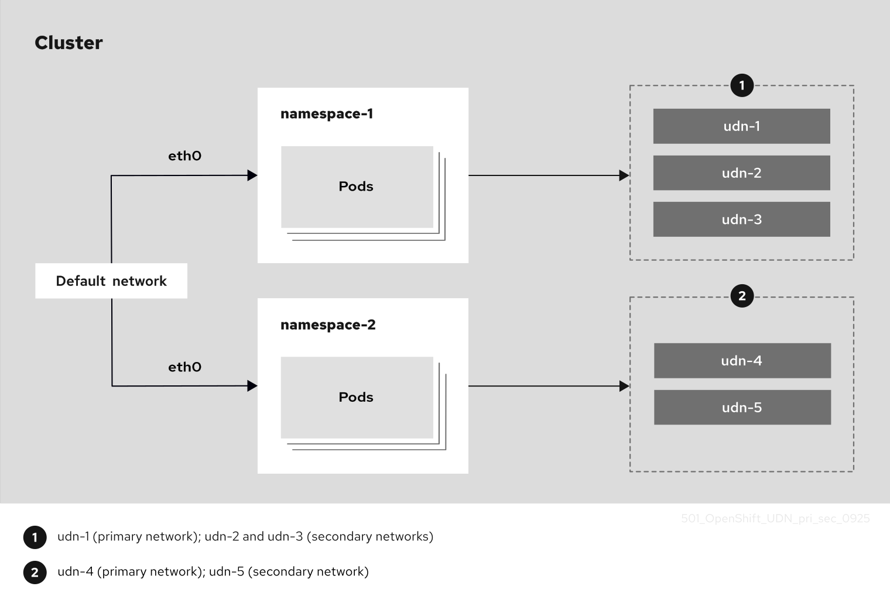

# Understanding multiple networks { #understanding-multiple-networks }

OpenShift Container Platform administrators and users can use user-defined networks (UDNs) or `NetworkAttachmentDefinition` (NADs) to define the networks that handle all of the ordinary network traffic of the cluster.

## Multiple networks with the OVN-K CNI { #understanding-multiple-networks-con_understanding-multiple-networks }

By default, OVN-Kubernetes serves as the Container Network Interface (CNI) of an OpenShift Container Platform cluster. This network interface is what administrators use to create default networks.

Both user-defined networks and Network Attachment Definitions can serve as the following network types:

- **Primary networks**: Act as the primary network for the pod. By default, all traffic passes through the primary network unless you have configured a pod route to send traffic through other networks.
- **Secondary networks**: Act as secondary, non-default networks for a pod. Secondary networks offer separate interfaces dedicated to specific traffic types or purposes. Only pod traffic that you explicitly configure to use a secondary network routes through its interface.

The following diagram shows a cluster that has an existing default network infrastructure that uses a physical network interface, `eth0`, to connect to two namespaces. Pods or virtual machines (VMs) in one namespace run in isolation from pods or VMs in the other namespace. You can create only one primary network. However, you can create multiple secondary networks for each namespace.

**Figure 1. Diagram showing namespaces with multiple secondary UDNs**

During cluster installation, OpenShift Container Platform administrators can configure alternative default secondary pod networks by leveraging the Multus CNI plugin. With Multus, you can use multiple CNI plugins such as ipvlan, macvlan, or Network Attachment Definitions together to serve as secondary networks for pods.

!!! warning

    User-defined networks are only supported when OVN-Kubernetes is used as the CNI. UDNs are not supported for use with other CNIs.

You can define an secondary network based on the available CNI plugins and attach one or more of these networks to your pods. You can define more than one secondary network for your cluster depending on your needs. This gives you flexibility when you configure pods that deliver network functionality, such as switching or routing. For more information:

- For a complete list of supported CNI plugins, see "Secondary networks in OpenShift Container Platform".
- For information about user-defined networks, see "About user-defined networks (UDNs)".
- For information about Network Attachment Definitions, see "Creating primary networks by using a NetworkAttachmentDefinition".

## UserDefinedNetwork and NetworkAttachmentDefinition support matrix { #support-matrix-for-udn-nad_understanding-multiple-networks }

You can use user defined networks and network attachment definitions to define and configure customized networks for your needs.

By creating `UserDefinedNetwork` and `NetworkAttachmentDefinition` custom resources (CRs), cluster administrators can complete the following tasks:

- Create customizable network configurations
- Define their own network topologies
- Ensure network isolation
- Manage IP addressing for workloads
- Configure advanced network features

By creating a `ClusterUserDefinedNetwork` CR, administrators can create and define secondary networks that span multiple namespaces at the cluster level.

User-defined networks and network attachment definitions can serve as both the primary and secondary network interface, and each support `layer2` and `layer3` topologies.

!!! note

    As of OpenShift Container Platform 4.19, the use of the `Localnet` topology by `ClusterUserDefinedNetwork` CRs is generally available. This configuration is the preferred method for connecting physical networks to virtual networks. Or, you can use the `NetworkAttachmentDefinition` CR to create secondary networks with `Localnet` topologies.

The following section highlights the supported features of the `UserDefinedNetwork` and `NetworkAttachmentDefinition` CRs when used as either the primary or secondary network. A separate table for the `ClusterUserDefinedNetwork` CR is also included.

**Primary network support matrix for `UserDefinedNetwork` and `NetworkAttachmentDefinition` CRs**

<table>
<thead>
<tr>
  <th>Network feature ^</th>
  <th>Layer2 topology ^</th>
  <th>Layer3 topology</th>
</tr>
</thead>
<tbody>
<tr>
  <td>east-west traffic</td>
  <td>&#10003;</td>
  <td>&#10003;</td>
</tr>
<tr>
  <td>north-south traffic</td>
  <td>&#10003;</td>
  <td>&#10003;</td>
</tr>
<tr>
  <td>Persistent IPs</td>
  <td>&#10003;</td>
  <td>X</td>
</tr>
<tr>
  <td>Services</td>
  <td>&#10003;</td>
  <td>&#10003;</td>
</tr>
<tr>
  <td>Routes</td>
  <td>X</td>
  <td>X</td>
</tr>
<tr>
  <td><code>EgressIP</code> resource</td>
  <td>&#10003;</td>
  <td>&#10003;</td>
</tr>
<tr>
  <td>Multicast</td>
  <td>X</td>
  <td>&#10003;</td>
</tr>
<tr>
  <td><code>NetworkPolicy</code> resource</td>
  <td>&#10003;</td>
  <td>&#10003;</td>
</tr>
<tr>
  <td><code>MultinetworkPolicy</code> resource</td>
  <td>X</td>
  <td>X</td>
</tr>
</tbody>
</table>

where:

Multicast
:   Must be enabled in the namespace, and it is only available between OVN-Kubernetes network pods. For more information, see "About multicast".

`NetworkPolicy` resource
:   When creating a `ClusterUserDefinedNetwork` CR with a primary network type, network policies must be created *after* the `UserDefinedNetwork` CR.

**Secondary network support matrix for `UserDefinedNetwork` and `NetworkAttachmentDefinition` CRs**

<table>
<thead>
<tr>
  <th>Network feature ^</th>
  <th>Layer2 topology ^</th>
  <th>Layer3 topology ^</th>
  <th>Localnet topology</th>
</tr>
</thead>
<tbody>
<tr>
  <td>east-west traffic</td>
  <td>&#10003;</td>
  <td>&#10003;</td>
  <td>&#10003; (<code>NetworkAttachmentDefinition</code> CR only)</td>
</tr>
<tr>
  <td>north-south traffic</td>
  <td>X</td>
  <td>X</td>
  <td>&#10003; (<code>NetworkAttachmentDefinition</code> CR only)</td>
</tr>
<tr>
  <td>Persistent IPs</td>
  <td>&#10003;</td>
  <td>X</td>
  <td>&#10003; (<code>NetworkAttachmentDefinition</code> CR only)</td>
</tr>
<tr>
  <td>Services</td>
  <td>X</td>
  <td>X</td>
  <td>X</td>
</tr>
<tr>
  <td>Routes</td>
  <td>X</td>
  <td>X</td>
  <td>X</td>
</tr>
<tr>
  <td><code>EgressIP</code> resource</td>
  <td>X</td>
  <td>X</td>
  <td>X</td>
</tr>
<tr>
  <td>Multicast</td>
  <td>X</td>
  <td>X</td>
  <td>X</td>
</tr>
<tr>
  <td><code>NetworkPolicy</code> resource</td>
  <td>X</td>
  <td>X</td>
  <td>X</td>
</tr>
<tr>
  <td><code>MultinetworkPolicy</code> resource</td>
  <td>&#10003;</td>
  <td>&#10003;</td>
  <td>&#10003; (<code>NetworkAttachmentDefinition</code> CR only)</td>
</tr>
</tbody>
</table>

The Localnet topology is unavailable for use with the `UserDefinedNetwork` CR. It is only supported on secondary networks for `NetworkAttachmentDefinition` CRs.

**Support matrix for `ClusterUserDefinedNetwork` CRs**

<table>
<thead>
<tr>
  <th>Network feature ^</th>
  <th>Layer2 topology ^</th>
  <th>Layer3 topology ^</th>
  <th>Localnet topology</th>
</tr>
</thead>
<tbody>
<tr>
  <td>east-west traffic</td>
  <td>&#10003;</td>
  <td>&#10003;</td>
  <td>&#10003;</td>
</tr>
<tr>
  <td>north-south traffic</td>
  <td>&#10003;</td>
  <td>&#10003;</td>
  <td>&#10003;</td>
</tr>
<tr>
  <td>Persistent IPs</td>
  <td>&#10003;</td>
  <td>X</td>
  <td>&#10003;</td>
</tr>
<tr>
  <td>Services</td>
  <td>&#10003;</td>
  <td>&#10003;</td>
  <td></td>
</tr>
<tr>
  <td>Routes</td>
  <td>X</td>
  <td>X</td>
  <td></td>
</tr>
<tr>
  <td><code>EgressIP</code> resource</td>
  <td>&#10003;</td>
  <td>&#10003;</td>
  <td></td>
</tr>
<tr>
  <td>Multicast</td>
  <td>X</td>
  <td>&#10003;</td>
  <td></td>
</tr>
<tr>
  <td><code>MultinetworkPolicy</code> resource</td>
  <td>X</td>
  <td>X</td>
  <td>&#10003;</td>
</tr>
<tr>
  <td><code>NetworkPolicy</code> resource</td>
  <td>&#10003;</td>
  <td>&#10003;</td>
  <td></td>
</tr>
</tbody>
</table>

where:

Multicast
:   must be enabled in the namespace, and it is only available between OVN-Kubernetes network pods. For more information, see "About multicast".

`NetworkPolicy` resource
:   When creating a `ClusterUserDefinedNetwork` CR with a primary network type, network policies must be created *after* the `UserDefinedNetwork` CR.

**Additional resources**

- [About user-defined networks (UDNs)](primary_networks/about-user-defined-networks.md#about-user-defined-networks)
- [Creating primary networks using a NetworkAttachmentDefinition](primary_networks/about-primary-nwt-nad.md#understanding-multiple-networks)
- [Enabling multicast for a project](../ovn_kubernetes_network_provider/enabling-multicast.md#nw-ovn-kubernetes-enabling-multicast)
