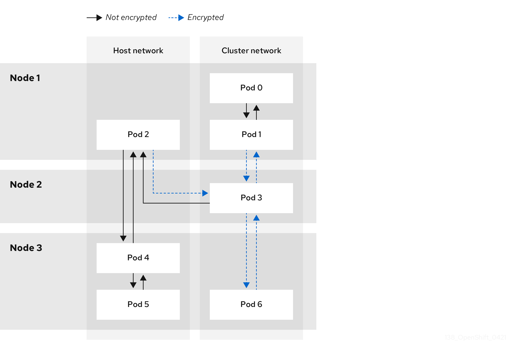

# Configuring IPsec encryption { #configuring-ipsec-ovn }

By enabling IPsec, you can encrypt both internal pod-to-pod cluster traffic between nodes and external traffic between pods and IPsec endpoints external to your cluster. All pod-to-pod network traffic between nodes on the OVN-Kubernetes cluster network is encrypted with IPsec in *Transport mode*.

IPsec is disabled by default. You can enable IPsec either during or after installing the cluster. For information about cluster installation, see [OpenShift Container Platform installation overview](../../installing/overview.md#ocp-installation-overview).

!!! note

    Upgrading your cluster to OpenShift Container Platform 4.22 when the `libreswan` and `NetworkManager-libreswan` packages have different OpenShift Container Platform versions causes two consecutive compute node reboot operations. For the first reboot, the Cluster Network Operator (CNO) applies the IPsec configuration to compute nodes. For the second reboot, the Machine Config Operator (MCO) applies the latest machine configs to the cluster.

    To combine the CNO and MCO updates into a single node reboot, complete the following tasks:

    - Before upgrading your cluster, set the `paused` parameter to `true` in the `MachineConfigPools` custom resource (CR) that groups compute nodes.
    - After you upgrade your cluster, set the parameter to `false`.

    For more information, see [Performing a Control Plane Only update](../../updating/updating_a_cluster/control-plane-only-update.md#control-plane-only-update).

The following support limitations exist for IPsec on a OpenShift Container Platform cluster:

- On IBM Cloud(R), IPsec supports only network address translation-traversal (NAT-T). Encapsulating Security Payload (ESP) is not supported on this platform.
- If your cluster uses [hosted control planes](https://www.redhat.com/en/topics/containers/what-are-hosted-control-planes) for Red Hat OpenShift Container Platform, IPsec is not supported for IPsec encryption of either pod-to-pod or traffic to external hosts.
- Using ESP hardware offloading on any network interface is not supported if one or more of those interfaces is attached to Open vSwitch (OVS). Enabling IPsec for your cluster triggers the use of IPsec with interfaces attached to OVS. By default, OpenShift Container Platform disables ESP hardware offloading on any interfaces attached to OVS.
- If you enabled IPsec for network interfaces that are not attached to OVS, a cluster administrator must manually disable ESP hardware offloading on each interface that is not attached to OVS.

The following list outlines key tasks in the IPsec documentation:

- Enable and disable IPsec after cluster installation.
- Configure IPsec encryption for traffic between the cluster and external hosts.
- Verify that IPsec encrypts traffic between pods on different nodes.

## Modes of operation { #nw-ovn-ipsec-modes_configuring-ipsec-ovn }

You can configure IPsec on OpenShift Container Platform clusters in `Disabled`, `External`, or `Full` pod-to-pod and external encryption modes. Each mode determines which traffic OVN-Kubernetes encrypts by default.

The following table describes the different modes of operation:

**IPsec modes of operation**

| Mode       | Description                                                                                                                                                                                                               | Default |
| ---------- | ------------------------------------------------------------------------------------------------------------------------------------------------------------------------------------------------------------------------- | ------- |
| `Disabled` | No traffic is encrypted. This is the cluster default.                                                                                                                                                                     | Yes     |
| `Full`     | Pod-to-pod traffic is encrypted as described in "Types of network traffic flows encrypted by pod-to-pod IPsec". Traffic to external nodes may be encrypted after you complete the required configuration steps for IPsec. | No      |
| `External` | Traffic to external nodes may be encrypted after you complete the required configuration steps for IPsec.                                                                                                                 | No      |

## Prerequisites for IPsec encryption for external traffic { #nw-ovn-ipsec-prerequisites_configuring-ipsec-ovn }

The following prerequisites are required to add certificates into the host NSS database and to configure IPsec to communicate with external hosts.

- Set `routingViaHost=true` in the `ovnKubernetesConfig.gatewayConfig` specification of the OVN-Kubernetes network plugin.

- Install the NMState Operator. This Operator is required for specifying the IPsec configuration. For more information, see "Kubernetes NMState Operator".

    !!! note

        The NMState Operator is supported on Google Cloud only for configuring IPsec.

**Additional resources**

- [Kubernetes NMState Operator](../networking_operators/k8s-nmstate-about-the-k8s-nmstate-operator.md#k8s-nmstate-about-the-k8s-nmstate-operator)

## Network connectivity requirements when IPsec is enabled { #network-connectivity-requirements-ipsec_configuring-ipsec-ovn }

When IPsec is enabled in OpenShift Container Platform, you must configure the network connectivity between machines to allow cluster components to communicate. Each machine must be able to resolve the hostnames of all other machines in the cluster.

**Ports used for all-machine to all-machine communications**

<table>
<thead>
<tr>
  <th>Protocol</th>
  <th>Port</th>
  <th>Description</th>
</tr>
</thead>
<tbody>
<tr>
  <td rowspan="2">UDP</td>
  <td><code>500</code></td>
  <td>IPsec IKE packets</td>
</tr>
<tr>
  <td><code>4500</code></td>
  <td>IPsec NAT-T packets</td>
</tr>
<tr>
  <td>ESP</td>
  <td>N/A</td>
  <td>IPsec Encapsulating Security Payload (ESP)</td>
</tr>
</tbody>
</table>


## IPsec encryption for pod-to-pod traffic { #pod-to-pod-ipsec_configuring-ipsec-ovn }

For IPsec encryption of pod-to-pod traffic, the following sections describe which specific pod-to-pod traffic is encrypted, what kind of encryption protocol is used, and how X.509 certificates are handled. These sections do not apply to IPsec encryption between the cluster and external hosts, which you must configure manually for your specific external network infrastructure.

### Types of network traffic flows encrypted by pod-to-pod IPsec { #nw-ovn-ipsec-traffic_configuring-ipsec-ovn }

When pod-to-pod IPsec is enabled in OpenShift Container Platform, OVN-Kubernetes encrypts only selected traffic flows between pods on different nodes and from host-network pods. Other flows, such as traffic on the same node, remain unencrypted.

The following network traffic flows between pods are encrypted when pod-to-pod IPsec is enabled:

- Traffic between pods on different nodes on the cluster network
- Traffic from a pod on the host network to a pod on the cluster network

The following traffic flows are not encrypted when pod-to-pod IPsec is enabled:

- Traffic between pods on the same node on the cluster network
- Traffic between pods on the host network
- Traffic from a pod on the cluster network to a pod on the host network

The encrypted and unencrypted flows are illustrated in the following diagram:



### Encryption protocol and IPsec mode { #nw-ovn-ipsec-encryption_configuring-ipsec-ovn }

Pod-to-pod IPsec in OpenShift Container Platform uses `AES-GCM-16-256` in transport mode with a 256-bit key and a 16-byte integrity check value. *Transport mode* encrypts end-to-end communication by adding an Encapsulated Security Payload (ESP) header to the IP header of the original packet and encrypts the packet data. 

OpenShift Container Platform does not currently use or support IPsec *Tunnel mode* for pod-to-pod communication.

### Security certificate generation and rotation { #nw-ovn-ipsec-certificates_configuring-ipsec-ovn }

The Cluster Network Operator (CNO) generates a self-signed X.509 certificate authority (CA) that is used by IPsec for encryption. Certificate signing requests (CSRs) from each node are automatically fulfilled by the CNO.

The CA is valid for 10 years. The individual node certificates are valid for 5 years and are automatically rotated after 4 1/2 years elapse.

## IPsec encryption for external traffic { #nw-ovn-ipsec-external_configuring-ipsec-ovn }

OpenShift Container Platform supports the use of IPsec to encrypt traffic destined for external hosts, ensuring confidentiality and integrity of data in transit. This feature relies on X.509 certificates that you must supply.

### Supported platforms { #supported-platforms_configuring-ipsec-ovn }

This feature is supported on the following platforms:

- Bare metal
- Google Cloud
- Red Hat OpenStack Platform (RHOSP)
- VMware vSphere

!!! warning

    If you have Red Hat Enterprise Linux (RHEL) compute nodes, these do not support IPsec encryption for external traffic.

If your cluster uses hosted control planes for Red Hat OpenShift Container Platform, configuring IPsec for encrypting traffic to external hosts is not supported.

### Limitations { #ipsec-external-limitations_configuring-ipsec-ovn }

Ensure that the following prohibitions are observed:

- IPv6 configuration is not currently supported by the NMState Operator when configuring IPsec for external traffic.
- Certificate common names (CN) in the provided certificate bundle must not begin with the `ovs_` prefix, because this naming can conflict with pod-to-pod IPsec CN names in the Network Security Services (NSS) database of each node.

## Enabling IPsec encryption { #nw-ovn-ipsec-enable_configuring-ipsec-ovn }

To enable pod-to-pod and external IPsec encryption in OpenShift Container Platform, you can patch the cluster `Network` custom resource and set `ipsecConfig` mode to `Full` or `External`.

- `Full`: Encryption for pod-to-pod and external traffic
- `External`: Encryption for external traffic

!!! note

    If you configure IPsec in `Full` mode, you must also complete the "Configuring IPsec encryption for external traffic" procedure.

If you enabled IPsec in `Full` mode, as a cluster administrator you can configure options for the mode by adding the `full` schema to `networks.operator.openshift.io`. The `full` schema supports the `encapsulation` parameter. You can use this parameter to configure network address translation-traversal (NAT-T) encapsulation for IPsec traffic. The `encapsulation` parameter supports the following values:

- `Auto` is the default value and enables UDP encapsulation when `libreswan` detects network address translation (NAT) packets in traffic within a node.
- `Always` enables UDP encapsulation for all traffic types available in a node. This option does not rely upon `libreswan` to detect NAT packets in a node.

**Prerequisites**

- Install the OpenShift CLI (`oc`).
- You are logged in to the cluster as a user with `cluster-admin` privileges.
- You have reduced the size of your cluster MTU by `46` bytes to allow for the overhead of the IPsec ESP header.

**Procedure**

1. To enable IPsec encryption, enter the following command:

    ```terminal
    $ oc patch networks.operator.openshift.io cluster --type=merge -p \
      '{
      "spec":{
        "defaultNetwork":{
          "ovnKubernetesConfig":{
            "ipsecConfig":{
              "mode":"<mode>"
            }}}}}'
    ```

    where:

    `spec.defaultNetwork.ovnKubernetesConfig.ipsecConfig.mode`
    :   Specifies `External` to encrypt traffic to external hosts or `Full` to encrypt pod-to-pod traffic and, optionally, traffic to external hosts. By default, IPsec is disabled.

    ```terminal title="Example configuration that has IPsec enabled in Full mode and encapsulation set to Always"
    $ oc patch networks.operator.openshift.io cluster --type=merge -p \
      '{
      "spec":{
        "defaultNetwork":{
          "ovnKubernetesConfig":{
            "ipsecConfig":{
              "mode":"Full",
              "full":{
                "encapsulation": "Always"
              }}}}}}'
    ```

2. Encrypt external traffic with IPsec by completing the "Configuring IPsec encryption for external traffic" procedure.

**Verification**

1. To find the names of the OVN-Kubernetes data plane pods, enter the following command:

    ```terminal
    $ oc get pods -n openshift-ovn-kubernetes -l=app=ovnkube-node
    ```

    ```terminal title="Example output"
    ovnkube-node-5xqbf                       8/8     Running   0              28m
    ovnkube-node-6mwcx                       8/8     Running   0              29m
    ovnkube-node-ck5fr                       8/8     Running   0              31m
    ovnkube-node-fr4ld                       8/8     Running   0              26m
    ovnkube-node-wgs4l                       8/8     Running   0              33m
    ovnkube-node-zfvcl                       8/8     Running   0              34m
    ...
    ```

2. Verify that you enabled IPsec on your cluster by running the following command:

    !!! note

        As a cluster administrator, you can verify that you enabled IPsec between pods on your cluster when you configured IPsec in `Full` mode. This step does not verify whether IPsec is working between your cluster and external hosts.

    ```terminal
    $ oc -n openshift-ovn-kubernetes rsh ovnkube-node-<XXXXX> ovn-nbctl --no-leader-only get nb_global . ipsec
    ```

    where:

    `<XXXXX>`
    :   Specifies the random sequence of letters for a pod from an earlier step.

    Successful output from the command shows the status as `true`.

## Configuring IPsec encryption for external traffic { #nw-ovn-ipsec-north-south-enable_configuring-ipsec-ovn }

To configure IPsec encryption for traffic between OpenShift Container Platform and external hosts, you can create Butane machine configs with PKCS#12 certificates and apply them to cluster nodes.

!!! note

    After you apply the machine config, the Machine Config Operator (MCO) reboots affected nodes in your cluster to rollout the new machine config.

**Prerequisites**

- Install the OpenShift CLI (`oc`).
- You have installed the `butane` tool on your local computer. For more information, see "Installing Butane".
- You have installed the NMState Operator on the cluster.
- You logged in to the cluster as a user with `cluster-admin` privileges.
- You have an existing PKCS#12 certificate for the IPsec endpoint and a CA cert in Privacy Enhanced Mail (PEM) format.
- You enabled IPsec in either `Full` or `External` mode on your cluster.
- You must set the `routingViaHost` parameter to `true` in the `ovnKubernetesConfig.gatewayConfig` specification of the OVN-Kubernetes network plugin.

**Procedure**

1. Create an IPsec configuration with an NMState Operator node network configuration policy. For more information, see [Configuring an IPsec based VPN connection by using nmstatectl](https://docs.redhat.com/en/documentation/red_hat_enterprise_linux/9/html/configuring_and_managing_networking/setting-up-an-ipsec-vpn_configuring-and-managing-networking#configuring-an-ipsec-based-vpn-connection-by-using-nmstatectl_setting-up-an-ipsec-vpn).

    1. To identify the IP address of the cluster node that is the IPsec endpoint, enter the following command:

        ```
        $ oc get nodes
        ```

    2. Create a file named `ipsec-config.yaml` that has a node network configuration policy for the NMState Operator, such as in the following examples. For an overview about `NodeNetworkConfigurationPolicy` objects, see [The Kubernetes NMState project](https://nmstate.io/kubernetes-nmstate/).

        ```yaml title="Example NMState IPsec transport configuration"
        apiVersion: nmstate.io/v1
        kind: NodeNetworkConfigurationPolicy
        metadata:
          name: ipsec-config
        spec:
          nodeSelector:
            kubernetes.io/hostname: "<hostname>"
          desiredState:
            interfaces:
            - name: <interface_name>
              type: ipsec
              libreswan:
                left: <cluster_node>
                leftid: '%fromcert'
                leftrsasigkey: '%cert'
                leftcert: left_server
                leftmodecfgclient: false
                right: <external_host>
                rightid: '%fromcert'
                rightrsasigkey: '%cert'
                rightsubnet: <external_address>/32
                ikev2: insist
                type: transport
        ```

        where:

        `kubernetes.io/hostname`
        :   Specifies the hostname to apply the policy to. This host serves as the left side host in the IPsec configuration.

        `name`
        :   Specifies the name of the interface to create on the host.

        `left`
        :   Specifies the hostname of the cluster node that terminates the IPsec tunnel on the cluster side. The name must match the SAN `[Subject Alternate Name]` from your supplied PKCS#12 certificates.

        `right`
        :   Specifies the external hostname, such as `host.example.com`. The name should match the SAN `[Subject Alternate Name]` from your supplied PKCS#12 certificates.

        `rightsubnet`
        :   Specifies the IP address of the external host, such as `10.1.2.3/32`.

        ```yaml title="Example NMState IPsec tunnel configuration"
        apiVersion: nmstate.io/v1
        kind: NodeNetworkConfigurationPolicy
        metadata:
          name: ipsec-config
        spec:
          nodeSelector:
            kubernetes.io/hostname: "<hostname>"
          desiredState:
            interfaces:
            - name: <interface_name>
              type: ipsec
              libreswan:
                left: <cluster_node>
                leftid: '%fromcert'
                leftmodecfgclient: false
                leftrsasigkey: '%cert'
                leftcert: left_server
                right: <external_host>
                rightid: '%fromcert'
                rightrsasigkey: '%cert'
                rightsubnet: <external_address>/32
                ikev2: insist
                type: tunnel
        ```

    3. To configure the IPsec interface, enter the following command:

        ```terminal
        $ oc create -f ipsec-config.yaml
        ```

2. Give the following certificate files to add to the Network Security Services (NSS) database on each host. These files are imported as part of the Butane configuration in the next steps.

    - `left_server.p12`: The certificate bundle for the IPsec endpoints
    - `ca.pem`: The certificate authority that you signed your certificates with

3. Create a machine config to add your certificates to the cluster.

4. Read the password from a mounted secret file:

    ```terminal
    $ password=$(cat run/secrets/<left_server_password>)
    ```

    - `left_server_password`:: The name of the file that contains the password. This file exists in the mounted secret.

5. Use the `pk12util` tool, which comes prepackaged with Red Hat Enterprise Linux (RHEL), to specify a password that protects `PKCS#12` files by entering the following command. Ensure that you replace the `<password>` value with your password.

    ```terminal
    $ pk12util -W "<password>" -i /etc/pki/certs/left_server.p12 -d /var/lib/ipsec/nss/
    ```

6. To create Butane config files for the control plane and compute nodes, enter the following command:

    !!! note

        The [Butane version](https://coreos.github.io/butane/specs/) you specify in the config file should match the OpenShift Container Platform version and always ends in `0`. For example, `4.22.0`. See "Creating machine configs with Butane" for information about Butane.

    ```terminal
    $ for role in master worker; do
      cat >> "99-ipsec-${role}-endpoint-config.bu" <<-EOF
      variant: openshift
      version: 4.22.0
      metadata:
        name: 99-${role}-import-certs
        labels:
          machineconfiguration.openshift.io/role: $role
      systemd:
        units:
        - name: ipsec-import.service
          enabled: true
          contents: |
            [Unit]
            Description=Import external certs into ipsec NSS
            Before=ipsec.service

            [Service]
            Type=oneshot
            ExecStart=/usr/local/bin/ipsec-addcert.sh
            RemainAfterExit=false
            StandardOutput=journal

            [Install]
            WantedBy=multi-user.target
      storage:
        files:
        - path: /etc/pki/certs/ca.pem
          mode: 0400
          overwrite: true
          contents:
            local: ca.pem
        - path: /etc/pki/certs/left_server.p12
          mode: 0400
          overwrite: true
          contents:
            local: left_server.p12
        - path: /usr/local/bin/ipsec-addcert.sh
          mode: 0740
          overwrite: true
          contents:
            inline: |
              #!/bin/bash -e
              echo "importing cert to NSS"
              certutil -A -n "CA" -t "CT,C,C" -d /var/lib/ipsec/nss/ -i /etc/pki/certs/ca.pem
              pk12util -W "" -i /etc/pki/certs/left_server.p12 -d /var/lib/ipsec/nss/
              certutil -M -n "left_server" -t "u,u,u" -d /var/lib/ipsec/nss/
    EOF
    done
    ```

7. To transform the Butane files that you created in the earlier step into machine configs, enter the following command:

    ```terminal
    $ for role in master worker; do
      butane -d . 99-ipsec-${role}-endpoint-config.bu -o ./99-ipsec-$role-endpoint-config.yaml
    done
    ```

8. To apply the machine configs to your cluster, enter the following command:

    ```terminal
    $ for role in master worker; do
      oc apply -f 99-ipsec-${role}-endpoint-config.yaml
    done
    ```

    !!! warning

        As the Machine Config Operator (MCO) updates machines in each machine config pool, it reboots each node one by one. You must wait for all the nodes to update before external IPsec connectivity is available.

**Verification**

1. Check the machine config pool status by entering the following command:

    ```terminal
    $ oc get mcp
    ```

    A successfully updated node has the following status: `UPDATED=true`, `UPDATING=false`, `DEGRADED=false`.

    !!! note

        By default, the MCO updates one machine per pool at a time, causing the total time the migration takes to increase with the size of the cluster.

2. To confirm that IPsec machine configs rolled out successfully, enter the following commands:

    1. Confirm the creation of the IPsec machine configs:

        ```terminal
        $ oc get mc | grep ipsec
        ```

        ```text title="Example output"
        80-ipsec-master-extensions        3.2.0        6d15h
        80-ipsec-worker-extensions        3.2.0        6d15h
        ```

    2. Confirm you have applied the IPsec extension to control plane nodes:

        ```terminal
        $ oc get mcp master -o yaml | grep 80-ipsec-master-extensions -c
        ```

    3. Confirm the application of the IPsec extension to compute nodes. Example output would show `2`.

        ```terminal
        $ oc get mcp worker -o yaml | grep 80-ipsec-worker-extensions -c
        ```

**Additional resources**

- [IPsec Encryption](https://nmstate.io/devel/yaml_api.html#ipsec-encryption)
- [Installing Butane](../../installing/install_config/installing-customizing.md#installation-special-config-butane-install_installing-customizing)

## Disabling IPsec encryption for an external IPsec endpoint { #nw-ovn-ipsec-north-south-disable_configuring-ipsec-ovn }

To stop encrypting traffic to an external host in OpenShift Container Platform, you can remove the IPsec tunnel configuration from your cluster nodes.

**Prerequisites**

- Install the OpenShift CLI (`oc`).
- You are logged in to the cluster as a user with `cluster-admin` privileges.
- You enabled IPsec in either `Full` or `External` mode on your cluster.

**Procedure**

1. Create a file named `remove-ipsec-tunnel.yaml` with the following YAML:

    ```yaml
    kind: NodeNetworkConfigurationPolicy
    apiVersion: nmstate.io/v1
    metadata:
      name: <name>
    spec:
      nodeSelector:
        kubernetes.io/hostname: <node_name>
      desiredState:
        interfaces:
        - name: <tunnel_name>
          type: ipsec
          state: absent
    ```

    where:

    `name`
    :   Specifies a name for the node network configuration policy.

    `node_name`
    :   Specifies the name of the node where the IPsec tunnel that you want to remove exists.

    `tunnel_name`
    :   Specifies the interface name for the existing IPsec tunnel.

2. To remove the IPsec tunnel, enter the following command:

    ```terminal
    $ oc apply -f remove-ipsec-tunnel.yaml
    ```

## Disabling IPsec encryption { #nw-ovn-ipsec-disable_configuring-ipsec-ovn }

To disable IPsec encryption in OpenShift Container Platform, you can patch the cluster `Network` custom resource and set `ipsecConfig` mode to `Disabled`.

**Prerequisites**

- You installed the OpenShift CLI (`oc`).
- You logged in to the cluster with a user with `cluster-admin` privileges.

**Procedure**

1. Choose one of the following options to disable IPsec encryption:

    1. Where the `ipsecConfig.mode` parameter is set to either `External` or `Full` and the `ipsecConfig.full` schema is not added to `networks.operator.openshift.io`, enter the following command:

        ```terminal
        $ oc patch networks.operator.openshift.io cluster --type=merge -p \
          '{
          "spec":{
            "defaultNetwork":{
              "ovnKubernetesConfig":{
                "ipsecConfig":{
                  "mode":"Disabled"
                }}}}}'
        ```

    2. Where the `ipsecConfig.mode` parameter is set to `Full` and the `ipsecConfig.full` configuration is added to `networks.operator.openshift.io`, enter the following command:

        ```terminal
        $ oc patch networks.operator.openshift.io cluster --type='json' -p \
              '[{"op": "remove", "path": "/spec/defaultNetwork/ovnKubernetesConfig/ipsecConfig/full"}, 
              {"op": "replace", "path": "/spec/defaultNetwork/ovnKubernetesConfig/ipsecConfig/mode", "value": "Disabled"}]'
        ```

2. Optional: You can increase the size of your cluster MTU by `46` bytes because there is no longer any overhead from the IPsec Encapsulating Security Payload (ESP) header in IP packets.

**Additional resources**

- [Configuring a VPN with IPsec](https://docs.redhat.com/en/documentation/red_hat_enterprise_linux/10/html/configuring_and_managing_networking/setting-up-an-ipsec-vpn)
- [Installing Butane](../../installing/install_config/installing-customizing.md#installation-special-config-butane-install_installing-customizing)
- [About the OVN-Kubernetes Container Network Interface (CNI) network plugin](../ovn_kubernetes_network_provider/about-ovn-kubernetes.md#about-ovn-kubernetes)
- [Changing the MTU for the cluster network](../advanced_networking/changing-cluster-network-mtu.md#changing-cluster-network-mtu)
- \[Network [operator.openshift.io/v1\] API](../../rest_api/operator_apis/network-operator-openshift-io-v1.md#network-operator-openshift-io-v1)
