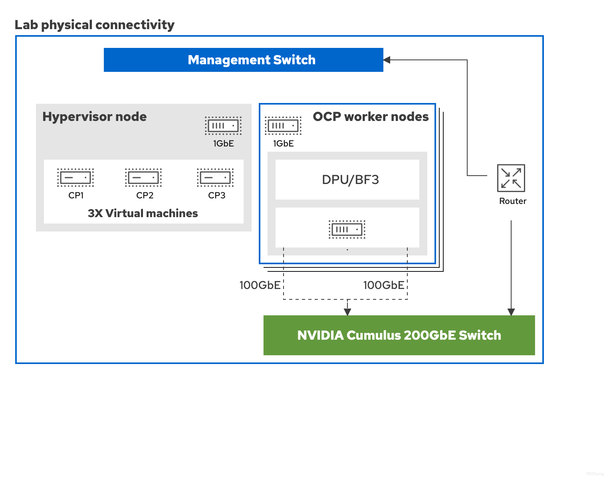

# About the NVIDIA DPF Operator { #about-dpf-operator }

The NVIDIA DOCA Platform Framework (DPF) Operator enables hardware-accelerated networking on OpenShift Container Platform by offloading OVN-Kubernetes data plane operations to NVIDIA BlueField-3 Data Processing Units (DPUs).

The DPF deployment creates a dual-cluster topology consisting of a management cluster running on x86 servers and a hosted DPU cluster running on BlueField-3 DPUs.

## DPF architecture overview { #nw-dpf-architecture-overview_about-dpf-operator }

The NVIDIA DOCA Platform Framework (DPF) v26.4.1 deployment on OpenShift Container Platform 4.22 offloads OVN-Kubernetes data plane operations to NVIDIA BlueField-3 DPUs.

In Host Trusted deployments, DPF uses BlueField DPUs as host accelerators, and the host is part of the trusted domain. Administrators can orchestrate both workloads and DPU-accelerated infrastructure by using standard OpenShift Container Platform APIs and custom resource definitions (CRDs).

By offloading critical OpenShift Container Platform networking functions, such as OVN-Kubernetes, to the DPU, the architecture frees host CPU resources for tenant applications. DPF also provides automated lifecycle management so that administrators can provision, configure, and update fleets of DPUs directly from OpenShift Container Platform.

!!! note

    In the current release, the supported DPU services are Host-Based Networking (HBN) with OVN-Kubernetes and the DOCA Telemetry Service (DTS).

    The NVIDIA DPF Operator is distinct from the Red Hat DPU Operator. The Red Hat DPU Operator manages supported non-NVIDIA DPU devices. NVIDIA BlueField-3 deployments use the DPF Operator and related components.

### The topology { #_the_topology }

The DPF deployment creates a specialized networking infrastructure consisting of two distinct cluster planes that work together to deliver hardware-accelerated networking:

OpenShift Container Platform management cluster
:   The management cluster runs on the server’s main x86 CPU cores. It hosts the actual business logic, such as AI workloads or enterprise applications.

    The management cluster serves as the primary administrative interface and the host cluster that provisions and manages both the fleet of DPUs and user workloads. In a Host Trusted deployment, the worker nodes in this cluster are the physical servers that house the BlueField DPUs.

    The management cluster is responsible for the following functions:

    - Running user workloads on x86 host processors.
    - Providing a single interface for defining the required state of the infrastructure by using Kubernetes CRDs such as `DPUSet`, `DPUDeployment`, and `DPUService`.
    - Driving the discovery of DPUs, flashing BlueField Bootstream (BFB) images, and configuring host-to-DPU networking.
    - Coordinating the deployment of services and network flows to the DPU cluster.

OpenShift Container Platform DPU hosted cluster
:   The DPU hosted cluster is a dedicated, secondary Kubernetes control plane for managing the fleet of NVIDIA BlueField DPUs. The DPUs function as the worker nodes of this hosted cluster, separate from the bare-metal hosts they are physically attached to.

    The DPU hosted cluster runs the following components:

    - OVN-Kubernetes running in DPU mode to offload flows.
    - DOCA services such as Host-Based Networking (HBN) for BGP routing, DOCA Telemetry Service (DTS) for monitoring, and Firefly for time synchronization.
    - System components including NVIDIA IPAM, Multus, and SR-IOV Device Plugins to manage the DPU hardware resources.

### Example topology { #_example_topology }

The following diagram illustrates the physical connectivity for a reference lab environment. It serves as a baseline example to demonstrate the core components and their interactions.



### Architecture characteristics { #_architecture_characteristics }

Host-managed DPU lifecycle
:   In a Host Trusted deployment, the DPU is managed from the host. This model enables cloud operators to manage BlueField-bound services directly from their standard OpenShift Container Platform control plane. DPF automates the discovery and provisioning of DPUs: the DPF Operator detects worker nodes, creates DPU objects, and deploys the DOCA Management Service (DMS) to install the BFB firmware and configure networking between the host and DPU. This approach reduces manual low-level device configuration by using standard Kubernetes APIs and workflows.

Infrastructure service offloading
:   In Host Trusted mode, infrastructure services such as networking, storage, and security are offloaded from the host CPU to the DPU. This frees host CPU resources for applications. The framework routes data center traffic through dedicated ports on the BlueField DPU.

Kubernetes-native orchestration
:   DPF extends the Kubernetes control plane to the DPUs, enabling administrators to deploy and orchestrate NVIDIA DOCA services and third-party applications directly on the BlueField DPU by using familiar Kubernetes constructs. The architecture supports automated rolling updates, scaling, and rollbacks for services without disrupting ongoing operations.

## DPF component placement { #nw-dpf-component-placement_about-dpf-operator }

The software components and Operators run on the management cluster and the DPU hosted cluster to separate workload management from infrastructure acceleration.

### Management cluster components { #_management_cluster_components }

The following Operators and services run within the management cluster:

NVIDIA DPF Operator
:   The core Operator that manages DPU services and configurations within the hosted cluster, including DPU provisioning, networking acceleration, and DOCA service orchestration.

DPF HCP Provisioner Operator
:   Automates the hosted control plane’s cluster lifecycle for the DPU nodes.

MultiCluster Engine (MCE) and hosted control planes
:   Provide the control plane and management framework for the DPU hosted cluster.

Node Feature Discovery (NFD) Operator
:   Discovers and labels hardware features on the nodes, including the presence of DPUs.

MetalLB Operator
:   Provides load balancing services for the management cluster.

GitOps Operator
:   Facilitates ArgoCD-based deployment of applications and configurations.

cert-manager Operator
:   Automates the management, issuance, and renewal of TLS certificates within the cluster.

NVIDIA Maintenance Operator
:   Assists in performing maintenance tasks and gracefully draining DPU worker nodes.

LVM Storage
:   Provides persistent ReadWriteMany (RWX) storage required for various components, such as the etcd database of the hosted cluster.

`NodeSRIOVDevicePluginConfig`
:   A DPF-managed CRD that configures SR-IOV device plugin pods on worker nodes. It defines VF allocation ranges for management and workload traffic.

Bare Metal Operator
:   Provisions and adds worker nodes with DPUs to the management cluster.

## DPF deployment flow overview { #nw-dpf-deployment-flow-overview_about-dpf-operator }

The end-to-end deployment process for the NVIDIA DPF Operator follows a series of high-level steps, from management cluster setup through workload verification.

The deployment flow consists of the following steps:

1. **Management cluster setup:** Install and configure a standard OpenShift Container Platform cluster on x86 servers with control-plane nodes only.

2. **Management cluster configuration:** Configure nodes and cluster-level settings, then install and configure the required Operators on the management cluster.

3. **DPF installation:** Deploy the DPF Operator, controllers, DPF resources, and DPU service definitions on the management cluster.

    !!! warning

        You must install the DPF Operator before the DPF HCP Provisioner Operator because that Operator requires DPF custom resource definitions (CRDs) such as `DPUCluster`, `DPUFlavor`, `DPUDeployment`, and `DPFOperatorConfig`.

4. **Hosted cluster creation:** The DPF HCP Provisioner Operator automates the creation of a hosted DPU cluster by using hosted control planes. The Operator references the `DPUDeployment` resource during ignition generation.

5. **Worker node scale-out and DPU provisioning:** When worker nodes with DPUs are added to the cluster, the DPF Operator flashes the DPUs with a Red Hat Enterprise Linux CoreOS (RHCOS) image and configures them to join the hosted cluster as worker nodes.

6. **Worker node integration:** Approve DPU worker node certificate signing requests (CSRs) and configure security context constraint (SCC) bindings on the hosted cluster.

7. **Service deployment:** After the DPU hosted cluster is operational, data plane DPU services and chains are deployed by DPF.

8. **Verification:** Validate end-to-end connectivity through the DPU data plane by running `ping` and `nc` traffic tests between workload pods and services.

## DPF hardware requirements { #nw-dpf-hardware-requirements_about-dpf-operator }

A DPF v26.4.1 deployment on OpenShift Container Platform 4.22 requires a workstation with CLI tools, a management cluster, at least two worker servers with NVIDIA BlueField-3 DPUs, dedicated management and DPU network switches, and a shared storage server for BFB images.

### Workstation { #_workstation }

A workstation with the following command-line interface (CLI) tools installed:

- OpenShift CLI (`oc`) is installed.
- Helm CLI (`helm`) is installed.

### Control plane nodes { #_control_plane_nodes }

Three nodes form the control plane of the management cluster.

**Control plane node requirements**

| Component   | Requirement                                                            |
| ----------- | ---------------------------------------------------------------------- |
| Form factor | Virtual machines or physical servers                                   |
| Memory      | 60 GB RAM                                                              |
| CPU         | 16 vCPUs (Intel or AMD x86_64)                                         |
| Storage     | 120 GB NVMe SSD storage, plus an additional 80 GB disk for LVM Storage |
| Networking  | 1x 1GbE network interface                                              |
| DPUs        | DPUs must not be installed on control plane nodes                      |

### Worker nodes { #_worker_nodes }

Two physical x86 servers host the NVIDIA BlueField-3 DPUs and act as worker nodes for the management cluster.

**Worker node requirements**

| Component     | Requirement                                                                                                              |
| ------------- | ------------------------------------------------------------------------------------------------------------------------ |
| Memory        | 256 GB RAM                                                                                                               |
| CPU           | 16 cores (Intel or AMD x86_64)                                                                                           |
| Storage       | A minimum of 500 GB NVMe SSD storage for the base operating system                                                       |
| DPU slot      | PCIe Gen 5 x16 slot required. Each server can have multiple DPUs but only one NVIDIA BlueField-3 DPU can be provisioned. |
| BIOS settings | SR-IOV must be enabled. In-Band Manageability Interface must be enabled.                                                 |

!!! note

    As part of the installation process, a Linux bridge named `br-ex` is automatically created on the worker node’s physical management port by using a `MachineConfig` custom resource to facilitate control-plane traffic from the DPU through the host server.

### NVIDIA BlueField-3 DPUs { #_nvidia_bluefield-3_dpus }

One NVIDIA BlueField-3 DPU is required per worker node.

**BlueField-3 DPU requirements**

| Component                     | Requirement                                                                                                                                                                                                                                                                                                                                                                                                       |
| ----------------------------- | ----------------------------------------------------------------------------------------------------------------------------------------------------------------------------------------------------------------------------------------------------------------------------------------------------------------------------------------------------------------------------------------------------------------- |
| Model                         | BlueField-3: [B3240](https://docs.nvidia.com/networking/display/bf3dpu/specifications#src-2449222537_Specifications-B3240DPUsSpecifications), [B3220](https://docs.nvidia.com/networking/display/bf3dpu/specifications#src-2449222537_Specifications-B3220DPUsSpecifications), or [B3210](https://docs.nvidia.com/networking/display/bf3dpu/specifications#src-2449222537_Specifications-B3210DPUsSpecifications) |
| Memory                        | 32 GB. Dual-port DPUs with 32 GB require an external power connection to the x86 server.                                                                                                                                                                                                                                                                                                                          |
| Networking                    | Dual 200GbE ports per DPU. Both ports must be connected to the high-speed switch for ECMP routing.                                                                                                                                                                                                                                                                                                                |
| Management                    | The out-of-band management port is not used in this configuration.                                                                                                                                                                                                                                                                                                                                                |
| Operating system and software | The DPUs are provisioned with a BlueField Bootstream File (BFB) that bundles a Red Hat Enterprise Linux CoreOS (RHCOS) base image and the NVIDIA DOCA software stack. The DOCA software stack includes the DPU firmware (version 32.49.1014).                                                                                                                                                                     |

## DPF network infrastructure requirements { #nw-dpf-network-requirements_about-dpf-operator }

A DPF deployment requires a management switch, a high-speed DPU switch, routable management and VTEP networks with reserved service IPs and a VIP, and a consistent MTU across all network components.

### Switches { #_switches }

Management switch
:   Provides 1GbE connectivity for the control plane and worker node management interfaces.

High-speed switch
:   An NVIDIA SN3700 or similar switch providing 2x 200GbE connectivity per DPU.

### Connectivity { #_connectivity }

- All nodes must have full internet access, both from the host out-of-band and DPU high-speed interfaces.
- The management network and the high-speed DPU network, which is the VTEP CIDR, must be routable to each other in **both** directions. Verify reachability in each direction before you begin the installation, because connectivity that works in only one direction allows the deployment to proceed partway and then fail.
- A dedicated IP address range, which is the VTEP Classless Inter-Domain Routing (CIDR), must be allocated from the high-speed DPU network for DPU service IPs used by HBN and OVN tunnels.
- A Virtual IP (VIP) from the management subnet must be reserved for the hosted DPU cluster control-plane services. The VIP must have a DNS A record.

### MTU configuration { #_mtu_configuration }

The deployment supports any maximum transmission unit (MTU) value, provided it is consistent across all network components, including switches, interfaces, and bridges. Common values are 1500 for standard frames and 9000 for jumbo frames. Whichever value you choose must be supported end-to-end by every component in the network path.

!!! warning

    The MTU value is set during deployment and cannot be changed later. Ensure consistency across all environment components. When using VMs for control plane nodes, ensure the hypervisor bridge MTU matches the chosen value.

## DPF software requirements { #nw-dpf-software-requirements_about-dpf-operator }

A DPF v26.4.1 deployment requires specific versions of OpenShift Container Platform, the OpenShift CLI (`oc`), hosted control planes, the NVIDIA DPF Operator, and RHCOS BFB, plus `cluster-admin` privileges on the management cluster.

**Software version requirements**

| Component                                                  | Required version |
| ---------------------------------------------------------- | ---------------- |
| OpenShift Container Platform                               | 4.22             |
| OpenShift CLI (`oc`)                                       | 4.22             |
| Hosted control planes OpenShift Container Platform cluster | 4.22             |
| NVIDIA DPF Operator                                        | v26.4.1          |
| RHCOS BFB                                                  | 4.22             |

The `RHCOS BFB` entry refers to the base RHCOS BlueField Bootstream (BFB) image, which is available from the OpenShift Container Platform mirror. For example:

```terminal title="Example BFB image URL"
https://rhcos.mirror.openshift.com/art/storage/prod/streams/rhel-10.2/builds/10.2.20260715-0/aarch64/rhcos-10.2.20260715-0-nvidiabluefield.aarch64.bfb
```

The base BFB is layered with the NVIDIA DOCA stack at provisioning time, and the DOCA services run on the DPUs as separately deployed `DPUService` resources. The following versions are pinned by this deployment:

**NVIDIA DOCA component versions**

| Component                    | Required version                               |
| ---------------------------- | ---------------------------------------------- |
| NVIDIA DOCA                  | 3.4.1                                          |
| Host-Based Networking (HBN)  | 3.4.0                                          |
| DOCA Telemetry Service (DTS) | 1.25.5                                         |
| OVN-Kubernetes               | Delivered by the DPF OVN-Kubernetes Helm chart |

### Required command-line tools { #_required_command-line_tools }

Install the following tools on the workstation from which you run the deployment commands:

- `oc` -- the OpenShift Container Platform CLI, version 4.22.
- `helm` -- required to install the DPF Operator and related Helm charts.
- `envsubst` -- substitutes environment variables into the manifest templates used throughout this documentation (the `envsubst < file.yaml | oc apply -f -` pattern). Provided by the `gettext` package.
- `jq` -- parses JSON output during verification and troubleshooting.

### Access requirements { #_access_requirements }

- `cluster-admin` privileges are required for the management cluster.

**Additional resources**

- [NVIDIA DPF Operator release notes](dpf-release-notes.md#dpf-release-notes)
- [Troubleshooting the DPF Operator](dpf-troubleshooting.md#dpf-troubleshooting)
- [DPU Operator](../dpu-operator/dpu-operator.md#dpu-operator)
- [DOCA Platform Framework (DPF) documentation](https://networking-docs.nvidia.com/dpf/26.4.1)
- [Get Started with DPF Host Trusted](https://networking-docs.nvidia.com/dpf/26.4.1/dpf-host-trusted)
- [DPF OVN-Kubernetes with Host-Based Networking User Guide](https://networking-docs.nvidia.com/dpf/26.4.1/ovn-kubernetes-with-host-based-networking)
- [OpenShift mirror](https://mirror.openshift.com/pub/openshift-v4/clients/ocp/)
- [Helm installation guide](https://helm.sh/docs/intro/install/)
- [NVIDIA DPF uninstall guide](https://networking-docs.nvidia.com/dpf/26.4.1/dpf-host-trusted)
