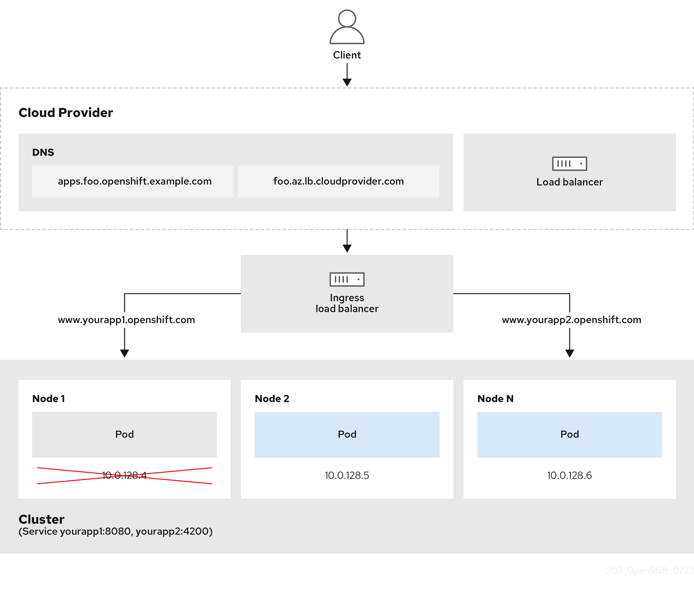

# Ingress Operator in OpenShift Container Platform { #configuring-ingress }

The Ingress Operator implements the `IngressController` API and is the component responsible for enabling external access to OpenShift Container Platform cluster services.

## OpenShift Container Platform Ingress Operator { #nw-ne-openshift-ingress_configuring-ingress }

When you create your OpenShift Container Platform cluster, pods and services running on the cluster are each allocated their own IP addresses. The IP addresses are accessible to other pods and services running nearby but are not accessible to outside clients.

The Ingress Operator makes it possible for external clients to access your service by deploying and managing one or more HAProxy-based [Ingress Controllers](https://kubernetes.io/docs/concepts/services-networking/ingress-controllers/) to handle routing. You can use the Ingress Operator to route traffic by specifying OpenShift Container Platform `Route` and Kubernetes `Ingress` resources. Configurations within the Ingress Controller, such as the ability to define `endpointPublishingStrategy` type and internal load balancing, provide ways to publish Ingress Controller endpoints.

## The Ingress configuration asset { #nw-installation-ingress-config-asset_configuring-ingress }

The installation program generates an asset with an `Ingress` resource in the `config.openshift.io` API group, `cluster-ingress-02-config.yml`.

```yaml title="YAML Definition of the Ingress resource"
apiVersion: config.openshift.io/v1
kind: Ingress
metadata:
  name: cluster
spec:
  domain: apps.openshiftdemos.com
```

The installation program stores this asset in the `cluster-ingress-02-config.yml` file in the `manifests/` directory. This `Ingress` resource defines the cluster-wide configuration for Ingress. This Ingress configuration is used as follows:

- The Ingress Operator uses the domain from the cluster Ingress configuration as the domain for the default Ingress Controller.
- The OpenShift API Server Operator uses the domain from the cluster Ingress configuration. This domain is also used when generating a default host for a `Route` resource that does not specify an explicit host.

## Ingress Controller configuration parameters { #nw-ingress-controller-configuration-parameters_configuring-ingress }

The `IngressController` custom resource (CR) includes optional configuration parameters that you can configure to meet specific needs for your organization.

<table>
<thead>
<tr>
  <th>Parameter</th>
  <th>Description</th>
</tr>
</thead>
<tbody>
<tr>
  <td><code>domain</code></td>
  <td><code>domain</code> is a DNS name serviced by the Ingress Controller and is used to configure multiple features:<br><br><ul><li>For the <code>LoadBalancerService</code> endpoint publishing strategy, <code>domain</code> is used to configure DNS records. See <code>endpointPublishingStrategy</code>.</li><li>When using a generated default certificate, the certificate is valid for <code>domain</code> and its <code>subdomains</code>. See <code>defaultCertificate</code>.</li><li>The value is published to individual Route statuses so that users know where to target external DNS records.</li></ul>The <code>domain</code> value must be unique among all Ingress Controllers and cannot be updated.<br><br>If empty, the default value is <code>ingress.config.openshift.io/cluster</code> <code>.spec.domain</code>.</td>
</tr>
<tr>
  <td><code>replicas</code></td>
  <td><code>replicas</code> is the number of Ingress Controller replicas. If not set, the default value is <code>2</code>.</td>
</tr>
<tr>
  <td><code>endpointPublishingStrategy</code></td>
  <td><code>endpointPublishingStrategy</code> is used to publish the Ingress Controller endpoints to other networks, enable load balancer integrations, and provide access to other systems.<br><br>For cloud environments, use the <code>loadBalancer</code> field to configure the endpoint publishing strategy for your Ingress Controller.<br><br>  On Google Cloud, AWS, and Azure you can configure the following <code>endpointPublishingStrategy</code> fields:  <br><br>  <br><br><ul><li><code>loadBalancer.scope</code></li><li><code>loadBalancer.allowedSourceRanges</code></li></ul>If not set, the default value is based on <code>infrastructure.config.openshift.io/cluster</code> <code>.status.platform</code>:<br><br>    <ul><li>Azure: <code>LoadBalancerService</code> (with External scope)</li><li>Google Cloud: <code>LoadBalancerService</code> (with External scope)</li></ul>  <br><br>  For most platforms, the <code>endpointPublishingStrategy</code> value can be updated. On Google Cloud, you can configure the following <code>endpointPublishingStrategy</code> fields:<br><br><ul><li><code>loadBalancer.scope</code></li><li><code>loadbalancer.providerParameters.gcp.clientAccess</code></li></ul>  <br><br>  For non-cloud environments, such as a bare-metal platform, use the <code>NodePortService</code>, <code>HostNetwork</code>, or <code>Private</code> fields to configure the endpoint publishing strategy for your Ingress Controller.<br><br>If you do not set a value in one of these fields, the default value is based on binding ports specified in the <code>.status.platform</code> value in the <code>IngressController</code> CR.  <br><br>  If you need to update the <code>endpointPublishingStrategy</code> value after your cluster is deployed, you can configure the following <code>endpointPublishingStrategy</code> fields:<br><br><ul><li><code>hostNetwork.protocol</code></li><li><code>nodePort.protocol</code></li><li><code>private.protocol</code></li></ul> </td>
</tr>
<tr>
  <td><code>defaultCertificate</code></td>
  <td>The <code>defaultCertificate</code> value is a reference to a secret that contains the default certificate that is served by the Ingress Controller. When Routes do not specify their own certificate, <code>defaultCertificate</code> is used.<br><br>The secret must contain the following keys and data:<ul><li><code>tls.crt</code>: certificate file contents</li><li><code>tls.key</code>: key file contents</li></ul>If not set, a wildcard certificate is automatically generated and used. The certificate is valid for the Ingress Controller <code>domain</code> and <code>subdomains</code>, and the generated certificate's CA is automatically integrated with the cluster's trust store.<br><br>The in-use certificate, whether generated or user-specified, is automatically integrated with OpenShift Container Platform built-in OAuth server.</td>
</tr>
<tr>
  <td><code>namespaceSelector</code></td>
  <td><code>namespaceSelector</code> is used to filter the set of namespaces serviced by the Ingress Controller. This is useful for implementing shards.</td>
</tr>
<tr>
  <td><code>routeSelector</code></td>
  <td><code>routeSelector</code> is used to filter the set of Routes serviced by the Ingress Controller. This is useful for implementing shards.</td>
</tr>
<tr>
  <td><code>nodePlacement</code></td>
  <td><code>nodePlacement</code> enables explicit control over the scheduling of the Ingress Controller.<br><br>If not set, the defaults values are used.<br><br><div class="admonition note"><p class="admonition-title">Note</p><p>The <code>nodePlacement</code> parameter includes two parts, <code>nodeSelector</code> and <code>tolerations</code>. For example:<br><br><pre>nodePlacement:&#10; nodeSelector:&#10;   matchLabels:&#10;     kubernetes.io/os: linux&#10; tolerations:&#10; - effect: NoSchedule&#10;   operator: Exists</pre></p></div></td>
</tr>
<tr>
  <td><code>tlsSecurityProfile</code></td>
  <td><code>tlsSecurityProfile</code> specifies settings for TLS connections for Ingress Controllers.<br><br>If not set, the default value is based on the <code>apiservers.config.openshift.io/cluster</code> resource.<br><br>When using the <code>Old</code>, <code>Intermediate</code>, and <code>Modern</code> profile types, the effective profile configuration is subject to change between releases. For example, given a specification to use the <code>Intermediate</code> profile deployed on release <code>X.Y.Z</code>, an upgrade to release <code>X.Y.Z+1</code> may cause a new profile configuration to be applied to the Ingress Controller, resulting in a rollout.<br><br>The minimum TLS version for Ingress Controllers is <code>1.1</code>, and the maximum TLS version is <code>1.3</code>.<br><br><div class="admonition note"><p class="admonition-title">Note</p><p>Ciphers and the minimum TLS version of the configured security profile are reflected in the <code>TLSProfile</code> status.</p></div><br><br><div class="admonition warning"><p class="admonition-title">Important</p><p>The Ingress Operator converts the TLS <code>1.0</code> of an <code>Old</code> or <code>Custom</code> profile to <code>1.1</code>.</p></div></td>
</tr>
<tr>
  <td><code>clientTLS</code></td>
  <td><code>clientTLS</code> authenticates client access to the cluster and services; as a result, mutual TLS authentication is enabled. If not set, then client TLS is not enabled.<br><br><code>clientTLS</code> has the required subfields, <code>spec.clientTLS.clientCertificatePolicy</code> and <code>spec.clientTLS.ClientCA</code>.<br><br>The <code>ClientCertificatePolicy</code> subfield accepts one of the two values: <code>Required</code> or <code>Optional</code>. The <code>ClientCA</code> subfield specifies a config map that is in the openshift-config namespace. The config map should contain a CA certificate bundle.<br><br>The <code>AllowedSubjectPatterns</code> is an optional value that specifies a list of regular expressions, which are matched against the distinguished name on a valid client certificate to filter requests. The regular expressions must use PCRE syntax. At least one pattern must match a client certificate's distinguished name; otherwise, the Ingress Controller rejects the certificate and denies the connection. If not specified, the Ingress Controller does not reject certificates based on the distinguished name.</td>
</tr>
<tr>
  <td><code>routeAdmission</code></td>
  <td><code>routeAdmission</code> defines a policy for handling new route claims, such as allowing or denying claims across namespaces.<br><br><code>namespaceOwnership</code> describes how hostname claims across namespaces should be handled. The default is <code>Strict</code>.<br><br><ul><li><code>Strict</code>: does not allow routes to claim the same hostname across namespaces.</li><li><code>InterNamespaceAllowed</code>: allows routes to claim different paths of the same hostname across namespaces.</li></ul><code>wildcardPolicy</code> describes how routes with wildcard policies are handled by the Ingress Controller.<br><br><ul><li><code>WildcardsAllowed</code>: Indicates routes with any wildcard policy are admitted by the Ingress Controller.</li><li><code>WildcardsDisallowed</code>: Indicates only routes with a wildcard policy of <code>None</code> are admitted by the Ingress Controller. Updating <code>wildcardPolicy</code> from <code>WildcardsAllowed</code> to <code>WildcardsDisallowed</code> causes admitted routes with a wildcard policy of <code>Subdomain</code> to stop working. These routes must be recreated to a wildcard policy of <code>None</code> to be readmitted by the Ingress Controller. <code>WildcardsDisallowed</code> is the default setting.</li></ul></td>
</tr>
<tr>
  <td><code>IngressControllerLogging</code></td>
  <td><code>logging</code> defines parameters for what is logged where. If this field is empty, operational logs are enabled but access logs are disabled.<br><br><ul><li><code>access</code> describes how client requests are logged. If this field is empty, access logging is disabled.<ul><li><code>destination</code> describes a destination for log messages.<ul><li><code>type</code> is the type of destination for logs:<ul><li><code>Container</code> specifies that logs should go to a sidecar container. The Ingress Operator configures the container, named <strong>logs</strong>, on the Ingress Controller pod and configures the Ingress Controller to write logs to the container. The expectation is that the administrator configures a custom logging solution that reads logs from this container. Using container logs means that logs may be dropped if the rate of logs exceeds the container runtime capacity or the custom logging solution capacity.</li><li><code>Syslog</code> specifies that logs are sent to a Syslog endpoint. The administrator must specify an endpoint that can receive Syslog messages. The expectation is that the administrator has configured a custom Syslog instance.</li></ul></li><li><code>container</code> describes parameters for the <code>Container</code> logging destination type. Currently there are no parameters for container logging, so this field must be empty.</li><li><code>syslog</code> describes parameters for the <code>Syslog</code> logging destination type:<ul><li><code>address</code> is the IP address of the syslog endpoint that receives log messages.</li><li><code>port</code> is the UDP port number of the syslog endpoint that receives log messages.</li><li><code>maxLength</code> is the maximum length of the syslog message. It must be between <code>480</code> and <code>4096</code> bytes. If this field is empty, the maximum length is set to the default value of <code>1024</code> bytes.</li><li><code>facility</code> specifies the syslog facility of log messages. If this field is empty, the facility is <code>local1</code>. Otherwise, it must specify a valid syslog facility: <code>kern</code>, <code>user</code>, <code>mail</code>, <code>daemon</code>, <code>auth</code>, <code>syslog</code>, <code>lpr</code>, <code>news</code>, <code>uucp</code>, <code>cron</code>, <code>auth2</code>, <code>ftp</code>, <code>ntp</code>, <code>audit</code>, <code>alert</code>, <code>cron2</code>, <code>local0</code>, <code>local1</code>, <code>local2</code>, <code>local3</code>. <code>local4</code>, <code>local5</code>, <code>local6</code>, or <code>local7</code>.</li></ul></li></ul></li><li><code>httpLogFormat</code> specifies the format of the log message for an HTTP request. If this field is empty, log messages use the implementation's default HTTP log format. For HAProxy's default HTTP log format, see <a href="http://cbonte.github.io/haproxy-dconv/2.0/configuration.html#8.2.3">the HAProxy documentation</a>.</li></ul></li></ul></td>
</tr>
<tr>
  <td><code>httpHeaders</code></td>
  <td><code>httpHeaders</code> defines the policy for HTTP headers.<br><br>By setting the <code>forwardedHeaderPolicy</code> for the <code>IngressControllerHTTPHeaders</code>, you specify when and how the Ingress Controller sets the <code>Forwarded</code>, <code>X-Forwarded-For</code>, <code>X-Forwarded-Host</code>, <code>X-Forwarded-Port</code>, <code>X-Forwarded-Proto</code>, and <code>X-Forwarded-Proto-Version</code> HTTP headers.<br><br>By default, the policy is set to <code>Append</code>.<br><br><ul><li><code>Append</code> specifies that the Ingress Controller appends the headers, preserving any existing headers.</li><li><code>Replace</code> specifies that the Ingress Controller sets the headers, removing any existing headers.</li><li><code>IfNone</code> specifies that the Ingress Controller sets the headers if they are not already set.</li><li><code>Never</code> specifies that the Ingress Controller never sets the headers, preserving any existing headers.</li></ul>By setting <code>headerNameCaseAdjustments</code>, you can specify case adjustments that can be applied to HTTP header names. Each adjustment is specified as an HTTP header name with the desired capitalization. For example, specifying <code>X-Forwarded-For</code> indicates that the <code>x-forwarded-for</code> HTTP header should be adjusted to have the specified capitalization.<br><br>These adjustments are only applied to cleartext, edge-terminated, and re-encrypt routes, and only when using HTTP/1.<br><br>For request headers, these adjustments are applied only for routes that have the <code>haproxy.router.openshift.io/h1-adjust-case=true</code> annotation. For response headers, these adjustments are applied to all HTTP responses. If this field is empty, no request headers are adjusted.<br><br><code>actions</code> specifies options for performing certain actions on headers. Headers cannot be set or deleted for TLS passthrough connections. The <code>actions</code> field has additional subfields <code>spec.httpHeader.actions.response</code> and <code>spec.httpHeader.actions.request</code>:<br><br><ul><li>The <code>response</code> subfield specifies a list of HTTP response headers to set or delete.</li><li>The <code>request</code> subfield specifies a list of HTTP request headers to set or delete.</li></ul></td>
</tr>
<tr>
  <td><code>httpCompression</code></td>
  <td><code>httpCompression</code> defines the policy for HTTP traffic compression.<br><br><ul><li><code>mimeTypes</code> defines a list of MIME types to which compression should be applied. For example, <code>text/css; charset=utf-8</code>, <code>text/html</code>, <code>text/*</code>, <code>image/svg+xml</code>, <code>application/octet-stream</code>, <code>X-custom/customsub</code>, using the format pattern, <code>type/subtype; [;attribute=value]</code>. The <code>types</code> are: application, image, message, multipart, text, video, or a custom type prefaced by <code>X-</code>; e.g. To see the full notation for MIME types and subtypes, see <a href="https://datatracker.ietf.org/doc/html/rfc1341#page-7">RFC1341</a></li></ul></td>
</tr>
<tr>
  <td><code>httpErrorCodePages</code></td>
  <td><code>httpErrorCodePages</code> specifies custom HTTP error code response pages. By default, an IngressController uses error pages built into the IngressController image.</td>
</tr>
<tr>
  <td><code>httpCaptureCookies</code></td>
  <td><code>httpCaptureCookies</code> specifies HTTP cookies that you want to capture in access logs. If the <code>httpCaptureCookies</code> field is empty, the access logs do not capture the cookies.<br><br>For any cookie that you want to capture, the following parameters must be in your <code>IngressController</code> configuration:<br><br><ul><li><code>name</code> specifies the name of the cookie.</li><li><code>maxLength</code> specifies tha maximum length of the cookie.</li><li><code>matchType</code> specifies if the field <code>name</code> of the cookie exactly matches the capture cookie setting or is a prefix of the capture cookie setting. The <code>matchType</code> field uses the <code>Exact</code> and <code>Prefix</code> parameters.</li></ul>For example:<pre>  httpCaptureCookies:&#10;  - matchType: Exact&#10;    maxLength: 128&#10;    name: MYCOOKIE</pre></td>
</tr>
<tr>
  <td><code>httpCaptureHeaders</code></td>
  <td><code>httpCaptureHeaders</code> specifies the HTTP headers that you want to capture in the access logs. If the <code>httpCaptureHeaders</code> field is empty, the access logs do not capture the headers.<br><br><code>httpCaptureHeaders</code> contains two lists of headers to capture in the access logs. The two lists of header fields are <code>request</code> and <code>response</code>. In both lists, the <code>name</code> field must specify the header name and the <code>maxlength</code> field must specify the maximum length of the header. For example:<br><br><pre>  httpCaptureHeaders:&#10;    request:&#10;    - maxLength: 256&#10;      name: Connection&#10;    - maxLength: 128&#10;      name: User-Agent&#10;    response:&#10;    - maxLength: 256&#10;      name: Content-Type&#10;    - maxLength: 256&#10;      name: Content-Length</pre></td>
</tr>
<tr>
  <td><code>tuningOptions</code></td>
  <td><code>tuningOptions</code> specifies options for tuning the performance of Ingress Controller pods.<br><br><ul><li><code>clientFinTimeout</code> specifies how long a connection is held open while waiting for the client response to the server closing the connection. The default timeout is <code>1s</code>.</li><li><code>clientTimeout</code> specifies how long a connection is held open while waiting for a client response. The default timeout is <code>30s</code>.</li><li><code>headerBufferBytes</code> specifies how much memory is reserved, in bytes, for Ingress Controller connection sessions. This value must be at least <code>16384</code> if HTTP/2 is enabled for the Ingress Controller. If not set, the default value is <code>32768</code> bytes. Setting this field not recommended because <code>headerBufferBytes</code> values that are too small can break the Ingress Controller, and <code>headerBufferBytes</code> values that are too large could cause the Ingress Controller to use significantly more memory than necessary.</li><li><code>headerBufferMaxRewriteBytes</code> specifies how much memory should be reserved, in bytes, from <code>headerBufferBytes</code> for HTTP header rewriting and appending for Ingress Controller connection sessions. The minimum value for <code>headerBufferMaxRewriteBytes</code> is <code>4096</code>. <code>headerBufferBytes</code> must be greater than <code>headerBufferMaxRewriteBytes</code> for incoming HTTP requests. If not set, the default value is <code>8192</code> bytes. Setting this field not recommended because <code>headerBufferMaxRewriteBytes</code> values that are too small can break the Ingress Controller and <code>headerBufferMaxRewriteBytes</code> values that are too large could cause the Ingress Controller to use significantly more memory than necessary.</li><li><code>healthCheckInterval</code> specifies how long the router waits between health checks. The default is <code>5s</code>.</li><li><code>serverFinTimeout</code> specifies how long a connection is held open while waiting for the server response to the client that is closing the connection. The default timeout is <code>1s</code>.</li><li><code>serverTimeout</code> specifies how long a connection is held open while waiting for a server response. The default timeout is <code>30s</code>.</li><li><code>threadCount</code> specifies the number of threads to create per HAProxy process. Creating more threads allows each Ingress Controller pod to handle more connections, at the cost of more system resources being used. HAProxy</li></ul>supports up to <code>64</code> threads. If this field is empty, the Ingress Controller uses the default value of <code>4</code> threads. The default value can change in future releases. Setting this field is not recommended because increasing the number of HAProxy threads allows Ingress Controller pods to use more CPU time under load, and prevent other pods from receiving the CPU resources they need to perform. Reducing the number of threads can cause the Ingress Controller to perform poorly.<br><br><ul><li><code>tlsInspectDelay</code> specifies how long the router can hold data to find a matching route. Setting this value too short can cause the router to fall back to the default certificate for edge-terminated, reencrypted, or passthrough routes, even when using a better matched certificate. The default inspect delay is <code>5s</code>.</li><li><code>tunnelTimeout</code> specifies how long a tunnel connection, including websockets, remains open while the tunnel is idle. The default timeout is <code>1h</code>.</li><li><code>maxConnections</code> specifies the maximum number of simultaneous connections that can be established per HAProxy process. Increasing this value allows each ingress controller pod to handle more connections at the cost of additional system resources. Permitted values are <code>0</code>, <code>-1</code>, any value within the range <code>2000</code> and <code>2000000</code>, or the field can be left empty.<ul><li>If this field is left empty or has the value <code>0</code>, the Ingress Controller will use the default value of <code>50000</code>. This value is subject to change in future releases.</li><li>If the field has the value of <code>-1</code>, then HAProxy will dynamically compute a maximum value based on the available <code>ulimits</code> in the running container. This process results in a large computed value that will incur significant memory usage compared to the current default value of <code>50000</code>.</li><li>If the field has a value that is greater than the current operating system limit, the HAProxy process will not start.</li><li>If you choose a discrete value and the router pod is migrated to a new node, it is possible the new node does not have an identical <code>ulimit</code> configured. In such cases, the pod fails to start.</li><li>If you have nodes with different <code>ulimits</code> configured, and you choose a discrete value, it is recommended to use the value of <code>-1</code> for this field so that the maximum number of connections is calculated at runtime.</li></ul></li></ul></td>
</tr>
<tr>
  <td><code>logEmptyRequests</code></td>
  <td><code>logEmptyRequests</code> specifies connections for which no request is received and logged. These empty requests come from load balancer health probes or web browser speculative connections (preconnect) and logging these requests can be undesirable. However, these requests can be caused by network errors, in which case logging empty requests can be useful for diagnosing the errors. These requests can be caused by port scans, and logging empty requests can aid in detecting intrusion attempts. Allowed values for this field are <code>Log</code> and <code>Ignore</code>. The default value is <code>Log</code>.<br><br>The <code>LoggingPolicy</code> type accepts either one of two values:<br><br><ul><li><code>Log</code>: Setting this value to <code>Log</code> indicates that an event should be logged.</li><li><code>Ignore</code>: Setting this value to <code>Ignore</code> sets the <code>dontlognull</code> option in the HAproxy configuration.</li></ul></td>
</tr>
<tr>
  <td><code>HTTPEmptyRequestsPolicy</code></td>
  <td><code>HTTPEmptyRequestsPolicy</code> describes how HTTP connections are handled if the connection times out before a request is received. Allowed values for this field are <code>Respond</code> and <code>Ignore</code>. The default value is <code>Respond</code>.<br><br>The <code>HTTPEmptyRequestsPolicy</code> type accepts either one of two values:<br><br><ul><li><code>Respond</code>: If the field is set to <code>Respond</code>, the Ingress Controller sends an HTTP <code>400</code> or <code>408</code> response, logs the connection if access logging is enabled, and counts the connection in the appropriate metrics.</li><li><code>Ignore</code>: Setting this option to <code>Ignore</code> adds the <code>http-ignore-probes</code> parameter in the HAproxy configuration. If the field is set to <code>Ignore</code>, the Ingress Controller closes the connection without sending a response, then logs the connection, or incrementing metrics.</li></ul>These connections come from load balancer health probes or web browser speculative connections (preconnect) and can be safely ignored. However, these requests can be caused by network errors, so setting this field to <code>Ignore</code> can impede detection and diagnosis of problems. These requests can be caused by port scans, in which case logging empty requests can aid in detecting intrusion attempts.</td>
</tr>
</tbody>
</table>


### Ingress Controller TLS security profiles { #configuring-ingress-controller-tls }

TLS security profiles provide a way for servers to regulate which ciphers a connecting client can use when connecting to the server.

#### Understanding TLS security profiles { #tls-profiles-understanding_configuring-ingress }

You can use a TLS (Transport Layer Security) security profile, as described in this section, to define which TLS ciphers are required by various OpenShift Container Platform components. 

The OpenShift Container Platform TLS security profiles are based on [Mozilla recommended configurations](https://wiki.mozilla.org/Security/Server_Side_TLS).

You can specify one of the following TLS security profiles for each component:

**TLS security profiles**

<table>
<thead>
<tr>
  <th>Profile</th>
  <th>Description</th>
</tr>
</thead>
<tbody>
<tr>
  <td><code>Old</code></td>
  <td>This profile is intended for use with legacy clients or libraries. The profile is based on the <a href="https://wiki.mozilla.org/Security/Server_Side_TLS#Old_backward_compatibility">Old backward compatibility</a> recommended configuration.<br><br>The <code>Old</code> profile requires a minimum TLS version of 1.0.<br><br><div class="admonition note"><p class="admonition-title">Note</p><p>For the Ingress Controller, the minimum TLS version is converted from 1.0 to 1.1.</p></div></td>
</tr>
<tr>
  <td><code>Intermediate</code></td>
  <td>This profile is the default TLS security profile for the Ingress Controller, kubelet, and control plane. The profile is based on the <a href="https://wiki.mozilla.org/Security/Server_Side_TLS#Intermediate_compatibility_.28recommended.29">Intermediate compatibility</a> recommended configuration.<br><br>The <code>Intermediate</code> profile requires a minimum TLS version of 1.2.<br><br><div class="admonition note"><p class="admonition-title">Note</p><p>This profile is the recommended configuration for the majority of clients.</p></div></td>
</tr>
<tr>
  <td><code>Modern</code></td>
  <td>This profile is intended for use with modern clients that have no need for backwards compatibility. This profile is based on the <a href="https://wiki.mozilla.org/Security/Server_Side_TLS#Modern_compatibility">Modern compatibility</a> recommended configuration.<br><br>The <code>Modern</code> profile requires a minimum TLS version of 1.3.</td>
</tr>
<tr>
  <td><code>Custom</code></td>
  <td>This profile allows you to define the TLS version and ciphers to use.<br><br><div class="admonition warning"><p class="admonition-title">Warning</p><p>Use caution when using a <code>Custom</code> profile, because invalid configurations can cause problems.</p></div></td>
</tr>
</tbody>
</table>


!!! note

    When using one of the predefined profile types, the effective profile configuration is subject to change between releases. For example, given a specification to use the Intermediate profile deployed on release X.Y.Z, an upgrade to release X.Y.Z+1 might cause a new profile configuration to be applied, resulting in a rollout.

#### Configuring the TLS security profile for the Ingress Controller { #tls-profiles-ingress-configuring_configuring-ingress }

To configure a TLS security profile for an Ingress Controller, edit the `IngressController` custom resource (CR) to specify a predefined or custom TLS security profile.

If a TLS security profile is not configured, the default value is based on the TLS security profile set for the API server, as shown in the following example:

```yaml
apiVersion: operator.openshift.io/v1
kind: IngressController
 ...
spec:
  tlsSecurityProfile:
    old: {}
    type: Old
```

The TLS security profile defines the minimum TLS version and the TLS ciphers for TLS connections for Ingress Controllers.

You can see the ciphers and the minimum TLS version of the configured TLS security profile in the `IngressController` custom resource (CR) under `Status.Tls Profile` and the configured TLS security profile under `Spec.Tls Security Profile`. For the `Custom` TLS security profile, the specific ciphers and minimum TLS version are listed under both parameters.

!!! note

    The HAProxy Ingress Controller image supports TLS `1.3` and the `Modern` profile.

    The Ingress Operator also converts the TLS `1.0` of an `Old` or `Custom` profile to `1.1`.

**Prerequisites**

- You have access to the cluster as a user with the `cluster-admin` role.

**Procedure**

1. Edit the `IngressController` CR in the `openshift-ingress-operator` project to configure the TLS security profile:

    ```terminal
    $ oc edit IngressController default -n openshift-ingress-operator.
    ```

2. Add the `spec.tlsSecurityProfile` field:

    ```yaml title="Sample IngressController CR for a Custom profile"
    apiVersion: operator.openshift.io/v1
    kind: IngressController
     ...
    spec:
      tlsSecurityProfile:
        type: Custom
        custom:
          ciphers:
          - ECDHE-ECDSA-CHACHA20-POLY1305
          - ECDHE-RSA-CHACHA20-POLY1305
          - ECDHE-RSA-AES128-GCM-SHA256
          - ECDHE-ECDSA-AES128-GCM-SHA256
          minTLSVersion: VersionTLS11
     ...
    ```

    - Specify the value for the `spec.tlsSecurityProfile` parameter. The TLS security profile types are `Old`, `Intermediate`, or `Custom`. The default type is `Intermediate`.
    - Specify the appropriate field for the selected `spec.tlsSecurityProfile.type`. The fields are `old: {}`, `intermediate: {}`, `modern: {}`, or `custom:`.
    - For the `custom` type, specify a list of TLS ciphers and the minimum accepted TLS version.

3. Save the file to apply the changes.

**Verification**

- Verify that the profile is set in the `IngressController` CR:

    ```terminal
    $ oc describe IngressController default -n openshift-ingress-operator
    ```

    ```terminal title="Example output"
    Name:         default
    Namespace:    openshift-ingress-operator
    Labels:       <none>
    Annotations:  <none>
    API Version:  operator.openshift.io/v1
    Kind:         IngressController
     ...
    Spec:
     ...
      Tls Security Profile:
        Custom:
          Ciphers:
            ECDHE-ECDSA-CHACHA20-POLY1305
            ECDHE-RSA-CHACHA20-POLY1305
            ECDHE-RSA-AES128-GCM-SHA256
            ECDHE-ECDSA-AES128-GCM-SHA256
          Min TLS Version:  VersionTLS11
        Type:               Custom
     ...
    ```

#### Configuring mutual TLS authentication { #nw-mutual-tls-auth_configuring-ingress }

You can configure the Ingress Controller to enable mutual TLS (mTLS) authentication by setting a `spec.clientTLS` value. The `clientTLS` value configures the Ingress Controller to verify client certificates. This configuration includes setting a `clientCA` value, which is a reference to a config map. The config map contains the PEM-encoded CA certificate bundle that is used to verify a client’s certificate. Optionally, you can also configure a list of certificate subject filters.

If the `clientCA` value specifies an X509v3 certificate revocation list (CRL) distribution point, the Ingress Operator downloads and manages a CRL config map based on the HTTP URI X509v3 `CRL Distribution Point` specified in each provided certificate. The Ingress Controller uses this config map during mTLS/TLS negotiation. Requests that do not provide valid certificates are rejected.

**Prerequisites**

- You have access to the cluster as a user with the `cluster-admin` role.

- You have a PEM-encoded CA certificate bundle.

- If your CA bundle references a CRL distribution point, you must have also included the end-entity or leaf certificate to the client CA bundle. This certificate must have included an HTTP URI under `CRL Distribution Points`, as described in RFC 5280. For example:

    ```terminal
     Issuer: C=US, O=Example Inc, CN=Example Global G2 TLS RSA SHA256 2020 CA1
             Subject: SOME SIGNED CERT            X509v3 CRL Distribution Points:
                    Full Name:
                      URI:http://crl.example.com/example.crl
    ```

**Procedure**

1. In the `openshift-config` namespace, create a config map from your CA bundle:

    ```terminal
    $ oc create configmap \
       router-ca-certs-default \
       --from-file=ca-bundle.pem=client-ca.crt \ (1)
       -n openshift-config
    ```

    1. The config map data key must be `ca-bundle.pem`, and the data value must be a CA certificate in PEM format.

2. Edit the `IngressController` resource in the `openshift-ingress-operator` project:

    ```terminal
    $ oc edit IngressController default -n openshift-ingress-operator
    ```

3. Add the `spec.clientTLS` field and subfields to configure mutual TLS:

    ```yaml title="Sample IngressController CR for a clientTLS profile that specifies filtering patterns"
      apiVersion: operator.openshift.io/v1
      kind: IngressController
      metadata:
        name: default
        namespace: openshift-ingress-operator
      spec:
        clientTLS:
          clientCertificatePolicy: Required
          clientCA:
            name: router-ca-certs-default
          allowedSubjectPatterns:
          - "^/CN=example.com/ST=NC/C=US/O=Security/OU=OpenShift$"
    ```

4. Optional, get the Distinguished Name (DN) for `allowedSubjectPatterns` by entering the following command.

```terminal
$ openssl  x509 -in custom-cert.pem  -noout -subject
subject= /CN=example.com/ST=NC/C=US/O=Security/OU=OpenShift
```

## View the default Ingress Controller { #nw-ingress-view_configuring-ingress }

The Ingress Operator is a core feature of OpenShift Container Platform and is enabled out of the box.

Every new OpenShift Container Platform installation has an `ingresscontroller` named default. It can be supplemented with additional Ingress Controllers. If the default `ingresscontroller` is deleted, the Ingress Operator will automatically recreate it within a minute.

**Procedure**

- View the default Ingress Controller:

    ```terminal
    $ oc describe --namespace=openshift-ingress-operator ingresscontroller/default
    ```

## View Ingress Operator status { #nw-ingress-operator-status_configuring-ingress }

You can view and inspect the status of your Ingress Operator.

**Procedure**

- View your Ingress Operator status:

    ```terminal
    $ oc describe clusteroperators/ingress
    ```

## View Ingress Controller logs { #nw-ingress-operator-logs_configuring-ingress }

You can view your Ingress Controller logs.

**Procedure**

- View your Ingress Controller logs:

    ```terminal
    $ oc logs --namespace=openshift-ingress-operator deployments/ingress-operator -c <container_name>
    ```

## View Ingress Controller status { #nw-ingress-controller-status_configuring-ingress }

Your can view the status of a particular Ingress Controller.

**Procedure**

- View the status of an Ingress Controller:

    ```terminal
    $ oc describe --namespace=openshift-ingress-operator ingresscontroller/<name>
    ```

## Creating a custom Ingress Controller { #nw-create-custom-ingress-controller_configuring-ingress }

As a cluster administrator, you can create a new custom Ingress Controller. Because the default Ingress Controller might change during OpenShift Container Platform updates, creating a custom Ingress Controller can be helpful when maintaining a configuration manually that persists across cluster updates.

This example provides a minimal spec for a custom Ingress Controller. To further customize your custom Ingress Controller, see "Configuring the Ingress Controller".

**Prerequisites**

- Install the OpenShift CLI (`oc`).
- Log in as a user with `cluster-admin` privileges.

**Procedure**

1. Create a YAML file that defines the custom `IngressController` object:

    ```yaml title="Example custom-ingress-controller.yaml file"
    apiVersion: operator.openshift.io/v1
    kind: IngressController
    metadata:
        name: <custom_name> (1)
        namespace: openshift-ingress-operator
    spec:
        defaultCertificate:
            name: <custom-ingress-custom-certs> (2)
        replicas: 1 (3)
        domain: <custom_domain> (4)
    ```

    1. Specify the a custom `name` for the `IngressController` object.
    2. Specify the name of the secret with the custom wildcard certificate.
    3. Minimum replica needs to be ONE
    4. Specify the domain to your domain name. The domain specified on the IngressController object and the domain used for the certificate must match. For example, if the domain value is "custom_domain.mycompany.com", then the certificate must have SAN \*.custom_domain.mycompany.com (with the `*.` added to the domain).

2. Create the object by running the following command:

    ```terminal
    $ oc create -f custom-ingress-controller.yaml
    ```

## Configuring the Ingress Controller { #configuring-ingress-controller }

### Setting a custom default certificate { #nw-ingress-setting-a-custom-default-certificate_configuring-ingress }

As an administrator, you can configure an Ingress Controller to use a custom certificate by creating a Secret resource and editing the `IngressController` custom resource (CR).

**Prerequisites**

- You must have a certificate/key pair in PEM-encoded files, where the certificate is signed by a trusted certificate authority or by a private trusted certificate authority that you configured in a custom PKI.

- Your certificate meets the following requirements:

    - The certificate is valid for the ingress domain.
    - The certificate uses the `subjectAltName` extension to specify a wildcard domain, such as `*.apps.ocp4.example.com`.

- You must have an `IngressController` CR, which includes just having the `default` `IngressController` CR. You can run the following command to check that you have an `IngressController` CR:

    ```terminal
    $ oc --namespace openshift-ingress-operator get ingresscontrollers
    ```

    !!! note

        If you have intermediate certificates, they must be included in the `tls.crt` file of the secret containing a custom default certificate. Order matters when specifying a certificate; list your intermediate certificate(s) after any server certificate(s).

**Procedure**

The following assumes that the custom certificate and key pair are in the `tls.crt` and `tls.key` files in the current working directory. Substitute the actual path names for `tls.crt` and `tls.key`. You also may substitute another name for `custom-certs-default` when creating the Secret resource and referencing it in the IngressController CR.

!!! note

    This action will cause the Ingress Controller to be redeployed, using a rolling deployment strategy.

1. Create a Secret resource containing the custom certificate in the `openshift-ingress` namespace using the `tls.crt` and `tls.key` files.

    ```terminal
    $ oc --namespace openshift-ingress create secret tls custom-certs-default --cert=tls.crt --key=tls.key
    ```

2. Update the IngressController CR to reference the new certificate secret:

    ```terminal
    $ oc patch --type=merge --namespace openshift-ingress-operator ingresscontrollers/default \
      --patch '{"spec":{"defaultCertificate":{"name":"custom-certs-default"}}}'
    ```

3. Verify the update was effective:

    ```terminal
    $ echo Q |\
      openssl s_client -connect console-openshift-console.apps.<domain>:443 -showcerts 2>/dev/null |\
      openssl x509 -noout -subject -issuer -enddate
    ```

    where:

    `<domain>`
    :   Specifies the base domain name for your cluster.

    ```text title="Example output"
    subject=C = US, ST = NC, L = Raleigh, O = RH, OU = OCP4, CN = *.apps.example.com
    issuer=C = US, ST = NC, L = Raleigh, O = RH, OU = OCP4, CN = example.com
    notAfter=May 10 08:32:45 2022 GM
    ```

    !!! tip

        You can alternatively apply the following YAML to set a custom default certificate:

        ```yaml
        apiVersion: operator.openshift.io/v1
        kind: IngressController
        metadata:
          name: default
          namespace: openshift-ingress-operator
        spec:
          defaultCertificate:
            name: custom-certs-default
        ```

    The certificate secret name should match the value used to update the CR.

Once the IngressController CR has been modified, the Ingress Operator updates the Ingress Controller’s deployment to use the custom certificate.

### Removing a custom default certificate { #nw-ingress-custom-default-certificate-remove_configuring-ingress }

As an administrator, you can remove a custom certificate that you configured an Ingress Controller to use.

**Prerequisites**

- You have access to the cluster as a user with the `cluster-admin` role.
- You have installed the OpenShift CLI (`oc`).
- You previously configured a custom default certificate for the Ingress Controller.

**Procedure**

- To remove the custom certificate and restore the certificate that ships with OpenShift Container Platform, enter the following command:

    ```terminal
    $ oc patch -n openshift-ingress-operator ingresscontrollers/default \
      --type json -p $'- op: remove\n  path: /spec/defaultCertificate'
    ```

    There can be a delay while the cluster reconciles the new certificate configuration.

**Verification**

- To confirm that the original cluster certificate is restored, enter the following command:

    ```terminal
    $ echo Q | \
      openssl s_client -connect console-openshift-console.apps.<domain>:443 -showcerts 2>/dev/null | \
      openssl x509 -noout -subject -issuer -enddate
    ```

    where:

    `<domain>`
    :   Specifies the base domain name for your cluster.

    ```text title="Example output"
    subject=CN = *.apps.<domain>
    issuer=CN = ingress-operator@1620633373
    notAfter=May 10 10:44:36 2023 GMT
    ```

### Autoscaling an Ingress Controller { #nw-autoscaling-ingress-controller_configuring-ingress }

You can automatically scale an Ingress Controller to dynamically meet routing performance or availability requirements. For example, the requirement to increase throughput.

The following procedure provides an example for scaling up the default Ingress Controller.

**Prerequisites**

- You have the OpenShift CLI (`oc`) installed.

- You have access to an OpenShift Container Platform cluster as a user with the `cluster-admin` role.

- On VMware vSphere, bare-metal, and Nutanix installer-provisioned infrastructure, scaling up Ingress Controller pods does not improve external traffic performance. To improve performance, ensure that you complete the following prerequisites:

    - You manually configured a user-managed load balancer for your cluster.
    - You ensured that the load balancer was configured for the cluster nodes that handle incoming traffic from the Ingress Controller.

- You installed the Custom Metrics Autoscaler Operator and an associated KEDA Controller.

    - You can install the Operator by using the software catalog on the web console. After you install the Operator, you can create an instance of `KedaController`.

**Procedure**

1. Create a service account to authenticate with Thanos by running the following command:

    ```terminal
    $ oc create -n openshift-ingress-operator serviceaccount thanos && oc describe -n openshift-ingress-operator serviceaccount thanos
    ```

    ```terminal title="Example output"
    Name:                thanos
    Namespace:           openshift-ingress-operator
    Labels:              <none>
    Annotations:         <none>
    Image pull secrets:  thanos-dockercfg-kfvf2
    Mountable secrets:   thanos-dockercfg-kfvf2
    Tokens:              <none>
    Events:              <none>
    ```

2. Manually create the service account secret token with the following command:

    ```terminal
    $ oc apply -f - <<EOF
    apiVersion: v1
    kind: Secret
    metadata:
      name: thanos-token
      namespace: openshift-ingress-operator
      annotations:
        kubernetes.io/service-account.name: thanos
    type: kubernetes.io/service-account-token
    EOF
    ```

3. Define a `TriggerAuthentication` object within the `openshift-ingress-operator` namespace by using the service account’s token.

    1. Create the `TriggerAuthentication` object and pass the value of the `secret` variable to the `TOKEN` parameter:

        ```terminal
        $ oc apply -f - <<EOF
        apiVersion: keda.sh/v1alpha1
        kind: TriggerAuthentication
        metadata:
          name: keda-trigger-auth-prometheus
          namespace: openshift-ingress-operator
        spec:
          secretTargetRef:
          - parameter: bearerToken
            name: thanos-token
            key: token
          - parameter: ca
            name: thanos-token
            key: ca.crt
        EOF
        ```

4. Create and apply a role for reading metrics from Thanos:

    1. Create a new role, `thanos-metrics-reader.yaml`, that reads metrics from pods and nodes:

        ```yaml title="thanos-metrics-reader.yaml"
        apiVersion: rbac.authorization.k8s.io/v1
        kind: Role
        metadata:
          name: thanos-metrics-reader
          namespace: openshift-ingress-operator
        rules:
        - apiGroups:
          - ""
          resources:
          - pods
          - nodes
          verbs:
          - get
        - apiGroups:
          - metrics.k8s.io
          resources:
          - pods
          - nodes
          verbs:
          - get
          - list
          - watch
        - apiGroups:
          - ""
          resources:
          - namespaces
          verbs:
          - get
        ```

    2. Apply the new role by running the following command:

        ```terminal
        $ oc apply -f thanos-metrics-reader.yaml
        ```

5. Add the new role to the service account by entering the following commands:

    ```terminal
    $ oc adm policy -n openshift-ingress-operator add-role-to-user thanos-metrics-reader -z thanos --role-namespace=openshift-ingress-operator
    ```

    ```terminal
    $ oc adm policy -n openshift-ingress-operator add-cluster-role-to-user cluster-monitoring-view -z thanos
    ```

    !!! note

        The argument `add-cluster-role-to-user` is only required if you use cross-namespace queries. The following step uses a query from the `kube-metrics` namespace which requires this argument.

6. Create a new `ScaledObject` YAML file, `ingress-autoscaler.yaml`, that targets the default Ingress Controller deployment:

    ```yaml title="Example ScaledObject definition"
    apiVersion: keda.sh/v1alpha1
    kind: ScaledObject
    metadata:
      name: ingress-scaler
      namespace: openshift-ingress-operator
    spec:
      scaleTargetRef: (1)
        apiVersion: operator.openshift.io/v1
        kind: IngressController
        name: default
        envSourceContainerName: ingress-operator
      minReplicaCount: 1
      maxReplicaCount: 20 (2)
      cooldownPeriod: 1
      pollingInterval: 1
      triggers:
      - type: prometheus
        metricType: AverageValue
        metadata:
          serverAddress: https://thanos-querier.openshift-monitoring.svc.cluster.local:9091 (3)
          namespace: openshift-ingress-operator (4)
          metricName: 'kube-node-role'
          threshold: '1'
          query: 'sum(kube_node_role{role="worker",service="kube-state-metrics"})' (5)
          authModes: "bearer"
        authenticationRef:
          name: keda-trigger-auth-prometheus
    ```

    1. The custom resource that you are targeting. In this case, the Ingress Controller.
    2. Optional: The maximum number of replicas. If you omit this field, the default maximum is set to 100 replicas.
    3. The Thanos service endpoint in the `openshift-monitoring` namespace.
    4. The Ingress Operator namespace.
    5. This expression evaluates to however many worker nodes are present in the deployed cluster.

    !!! warning

        If you are using cross-namespace queries, you must target port 9091 and not port 9092 in the `serverAddress` field. You also must have elevated privileges to read metrics from this port.

7. Apply the custom resource definition by running the following command:

    ```terminal
    $ oc apply -f ingress-autoscaler.yaml
    ```

**Verification**

- Verify that the default Ingress Controller is scaled out to match the value returned by the `kube-state-metrics` query by running the following commands:

    - Use the `grep` command to search the Ingress Controller YAML file for the number of replicas:

        ```terminal
        $ oc get -n openshift-ingress-operator ingresscontroller/default -o yaml | grep replicas:
        ```

    - Get the pods in the `openshift-ingress` project:

        ```terminal
        $ oc get pods -n openshift-ingress
        ```

        ```terminal title="Example output"
        NAME                             READY   STATUS    RESTARTS   AGE
        router-default-7b5df44ff-l9pmm   2/2     Running   0          17h
        router-default-7b5df44ff-s5sl5   2/2     Running   0          3d22h
        router-default-7b5df44ff-wwsth   2/2     Running   0          66s
        ```

**Additional resources**

- [Installing the custom metrics autoscaler](../../nodes/cma/nodes-cma-autoscaling-custom-install.md#nodes-cma-autoscaling-custom-install_nodes-cma-autoscaling-custom-install)
- [Enabling monitoring for user-defined projects](https://docs.redhat.com/en/documentation/monitoring_stack_for_red_hat_openshift/latest/html/configuring_user_workload_monitoring/preparing-to-configure-the-monitoring-stack-uwm#enabling-monitoring-for-user-defined-projects-uwm_preparing-to-configure-the-monitoring-stack-uwm)
- [Understanding custom metrics autoscaler trigger authentications](../../nodes/cma/nodes-cma-autoscaling-custom-trigger-auth.md#nodes-cma-autoscaling-custom-trigger-auth)
- [Understanding custom metrics autoscaler triggers](../../nodes/cma/nodes-cma-autoscaling-custom-trigger.md#nodes-cma-autoscaling-custom-prometheus)
- [Understanding how to add custom metrics autoscalers](../../nodes/cma/nodes-cma-autoscaling-custom-adding.md#nodes-cma-autoscaling-custom-adding)

### Scaling an Ingress Controller { #nw-ingress-controller-configuration_configuring-ingress }

Manually scale an Ingress Controller to meeting routing performance or availability requirements such as the requirement to increase throughput. `oc` commands are used to scale the `IngressController` resource. The following procedure provides an example for scaling up the default `IngressController`.

!!! note

    Scaling is not an immediate action, as it takes time to create the desired number of replicas.

**Prerequisites**

- On VMware vSphere, bare-metal, and Nutanix installer-provisioned infrastructure, scaling up Ingress Controller pods does not improve external traffic performance. To improve performance, ensure that you complete the following prerequisites:

    - You manually configured a user-managed load balancer for your cluster.
    - You ensured that the load balancer was configured for the cluster nodes that handle incoming traffic from the Ingress Controller.

**Procedure**

1. View the current number of available replicas for the default `IngressController`:

    ```terminal
    $ oc get -n openshift-ingress-operator ingresscontrollers/default -o jsonpath='{$.status.availableReplicas}'
    ```

2. Scale the default `IngressController` to the desired number of replicas by using the `oc patch` command. The following example scales the default `IngressController` to 3 replicas.

    ```terminal
    $ oc patch -n openshift-ingress-operator ingresscontroller/default --patch '{"spec":{"replicas": 3}}' --type=merge
    ```

3. Verify that the default `IngressController` scaled to the number of replicas that you specified:

    ```terminal
    $ oc get -n openshift-ingress-operator ingresscontrollers/default -o jsonpath='{$.status.availableReplicas}'
    ```

    !!! tip

        You can alternatively apply the following YAML to scale an Ingress Controller to three replicas:

        ```yaml
        apiVersion: operator.openshift.io/v1
        kind: IngressController
        metadata:
          name: default
          namespace: openshift-ingress-operator
        spec:
          replicas: 3               (1)
        ```

    1. If you need a different amount of replicas, change the `replicas` value.

### Configuring Ingress access logging { #nw-configure-ingress-access-logging_configuring-ingress }

You can configure the Ingress Controller to enable access logs. If you have clusters that do not receive much traffic, then you can log to a sidecar. If you have high traffic clusters, to avoid exceeding the capacity of the logging stack or  to integrate with a logging infrastructure outside of OpenShift Container Platform, you can forward logs to a custom syslog endpoint. You can also specify the format for access logs.

Container logging is useful to enable access logs on low-traffic clusters when there is no existing Syslog logging infrastructure, or for short-term use while diagnosing problems with the Ingress Controller.

Syslog is needed for high-traffic clusters where access logs could exceed the OpenShift Logging stack’s capacity, or for environments where any logging solution needs to integrate with an existing Syslog logging infrastructure. The Syslog use-cases can overlap.

**Prerequisites**

- Log in as a user with `cluster-admin` privileges.

**Procedure**

- For Ingress access logging to a sidecar, complete the following commands:

    - To enable Ingress access logging to a sidecar, enter the following command:

        ```terminal
        $ oc patch ingresscontroller default -n openshift-ingress-operator --type=merge \
          -p '{"spec":{"logging":{"access":{"destination":{"type":"Container"}}}}}'
        ```

        After you configure the Ingress Controller to log to a sidecar, the Operator creates a container named `logs` inside a router pod that exists in the `openshift-ingress` namespace.

    - If you need to disable Ingress access logging, enter the following command that does not specify any values for `spec.logging`:

        ```terminal
        $ oc patch ingresscontroller default -n openshift-ingress-operator --type=json \
          -p='[{"op": "remove", "path": "/spec/logging"}]'
        ```

    - To stream the access logs and system events from the OpenShift Container Platform Ingress Controller, enter the following command:

        ```terminal
        $ oc -n openshift-ingress logs deployment.apps/router-default -c logs
        ```

        ```terminal title="Example output"
        2020-05-11T19:11:50.135710+00:00 router-default-57dfc6cd95-bpmk6 router-default-57dfc6cd95-bpmk6 haproxy[108]: 174.19.21.82:39654 [11/May/2020:19:11:50.133] public be_http:hello-openshift:hello-openshift/pod:hello-openshift:hello-openshift:10.128.2.12:8080 0/0/1/0/1 200 142 - - --NI 1/1/0/0/0 0/0 "GET / HTTP/1.1"
        ```

- To enable logging to an external Syslog server, enter the following command. Use this option if you need to forward logs to a centralized logging solution such as Splunk, Rsyslog, or Logstash.

    ```terminal
    $ oc patch ingresscontroller default -n openshift-ingress-operator --type=merge \
      -p '{"spec":{"logging":{"access":{"destination":{"type":"Syslog","syslog":{"address":"1.2.3.4","port":514,"maxLenght":1024}}}}}}'
    ```

    - Replace `1.2.3.4` with the destination IP address of your logging server. Syslog does not support a DNS hostname value.
    - Replace `514` with the UDP destination port of your logging server.
    - Replace `1024` with the maximum length of a log message in bytes that you want to set for log messages.

- To customize the log format, append an HAProxy-compatible log string to the following command. The string determines what information gets captured in the log format, such as a client IP address.

    ```terminal
    $ oc patch ingresscontroller default -n openshift-ingress-operator --type=merge \
      -p '{"spec":{"logging":{"access":{"httpLogFormat":"%ci:%cp [%t] %ft %b/%s %B %bq %HM %HU %HV"}}}}'
    ```

    !!! note

        For a list of HAProxy log variable descriptions, see [Custom log format](https://docs.haproxy.org/2.8/configuration.html#8.2.6) in the upstream HAProxy documentation.

- To capture custom HTTP headers or response headers in your logs, enter the following command. Consider this option if you need to track an `X-Forwarded-For` header or custom application IDs in the Ingress and application logs.

    ```terminal
    $ oc patch ingresscontroller default -n openshift-ingress-operator --type=merge -p '{"spec":{"logging":{"access":{"httpCaptureHeaders":{"request":[{"name":"User-Agent","maxLength": 1024}],"response":[{"name":"Content-Type","maxLength": 1024}]}}}}}'
    ```

- To configure a log empty requests policy, enter the following command and set the `logEmptyRequests` parameter to `Log`. By default, HAProxy might not log empty requests or health checks, so you must manually enable this feature. To disable the feature, set the `logEmptyRequests` parameter to `Ignore`.

    ```terminal
    $ oc patch ingresscontroller default -n openshift-ingress-operator --type=merge -p '{"spec":{"logging":{"access":{"logEmptyRequests":"Ignore"}}}}'
    ```

**Additional resources**

- [Capturing Original Client IP from the X-Forwarded-For Header in Ingress and Application Logs](https://access.redhat.com/solutions/7096271)

### Setting Ingress Controller thread count { #nw-ingress-setting-thread-count_configuring-ingress }

A cluster administrator can set the thread count to increase the amount of incoming connections a cluster can handle. You can patch an existing Ingress Controller to increase the amount of threads.

**Prerequisites**

- The following assumes that you already created an Ingress Controller.

**Procedure**

- Update the Ingress Controller to increase the number of threads:

    ```terminal
    $ oc -n openshift-ingress-operator patch ingresscontroller/default --type=merge -p '{"spec":{"tuningOptions": {"threadCount": 8}}}'
    ```

    !!! note

        If you have a node that is capable of running large amounts of resources, you can configure `spec.nodePlacement.nodeSelector` with labels that match the capacity of the intended node, and configure `spec.tuningOptions.threadCount` to an appropriately high value.

### Configuring an Ingress Controller to use an internal load balancer { #nw-ingress-setting-internal-lb_configuring-ingress }

When creating an Ingress Controller on cloud platforms, the Ingress Controller is published by a public cloud load balancer by default. As an administrator, you can create an Ingress Controller that uses an internal cloud load balancer.

!!! warning

    If your cloud provider is Microsoft Azure, you must have at least one public load balancer that points to your nodes. If you do not, all of your nodes will lose egress connectivity to the internet.

!!! warning

    If you want to change the `scope` for an `IngressController`, you can change the `.spec.endpointPublishingStrategy.loadBalancer.scope` parameter after the custom resource (CR) is created.

**Figure 1. Diagram of LoadBalancer**



The preceding graphic shows the following concepts pertaining to OpenShift Container Platform Ingress LoadBalancerService endpoint publishing strategy:

- You can load balance externally, using the cloud provider load balancer, or internally, using the OpenShift Ingress Controller Load Balancer.
- You can use the single IP address of the load balancer and more familiar ports, such as 8080 and 4200 as shown on the cluster depicted in the graphic.
- Traffic from the external load balancer is directed at the pods, and managed by the load balancer, as depicted in the instance of a down node. See the [Kubernetes Services documentation](https://kubernetes.io/docs/concepts/services-networking/service/#internal-load-balancer) for implementation details.

**Prerequisites**

- Install the OpenShift CLI (`oc`).
- Log in as a user with `cluster-admin` privileges.

**Procedure**

1. Create an `IngressController` custom resource (CR) in a file named `<name>-ingress-controller.yaml`, such as in the following example:

    ```yaml
    apiVersion: operator.openshift.io/v1
    kind: IngressController
    metadata:
      namespace: openshift-ingress-operator
      name: <name> (1)
    spec:
      domain: <domain> (2)
      endpointPublishingStrategy:
        type: LoadBalancerService
        loadBalancer:
          scope: Internal (3)
    ```

    1. Replace `<name>` with a name for the `IngressController` object.
    2. Specify the `domain` for the application published by the controller.
    3. Specify a value of `Internal` to use an internal load balancer.

2. Create the Ingress Controller defined in the previous step by running the following command:

    ```terminal
    $ oc create -f <name>-ingress-controller.yaml (1)
    ```

    1. Replace `<name>` with the name of the `IngressController` object.

3. Optional: Confirm that the Ingress Controller was created by running the following command:

    ```terminal
    $ oc --all-namespaces=true get ingresscontrollers
    ```

### Configuring global access for an Ingress Controller on Google Cloud { #nw-ingress-controller-configuration-gcp-global-access_configuring-ingress }

An Ingress Controller created on Google Cloud with an internal load balancer generates an internal IP address for the service. A cluster administrator can specify the global access option, which enables clients in any region within the same VPC network and compute region as the load balancer, to reach the workloads running on your cluster.

For more information, see the Google Cloud documentation for [global access](https://cloud.google.com/kubernetes-engine/docs/how-to/internal-load-balancing#global_access).

**Prerequisites**

- You deployed an OpenShift Container Platform cluster on Google Cloud infrastructure.
- You configured an Ingress Controller to use an internal load balancer.
- You installed the OpenShift CLI (`oc`).

**Procedure**

1. Configure the Ingress Controller resource to allow global access.

    !!! note

        You can also create an Ingress Controller and specify the global access option.

    1. Configure the Ingress Controller resource:

        ```terminal
        $ oc -n openshift-ingress-operator edit ingresscontroller/default
        ```

    2. Edit the YAML file:

        ```yaml title="Sample clientAccess configuration to Global"
          spec:
            endpointPublishingStrategy:
              loadBalancer:
                providerParameters:
                  gcp:
                    clientAccess: Global (1)
                  type: GCP
                scope: Internal
              type: LoadBalancerService
        ```

        1. Set `gcp.clientAccess` to `Global`.

    3. Save the file to apply the changes.

2. Run the following command to verify that the service allows global access:

    ```terminal
    $ oc -n openshift-ingress edit svc/router-default -o yaml
    ```

    The output shows that global access is enabled for Google Cloud with the annotation, `networking.gke.io/internal-load-balancer-allow-global-access`.

### Setting the Ingress Controller health check interval { #nw-ingress-controller-config-tuningoptions-healthcheckinterval_configuring-ingress }

A cluster administrator can set the health check interval to define how long the router waits between two consecutive health checks. This value is applied globally as a default for all routes. The default value is 5 seconds.

**Prerequisites**

- The following assumes that you already created an Ingress Controller.

**Procedure**

- Update the Ingress Controller to change the interval between back end health checks:

    ```terminal
    $ oc -n openshift-ingress-operator patch ingresscontroller/default --type=merge -p '{"spec":{"tuningOptions": {"healthCheckInterval": "8s"}}}'
    ```

    !!! note

        To override the `healthCheckInterval` for a single route, use the route annotation `router.openshift.io/haproxy.health.check.interval`

### Configuring the default Ingress Controller for your cluster to be internal { #nw-ingress-default-internal_configuring-ingress }

You can configure the `default` Ingress Controller for your cluster to be internal by deleting and recreating it.

!!! warning

    If your cloud provider is Microsoft Azure, you must have at least one public load balancer that points to your nodes. If you do not, all of your nodes will lose egress connectivity to the internet.

!!! warning

    If you want to change the `scope` for an `IngressController`, you can change the `.spec.endpointPublishingStrategy.loadBalancer.scope` parameter after the custom resource (CR) is created.

**Prerequisites**

- Install the OpenShift CLI (`oc`).
- Log in as a user with `cluster-admin` privileges.

**Procedure**

1. Configure the `default` Ingress Controller for your cluster to be internal by deleting and recreating it.

    ```terminal
    $ oc replace --force --wait --filename - <<EOF
    apiVersion: operator.openshift.io/v1
    kind: IngressController
    metadata:
      namespace: openshift-ingress-operator
      name: default
    spec:
      endpointPublishingStrategy:
        type: LoadBalancerService
        loadBalancer:
          scope: Internal
    EOF
    ```

### Configuring the route admission policy { #nw-route-admission-policy_configuring-ingress }

Administrators and application developers can run applications in multiple namespaces with the same domain name. This is for organizations where multiple teams develop microservices that are exposed on the same hostname.

!!! warning

    Allowing claims across namespaces should only be enabled for clusters with trust between namespaces, otherwise a malicious user could take over a hostname. For this reason, the default admission policy disallows hostname claims across namespaces.

**Prerequisites**

- Cluster administrator privileges.

**Procedure**

- Edit the `.spec.routeAdmission` field of the `ingresscontroller` resource variable using the following command:

    ```terminal
    $ oc -n openshift-ingress-operator patch ingresscontroller/default --patch '{"spec":{"routeAdmission":{"namespaceOwnership":"InterNamespaceAllowed"}}}' --type=merge
    ```

    ```yaml title="Sample Ingress Controller configuration"
    spec:
      routeAdmission:
        namespaceOwnership: InterNamespaceAllowed
    ...
    ```

    !!! tip

        You can alternatively apply the following YAML to configure the route admission policy:

        ```yaml
        apiVersion: operator.openshift.io/v1
        kind: IngressController
        metadata:
          name: default
          namespace: openshift-ingress-operator
        spec:
          routeAdmission:
            namespaceOwnership: InterNamespaceAllowed
        ```

### Using wildcard routes { #using-wildcard-routes_configuring-ingress }

The HAProxy Ingress Controller has support for wildcard routes. The Ingress Operator uses `wildcardPolicy` to configure the `ROUTER_ALLOW_WILDCARD_ROUTES` environment variable of the Ingress Controller.

The default behavior of the Ingress Controller is to admit routes with a wildcard policy of `None`, which is backwards compatible with existing `IngressController` resources.

**Procedure**

1. Configure the wildcard policy.

    1. Use the following command to edit the `IngressController` resource:

        ```terminal
        $ oc edit IngressController
        ```

    2. Under `spec`, set the `wildcardPolicy` field to `WildcardsDisallowed` or `WildcardsAllowed`:

        ```yaml
        spec:
          routeAdmission:
            wildcardPolicy: WildcardsDisallowed # or WildcardsAllowed
        ```

### HTTP header configuration { #nw-http-header-configuration_configuring-ingress }

To customize request and response headers for your applications, configure the Ingress Controller or apply specific route annotations. Understanding the interaction between these configuration methods ensures you effectively manage global and route-specific header policies.

You can also set certain headers by using route annotations. The various ways of configuring headers can present challenges when working together.

!!! note

    You can only set or delete headers within an `IngressController` or `Route` CR, you cannot append them. If an HTTP header is set with a value, that value must be complete and not require appending in the future. In situations where it makes sense to append a header, such as the X-Forwarded-For header, use the `spec.httpHeaders.forwardedHeaderPolicy` field, instead of `spec.httpHeaders.actions`.

Order of precedence
:   When the same HTTP header is modified both in the Ingress Controller and in a route, HAProxy prioritizes the actions in certain ways depending on whether it is a request or response header.

    - For HTTP response headers, actions specified in the Ingress Controller are executed after the actions specified in a route. This means that the actions specified in the Ingress Controller take precedence.
    - For HTTP request headers, actions specified in a route are executed after the actions specified in the Ingress Controller. This means that the actions specified in the route take precedence.

For example, a cluster administrator sets the X-Frame-Options response header with the value `DENY` in the Ingress Controller using the following configuration:

```yaml title="Example IngressController spec"
apiVersion: operator.openshift.io/v1
kind: IngressController
# ...
spec:
  httpHeaders:
    actions:
      response:
      - name: X-Frame-Options
        action:
          type: Set
          set:
            value: DENY
```

A route owner sets the same response header that the cluster administrator set in the Ingress Controller, but with the value `SAMEORIGIN` using the following configuration:

```yaml title="Example Route spec"
apiVersion: route.openshift.io/v1
kind: Route
# ...
spec:
  httpHeaders:
    actions:
      response:
      - name: X-Frame-Options
        action:
          type: Set
          set:
            value: SAMEORIGIN
```

When both the `IngressController` spec and `Route` spec are configuring the X-Frame-Options response header, then the value set for this header at the global level in the Ingress Controller takes precedence, even if a specific route allows frames. For a request header, the `Route` spec value overrides the `IngressController` spec value.

This prioritization occurs because the `haproxy.config` file uses the following logic, where the Ingress Controller is considered the front end and individual routes are considered the back end. The header value `DENY` applied to the front end configurations overrides the same header with the value `SAMEORIGIN` that is set in the back end:

```text
frontend public
  http-response set-header X-Frame-Options 'DENY'

frontend fe_sni
  http-response set-header X-Frame-Options 'DENY'

frontend fe_no_sni
  http-response set-header X-Frame-Options 'DENY'

backend be_secure:openshift-monitoring:alertmanager-main
  http-response set-header X-Frame-Options 'SAMEORIGIN'
```

Additionally, any actions defined in either the Ingress Controller or a route override values set using route annotations.

Special case headers
:   The following headers are either prevented entirely from being set or deleted, or allowed under specific circumstances:

**Special case header configuration options**

<table>
<thead>
<tr>
  <th>Header name</th>
  <th>Configurable using <code>IngressController</code> spec</th>
  <th>Configurable using <code>Route</code> spec</th>
  <th>Reason for disallowment</th>
  <th>Configurable using another method</th>
</tr>
</thead>
<tbody>
<tr>
  <td><code>proxy</code></td>
  <td>No</td>
  <td>No</td>
  <td>The <code>proxy</code> HTTP request header can be used to exploit vulnerable CGI applications by injecting the header value into the <code>HTTP_PROXY</code> environment variable. The <code>proxy</code> HTTP request header is also non-standard and prone to error during configuration.</td>
  <td>No</td>
</tr>
<tr>
  <td><code>host</code></td>
  <td>No</td>
  <td>Yes</td>
  <td>When the <code>host</code> HTTP request header is set using the <code>IngressController</code> CR, HAProxy can fail when looking up the correct route.</td>
  <td>No</td>
</tr>
<tr>
  <td><code>strict-transport-security</code></td>
  <td>No</td>
  <td>No</td>
  <td>The <code>strict-transport-security</code> HTTP response header is already handled using route annotations and does not need a separate implementation.</td>
  <td>Yes: the <code>haproxy.router.openshift.io/hsts_header</code> route annotation</td>
</tr>
<tr>
  <td><code>cookie</code> and <code>set-cookie</code></td>
  <td>No</td>
  <td>No</td>
  <td>The cookies that HAProxy sets are used for session tracking to map client connections to particular back-end servers. Allowing these headers to be set could interfere with HAProxy's session affinity and restrict HAProxy's ownership of a cookie.</td>
  <td>Yes:<br><br><ul><li>the <code>haproxy.router.openshift.io/disable_cookie</code> route annotation</li><li>the <code>haproxy.router.openshift.io/cookie_name</code> route annotation</li></ul></td>
</tr>
</tbody>
</table>


### Setting or deleting HTTP request and response headers in an Ingress Controller { #nw-ingress-set-or-delete-http-headers_configuring-ingress }

You can set or delete certain HTTP request and response headers for compliance purposes or other reasons. You can set or delete these headers either for all routes served by an Ingress Controller or for specific routes.

For example, you might want to migrate an application running on your cluster to use mutual TLS, which requires that your application checks for an X-Forwarded-Client-Cert request header, but the OpenShift Container Platform default Ingress Controller provides an X-SSL-Client-Der request header.

The following procedure modifies the Ingress Controller to set the X-Forwarded-Client-Cert request header, and delete the X-SSL-Client-Der request header.

**Prerequisites**

- You have installed the OpenShift CLI (`oc`).
- You have access to an OpenShift Container Platform cluster as a user with the `cluster-admin` role.

**Procedure**

1. Edit the Ingress Controller resource:

    ```terminal
    $ oc -n openshift-ingress-operator edit ingresscontroller/default
    ```

2. Replace the X-SSL-Client-Der HTTP request header with the X-Forwarded-Client-Cert HTTP request header:

    ```yaml
    apiVersion: operator.openshift.io/v1
    kind: IngressController
    metadata:
      name: default
      namespace: openshift-ingress-operator
    spec:
      httpHeaders:
        actions: (1)
          request: (2)
          - name: X-Forwarded-Client-Cert (3)
            action:
              type: Set (4)
              set:
               value: "%{+Q}[ssl_c_der,base64]" (5)
          - name: X-SSL-Client-Der
            action:
              type: Delete
    ```

    1. The list of actions you want to perform on the HTTP headers.
    2. The type of header you want to change. In this case, a request header.
    3. The name of the header you want to change. For a list of available headers you can set or delete, see *HTTP header configuration*.
    4. The type of action being taken on the header. This field can have the value `Set` or `Delete`.
    5. When setting HTTP headers, you must provide a `value`. The value can be a string from a list of available directives for that header, for example `DENY`, or it can be a dynamic value that will be interpreted using HAProxy’s dynamic value syntax. In this case, a dynamic value is added.

    !!! note

        For setting dynamic header values for HTTP responses, allowed sample fetchers are `res.hdr` and `ssl_c_der`. For setting dynamic header values for HTTP requests, allowed sample fetchers are `req.hdr` and `ssl_c_der`. Both request and response dynamic values can use the `lower` and `base64` converters.

3. Save the file to apply the changes.

### Using X-Forwarded headers { #nw-using-ingress-forwarded_configuring-ingress }

You configure the HAProxy Ingress Controller to specify a policy for how to handle HTTP headers including `Forwarded` and `X-Forwarded-For`. The Ingress Operator uses the `HTTPHeaders` field to configure the `ROUTER_SET_FORWARDED_HEADERS` environment variable of the Ingress Controller.

**Procedure**

1. Configure the `HTTPHeaders` field for the Ingress Controller.

    1. Use the following command to edit the `IngressController` resource:

        ```terminal
        $ oc edit IngressController
        ```

    2. Under `spec`, set the `HTTPHeaders` policy field to `Append`, `Replace`, `IfNone`, or `Never`:

        ```yaml
        apiVersion: operator.openshift.io/v1
        kind: IngressController
        metadata:
          name: default
          namespace: openshift-ingress-operator
        spec:
          httpHeaders:
            forwardedHeaderPolicy: Append
        ```

#### Example use cases { #_example_use_cases }

**As a cluster administrator, you can:**

- Configure an external proxy that injects the `X-Forwarded-For` header into each request before forwarding it to an Ingress Controller.

    To configure the Ingress Controller to pass the header through unmodified, you specify the `never` policy. The Ingress Controller then never sets the headers, and applications receive only the headers that the external proxy provides.

- Configure the Ingress Controller to pass the `X-Forwarded-For` header that your external proxy sets on external cluster requests through unmodified.

    To configure the Ingress Controller to set the `X-Forwarded-For` header on internal cluster requests, which do not go through the external proxy, specify the `if-none` policy. If an HTTP request already has the header set through the external proxy, then the Ingress Controller preserves it. If the header is absent because the request did not come through the proxy, then the Ingress Controller adds the header.

**As an application developer, you can:**

- Configure an application-specific external proxy that injects the `X-Forwarded-For` header.

    To configure an Ingress Controller to pass the header through unmodified for an application’s Route, without affecting the policy for other Routes, add an annotation `haproxy.router.openshift.io/set-forwarded-headers: if-none` or `haproxy.router.openshift.io/set-forwarded-headers: never` on the Route for the application.

    !!! note

        You can set the `haproxy.router.openshift.io/set-forwarded-headers` annotation on a per route basis, independent from the globally set value for the Ingress Controller.

### Enable or disable HTTP/2 on Ingress Controllers { #nw-http2-haproxy_configuring-ingress }

You can enable or disable transparent end-to-end HTTP/2 connectivity in HAProxy. Application owners can use HTTP/2 protocol capabilities, including single connection, header compression, binary streams, and more.

You can enable or disable HTTP/2 connectivity for an individual Ingress Controller or for the entire cluster.

!!! note

    If you enable or disable HTTP/2 connectivity for an individual Ingress Controller and for the entire cluster, the HTTP/2 configuration for the Ingress Controller takes precedence over the HTTP/2 configuration for the cluster.

To enable the use of HTTP/2 for a connection from the client to an HAProxy instance, a route must specify a custom certificate. A route that uses the default certificate cannot use HTTP/2. This restriction is necessary to avoid problems from connection coalescing, where the client re-uses a connection for different routes that use the same certificate.

Consider the following use cases for an HTTP/2 connection for each route type:

- For a re-encrypt route, the connection from HAProxy to the application pod can use HTTP/2 if the application supports using Application-Level Protocol Negotiation (ALPN) to negotiate HTTP/2 with HAProxy. You cannot use HTTP/2 with a re-encrypt route unless the Ingress Controller has HTTP/2 enabled.
- For a passthrough route, the connection can use HTTP/2 if the application supports using ALPN to negotiate HTTP/2 with the client. You can use HTTP/2 with a passthrough route if the Ingress Controller has HTTP/2 enabled or disabled.
- For an edge-terminated secure route, the connection uses HTTP/2 if the service specifies only `appProtocol: kubernetes.io/h2c`. You can use HTTP/2 with an edge-terminated secure route if the Ingress Controller has HTTP/2 enabled or disabled.
- For an insecure route, the connection uses HTTP/2 if the service specifies only `appProtocol: kubernetes.io/h2c`. You can use HTTP/2 with an insecure route if the Ingress Controller has HTTP/2 enabled or disabled.

!!! warning

    For non-passthrough routes, the Ingress Controller negotiates its connection to the application independently of the connection from the client. This means a client might connect to the Ingress Controller and negotiate HTTP/1.1. The Ingress Controller might then connect to the application, negotiate HTTP/2, and forward the request from the client HTTP/1.1 connection by using the HTTP/2 connection to the application.

    This sequence of events causes an issue if the client subsequently tries to upgrade its connection from HTTP/1.1 to the WebSocket protocol. Consider that if you have an application that is intending to accept WebSocket connections, and the application attempts to allow for HTTP/2 protocol negotiation, the client fails any attempt to upgrade to the WebSocket protocol.

#### Enabling HTTP/2 { #nw-enable-http2_configuring-ingress }

You can enable HTTP/2 on a specific Ingress Controller, or you can enable HTTP/2 for the entire cluster.

**Procedure**

- To enable HTTP/2 on a specific Ingress Controller, enter the `oc annotate` command:

    ```terminal
    $ oc -n openshift-ingress-operator annotate ingresscontrollers/<ingresscontroller_name> ingress.operator.openshift.io/default-enable-http2=true (1)
    ```

    1. Replace `<ingresscontroller_name>` with the name of an Ingress Controller to enable HTTP/2.

- To enable HTTP/2 for the entire cluster, enter the `oc annotate` command:

    ```terminal
    $ oc annotate ingresses.config/cluster ingress.operator.openshift.io/default-enable-http2=true
    ```

    !!! tip

        Alternatively, you can apply the following YAML code to enable HTTP/2:

        ```yaml
        apiVersion: config.openshift.io/v1
        kind: Ingress
        metadata:
          name: cluster
          annotations:
            ingress.operator.openshift.io/default-enable-http2: "true"
        ```

#### Disabling HTTP/2 { #nw-disable-http2_configuring-ingress }

You can disable HTTP/2 on a specific Ingress Controller, or you can disable HTTP/2 for the entire cluster.

**Procedure**

- To disable HTTP/2 on a specific Ingress Controller, enter the `oc annotate` command:

    ```terminal
    $ oc -n openshift-ingress-operator annotate ingresscontrollers/<ingresscontroller_name> ingress.operator.openshift.io/default-enable-http2=false (1)
    ```

    1. Replace `<ingresscontroller_name>` with the name of an Ingress Controller to disable HTTP/2.

- To disable HTTP/2 for the entire cluster, enter the `oc annotate` command:

    ```terminal
    $ oc annotate ingresses.config/cluster ingress.operator.openshift.io/default-enable-http2=false
    ```

    !!! tip

        Alternatively, you can apply the following YAML code to disable HTTP/2:

        ```yaml
        apiVersion: config.openshift.io/v1
        kind: Ingress
        metadata:
          name: cluster
          annotations:
            ingress.operator.openshift.io/default-enable-http2: "false"
        ```

### Configuring the PROXY protocol for an Ingress Controller { #nw-ingress-controller-configuration-proxy-protocol_configuring-ingress }

A cluster administrator can configure [the PROXY protocol](https://www.haproxy.org/download/2.8/doc/proxy-protocol.txt) when an Ingress Controller uses either the `HostNetwork`, `NodePortService`, or `Private` endpoint publishing strategy types. The PROXY protocol enables the load balancer to preserve the original client addresses for connections that the Ingress Controller receives. The original client addresses are useful for logging, filtering, and injecting HTTP headers. In the default configuration, the connections that the Ingress Controller receives only contain the source address that is associated with the load balancer.

!!! warning

    The default Ingress Controller with installer-provisioned clusters on non-cloud platforms that use a Keepalived Ingress Virtual IP (VIP) do not support the PROXY protocol.

The PROXY protocol enables the load balancer to preserve the original client addresses for connections that the Ingress Controller receives. The original client addresses are useful for logging, filtering, and injecting HTTP headers. In the default configuration, the connections that the Ingress Controller receives contain only the source IP address that is associated with the load balancer.

!!! warning

    For a passthrough route configuration, servers in OpenShift Container Platform clusters cannot observe the original client source IP address. If you need to know the original client source IP address, configure Ingress access logging for your Ingress Controller so that you can view the client source IP addresses.

    For re-encrypt and edge routes, the OpenShift Container Platform router sets the `Forwarded` and `X-Forwarded-For` headers so that application workloads check the client source IP address.

    For more information about Ingress access logging, see "Configuring Ingress access logging".

Configuring the PROXY protocol for an Ingress Controller is not supported when using the `LoadBalancerService` endpoint publishing strategy type. This restriction is because when OpenShift Container Platform runs in a cloud platform, and an Ingress Controller specifies that a service load balancer should be used, the Ingress Operator configures the load balancer service and enables the PROXY protocol based on the platform requirement for preserving source addresses.

!!! warning

    You must configure both OpenShift Container Platform and the external load balancer to use either the PROXY protocol or TCP.

This feature is not supported in cloud deployments. This restriction is because when OpenShift Container Platform runs in a cloud platform, and an Ingress Controller specifies that a service load balancer should be used, the Ingress Operator configures the load balancer service and enables the PROXY protocol based on the platform requirement for preserving source addresses.

!!! warning

    You must configure both OpenShift Container Platform and the external load balancer to either use the PROXY protocol or to use Transmission Control Protocol (TCP).

**Prerequisites**

- You created an Ingress Controller.

**Procedure**

1. Edit the Ingress Controller resource by entering the following command in your CLI:

    ```terminal
    $ oc -n openshift-ingress-operator edit ingresscontroller/default
    ```

2. Set the PROXY configuration:

    - If your Ingress Controller uses the `HostNetwork` endpoint publishing strategy type, set the `spec.endpointPublishingStrategy.hostNetwork.protocol` subfield to `PROXY`:

        ```yaml title="Sample hostNetwork configuration to PROXY"
        # ...
          spec:
            endpointPublishingStrategy:
              hostNetwork:
                protocol: PROXY
              type: HostNetwork
        # ...
        ```

    - If your Ingress Controller uses the `NodePortService` endpoint publishing strategy type, set the `spec.endpointPublishingStrategy.nodePort.protocol` subfield to `PROXY`:

        ```yaml title="Sample nodePort configuration to PROXY"
        # ...
          spec:
            endpointPublishingStrategy:
              nodePort:
                protocol: PROXY
              type: NodePortService
        # ...
        ```

    - If your Ingress Controller uses the `Private` endpoint publishing strategy type, set the `spec.endpointPublishingStrategy.private.protocol` subfield to `PROXY`:

        ```yaml title="Sample private configuration to PROXY"
        # ...
          spec:
            endpointPublishingStrategy:
              private:
                protocol: PROXY
            type: Private
        # ...
        ```

**Additional resources**

- [Configuring Ingress access logging](ingress-operator.md#nw-configure-ingress-access-logging_configuring-ingress)

### Specifying an alternative cluster domain using the appsDomain option { #nw-ingress-configuring-application-domain_configuring-ingress }

As a cluster administrator, you can specify an alternative to the default cluster domain for user-created routes by configuring the `appsDomain` field. The `appsDomain` field is an optional domain for OpenShift Container Platform to use instead of the default, which is specified in the `domain` field. If you specify an alternative domain, it overrides the default cluster domain for the purpose of determining the default host for a new route.

For example, you can use the DNS domain for your company as the default domain for routes and ingresses for applications running on your cluster.

**Prerequisites**

- You deployed an OpenShift Container Platform cluster.
- You installed the `oc` command-line interface.

**Procedure**

1. Configure the `appsDomain` field by specifying an alternative default domain for user-created routes.

    1. Edit the ingress `cluster` resource:

        ```terminal
        $ oc edit ingresses.config/cluster -o yaml
        ```

    2. Edit the YAML file:

        ```yaml title="Sample appsDomain configuration to test.example.com"
        apiVersion: config.openshift.io/v1
        kind: Ingress
        metadata:
          name: cluster
        spec:
          domain: apps.example.com            (1)
          appsDomain: <test.example.com>      (2)
        ```

        1. Specifies the default domain. You cannot modify the default domain after installation.
        2. Optional: Domain for OpenShift Container Platform infrastructure to use for application routes. Instead of the default prefix, `apps`, you can use an alternative prefix like `test`.

2. Verify that an existing route contains the domain name specified in the `appsDomain` field by exposing the route and verifying the route domain change:

    !!! note

        Wait for the `openshift-apiserver` finish rolling updates before exposing the route.

    1. Expose the route by entering the following command. The command outputs `route.route.openshift.io/hello-openshift exposed` to designate exposure of the route.

        ```terminal
        $ oc expose service hello-openshift
        ```

    2. Get a list of routes by running the following command:

        ```terminal
        $ oc get routes
        ```

        ```text title="Example output"
        NAME              HOST/PORT                                   PATH   SERVICES          PORT       TERMINATION   WILDCARD
        hello-openshift   hello_openshift-<my_project>.test.example.com
        hello-openshift   8080-tcp                 None
        ```

### Converting HTTP header case { #nw-ingress-converting-http-header-case_configuring-ingress }

HAProxy lowercases HTTP header names by default; for example, changing `Host: xyz.com` to `host: xyz.com`. If legacy applications are sensitive to the capitalization of HTTP header names, use the Ingress Controller `spec.httpHeaders.headerNameCaseAdjustments` API field for a solution to accommodate legacy applications until they can be fixed.

!!! warning

    OpenShift Container Platform includes HAProxy 2.8. If you want to update to this version of the web-based load balancer, ensure that you add the `spec.httpHeaders.headerNameCaseAdjustments` section to your cluster’s configuration file.

As a cluster administrator, you can convert the HTTP header case by entering the `oc patch` command or by setting the `HeaderNameCaseAdjustments` field in the Ingress Controller YAML file.

**Prerequisites**

- You have installed the OpenShift CLI (`oc`).
- You have access to the cluster as a user with the `cluster-admin` role.

**Procedure**

- Capitalize an HTTP header by using the `oc patch` command.

    1. Change the HTTP header from `host` to `Host` by running the following command:

        ```terminal
        $ oc -n openshift-ingress-operator patch ingresscontrollers/default --type=merge --patch='{"spec":{"httpHeaders":{"headerNameCaseAdjustments":["Host"]}}}'
        ```

    2. Create a `Route` resource YAML file so that the annotation can be applied to the application.

        ```yaml title="Example of a route named my-application"
        apiVersion: route.openshift.io/v1
        kind: Route
        metadata:
          annotations:
            haproxy.router.openshift.io/h1-adjust-case: true (1)
          name: <application_name>
          namespace: <application_name>
        # ...
        ```

        1. Set `haproxy.router.openshift.io/h1-adjust-case` so that the Ingress Controller can adjust the `host` request header as specified.

- Specify adjustments by configuring the `HeaderNameCaseAdjustments` field in the Ingress Controller YAML configuration file.

    1. The following example Ingress Controller YAML file adjusts the `host` header to `Host` for HTTP/1 requests to appropriately annotated routes:

        ```yaml title="Example Ingress Controller YAML"
        apiVersion: operator.openshift.io/v1
        kind: IngressController
        metadata:
          name: default
          namespace: openshift-ingress-operator
        spec:
          httpHeaders:
            headerNameCaseAdjustments:
            - Host
        ```

    2. The following example route enables HTTP response header name case adjustments by using the `haproxy.router.openshift.io/h1-adjust-case` annotation:

        ```yaml title="Example route YAML"
        apiVersion: route.openshift.io/v1
        kind: Route
        metadata:
          annotations:
            haproxy.router.openshift.io/h1-adjust-case: true (1)
          name: my-application
          namespace: my-application
        spec:
          to:
            kind: Service
            name: my-application
        ```

        1. Set `haproxy.router.openshift.io/h1-adjust-case` to true.

### Using router compression { #nw-configuring-router-compression_configuring-ingress }

You configure the HAProxy Ingress Controller to specify router compression globally for specific MIME types. You can use the `mimeTypes` variable to define the formats of MIME types to which compression is applied. The types are: application, image, message, multipart, text, video, or a custom type prefaced by "X-". To see the full notation for MIME types and subtypes, see [RFC1341](https://datatracker.ietf.org/doc/html/rfc1341#page-7).

!!! note

    Memory allocated for compression can affect the max connections. Additionally, compression of large buffers can cause latency, like heavy regex or long lists of regex.

    Not all MIME types benefit from compression, but HAProxy still uses resources to try to compress if instructed to.  Generally, text formats, such as html, css, and js, formats benefit from compression, but formats that are already compressed, such as image, audio, and video, benefit little in exchange for the time and resources spent on compression.

**Procedure**

1. Configure the `httpCompression` field for the Ingress Controller.

    1. Use the following command to edit the `IngressController` resource:

        ```terminal
        $ oc edit -n openshift-ingress-operator ingresscontrollers/default
        ```

    2. Under `spec`, set the `httpCompression` policy field to `mimeTypes` and specify a list of MIME types that should have compression applied:

        ```yaml
        apiVersion: operator.openshift.io/v1
        kind: IngressController
        metadata:
          name: default
          namespace: openshift-ingress-operator
        spec:
          httpCompression:
            mimeTypes:
            - "text/html"
            - "text/css; charset=utf-8"
            - "application/json"
           ...
        ```

### Exposing router metrics { #nw-exposing-router-metrics_configuring-ingress }

You can retrieve Prometheus-format HAProxy ingress router metrics from port `1936` to monitor ingress load and troubleshoot routing behavior. By analyzing these metrics, you can identify capacity bottlenecks and determine when to scale your router deployment.

**Prerequisites**

- You have cluster administrator access to the cluster.
- You configured your firewall to allow port `1936`.

!!! note

    The Prometheus `/metrics` endpoint and the HAProxy HTML statistics dashboard are mutually exclusive exposition modes because the HAProxy router process serves one mode at a time. The Ingress Operator configures default Ingress Controller pods for Prometheus scraping (`/metrics` on port `1936`). Browsing `http://<user>:<password>@<pod_IP>:1936/` for interactive HTML statistics is not supported concurrently with Prometheus metrics on deployments that the Ingress Operator configures in this manner.

**Procedure**

1. List the router pods in the ingress namespace by entering the following command:

    ```terminal
    $ oc get pods -n openshift-ingress
    ```

    ```terminal title="Example output"
    NAME                               READY   STATUS    RESTARTS   AGE
    router-default-76bfffb66c-46qwp   1/1     Running   0          11h
    ```

2. Read the stats user from the router pod under `/var/lib/haproxy/conf/metrics-auth/` by entering the following command:

    ```terminal
    $ oc rsh <router_pod_name> cat /var/lib/haproxy/conf/metrics-auth/statsUsername
    ```

3. Read the stats password from the router pod under `/var/lib/haproxy/conf/metrics-auth/` by entering the following command:

    ```terminal
    $ oc rsh <router_pod_name> cat /var/lib/haproxy/conf/metrics-auth/statsPassword
    ```

4. Get pod details, including the IP address for the pod, by entering the following command:

    ```terminal
    $ oc describe pod <router_pod>
    ```

5. Fetch Prometheus text metrics from the default port `1936` by entering the following command:

    ```terminal
    $ curl -u <user>:<password> http://<router_IP>:1936/metrics
    ```

    If the stats endpoint serves TLS-protected Prometheus text, retrieve metrics over HTTPS instead by entering the following command:

    ```terminal
    $ curl -u <user>:<password> https://<router_IP>:1936/metrics -k
    ```

    ```terminal title="Example output"
    ...
    # HELP haproxy_max_connections Hard limit on the number of connections (configured or imposed by ulimit -n).
    # TYPE haproxy_max_connections gauge
    haproxy_max_connections 50000
    ...
    ```

6. Optional: In the OpenShift Container Platform web console, navigate to **Observe** → **Metrics**, or query Prometheus directly, to compare ingress load against the HAProxy allowance.

    The `haproxy_max_connections` gauge reflects each scraped router endpoint’s HAProxy allowance from `spec.tuningOptions.maxConnections` on the `IngressController`, bound by operating system limits such as `ulimit -n`. Before relying on ratios, confirm the labeled metric for front-end sessions that your HAProxy Prometheus exporter emits. For example, use `haproxy_frontend_current_sessions` when that series is available for your deployment.

    Expressions similar to `sum(haproxy_frontend_current_sessions) / sum(haproxy_max_connections)` can estimate connection load across scrape targets after you verify those series for your deployment.

    If the ratio approaches `1`, adjust `spec.tuningOptions.maxConnections` on the `IngressController` or scale the router deployment.

### Customizing HAProxy error code response pages { #nw-customize-ingress-error-pages_configuring-ingress }

As a cluster administrator, you can specify a custom error code response page for either 503, 404, or both error pages. The HAProxy router serves a 503 error page when the application pod is not running or a 404 error page when the requested URL does not exist. For example, if you customize the 503 error code response page, then the page is served when the application pod is not running, and the default 404 error code HTTP response page is served by the HAProxy router for an incorrect route or a non-existing route.

Custom error code response pages are specified in a config map then patched to the Ingress Controller. The config map keys have two available file names as follows: `error-page-503.http` and `error-page-404.http`.

Custom HTTP error code response pages must follow the [HAProxy HTTP error page configuration guidelines](https://www.haproxy.com/documentation/hapee/latest/configuration/config-sections/http-errors/). Here is an example of the default OpenShift Container Platform HAProxy router [http 503 error code response page](https://raw.githubusercontent.com/openshift/router/master/images/router/haproxy/conf/error-page-503.http). You can use the default content as a template for creating your own custom page.

By default, the HAProxy router serves only a 503 error page when the application is not running or when the route is incorrect or non-existent. This default behavior is the same as the behavior on OpenShift Container Platform 4.8 and earlier. If a config map for the customization of an HTTP error code response is not provided, and you are using a custom HTTP error code response page, the router serves a default 404 or 503 error code response page.

!!! note

    If you use the OpenShift Container Platform default 503 error code page as a template for your customizations, the headers in the file require an editor that can use CRLF line endings.

**Procedure**

1. Create a config map named `my-custom-error-code-pages` in the `openshift-config` namespace:

    ```terminal
    $ oc -n openshift-config create configmap my-custom-error-code-pages \
      --from-file=error-page-503.http \
      --from-file=error-page-404.http
    ```

    !!! warning

        If you do not specify the correct format for the custom error code response page, a router pod outage occurs. To resolve this outage, you must delete or correct the config map and delete the affected router pods so they can be recreated with the correct information.

2. Patch the Ingress Controller to reference the `my-custom-error-code-pages` config map by name:

    ```terminal
    $ oc patch -n openshift-ingress-operator ingresscontroller/default --patch '{"spec":{"httpErrorCodePages":{"name":"my-custom-error-code-pages"}}}' --type=merge
    ```

    The Ingress Operator copies the `my-custom-error-code-pages` config map from the `openshift-config` namespace to the `openshift-ingress` namespace. The Operator names the config map according to the pattern, `<your_ingresscontroller_name>-errorpages`, in the `openshift-ingress` namespace.

3. Display the copy:

    ```terminal
    $ oc get cm default-errorpages -n openshift-ingress
    ```

    ```text title="Example output"
    NAME                       DATA   AGE
    default-errorpages         2      25s  (1)
    ```

    1. The example config map name is `default-errorpages` because the `default` Ingress Controller custom resource (CR) was patched.

4. Confirm that the config map containing the custom error response page mounts on the router volume where the config map key is the filename that has the custom HTTP error code response:

    - For 503 custom HTTP custom error code response:

        ```terminal
        $ oc -n openshift-ingress rsh <router_pod> cat /var/lib/haproxy/conf/error_code_pages/error-page-503.http
        ```

    - For 404 custom HTTP custom error code response:

        ```terminal
        $ oc -n openshift-ingress rsh <router_pod> cat /var/lib/haproxy/conf/error_code_pages/error-page-404.http
        ```

**Verification**

Verify your custom error code HTTP response:

1. Create a test project and application:

    ```terminal
    $ oc new-project test-ingress
    ```

    ```terminal
    $ oc new-app django-psql-example
    ```

2. For 503 custom http error code response:

    1. Stop all the pods for the application.

    2. Run the following curl command or visit the route hostname in the browser:

        ```terminal
        $ curl -vk <route_hostname>
        ```

3. For 404 custom http error code response:

    1. Visit a non-existent route or an incorrect route.

    2. Run the following curl command or visit the route hostname in the browser:

        ```terminal
        $ curl -vk <route_hostname>
        ```

4. Check if the `errorfile` attribute is properly in the `haproxy.config` file:

    ```terminal
    $ oc -n openshift-ingress rsh <router> cat /var/lib/haproxy/conf/haproxy.config | grep errorfile
    ```

### Setting the Ingress Controller maximum connections { #nw-ingress-setting-max-connections_configuring-ingress }

A cluster administrator can set the maximum number of simultaneous connections for OpenShift router deployments. You can patch an existing Ingress Controller to increase the maximum number of connections.

**Prerequisites**

- The following assumes that you already created an Ingress Controller

**Procedure**

- Update the Ingress Controller to change the maximum number of connections for HAProxy:

    ```terminal
    $ oc -n openshift-ingress-operator patch ingresscontroller/default --type=merge -p '{"spec":{"tuningOptions": {"maxConnections": 7500}}}'
    ```

    !!! warning

        If you set the `spec.tuningOptions.maxConnections` value greater than the current operating system limit, the HAProxy process will not start. See the table in the "Ingress Controller configuration parameters" section for more information about this parameter.

**Additional resources**

- [Configuring a custom PKI](../configuring_network_settings/configuring-a-custom-pki.md#configuring-a-custom-pki)
