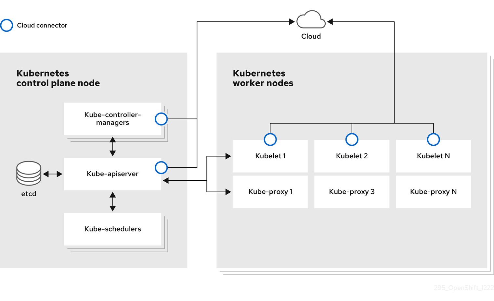

# Overview of nodes { #overview-of-nodes }

In an OpenShift Container Platform cluster, nodes, pods, and application containers are foundational components that you use to create and manage workloads.

## Glossary of common terms for OpenShift Container Platform nodes { #nodes-overview-glossary-common-terms_overview-of-nodes }

This glossary defines common terms that are used in the *node* content.

Container
:   It is a lightweight and executable image that comprises software and all its dependencies. Containers virtualize the operating system, as a result, you can run containers anywhere from a data center to a public or private cloud to even a developer’s laptop.

Daemon set
:   Ensures that a replica of the pod runs on eligible nodes in an OpenShift Container Platform cluster.

egress
:   The process of data sharing externally through a network’s outbound traffic from a pod.

garbage collection
:   The process of cleaning up cluster resources, such as terminated containers and images that are not referenced by any running pods.

Horizontal Pod Autoscaler(HPA)
:   Implemented as a Kubernetes API resource and a controller. You can use the HPA to specify the minimum and maximum number of pods that you want to run. You can also specify the CPU or memory utilization that your pods should target. The HPA scales out and scales in pods when a given CPU or memory threshold is crossed.

Ingress
:   Incoming traffic to a pod.

Job
:   A process that runs to completion. A job creates one or more pod objects and ensures that the specified pods are successfully completed.

Labels
:   You can use labels, which are key-value pairs, to organize and select subsets of objects, such as a pod.

Node
:   A worker machine in the OpenShift Container Platform cluster. A node can be either be a virtual machine (VM) or a physical machine.

Node Tuning Operator
:   You can use the Node Tuning Operator to manage node-level tuning by using the TuneD daemon. It ensures custom tuning specifications are passed to all containerized TuneD daemons running in the cluster in the format that the daemons understand. The daemons run on all nodes in the cluster, one per node.

Self Node Remediation Operator
:   The Operator runs on the cluster nodes and identifies and reboots nodes that are unhealthy.

Pod
:   One or more containers with shared resources, such as volume and IP addresses, running in your OpenShift Container Platform cluster. A pod is the smallest compute unit defined, deployed, and managed.

Toleration
:   Indicates that the pod is allowed (but not required) to be scheduled on nodes or node groups with matching taints. You can use tolerations to enable the scheduler to schedule pods with matching taints.

Taint
:   A core object that comprises a key, value, and effect. Taints and tolerations work together to ensure that pods are not scheduled on irrelevant nodes.

## About nodes { #nodes-overview-about-nodes_overview-of-nodes }

A node is a virtual or bare-metal machine in a Kubernetes cluster.

Worker nodes host your application containers, grouped as pods. The control plane nodes run services that are required to control the Kubernetes cluster. In OpenShift Container Platform, the control plane nodes contain more than just the Kubernetes services for managing the OpenShift Container Platform cluster.

Having stable and healthy nodes in a cluster is fundamental to the smooth functioning of your hosted application. In OpenShift Container Platform, you can access, manage, and monitor a node through the `Node` object representing the node. Using the OpenShift CLI (`oc`) or the web console, you can perform read, management, and enhancement operations on a node.

The following components of a node are responsible for maintaining the running of pods and providing the Kubernetes runtime environment.

Container runtime
:   The container runtime is responsible for running containers. OpenShift Container Platform deploys the CRI-O container runtime on each of the Red Hat Enterprise Linux CoreOS (RHCOS) nodes in your cluster. The Windows Machine Config Operator (WMCO) deploys the containerd runtime on its Windows nodes.

Kubelet
:   Kubelet runs on nodes and reads the container manifests. It ensures that the defined containers have started and are running. The kubelet process maintains the state of work and the node server. Kubelet manages network rules and port forwarding. The kubelet manages containers that are created by Kubernetes only.

DNS
:   Cluster DNS is a DNS server which serves DNS records for Kubernetes services. Containers started by Kubernetes automatically include this DNS server in their DNS searches.

## Node operations { #nodes-overview-nodes-operations-reference_overview-of-nodes }

Find procedures for reading, managing, and enhancing nodes in an OpenShift Container Platform cluster.

### Read operations { #_read_operations }

The read operations allow an administrator or a developer to get information about nodes in an OpenShift Container Platform cluster.

- [List all the nodes in a cluster](nodes/nodes/nodes-nodes-viewing.md#nodes-nodes-viewing-listing_nodes-nodes-viewing).
- Get information about a node, such as memory and CPU usage, health, status, and age.
- [List pods running on a node](nodes/nodes/nodes-nodes-viewing.md#nodes-nodes-viewing-listing-pods_nodes-nodes-viewing).

### Management operations { #_management_operations }

As an administrator, you can easily manage a node in an OpenShift Container Platform cluster through several tasks:

- [Add or update node labels](nodes/nodes/nodes-nodes-working.md#nodes-nodes-working-updating_nodes-nodes-working). A label is a key-value pair applied to a `Node` object. You can control the scheduling of pods using labels.
- Change node configuration using a custom resource definition (CRD), or the `kubeletConfig` object.
- Configure nodes to allow or disallow the scheduling of pods. Healthy worker nodes with a `Ready` status allow pod placement by default while the control plane nodes do not; you can change this default behavior by [configuring the worker nodes to be unschedulable](nodes/nodes/nodes-nodes-working.md#nodes-nodes-working-marking_nodes-nodes-working) and [the control plane nodes to be schedulable](nodes/nodes/nodes-nodes-working.md#nodes-nodes-working-marking_nodes-nodes-working).
- [Allocate resources for nodes](nodes/nodes/nodes-nodes-resources-configuring.md#nodes-nodes-resources-configuring) using the `system-reserved` setting. You can allow OpenShift Container Platform to automatically determine the optimal `system-reserved` CPU and memory resources for your nodes, or you can manually determine and set the best resources for your nodes.
- [Configure the number of pods that can run on a node](nodes/nodes/nodes-nodes-managing-max-pods.md#nodes-nodes-managing-max-pods-proc_nodes-nodes-managing-max-pods) based on the number of processor cores on the node, a hard limit, or both.
- Reboot a node gracefully using [pod anti-affinity](nodes/nodes/nodes-nodes-rebooting.md#nodes-nodes-rebooting-affinity_nodes-nodes-rebooting).
- [Delete a node from a cluster](nodes/nodes/nodes-nodes-working.md#nodes-nodes-working-deleting_nodes-nodes-working) by scaling down the cluster using a compute machine set. To delete a node from a bare-metal cluster, you must first drain all pods on the node and then manually delete the node.

### Enhancement operations { #_enhancement_operations }

OpenShift Container Platform allows you to do more than just access and manage nodes; as an administrator, you can perform the following tasks on nodes to make the cluster more efficient, application-friendly, and to provide a better environment for your developers.

- Manage node-level tuning for high-performance applications that require some level of kernel tuning by [using the Node Tuning Operator](nodes/nodes/nodes-node-tuning-operator.md#nodes-node-tuning-operator).
- Enable TLS security profiles on the node to protect communication between the kubelet and the Kubernetes API server.
- [Run background tasks on nodes automatically with daemon sets](nodes/jobs/nodes-pods-daemonsets.md#nodes-pods-daemonsets). You can create and use daemon sets to create shared storage, run a logging pod on every node, or deploy a monitoring agent on all nodes.
- [Free node resources using garbage collection](nodes/nodes/nodes-nodes-garbage-collection.md#nodes-nodes-garbage-collection). You can ensure that your nodes are running efficiently by removing terminated containers and the images not referenced by any running pods.
- [Add kernel arguments to a set of nodes](nodes/nodes/nodes-nodes-managing.md#nodes-nodes-kernel-arguments_nodes-nodes-managing).
- Configure an OpenShift Container Platform cluster to have worker nodes at the network edge (remote worker nodes). For information on the challenges of having remote worker nodes in an OpenShift Container Platform cluster and some recommended approaches for managing pods on a remote worker node, see [Using remote worker nodes at the network edge](nodes/edge/nodes-edge-remote-workers.md#nodes-edge-remote-workers).

## About pods { #nodes-overview-about-pods_overview-of-nodes }

A pod is one or more containers deployed together on a node.

As a cluster administrator, you can define a pod, assign it to run on a healthy node that is ready for scheduling, and manage it. A pod runs while the containers are running. You cannot change a pod once it is defined and is running. You can perform read, management, and enhancement operations when working with pods.

## Pod operations { #nodes-overview-pods-operations-reference_overview-of-nodes }

Find procedures for reading, managing, and enhancing pods in an OpenShift Container Platform cluster.

### Read operations { #_read_operations }

As an administrator, you can get information about pods in a project through the following tasks:

- [List pods associated with a project](nodes/pods/nodes-pods-viewing.md#nodes-pods-viewing-project_nodes-pods-viewing), including information such as the number of replicas and restarts, current status, and age.
- [View pod usage statistics](nodes/pods/nodes-pods-viewing.md#nodes-pods-viewing-usage_nodes-pods-viewing) such as CPU, memory, and storage consumption.

### Management operations { #_management_operations }

The following list of tasks provides an overview of how an administrator can manage pods in an OpenShift Container Platform cluster.

- Control scheduling of pods using the advanced scheduling features available in OpenShift Container Platform:

    - Node-to-pod binding rules such as [pod affinity](nodes/scheduling/nodes-scheduler-pod-affinity.md#nodes-scheduler-pod-affinity-example-affinity_nodes-scheduler-pod-affinity), [node affinity](nodes/scheduling/nodes-scheduler-node-affinity.md#nodes-scheduler-node-affinity), and [anti-affinity](nodes/scheduling/nodes-scheduler-pod-affinity.md#nodes-scheduler-pod-anti-affinity-configuring_nodes-scheduler-pod-affinity).
    - [Node labels and selectors](nodes/scheduling/nodes-scheduler-node-selectors.md#nodes-scheduler-node-selectors).
    - [Taints and tolerations](nodes/scheduling/nodes-scheduler-taints-tolerations.md#nodes-scheduler-taints-tolerations).
    - [Pod topology spread constraints](nodes/scheduling/nodes-scheduler-pod-topology-spread-constraints.md#nodes-scheduler-pod-topology-spread-constraints).
    - [Secondary scheduling](nodes/scheduling/secondary_scheduler.md#nodes-secondary-scheduler-about).

- [Configure the descheduler to evict pods](nodes/scheduling/descheduler.md#nodes-descheduler-about) based on specific strategies so that the scheduler reschedules the pods to more appropriate nodes.

- [Configure how pods behave after a restart using pod controllers and restart policies](nodes/pods/nodes-pods-configuring.md#nodes-pods-configuring-restart_nodes-pods-configuring).

- [Limit both egress and ingress traffic on a pod](nodes/pods/nodes-pods-configuring.md#nodes-pods-configuring-bandwidth_nodes-pods-configuring).

- [Add and remove volumes to and from any object that has a pod template](nodes/containers/nodes-containers-volumes.md#nodes-containers-volumes). A volume is a mounted file system available to all the containers in a pod. Container storage is ephemeral; you can use volumes to persist container data.

### Enhancement operations { #_enhancement_operations }

You can work with pods more easily and efficiently with the help of various tools and features available in OpenShift Container Platform. The following operations involve using those tools and features to better manage pods.

| Operation                                                                                                        | User                        | More information                                                                                                                                                                                                                                                                                                                                                                                     |
| ---------------------------------------------------------------------------------------------------------------- | --------------------------- | ---------------------------------------------------------------------------------------------------------------------------------------------------------------------------------------------------------------------------------------------------------------------------------------------------------------------------------------------------------------------------------------------------- |
| Create and use a horizontal pod autoscaler.                                                                      | Developer                   | You can use a horizontal pod autoscaler to specify the minimum and the maximum number of pods you want to run, as well as the CPU utilization or memory utilization your pods should target. Using a horizontal pod autoscaler, you can [automatically scale pods](nodes/pods/nodes-pods-autoscaling.md#nodes-pods-autoscaling).                                                                     |
| [Install and use a vertical pod autoscaler](nodes/pods/nodes-pods-vertical-autoscaler.md#nodes-pods-vpa).        | Administrator and developer | As an administrator, use a vertical pod autoscaler to better use cluster resources by monitoring the resources and the resource requirements of workloads. As a developer, use a vertical pod autoscaler to ensure your pods stay up during periods of high demand by scheduling pods to nodes that have enough resources for each pod.                                                           |
| Provide access to external resources using device plugins.                                                       | Administrator               | A [device plugin](nodes/pods/nodes-pods-plugins.md#nodes-pods-device) is a gRPC service running on nodes (external to the kubelet), which manages specific hardware resources. You can [deploy a device plugin](nodes/pods/nodes-pods-plugins.md#methods-for-deploying-a-device-plugin_nodes-pods-device) to provide a consistent and portable solution to consume hardware devices across clusters. |
| Provide sensitive data to pods [using the `Secret` object](nodes/pods/nodes-pods-secrets.md#nodes-pods-secrets). | Administrator               | Some applications need sensitive information, such as passwords and usernames. You can use the `Secret` object to provide such information to an application pod.                                                                                                                                                                                                                                    |

## About containers { #nodes-overview-about-containers_overview-of-nodes }

A container is the basic unit of an OpenShift Container Platform application, which comprises the application code packaged along with its dependencies, libraries, and binaries.

Containers provide consistency across environments and multiple deployment targets: physical servers, virtual machines (VMs), and private or public cloud.

Linux container technologies are lightweight mechanisms for isolating running processes and limiting access to only designated resources.

OpenShift Container Platform provides specialized containers called Init containers. Init containers run before application containers and can contain utilities or setup scripts not present in an application image. You can use an Init container to perform tasks before the rest of a pod is deployed.

Apart from performing specific tasks on nodes, pods, and containers, you can work with the overall OpenShift Container Platform cluster to keep the cluster efficient and the application pods highly available.

## Container tasks { #nodes-overview-containers-tasks-reference_overview-of-nodes }

Find procedures for working with Linux containers in an OpenShift Container Platform cluster.

As an administrator, you can perform the following tasks on a Linux container:

- [Copy files to and from a container](nodes/containers/nodes-containers-copying-files.md#nodes-containers-copying-files).
- [Allow containers to consume API objects](nodes/containers/nodes-containers-downward-api.md#nodes-containers-downward-api).
- [Execute remote commands in a container](nodes/containers/nodes-containers-remote-commands.md#nodes-containers-remote-commands).
- [Use port forwarding to access applications in a container](nodes/containers/nodes-containers-port-forwarding.md#nodes-containers-port-forwarding).

For Init containers, see [Init containers](nodes/containers/nodes-containers-init.md#nodes-containers-init).

## About autoscaling pods on a node { #nodes-overview-about-autoscaling-pods_overview-of-nodes }

OpenShift Container Platform offers three tools that you can use to automatically scale the number of pods on your nodes and the resources allocated to pods.

Horizontal Pod Autoscaler
:   The Horizontal Pod Autoscaler (HPA) can automatically increase or decrease the scale of a replication controller or deployment, based on metrics collected from the pods that belong to that replication controller or deployment.

Custom Metrics Autoscaler
:   The Custom Metrics Autoscaler can automatically increase or decrease the number of pods for a deployment, stateful set, custom resource, or job based on custom metrics that are not based only on CPU or memory.

Vertical Pod Autoscaler
:   The Vertical Pod Autoscaler (VPA) can automatically review the historic and current CPU and memory resources for containers in pods and can update the resource limits and requests based on the usage values it learns.

**Additional resources**

- [Automatically scaling pods with the horizontal pod autoscaler](nodes/pods/nodes-pods-autoscaling.md#nodes-pods-autoscaling)
- [Custom Metrics Autoscaler Operator overview](nodes/cma/nodes-cma-autoscaling-custom.md#nodes-cma-autoscaling-custom)
- [Automatically adjust pod resource levels with the vertical pod autoscaler](nodes/pods/nodes-pods-vertical-autoscaler.md#nodes-pods-vpa)
