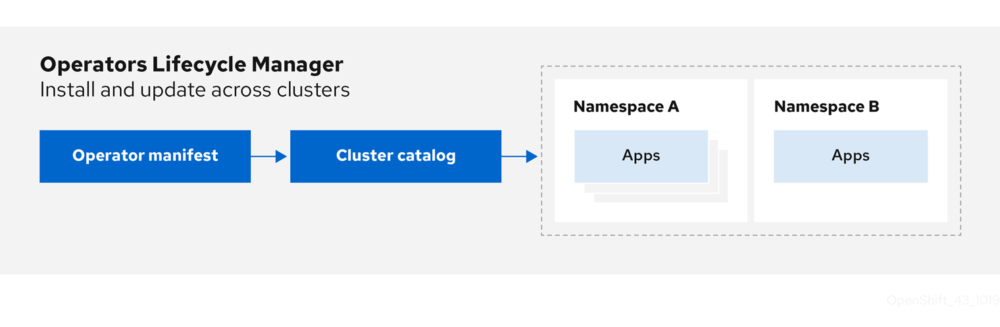

# Cluster Operators reference { #operator-reference }

Cluster Operators are the architectural foundation for OpenShift Container Platform and are installed and managed by default by the Cluster Version Operator (CVO).

Cluster administrators can view cluster Operators in the OpenShift Container Platform web console from the **Administration** → **Cluster Settings** page.

!!! note

    Cluster Operators are not managed by Operator Lifecycle Manager (OLM) and the software catalog. OLM and the software catalog are part of the Operator Framework used in OpenShift Container Platform for installing and running optional add-on Operators.

Some of the following cluster Operators can be disabled before installation. For more information see cluster capabilities.

**Additional resources**

- [Operators in OpenShift Container Platform](../architecture/control-plane.md#operators-overview_control-plane)
- [Operator Framework](https://operatorframework.io/)
- [add-on Operators](../architecture/control-plane.md#olm-operators_control-plane)
- [cluster capabilities](../installing/overview/cluster-capabilities.md#cluster-capabilities)

## Cluster Baremetal Operator { #cluster-bare-metal-operator_operator-reference }

The Cluster Baremetal Operator is an optional cluster capability that can be disabled by cluster administrators during installation.

For more information about optional cluster capabilities, see "Cluster capabilities".

The Cluster Baremetal Operator (CBO) deploys all the components necessary to take a bare-metal server to a fully functioning worker node ready to run OpenShift Container Platform compute nodes. The CBO ensures that the metal3 deployment, which consists of the Bare Metal Operator (BMO) and Ironic containers, runs on one of the control plane nodes within the OpenShift Container Platform cluster. The CBO also listens for OpenShift Container Platform updates to resources that it watches and takes appropriate action.

**Additional resources**

- [Bare-metal capability](../installing/overview/cluster-capabilities.md#cluster-bare-metal-operator_cluster-capabilities)
- [cluster-baremetal-operator](https://github.com/openshift/cluster-baremetal-operator)

## Cloud Credential Operator { #cloud-credential-operator_operator-reference }

The Cloud Credential Operator (CCO) manages cloud provider credentials as Kubernetes custom resource definitions (CRDs). The CCO syncs on `CredentialsRequest` custom resources (CRs) to allow OpenShift Container Platform components to request cloud provider credentials with the specific permissions that are required for the cluster to run.

By setting different values for the `credentialsMode` parameter in the `install-config.yaml` file, the CCO can be configured to operate in several different modes. If no mode is specified, or the `credentialsMode` parameter is set to an empty string (`""`), the CCO operates in its default mode.

CRDs
:   - `credentialsrequests.cloudcredential.openshift.io`

        - Scope: Namespaced
        - CR: `CredentialsRequest`
        - Validation: Yes

Configuration objects
:   No configuration required.

**Additional resources**

- [About the Cloud Credential Operator](../authentication/managing_cloud_provider_credentials/about-cloud-credential-operator.md#about-cloud-credential-operator)
- [`CredentialsRequest` custom resource](../rest_api/security_apis/credentialsrequest-cloudcredential-openshift-io-v1.md#credentialsrequest-cloudcredential-openshift-io-v1)
- [openshift-cloud-credential-operator](https://github.com/openshift/cloud-credential-operator)

## Cluster Authentication Operator { #cluster-authentication-operator_operator-reference }

The Cluster Authentication Operator installs and maintains the `Authentication` custom resource in a cluster.

```terminal
$ oc get clusteroperator authentication -o yaml
```

**Additional resources**

- [`cluster-authentication-operator`](https://github.com/openshift/cluster-authentication-operator)

## Cluster Autoscaler Operator { #cluster-autoscaler-operator_operator-reference }

The Cluster Autoscaler Operator manages deployments of the OpenShift Cluster Autoscaler using the `cluster-api` provider.

### CRDs { #_crds }

- `ClusterAutoscaler`: This is a singleton resource, which controls the configuration autoscaler instance for the cluster. The Operator only responds to the `ClusterAutoscaler` resource named `default` in the managed namespace, the value of the `WATCH_NAMESPACE` environment variable.
- `MachineAutoscaler`: This resource targets a node group and manages the annotations to enable and configure autoscaling for that group, the `min` and `max` size. Currently only `MachineSet` objects can be targeted.

**Additional resources**

- [cluster-autoscaler-operator](https://github.com/openshift/cluster-autoscaler-operator)

## Cloud Controller Manager Operator { #cluster-cloud-controller-manager-operator_operator-reference }

!!! note

    The status of this Operator is General Availability for Amazon Web Services (AWS), Google Cloud, IBM Cloud(R), global Microsoft Azure, Microsoft Azure Stack Hub, Nutanix, Red Hat OpenStack Platform (RHOSP), and VMware vSphere.

    The Operator is available as a Technology Preview for IBM Power(R) Virtual Server.

The Cloud Controller Manager Operator manages and updates the cloud controller managers deployed on top of OpenShift Container Platform. The Operator is based on the Kubebuilder framework and `controller-runtime` libraries. You can install the Cloud Controller Manager Operator by using the Cluster Version Operator (CVO).

The Cloud Controller Manager Operator includes the following components:

- Operator
- Cloud configuration observer

By default, the Operator exposes Prometheus metrics through the `metrics` service.

**Additional resources**

- [cluster-cloud-controller-manager-operator](https://github.com/openshift/cluster-cloud-controller-manager-operator)

## Cluster CAPI Operator { #cluster-capi-operator_operator-reference }

The Cluster CAPI Operator maintains the lifecycle of Cluster API resources. This Operator is responsible for all administrative tasks related to deploying the Cluster API project within an OpenShift Container Platform cluster.

!!! note

    This Operator is available as a [Technology Preview](https://access.redhat.com/support/offerings/techpreview) for Amazon Web Services (AWS), Google Cloud, Microsoft Azure, Red Hat OpenStack Platform (RHOSP), and VMware vSphere clusters.

### CRDs { #_crds }

- `awsmachines.infrastructure.cluster.x-k8s.io`

    - Scope: Namespaced
    - CR: `awsmachine`

- `gcpmachines.infrastructure.cluster.x-k8s.io`

    - Scope: Namespaced
    - CR: `gcpmachine`

- `azuremachines.infrastructure.cluster.x-k8s.io`

    - Scope: Namespaced
    - CR: `azuremachine`

- `openstackmachines.infrastructure.cluster.x-k8s.io`

    - Scope: Namespaced
    - CR: `openstackmachine`

- `vspheremachines.infrastructure.cluster.x-k8s.io`

    - Scope: Namespaced
    - CR: `vspheremachine`

- `metal3machines.infrastructure.cluster.x-k8s.io`

    - Scope: Namespaced
    - CR: `metal3machine`

- `awsmachinetemplates.infrastructure.cluster.x-k8s.io`

    - Scope: Namespaced
    - CR: `awsmachinetemplate`

- `gcpmachinetemplates.infrastructure.cluster.x-k8s.io`

    - Scope: Namespaced
    - CR: `gcpmachinetemplate`

- `azuremachinetemplates.infrastructure.cluster.x-k8s.io`

    - Scope: Namespaced
    - CR: `azuremachinetemplate`

- `openstackmachinetemplates.infrastructure.cluster.x-k8s.io`

    - Scope: Namespaced
    - CR: `openstackmachinetemplate`

- `vspheremachinetemplates.infrastructure.cluster.x-k8s.io`

    - Scope: Namespaced
    - CR: `vspheremachinetemplate`

- `metal3machinetemplates.infrastructure.cluster.x-k8s.io`

    - Scope: Namespaced
    - CR: `metal3machinetemplate`

**Additional resources**

- [cluster-capi-operator](https://github.com/openshift/cluster-capi-operator)

## Cluster Config Operator { #cluster-config-operator_operator-reference }

The Cluster Config Operator creates custom resource definitions (CRDs), renders initial custom resources (CRs), and handles migrations for the `config.openshift.io` API group.

**Additional resources**

- [cluster-config-operator](https://github.com/openshift/cluster-config-operator)

## Cluster CSI Snapshot Controller Operator { #cluster-csi-snapshot-controller-operator_operator-reference }

The Cluster CSI Snapshot Controller Operator is an optional cluster capability that can be disabled by cluster administrators during installation. For more information about optional cluster capabilities, see "Cluster capabilities" in *Installing*.

The Cluster CSI Snapshot Controller Operator installs and maintains the CSI Snapshot Controller. The CSI Snapshot Controller is responsible for watching the `VolumeSnapshot` CRD objects and manages the creation and deletion lifecycle of volume snapshots.

**Additional resources**

- [CSI snapshot controller capability](../installing/overview/cluster-capabilities.md#cluster-csi-snapshot-controller-operator_cluster-capabilities)
- [cluster-csi-snapshot-controller-operator](https://github.com/openshift/cluster-csi-snapshot-controller-operator)

## Cluster Image Registry Operator { #cluster-image-registry-operator_operator-reference }

The Cluster Image Registry Operator manages a singleton instance of the OpenShift image registry. It manages all configuration of the registry, including creating storage.

On initial start up, the Operator creates a default `image-registry` resource instance based on the configuration detected in the cluster. This indicates what cloud storage type to use based on the cloud provider.

If insufficient information is available to define a complete `image-registry` resource, then an incomplete resource is defined and the Operator updates the resource status with information about what is missing.

The Cluster Image Registry Operator runs in the `openshift-image-registry` namespace and it also manages the registry instance in that location. All configuration and workload resources for the registry reside in that namespace.

**Additional resources**

- [cluster-image-registry-operator](https://github.com/openshift/cluster-image-registry-operator)

## Cluster Machine Approver Operator { #cluster-machine-approver-operator_operator-reference }

The Cluster Machine Approver Operator automatically approves the CSRs requested for a new worker node after cluster installation.

!!! note

    For the control plane node, the `approve-csr` service on the bootstrap node automatically approves all CSRs during the cluster bootstrapping phase.

**Additional resources**

- [cluster-machine-approver-operator](https://github.com/openshift/cluster-machine-approver)

## Cluster Monitoring Operator { #cluster-monitoring-operator_operator-reference }

The Cluster Monitoring Operator (CMO) manages and updates the Prometheus-based cluster monitoring stack deployed on top of OpenShift Container Platform.

CRDs
:   - `alertmanagers.monitoring.coreos.com`

        - Scope: Namespaced
        - CR: `alertmanager`
        - Validation: Yes

    - `prometheuses.monitoring.coreos.com`

        - Scope: Namespaced
        - CR: `prometheus`
        - Validation: Yes

    - `prometheusrules.monitoring.coreos.com`

        - Scope: Namespaced
        - CR: `prometheusrule`
        - Validation: Yes

    - `servicemonitors.monitoring.coreos.com`

        - Scope: Namespaced
        - CR: `servicemonitor`
        - Validation: Yes

Configuration objects
:   ```terminal
    $ oc -n openshift-monitoring edit cm cluster-monitoring-config
    ```

**Additional resources**

- [openshift-monitoring](https://github.com/openshift/cluster-monitoring-operator)

## Cluster Network Operator { #cluster-network-operator_operator-reference }

The Cluster Network Operator installs and upgrades the networking components on an OpenShift Container Platform cluster.

## Cluster Samples Operator { #cluster-samples-operator_operator-reference }

The Cluster Samples Operator is an optional cluster capability that can be disabled by cluster administrators during installation.

For more information about optional cluster capabilities, see "Cluster capabilities" in *Installing*.

The Cluster Samples Operator manages the sample image streams and templates stored in the `openshift` namespace.

On initial start up, the Operator creates the default samples configuration resource to initiate the creation of the image streams and templates. The configuration object is a cluster scoped object with the key `cluster` and type `configs.samples`.

The image streams are the Red Hat Enterprise Linux CoreOS (RHCOS)-based OpenShift Container Platform image streams pointing to images on `registry.redhat.io`. Similarly, the templates are those categorized as OpenShift Container Platform templates.

The Cluster Samples Operator deployment is contained within the `openshift-cluster-samples-operator` namespace. On start up, the install pull secret is used by the image stream import logic in the OpenShift image registry and API server to authenticate with `registry.redhat.io`. An administrator can create any additional secrets in the `openshift` namespace if they change the registry used for the sample image streams. If created, those secrets contain the content of a `config.json` for `docker` needed to facilitate image import.

The image for the Cluster Samples Operator contains image stream and template definitions for the associated OpenShift Container Platform release. After the Cluster Samples Operator creates a sample, it adds an annotation that denotes the OpenShift Container Platform version that it is compatible with. The Operator uses this annotation to ensure that each sample matches the compatible release version. Samples outside of its inventory are ignored, as are skipped samples.

Modifications to any samples that are managed by the Operator are allowed as long as the version annotation is not modified or deleted. However, on an upgrade, as the version annotation will change, those modifications can get replaced as the sample will be updated with the newer version. The Jenkins images are part of the image payload from the installation and are tagged into the image streams directly.

The samples resource includes a finalizer, which cleans up the following upon its deletion:

- Operator-managed image streams
- Operator-managed templates
- Operator-generated configuration resources
- Cluster status resources

Upon deletion of the samples resource, the Cluster Samples Operator recreates the resource using the default configuration.

**Additional resources**

- [OpenShift samples capability](../installing/overview/cluster-capabilities.md#cluster-samples-operator_cluster-capabilities)
- [cluster-samples-operator](https://github.com/openshift/cluster-samples-operator)

## Cluster Storage Operator { #cluster-storage-operator_operator-reference }

The Cluster Storage Operator is an optional cluster capability that can be disabled by cluster administrators during installation. 

For more information about optional cluster capabilities, see "Cluster capabilities".

The Cluster Storage Operator sets OpenShift Container Platform cluster-wide storage defaults. It ensures a default `storageclass` exists for OpenShift Container Platform clusters. It also installs Container Storage Interface (CSI) drivers which enable your cluster to use various storage backends.

Configuration
:   No configuration is required.

Notes
:   The storage class that the Operator creates can be made non-default by editing its annotation, but this storage class cannot be deleted if the Operator runs.

**Additional resources**

- [Storage capability](../installing/overview/cluster-capabilities.md#cluster-storage-operator_cluster-capabilities)
- [cluster-storage-operator](https://github.com/openshift/cluster-storage-operator)

## Cluster Version Operator { #cluster-version-operator_operator-reference }

Cluster Operators manage specific areas of cluster functionality. The Cluster Version Operator (CVO) manages the lifecycle of cluster Operators, many of which are installed in OpenShift Container Platform by default.

The CVO also checks with the OpenShift Update Service to see the valid updates and update paths based on current component versions and information in the graph by collecting the status of both the cluster version and its cluster Operators. This status includes the condition type, which informs you of the health and current state of the OpenShift Container Platform cluster.

For more information regarding cluster version condition types, see "Understanding cluster version condition types".

**Additional resources**

- [Understanding cluster version condition types](../updating/understanding_updates/intro-to-updates.md#understanding-clusterversion-conditiontypes_understanding-openshift-updates)
- [cluster-version-operator](https://github.com/openshift/cluster-version-operator)

## Console Operator { #console-operator_operator-reference }

The Console Operator is an optional cluster capability that can be disabled by cluster administrators during installation. If you disable the Console Operator at installation, your cluster is still supported and upgradable. 

For more information about optional cluster capabilities, see "Cluster capabilities".

The Console Operator installs and maintains the OpenShift Container Platform web console on a cluster. The Console Operator is installed by default and automatically maintains a console.

**Additional resources**

- [Web console capability](../installing/overview/cluster-capabilities.md#console-operator_cluster-capabilities)
- [console-operator](https://github.com/openshift/console-operator)

## Control Plane Machine Set Operator { #control-plane-machine-set-operator_operator-reference }

The Control Plane Machine Set Operator automates the management of control plane machine resources within an OpenShift Container Platform cluster.

!!! note

    This Operator is available for Amazon Web Services (AWS), Google Cloud, Microsoft Azure, Nutanix, and VMware vSphere.

### CRDs { #_crds }

- `controlplanemachineset.machine.openshift.io`

    - Scope: Namespaced
    - CR: `ControlPlaneMachineSet`
    - Validation: Yes

**Additional resources**

- [About control plane machine sets](../machine_management/control_plane_machine_management/cpmso-about.md#cpmso-about)
- [`ControlPlaneMachineSet` custom resource](../rest_api/machine_apis/controlplanemachineset-machine-openshift-io-v1.md#controlplanemachineset-machine-openshift-io-v1)
- [cluster-control-plane-machine-set-operator](https://github.com/openshift/cluster-control-plane-machine-set-operator)

## DNS Operator { #dns-operator_operator-reference }

The DNS Operator deploys and manages CoreDNS to provide a name resolution service to pods that enables DNS-based Kubernetes Service discovery in OpenShift Container Platform.

The Operator creates a working default deployment based on the cluster’s configuration.

- The default cluster domain is `cluster.local`.
- Configuration of the CoreDNS Corefile or Kubernetes plugin is not yet supported.

The DNS Operator manages CoreDNS as a Kubernetes daemon set exposed as a service with a static IP. CoreDNS runs on all nodes in the cluster.

**Additional resources**

- [cluster-dns-operator](https://github.com/openshift/cluster-dns-operator)

## etcd cluster Operator { #etcd-cluster-operator_operator-reference }

The etcd cluster Operator automates etcd cluster scaling, enables etcd monitoring and metrics, and simplifies disaster recovery procedures.

### CRDs { #_crds }

- `etcds.operator.openshift.io`

    - Scope: Cluster
    - CR: `etcd`
    - Validation: Yes

### Configuration objects { #_configuration_objects }

```terminal
$ oc edit etcd cluster
```

**Additional resources**

- [cluster-etcd-operator](https://github.com/openshift/cluster-etcd-operator/)

## Ingress Operator { #ingress-operator_operator-reference }

The Ingress Operator configures and manages the OpenShift Container Platform router.

CRDs
:   - `clusteringresses.ingress.openshift.io`

        - Scope: Namespaced
        - CR: `clusteringresses`
        - Validation: No

Configuration objects
:   - Cluster config

        - Type Name: `clusteringresses.ingress.openshift.io`
        - Instance Name: `default`
        - View Command:

        ```terminal
        $ oc get clusteringresses.ingress.openshift.io -n openshift-ingress-operator default -o yaml
        ```

Notes
:   The Ingress Operator sets up the router in the `openshift-ingress` project and creates the deployment for the router:

    ```terminal
    $ oc get deployment -n openshift-ingress
    ```

    The Ingress Operator uses the `clusterNetwork[].cidr` from the `network/cluster` status to determine what mode (IPv4, IPv6, or dual stack) the managed Ingress Controller (router) should operate in. For example, if `clusterNetwork` contains only a v6 `cidr`, then the Ingress Controller operates in IPv6-only mode.

    In the following example, Ingress Controllers managed by the Ingress Operator will run in IPv4-only mode because only one cluster network exists and the network is an IPv4 `cidr`:

    ```terminal
    $ oc get network/cluster -o jsonpath='{.status.clusterNetwork[*]}'
    ```

    ```terminal title="Example output"
    map[cidr:10.128.0.0/14 hostPrefix:23]
    ```

**Additional resources**

- [openshift-ingress-operator](https://github.com/openshift/cluster-ingress-operator)

## Insights Operator { #insights-operator_operator-reference }

The Insights Operator is an optional cluster capability that can be disabled by cluster administrators during installation. For more information about optional cluster capabilities, see "Cluster capabilities" in *Installing*.

The Insights Operator gathers OpenShift Container Platform configuration data and sends it to Red Hat. The data is used to produce proactive insights recommendations about potential issues that a cluster might be exposed to. These insights are communicated to cluster administrators through the Red Hat Lightspeed advisor service on [console.redhat.com](https://console.redhat.com/).

Configuration
:   No configuration is required.

Notes
:   Insights Operator complements OpenShift Container Platform Telemetry.

**Additional resources**

- [Insights capability](../installing/overview/cluster-capabilities.md#insights-operator_cluster-capabilities)
- [About remote health monitoring](../support/remote_health_monitoring/about-remote-health-monitoring.md#about-remote-health-monitoring)
- [insights-operator](https://github.com/openshift/insights-operator)

## Kubernetes API Server Operator { #kube-apiserver-operator_operator-reference }

The Kubernetes API Server Operator manages and updates the Kubernetes API server deployed on top of OpenShift Container Platform. The Operator is based on the OpenShift Container Platform `library-go` framework and it is installed using the Cluster Version Operator (CVO).

### CRDs { #_crds }

- `kubeapiservers.operator.openshift.io`

    - Scope: Cluster
    - CR: `kubeapiserver`
    - Validation: Yes

### Configuration objects { #_configuration_objects }

```terminal
$ oc edit kubeapiserver
```

**Additional resources**

- [`openshift-kube-apiserver-operator`](https://github.com/openshift/cluster-kube-apiserver-operator)

## Kubernetes Controller Manager Operator { #kube-controller-manager-operator_operator-reference }

The Kubernetes Controller Manager Operator manages and updates the Kubernetes Controller Manager deployed on top of OpenShift Container Platform. The Operator is based on OpenShift Container Platform `library-go` framework and it is installed via the Cluster Version Operator (CVO).

It contains the following components:

- Operator
- Bootstrap manifest renderer
- Installer based on static pods
- Configuration observer

By default, the Operator exposes Prometheus metrics through the `metrics` service.

**Additional resources**

- [`cluster-kube-controller-manager-operator`](https://github.com/openshift/cluster-kube-controller-manager-operator)

## Kubernetes Scheduler Operator { #cluster-kube-scheduler-operator_operator-reference }

The Kubernetes Scheduler Operator manages and updates the Kubernetes Scheduler deployed on top of OpenShift Container Platform. The Operator is based on the OpenShift Container Platform `library-go` framework and it is installed with the Cluster Version Operator (CVO).

The Kubernetes Scheduler Operator contains the following components:

- Operator
- Bootstrap manifest renderer
- Installer based on static pods
- Configuration observer

By default, the Operator exposes Prometheus metrics through the metrics service.

### Configuration { #_configuration }

The configuration for the Kubernetes Scheduler is the result of merging:

- a default configuration.
- an observed configuration from the spec `schedulers.config.openshift.io`.

All of these are sparse configurations, invalidated JSON snippets which are merged to form a valid configuration at the end.

**Additional resources**

- [cluster-kube-scheduler-operator](https://github.com/openshift/cluster-kube-scheduler-operator)

## Kubernetes Storage Version Migrator Operator { #cluster-kube-storage-version-migrator-operator_operator-reference }

The Kubernetes Storage Version Migrator Operator detects changes of the default storage version, creates migration requests for resource types when the storage version changes, and processes migration requests.

**Additional resources**

- [cluster-kube-storage-version-migrator-operator](https://github.com/openshift/cluster-kube-storage-version-migrator-operator)

## Machine API Operator { #machine-api-operator_operator-reference }

The Machine API Operator manages the lifecycle of specific purpose custom resource definitions (CRD), controllers, and role based access control (RBAC) objects that extend the Kubernetes API and declare the desired state of machines in a cluster.

### CRDs { #_crds }

- `MachineSet`
- `Machine`
- `MachineHealthCheck`

**Additional resources**

- [machine-api-operator](https://github.com/openshift/machine-api-operator)

## Machine Config Operator { #machine-config-operator_operator-reference }

The Machine Config Operator manages and applies configuration and updates of the base operating system and container runtime, including everything between the kernel and kubelet.

There are four components:

- `machine-config-server`: Provides Ignition configuration to new machines joining the cluster.
- `machine-config-controller`: Coordinates the upgrade of machines to the desired configurations defined by a `MachineConfig` object. Options are provided to control the upgrade for sets of machines individually.
- `machine-config-daemon`: Applies new machine configuration during update. Validates and verifies the state of the machine to the requested machine configuration.
- `machine-config`: Provides a complete source of machine configuration at installation, first start up, and updates for a machine.

!!! warning

    Currently, there is no supported way to block or restrict the machine config server endpoint. The machine config server must be exposed to the network so that newly-provisioned machines, which have no existing configuration or state, are able to fetch their configuration. In this model, the root of trust is the certificate signing requests (CSR) endpoint, which is where the kubelet sends its certificate signing request for approval to join the cluster. Because of this, machine configs should not be used to distribute sensitive information, such as secrets and certificates.

    To ensure that the machine config server endpoints, ports 22623 and 22624, are secured in bare metal scenarios, customers must configure proper network policies.

**Additional resources**

- [openshift-machine-config-operator](https://github.com/openshift/machine-config-operator)

## Marketplace Operator { #marketplace-operator_operator-reference }

The Marketplace Operator is an optional cluster capability that can be disabled by cluster administrators if it is not needed. For more information about optional cluster capabilities, see "Cluster capabilities" in *Installing*.

The Marketplace Operator simplifies the process for bringing off-cluster Operators to your cluster by using a set of default Operator Lifecycle Manager (OLM) catalogs on the cluster. When the Marketplace Operator is installed, it creates the `openshift-marketplace` namespace. OLM ensures catalog sources installed in the `openshift-marketplace` namespace are available for all namespaces on the cluster.

**Additional resources**

- [Marketplace capability](../installing/overview/cluster-capabilities.md#marketplace-operator_cluster-capabilities)
- [operator-marketplace](https://github.com/operator-framework/operator-marketplace)

## Node Tuning Operator { #about-node-tuning-operator_operator-reference }

The Node Tuning Operator helps you manage node-level tuning by orchestrating the TuneD daemon and achieves low latency performance by using the Performance Profile controller. The majority of high-performance applications require some level of kernel tuning. The Node Tuning Operator provides a unified management interface to users of node-level sysctls and more flexibility to add custom tuning specified by user needs.

The Operator manages the containerized TuneD daemon for OpenShift Container Platform as a Kubernetes daemon set. It ensures the custom tuning specification is passed to all containerized TuneD daemons running in the cluster in the format that the daemons understand. The daemons run on all nodes in the cluster, one per node.

Node-level settings applied by the containerized TuneD daemon are rolled back on an event that triggers a profile change or when the containerized TuneD daemon is terminated gracefully by receiving and handling a termination signal.

The Node Tuning Operator uses the Performance Profile controller to implement automatic tuning to achieve low latency performance for OpenShift Container Platform applications.

The cluster administrator configures a performance profile to define node-level settings such as the following:

- Updating the kernel to kernel-rt.
- Choosing CPUs for housekeeping.
- Choosing CPUs for running workloads.

The Node Tuning Operator is part of a standard OpenShift Container Platform installation in version 4.1 and later.

!!! note

    In earlier versions of OpenShift Container Platform, the Performance Addon Operator was used to implement automatic tuning to achieve low latency performance for OpenShift applications. In OpenShift Container Platform 4.11 and later, this functionality is part of the Node Tuning Operator.

**Additional resources**

- [About low latency](../scalability_and_performance/cnf-understanding-low-latency.md#cnf-understanding-low-latency_cnf-understanding-low-latency)
- [cluster-node-tuning-operator](https://github.com/openshift/cluster-node-tuning-operator)

## OpenShift API Server Operator { #openshift-apiserver-operator_operator-reference }

The OpenShift API Server Operator installs and maintains the `openshift-apiserver` on a cluster.

### CRDs { #_crds }

- `openshiftapiservers.operator.openshift.io`

    - Scope: Cluster
    - CR: `openshiftapiserver`
    - Validation: Yes

**Additional resources**

- [openshift-apiserver-operator](https://github.com/openshift/cluster-openshift-apiserver-operator)

## OpenShift Controller Manager Operator { #cluster-openshift-controller-manager-operator_operator-reference }

The OpenShift Controller Manager Operator installs and maintains the `OpenShiftControllerManager` custom resource in a cluster.

```terminal
$ oc get clusteroperator openshift-controller-manager -o yaml
```

The custom resource definition (CRD) `openshiftcontrollermanagers.operator.openshift.io` can be viewed in a cluster with:

```terminal
$ oc get crd openshiftcontrollermanagers.operator.openshift.io -o yaml
```

**Additional resources**

- [cluster-openshift-controller-manager-operator](https://github.com/openshift/cluster-openshift-controller-manager-operator)

## Operator Lifecycle Manager (OLM) Classic Operators { #cluster-operators-ref-olm_operator-reference }

Operator Lifecycle Manager (OLM) Classic has been included with OpenShift Container Platform 4 since its initial release and manages the lifecycle of cluster Operators and add-on Operators.

### About Operator Lifecycle Manager (OLM) Classic { #olm-overview_operator-reference }

Operator Lifecycle Manager (OLM) Classic helps users install, update, and manage the lifecycle of Kubernetes native applications (Operators) and their associated services running across their OpenShift Container Platform clusters. Operator Lifecycle Manager (OLM) Classic forms part of the Operator Framework, an open source toolkit designed to manage Operators in an effective, automated, and scalable way.

**Figure 1. OLM (Classic) workflow**



OLM runs by default in OpenShift Container Platform 4.22, which aids cluster administrators

in installing, upgrading, and granting access to Operators running on their cluster. The OpenShift Container Platform web console provides management screens for cluster administrators to install Operators, as well as grant specific projects access to use the catalog of Operators available on the cluster.

For developers, a self-service experience allows provisioning and configuring instances of databases, monitoring, and big data services without having to be subject matter experts, because the Operator has that knowledge baked into it.

### OLM Operator { #olm-arch-olm-operator_operator-reference }

The OLM Operator deploys applications defined by cluster service versions (CSVs) after their required resources are present in the cluster. It watches CSVs in a namespace, verifies requirements, and runs the install strategy when conditions are met.

The OLM Operator is not concerned with the creation of the required resources; you can choose to manually create these resources using the CLI or using the Catalog Operator. This separation of concern allows users incremental buy-in in terms of how much of the OLM framework they choose to leverage for their application.

The OLM Operator uses the following workflow:

1. Watch for cluster service versions (CSVs) in a namespace and check that requirements are met.

2. If requirements are met, run the install strategy for the CSV.

    !!! note

        A CSV must be an active member of an Operator group for the install strategy to run.

### Catalog Operator { #olm-arch-catalog-operator_operator-reference }

The Catalog Operator in OpenShift Container Platform resolves and installs cluster service versions (CSVs) and their required resources from catalog sources. It watches subscriptions and catalog sources to create install plans and upgrade packages in channels.

To track a package in a channel, you can create a `Subscription` object configuring the desired package, channel, and the `CatalogSource` object you want to use for pulling updates. When updates are found, an appropriate `InstallPlan` object is written into the namespace on behalf of the user.

The Catalog Operator uses the following workflow:

1. Connect to each catalog source in the cluster.

2. Watch for unresolved install plans created by a user, and if found:

    1. Find the CSV matching the name requested and add the CSV as a resolved resource.
    2. For each managed or required CRD, add the CRD as a resolved resource.
    3. For each required CRD, find the CSV that manages it.

3. Watch for resolved install plans and create all of the discovered resources for it, if approved by a user or automatically.

4. Watch for catalog sources and subscriptions and create install plans based on them.

### Catalog Registry { #olm-arch-catalog-registry_operator-reference }

The Catalog Registry stores cluster service versions (CSVs), custom resource definitions (CRDs), and metadata about packages and channels for Operator installation in OpenShift Container Platform. Package manifests link package identities to CSVs so the Catalog Operator can step through channel upgrade paths.

A *package manifest* is an entry in the Catalog Registry that associates a package identity with sets of CSVs. Within a package, channels point to a particular CSV. Because CSVs explicitly reference the CSV that they replace, a package manifest provides the Catalog Operator with all of the information that is required to update a CSV to the latest version in a channel, stepping through each intermediate version.

### CRDs { #olm-architecture_operator-reference }

Operator Lifecycle Manager (OLM) and the Catalog Operator manage the following custom resource definitions (CRDs) that form the basis of the Operator Framework.

**CRDs managed by OLM and Catalog Operators**

<table>
<thead>
<tr>
  <th>Resource</th>
  <th>Short name</th>
  <th>Owner</th>
  <th>Description</th>
</tr>
</thead>
<tbody>
<tr>
  <td><code>ClusterServiceVersion</code> (CSV)</td>
  <td><code>csv</code></td>
  <td>OLM</td>
  <td>Application metadata: name, version, icon, required resources, installation, and so on.</td>
</tr>
<tr>
  <td><code>InstallPlan</code></td>
  <td><code>ip</code></td>
  <td>Catalog</td>
  <td>Calculated list of resources to be created to automatically install or upgrade a CSV.</td>
</tr>
<tr>
  <td><code>CatalogSource</code></td>
  <td><code>catsrc</code></td>
  <td>Catalog</td>
  <td>A repository of CSVs, CRDs, and packages that define an application.</td>
</tr>
<tr>
  <td><code>Subscription</code></td>
  <td><code>sub</code></td>
  <td>Catalog</td>
  <td>Used to keep CSVs up to date by tracking a channel in a package.</td>
</tr>
<tr>
  <td><code>OperatorGroup</code></td>
  <td><code>og</code></td>
  <td>OLM</td>
  <td>Configures all Operators deployed in the same namespace as the <code>OperatorGroup</code> object to watch for their custom resource (CR) in a list of namespaces or cluster-wide.</td>
</tr>
</tbody>
</table>


Each of these Operators is also responsible for creating the following resources:

**Resources created by OLM and Catalog Operators**

<table>
<thead>
<tr>
  <th>Resource</th>
  <th>Owner</th>
</tr>
</thead>
<tbody>
<tr>
  <td><code>Deployments</code></td>
  <td rowspan="4">OLM</td>
</tr>
<tr>
  <td><code>ServiceAccounts</code></td>
</tr>
<tr>
  <td><code>(Cluster)Roles</code></td>
</tr>
<tr>
  <td><code>(Cluster)RoleBindings</code></td>
</tr>
<tr>
  <td><code>CustomResourceDefinitions</code> (CRDs)</td>
  <td rowspan="2">Catalog</td>
</tr>
<tr>
  <td><code>ClusterServiceVersions</code></td>
</tr>
</tbody>
</table>


### Cluster Operators { #cluster-operators-ref-olm-list_operator-reference }

Operator Lifecycle Manager (OLM) Classic functionality in OpenShift Container Platform is provided by a set of cluster Operators.

`operator-lifecycle-manager`
:   Provides the OLM Operator. Also informs cluster administrators if there are any installed Operators blocking cluster upgrade, based on their `olm.maxOpenShiftVersion` properties. For more information, see "Controlling Operator compatibility with OpenShift Container Platform versions".

`operator-lifecycle-manager-catalog`
:   Provides the Catalog Operator.

`operator-lifecycle-manager-packageserver`
:   Represents an API extension server responsible for collecting metadata from all catalogs on the cluster and serves the user-facing `PackageManifest` API.

**Additional resources**

- [Understanding Operator Lifecycle Manager (OLM)](understanding/olm/olm-understanding-olm.md#olm-understanding-olm)

## Operator Lifecycle Manager (OLM) v1 Operator { #cluster-operators-ref-olmv1_operator-reference }

Starting in OpenShift Container Platform 4.18, OLM v1 is enabled by default alongside OLM (Classic). This next-generation iteration provides an updated framework that evolves many of OLM (Classic) concepts that enable cluster administrators to extend capabilities for their users.

OLM v1 manages the lifecycle of the new `ClusterExtension` object, which includes Operators via the `registry+v1` bundle format, and controls installation, upgrade, and role-based access control (RBAC) of extensions within a cluster.

In OpenShift Container Platform, OLM v1 is provided by the `olm` cluster Operator.

!!! note

    The `olm` cluster Operator informs cluster administrators if there are any installed extensions blocking cluster upgrade, based on their `olm.maxOpenShiftVersion` properties. For more information, see "Compatibility with OpenShift Container Platform versions".

Operator Lifecycle Manager (OLM) v1 comprises the following component projects:

- Operator Controller: The central component of OLM v1 that extends Kubernetes with an API through which users can install and manage the lifecycle of Operators and extensions. It consumes information from catalogd.

- Catalogd: A Kubernetes extension that unpacks file-based catalog (FBC) content packaged and shipped in container images for consumption by on-cluster clients. As a component of the OLM v1 microservices architecture, catalogd hosts metadata for Kubernetes extensions packaged by the authors of the extensions, and as a result helps users discover installable content.

- CRDs:

    - `clusterextension.olm.operatorframework.io`

        - Scope: Cluster
        - CR: `ClusterExtension`

    - `clustercatalog.olm.operatorframework.io`

        - Scope: Cluster
        - CR: `ClusterCatalog`

- See the following projects in the *Additional resources* section:

    - `operator-framework/operator-controller`
    - `operator-framework/catalogd`

**Additional resources**

- [Extensions overview](../extensions.md#extensions-overview)
- [Compatibility with OpenShift Container Platform versions](../extensions/ce/update-paths.md#olmv1-ocp-compat_update-paths)

## OpenShift Service CA Operator { #openshift-service-ca-operator_operator-reference }

The OpenShift Service CA Operator mints and manages serving certificates for Kubernetes services.

**Additional resources**

- [openshift-service-ca-operator](https://github.com/openshift/service-ca-operator)

## vSphere Problem Detector Operator { #vsphere-problem-detector-operator_operator-reference }

The vSphere Problem Detector Operator checks clusters that are deployed on vSphere for common installation and misconfiguration issues that are related to storage.

!!! note

    The vSphere Problem Detector Operator is only started by the Cluster Storage Operator when the Cluster Storage Operator detects that the cluster is deployed on vSphere.

### Configuration { #_configuration }

No configuration is required.

### Notes { #_notes }

- The Operator supports OpenShift Container Platform installations on vSphere.
- The Operator uses the `vsphere-cloud-credentials` to communicate with vSphere.
- The Operator performs checks that are related to storage.

**Additional resources**

- [Using the vSphere Problem Detector Operator](../installing/installing_vsphere/using-vsphere-problem-detector-operator.md#using-vsphere-problem-detector-operator)
