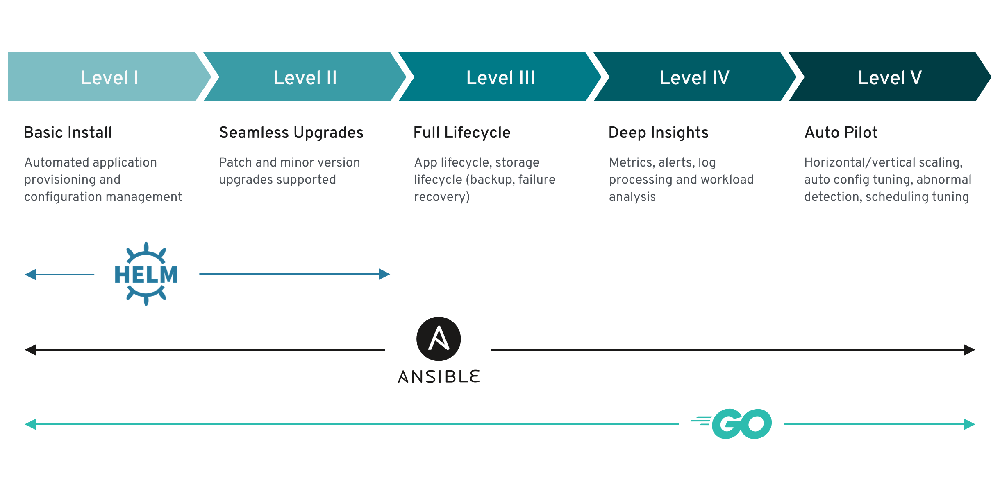

# What are Operators? { #olm-what-operators-are }

Operators encode human operational knowledge into software that manages complex applications. You can use Operators to package, deploy, and manage Kubernetes applications with the same APIs and tooling as native cluster resources.

Operators are pieces of software that ease the operational complexity of running another piece of software. They act like an extension of the software vendor’s engineering team, monitoring a Kubernetes environment (such as OpenShift Container Platform) and using its current state to make decisions in real time. Advanced Operators are designed to handle upgrades seamlessly, react to failures automatically, and not take shortcuts, like skipping a software backup process to save time.

A Kubernetes application is an app that is both deployed on Kubernetes and managed using the Kubernetes APIs and `kubectl` or `oc` tooling. To be able to make the most of Kubernetes, you require a set of cohesive APIs to extend in order to service and manage your apps that run on Kubernetes. Think of Operators as the runtime that manages this type of app on Kubernetes.

## Why use Operators? { #olm-why-use-operators_olm-what-operators-are }

Operators package operational knowledge to automate application lifecycle tasks on Kubernetes. Operators provide repeatable installs, health checks, over-the-air updates, and shared expertise encoded in software.

Why deploy on Kubernetes?
:   Kubernetes (and by extension, OpenShift Container Platform) contains all of the primitives needed to build complex distributed systems – secret handling, load balancing, service discovery, autoscaling – that work across on-premise and cloud providers.

Why manage your app with Kubernetes APIs and `kubectl` tooling?
:   These APIs are feature rich, have clients for all platforms and plug into the cluster’s access control/auditing. An Operator uses the Kubernetes extension mechanism, custom resource definitions (CRDs), so your custom object, [for example `MongoDB`](https://marketplace.redhat.com/en-us/products/mongodb-enterprise-advanced-from-ibm), looks and acts just like the built-in, native Kubernetes objects.

How do Operators compare with service brokers?
:   A service broker is a step towards programmatic discovery and deployment of an app. However, because it is not a long running process, it cannot execute Day 2 operations like upgrade, failover, or scaling. Customizations and parameterization of tunables are provided at install time, versus an Operator that is constantly watching the current state of your cluster. Off-cluster services are a good match for a service broker, although Operators exist for these as well.

## Operator Framework { #olm-operator-framework_olm-what-operators-are }

The Operator Framework is a set of open source tools for building, testing, delivering, and updating Operators. It includes Operator Lifecycle Manager (OLM), the Operator Registry, and the software catalog.

Operator Lifecycle Manager
:   Operator Lifecycle Manager (OLM) controls the installation, upgrade, and role-based access control (RBAC) of Operators in a cluster. It is deployed by default in OpenShift Container Platform 4.22.

Operator Registry
:   The Operator Registry stores cluster service versions (CSVs) and custom resource definitions (CRDs) for creation in a cluster and stores Operator metadata about packages and channels. It runs in a Kubernetes or OpenShift cluster to provide this Operator catalog data to OLM.

Software Catalog
:   The software catalog is a web console for cluster administrators to discover and select Operators to install on their cluster. It is deployed by default in OpenShift Container Platform.

These tools are designed to be composable, so you can use any that are useful to you.

## Operator maturity model { #olm-maturity-model_olm-what-operators-are }

The Operator maturity model describes five phases of generic Day 2 operations that an Operator can support.

The level of sophistication of the management logic encapsulated within an Operator can vary. This logic is also in general highly dependent on the type of the service represented by the Operator.

One can however generalize the scale of the maturity of the encapsulated operations of an Operator for certain set of capabilities that most Operators can include. To this end, the following Operator maturity model defines five phases of maturity for generic Day 2 operations of an Operator:

**Figure 1. Operator maturity model**

