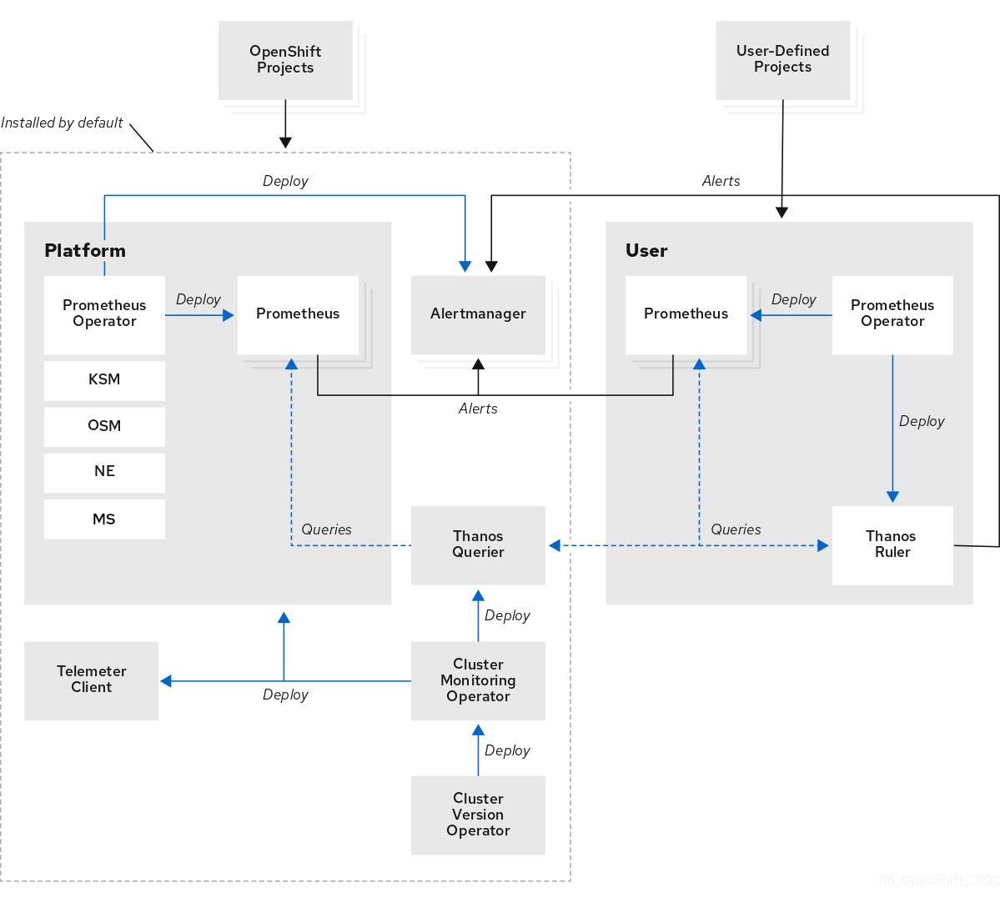

# Observability in OpenShift Container Platform clusters { #observability }

OpenShift Container Platform generates a large amount of data, such as performance metrics and logs from both the platform and the workloads running on it. As an administrator, you can use various tools to collect and analyze all the data available. What follows is an outline of best practices for system engineers, architects, and administrators configuring the observability stack.

Unless explicitly stated, the material in this document refers to both Edge and Core deployments.

## Monitoring stack components { #observability-monitoring-stack_observability }

The monitoring stack in OpenShift Container Platform consists of several integrated components that collect, analyze, store, and alert on metrics.

The monitoring stack uses the following components:

- Prometheus collects and analyzes metrics from OpenShift Container Platform components and from workloads, if configured to do so.
- Alertmanager is a component of Prometheus that handles routing, grouping, and silencing of alerts.
- Thanos handles long term storage of metrics.

**Figure 1. OpenShift Container Platform monitoring architecture**



!!! note

    For single-node OpenShift clusters, disable Alertmanager and Thanos because the clusters sends all metrics to the hub cluster for analysis and retention.

**Additional resources**

- [About OpenShift Container Platform monitoring](https://docs.redhat.com/en/documentation/monitoring_stack_for_red_hat_openshift/latest/html/about_monitoring/about-ocp-monitoring)
- [Core platform monitoring first steps](https://docs.redhat.com/en/documentation/monitoring_stack_for_red_hat_openshift/latest/html/getting_started/core-platform-monitoring-first-steps)

## Key performance metrics { #observability-key-performance-metrics_observability }

Depending on your system, you can have hundreds of available measurements.

Consider the following key metrics:

- `etcd` response times
- API response times
- Pod restarts and scheduling
- Resource usage
- OVN health
- Overall cluster operator health

If a metric is important, set up an alert for it.

!!! note

    You can check the available metrics by running the following command:

    ```terminal
    $ oc -n openshift-monitoring exec -c prometheus prometheus-k8s-0 -- curl -qsk http://localhost:9090/api/v1/metadata | jq '.data
    ```

### Example queries in PromQL { #example-queries-promql_observability }

Using the OpenShift Container Platform console, you can explore the following queries in the metrics query browser.

!!! note

    The URL for the console is https://&lt;OpenShift Console FQDN>/monitoring/query-browser. You can get the Openshift Console FQDN by running the following command:

    ```terminal
    $ oc get routes -n openshift-console console -o jsonpath='{.status.ingress[0].host}'
    ```

**Node memory &amp; CPU usage**

| Metric                               | Query                                                                                                                                                                                                     |
| ------------------------------------ | --------------------------------------------------------------------------------------------------------------------------------------------------------------------------------------------------------- |
| CPU % requests by node               | `sum by (node) (sum_over_time(kube_pod_container_resource_requests{resource="cpu"}[60m]))/sum by (node) (sum_over_time(kube_node_status_allocatable{resource="cpu"}[60m])) *100`                          |
| Overall cluster CPU % utilization    | `sum by (managed_cluster) (sum_over_time(kube_pod_container_resource_requests{resource="memory"}[60m]))/sum by (managed_cluster) (sum_over_time(kube_node_status_allocatable{resource="cpu"}[60m])) *100` |
| Memory % requests by node            | `sum by (node) (sum_over_time(kube_pod_container_resource_requests{resource="memory"}[60m]))/sum by (node) (sum_over_time(kube_node_status_allocatable{resource="memory"}[60m])) *100`                    |
| Overall cluster memory % utilization | `(1-(sum by (managed_cluster)(avg_over_time((node_memory_MemAvailable_bytes[60m])) ))/sum by (managed_cluster)(avg_over_time(kube_node_status_allocatable{resource="memory"}[60m])))*100`                 |

**API latency by verb**

| Metric   | Query                                                                                                                                                                                      |
| -------- | ------------------------------------------------------------------------------------------------------------------------------------------------------------------------------------------ |
| `GET`    | `histogram_quantile (0.99, sum by (le,managed_cluster) (sum_over_time(apiserver_request_duration_seconds_bucket{apiserver=~"kube-apiserver\|openshift-apiserver", verb="GET"}[60m])))`     |
| `PATCH`  | `histogram_quantile (0.99, sum by (le,managed_cluster) (sum_over_time(apiserver_request_duration_seconds_bucket{apiserver="kube-apiserver\|openshift-apiserver", verb="PATCH"}[60m])))`    |
| `POST`   | `histogram_quantile (0.99, sum by (le,managed_cluster) (sum_over_time(apiserver_request_duration_seconds_bucket{apiserver="kube-apiserver\|openshift-apiserver", verb="POST"}[60m])))`     |
| `LIST`   | `histogram_quantile (0.99, sum by (le,managed_cluster) (sum_over_time(apiserver_request_duration_seconds_bucket{apiserver="kube-apiserver\|openshift-apiserver", verb="LIST"}[60m])))`     |
| `PUT`    | `histogram_quantile (0.99, sum by (le,managed_cluster) (sum_over_time(apiserver_request_duration_seconds_bucket{apiserver="kube-apiserver\|openshift-apiserver", verb="PUT"}[60m])))`      |
| `DELETE` | `histogram_quantile (0.99, sum by (le,managed_cluster) (sum_over_time(apiserver_request_duration_seconds_bucket{apiserver="kube-apiserver\|openshift-apiserver", verb="DELETE"}[60m])))`   |
| Combined | `histogram_quantile(0.99, sum by (le,managed_cluster) (sum_over_time(apiserver_request_duration_seconds_bucket{apiserver=~"(openshift-apiserver\|kube-apiserver)", verb!="WATCH"}[60m])))` |

**`etcd`**

| Metric                                         | Query                                                                                                          |
| ---------------------------------------------- | -------------------------------------------------------------------------------------------------------------- |
| `fsync` 99th percentile latency (per instance) | `histogram_quantile(0.99, rate(etcd_disk_wal_fsync_duration_seconds_bucket[2m]))`                              |
| `fsync` 99th percentile latency (per cluster)  | `sum by (managed_cluster) ( histogram_quantile(0.99, rate(etcd_disk_wal_fsync_duration_seconds_bucket[60m])))` |
| Leader elections                               | `sum(rate(etcd_server_leader_changes_seen_total[1440m]))`                                                      |
| Network latency                                | `histogram_quantile(0.99, rate(etcd_network_peer_round_trip_time_seconds_bucket[5m]))`                         |

**Operator health**

| Metric                               | Query                                                                                                                     |
| ------------------------------------ | ------------------------------------------------------------------------------------------------------------------------- |
| Degraded operators                   | `sum by (managed_cluster, name) (avg_over_time(cluster_operator_conditions{condition="Degraded", name!="version"}[60m]))` |
| Total degraded operators per cluster | `sum by (managed_cluster) (avg_over_time(cluster_operator_conditions{condition="Degraded", name!="version"}[60m] ))`      |

### Recommendations for storage of metrics { #recommendations-for-storage-of-metrics_observability }

By default, Prometheus does not back up saved metrics with persistent storage. If you restart the Prometheus pods, all metrics data are lost. You must configure the monitoring stack to use the back-end storage that is available on the platform. To meet the high IO demands of Prometheus, use local storage.

For smaller clusters, you can use the Local Storage Operator for persistent storage for Prometheus. Red Hat OpenShift Data Foundation (ODF), which deploys a ceph cluster for block, file, and object storage, is suitable for larger clusters.

To keep system resource requirements low on a single-node OpenShift cluster, do not provision back-end storage for the monitoring stack. Such clusters forward all metrics to the hub cluster where you can provision a third party monitoring platform.

**Additional resources**

- [Accessing metrics as an administrator](https://docs.redhat.com/en/documentation/monitoring_stack_for_red_hat_openshift/latest/html/accessing_metrics/accessing-metrics-as-an-administrator)
- [Persistent storage using local volumes](../../../storage/persistent_storage_local/persistent-storage-local.md#local-storage-install_persistent-storage-local)

## Monitoring at the far edge network { #observability-monitoring-the-edge_observability }

OpenShift Container Platform clusters at the edge must keep the footprint of the platform components to a minimum. The following procedure is an example of how to configure a single-node OpenShift or a node at the far edge network with a small monitoring footprint.

**Prerequisites**

- For environments that use Red Hat Advanced Cluster Management (RHACM), you have enabled the Observability service.
- The hub cluster is running Red Hat OpenShift Data Foundation (ODF).

**Procedure**

1. Create a `ConfigMap` CR, and save it as `monitoringConfigMap.yaml`, as in the following example:

    ```yaml
    apiVersion: v1
    kind: ConfigMap
    metadata:
     name: cluster-monitoring-config
     namespace: openshift-monitoring
     data:
     config.yaml: |
       alertmanagerMain:
         enabled: false
       telemeterClient:
         enabled: false
       prometheusK8s:
          retention: 24h
    ```

2. Apply the `ConfigMap` CR by running the following command on the single-node OpenShift cluster:

    ```terminal
    $ oc apply -f monitoringConfigMap.yaml
    ```

3. Create a `Namespace` CR, and save it as `monitoringNamespace.yaml`, as in the following example:

    ```yaml
    apiVersion: v1
    kind: Namespace
    metadata:
      name: open-cluster-management-observability
    ```

4. Apply the `Namespace` CR by running the following command on the hub cluster :

    ```terminal
    $ oc apply -f monitoringNamespace.yaml
    ```

5. Create an `ObjectBucketClaim` CR, and save it as `monitoringObjectBucketClaim.yaml`, as in the following example:

    ```yaml
    apiVersion: objectbucket.io/v1alpha1
    kind: ObjectBucketClaim
    metadata:
      name: multi-cloud-observability
      namespace: open-cluster-management-observability
    spec:
      storageClassName: openshift-storage.noobaa.io
      generateBucketName: acm-multi
    ```

6. Apply the `ObjectBucketClaim` CR by running the following command on the hub cluster:

    ```terminal
    $ oc apply -f monitoringObjectBucketClaim.yaml
    ```

7. Create a `Secret` CR, and save it as `monitoringSecret.yaml`, as in the following example:

    ```yaml
    apiVersion: v1
    kind: Secret
    metadata:
      name: multiclusterhub-operator-pull-secret
      namespace: open-cluster-management-observability
    stringData:
      .dockerconfigjson: 'PULL_SECRET'
    ```

8. Apply the `Secret` CR by running the following command in the hub cluster:

    ```terminal
    $ oc apply -f monitoringSecret.yaml
    ```

9. Get the keys for the NooBaa service and the back-end bucket name from the hub cluster by running the following commands:

    ```terminal
    $ NOOBAA_ACCESS_KEY=$(oc get secret noobaa-admin -n openshift-storage -o json | jq -r '.data.AWS_ACCESS_KEY_ID|@base64d')
    ```

    ```terminal
    $ NOOBAA_SECRET_KEY=$(oc get secret noobaa-admin -n openshift-storage -o json | jq -r '.data.AWS_SECRET_ACCESS_KEY|@base64d')
    ```

    ```terminal
    $ OBJECT_BUCKET=$(oc get objectbucketclaim -n open-cluster-management-observability multi-cloud-observability -o json | jq -r .spec.bucketName)
    ```

10. Create a `Secret` CR for bucket storage and save it as `monitoringBucketSecret.yaml`, as in the following example:

    ```yaml
    apiVersion: v1
    kind: Secret
    metadata:
      name: thanos-object-storage
      namespace: open-cluster-management-observability
    type: Opaque
    stringData:
      thanos.yaml: |
        type: s3
        config:
          bucket: ${OBJECT_BUCKET}
          endpoint: s3.openshift-storage.svc
          insecure: true
          access_key: ${NOOBAA_ACCESS_KEY}
          secret_key: ${NOOBAA_SECRET_KEY}
    ```

11. Apply the `Secret` CR by running the following command on the hub cluster:

    ```terminal
    $ oc apply -f monitoringBucketSecret.yaml
    ```

12. Create the `MultiClusterObservability` CR and save it as `monitoringMultiClusterObservability.yaml`, as in the following example:

    ```yaml
    apiVersion: observability.open-cluster-management.io/v1beta2
    kind: MultiClusterObservability
    metadata:
      name: observability
    spec:
      advanced:
        retentionConfig:
          blockDuration: 2h
          deleteDelay: 48h
          retentionInLocal: 24h
          retentionResolutionRaw: 3d
      enableDownsampling: false
      observabilityAddonSpec:
        enableMetrics: true
        interval: 300
      storageConfig:
        alertmanagerStorageSize: 10Gi
        compactStorageSize: 100Gi
        metricObjectStorage:
          key: thanos.yaml
          name: thanos-object-storage
        receiveStorageSize: 25Gi
        ruleStorageSize: 10Gi
        storeStorageSize: 25Gi
    ```

13. Apply the `MultiClusterObservability` CR by running the following command on the hub cluster:

    ```terminal
    $ oc apply -f monitoringMultiClusterObservability.yaml
    ```

**Verification**

1. Check the routes and pods in the namespace to validate that the services have deployed on the hub cluster by running the following command:

    ```terminal
    $ oc get routes,pods -n open-cluster-management-observability
    ```

    ```terminal title="Example output"
    NAME                                         HOST/PORT                                                                                        PATH      SERVICES                          PORT          TERMINATION          WILDCARD
    route.route.openshift.io/alertmanager        alertmanager-open-cluster-management-observability.cloud.example.com        /api/v2   alertmanager                      oauth-proxy   reencrypt/Redirect   None
    route.route.openshift.io/grafana             grafana-open-cluster-management-observability.cloud.example.com                       grafana                           oauth-proxy   reencrypt/Redirect   None
    route.route.openshift.io/observatorium-api   observatorium-api-open-cluster-management-observability.cloud.example.com             observability-observatorium-api   public        passthrough/None     None
    route.route.openshift.io/rbac-query-proxy    rbac-query-proxy-open-cluster-management-observability.cloud.example.com              rbac-query-proxy                  https         reencrypt/Redirect   None

    NAME                                                           READY   STATUS    RESTARTS   AGE
    pod/observability-alertmanager-0                               3/3     Running   0          1d
    pod/observability-alertmanager-1                               3/3     Running   0          1d
    pod/observability-alertmanager-2                               3/3     Running   0          1d
    pod/observability-grafana-685b47bb47-dq4cw                     3/3     Running   0          1d
    <...snip…>
    pod/observability-thanos-store-shard-0-0                       1/1     Running   0          1d
    pod/observability-thanos-store-shard-1-0                       1/1     Running   0          1d
    pod/observability-thanos-store-shard-2-0                       1/1     Running   0          1d
    ```

    !!! note

        A dashboard is accessible at the grafana route listed. You can use this to view metrics across all managed clusters.

For more information on observability in Red Hat Advanced Cluster Management, see [Observability](https://docs.redhat.com/en/documentation/red_hat_advanced_cluster_management_for_kubernetes/2.12/html/observability/index).

## Alerting { #observability-alerting_observability }

OpenShift Container Platform includes a large number of alert rules, which can change from release to release. 

### Viewing default alerts { #viewing-default-alerts_observability }

To review all of the alert rules in a cluster, run the following command:

```terminal
$ oc get cm -n openshift-monitoring prometheus-k8s-rulefiles-0 -o yaml
```

Rules can include a description and provide a link to additional information and mitigation steps. For example, see the rule for `etcdHighFsyncDurations`:

```terminal
      - alert: etcdHighFsyncDurations
        annotations:
          description: 'etcd cluster "{{ $labels.job }}": 99th percentile fsync durations
            are {{ $value }}s on etcd instance {{ $labels.instance }}.'
          runbook_url: https://github.com/openshift/runbooks/blob/master/alerts/cluster-etcd-operator/etcdHighFsyncDurations.md
          summary: etcd cluster 99th percentile fsync durations are too high.
        expr: |
          histogram_quantile(0.99, rate(etcd_disk_wal_fsync_duration_seconds_bucket{job=~".*etcd.*"}[5m]))
          > 1
        for: 10m
        labels:
          severity: critical
```

### Alert notifications { #alert-notifications }

You can view alerts in the OpenShift Container Platform console. However, an administrator must configure an external receiver to forward the alerts to. OpenShift Container Platform supports the following receiver types:

PagerDuty
:   A third-party incident response platform.

Webhook
:   An arbitrary API endpoint that receives an alert through a `POST` request and can take any necessary action.

Email
:   Sends an email to a designated address.

Slack
:   Sends a notification to either a Slack channel or an individual user.

**Additional resources**

- [Managing alerts](https://docs.redhat.com/en/documentation/monitoring_stack_for_red_hat_openshift/latest/html/managing_alerts/index)

## Workload monitoring { #observability-workload-monitoring_observability }

By default, OpenShift Container Platform does not collect metrics for application workloads. You can configure a cluster to collect workload metrics and create alerts for user workloads.

**Prerequisites**

- You have defined endpoints to gather workload metrics on the cluster.

**Procedure**

1. Create a `ConfigMap` CR and save it as `monitoringConfigMap.yaml`, as in the following example:

    ```yaml
    apiVersion: v1
    kind: ConfigMap
    metadata:
      name: cluster-monitoring-config
      namespace: openshift-monitoring
    data:
      config.yaml: |
        enableUserWorkload: true
    ```

    Set `enableUserWorkload` to `true` to enable workload monitoring.

2. Apply the `ConfigMap` CR by running the following command:

    ```terminal
    $ oc apply -f monitoringConfigMap.yaml
    ```

3. Create a `ServiceMonitor` CR, and save it as `monitoringServiceMonitor.yaml`, as in the following example:

    ```yaml
    apiVersion: monitoring.coreos.com/v1
    kind: ServiceMonitor
    metadata:
      labels:
        app: ui
      name: myapp
      namespace: myns
    spec:
      endpoints:
      - interval: 30s
        port: ui-http
        scheme: http
        path: /healthz
      selector:
        matchLabels:
          app: ui
    ```

    - `endpoints` specifies the workload metrics endpoints to scrape.
    - `path` specifies a custom scrape path. Prometheus scrapes the `/metrics` path by default.

4. Apply the `ServiceMonitor` CR by running the following command:

    ```terminal
    $ oc apply -f monitoringServiceMonitor.yaml
    ```

    The vendor of the application must decide whether to expose the endpoint for scraping, with metrics that they deem relevant.

5. To enable alerts for user workloads, verify that the `cluster-monitoring-config` ConfigMap has `enableUserWorkload: true` set. If you completed step 1, this is already configured.

6. Create a YAML file for alerting rules and save it as `monitoringAlertRule.yaml`, as in the following example:

    ```yaml
    apiVersion: monitoring.coreos.com/v1
    kind: PrometheusRule
    metadata:
      name: myapp-alert
      namespace: myns
    spec:
      groups:
      - name: example
        rules:
        - alert: InternalErrorsAlert
          expr: flask_http_request_total{status="500"} > 0
    # ...
    ```

7. Apply the alert rule by running the following command:

    ```terminal
    $ oc apply -f monitoringAlertRule.yaml
    ```

**Additional resources**

- \[ServiceMonitor[monitoring.coreos.com/v1](../../../rest_api/monitoring_apis/servicemonitor-monitoring-coreos-com-v1.md#servicemonitor-monitoring-coreos-com-v1)\]
- [Enabling monitoring for user-defined projects](https://docs.redhat.com/en/documentation/monitoring_stack_for_red_hat_openshift/latest/html/configuring_user_workload_monitoring/preparing-to-configure-the-monitoring-stack-uwm#enabling-monitoring-for-user-defined-projects-uwm_preparing-to-configure-the-monitoring-stack-uwm)
- [Managing alerting rules for user-defined projects](https://docs.redhat.com/en/documentation/monitoring_stack_for_red_hat_openshift/latest/html/managing_alerts/managing-alerts-as-a-developer#managing-alerting-rules-for-user-defined-projects-uwm_managing-alerts-as-a-developer)
