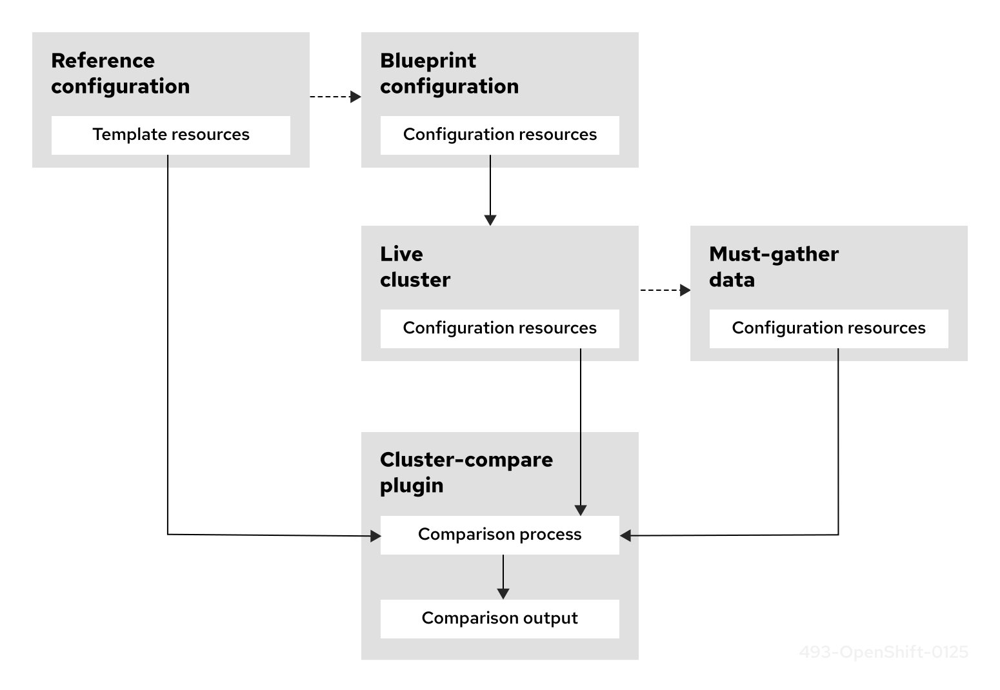

# Understanding the cluster-compare plugin { #understanding-the-cluster-compare-plugin }

The `cluster-compare` plugin is an OpenShift CLI (`oc`) plugin that compares a cluster configuration with a reference configuration. The plugin reports configuration differences while suppressing expected variations by using configurable validation rules and templates.

Use the `cluster-compare` plugin in development, production, and support scenarios to ensure cluster compliance with a reference configuration, and to quickly identify and troubleshoot relevant configuration differences.

## Overview of the cluster-compare plugin { #cluster-compare-overview_understanding-cluster-compare }

Clusters deployed at scale typically use a validated set of baseline custom resources (CRs) to configure clusters to meet use-case requirements and ensure consistency when deploying across different environments. 

In live clusters, some variation from the validated set of CRs is expected. For example, configurations might differ because of variable substitution, optional components, or hardware-specific fields. This variation makes it difficult to accurately assess if a cluster is compliant with the baseline configuration.

Using the `cluster-compare` plugin with the `oc` command, you can compare the configuration from a live cluster with a reference configuration. A reference configuration represents the baseline configuration but uses the various plugin features to suppresses expected variation during a comparison. For example, you can apply validation rules, specify optional and required resources, and define relationships between resources. By reducing irrelevant differences, the plugin makes it easier to assess cluster compliance with baseline configurations, and across environments.

The ability to intelligently compare a configuration from a cluster with a reference configuration has the following example use-cases:

**Production:** Ensure compliance with a reference configuration across service updates, upgrades and changes to the reference configuration.

**Development:** Ensure compliance with a reference configuration in test pipelines.

**Design:** Compare configurations with a partner lab reference configuration to ensure consistency.

**Support:** Compare the reference configuration to `must-gather` data from a live cluster to troubleshoot configuration issues.

**Figure 1. Cluster-compare plugin overview**



## Understanding a reference configuration { #understanding-a-reference-config_understanding-cluster-compare }

The `cluster-compare` plugin uses a reference configuration to validate a configuration from a live cluster. The reference configuration consists of a YAML file called `metadata.yaml`, which references a set of templates that represent the baseline configuration.

```text title="Example directory structure for a reference configuration"
├── metadata.yaml
├── optional
│   ├── optionalTemplate1.yaml
│   └── optionalTemplate2.yaml
├── required
│   ├── requiredTemplate3.yaml
│   └── requiredTemplate4.yaml
└── baselineClusterResources
    ├── clusterResource1.yaml
    ├── clusterResource2.yaml
    ├── clusterResource3.yaml
    └── clusterResource4.yaml
```

where:

`metadata.yaml`
:   The reference configuration consists of the `metadata.yaml` file and a set of templates.

`optional`
:   This example uses an optional and required directory structure for templates that are referenced by the `metadata.yaml` file.

`baselineClusterResources`
:   The configuration CRs to use as a baseline configuration for clusters.

During a comparison, the plugin matches each template to a configuration resource from the cluster. The plugin evaluates optional or required fields in the template using features such as Golang templating syntax and inline regular expression validation. The `metadata.yaml` file applies additional validation rules to decide whether a template is optional or required and assesses template dependency relationships.

Using these features, the plugin identifies relevant configuration differences between the cluster and the reference configuration. For example, the plugin can highlight mismatched field values, missing resources, extra resources, field type mismatches, or version discrepancies.

For further information about configuring a reference configuration, see "Creating a reference configuration".

**Additional resources**

- [Telco RAN DU reference design specification for OpenShift Container Platform](../telco-ran-du-rds.md#telco-ran-du-ref-design-specs)
