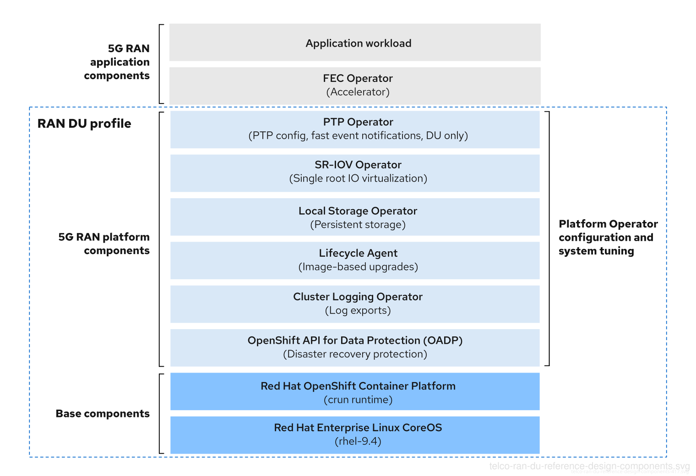

# Telco RAN DU reference design specification { #telco-ran-du-ref-design-specs }

The telco RAN DU reference design specifications (RDS) describes the configuration for clusters running on commodity hardware to host 5G workloads in the Radio Access Network (RAN). It captures the recommended, tested, and supported configurations to get reliable and repeatable performance for a cluster running the telco RAN DU profile.

Use the use model and system level information to plan telco RAN DU workloads, cluster resources, and minimum hardware specifications for managed single-node OpenShift clusters.

Specific limits, requirements, and engineering considerations for individual components are described in individual sections.

## Reference design specifications for telco RAN DU 5G deployments { #telco-ref-design-overview_telco-ran-du }

Red Hat and certified partners offer deep technical expertise and support for networking and operational capabilities required to run telco applications on OpenShift Container Platform 4.22 clusters.

Red Hat’s telco partners require a well-integrated, well-tested, and stable environment that can be replicated at scale for enterprise 5G solutions. The telco core and RAN DU reference design specifications (RDS) outline the recommended solution architecture based on a specific version of OpenShift Container Platform. Each RDS describes a tested and validated platform configuration for telco core and RAN DU use models. The RDS ensures an optimal experience when running your applications by defining the set of critical KPIs for telco 5G core and RAN DU. Following the RDS minimizes high severity escalations and improves application stability.

5G use cases are evolving and your workloads are continually changing. Red Hat is committed to iterating over the telco core and RAN DU RDS to support evolving requirements based on customer and partner feedback.

The reference configuration includes the configuration of the far edge clusters and hub cluster components.

The reference configurations in this document are deployed using a centrally managed hub cluster infrastructure as shown in the following image.

**Figure 1. Telco RAN DU deployment architecture**


### Supported CPU architectures for RAN DU { #_supported_cpu_architectures_for_ran_du }

**Supported CPU architectures for RAN DU**

| Architecture | Real-time kernel | Non-real-time kernel |
| ------------ | ---------------- | -------------------- |
| x86_64       | Yes              | Yes                  |
| aarch64      | No               | Yes                  |

- For `aarch64` architecture CPUs, the non-real-time configuration uses the standard kernel with a 64k page size.

## Reference design scope { #telco-ran-core-ref-design-spec_telco-ran-du }

The telco core, telco RAN and telco hub reference design specifications (RDS) capture the recommended, tested, and supported configurations to get reliable and repeatable performance for clusters running the telco core and telco RAN profiles.

Each RDS includes the released features and supported configurations that are engineered and validated for clusters to run the individual profiles. The configurations provide a baseline OpenShift Container Platform installation that meets feature and KPI targets. Each RDS also describes expected variations for each individual configuration. Validation of each RDS includes many long duration and at-scale tests.

!!! note

    The validated reference configurations are updated for each major Y-stream release of OpenShift Container Platform. Z-stream patch releases are periodically re-tested against the reference configurations.

## Deviations from the reference design { #telco-deviations-from-the-ref-design_telco-ran-du }

Deviating from the validated telco core, telco RAN DU, and telco hub reference design specifications (RDS) can have significant impact beyond the specific component or feature that you change. Deviations require analysis and engineering in the context of the complete solution.

!!! warning

    All deviations from the RDS should be analyzed and documented with clear action tracking information. Due diligence is expected from partners to understand how to bring deviations into line with the reference design. This might require partners to provide additional resources to engage with Red Hat to work towards enabling their use case to achieve a best in class outcome with the platform. This is critical for the supportability of the solution and ensuring alignment across Red Hat and with partners.

Deviation from the RDS can have some or all of the following consequences:

- It can take longer to resolve issues.
- There is a risk of missing project service-level agreements (SLAs), project deadlines, end provider performance requirements, and so on.
- Unapproved deviations may require escalation at executive levels.

!!! note

    Red Hat prioritizes the servicing of requests for deviations based on partner engagement priorities.

## Engineering considerations for the RAN DU use model { #telco-ran-engineering-considerations-for-the-ran-du-use-model_telco-ran-du }

The RAN DU use model configures an OpenShift Container Platform cluster running on commodity hardware for hosting RAN distributed unit (DU) workloads. Model and system level considerations are described below. Specific limits, requirements and engineering considerations for individual components are detailed in later sections.

!!! note

    For details of the telco RAN DU RDS KPI test results, see the [telco RAN DU 4.22 reference design specification KPI test results](https://access.redhat.com/articles/7143490). This information is only available to customers and partners.

Cluster topology
:   The recommended topology for RAN DU workloads is single-node OpenShift. DU workloads may be run on other cluster topologies such as 3-node compact cluster, high availability (3 control plane + n worker nodes), or SNO+1 as needed. Multiple SNO clusters, or a highly-available 3-node compact cluster, are recommended over the SNO+1 topology.

    Under the standard cluster topology case (3+n), a mixed architecture cluster is allowed only if:

    - All control plane nodes are x86_64.
    - All worker nodes are aarch64.

    Remote worker node (RWN) cluster topologies are not recommended or included under this reference design specification. For workloads with high service level agreement requirements such as RAN DU the following drawbacks exclude RWN from consideration:

    - No support for Image Based Upgrades and the benefits offered by that feature, such as faster upgrades and rollback capability.
    - Updates to Day 2 operators affect all RWNs simultaneously without the ability to perform a rolling update.
    - Loss of the control plane (disaster scenario) would have a significantly higher impact on overall service availability due to the greater number of sites served by that control plane.
    - Loss of network connectivity between the RWN and the control plane for a period exceeding the monitoring grace period and toleration timeouts might result in pod eviction and lead to a service outage.
    - No support for container image pre-caching.
    - Additional complexities in workload affinities.

Supported cluster topologies for RAN DU

```
**Supported cluster topologies for RAN DU**
```

&#58;   | Architecture | SNO | SNO+1 | 3-node  | Standard  | RWN | | --- | --- | --- | --- | --- | --- | | x86_64 | Yes | Yes | Yes | Yes | No | | aarch64 | Yes | No | No | No | No | | mixed | N/A | No | No | Yes  | No |

```
*   The standard mixed-architecture topology uses `x86_64` control plane nodes and `AArch64` worker nodes.
```

Workloads
:   1. DU workloads are described in [Telco RAN DU application workloads](telco-ran-du-rds.md#telco-ran-du-application-workloads_telco-ran-du).
    2. DU worker nodes are Intel 3rd Generation Xeon (Ice Lake) 2.20 GHz or newer with host firmware tuned for maximum performance.

Resources
:   The maximum number of running pods in the system, inclusive of application workload and OpenShift Container Platform pods, is 160.

Resource utilization
:   OpenShift Container Platform resource utilization varies depending on many factors such as the following application workload characteristics:

    - Pod count
    - Type and frequency of probes
    - Messaging rates on the primary or secondary CNI with kernel networking
    - API access rate
    - Logging rates
    - Storage IOPS

    Resource utilization is measured for clusters configured as follows:

    1. The cluster is a single host with single-node OpenShift installed.
    2. The cluster runs the representative application workload described in "Reference application workload characteristics".
    3. The cluster is managed under the constraints detailed in "Hub cluster management characteristics".
    4. Components noted as "optional" in the use model configuration are not included.

    !!! note

        Configuration outside the scope of the RAN DU RDS that do not meet these criteria requires additional analysis to determine the impact on resource utilization and ability to meet KPI targets. You might need to allocate additional cluster resources to meet these requirements.

Reference application workload characteristics
:   1. Uses 75 pods across 5 namespaces with 4 containers per pod for the vRAN application including its management and control functions
    2. Creates 30 `ConfigMap` CRs and 30 `Secret` CRs for each namespace

    !!! note

        The RDS validates mutable `ConfigMap` CRs. However, use immutable `ConfigMap` CRs where possible. Immutable resources significantly reduce the load on the API server by eliminating resource watches. A high volume of `ConfigMap` CRs, up to the validated 30 for vDU, might increase node recovery time during reboots, as volume mount points are recreated. The maximum size for each `ConfigMap` CR is limited to 1 MB.

    1. Uses no exec probes
    2. Uses a secondary network

    !!! note

        You can extract CPU load can from the platform metrics. For example:

        ```terminal
        $ query=avg_over_time(pod:container_cpu_usage:sum{namespace="openshift-kube-apiserver"}[30m])
        ```

    1. Application logs are not collected by the platform log collector.
    2. Aggregate traffic on the primary CNI is up to 30 Mbps and up to 5 Gbps on the secondary network

Hub cluster management characteristics
:   RHACM  is the recommended cluster management solution and is configured to these limits:

    1. Use a maximum of 10 RHACM configuration policies, comprising 5 Red Hat provided policies and up to 5 custom configuration policies with a compliant evaluation interval of not less than 10 minutes.
    2. Use a minimal number (up to 10) of managed cluster templates in cluster policies. Use hub-side templating.
    3. Disable RHACM addons with the exception of the `policyController` and configure observability with the default configuration.

    The following table describes resource utilization under reference application load.

    **Resource utilization under reference application load**

    | Metric                       | Limits                           | Notes                                                                                                                                                                                                    |
    | ---------------------------- | -------------------------------- | -------------------------------------------------------------------------------------------------------------------------------------------------------------------------------------------------------- |
    | OpenShift platform CPU usage | Less than 4000mc – 2 cores (4HT) | Platform CPU is pinned to reserved cores, including both hyper-threads of each reserved core. The system is engineered to 3 CPUs (3000mc) at steady-state to allow for periodic system tasks and spikes. |
    | OpenShift Platform memory    | Less than 16G                    |                                                                                                                                                                                                          |

Disconnected environment
:   RAN DU clusters are typically deployed in disconnected environments without direct access to the internet. All container images needed to install, configure, and operate the cluster must be available in a disconnected registry.

    In OpenShift Container Platform 4.22 and later, pulling OpenShift images from a disconnected mirror registry requires copying the image signatures into that registry during the mirroring process. The `oc adm mirror` command does not mirror signatures and must not be used. Instead, use the `oc mirror` plugin v2 to ensure signatures are properly mirrored.

**Additional resources**

- [Mirroring images for a disconnected installation by using the oc-mirror plugin v2](../disconnected/about-installing-oc-mirror-v2.md#about-installing-oc-mirror-v2)

## Telco RAN DU application workloads { #telco-ran-du-application-workloads_telco-ran-du }

Develop RAN DU applications that are subject to the following requirements and limitations.

Description and limits
:   - Develop cloud-native network functions (CNFs) that conform to the latest version of [Red Hat best practices for Kubernetes](https://redhat-best-practices-for-k8s.github.io/guide/).

    - Use SR-IOV for high performance networking.

    - For information on the decrease in the default maximum open files soft limit for containers, see the OpenShift Container Platform 4.21 release notes.

    - Use exec probes sparingly and only when no other suitable options are available.

        - Do not use exec probes if a CNF uses CPU pinning. Use other probe implementations, for example, `httpGet` or `tcpSocket`.
        - When you need to use exec probes, limit the exec probe frequency and quantity. The maximum number of exec probes must be kept below 10, and frequency must not be set to less than 10 seconds. Exec probes cause much higher CPU usage on management cores compared to other probe types because they require process forking.

        !!! note

            Startup probes require minimal resources during steady-state operation. The limitation on exec probes applies primarily to liveness and readiness probes.

        !!! note

            A test workload that conforms to the dimensions of the reference DU application workload described in this specification can be found at [openshift-kni/du-test-workloads](https://github.com/openshift-kni/du-test-workloads/tree/v1.0).

## Telco RAN DU reference design components { #telco-ran-du-reference-design-components_telco-ran-du }

The following sections describe the various OpenShift Container Platform components and configurations that you use to configure and deploy clusters to run RAN DU workloads.

**Figure 2. Telco RAN DU reference design components**



!!! note

    Ensure that additional components you include that are not specified in the telco RAN DU profile do not affect the CPU resources allocated to workload applications.

!!! warning

    Out of tree drivers are not supported. 5G RAN application components are not included in the RAN DU profile and must be engineered against resources (CPU) allocated to applications.

### Host firmware tuning { #telco-ran-bios-tuning_telco-ran-du }

Tune host firmware settings for optimal performance during initial cluster deployment.

New in this release
:   - No reference design updates in this release

Description
:   Tune host firmware settings for optimal performance during initial cluster deployment. For more information, see "Recommended single-node OpenShift cluster configuration for vDU application workloads". Apply tuning settings in the host firmware during initial deployment. For more information, see "Managing host firmware settings with GitOps ZTP". The managed cluster host firmware settings are available on the hub cluster as individual `BareMetalHost` custom resources (CRs) that are created when you deploy the managed cluster with the `ClusterInstance` CR and GitOps ZTP.

    !!! note

        Create the `ClusterInstance` CR based on the provided reference `example-sno.yaml` CR.

Limits and requirements
:   - You must enable Hyper-Threading in the host firmware settings

Engineering considerations
:   - Tune all firmware settings for maximum performance.
    - All settings are expected to be for maximum performance unless tuned for power savings.
    - You can tune host firmware for power savings at the expense of performance as required.
    - Enable secure boot. When secure boot is enabled, only signed kernel modules are loaded by the kernel. Out-of-tree drivers are not supported.

**Additional resources**

- [Recommended single-node OpenShift cluster configuration for vDU application workloads](../edge_computing/ztp-reference-cluster-configuration-for-vdu.md#ztp-reference-cluster-configuration-for-vdu)
- [Managing host firmware settings with GitOps ZTP](../edge_computing/ztp-deploying-far-edge-sites.md#ztp-configuring-host-firmware-with-gitops-ztp_ztp-deploying-far-edge-sites)
- [Configuring host firmware for low latency and high performance](../edge_computing/ztp-reference-cluster-configuration-for-vdu.md#ztp-du-configuring-host-firmware-requirements_sno-configure-for-vdu)
- [Provisioning real-time and low latency workloads](cnf-provisioning-low-latency-workloads.md#cnf-provisioning-low-latency-workloads)

### Kubelet settings { #telco-ran-sysctls_telco-ran-du }

Configure kubelet settings and sysctls for the telco RAN DU use model, including `systemReserved` and unsafe sysctl parameters.

New in this release
:   - No reference design updates in this release

Some CNF workloads make use of sysctls which are not in the list of system-wide safe sysctls. Generally, network sysctls are namespaced and you can enable them using the `kubeletconfig.experimental` annotation in the `PerformanceProfile` Custom Resource (CR).

Additionally, the `systemReserved` memory can be configured through the same `kubeletconfig.experimental` annotation to reserve memory for system daemons and kernel processes.

An example setting of these parameters as a string of JSON is shown here:

```yaml title="Example snippet showing allowedUnsafeSysctls and systemReserved"
apiVersion: performance.openshift.io/v2
kind: PerformanceProfile
metadata:
  name: {{ .metadata.name }}
  annotations:
    # allowedUnsafeSysctls: some pods want the kernel stack to ignore IPv6 router Advertisement.
    # systemReserved: when used, it should be tailored for each environment.
    kubeletconfig.experimental: |
      {
       "allowedUnsafeSysctls":["net.ipv6.conf.all.accept_ra"],
       "systemReserved":{"memory":"11Gi"}
      }
# ...
```

!!! note

    Although these sysctls are namespaced, they may allow a pod to consume memory or other resources beyond any limits specified in the pod description. You must ensure that these sysctls do not exhaust platform resources.

For more information, see "Using sysctls in containers".

**Additional resources**

- [Using sysctls in containers](../nodes/containers/nodes-containers-sysctls.md#nodes-containers-sysctls-about)

### CPU partitioning and performance tuning { #telco-ran-node-tuning-operator_telco-ran-du }

The RAN DU use model includes cluster performance tuning using `PerformanceProfile` CRs for low-latency performance, and a `TunedPerformancePatch` CR that adds additional RAN-specific tuning.

New in this release
:   - No reference design updates in this release

Description
:   The RAN DU use model includes cluster performance tuning using `PerformanceProfile` CRs for low-latency performance, and a `TunedPerformancePatch` CR that adds additional RAN-specific tuning. A reference `PerformanceProfile` is provided for both x86_64 and aarch64 CPU architectures. The single `TunedPerformancePatch` object provided automatically detects the CPU architecture and performs the required additional tuning. The RAN DU use case requires the cluster to be tuned for low-latency performance. The Node Tuning Operator reconciles the `PerformanceProfile` and `TunedPerformancePatch` CRs.

For more information about node tuning with the `PerformanceProfile` CR, see "Tuning nodes for low latency with the performance profile".

Limits and requirements
:   You must configure the following settings in the telco RAN DU profile `PerformanceProfile` CR:

    - Set a reserved `cpuset` of 4 or more, equating to 4 hyper-threads (2 cores) on x86_64, or 4 cores on aarch64 for any of the following CPUs:

        - Intel 3rd Generation Xeon (IceLake) 2.20 GHz, or newer, CPUs with host firmware tuned for maximum performance
        - AMD EPYC Zen 4 CPUs (Genoa, Bergamo)
        - ARM CPUs (Neoverse)

        !!! note

            It is recommended to evaluate features, such as per-pod power management, to determine any potential impact on performance.

    - x86_64:

        - Set the reserved `cpuset` to include both hyper-thread siblings for each included core. Unreserved cores are available as allocatable CPU for scheduling workloads.
        - Ensure that hyper-thread siblings are not split across reserved and isolated cores.
        - Ensure that reserved and isolated CPUs include all the threads for all cores in the CPU.
        - Include Core 0 for each NUMA node in the reserved CPU set.
        - Set the hugepage size to 1G.

    - aarch64:

        - Use the first 4 cores for the reserved CPU set (or more).
        - Set the hugepage size to 512M.

    - Only pin OpenShift Container Platform pods that are by default configured as part of the management workload partition to reserved cores.

    - When recommended by the hardware vendor, set the maximum CPU frequency for reserved and isolated CPUs using the `hardwareTuning` section.

Engineering considerations
:   - RealTime (RT) kernel

        - Under x86_64, to reach the full performance metrics, you must use the RT kernel, which is the default in the `x86_64/PerformanceProfile.yaml` configuration.

            - If required, you can select the non-RT kernel with corresponding impact to performance.

        - Under aarch64, only the 64k-pagesize non-RT kernel is recommended for RAN DU use cases, which is the default in the `aarch64/PerformanceProfile.yaml` configuration.

    - The number of hugepages you configure depends on application workload requirements. Variation in this parameter is expected and allowed.

    - Variation is expected in the configuration of reserved and isolated CPU sets based on selected hardware and additional components in use on the system. The variation must still meet the specified limits.

    - Hardware without IRQ affinity support affects isolated CPUs. To ensure that pods with guaranteed whole CPU QoS have full use of allocated CPUs, all hardware in the server must support IRQ affinity.

    - To enable workload partitioning, set `cpuPartitioningMode` to `AllNodes` during deployment, and then use the `PerformanceProfile` CR to allocate enough CPUs to support the operating system, interrupts, and OpenShift Container Platform pods.

    - Tailor `systemReserved` memory for each cluster based on its size and application workload. The minimum recommended value is 11Gi.

    - Under x86_64, the `PerformanceProfile` may be customized with the following optional arguments in the `additionalKernelargs` list:

        - The `vfio_pci` arguments support devices such as the FEC accelerator. You can omit them if they are not required for your workload.
        - To enable the `acpi_idle` CPUIdle driver, for example, for Intel FlexRAN, add `intel_idle.max_cstate=0`

    - Under aarch64, the `PerformanceProfile` must be adjusted depending on the needs of the platform:

        - For Grace Hopper systems, the following kernel commandline arguments are required:

            - `acpi_power_meter.force_cap_on=y`
            - `module_blacklist=nouveau`
            - `pci=realloc=off`
            - `pci=pcie_bus_safe`

        - For other ARM platforms, you may need to enable `iommu.passthrough=1` or `pci=realloc`

    - Extending and augmenting `TunedPerformancePatch.yaml`:

        - `TunedPerformancePatch.yaml` introduces a default top-level tuned profile named `ran-du-performance` and an architecture-aware RAN tuning profile named `ran-du-performance-architecture-common`, and additional archichitecture-specific child policies that are automatically selected by the common policy.
        - By default, the `ran-du-performance` profile is set to `priority` level `18`, and it includes both the PerformanceProfile-created profile `openshift-node-performance-openshift-node-performance-profile` and `ran-du-performance-architecture-common`
        - If you have customized the name of the `PerformanceProfile` object, you must create a new tuned object that includes the name change of the tuned profile created by the `PerformanceProfile` CR, as well as the `ran-du-performance-architecture-common` RAN tuning profile. This must have a `priority` less than 18. For example, if the PerformanceProfile object is named `change-this-name`:

        ```yaml
        apiVersion: tuned.openshift.io/v1
        kind: Tuned
        metadata:
          name: custom-performance-profile-override
          namespace: openshift-cluster-node-tuning-operator
        spec:
          profile:
            - name: custom-performance-profile-x
              data: |
                [main]
                summary=Override of the default ran-du performance tuning to adjust for our renamed PerformanceProfile
                include=openshift-node-performance-change-this-name,ran-du-performance-architecture-common
          recommend:
            - machineConfigLabels:
                machineconfiguration.openshift.io/role: "master"
              priority: 15
              profile: custom-performance-profile-x
        ```

        - To further override, the optional `TunedPowerCustom.yaml` config file exemplifies how to extend the provided `TunedPerformancePatch.yaml` without needing to overlay or edit it directly. Creating an additional tuned profile which includes the top-level tuned profile named `ran-du-performance` and has a lower `priority` number in the `recommend` section allows adding additional settings easily.
        - For additional information on the Node Tuning Operator, see "Using the Node Tuning Operator".

**Additional resources**

- [Finding the effective IRQ affinity setting for a node](cnf-tuning-low-latency-nodes-with-perf-profile.md#about_irq_affinity_setting_cnf-tuning-low-latency-nodes-with-perf-profile)
- [Tuning nodes for low latency with the performance profile](cnf-tuning-low-latency-nodes-with-perf-profile.md#cnf-tuning-low-latency-nodes-with-perf-profile)
- [Using the Node Tuning Operator](using-node-tuning-operator.md#using-node-tuning-operator)

### PTP Operator { #telco-ran-ptp-operator_telco-ran-du }

Configure Precision Time Protocol (PTP) in cluster nodes to ensure precise timing and reliability in the RAN environment.

New in this release
:   - Support for PTP boundary clock without holdover on GNR-D hardware.

Description
:   Configure PTP in cluster nodes. PTP ensures precise timing and reliability in the RAN environment, compared to other clock synchronization protocols, like NTP.

Support includes
:   - Grandmaster clock (T-GM): use GPS to sync the local clock and provide time synchronization to other devices
    - Boundary clock (T-BC): receive time from another PTP source and redistribute it to other devices
    - Ordinary clock (T-TSC): synchronize the local clock from another PTP time provider

Configuration variations allow for multiple NIC configurations for greater time distribution and high availability (HA), and optional fast event notification over HTTP.

Limits and requirements
:   - Supports the PTP G.8275.1 profile for the following telco use-cases:

        - T-GM use-case:

            - Limited to a maximum of 3 Westport channel NICs

                - Requires GNSS input to one NIC card, with SMA connections to synchronize additional NICs

            - HA support N/A

            - GNR-D is not supported for T-GM.

        - T-BC use-case:

            - Limited to a maximum of 2 NICs
            - System clock HA support is optional in 2-NIC configuration.
            - GNR-D is not supported for T-BC.

        - T-TSC use-case:

            - Limited to single NIC only
            - System clock HA support is optional in active/standby 2-port configuration.
            - GNR-D is not supported for T-TSC.

        - T-BC without holdover use-case:

            - GNR-D hardware with 0, 1, or 2 additional Carter Flats, e830 NICs
            - Time receiver port must be one of the onboard NAC ports.
            - Time transmitters may be configured to any combination of NAC and Carter Flats ports, up to a total of 23.
            - Holdover is not enabled, so any failure of the Time receiver will enter `FREERUN` state immediately.

    - Log reduction must be enabled with `true` or `enhanced`.

Engineering considerations
:   - Example RAN DU RDS configurations are provided for:

        - T-GM, T-BC, T-TSC, and BC-without-holdover
        - Variations with and without HA
        - Variations with and without fast event notification

    - PTP fast event notifications use `ConfigMap` CRs to persist subscriber details.

    - Hierarchical event subscription as described in the O-RAN specification is not supported for PTP events.

    - Cluster nodes must have proper NTP configuration to ensure correct time prior to PTP operator taking ownership of node timing.

### SR-IOV Operator { #telco-ran-sr-iov-operator_telco-ran-du }

The SR-IOV Operator provisions and configures the SR-IOV CNI and device plugins.

New in this release
:   - No reference design updates in this release

Description
:   The SR-IOV Operator provisions and configures the SR-IOV CNI and device plugins. Both `netdevice` (kernel VFs) and `vfio` (DPDK) devices are supported and applicable to the RAN DU use models.

Limits and requirements
:   - Use devices that are supported for OpenShift Container Platform. For more information, see "Supported devices".
    - SR-IOV and IOMMU enablement in host firmware settings: The SR-IOV Network Operator automatically enables IOMMU on the kernel command line.
    - SR-IOV VFs do not receive link state updates from the PF. If link down detection is required you must configure this at the protocol level.

Engineering considerations
:   - SR-IOV interfaces with the `vfio` driver type are typically used to enable additional secondary networks for applications that require high throughput or low latency.
    - Customer variation on the configuration and number of `SriovNetwork` and `SriovNetworkNodePolicy` custom resources (CRs) is expected.
    - IOMMU kernel command line settings are applied with a `MachineConfig` CR at install time. This ensures that the `SriovOperator` CR does not cause a reboot of the node when adding them.
    - SR-IOV support for draining nodes in parallel is not applicable in a single-node OpenShift cluster.
    - You must include the `SriovOperatorConfig` CR in your deployment; the CR is not created automatically. This CR is included in the reference configuration policies which are applied during initial deployment.
    - In scenarios where you pin or restrict workloads to specific nodes, the SR-IOV parallel node drain feature will not result in the rescheduling of pods. In these scenarios, the SR-IOV Operator disables the parallel node drain functionality.
    - You must pre-configure NICs which do not support firmware updates under secure boot or kernel lockdown with sufficient virtual functions (VFs) to support the number of VFs needed by the application workload. For Mellanox NICs, you must disable the Mellanox vendor plugin in the SR-IOV Network Operator. For more information, see "Configuring the SR-IOV Network Operator on Mellanox cards when Secure Boot is enabled".
    - To change the MTU value of a virtual function after the pod has started, do not configure the MTU field in the `SriovNetworkNodePolicy` CR. Instead, configure the Network Manager or use a custom `systemd` script to set the MTU of the physical function to an appropriate value. For example:

    ```terminal
    # ip link set dev <physical_function> mtu 9000
    ```

**Additional resources**

- [Red Hat certified hardware (Red Hat Ecosystem Catalog)](https://catalog.redhat.com/en/hardware)
- [Configuring QinQ support for SR-IOV enabled workloads](../networking/hardware_networks/configuring-sriov-qinq-support.md#configuring-qinq-support)

### Logging { #telco-ran-logging_telco-ran-du }

Use logging to collect logs from the far edge node for remote analysis.

New in this release
:   - No reference design updates in this release

Description
:   Use logging to collect logs from the far edge node for remote analysis. The recommended log collector is Vector.

Engineering considerations
:   - Handling logs beyond the infrastructure and audit logs, for example, from the application workload requires additional CPU and network bandwidth based on additional logging rate.
    - As of OpenShift Container Platform 4.14, Vector is the reference log collector. Use of fluentd in the RAN use models is deprecated.

**Additional resources**

- [About OpenShift logging](https://docs.redhat.com/en/documentation/red_hat_openshift_logging/6.2/html/about_openshift_logging/index)

### SRIOV-FEC Operator { #telco-ran-sriov-fec-operator_telco-ran-du }

SRIOV-FEC Operator is an optional 3rd party Certified Operator supporting FEC accelerator hardware.

New in this release
:   - No reference design updates in this release

Description
:   SRIOV-FEC Operator is an optional 3rd party Certified Operator supporting FEC accelerator hardware.

Limits and requirements
:   - Starting with FEC Operator v2.7.0:

        - Secure boot is supported
        - `vfio` drivers for PFs require the usage of a `vfio-token` that is injected into the pods. Applications in the pod can pass the VF token to DPDK by using EAL parameter `--vfio-vf-token`.

Engineering considerations
:   - The SRIOV-FEC Operator uses CPU cores from the isolated CPU set.
    - You can validate FEC readiness as part of the pre-checks for application deployment, for example, by extending the validation policy.

**Additional resources**

- [SRIOV-FEC Operator for Intel® vRAN Dedicated Accelerator manager container](https://catalog.redhat.com/software/containers/intel/sriov-fec-operator/6017de1669aea3122e6fa15f)

### Lifecycle Agent { #telco-ran-lca-operator_telco-ran-du }

The Lifecycle Agent provides local lifecycle management services for image-based upgrade of single-node OpenShift clusters.

New in this release
:   - No reference design updates in this release

Description
:   The Lifecycle Agent provides local lifecycle management services for image-based upgrade of single-node OpenShift clusters. Image-based upgrade is the recommended upgrade method for single-node OpenShift clusters.

Limits and requirements
:   - The Lifecycle Agent is not applicable in multi-node clusters or single-node OpenShift clusters with an additional worker.
    - The Lifecycle Agent requires a persistent volume that you create when installing the cluster.

For more information about partition requirements, see "Configuring a shared container directory between ostree stateroots when using GitOps ZTP".

**Additional resources**

- [Understanding the image-based upgrade for single-node OpenShift clusters](../edge_computing/image_based_upgrade/cnf-understanding-image-based-upgrade.md#cnf-understanding-image-based-upgrade)
- [Configuring a shared container directory between ostree stateroots when using GitOps ZTP](../edge_computing/image_based_upgrade/preparing_for_image_based_upgrade/cnf-image-based-upgrade-shared-container-partition.md#ztp-image-based-upgrade-shared-container-partition_shared-container-partition)

### Local Storage Operator { #telco-ran-local-storage-operator_telco-ran-du }

You can create persistent volumes that can be used as `PVC` resources by applications with the Local Storage Operator.

New in this release
:   - No reference design updates in this release

Description
:   You can create persistent volumes that can be used as `PVC` resources by applications with the Local Storage Operator. The number and type of `PV` resources that you create depends on your requirements.

Engineering considerations
:   - Create backing storage for `PV` CRs before creating the `PV`. This can be a partition, a local volume, LVM volume, or full disk.
    - Refer to the device listing in `LocalVolume` CRs by the hardware path used to access each device to ensure correct allocation of disks and partitions, for example, `/dev/disk/by-path/<id>`. Logical names (for example, `/dev/sda`) are not guaranteed to be consistent across node reboots.

### Logical Volume Manager Storage { #telco-ran-lvms-operator_telco-ran-du }

Logical Volume Manager (LVM) Storage provides dynamic provisioning of block and file storage by creating logical volumes from local devices that can be consumed as persistent volume claim (PVC) resources by applications.

New in this release
:   - No reference design updates in this release

Description
:   Logical Volume Manager (LVM) Storage is an optional component. It provides dynamic provisioning of both block and file storage by creating logical volumes from local devices that can be consumed as persistent volume claim (PVC) resources by applications. Volume expansion and snapshots are also possible. An example configuration is provided in the RDS with the `StorageLVMCluster.yaml` file.

Limits and requirements
:   - In single-node OpenShift clusters, persistent storage must be provided by either LVM Storage or local storage, not both.
    - Volume snapshots are excluded from the reference configuration.

Engineering considerations
:   - LVM Storage can be used as the local storage implementation for the RAN DU use case. When LVM Storage is used as the storage solution, it replaces the Local Storage Operator, and the CPU required is assigned to the management partition as platform overhead. The reference configuration must include one of these storage solutions but not both.
    - Ensure that sufficient disks or partitions are available for storage requirements.

### Workload partitioning { #telco-ran-workload-partitioning_telco-ran-du }

Workload partitioning pins OpenShift Container Platform and Day 2 Operator pods that are part of the DU profile to the reserved CPU set and removes the reserved CPU from node accounting.

New in this release
:   - No reference design updates in this release

Description
:   Workload partitioning pins OpenShift Container Platform and Day 2 Operator pods that are part of the DU profile to the reserved CPU set and removes the reserved CPU from node accounting. This leaves all unreserved CPU cores available for user workloads. This leaves all non-reserved CPU cores available for user workloads. Workload partitioning is enabled through a capability set in installation parameters: `cpuPartitioningMode: AllNodes`. The set of management partition cores are set with the reserved CPU set that you configure in the `PerformanceProfile` CR.

Limits and requirements
:   - `Namespace` and `Pod` CRs must be annotated to allow the pod to be applied to the management partition
    - Pods with CPU limits cannot be allocated to the partition. This is because mutation can change the pod QoS.
    - For more information about the minimum number of CPUs that can be allocated to the management partition, see "Node Tuning Operator".

Engineering considerations
:   - Workload partitioning pins all management pods to reserved cores. A sufficient number of cores must be allocated to the reserved set to account for operating system, management pods, and expected spikes in CPU use that occur when the workload starts, the node reboots, or other system events happen.

**Additional resources**

- [Workload partitioning](enabling-workload-partitioning.md#enabling-workload-partitioning)

### Cluster tuning { #telco-ran-cluster-tuning_telco-ran-du }

Configure cluster tuning settings including cluster capabilities and monitoring for the telco RAN DU reference design.

New in this release
:   - OLM profile collection is removed in OpenShift Container Platform 4.22. The `DisableOLMPprof` CR compliance type is now set to `mustnothave` to remove the previously applied configuration from clusters.

Description
:   For a full list of components that you can disable using the cluster capabilities feature, see "Cluster capabilities".

Limits and requirements
:   - Cluster capabilities are not available for installer-provisioned installation methods.

The following table lists the required platform tuning configurations:

**Cluster capabilities configurations**

<table>
<thead>
<tr>
  <th>Feature</th>
  <th>Description</th>
</tr>
</thead>
<tbody>
<tr>
  <td>Remove optional cluster capabilities</td>
  <td>Reduce the OpenShift Container Platform footprint by disabling optional cluster Operators on single-node OpenShift clusters only.<br><br><ul><li>Remove all optional Operators except the Node Tuning Operator, Operator Lifecycle Manager, and the Ingress Operator.</li></ul></td>
</tr>
<tr>
  <td>Configure cluster monitoring</td>
  <td>Configure the monitoring stack for reduced footprint by doing the following:<br><br><ul><li>Disable the local <code>alertmanager</code> and <code>telemeter</code> components.</li><li>If you use RHACM observability, the CR must be augmented with appropriate <code>additionalAlertManagerConfigs</code> CRs to forward alerts to the hub cluster.</li><li>RHACM observability combines its default data values with the monitoring configuration <code>ConfigMap</code> CR provided as part of the cluster tuning reference CRs.</li></ul>This merge results in the policy becoming non-compliant. To ensure that the provided configuration is not overwritten or merged with RHACM data values, you can disable the RHACM management of this <code>ConfigMap</code> CR . This keeps the policy compliant. For more information, see the Observability section of Telco hub reference design specifications.<br><br><ul><li>Reduce the <code>Prometheus</code> retention period to 24h.</li></ul><div class="admonition note"><p class="admonition-title">Note</p><p>The RHACM hub cluster aggregates managed cluster metrics.</p></div></td>
</tr>
<tr>
  <td>Disable networking diagnostics</td>
  <td>Disable networking diagnostics for single-node OpenShift because they are not required.</td>
</tr>
<tr>
  <td>Configure a single OperatorHub catalog source</td>
  <td>Configure the cluster to use a single catalog source that contains only the Operators required for a RAN DU deployment. Each catalog source increases the CPU use on the cluster. Using a single <code>CatalogSource</code> fits within the platform CPU budget.</td>
</tr>
<tr>
  <td>Disable the Console Operator</td>
  <td>If the cluster was deployed with the console disabled, the <code>Console</code> CR (<code>ConsoleOperatorDisable.yaml</code>) is not needed. If the cluster was deployed with the console enabled, you must apply the <code>Console</code> CR.</td>
</tr>
</tbody>
</table>


Engineering considerations
:   - As of OpenShift Container Platform 4.19, cgroup v1 is no longer supported and has been removed. All workloads must now be compatible with cgroup v2. For more information, see [Red Hat Enterprise Linux 9 changes in the context of Red Hat OpenShift workloads](https://www.redhat.com/en/blog/rhel-9-changes-context-red-hat-openshift-workloads).

**Additional resources**

- [Cluster capabilities](../installing/overview/cluster-capabilities.md#cluster-capabilities)
- [Observability](telco-hub-rds.md#telco-hub-observability_telco-hub)

### Machine configuration { #telco-ran-machine-configuration_telco-ran-du }

Configure machine configuration settings for container runtime, kubelet, SCTP, kdump, and other system-level components in the telco RAN DU reference design.

New in this release
:   - No reference design updates in this release

Limits and requirements
:   - To ensure images are static, except during scheduled maintenance in defined maintenance windows, do not set the pod `imagePullPolicy` field to `Always`.
    - The configuration CRs in this table are required components unless otherwise noted.

**Machine configuration options**

| Feature                                             | Description                                                                                                                                                                                                                                                                         |
| --------------------------------------------------- | ----------------------------------------------------------------------------------------------------------------------------------------------------------------------------------------------------------------------------------------------------------------------------------- |
| Container Runtime                                   | Sets the container runtime to `crun` for all node roles.                                                                                                                                                                                                                            |
| Kubelet config and container mount namespace hiding | Reduces the frequency of kubelet housekeeping and eviction monitoring, which reduces CPU usage                                                                                                                                                                                      |
| SCTP                                                | Optional configuration (enabled by default)                                                                                                                                                                                                                                         |
| Kdump                                               | Optional configuration (enabled by default) Enables kdump to capture debug information when a kernel panic occurs. The reference CRs that enable kdump have an increased memory reservation based on the set of drivers and kernel modules included in the reference configuration. |
| SR-IOV-related kernel arguments                     | Include additional SR-IOV-related arguments in the kernel command line                                                                                                                                                                                                              |
| Set RCU Normal                                      | Systemd service that sets `rcu_normal` after the system finishes startup                                                                                                                                                                                                            |
| One-shot time sync                                  | Replaces `chrony-wait.service` with a one-time NTP system time synchronization job for control plane or worker nodes. This MachineConfig is required for nodes running PTP and should not be included for nodes which use NTP for time synchronization.                             |

**Additional resources**

- [Recommended cluster install manifests](../edge_computing/ztp-reference-cluster-configuration-for-vdu.md#ztp-sno-install-time-cluster-config)

## Telco RAN DU deployment components { #telco-ran-du-deployment-components_telco-ran-du }

The following sections describe the various OpenShift Container Platform components and configurations that you use to configure the hub cluster with RHACM.

### Red Hat Advanced Cluster Management { #telco-ran-red-hat-advanced-cluster-management-rhacm_telco-ran-du }

RHACM provides Multi Cluster Engine (MCE) installation and ongoing lifecycle management functionality for deployed clusters.

New in this release
:   - No reference design updates in this release

Description
:   RHACM provides Multi Cluster Engine (MCE) installation and ongoing lifecycle management functionality for deployed clusters. You manage cluster configuration and upgrades declaratively by applying `Policy` custom resources (CRs) to clusters during maintenance windows.

    RHACM provides the following functionality:

    - Zero touch provisioning (ZTP) of clusters using the MCE component in RHACM.
    - Configuration, upgrades, and cluster status through the RHACM policy controller.
    - During managed cluster installation, RHACM can apply labels to individual nodes as configured through the `ClusterInstance` CR.

    The recommended method for single-node OpenShift cluster installation is the image-based installation approach, available in MCE, using the `ClusterInstance` CR for cluster definition.

    Image-based upgrade is the recommended method for single-node OpenShift cluster upgrade.

Limits and requirements
:   - A single hub cluster supports up to 3500 deployed single-node OpenShift clusters with 5 `Policy` CRs bound to each cluster.

Engineering considerations
:   - Use RHACM policy hub-side templating to better scale cluster configuration. You can significantly reduce the number of policies by using a single group policy or small number of general group policies where the group and per-cluster values are substituted into templates.
    - Cluster specific configuration: managed clusters typically have some number of configuration values that are specific to the individual cluster. These configurations should be managed using RHACM policy hub-side templating with values pulled from `ConfigMap` CRs based on the cluster name.
    - To save CPU resources on managed clusters, policies that apply static configurations should be unbound from managed clusters after GitOps ZTP installation of the cluster.

**Additional resources**

- [Using GitOps ZTP to provision clusters at the network far edge](../edge_computing/ztp-deploying-far-edge-clusters-at-scale.md#about-ztp_ztp-deploying-far-edge-clusters-at-scale)
- [Red Hat Advanced Cluster Management for Kubernetes](https://docs.redhat.com/en/documentation/red_hat_advanced_cluster_management_for_kubernetes)

### SiteConfig Operator { #telco-ran-siteconfig-operator_telco-ran-du }

The SiteConfig Operator is a template-driven solution designed to provision clusters through various installation methods.

New in this release
:   - No reference design updates in this release

Description
:   The SiteConfig Operator is a template-driven solution designed to provision clusters through various installation methods. It introduces the unified `ClusterInstance` API, which replaces the deprecated `SiteConfig` API. By leveraging the `ClusterInstance` API, the SiteConfig Operator improves cluster provisioning by providing the following:

    - Better isolation of definitions from installation methods
    - Unification of Git and non-Git workflows
    - Consistent APIs across installation methods
    - Enhanced scalability
    - Increased flexibility with custom installation templates
    - Valuable insights for troubleshooting deployment issues

    The SiteConfig Operator provides validated default installation templates to facilitate cluster deployment through both the Assisted Installer and Image-based Installer provisioning methods:

    - **Assisted Installer** automates the deployment of OpenShift Container Platform clusters by leveraging predefined configurations and validated host setups. It ensures that the target infrastructure meets OpenShift Container Platform requirements. The Assisted Installer streamlines the installation process while minimizing time and complexity compared to manual setup.
    - **Image-based Installer** expedites the deployment of single-node OpenShift clusters by utilizing preconfigured and validated OpenShift Container Platform seed images. Seed images are preinstalled on target hosts, enabling rapid reconfiguration and deployment. The Image-based Installer is particularly well-suited for remote or disconnected environments because it simplifies the cluster creation process and significantly reduces deployment time.

Limits and requirements
:   - A single hub cluster supports up to 3500 deployed single-node OpenShift clusters.

### Topology Aware Lifecycle Manager { #telco-ran-topology-aware-lifecycle-manager-talm_telco-ran-du }

TALM manages how changes like cluster upgrades, Operator upgrades, and cluster configuration are rolled out to the network.

New in this release
:   - No reference design updates in this release

Description
:   TALM is an Operator that runs only on the hub cluster for managing how changes like cluster upgrades, Operator upgrades, and cluster configuration are rolled out to the network. TALM supports the following features:

    - Progressive rollout of policy updates to fleets of clusters in user configurable batches.

    - Per-cluster actions add `ztp-done` labels or other user-configurable labels following configuration changes to managed clusters.

    - Precaching of single-node OpenShift clusters images: TALM supports optional pre-caching of OpenShift, OLM Operator, and additional user images to single-node OpenShift clusters before initiating an upgrade. The precaching feature is not applicable when using the recommended image-based upgrade method for upgrading single-node OpenShift clusters.

        - Specifying optional pre-caching configurations with `PreCachingConfig` CRs. Review the [sample reference `PreCachingConfig` CR](https://github.com/openshift-kni/cluster-group-upgrades-operator/blob/main/config/pre-cache/precachingconfig.yaml) for more information.
        - Excluding unused images with configurable filtering.
        - Enabling before and after pre-caching storage space validations with configurable space-required parameters.

Limits and requirements
:   - Supports concurrent cluster deployment in batches of 400
    - Pre-caching and backup are limited to single-node OpenShift clusters only

Engineering considerations
:   - The `PreCachingConfig` CR is optional and does not need to be created if you only need to precache platform-related OpenShift and OLM Operator images.
    - The `PreCachingConfig` CR must be applied before referencing it in the `ClusterGroupUpgrade` CR.
    - Only policies with the `ran.openshift.io/ztp-deploy-wave` annotation are automatically applied by TALM during cluster installation.
    - Any policy can be remediated by TALM under control of a user created `ClusterGroupUpgrade` CR.

**Additional resources**

- [Updating managed clusters with the Topology Aware Lifecycle Manager](../edge_computing/cnf-talm-for-cluster-upgrades.md#cnf-talm-for-cluster-updates)

### GitOps Operator and GitOps ZTP { #telco-ran-gitops-operator-and-ztp-plugins_telco-ran-du }

GitOps Operator and GitOps ZTP provide a GitOps-based infrastructure for managing cluster deployment and configuration.

New in this release
:   - No reference design updates in this release

Description
:   GitOps Operator and GitOps ZTP provide a GitOps-based infrastructure for managing cluster deployment and configuration. Cluster definitions and configurations are maintained as a declarative state in Git. You can apply `ClusterInstance` CRs to the hub cluster where the `SiteConfig` Operator renders them as installation CRs. In earlier releases, a GitOps ZTP plugin supported the generation of installation CRs from `SiteConfig` CRs. This plugin is now removed. A separate GitOps ZTP plugin is available to enable automatic wrapping of configuration CRs into policies based on the `PolicyGenerator` or `PolicyGenTemplate` CR.

    You can deploy and manage multiple versions of OpenShift Container Platform on managed clusters using the baseline reference configuration CRs. You can use custom CRs alongside the baseline CRs. To maintain multiple per-version policies simultaneously, use Git to manage the versions of the source and policy CRs by using `PolicyGenerator` or `PolicyGenTemplate` CRs. RHACM `PolicyGenerator` is the recommended generator plugin starting from OpenShift Container Platform 4.19 release.

Limits and requirements
:   - 1000 `ClusterInstance` CRs per ArgoCD application on a hub cluster conforming to the Hub RDS. Multiple applications can be used to achieve the maximum number of clusters supported by a single hub cluster
    - Content in the `source-crs/` directory in Git overrides content provided in the ZTP plugin container, as Git takes precedence in the search path.
    - The `source-crs/` directory must be located in the same directory as the `kustomization.yaml` file, which includes `PolicyGenerator` CRs as a generator. Alternative locations for the `source-crs/` directory are not supported in this context.

Engineering considerations
:   - For multi-node cluster upgrades, you can pause `MachineConfigPool` (`MCP`) CRs during maintenance windows by setting the `paused` field to `true`. You can increase the number of simultaneously updated nodes per `MCP` CR by configuring the `maxUnavailable` setting in the `MCP` CR. The `MaxUnavailable` field defines the percentage of nodes in the pool that can be simultaneously unavailable during a `MachineConfig` update. Set `maxUnavailable` to the maximum tolerable value. This reduces the number of reboots in a cluster during upgrades which results in shorter upgrade times. When you finally unpause the `MCP` CR, all the changed configurations are applied with a single reboot.

    - During cluster installation, you can pause custom MCP CRs by setting the paused field to true and setting `maxUnavailable` to 100% to improve installation times.

    - Keep reference CRs and custom CRs under different directories. Doing this allows you to patch and update the reference CRs by simple replacement of all directory contents without touching the custom CRs. When managing multiple versions, the following best practices are recommended:

        - Keep all source CRs and policy creation CRs in Git repositories to ensure consistent generation of policies for each OpenShift Container Platform version based solely on the contents in Git.
        - Keep reference source CRs in a separate directory from custom CRs. This facilitates easy update of reference CRs as required.

    - To avoid confusion or unintentional overwrites when updating content, it is highly recommended to use unique and distinguishable names for custom CRs in the `source-crs/` directory and extra manifests in Git.

    - Extra installation manifests are referenced in the `ClusterInstance` CR through a `ConfigMap` CR. The `ConfigMap` CR should be stored alongside the `ClusterInstance` CR in Git, serving as the single source of truth for the cluster. If needed, you can use a `ConfigMap` generator to create the `ConfigMap` CR.

**Additional resources**

- [Preparing the GitOps ZTP site configuration repository for version independence](../edge_computing/ztp-preparing-the-hub-cluster.md#ztp-preparing-the-ztp-git-repository-ver-ind_ztp-preparing-the-hub-cluster)
- [Adding custom content to the GitOps ZTP pipeline](../edge_computing/policygentemplate_for_ztp/ztp-advanced-policy-config.md#ztp-adding-new-content-to-gitops-ztp_ztp-advanced-policy-config)

### Agent-based installer { #telco-ran-agent-based-installer-abi_telco-ran-du }

The optional Agent-based Installer component provides installation capabilities without centralized infrastructure.

New in this release
:   - No reference design updates in this release

Description
:   The optional Agent-based Installer component provides installation capabilities without centralized infrastructure. The installation program creates an ISO image that you mount to the server. When the server boots it installs OpenShift Container Platform and supplied extra manifests. The Agent-based Installer allows you to install OpenShift Container Platform without a hub cluster. A container image registry is required for cluster installation.

Limits and requirements
:   - You can supply a limited set of additional manifests at installation time.
    - You must include `MachineConfiguration` CRs that are required by the RAN DU use case.

Engineering considerations
:   - The Agent-based Installer provides a baseline OpenShift Container Platform installation.
    - You install Day 2 Operators and the remainder of the RAN DU use case configurations after installation.

**Additional resources**

- [Installing a cluster with customizations](../installing/installing_with_agent_based_installer/installing-with-agent-based-installer.md#installing-with-agent-based-installer)

## Telco RAN DU reference configuration CRs { #telco-ran-du-reference-configuration-crs_telco-ran-du }

Use the following custom resources (CRs) to configure and deploy OpenShift Container Platform clusters with the telco RAN DU profile. Use the CRs to form the common baseline used in all the specific use models unless otherwise indicated.

!!! note

    You can extract the complete set of RAN DU CRs from the `ztp-site-generate` container image. See "Preparing the GitOps ZTP site configuration repository" for more information.

### Cluster tuning reference CRs { #cluster-tuning-crs_telco-ran-du }

Use the following custom resources (CRs) to configure cluster tuning for the telco RAN DU reference design.

**Cluster tuning CRs**

| Component                   | Reference CR                                                              | Description                                                                                                                                                                                                    | Optional |
| --------------------------- | ------------------------------------------------------------------------- | -------------------------------------------------------------------------------------------------------------------------------------------------------------------------------------------------------------- | -------- |
| Cluster capabilities        | `example-sno.yaml`                                                        | Representative ClusterInstance CR to install single-node OpenShift with the RAN DU profile                                                                                                                     | No       |
| Console disable             | `cluster-tuning/console-disable/ConsoleOperatorDisable.yaml`              | Disables the Console Operator.                                                                                                                                                                                 | No       |
| Disconnected registry       | `extra-manifest/09-openshift-marketplace-ns.yaml`                         | Defines a dedicated namespace for managing the OpenShift Operator Marketplace.                                                                                                                                 | No       |
| Disconnected registry       | `disconnected-registry/DefaultCatsrc.yaml`                                | Configures the catalog source for the disconnected registry.                                                                                                                                                   | No       |
| Disconnected registry       | `cluster-tuning/DisableOLMPprof.yaml`                                     | Removes the obsolete `ConfigMap` CR that disabled OLM performance profiling in earlier releases. OLM performance profiling collection is removed in OpenShift Container Platform 4.22.                         | No       |
| Disconnected registry       | `disconnected-registry/DisconnectedIDMS.yaml`                             | Configures disconnected registry image content source policy.                                                                                                                                                  | No       |
| Disconnected registry       | `cluster-tuning/operator-hub/OperatorHub.yaml`                            | Optional, for multi-node clusters only. Configures the OperatorHub in OpenShift, disabling all default Operator sources. Not required for single-node OpenShift installs with marketplace capability disabled. | No       |
| Monitoring configuration    | `cluster-tuning/monitoring-configuration/ReduceMonitoringFootprint.yaml`  | Reduces the monitoring footprint by disabling Alertmanager and Telemeter, and sets Prometheus retention to 24 hours                                                                                            | No       |
| Network diagnostics disable | `cluster-tuning/disabling-network-diagnostics/DisableSnoNetworkDiag.yaml` | Configures the cluster network settings to disable built-in network troubleshooting and diagnostic features.                                                                                                   | No       |

### Day 2 Operators reference CRs { #day-2-operators-crs_telco-ran-du }

Use the following custom resources (CRs) to configure Day 2 Operators for the telco RAN DU reference design.

**Day 2 Operators CRs**

| Component                        | Reference CR                                                         | Description                                                                                                                                                                                                  | Optional |
| -------------------------------- | -------------------------------------------------------------------- | ------------------------------------------------------------------------------------------------------------------------------------------------------------------------------------------------------------ | -------- |
| Cluster Logging Operator         | `cluster-logging/ClusterLogForwarder.yaml`                           | Configures log forwarding for the cluster.                                                                                                                                                                   | No       |
| Cluster Logging Operator         | `cluster-logging/ClusterLogNS.yaml`                                  | Configures the namespace for cluster logging.                                                                                                                                                                | No       |
| Cluster Logging Operator         | `cluster-logging/ClusterLogOperGroup.yaml`                           | Configures Operator group for cluster logging.                                                                                                                                                               | No       |
| Cluster Logging Operator         | `cluster-logging/ClusterLogServiceAccount.yaml`                      | New in 4.18. Configures the cluster logging service account.                                                                                                                                                 | No       |
| Cluster Logging Operator         | `cluster-logging/ClusterLogServiceAccountAuditBinding.yaml`          | New in 4.18. Configures the cluster logging service account.                                                                                                                                                 | No       |
| Cluster Logging Operator         | `cluster-logging/ClusterLogServiceAccountInfrastructureBinding.yaml` | New in 4.18. Configures the cluster logging service account.                                                                                                                                                 | No       |
| Cluster Logging Operator         | `cluster-logging/ClusterLogSubscription.yaml`                        | Manages installation and updates for the Cluster Logging Operator.                                                                                                                                           | No       |
| Lifecycle Agent                  | `ibu/ImageBasedUpgrade.yaml`                                         | Manage the image-based upgrade process in OpenShift Container Platform.                                                                                                                                      | Yes      |
| Lifecycle Agent                  | `lca/LcaSubscription.yaml`                                           | Manages installation and updates for the LCA Operator.                                                                                                                                                       | Yes      |
| Lifecycle Agent                  | `lca/LcaSubscriptionNS.yaml`                                         | Configures namespace for LCA subscription.                                                                                                                                                                   | Yes      |
| Lifecycle Agent                  | `lca/LcaSubscriptionOperGroup.yaml`                                  | Configures the Operator group for the LCA subscription.                                                                                                                                                      | Yes      |
| Local Storage Operator           | `storage-lso/StorageClass.yaml`                                      | Defines a storage class with a Delete reclaim policy and no dynamic provisioning in the cluster.                                                                                                             | No       |
| Local Storage Operator           | `storage/StorageLV.yaml`                                             | Configures local storage devices for the example-storage-class in the openshift-local-storage namespace, specifying device paths and filesystem type.                                                        | No       |
| Local Storage Operator           | `storage-lso/StorageNS.yaml`                                         | Creates the namespace with annotations for workload management and the deployment wave for the Local Storage Operator.                                                                                       | No       |
| Local Storage Operator           | `storage-lso/StorageOperGroup.yaml`                                  | Creates the Operator group for the Local Storage Operator.                                                                                                                                                   | No       |
| Local Storage Operator           | `storage-lso/StorageSubscription.yaml`                               | Creates the namespace for the Local Storage Operator with annotations for workload management and deployment wave.                                                                                           | No       |
| LVM Operator                     | `storage-lvm/LVMOperatorStatus.yaml`                                 | Verifies the installation or upgrade of the LVM Storage Operator.                                                                                                                                            | Yes      |
| LVM Operator                     | `storage-lvm/StorageLVMCluster.yaml`                                 | Defines an LVM cluster configuration, with placeholders for storage device classes and volume group settings. Optional substitute for the Local Storage Operator.                                            | No       |
| LVM Operator                     | `storage-lvm/StorageLVMSubscription.yaml`                            | Manages installation and updates of the LVMS Operator. Optional substitute for the Local Storage Operator.                                                                                                   | No       |
| LVM Operator                     | `storage-lvm/StorageLVMSubscriptionNS.yaml`                          | Creates the namespace for the LVMS Operator with labels and annotations for cluster monitoring and workload management. Optional substitute for the Local Storage Operator.                                  | No       |
| LVM Operator                     | `storage-lvm/StorageLVMSubscriptionOperGroup.yaml`                   | Defines the target namespace for the LVMS Operator. Optional substitute for the Local Storage Operator.                                                                                                      | No       |
| Node Tuning Operator             | `node-tuning-operator/aarch64/PerformanceProfile.yaml`               | Configures node performance settings in an OpenShift Container Platform cluster, optimizing for low latency and real-time workloads for aarch64 CPUs.                                                        | No       |
| Node Tuning Operator             | `node-tuning-operator/x86_64/PerformanceProfile.yaml`                | Configures node performance settings in an OpenShift Container Platform cluster, optimizing for low latency and real-time workloads for x86_64 CPUs.                                                         | No       |
| Node Tuning Operator             | `node-tuning-operator/TunedPerformancePatch.yaml`                    | Applies performance tuning settings, including scheduler groups and service configurations for nodes in the specific namespace.                                                                              | No       |
| Node Tuning Operator             | `node-tuning-operator/TunedPowerCustom.yaml`                         | Applies additional powersave mode tuning as an overlay on top of TunedPerformancePatch.                                                                                                                      | No       |
| PTP fast event notifications     | `ptp-operator/configuration/PtpConfigBoundaryForEvent.yaml`          | Configures PTP settings for PTP boundary clocks with additional options for event synchronization. Dependent on cluster role.                                                                                | No       |
| PTP fast event notifications     | `ptp-operator/configuration/PtpConfigForHAForEvent.yaml`             | Configures PTP for highly available boundary clocks with additional PTP fast event settings. Dependent on cluster role.                                                                                      | No       |
| PTP fast event notifications     | `ptp-operator/configuration/PtpConfigMasterForEvent.yaml`            | Configures PTP for PTP grandmaster clocks with additional PTP fast event settings. Dependent on cluster role.                                                                                                | No       |
| PTP fast event notifications     | `ptp-operator/configuration/PtpConfigSlaveForEvent.yaml`             | Configures PTP for PTP ordinary clocks with additional PTP fast event settings. Dependent on cluster role.                                                                                                   | No       |
| PTP fast event notifications     | `ptp-operator/PtpOperatorConfigForEvent.yaml`                        | Overrides the default OperatorConfig. Configures the PTP Operator specifying node selection criteria for running PTP daemons in the openshift-ptp namespace.                                                 | No       |
| PTP Operator                     | `ptp-operator/configuration/PtpConfigBoundary.yaml`                  | Configures PTP settings for PTP boundary clocks. Dependent on cluster role.                                                                                                                                  | No       |
| PTP Operator                     | `ptp-operator/configuration/PtpConfigDualCardGmWpc.yaml`             | Configures PTP grandmaster clock settings for hosts that have dual NICs. Dependent on cluster role.                                                                                                          | No       |
| PTP Operator                     | `ptp-operator/configuration/PtpConfigThreeCardGmWpc.yaml`            | Configures PTP grandmaster clock settings for hosts that have 3 NICs. Dependent on cluster role.                                                                                                             | No       |
| PTP Operator                     | `ptp-operator/configuration/PtpConfigGmWpc.yaml`                     | Configures PTP grandmaster clock settings for hosts that have a single NIC. Dependent on cluster role.                                                                                                       | No       |
| PTP Operator                     | `ptp-operator/configuration/PtpConfigSlave.yaml`                     | Configures PTP settings for a PTP ordinary clock. Dependent on cluster role.                                                                                                                                 | No       |
| PTP Operator                     | `ptp-operator/configuration/PtpConfigDualFollower.yaml`              | Configures PTP settings for a PTP ordinary clock with 2 interfaces in an active/standby configuration. Dependent on cluster role.                                                                            | No       |
| PTP Operator                     | `ptp-operator/configuration/PtpConfigTBCWpc.yaml`                    | Configures PTP as a Telecom boundary clock. Dependent on cluster role.                                                                                                                                       | No       |
| PTP Operator                     | `ptp-operator/configuration/PtpConfigDualCardTBCWpc.yaml`            | Configures PTP as a Telecom boundary clock for hosts that have dual NICs. Dependent on cluster role.                                                                                                         | No       |
| PTP Operator                     | `ptp-operator/configuration/PtpConfigThreeCardTBCWpc.yaml`           | Configures PTP as a Telecom boundary clock for hosts that have 3 NICs. Dependent on cluster role.                                                                                                            | No       |
| PTP Operator                     | `ptp-operator/configuration/PtpConfigTTSCWpc.yaml`                   | Configures PTP settings for a PTP Telecom Time Slave Clock with single interface. Dependent on cluster role.                                                                                                 | N        |
| PTP Operator                     | `ptp-operator/configuration/PtpConfigGnrdBcNoHoldover.yaml`          | Configures PTP settings for a PTP Boundary Clock without holdover on GNR-D hardware. Dependent on cluster role.                                                                                              | N        |
| PTP Operator                     | `ptp-operator/PtpOperatorConfig.yaml`                                | Configures the PTP Operator settings, specifying node selection criteria for running PTP daemons in the openshift-ptp namespace.                                                                             | No       |
| PTP Operator                     | `ptp-operator/PtpSubscription.yaml`                                  | Manages installation and updates of the PTP Operator in the openshift-ptp namespace.                                                                                                                         | No       |
| PTP Operator                     | `ptp-operator/PtpSubscriptionNS.yaml`                                | Configures the namespace for the PTP Operator.                                                                                                                                                               | No       |
| PTP Operator                     | `ptp-operator/PtpSubscriptionOperGroup.yaml`                         | Configures the Operator group for the PTP Operator.                                                                                                                                                          | No       |
| PTP Operator (high availability) | `ptp-operator/configuration/PtpConfigBoundary.yaml`                  | Configures PTP settings for highly available PTP boundary clocks.                                                                                                                                            | No       |
| PTP Operator (high availability) | `ptp-operator/configuration/PtpConfigForHA.yaml`                     | Configures PTP settings for highly available PTP boundary clocks.                                                                                                                                            | No       |
| SR-IOV FEC Operator              | `sriov-fec-operator/AcceleratorsNS.yaml`                             | Configures namespace for the VRAN Acceleration Operator. Optional part of application workload.                                                                                                              | Yes      |
| SR-IOV FEC Operator              | `sriov-fec-operator/AcceleratorsOperGroup.yaml`                      | Configures the Operator group for the VRAN Acceleration Operator. Optional part of application workload.                                                                                                     | Yes      |
| SR-IOV FEC Operator              | `sriov-fec-operator/AcceleratorsSubscription.yaml`                   | Manages installation and updates for the VRAN Acceleration Operator. Optional part of application workload.                                                                                                  | Yes      |
| SR-IOV FEC Operator              | `sriov-fec-operator/SriovFecClusterConfig.yaml`                      | Configures SR-IOV FPGA Ethernet Controller (FEC) settings for nodes, specifying drivers, VF amount, and node selection.                                                                                      | Yes      |
| SR-IOV Operator                  | `sriov-operator/SriovNetwork.yaml`                                   | Defines an SR-IOV network configuration, with placeholders for various network settings.                                                                                                                     | No       |
| SR-IOV Operator                  | `sriov-operator/SriovNetworkNodePolicy.yaml`                         | Configures SR-IOV network settings for specific nodes, including device type, RDMA support, physical function names, and the number of virtual functions.                                                    | No       |
| SR-IOV Operator                  | `sriov-operator/SriovOperatorConfig.yaml`                            | Configures SR-IOV Network Operator settings, including node selection, injector, and webhook options.                                                                                                        | No       |
| SR-IOV Operator                  | `sriov-operator/SriovOperatorConfigForSNO.yaml`                      | Configures the SR-IOV Network Operator settings for single-node OpenShift, including node selection, injector, webhook options, and disabling node drain, in the openshift-sriov-network-operator namespace. | No       |
| SR-IOV Operator                  | `sriov-operator/SriovSubscription.yaml`                              | Manages the installation and updates of the SR-IOV Network Operator.                                                                                                                                         | No       |
| SR-IOV Operator                  | `sriov-operator/SriovSubscriptionNS.yaml`                            | Creates the namespace for the SR-IOV Network Operator with specific annotations for workload management and deployment waves.                                                                                | No       |
| SR-IOV Operator                  | `sriov-operator/SriovSubscriptionOperGroup.yaml`                     | Defines the target namespace for the SR-IOV Network Operators, enabling their management and deployment within this namespace.                                                                               | No       |

### Machine configuration reference CRs { #machine-configuration-crs_telco-ran-du }

Use the following custom resources (CRs) to configure machine settings for the telco RAN DU reference design.

**Machine configuration CRs**

| Component                                        | Reference CR                                                        | Description                                                                                                          | Optional |
| ------------------------------------------------ | ------------------------------------------------------------------- | -------------------------------------------------------------------------------------------------------------------- | -------- |
| Container runtime (crun)                         | `optional-extra-manifest/enable-crun-master.yaml`                   | Configures the container runtime (crun) for control plane nodes.                                                     | No       |
| Container runtime (crun)                         | `optional-extra-manifest/enable-crun-worker.yaml`                   | Configures the container runtime (crun) for worker nodes.                                                            | No       |
| Kdump enable                                     | `extra-manifest/06-kdump-master.yaml`                               | Configures kdump crash reporting on master nodes.                                                                    | No       |
| Kdump enable                                     | `extra-manifest/06-kdump-worker.yaml`                               | Configures kdump crash reporting on worker nodes.                                                                    | No       |
| Kubelet configuration and container mount hiding | `extra-manifest/01-container-mount-ns-and-kubelet-conf-master.yaml` | Configures a mount namespace for sharing container-specific mounts between kubelet and CRI-O on control plane nodes. | No       |
| Kubelet configuration and container mount hiding | `extra-manifest/01-container-mount-ns-and-kubelet-conf-worker.yaml` | Configures a mount namespace for sharing container-specific mounts between kubelet and CRI-O on worker nodes.        | No       |
| One-shot time sync                               | `extra-manifest/99-sync-time-once-master.yaml`                      | Synchronizes time once on master nodes.                                                                              | No       |
| One-shot time sync                               | `extra-manifest/99-sync-time-once-worker.yaml`                      | Synchronizes time once on worker nodes.                                                                              | No       |
| SCTP                                             | `extra-manifest/03-sctp-machine-config-master.yaml`                 | Loads the SCTP kernel module on master nodes.                                                                        | Yes      |
| SCTP                                             | `extra-manifest/03-sctp-machine-config-worker.yaml`                 | Loads the SCTP kernel module on worker nodes.                                                                        | Yes      |
| Set RCU normal                                   | `extra-manifest/08-set-rcu-normal-master.yaml`                      | Disables rcu_expedited by setting rcu_normal after the control plane node has booted.                                | No       |
| Set RCU normal                                   | `extra-manifest/08-set-rcu-normal-worker.yaml`                      | Disables rcu_expedited by setting rcu_normal after the worker node has booted.                                       | No       |
| SRIOV-related kernel arguments                   | `extra-manifest/07-sriov-related-kernel-args-master.yaml`           | Enables SR-IOV support on master nodes.                                                                              | No       |
| SRIOV-related kernel arguments                   | `extra-manifest/07-sriov-related-kernel-args-worker.yaml`           | Enables SR-IOV support on worker nodes.                                                                              | No       |

## Comparing a cluster with the telco RAN DU reference configuration { #using-cluster-compare-telco-ran_ran-ref-design-crs }

After you deploy a telco RAN DU cluster, you can use the `cluster-compare` plugin to assess the cluster’s compliance with the telco RAN DU reference design specifications (RDS). The `cluster-compare` plugin is an OpenShift CLI (`oc`) plugin. The plugin uses a telco RAN DU reference configuration to validate the cluster with the telco RAN DU custom resources (CRs).

The plugin-specific reference configuration for telco RAN DU is packaged in a container image with the telco RAN DU CRs.

For further information about the `cluster-compare` plugin, see "Understanding the cluster-compare plugin".

**Prerequisites**

- You have access to the cluster as a user with the `cluster-admin` role.
- You have credentials to access the `registry.redhat.io` container image registry.
- You installed the `cluster-compare` plugin.

**Procedure**

1. Log on to the container image registry with your credentials by running the following command:

    ```terminal
    $ podman login registry.redhat.io
    ```

2. Extract the content from the `ztp-site-generate-rhel8` container image by running the following commands::

    ```terminal
    $ podman pull registry.redhat.io/openshift4/ztp-site-generate-rhel8:v4.22
    ```

    ```terminal
    $ mkdir -p ./out
    ```

    ```terminal
    $ podman run --log-driver=none --rm registry.redhat.io/openshift4/ztp-site-generate-rhel8:v4.22 extract /home/ztp --tar | tar x -C ./out
    ```

3. Compare the configuration for your cluster to the reference configuration by running the following command:

    ```terminal
    $ oc cluster-compare -r out/reference/metadata.yaml
    ```

    ```terminal title="Example output"
    ...

    **********************************

    Cluster CR: config.openshift.io/v1_OperatorHub_cluster
    Reference File: required/other/operator-hub.yaml
    Diff Output: diff -u -N /tmp/MERGED-2801470219/config-openshift-io-v1_operatorhub_cluster /tmp/LIVE-2569768241/config-openshift-io-v1_operatorhub_cluster
    --- /tmp/MERGED-2801470219/config-openshift-io-v1_operatorhub_cluster	2024-12-12 14:13:22.898756462 +0000
    +++ /tmp/LIVE-2569768241/config-openshift-io-v1_operatorhub_cluster	2024-12-12 14:13:22.898756462 +0000
    @@ -1,6 +1,6 @@
     apiVersion: config.openshift.io/v1
     kind: OperatorHub
     metadata:
    +  annotations:
    +    include.release.openshift.io/hypershift: "true"
       name: cluster
    -spec:
    -  disableAllDefaultSources: true

    **********************************

    Summary
    CRs with diffs: 11/12
    CRs in reference missing from the cluster: 40
    optional-image-registry:
      image-registry:
        Missing CRs:
        - optional/image-registry/ImageRegistryPV.yaml
    optional-ptp-config:
      ptp-config:
        One of the following is required:
        - optional/ptp-config/PtpConfigBoundary.yaml
        - optional/ptp-config/PtpConfigGmWpc.yaml
        - optional/ptp-config/PtpConfigDualCardGmWpc.yaml
        - optional/ptp-config/PtpConfigForHA.yaml
        - optional/ptp-config/PtpConfigMaster.yaml
        - optional/ptp-config/PtpConfigSlave.yaml
        - optional/ptp-config/PtpConfigSlaveForEvent.yaml
        - optional/ptp-config/PtpConfigForHAForEvent.yaml
        - optional/ptp-config/PtpConfigMasterForEvent.yaml
        - optional/ptp-config/PtpConfigBoundaryForEvent.yaml
      ptp-operator-config:
        One of the following is required:
        - optional/ptp-config/PtpOperatorConfig.yaml
        - optional/ptp-config/PtpOperatorConfigForEvent.yaml
    optional-storage:
      storage:
        Missing CRs:
        - optional/local-storage-operator/StorageLV.yaml

    ...

    No CRs are unmatched to reference CRs
    Metadata Hash: 09650c31212be9a44b99315ec14d2e7715ee194a5d68fb6d24f65fd5ddbe3c3c
    No patched CRs
    ```

    Where:

    Cluster CR
    :   The CR under comparison. The plugin displays each CR with a difference from the corresponding template.

    Reference File
    :   The template matching with the CR for comparison.

    Diff Output
    :   The output in Linux diff format shows the difference between the template and the cluster CR.

    Summary
    :   After the plugin reports the line diffs for each CR, the summary of differences are reported.

    CRs with diffs
    :   The number of CRs in the comparison with differences from the corresponding templates.

    CRs in reference missing from the cluster
    :   The number of CRs represented in the reference configuration, but missing from the live cluster.

    Missing CRs
    :   The list of CRs represented in the reference configuration, but missing from the live cluster.

    No CRs are unmatched to reference CRs
    :   The CRs that did not match to a corresponding template in the reference configuration.

    Metadata Hash
    :   Identifies the reference configuration.

    No patched CRs
    :   The list of patched CRs.

**Additional resources**

- [Understanding the cluster-compare plugin](cluster-compare/understanding-the-cluster-compare-plugin.md#understanding-the-cluster-compare-plugin)

## Telco RAN DU 4.22 validated software components { #ztp-telco-ran-software-versions_telco-ran-du }

The Red Hat telco RAN DU 4.22 solution has been validated using the following Red Hat software products for OpenShift Container Platform managed clusters.

**Telco RAN DU managed cluster validated software components**

| Component                                | Software version |
| ---------------------------------------- | ---------------- |
| OpenShift Container Platform             | 4.22             |
| Cluster Logging Operator                 | 6.5              |
| Local Storage Operator                   | 4.22             |
| OpenShift API for Data Protection (OADP) | 1.6              |
| PTP Operator                             | 4.22             |
| SR-IOV Operator                          | 4.22             |
| SRIOV-FEC Operator                       | 2.12             |
| Lifecycle Agent Operator                 | 4.22             |

- Cluster Logging Operator will be updated to 6.6 when the aligned Cluster Logging Operator version is released.

**Additional resources**

- [Telco hub reference configuration software specifications](telco-hub-rds.md#telco-hub-software-stack_telco-hub)
