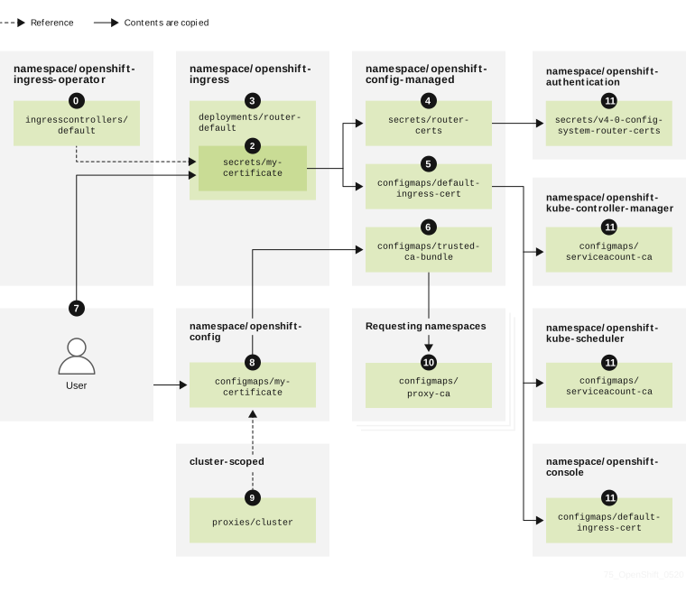
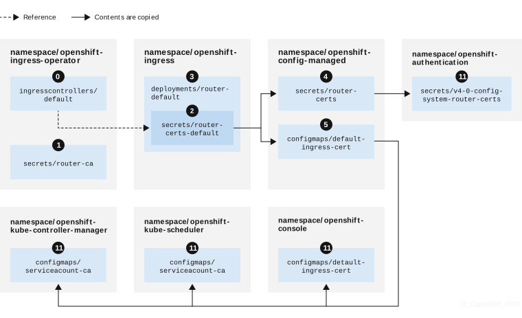

# Ingress certificates { #cert-types-ingress-certificates }

Manage ingress certificates in OpenShift Container Platform, including Prometheus metrics and secured routes, secret locations, default and custom workflows, expiration, and Operator renewal.

## Purpose { #ingress-certificates-purpose_cert-types-ingress-certificates }

The Ingress Operator uses certificates for:

- Securing access to metrics for Prometheus.
- Securing access to routes.

## Ingress certificate location { #ingress-certificates-location_cert-types-ingress-certificates }

Locate ingress certificate secrets in OpenShift Container Platform to replace Operator defaults and verify certificates for Prometheus metrics and secured routes.

To secure access to Ingress Operator and Ingress Controller metrics, the Ingress Operator uses service serving certificates. The Operator requests a certificate from the `service-ca` controller for Operator metrics, and the `service-ca` controller puts the certificate in a secret named `metrics-tls` in the `openshift-ingress-operator` namespace. Additionally, the Ingress Operator requests a certificate for each Ingress Controller, and the `service-ca` controller puts the certificate in a secret named `router-metrics-certs-<name>`, where `<name>` is the name of the Ingress Controller, in the `openshift-ingress` namespace.

Each Ingress Controller has a default certificate that it uses for secured routes that do not specify route-specific certificates. Unless you specify a custom certificate, the Operator uses a self-signed certificate by default. The Operator uses a self-signed Operator signing certificate to sign any default certificate that it generates. The Operator generates this signing certificate and puts it in a secret named `router-ca` in the `openshift-ingress-operator` namespace. When the Operator generates a default certificate, it puts the default certificate in a secret named `router-certs-<name>`, where `<name>` is the name of the Ingress Controller, in the `openshift-ingress` namespace.

!!! warning

    The Ingress Operator generates a default certificate for an Ingress Controller to serve as a placeholder until you configure a custom default certificate. Do not use Operator-generated default certificates in production clusters.

## Ingress certificate workflow { #ingress-certificates-workflow_cert-types-ingress-certificates }

Compare default and custom ingress certificate workflows in OpenShift Container Platform and how cluster components trust Operator serving certificates.

### Custom certificate workflow { #ingress-certificates-workflow-custom_cert-types-ingress-certificates }

### Default certificate workflow { #ingress-certificates-workflow-default_cert-types-ingress-certificates }

 An empty `defaultCertificate` field causes the Ingress Operator to use a self-signed certificate authority (CA) to generate a serving certificate for the specified domain.

 The default CA certificate and key generated by the Ingress Operator. Used to sign Operator-generated default serving certificates.

 In the default workflow, the wildcard default serving certificate, created by the Ingress Operator and signed using the generated default CA certificate. In the custom workflow, this is the user-provided certificate.

 The router deployment. Uses the certificate in `secrets/router-certs-default` as its default front-end server certificate.

 In the default workflow, the contents of the wildcard default serving certificate (public and private parts) are copied here to enable OAuth integration. In the custom workflow, this is the user-provided certificate.

 The public (certificate) part of the default serving certificate. Replaces the `configmaps/router-ca` resource.

 The user updates the cluster proxy configuration with the CA certificate that signed the `ingresscontroller` serving certificate. This enables components like `auth`, `console`, and the registry to trust the serving certificate.

 The cluster-wide trusted CA bundle containing the combined Red Hat Enterprise Linux CoreOS (RHCOS) and user-provided CA bundles or an RHCOS-only bundle if a user bundle is not provided.

 The custom CA certificate bundle, which instructs other components (for example, `auth` and `console`) to trust an `ingresscontroller` configured with a custom certificate.

 The `trustedCA` field is used to reference the user-provided CA bundle.

 The Cluster Network Operator injects the trusted CA bundle into the `proxy-ca` config map.

 OpenShift Container Platform 4.22 and newer use `default-ingress-cert`.

## Ingress certificate expiration { #ingress-certificates-expiration_cert-types-ingress-certificates }

Review fixed two-year expiration for Ingress Operator and `service-ca` certificates in OpenShift Container Platform to plan maintenance before certificates expire.

The expiration terms for the Ingress Operator certificates are as follows:

- The expiration date for metrics certificates that the `service-ca` controller creates is two years after the date of creation.
- The expiration date for the Operator signing certificate is two years after the date of creation.
- The expiration date for default certificates that the Operator generates is two years after the date of creation.

You cannot specify custom expiration terms on certificates that the Ingress Operator or `service-ca` controller creates.

## Ingress certificate services { #ingress-certificates-services_cert-types-ingress-certificates }

Review how Prometheus, secured routes, and the Ingress Operator depend on ingress metrics and default serving certificates in OpenShift Container Platform.

Prometheus uses the certificates that secure metrics.

The Ingress Operator specifies a dedicated signing certificate to sign default certificates that it generates for Ingress Controllers for which you do not set custom default certificates.

Cluster components that use secured routes may use the default Ingress Controller default certificate.

Ingress to the cluster via a secured route uses the default certificate of the Ingress Controller by which the route is accessed unless the route specifies a route certificate.

## Ingress certificate management and renewal { #ingress-certificates-management-renewal_cert-types-ingress-certificates }

Review ingress certificate renewal in OpenShift Container Platform to learn which certificates rotate automatically and which Operator defaults you must replace.

Ingress certificates are managed by the user. For more information, see "Replacing the default ingress certificate".

The `service-ca` controller automatically rotates the certificates that it issues. However, it is possible to use `oc delete secret <secret>` to manually rotate service serving certificates.

The Ingress Operator does not rotate its own signing certificate or the default certificates that it generates. Operator-generated default certificates are intended as placeholders for custom default certificates that you configure.

**Additional resources**

- [Replacing the default ingress certificate](../certificates/replacing-default-ingress-certificate.md#replacing-default-ingress)
