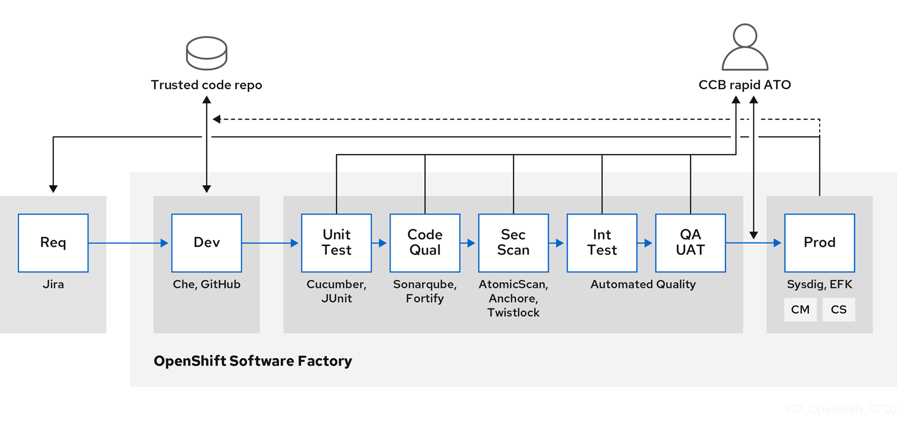
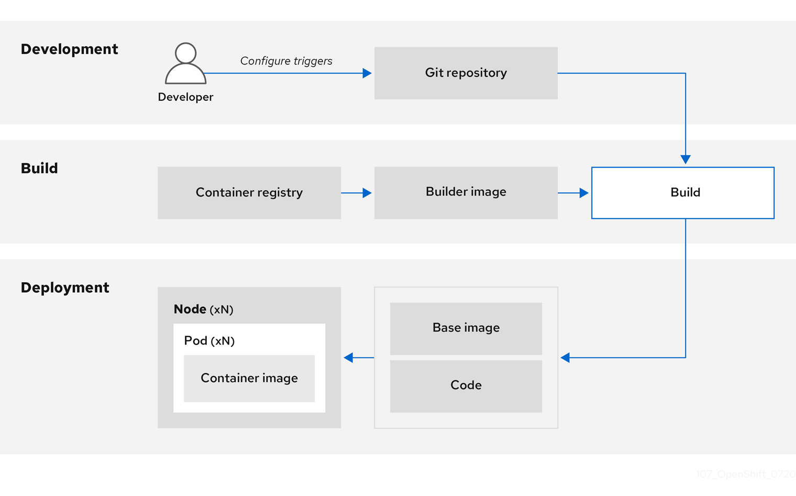
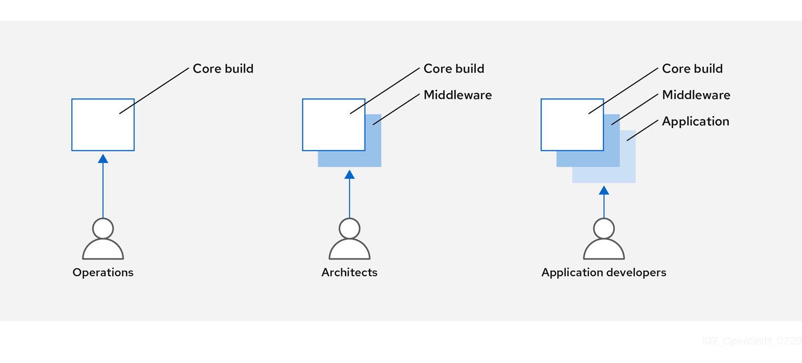

# Securing the build process { #security-build }

You can secure your software supply chain by using trusted base images, integrating security testing, and building once to deploy everywhere. Managing this build process ensures production deployments match verified builds and protects the software stack where code and libraries integrate.

## Building once, deploying everywhere { #security-build-once_security-build }

You can build container images once in a secure environment and deploy them unchanged across all stages. Using OpenShift Container Platform as your build standard guarantees this security, ensuring production deployments match verified builds and preventing runtime vulnerabilities.

It is also important to maintain the immutability of your containers. You should not patch running containers, but rebuild and redeploy them.

As your software moves through the stages of building, testing, and production, it is important that the tools making up your software supply chain be trusted. The following figure illustrates the process and tools that could be incorporated into a trusted software supply chain for containerized software:



OpenShift Container Platform can be integrated with trusted code repositories (such as GitHub) and development platforms (such as Che) for creating and managing secure code. Unit testing frameworks can validate code quality before builds.

You can inspect your containers for vulnerabilities and configuration issues at build, deploy, or runtime with Red Hat Advanced Cluster Security for Kubernetes. For images stored in Quay, you can use the Clair scanner to inspect images at rest. In addition, certified vulnerability scanners are available in the Red Hat ecosystem catalog.

Monitoring tools can provide ongoing visibility of your containerized applications.

**Additional resources**

- [Cucumber](https://cucumber.io/)
- [JUnit](https://junit.org/)
- [Red Hat Advanced Cluster Security for Kubernetes](https://www.redhat.com/en/technologies/cloud-computing/openshift/advanced-cluster-security-kubernetes)
- [Clair scanner](https://access.redhat.com/products/red-hat-quay)
- [Certified vulnerability scanners](https://catalog.redhat.com/software/vulnerability-scanner/search)
- [Sysdig](https://sysdig.com)

## Managing builds { #security-build-management_security-build }

You can use Source-to-Image (S2I) builder images that enable development and operations teams to collaborate on reproducible builds, using Red Hat Universal Base Images that you can freely redistribute with your applications.

You can use Source-to-Image (S2I) to combine source code and base images. *Builder images* make use of S2I to enable your development and operations teams to collaborate on a reproducible build environment. With Red Hat S2I images available as Universal Base Image (UBI) images, you can now freely redistribute your software with base images built from real RHEL RPM packages. Red Hat has removed subscription restrictions to allow this.

When developers commit code with Git for an application by using build images, OpenShift Container Platform can perform the following functions:

- Trigger, either by using webhooks on the code repository or other automated continuous integration (CI) process, to automatically assemble a new image from available artifacts, the S2I builder image, and the newly committed code.
- Automatically deploy the newly built image for testing.
- Promote the tested image to production where it can be automatically deployed using a CI process.



You can use the integrated OpenShift Container Registry to manage access to final images. Both S2I and native build images are automatically pushed to your OpenShift Container Registry.

In addition to the included Jenkins for CI, you can also integrate your own build and CI environment with OpenShift Container Platform using RESTful APIs, and use any API-compliant image registry.

## Securing inputs during builds { #security-build-inputs_security-build }

You can protect sensitive credentials required during builds by defining input secrets that give access to dependent resources without exposing those credentials in the final application image.

In some scenarios, build operations require credentials to access dependent resources, but it is undesirable for those credentials to be available in the final application image produced by the build. You can define input secrets for this purpose.

For example, when building a Node.js application, you can set up your private mirror for Node.js modules. To download modules from that private mirror, you must supply a custom `.npmrc` file for the build that has a URL, user name, and password. For security reasons, you do not want to expose your credentials in the application image.

Using this example scenario, you can add an input secret to a new `BuildConfig` object.

**Procedure**

1. Create the secret, if it does not exist:

    ```terminal
    $ oc create secret generic secret-npmrc --from-file=.npmrc=~/.npmrc
    ```

    This creates a new secret named `secret-npmrc`, which has the base64 encoded content of the `~/.npmrc` file.

2. Add the secret to the `source` section in the existing `BuildConfig` object:

    ```yaml
    source:
      git:
        uri: https://github.com/sclorg/nodejs-ex.git
      secrets:
      - destinationDir: .
        secret:
          name: secret-npmrc
    ```

3. To include the secret in a new `BuildConfig` object, run the following command:

    ```terminal
    $ oc new-build \
        openshift/nodejs-010-centos7~https://github.com/sclorg/nodejs-ex.git \
        --build-secret secret-npmrc
    ```

## Designing your build process { #security-build-designing_security-build }

You can design your container image management to separate control across teams by using layered images, integrate automated security testing into your CI process, and sign custom containers to ensure integrity between build and deployment.

You can design your container image management and build process to use container layers so that you can separate control.



For example, an operations team manages base images, while architects manage middleware, runtimes, databases, and other solutions. Developers can then focus on application layers and focus on writing code.

Because new vulnerabilities are identified daily, you need to proactively check container content over time. To do this, you should integrate automated security testing into your build or CI process. For example:

- SAST / DAST - Static and Dynamic security testing tools.
- Scanners for real-time checking against known vulnerabilities. Tools such as these catalog the open source packages in your container, notify you of any known vulnerabilities, and update you when new vulnerabilities are discovered in previously scanned packages.

Your CI process should include policies that flag builds with issues discovered by security scans so that your team can take appropriate action to address those issues. You should sign your custom built containers to ensure that nothing is tampered with between build and deployment.

Using GitOps methodology, you can use the same CI/CD mechanisms to manage not only your application configurations, but also your OpenShift Container Platform infrastructure.

## Building Knative serverless applications { #security-build-knative_security-build }

You can build, deploy, and manage serverless applications by using OpenShift Serverless in OpenShift Container Platform, relying on Kubernetes and Kourier,  leveraging S2I builder images and Knative services for scalable, event-driven workloads.

As with other builds, you can use S2I images to build your containers, then serve them using Knative services. View Knative application builds through the **Topology** view of the OpenShift Container Platform web console.

**Additional resources**

- [Understanding image builds](../../cicd/builds/understanding-image-builds.md#understanding-image-builds)
- [Triggering and modifying builds](../../cicd/builds/triggering-builds-build-hooks.md#triggering-builds-build-hooks)
- [Creating build inputs](../../cicd/builds/creating-build-inputs.md#creating-build-inputs)
- [Input secrets and config maps](../../cicd/builds/creating-build-inputs.md#builds-input-secrets-configmaps_creating-build-inputs)
- [OpenShift Serverless overview](https://docs.openshift.com/serverless/1.28/about/about-serverless.html)
- [Viewing application composition using the Topology view](../../applications/odc-viewing-application-composition-using-topology-view.md#odc-viewing-application-composition-using-topology-view)
