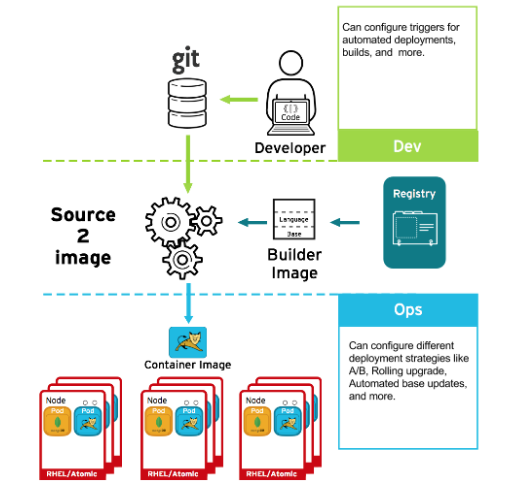

# Deploying containers { #security-deploy }

You can use a variety of techniques to make sure that the containers you deploy hold the latest production-quality content and that they have not been tampered with, such as setting up build triggers and using signatures.

## Controlling container deployments with triggers { #security-deploy-trigger_security-deploy }

If something happens during the build process, or if a vulnerability is discovered after an image has been deployed, you can use tool for automated, policy-based deployment to remediate. You can use triggers to rebuild and replace images, ensuring the immutable containers process, instead of patching running containers, which is not recommended.



For example, you build an application by using three container image layers: core, middleware, and applications. An issue is discovered in the core image and that image is rebuilt. After the build is complete, the image is pushed to your OpenShift Container Registry. OpenShift Container Platform detects that the image has changed and automatically rebuilds and deploys the application image, based on the defined triggers. This change incorporates the fixed libraries and ensures that the production code is identical to the most current image.

You can use the `oc set triggers` command to set a deployment trigger. For example, to set a trigger for a deployment called deployment-example:

```terminal
$ oc set triggers deploy/deployment-example \
    --from-image=example:latest \
    --containers=web
```

## Controlling what image sources can be deployed { #security-deploy-image-sources_security-deploy }

OpenShift Container Platform enables cluster administrators to apply security policy that is broad or narrow, reflecting deployment environment and security requirements.

It is important that the intended images are actually being deployed, that the images including the contained content are from trusted sources, and they have not been altered. Cryptographic signing provides this assurance. OpenShift Container Platform enables cluster administrators to apply security policy that is broad or narrow, reflecting deployment environment and security requirements. Two parameters define this policy:

- one or more registries, with optional project namespace
- trust type, such as accept, reject, or require public key(s)

You can use these policy parameters to allow, deny, or require a trust relationship for entire registries, parts of registries, or individual images. Using trusted public keys, you can ensure that the source is cryptographically verified. The policy rules apply to nodes. Policy might be applied uniformly across all nodes or targeted for different node workloads (for example, build, zone, or environment).

```json title="Example image signature policy file"
{
    "default": [{"type": "reject"}],
    "transports": {
        "docker": {
            "access.redhat.com": [
                {
                    "type": "signedBy",
                    "keyType": "GPGKeys",
                    "keyPath": "/etc/pki/rpm-gpg/RPM-GPG-KEY-redhat-release"
                }
            ]
        },
        "atomic": {
            "172.30.1.1:5000/openshift": [
                {
                    "type": "signedBy",
                    "keyType": "GPGKeys",
                    "keyPath": "/etc/pki/rpm-gpg/RPM-GPG-KEY-redhat-release"
                }
            ],
            "172.30.1.1:5000/production": [
                {
                    "type": "signedBy",
                    "keyType": "GPGKeys",
                    "keyPath": "/etc/pki/example.com/pubkey"
                }
            ],
            "172.30.1.1:5000": [{"type": "reject"}]
        }
    }
}
```

The policy can be saved onto a node as `/etc/containers/policy.json`. Saving this file to a node is best accomplished using a new `MachineConfig` object. This example enforces the following rules:

- Require images from the Red Hat Registry (`registry.access.redhat.com`) to be signed by the Red Hat public key.
- Require images from your OpenShift Container Registry in the `openshift` namespace to be signed by the Red Hat public key.
- Require images from your OpenShift Container Registry in the `production` namespace to be signed by the public key for `example.com`.
- Reject all other registries not specified by the global `default` definition.

## Using signature transports { #security-deploy-signature_security-deploy }

You can use a signature transport as a way to store and retrieve the binary signature blob.

Signature transports can be either of the following types:

- `atomic`: Managed by the OpenShift Container Platform API.
- `docker`: Served as a local file or by a web server.

The OpenShift Container Platform API manages signatures that use the `atomic` transport type. You must store the images that use this signature type in your OpenShift Container Registry. Because the docker or distribution `extensions` API auto-discovers the image signature endpoint, no additional configuration is required.

Signatures that use the `docker` transport type are served by local file or web server. These signatures are more flexible; you can serve images from any container image registry and use an independent server to deliver binary signatures.

However, the `docker` transport type requires additional configuration. You must configure the nodes with the Uniform Resource Identifier (URI) of the signature server by placing arbitrarily-named YAML files into a directory on the host system, `/etc/containers/registries.d` by default. The YAML configuration files contain a registry URI and a signature server URI, or *sigstore*:

```yaml title="Example registries.d file"
docker:
    access.redhat.com:
        sigstore: https://access.redhat.com/webassets/docker/content/sigstore
```

In this example, the Red Hat Registry, `access.redhat.com`, is the signature server that provides signatures for the `docker` transport type. Its URI is defined in the `sigstore` parameter. You might name this file `/etc/containers/registries.d/redhat.com.yaml` and use the Machine Config Operator to automatically place the file on each node in your cluster. No service restart is required since policy and `registries.d` files are dynamically loaded by the container runtime.

## Creating secrets and config maps { #security-deploy-secrets_security-deploy }

You can use the `Secret` object type to provide a mechanism to hold sensitive information such as passwords, OpenShift Container Platform client configuration files, `dockercfg` files, and private source repository credentials. Secrets decouple sensitive content from pods.

You can mount secrets into containers by using a volume plugin or the system can use secrets to perform actions on behalf of a pod.

Config maps are similar to secrets, but are designed to support working with strings that do not contain sensitive information. The `ConfigMap` object holds key-value pairs of configuration data that can be consumed in pods or used to store configuration data for system components such as controllers.

For example, to add a secret to your deployment so that it can access a private image repository, use the following procedure.

**Procedure**

1. Log in to the OpenShift Container Platform web console.
2. Create a new project.
3. Navigate to **Resources** → **Secrets** and create a new secret. Set `Secret Type` to `Image Secret` and `Authentication Type` to `Image Registry Credentials` to enter credentials for accessing a private image repository.
4. When creating a deployment (for example, from the **Add to Project** → **Deploy Image** page), set the `Pull Secret` to your new secret.

## Automating continuous deployment { #security-deploy-continuous_security-deploy }

You can integrate your own continuous deployment (CD) tooling with OpenShift Container Platform. 

By leveraging continuous integration and continuous deployment (CI/CD) and OpenShift Container Platform, you can automate the process of rebuilding the application to incorporate the latest fixes, testing, and ensuring that it is deployed everywhere within the environment.

**Additional resources**

- [Input secrets and config maps](../../cicd/builds/creating-build-inputs.md#builds-input-secrets-configmaps_creating-build-inputs)
