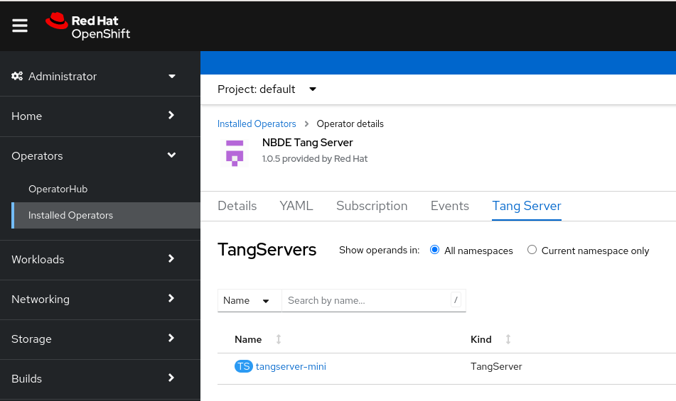
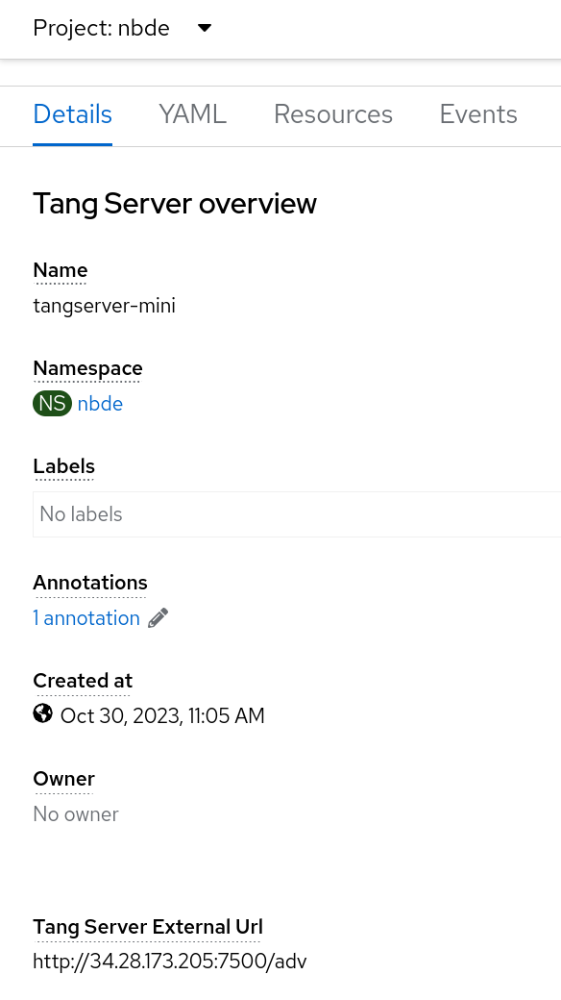

# Identifying URL of a Tang server deployed with the NBDE Tang Server Operator { #identifying-url-nbde-tang-server-operator }

Before you can configure your Clevis clients to use encryption keys advertised by your Tang servers, you must identify the URLs of the servers.

## Identifying URL of the NBDE Tang Server Operator using the web console { #identifying-url-nbde-tang-server-operator-using-web-console_identifying-url-nbde-tang-server-operator }

You can identify the URLs of Tang servers deployed with the NBDE Tang Server Operator from the software catalog by using the OpenShift Container Platform web console. After you identify the URLs, you use the `clevis luks bind` command on your clients containing LUKS-encrypted volumes that you want to unlock automatically by using keys advertised by the Tang servers. See the [Configuring manual enrollment of LUKS-encrypted volumes](https://access.redhat.com/documentation/en-us/red_hat_enterprise_linux/9/html/security_hardening/configuring-automated-unlocking-of-encrypted-volumes-using-policy-based-decryption_security-hardening#configuring-manual-enrollment-of-volumes-using-clevis_configuring-automated-unlocking-of-encrypted-volumes-using-policy-based-decryption) section in the RHEL 9 Security hardening document for detailed steps describing the configuration of clients with Clevis.

**Prerequisites**

- You must have `cluster-admin` privileges on an OpenShift Container Platform cluster.
- You deployed a Tang server by using the NBDE Tang Server Operator on your OpenShift cluster.

**Procedure**

1. In the OpenShift Container Platform web console, navigate to **Ecosystem** → **Installed Operators** → **Tang Server**.

2. On the NBDE Tang Server Operator details page, select **Tang Server**. 

3. The list of Tang servers deployed and available for your cluster appears. Click the name of the Tang server you want to bind with a Clevis client.

4. The web console displays an overview of the selected Tang server. You can find the URL of your Tang server in the `Tang Server External Url` section of the screen: 

    In this example, the URL of the Tang server is `http://34.28.173.205:7500`.

**Verification**

- You can check that the Tang server is advertising by using `curl`, `wget`, or similar tools, for example:

    ```terminal
    $ curl 2> /dev/null http://34.28.173.205:7500/adv  | jq
    ```

    ```terminal title="Example output"
    {
      "payload": "eyJrZXlzIj…eSJdfV19",
      "protected": "eyJhbGciOiJFUzUxMiIsImN0eSI6Imp3ay1zZXQranNvbiJ9",
      "signature": "AUB0qSFx0FJLeTU…aV_GYWlDx50vCXKNyMMCRx"
    }
    ```

## Identifying URL of the NBDE Tang Server Operator using CLI { #identifying-url-nbde-tang-server-operator-using-cli_identifying-url-nbde-tang-server-operator }

You can identify the URLs of Tang servers deployed with the NBDE Tang Server Operator from the software catalog by using the CLI. After you identify the URLs, you use the `clevis luks bind` command on your clients containing LUKS-encrypted volumes that you want to unlock automatically by using keys advertised by the Tang servers. See the [Configuring manual enrollment of LUKS-encrypted volumes](https://access.redhat.com/documentation/en-us/red_hat_enterprise_linux/9/html/security_hardening/configuring-automated-unlocking-of-encrypted-volumes-using-policy-based-decryption_security-hardening#configuring-manual-enrollment-of-volumes-using-clevis_configuring-automated-unlocking-of-encrypted-volumes-using-policy-based-decryption) section in the RHEL 9 Security hardening document for detailed steps describing the configuration of clients with Clevis.

**Prerequisites**

- You must have `cluster-admin` privileges on an OpenShift Container Platform cluster.
- You have installed the OpenShift CLI (`oc`).
- You deployed a Tang server by using the NBDE Tang Server Operator on your OpenShift cluster.

**Procedure**

1. List details about your Tang server, for example:

    ```terminal
    $ oc -n nbde describe tangserver
    ```

    ```terminal title="Example output"
    …
    Spec:
    …
    Status:
      Ready:                 1
      Running:               1
      Service External URL:  http://34.28.173.205:7500/adv
      Tang Server Error:     No
    Events:
    …
    ```

2. Use the value of the `Service External URL:` item without the `/adv` part. In this example, the URL of the Tang server is `http://34.28.173.205:7500`.

**Verification**

- You can check that the Tang server is advertising by using `curl`, `wget`, or similar tools, for example:

    ```terminal
    $ curl 2> /dev/null http://34.28.173.205:7500/adv  | jq
    ```

    ```terminal title="Example output"
    {
      "payload": "eyJrZXlzIj…eSJdfV19",
      "protected": "eyJhbGciOiJFUzUxMiIsImN0eSI6Imp3ay1zZXQranNvbiJ9",
      "signature": "AUB0qSFx0FJLeTU…aV_GYWlDx50vCXKNyMMCRx"
    }
    ```

**Additional resources**

- [Configuring manual enrollment of LUKS-encrypted volumes](https://access.redhat.com/documentation/en-us/red_hat_enterprise_linux/9/html/security_hardening/configuring-automated-unlocking-of-encrypted-volumes-using-policy-based-decryption_security-hardening#configuring-manual-enrollment-of-volumes-using-clevis_configuring-automated-unlocking-of-encrypted-volumes-using-policy-based-decryption)
