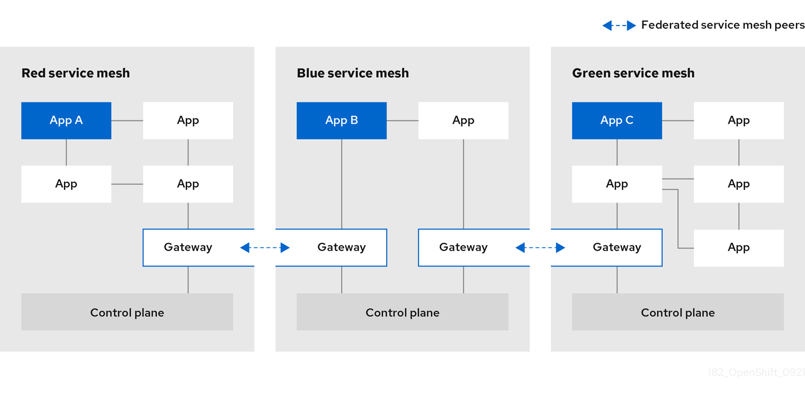
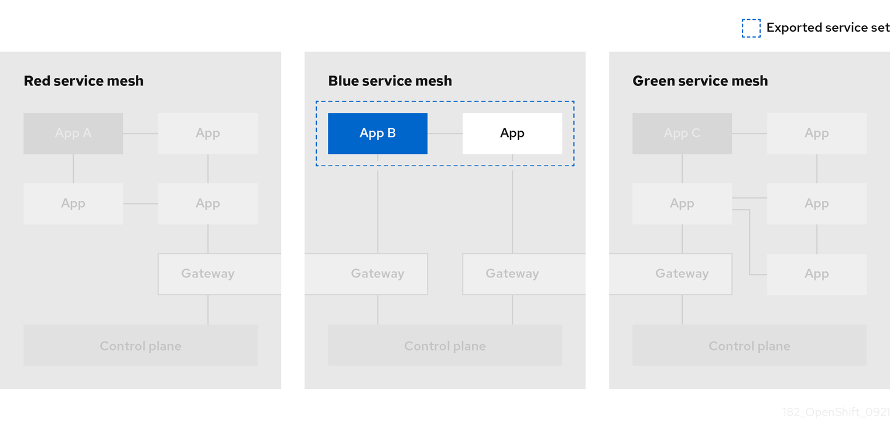
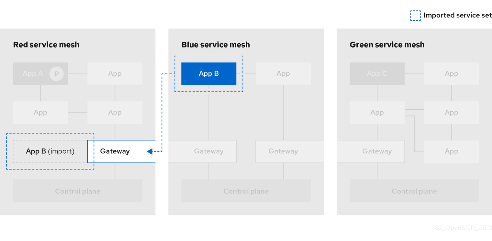

# Connecting service meshes { #ossm-federation }

*Federation* is a deployment model that lets you share services and workloads between separate meshes managed in distinct administrative domains.

## Federation overview { #ossm-federation-overview_federation }

Federation is a set of features that let you connect services between separate meshes, allowing the use of Service Mesh features such as authentication, authorization, and traffic management across multiple, distinct administrative domains.

Implementing a federated mesh lets you run, manage, and observe a single service mesh running across multiple OpenShift clusters. Red Hat OpenShift Service Mesh federation takes an opinionated approach to a multi-cluster implementation of Service Mesh that assumes *minimal* trust between meshes.

Service Mesh federation assumes that each mesh is managed individually and retains its own administrator. The default behavior is that no communication is permitted and no information is shared between meshes. The sharing of information between meshes is on an explicit opt-in basis. Nothing is shared in a federated mesh unless it has been configured for sharing. Support functions such as certificate generation, metrics and trace collection remain local in their respective meshes.

You configure the `ServiceMeshControlPlane` on each service mesh to create ingress and egress gateways specifically for the federation, and to specify the trust domain for the mesh.

Federation also involves the creation of additional federation files. The following resources are used to configure the federation between two or more meshes.

- A **ServiceMeshPeer** resource declares the federation between a pair of service meshes.
- An **ExportedServiceSet** resource declares that one or more services from the mesh are available for use by a peer mesh.
- An **ImportedServiceSet** resource declares which services exported by a peer mesh will be imported into the mesh.

## Federation features { #ossm-federation-features_federation }

Features of the Red Hat OpenShift Service Mesh federated approach to joining meshes include the following:

- Supports common root certificates for each mesh.

- Supports different root certificates for each mesh.

- Mesh administrators must manually configure certificate chains, service discovery endpoints, trust domains, etc for meshes outside of the Federated mesh.

- Only export/import the services that you want to share between meshes.

    - Defaults to not sharing information about deployed workloads with other meshes in the federation. A service can be **exported** to make it visible to other meshes and allow requests from workloads outside of its own mesh.
    - A service that has been exported can be **imported** to another mesh, enabling workloads on that mesh to send requests to the imported service.

- Encrypts communication between meshes at all times.

- Supports configuring load balancing across workloads deployed locally and workloads that are deployed in another mesh in the federation.

When a mesh is joined to another mesh it can do the following:

- Provide trust details about itself to the federated mesh.
- Discover trust details about the federated mesh.
- Provide information to the federated mesh about its own exported services.
- Discover information about services exported by the federated mesh.

## Federation security { #ossm-federation-security_federation }

Red Hat OpenShift Service Mesh federation takes an opinionated approach to a multi-cluster implementation of Service Mesh that assumes minimal trust between meshes. Data security is built in as part of the federation features.

- Each mesh is considered to be a unique tenant, with a unique administration.
- You create a unique trust domain for each mesh in the federation.
- Traffic between the federated meshes is automatically encrypted using mutual Transport Layer Security (mTLS).
- The Kiali graph only displays your mesh and services that you have imported. You cannot see the other mesh or services that have not been imported into your mesh.

## Federation limitations { #ossm-federation-limitations_federation }

The Red Hat OpenShift Service Mesh federated approach to joining meshes has the following limitations:

- Federation of meshes is not supported on OpenShift Dedicated.

## Federation prerequisites { #ossm-federation-prerequisites_federation }

The Red Hat OpenShift Service Mesh federated approach to joining meshes has the following prerequisites:

- Two or more OpenShift Container Platform 4.6 or above clusters.
- Federation was introduced in Red Hat OpenShift Service Mesh 2.1 or later. You must have the Red Hat OpenShift Service Mesh 2.1 or later Operator installed on each mesh that you want to federate.
- You must have a version 2.1 or later `ServiceMeshControlPlane` deployed on each mesh that you want to federate.
- You must configure the load balancers supporting the services associated with the federation gateways to support raw TLS traffic. Federation traffic consists of HTTPS for discovery and raw encrypted TCP for service traffic.
- Services that you want to expose to another mesh should be deployed before you can export and import them. However, this is not a strict requirement. You can specify service names that do not yet exist for export/import. When you deploy the services named in the `ExportedServiceSet` and `ImportedServiceSet` they will be automatically made available for export/import.

## Planning your mesh federation { #ossm-federation-planning_federation }

Before you start configuring your mesh federation, you should take some time to plan your implementation.

- How many meshes do you plan to join in a federation? You probably want to start with a limited number of meshes, perhaps two or three.

- What naming convention do you plan to use for each mesh? Having a pre-defined naming convention will help with configuration and troubleshooting. The examples in this documentation use different colors for each mesh. You should decide on a naming convention that will help you determine who owns and manages each mesh, as well as the following federation resources:

    - Cluster names

    - Cluster network names

    - Mesh names and namespaces

    - Federation ingress gateways

    - Federation egress gateways

    - Security trust domains

        !!! note

            Each mesh in the federation must have its own unique trust domain.

- Which services from each mesh do you plan to export to the federated mesh? Each service can be exported individually, or you can specify labels or use wildcards.

    - Do you want to use aliases for the service namespaces?
    - Do you want to use aliases for the exported services?

- Which exported services does each mesh plan to import? Each mesh only imports the services that it needs.

    - Do you want to use aliases for the imported services?

## Mesh federation across clusters { #ossm-federation-across-clusters_federation }

To connect one instance of the OpenShift Service Mesh with one running in a different cluster, the procedure is not much different as when connecting two meshes deployed in the same cluster. However, the ingress gateway of one mesh must be reachable from the other mesh. One way of ensuring this is to configure the gateway service as a `LoadBalancer` service if the cluster supports this type of service.

The service must be exposed through a load balancer that operates at Layer4 of the OSI model.

### Exposing the federation ingress on clusters running on bare metal { #_exposing_the_federation_ingress_on_clusters_running_on_bare_metal }

If the cluster runs on bare metal and fully supports `LoadBalancer` services, the IP address found in the `.status.loadBalancer.ingress.ip` field of the ingress gateway `Service` object should be specified as one of the entries in the `.spec.remote.addresses` field of the `ServiceMeshPeer` object.

If the cluster does not support `LoadBalancer` services, using a `NodePort` service could be an option if the nodes are accessible from the cluster running the other mesh. In the `ServiceMeshPeer` object, specify the IP addresses of the nodes in the `.spec.remote.addresses` field and the service’s node ports in the `.spec.remote.discoveryPort` and `.spec.remote.servicePort` fields.

### Exposing the federation ingress on clusters running on IBM Power and IBM Z { #_exposing_the_federation_ingress_on_clusters_running_on_ibm_power_title_and_ibm_z_title }

If the cluster runs on IBM Power(R) or IBM Z(R) infrastructure and fully supports `LoadBalancer` services, the IP address found in the `.status.loadBalancer.ingress.ip` field of the ingress gateway `Service` object should be specified as one of the entries in the `.spec.remote.addresses` field of the `ServiceMeshPeer` object.

If the cluster does not support `LoadBalancer` services, using a `NodePort` service could be an option if the nodes are accessible from the cluster running the other mesh. In the `ServiceMeshPeer` object, specify the IP addresses of the nodes in the `.spec.remote.addresses` field and the service’s node ports in the `.spec.remote.discoveryPort` and `.spec.remote.servicePort` fields.

### Exposing the federation ingress on Amazon Web Services (AWS) { #_exposing_the_federation_ingress_on_amazon_web_services_aws }

By default, LoadBalancer services in clusters running on AWS do not support L4 load balancing. In order for Red Hat OpenShift Service Mesh federation to operate correctly, the following annotation must be added to the ingress gateway service:

service.beta.kubernetes.io/aws-load-balancer-type: nlb

The Fully Qualified Domain Name found in the `.status.loadBalancer.ingress.hostname` field of the ingress gateway `Service` object should be specified as one of the entries in the `.spec.remote.addresses` field of the `ServiceMeshPeer` object.

### Exposing the federation ingress on Azure { #_exposing_the_federation_ingress_on_azure }

On Microsoft Azure, merely setting the service type to `LoadBalancer` suffices for mesh federation to operate correctly.

The IP address found in the `.status.loadBalancer.ingress.ip` field of the ingress gateway `Service` object should be specified as one of the entries in the `.spec.remote.addresses` field of the `ServiceMeshPeer` object.

### Exposing the federation ingress on Google Cloud { #_exposing_the_federation_ingress_on_gcp_first }

On Google Cloud, merely setting the service type to `LoadBalancer` suffices for mesh federation to operate correctly.

The IP address found in the `.status.loadBalancer.ingress.ip` field of the ingress gateway `Service` object should be specified as one of the entries in the `.spec.remote.addresses` field of the `ServiceMeshPeer` object.

## Federation implementation checklist { #con-my-concept-module-a_federation }

Federating services meshes involves the following activities:

- \[ \] Configure networking between the clusters that you are going to federate.

    - \[ \] Configure the load balancers supporting the services associated with the federation gateways to support raw TLS traffic.

- \[ \] Installing the Red Hat OpenShift Service Mesh version 2.1 or later Operator in each of your clusters.

- \[ \] Deploying a version 2.1 or later `ServiceMeshControlPlane` to each of your clusters.

- \[ \] Configuring the SMCP for federation for each mesh that you want to federate:

    - \[ \] Create a federation egress gateway for each mesh you are going to federate with.
    - \[ \] Create a federation ingress gateway for each mesh you are going to federate with.
    - \[ \] Configure a unique trust domain.

- \[ \] Federate two or more meshes by creating a `ServiceMeshPeer` resource for each mesh pair.

- \[ \] Export services by creating an `ExportedServiceSet` resource to make services available from one mesh to a peer mesh.

- \[ \] Import services by creating an `ImportedServiceSet` resource to import services shared by a mesh peer.

## Configuring a Service Mesh control plane for federation { #ossm-federation-config-smcp_federation }

Before a mesh can be federated, you must configure the `ServiceMeshControlPlane` for mesh federation. Because all meshes that are members of the federation are equal, and each mesh is managed independently, you must configure the SMCP for *each* mesh that will participate in the federation.

In the following example, the administrator for the `red-mesh` is configuring the SMCP for federation with both the `green-mesh` and the `blue-mesh`.

```yaml title="Sample SMCP for red-mesh"
apiVersion: maistra.io/v2
kind: ServiceMeshControlPlane
metadata:
  name: red-mesh
  namespace: red-mesh-system
spec:
  version: v2.6
  runtime:
    defaults:
      container:
        imagePullPolicy: Always
  gateways:
    additionalEgress:
      egress-green-mesh:
        enabled: true
        requestedNetworkView:
        - green-network
        service:
          metadata:
            labels:
              federation.maistra.io/egress-for: egress-green-mesh
          ports:
          - port: 15443
            name: tls
          - port: 8188
            name: http-discovery  #note HTTP here
      egress-blue-mesh:
        enabled: true
        requestedNetworkView:
        - blue-network
        service:
          metadata:
            labels:
              federation.maistra.io/egress-for: egress-blue-mesh
          ports:
          - port: 15443
            name: tls
          - port: 8188
            name: http-discovery  #note HTTP here
    additionalIngress:
      ingress-green-mesh:
        enabled: true
        service:
          type: LoadBalancer
          metadata:
            labels:
              federation.maistra.io/ingress-for: ingress-green-mesh
          ports:
          - port: 15443
            name: tls
          - port: 8188
            name: https-discovery  #note HTTPS here
      ingress-blue-mesh:
        enabled: true
        service:
          type: LoadBalancer
          metadata:
            labels:
              federation.maistra.io/ingress-for: ingress-blue-mesh
          ports:
          - port: 15443
            name: tls
          - port: 8188
            name: https-discovery  #note HTTPS here
  security:
    trust:
      domain: red-mesh.local
```

**ServiceMeshControlPlane federation configuration parameters**

<table>
<tbody>
<tr>
  <td>Parameter</td>
  <td>Description</td>
  <td>Values</td>
  <td>Default value</td>
</tr>
<tr>
  <td>spec: cluster: name:</td>
  <td>Name of the cluster. You are not required to specify a cluster name, but it is helpful for troubleshooting.</td>
  <td>String</td>
  <td>N/A</td>
</tr>
<tr>
  <td>spec: cluster: network:</td>
  <td>Name of the cluster network. You are not required to specify a name for the network, but it is helpful for configuration and troubleshooting.</td>
  <td>String</td>
  <td>N/A</td>
</tr>
</tbody>
</table>


### Understanding federation gateways { #_understanding_federation_gateways }

You use a **gateway** to manage inbound and outbound traffic for your mesh, letting you specify which traffic you want to enter or leave the mesh.

You use ingress and egress gateways to manage traffic entering and leaving the service mesh (North-South traffic). When you create a federated mesh, you create additional ingress/egress gateways, to facilitate service discovery between federated meshes, communication between federated meshes, and to manage traffic flow between service meshes (East-West traffic).

To avoid naming conflicts between meshes, you must create separate egress and ingress gateways for each mesh. For example, `red-mesh` would have separate egress gateways for traffic going to `green-mesh` and `blue-mesh`.

**Federation gateway parameters**

<table>
<tbody>
<tr>
  <td>Parameter</td>
  <td>Description</td>
  <td>Values</td>
  <td>Default value</td>
</tr>
<tr>
  <td>spec: gateways: additionalEgress: <egress_name>:</td>
  <td>Define an additional egress gateway for <em>each</em> mesh peer in the federation.</td>
  <td></td>
  <td></td>
</tr>
<tr>
  <td>spec: gateways: additionalEgress: <egress_name>: enabled:</td>
  <td>This parameter enables or disables the federation egress.</td>
  <td><code>true</code>/<code>false</code></td>
  <td><code>true</code></td>
</tr>
<tr>
  <td>spec: gateways: additionalEgress: <egress_name>: requestedNetworkView:</td>
  <td>Networks associated with exported services.</td>
  <td>Set to the value of <code>spec.cluster.network</code> in the SMCP for the mesh, otherwise use <ServiceMeshPeer-name>-network. For example, if the <code>ServiceMeshPeer</code> resource for that mesh is named <code>west</code>, then the network would be named <code>west-network</code>.</td>
  <td></td>
</tr>
<tr>
  <td>spec: gateways: additionalEgress: <egress_name>: service: metadata: labels: federation.maistra.io/egress-for:</td>
  <td>Specify a unique label for the gateway to prevent federated traffic from flowing through the cluster's default system gateways.</td>
  <td></td>
  <td></td>
</tr>
<tr>
  <td>spec: gateways: additionalEgress: <egress_name>: service: ports:</td>
  <td>Used to specify the <code>port:</code> and <code>name:</code> used for TLS and service discovery. Federation traffic consists of raw encrypted TCP for service traffic.</td>
  <td>Port <code>15443</code> is required for sending TLS service requests to other meshes in the federation. Port <code>8188</code> is required for sending service discovery requests to other meshes in the federation.</td>
  <td></td>
</tr>
<tr>
  <td>spec: gateways: additionalIngress:</td>
  <td>Define an additional ingress gateway gateway for <em>each</em> mesh peer in the federation.</td>
  <td></td>
  <td></td>
</tr>
<tr>
  <td>spec: gateways: additionalIgress: <ingress_name>: enabled:</td>
  <td>This parameter enables or disables the federation ingress.</td>
  <td><code>true</code>/<code>false</code></td>
  <td><code>true</code></td>
</tr>
<tr>
  <td>spec: gateways: additionalIngress: <ingress_name>: service: type:</td>
  <td>The ingress gateway service must be exposed through a load balancer that operates at Layer 4 of the OSI model and is publicly available.</td>
  <td><code>LoadBalancer</code></td>
  <td></td>
</tr>
<tr>
  <td>spec: gateways: additionalIngress: <ingress_name>: service: type:</td>
  <td>If the cluster does not support <code>LoadBalancer</code> services, the ingress gateway service can be exposed through a <code>NodePort</code> service.</td>
  <td><code>NodePort</code></td>
  <td></td>
</tr>
<tr>
  <td>spec: gateways: additionalIngress: <ingress_name>: service: metadata: labels: federation.maistra.io/ingress-for:</td>
  <td>Specify a unique label for the gateway to prevent federated traffic from flowing through the cluster's default system gateways.</td>
  <td></td>
  <td></td>
</tr>
<tr>
  <td>spec: gateways: additionalIngress: <ingress_name>: service: ports:</td>
  <td>Used to specify the <code>port:</code> and <code>name:</code> used for TLS and service discovery. Federation traffic consists of raw encrypted TCP for service traffic. Federation traffic consists of HTTPS for discovery.</td>
  <td>Port <code>15443</code> is required for receiving TLS service requests to other meshes in the federation. Port <code>8188</code> is required for receiving service discovery requests to other meshes in the federation.</td>
  <td></td>
</tr>
<tr>
  <td>spec: gateways: additionalIngress: <ingress_name>: service: ports: nodePort:</td>
  <td>Used to specify the <code>nodePort:</code> if the cluster does not support <code>LoadBalancer</code> services.</td>
  <td>If specified, is required in addition to <code>port:</code> and <code>name:</code> for both TLS and service discovery. <code>nodePort:</code> must be in the range  <code>30000</code>-<code>32767</code>.</td>
  <td></td>
</tr>
</tbody>
</table>


In the following example, the administrator is configuring the SMCP for federation with  the `green-mesh` using a `NodePort` service.

```yaml title="Sample SMCP for NodePort"
apiVersion: maistra.io/v2
kind: ServiceMeshControlPlane
metadata:
  name: green-mesh
  namespace: green-mesh-system
spec:
# ...
  gateways:
     additionalIngress:
      ingress-green-mesh:
        enabled: true
        service:
          type: NodePort
          metadata:
            labels:
              federation.maistra.io/ingress-for: ingress-green-mesh
          ports:
          - port: 15443
            nodePort: 30510
            name: tls
          - port: 8188
            nodePort: 32359
            name: https-discovery
```

### Understanding federation trust domain parameters { #_understanding_federation_trust_domain_parameters }

Each mesh in the federation must have its own unique trust domain. This value is used when configuring mesh federation in the `ServiceMeshPeer` resource.

```yaml
kind: ServiceMeshControlPlane
metadata:
  name: red-mesh
  namespace: red-mesh-system
spec:
  security:
    trust:
      domain: red-mesh.local
```

**Federation security parameters**

<table>
<tbody>
<tr>
  <td>Parameter</td>
  <td>Description</td>
  <td>Values</td>
  <td>Default value</td>
</tr>
<tr>
  <td>spec: security: trust: domain:</td>
  <td>Used to specify a unique name for the trust domain for the mesh. Domains must be unique for every mesh in the federation.</td>
  <td><code>&lt;mesh-name&gt;.local</code></td>
  <td>N/A</td>
</tr>
</tbody>
</table>


**Procedure from the Console**

Follow this procedure to edit the `ServiceMeshControlPlane` with the OpenShift Container Platform web console. This example uses the `red-mesh` as an example.

1. Log in to the OpenShift Container Platform web console as a user with the cluster-admin role.
2. Navigate to **Ecosystem** → **Installed Operators**.
3. Click the **Project** menu and select the project where you installed the Service Mesh control plane. For example, `red-mesh-system`.
4. Click the Red Hat OpenShift Service Mesh Operator.
5. On the **Istio Service Mesh Control Plane** tab, click the name of your `ServiceMeshControlPlane`, for example `red-mesh`.
6. On the **Create ServiceMeshControlPlane Details** page, click `YAML` to modify your configuration.
7. Modify your `ServiceMeshControlPlane` to add federation ingress and egress gateways and to specify the trust domain.
8. Click **Save**.

**Procedure from the CLI**

Follow this procedure to create or edit the `ServiceMeshControlPlane` with the command line. This example uses the `red-mesh` as an example.

1. Log in to the OpenShift Container Platform CLI as a user with the `cluster-admin` role. Enter the following command. Then, enter your username and password when prompted.

    ```terminal
    $ oc login --username=<NAMEOFUSER> https://<HOSTNAME>:6443
    ```

2. Change to the project where you installed the Service Mesh control plane, for example red-mesh-system.

    ```terminal
    $ oc project red-mesh-system
    ```

3. Edit the `ServiceMeshControlPlane` file to add federation ingress and egress gateways and to specify the trust domain.

4. Run the following command to edit the Service Mesh control plane where `red-mesh-system` is the system namespace and `red-mesh` is the name of the `ServiceMeshControlPlane` object:

    ```terminal
    $ oc edit -n red-mesh-system smcp red-mesh
    ```

5. Enter the following command, where `red-mesh-system` is the system namespace, to see the status of the Service Mesh control plane installation.

    ```terminal
    $ oc get smcp -n red-mesh-system
    ```

    The installation has finished successfully when the READY column indicates that all components are ready.

    ```
    NAME       READY   STATUS            PROFILES      VERSION   AGE
    red-mesh   10/10   ComponentsReady   ["default"]   2.1.0     4m25s
    ```

## Joining a federated mesh { #ossm-federation-joining_federation }

You declare the federation between two meshes by creating a `ServiceMeshPeer` resource. The `ServiceMeshPeer` resource defines the federation between two meshes, and you use it to configure discovery for the peer mesh, access to the peer mesh, and certificates used to validate the other mesh’s clients.



Meshes are federated on a one-to-one basis, so each pair of peers requires a pair of `ServiceMeshPeer` resources specifying the federation connection to the other service mesh. For example, federating two meshes named `red` and `green` would require two `ServiceMeshPeer` files.

1. On red-mesh-system, create a `ServiceMeshPeer` for the green mesh.
2. On green-mesh-system, create a `ServiceMeshPeer` for the red mesh.

Federating three meshes named `red`, `blue`, and `green` would require six `ServiceMeshPeer` files.

1. On red-mesh-system, create a `ServiceMeshPeer` for the green mesh.
2. On red-mesh-system, create a `ServiceMeshPeer` for the blue mesh.
3. On green-mesh-system, create a `ServiceMeshPeer` for the red mesh.
4. On green-mesh-system, create a `ServiceMeshPeer` for the blue mesh.
5. On blue-mesh-system, create a `ServiceMeshPeer` for the red mesh.
6. On blue-mesh-system, create a `ServiceMeshPeer` for the green mesh.

Configuration in the `ServiceMeshPeer` resource includes the following:

- The address of the other mesh’s ingress gateway, which is used for discovery and service requests.
- The names of the local ingress and egress gateways that is used for interactions with the specified peer mesh.
- The client ID used by the other mesh when sending requests to this mesh.
- The trust domain used by the other mesh.
- The name of a `ConfigMap` containing a root certificate that is used to validate client certificates in the trust domain used by the other mesh.

In the following example, the administrator for the `red-mesh` is configuring federation with the `green-mesh`.

```yaml title="Example ServiceMeshPeer resource for red-mesh"
kind: ServiceMeshPeer
apiVersion: federation.maistra.io/v1
metadata:
  name: green-mesh
  namespace: red-mesh-system
spec:
  remote:
    addresses:
    - ingress-red-mesh.green-mesh-system.apps.domain.com
  gateways:
    ingress:
      name: ingress-green-mesh
    egress:
      name: egress-green-mesh
  security:
    trustDomain: green-mesh.local
    clientID: green-mesh.local/ns/green-mesh-system/sa/egress-red-mesh-service-account
    certificateChain:
      kind: ConfigMap
      name: green-mesh-ca-root-cert
```

**ServiceMeshPeer configuration parameters**

<table>
<tbody>
<tr>
  <td>Parameter</td>
  <td>Description</td>
  <td>Values</td>
</tr>
<tr>
  <td>metadata: name:</td>
  <td>Name of the peer mesh that this resource is configuring federation with.</td>
  <td>String</td>
</tr>
<tr>
  <td>metadata: namespace:</td>
  <td>System namespace for this mesh, that is, where the Service Mesh control plane is installed.</td>
  <td>String</td>
</tr>
<tr>
  <td>spec: remote: addresses:</td>
  <td>List of public addresses of the peer meshes' ingress gateways that are servicing requests from this mesh.</td>
  <td></td>
</tr>
<tr>
  <td>spec: remote: discoveryPort:</td>
  <td>The port on which the addresses are handling discovery requests.</td>
  <td>Defaults to 8188</td>
</tr>
<tr>
  <td>spec: remote: servicePort:</td>
  <td>The port on which the addresses are handling service requests.</td>
  <td>Defaults to 15443</td>
</tr>
<tr>
  <td>spec: gateways: ingress: name:</td>
  <td>Name of the ingress on this mesh that is servicing requests received from the peer mesh. For example, <code>ingress-green-mesh</code>.</td>
  <td></td>
</tr>
<tr>
  <td>spec: gateways: egress: name:</td>
  <td>Name of the egress on this mesh that is servicing requests sent to the peer mesh. For example, <code>egress-green-mesh</code>.</td>
  <td></td>
</tr>
<tr>
  <td>spec: security: trustDomain:</td>
  <td>The trust domain used by the peer mesh.</td>
  <td><peerMeshName>.local</td>
</tr>
<tr>
  <td>spec: security: clientID:</td>
  <td>The client ID used by the peer mesh when calling into this mesh.</td>
  <td><peerMeshTrustDomain>/ns/<peerMeshSystem>/sa/<peerMeshEgressGatewayName>-service-account</td>
</tr>
<tr>
  <td>spec: security: certificateChain: kind: ConfigMap name:</td>
  <td>The kind (for example, ConfigMap) and name of a resource containing the root certificate used to validate the client and server certificate(s) presented to this mesh by the peer mesh. The key of the config map entry containing the certificate should be <code>root-cert.pem</code>.</td>
  <td>kind: ConfigMap name: <peerMesh>-ca-root-cert</td>
</tr>
</tbody>
</table>


### Creating a ServiceMeshPeer resource { #ossm-federation-create-peer_federation }

**Prerequisites**

- Two or more OpenShift Container Platform 4.6 or above clusters.
- The clusters must already be networked.
- The load balancers supporting the services associated with the federation gateways must be configured to support raw TLS traffic.
- Each cluster must have a version 2.1 or later `ServiceMeshControlPlane` configured to support federation deployed.
- An account with the `cluster-admin` role.

**Procedure from the CLI**

Follow this procedure to create a `ServiceMeshPeer` resource from the command line. This example shows the `red-mesh` creating a peer resource for the `green-mesh`.

1. Log in to the OpenShift Container Platform CLI as a user with the `cluster-admin` role. Enter the following command. Then, enter your username and password when prompted.

    ```terminal
    $ oc login --username=<NAMEOFUSER> <API token> https://<HOSTNAME>:6443
    ```

2. Change to the project where you installed the control plane, for example, `red-mesh-system`.

    ```terminal
    $ oc project red-mesh-system
    ```

3. Create a `ServiceMeshPeer` file based the following example for the two meshes that you want to federate.

    ```yaml title="Example ServiceMeshPeer resource for red-mesh to green-mesh"
    kind: ServiceMeshPeer
    apiVersion: federation.maistra.io/v1
    metadata:
      name: green-mesh
      namespace: red-mesh-system
    spec:
      remote:
        addresses:
        - ingress-red-mesh.green-mesh-system.apps.domain.com
      gateways:
        ingress:
          name: ingress-green-mesh
        egress:
          name: egress-green-mesh
      security:
        trustDomain: green-mesh.local
        clientID: green-mesh.local/ns/green-mesh-system/sa/egress-red-mesh-service-account
        certificateChain:
          kind: ConfigMap
          name: green-mesh-ca-root-cert
    ```

4. Run the following command to deploy the resource, where `red-mesh-system` is the system namespace and `servicemeshpeer.yaml` includes a full path to the file you edited:

    ```terminal
    $ oc create -n red-mesh-system -f servicemeshpeer.yaml
    ```

5. To confirm that connection between the red mesh and green mesh is established, inspect the status of the green-mesh `ServiceMeshPeer` in the red-mesh-system namespace:

    ```terminal
    $ oc -n red-mesh-system get servicemeshpeer green-mesh -o yaml
    ```

    ```yaml title="Example ServiceMeshPeer connection between red-mesh and green-mesh"
    status:
      discoveryStatus:
        active:
        - pod: istiod-red-mesh-b65457658-9wq5j
          remotes:
          - connected: true
            lastConnected: "2021-10-05T13:02:25Z"
            lastFullSync: "2021-10-05T13:02:25Z"
            source: 10.128.2.149
          watch:
            connected: true
            lastConnected: "2021-10-05T13:02:55Z"
            lastDisconnectStatus: 503 Service Unavailable
            lastFullSync: "2021-10-05T13:05:43Z"
    ```

    The `status.discoveryStatus.active.remotes` field shows that istiod in the peer mesh (in this example, the green mesh) is connected to istiod in the current mesh (in this example, the red mesh).

    The `status.discoveryStatus.active.watch` field shows that istiod in the current mesh is connected to istiod in the peer mesh.

    If you check the `servicemeshpeer` named `red-mesh` in `green-mesh-system`, you can find information about the same two connections from the perspective of the green mesh.

    When the connection between two meshes is not established, the `ServiceMeshPeer` status indicates this in the `status.discoveryStatus.inactive` field.

    For more information on why a connection attempt failed, inspect the Istiod log, the access log of the egress gateway handling egress traffic for the peer, and the ingress gateway handling ingress traffic for the current mesh in the peer mesh.

    For example, if the red mesh cannot connect to the green mesh, check the following logs:

    - istiod-red-mesh in red-mesh-system
    - egress-green-mesh in red-mesh-system
    - ingress-red-mesh in green-mesh-system

## Exporting a service from a federated mesh { #ossm-federation-config-export_federation }

Exporting services allows a mesh to share one or more of its services with another member of the federated mesh.



You use an `ExportedServiceSet` resource to declare the services from one mesh that you are making available to another peer in the federated mesh. You must explicitly declare each service to be shared with a peer.

- You can select services by namespace or name.
- You can use wildcards to select services; for example, to export all the services in a namespace.
- You can export services using an alias. For example, you can export the `foo/bar` service as `custom-ns/bar`.
- You can only export services that are visible to the mesh’s system namespace. For example, a service in another namespace with a `networking.istio.io/exportTo` label set to ‘.’ would not be a candidate for export.
- For exported services, their target services will only see traffic from the ingress gateway, not the original requestor (that is, they won’t see the client ID of either the other mesh’s egress gateway or the workload originating the request)

The following example is for services that `red-mesh` is exporting to `green-mesh`.

```yaml title="Example ExportedServiceSet resource"
kind: ExportedServiceSet
apiVersion: federation.maistra.io/v1
metadata:
  name: green-mesh
  namespace: red-mesh-system
spec:
  exportRules:
  # export ratings.mesh-x-bookinfo as ratings.bookinfo
  - type: NameSelector
    nameSelector:
      namespace: red-mesh-bookinfo
      name: red-ratings
      alias:
        namespace: bookinfo
        name: ratings
  # export any service in red-mesh-bookinfo namespace with label export-service=true
  - type: LabelSelector
    labelSelector:
      namespace: red-mesh-bookinfo
      selector:
        matchLabels:
          export-service: "true"
      aliases: # export all matching services as if they were in the bookinfo namespace
      - namespace: "*"
        name: "*"
        alias:
          namespace: bookinfo
```

**ExportedServiceSet parameters**

<table>
<tbody>
<tr>
  <td>Parameter</td>
  <td>Description</td>
  <td>Values</td>
</tr>
<tr>
  <td>metadata: name:</td>
  <td>Name of the ServiceMeshPeer you are exposing this service to.</td>
  <td>Must match the <code>name</code> value for the mesh in the <code>ServiceMeshPeer</code> resource.</td>
</tr>
<tr>
  <td>metadata: namespace:</td>
  <td>Name of the project/namespace containing this resource (should be the system namespace for the mesh) .</td>
  <td></td>
</tr>
<tr>
  <td>spec: exportRules: - type:</td>
  <td>Type of rule that will govern the export for this service. The first matching rule found for the service will be used for the export.</td>
  <td><code>NameSelector</code>, <code>LabelSelector</code></td>
</tr>
<tr>
  <td>spec: exportRules: - type: NameSelector nameSelector: namespace: name:</td>
  <td>To create a <code>NameSelector</code> rule, specify the <code>namespace</code> of the service and the <code>name</code> of the service as defined in the <code>Service</code> resource.</td>
  <td></td>
</tr>
<tr>
  <td>spec: exportRules: - type: NameSelector nameSelector: alias: namespace: name:</td>
  <td>To create a <code>NameSelector</code> rule that uses an alias for the service, after specifying the <code>namespace</code> and <code>name</code> for the service, then specify the alias for the <code>namespace</code> and the alias to be used for <code>name</code> of the service.</td>
  <td></td>
</tr>
<tr>
  <td>spec: exportRules: - type: LabelSelector labelSelector: namespace: <exportingMesh> selector: matchLabels: <labelKey>: <labelValue></td>
  <td>To create a <code>LabelSelector</code> rule, specify the <code>namespace</code> of the service and specify the <code>label</code> defined in the <code>Service</code> resource. In the example above, the label is <code>export-service</code>.</td>
  <td></td>
</tr>
<tr>
  <td>spec: exportRules: - type: LabelSelector labelSelector: namespace: <exportingMesh> selector: matchLabels: <labelKey>: <labelValue> aliases: - namespace: name: alias: namespace: name:</td>
  <td>To create a <code>LabelSelector</code> rule that uses aliases for the services, after specifying the <code>selector</code>, specify the aliases to be used for <code>name</code> or <code>namespace</code> of the service. In the example above, the namespace alias is <code>bookinfo</code> for all matching services.</td>
  <td></td>
</tr>
</tbody>
</table>


```yaml title="Export services with the name &quot;ratings&quot; from all namespaces in the red-mesh to blue-mesh."
kind: ExportedServiceSet
apiVersion: federation.maistra.io/v1
metadata:
  name: blue-mesh
  namespace: red-mesh-system
spec:
  exportRules:
  - type: NameSelector
    nameSelector:
      namespace: "*"
      name: ratings
```

```yaml title="Export all services from the west-data-center namespace to green-mesh"
kind: ExportedServiceSet
apiVersion: federation.maistra.io/v1
metadata:
  name: green-mesh
  namespace: red-mesh-system
spec:
  exportRules:
  - type: NameSelector
    nameSelector:
      namespace: west-data-center
      name: "*"
```

### Creating an ExportedServiceSet { #ossm-federation-create-export_federation }

You create an `ExportedServiceSet` resource to explicitly declare the services that you want to be available to a mesh peer.

Services are exported as `<export-name>.<export-namespace>.svc.<ServiceMeshPeer.name>-exports.local` and will automatically route to the target service.  This is the name by which the exported service is known in the exporting mesh. When the ingress gateway receives a request destined for this name, it will be routed to the actual service being exported. For example, if a service named `ratings.red-mesh-bookinfo` is exported to `green-mesh` as `ratings.bookinfo`, the service will be exported under the name `ratings.bookinfo.svc.green-mesh-exports.local`, and traffic received by the ingress gateway for that hostname will be routed to the `ratings.red-mesh-bookinfo` service.

!!! note

    When you set the `importAsLocal` parameter to `true` to aggregate the remote endpoint with local services, you must use an alias for the service. When you set the parameter `false`, no alias is required.

**Prerequisites**

- The cluster and `ServiceMeshControlPlane` have been configured for mesh federation.
- An account with the `cluster-admin` role.

!!! note

    You can configure services for export even if they do not exist yet. When a service that matches the value specified in the ExportedServiceSet is deployed, it will be automatically exported.

**Procedure from the CLI**

Follow this procedure to create an `ExportedServiceSet` from the command line.

1. Log in to the OpenShift Container Platform CLI as a user with the `cluster-admin` role. Enter the following command. Then, enter your username and password when prompted.

    ```terminal
    $ oc login --username=<NAMEOFUSER> <API token> https://<HOSTNAME>:6443
    ```

2. Change to the project where you installed the Service Mesh control plane; for example, `red-mesh-system`.

    ```terminal
    $ oc project red-mesh-system
    ```

3. Create an `ExportedServiceSet` file based on the following example where `red-mesh` is exporting services to `green-mesh`.

    ```yaml title="Example ExportedServiceSet resource from red-mesh to green-mesh"
    apiVersion: federation.maistra.io/v1
    kind: ExportedServiceSet
    metadata:
      name: green-mesh
      namespace: red-mesh-system
    spec:
      exportRules:
      - type: NameSelector
        nameSelector:
          namespace: red-mesh-bookinfo
          name: ratings
          alias:
            namespace: bookinfo
            name: red-ratings
      - type: NameSelector
        nameSelector:
          namespace: red-mesh-bookinfo
          name: reviews
    ```

4. Run the following command to upload and create the `ExportedServiceSet` resource in the red-mesh-system namespace.

    ```terminal
    $ oc create -n <ControlPlaneNamespace> -f <ExportedServiceSet.yaml>
    ```

    For example:

    ```terminal
    $ oc create -n red-mesh-system -f export-to-green-mesh.yaml
    ```

5. Create additional `ExportedServiceSets` as needed for each mesh peer in your federated mesh.

**Verification**

- Run the following command to validate the services the red-mesh exports to share with green-mesh:

    ```terminal
    $ oc get exportedserviceset <PeerMeshExportedTo> -o yaml
    ```

    For example:

    ```terminal
    $ oc -n red-mesh-system get exportedserviceset green-mesh -o yaml
    ```

    ```yaml title="Example validating the services exported from the red mesh that are shared with the green mesh."
      status:
        exportedServices:
        - exportedName: red-ratings.bookinfo.svc.green-mesh-exports.local
          localService:
            hostname: ratings.red-mesh-bookinfo.svc.cluster.local
            name: ratings
            namespace: red-mesh-bookinfo
        - exportedName: reviews.red-mesh-bookinfo.svc.green-mesh-exports.local
          localService:
            hostname: reviews.red-mesh-bookinfo.svc.cluster.local
            name: reviews
            namespace: red-mesh-bookinfo
    ```

    The `status.exportedServices` array lists the services that are currently exported (these services matched the export rules in the `ExportedServiceSet object`). Each entry in the array indicates the name of the exported service and details about the local service that is exported.

    If a service that you expected to be exported is missing, confirm the Service object exists, its name or labels match the `exportRules` defined in the `ExportedServiceSet` object, and that the Service object’s namespace is configured as a member of the service mesh using the `ServiceMeshMemberRoll` or `ServiceMeshMember` object.

## Importing a service into a federated mesh { #ossm-federation-config-import_federation }

Importing services lets you explicitly specify which services exported from another mesh should be accessible within your service mesh.



You use an `ImportedServiceSet` resource to select services for import. Only services exported by a mesh peer and explicitly imported are available to the mesh. Services that you do not explicitly import are not made available within the mesh.

- You can select services by namespace or name.
- You can use wildcards to select services, for example, to import all the services that were exported to the namespace.
- You can select services for export using a label selector, which may be global to the mesh, or scoped to a specific member namespace.
- You can import services using an alias. For example, you can import the `custom-ns/bar` service as `other-mesh/bar`.
- You can specify a custom domain suffix, which will be appended to the `name.namespace` of an imported service for its fully qualified domain name; for example, `bar.other-mesh.imported.local`.

The following example is for the `green-mesh` importing a service that was exported by `red-mesh`.

```yaml title="Example ImportedServiceSet"
kind: ImportedServiceSet
apiVersion: federation.maistra.io/v1
metadata:
  name: red-mesh #name of mesh that exported the service
  namespace: green-mesh-system #mesh namespace that service is being imported into
spec:
  importRules: # first matching rule is used
  # import ratings.bookinfo as ratings.bookinfo
  - type: NameSelector
    importAsLocal: false
    nameSelector:
      namespace: bookinfo
      name: ratings
      alias:
        # service will be imported as ratings.bookinfo.svc.red-mesh-imports.local
        namespace: bookinfo
        name: ratings
```

**ImportedServiceSet parameters**

<table>
<tbody>
<tr>
  <td>Parameter</td>
  <td>Description</td>
  <td>Values</td>
</tr>
<tr>
  <td>metadata: name:</td>
  <td>Name of the ServiceMeshPeer that exported the service to the federated mesh.</td>
  <td></td>
</tr>
<tr>
  <td>metadata: namespace:</td>
  <td>Name of the namespace containing the ServiceMeshPeer resource (the mesh system namespace).</td>
  <td></td>
</tr>
<tr>
  <td>spec: importRules: - type:</td>
  <td>Type of rule that will govern the import for the service. The first matching rule found for the service will be used for the import.</td>
  <td><code>NameSelector</code></td>
</tr>
<tr>
  <td>spec: importRules: - type: NameSelector nameSelector: namespace: name:</td>
  <td>To create a <code>NameSelector</code> rule, specify the <code>namespace</code> and the <code>name</code> of the exported service.</td>
  <td></td>
</tr>
<tr>
  <td>spec: importRules: - type: NameSelector importAsLocal:</td>
  <td>Set to <code>true</code> to aggregate remote endpoint with local services. When <code>true</code> services are imported as <code>&lt;name&gt;.&lt;namespace&gt;.svc.cluster.local</code>. When <code>true</code>, an alias is required. When <code>false</code>, no alias is required.</td>
  <td><code>true</code>/<code>false</code></td>
</tr>
<tr>
  <td>spec: importRules: - type: NameSelector nameSelector: namespace: name: alias: namespace: name:</td>
  <td>To create a <code>NameSelector</code> rule that uses an alias for the service, after specifying the <code>namespace</code> and <code>name</code> for the service, then specify the alias for the <code>namespace</code> and the alias to be used for <code>name</code> of the service.</td>
  <td></td>
</tr>
</tbody>
</table>


```yaml title="Import the &quot;bookinfo/ratings&quot; service from the red-mesh into blue-mesh"
kind: ImportedServiceSet
apiVersion: federation.maistra.io/v1
metadata:
  name: red-mesh
  namespace: blue-mesh-system
spec:
  importRules:
  - type: NameSelector
    importAsLocal: false
    nameSelector:
      namespace: bookinfo
      name: ratings
```

```yaml title="Import all services from the red-mesh’s west-data-center namespace into the green-mesh. These services will be accessible as &lt;name>.west-data-center.svc.red-mesh-imports.local"
kind: ImportedServiceSet
apiVersion: federation.maistra.io/v1
metadata:
  name: red-mesh
  namespace: green-mesh-system
spec:
  importRules:
  - type: NameSelector
    importAsLocal: false
    nameSelector:
      namespace: west-data-center
      name: "*"
```

### Creating an ImportedServiceSet { #ossm-federation-create-import_federation }

You create an `ImportedServiceSet` resource to explicitly declare the services that you want to import into your mesh.

Services are imported with the name `<exported-name>.<exported-namespace>.svc.<ServiceMeshPeer.name>.remote` which is a "hidden" service, visible only within the egress gateway namespace and is associated with the exported service’s hostname. The service will be available locally as `<export-name>.<export-namespace>.<domainSuffix>`, where `domainSuffix` is `svc.<ServiceMeshPeer.name>-imports.local` by default, unless `importAsLocal` is set to `true`, in which case `domainSuffix` is `svc.cluster.local`.  If `importAsLocal` is set to `false`, the domain suffix in the import rule will be applied.  You can treat the local import just like any other service in the mesh. It automatically routes through the egress gateway, where it is redirected to the exported service’s remote name.

**Prerequisites**

- The cluster and `ServiceMeshControlPlane` have been configured for mesh federation.
- An account with the `cluster-admin` role.

!!! note

    You can configure services for import even if they have not been exported yet. When a service that matches the value specified in the ImportedServiceSet is deployed and exported, it will be automatically imported.

**Procedure**

Follow this procedure to create an `ImportedServiceSet` from the command line.

1. Log in to the OpenShift Container Platform CLI as a user with the `cluster-admin` role. Enter the following command. Then, enter your username and password when prompted.

    ```terminal
    $ oc login --username=<NAMEOFUSER> <API token> https://<HOSTNAME>:6443
    ```

2. Change to the project where you installed the Service Mesh control plane; for example, `green-mesh-system`.

    ```terminal
    $ oc project green-mesh-system
    ```

3. Create an `ImportedServiceSet` file based on the following example where `green-mesh` is importing services previously exported by `red-mesh`.

    ```yaml title="Example ImportedServiceSet resource from red-mesh to green-mesh"
    kind: ImportedServiceSet
    apiVersion: federation.maistra.io/v1
    metadata:
      name: red-mesh
      namespace: green-mesh-system
    spec:
      importRules:
      - type: NameSelector
        importAsLocal: false
        nameSelector:
          namespace: bookinfo
          name: red-ratings
          alias:
            namespace: bookinfo
            name: ratings
    ```

4. Run the following command to upload and create the `ImportedServiceSet` resource in the green-mesh-system namespace.

    ```terminal
    $ oc create -n <ControlPlaneNamespace> -f <ImportedServiceSet.yaml>
    ```

    For example:

    ```terminal
    $ oc create -n green-mesh-system -f import-from-red-mesh.yaml
    ```

5. Create additional `ImportedServiceSet` resources as needed for each mesh peer in your federated mesh.

**Verification**

- Run the following command to verify that the services were imported into `green-mesh`:

    ```terminal
    $ oc get importedserviceset <PeerMeshImportedInto> -o yaml
    ```

    ```terminal title="Example verifying that the services exported from the red mesh have been imported into the green mesh using the status section of the importedserviceset/red-mesh' object in the 'green-mesh-system namespace"
    $ oc -n green-mesh-system get importedserviceset/red-mesh -o yaml
    ```

    ```yaml
    status:
      importedServices:
      - exportedName: red-ratings.bookinfo.svc.green-mesh-exports.local
        localService:
          hostname: ratings.bookinfo.svc.red-mesh-imports.local
          name: ratings
          namespace: bookinfo
      - exportedName: reviews.red-mesh-bookinfo.svc.green-mesh-exports.local
        localService:
          hostname: ""
          name: ""
          namespace: ""
    ```

    In the preceding example only the ratings service is imported, as indicated by the populated fields under `localService`. The reviews service is available for import, but is not currently imported because it does not match any `importRules` in the `ImportedServiceSet` object.

## Configuring a federated mesh for failover { #ossm-federation-config-failover-overview_federation }

Failover is the ability to switch automatically and seamlessly to a reliable backup system, for example another server. In the case of a federated mesh, you can configure a service in one mesh to failover to a service in another mesh.

You configure Federation for failover by setting the `importAsLocal` and `locality` settings in an `ImportedServiceSet` resource and then configuring a `DestinationRule` that configures failover for the service to the locality specified in the `ImportedServiceSet`.

**Prerequisites**

- Two or more OpenShift Container Platform 4.6 or above clusters already networked and federated.
- `ExportedServiceSet` resources already created for each mesh peer in the federated mesh.
- `ImportedServiceSet` resources already created for each mesh peer in the federated mesh.
- An account with the `cluster-admin` role.

### Configuring an ImportedServiceSet for failover { #ossm-federation-config-importedserviceset-failover_federation }

Locality-weighted load balancing allows administrators to control the distribution of traffic to endpoints based on the localities of where the traffic originates and where it will terminate. These localities are specified using arbitrary labels that designate a hierarchy of localities in {region}/{zone}/{sub_zone} form.

In the examples in this section, the `green-mesh` is located in the `us-east` region, and the `red-mesh` is located in the `us-west` region.

```yaml title="Example ImportedServiceSet resource from red-mesh to green-mesh"
kind: ImportedServiceSet
apiVersion: federation.maistra.io/v1
metadata:
  name: red-mesh #name of mesh that exported the service
  namespace: green-mesh-system #mesh namespace that service is being imported into
spec:
  importRules: # first matching rule is used
  # import ratings.bookinfo as ratings.bookinfo
  - type: NameSelector
    importAsLocal: true
    nameSelector:
      namespace: bookinfo
      name: ratings
      alias:
        # service will be imported as ratings.bookinfo.svc.red-mesh-imports.local
        namespace: bookinfo
        name: ratings
  #Locality within which imported services should be associated.
  locality:
    region: us-west
```

**`ImportedServiceLocality` fields table**

| Name     | Description                                                                                               | Type   |
| -------- | --------------------------------------------------------------------------------------------------------- | ------ |
| region:  | Region within which imported services are located.                                                        | string |
| subzone: | Subzone within which imported services are located.  I Subzone is specified, Zone must also be specified. | string |
| zone:    | Zone within which imported services are located.  If Zone is specified, Region must also be specified.    | string |

**Procedure**

1. Log in to the OpenShift Container Platform CLI as a user with the `cluster-admin` role, enter the following command:

    ```terminal
    $ oc login --username=<NAMEOFUSER> <API token> https://<HOSTNAME>:6443
    ```

2. Change to the project where you installed the Service Mesh control plane, enter the following command:

    ```terminal
    $ oc project <smcp-system>
    ```

    For example, `green-mesh-system`.

    ```terminal
    $ oc project green-mesh-system
    ```

3. Edit the `ImportedServiceSet` file, where `<ImportedServiceSet.yaml>` includes a full path to the file you want to edit, enter the following command:

    ```terminal
    $ oc edit -n <smcp-system> -f <ImportedServiceSet.yaml>
    ```

    For example, if you want to modify the file that imports from the red-mesh-system to the green-mesh-system as shown in the previous `ImportedServiceSet` example.

    ```terminal
    $ oc edit -n green-mesh-system -f import-from-red-mesh.yaml
    ```

4. Modify the file:

    1. Set `spec.importRules.importAsLocal` to `true`.
    2. Set `spec.locality` to a `region`, `zone`, or `subzone`.
    3. Save your changes.

### Configuring a DestinationRule for failover { #ossm-federation-config-destinationrule-failover_federation }

Create a `DestinationRule` resource that configures the following:

- Outlier detection for the service. This is required in order for failover to function properly. In particular, it configures the sidecar proxies to know when endpoints for a service are unhealthy, eventually triggering a failover to the next locality.
- Failover policy between regions. This ensures that failover beyond a region boundary will behave predictably.

**Procedure**

1. Log in to the OpenShift Container Platform CLI as a user with the `cluster-admin` role. Enter the following command. Then, enter your username and password when prompted.

    ```terminal
    $ oc login --username=<NAMEOFUSER> <API token> https://<HOSTNAME>:6443
    ```

2. Change to the project where you installed the Service Mesh control plane.

    ```terminal
    $ oc project <smcp-system>
    ```

    For example, `green-mesh-system`.

    ```terminal
    $ oc project green-mesh-system
    ```

3. Create a `DestinationRule` file based on the following example where if green-mesh is unavailable, the traffic should be routed from the green-mesh in the `us-east` region to the red-mesh in `us-west`.

    ```yaml title="Example DestinationRule"
    apiVersion: networking.istio.io/v1beta1
    kind: DestinationRule
    metadata:
      name: default-failover
      namespace: bookinfo
    spec:
      host: "ratings.bookinfo.svc.cluster.local"
      trafficPolicy:
        loadBalancer:
          localityLbSetting:
            enabled: true
            failover:
              - from: us-east
                to: us-west
        outlierDetection:
          consecutive5xxErrors: 3
          interval: 10s
          baseEjectionTime: 1m
    ```

4. Deploy the `DestinationRule`, where `<DestinationRule>` includes the full path to your file, enter the following command:

    ```terminal
    $ oc create -n <application namespace> -f <DestinationRule.yaml>
    ```

    For example:

    ```terminal
    $ oc create -n bookinfo -f green-mesh-us-west-DestinationRule.yaml
    ```

## Removing a service from the federated mesh { #ossm-federation-remove-service_federation }

If you need to remove a service from the federated mesh, for example if it has become obsolete or has been replaced by a different service, you can do so.

### To remove a service from a single mesh { #_to_remove_a_service_from_a_single_mesh }

Remove the entry for the service from the `ImportedServiceSet` resource for the mesh peer that no longer should access the service.

### To remove a service from the entire federated mesh { #_to_remove_a_service_from_the_entire_federated_mesh }

Remove the entry for the service from the `ExportedServiceSet` resource for the mesh that owns the service.

## Removing a mesh from the federated mesh { #ossm-federation-remove-mesh_federation }

If you need to remove a mesh from the federation, you can do so.

1. Edit the removed mesh’s `ServiceMeshControlPlane` resource to remove all federation ingress gateways for peer meshes.

2. For each mesh peer that the removed mesh has been federated with:

    1. Remove the `ServiceMeshPeer` resource that links the two meshes.
    2. Edit the peer mesh’s `ServiceMeshControlPlane` resource to remove the egress gateway that serves the removed mesh.
