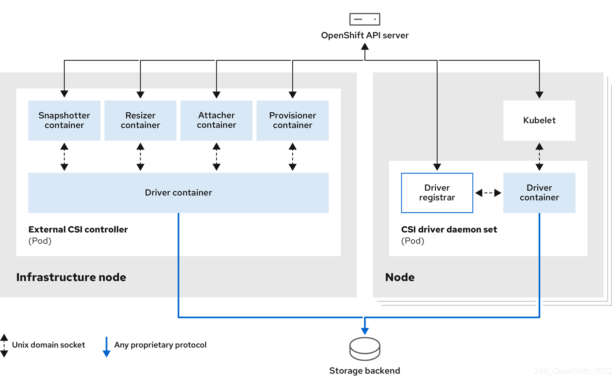

# Configuring CSI volumes { #persistent-storage-csi }

Container Storage Interface (CSI) is a standard specification enabling storage vendors to develop plugins that work across container orchestration systems. OpenShift Container Platform uses CSI drivers to provision and manage persistent storage, replacing in-tree storage plugins.

## CSI architecture { #persistent-storage-csi-architecture_persistent-storage-csi }

Container Storage Interface (CSI) architecture uses containerized drivers and bridge components for communication between OpenShift Container Platform and storage backends. Each driver requires controller deployments and daemon sets for volume operations. Multiple drivers can run simultaneously.

The Container Storage Interface (CSI) allows OpenShift Container Platform to consume storage from storage back ends that implement the CSI interface as persistent storage.

!!! note

    OpenShift Container Platform 4.22 supports version 1.6.0 of the CSI specification.

For more information about the CSI spec, see "CSI spec".

CSI drivers are typically shipped as container images. These containers are not aware of OpenShift Container Platform where they run. To use CSI-compatible storage back end in OpenShift Container Platform, the cluster administrator must deploy several components that serve as a bridge between OpenShift Container Platform and the storage driver.

The following diagram provides a high-level overview about the components running in pods in the OpenShift Container Platform cluster.



It is possible to run multiple CSI drivers for different storage back ends. Each driver needs its own external controllers deployment and daemon set with the driver and CSI registrar.

**Additional resources**

- [CSI spec](https://github.com/container-storage-interface/spec)

### External CSI controllers { #external-csi-contollers_persistent-storage-csi }

External Container Storage Interface (CSI) controllers run as deployments with containers handling volume provisioning, deletion, attachment, snapshotting, and resizing. Controller pods communicate with CSI drivers using UNIX Domain Sockets and run on infrastructure nodes to protect credentials.

External CSI controllers is a deployment that deploys one or more pods with five containers:

- The snapshotter container watches `VolumeSnapshot` and `VolumeSnapshotContent` objects and is responsible for the creation and deletion of `VolumeSnapshotContent` object.
- The resizer container is a sidecar container that watches for `PersistentVolumeClaim` updates and triggers `ControllerExpandVolume` operations against a CSI endpoint if you request more storage on `PersistentVolumeClaim` object.
- An external CSI attacher container translates `attach` and `detach` calls from OpenShift Container Platform to respective `ControllerPublish` and `ControllerUnpublish` calls to the CSI driver.
- An external CSI provisioner container that translates `provision` and `delete` calls from OpenShift Container Platform to respective `CreateVolume` and `DeleteVolume` calls to the CSI driver.
- A CSI driver container.

The CSI attacher and CSI provisioner containers communicate with the CSI driver container using UNIX Domain Sockets, ensuring that no CSI communication leaves the pod. The CSI driver is not accessible from outside of the pod.

!!! note

    The `attach`, `detach`, `provision`, and `delete` operations typically require the CSI driver to use credentials to the storage backend. Run the CSI controller pods on infrastructure nodes so the credentials are never leaked to user processes, even in case of a catastrophic security breach on a compute node.

!!! note

    The external attacher must also run for CSI drivers that do not support third-party `attach` or `detach` operations. The external attacher does not issue any `ControllerPublish` or `ControllerUnpublish` operations to the CSI driver. However, it still must run to implement the necessary OpenShift Container Platform attachment API.

### CSI driver daemon set { #csi-driver-daemonset_persistent-storage-csi }

CSI driver daemon sets run on every node to enable volume mounting and operations. Each pod contains a driver and registrar communicating with node services using UNIX Domain Sockets. The node driver uses minimal credentials and implements node-specific CSI operations like publish and stage.

The CSI driver daemon set runs a pod on every node that allows OpenShift Container Platform to mount storage provided by the CSI driver to the node and use it in user workloads (pods) as persistent volumes (PVs). The pod with the CSI driver installed contains the following containers:

CSI driver registrar
:   The CSI driver registrar registers the CSI driver into the `openshift-node` service running on the node. The `openshift-node` process running on the node then directly connects with the CSI driver using the UNIX Domain Socket available on the node.

CSI driver
:   The CSI driver deployed on the node should have as few credentials to the storage back end as possible. OpenShift Container Platform will only use the node plugin set of CSI calls such as `NodePublish`/`NodeUnpublish` and `NodeStage`/`NodeUnstage`, if these calls are implemented.

## CSI drivers supported by OpenShift Container Platform { #persistent-storage-csi-drivers-supported_persistent-storage-csi }

OpenShift Container Platform installs several CSI drivers by default, automatically deploying the driver Operator, driver, and storage class for supported backends. Default drivers provide enhanced features beyond in-tree plugins. Some drivers, such as AWS EFS and GCP Filestore, require manual installation.

To create CSI-provisioned persistent volumes that mount to these supported storage assets, OpenShift Container Platform installs the necessary CSI driver Operator, the CSI driver, and the required storage class by default. For more details about the default namespace of the Operator and driver, see the documentation for the specific CSI Driver Operator.

!!! warning

    The AWS EFS CSI driver is not installed by default, and must be installed manually. For instructions about installing the AWS EFS CSI driver, see "Setting up the AWS Elastic File Service CSI Driver Operator".

The following table describes the CSI drivers that are installed with OpenShift Container Platform, supported by OpenShift Container Platform, and which CSI features they support, such as volume snapshots and resize.

!!! warning

    If your CSI driver is not listed in the following table, you must follow the installation instructions provided by your CSI storage vendor to use their supported CSI features.

For a list of third-party-certified CSI drivers, see the "Red Hat ecosystem portal".

**Supported CSI drivers and features in OpenShift Container Platform**

<table>
<thead>
<tr>
  <th>CSI driver</th>
  <th>CSI volume snapshots</th>
  <th>CSI volume group snapshots <sup>[1]</sup></th>
  <th>CSI cloning</th>
  <th>CSI resize</th>
  <th>Inline ephemeral volumes</th>
  <th>User namespaces</th>
</tr>
</thead>
<tbody>
<tr>
  <td>AWS EBS</td>
  <td>✅</td>
  <td></td>
  <td></td>
  <td>✅</td>
  <td></td>
  <td>✅</td>
</tr>
<tr>
  <td>AWS EFS</td>
  <td></td>
  <td></td>
  <td></td>
  <td></td>
  <td></td>
  <td></td>
</tr>
<tr>
  <td>Google Compute Platform (GCP) persistent disk (PD)</td>
  <td>✅</td>
  <td></td>
  <td>✅<sup>[2]</sup></td>
  <td>✅</td>
  <td></td>
  <td>✅</td>
</tr>
<tr>
  <td>GCP Filestore</td>
  <td>✅</td>
  <td></td>
  <td></td>
  <td>✅</td>
  <td></td>
  <td></td>
</tr>
<tr>
  <td>IBM Power(R) Virtual Server Block</td>
  <td></td>
  <td></td>
  <td></td>
  <td>✅</td>
  <td></td>
  <td>✅</td>
</tr>
<tr>
  <td>IBM Cloud(R) Block</td>
  <td>✅<sup>[3]</sup></td>
  <td></td>
  <td></td>
  <td>✅<sup>[3]</sup></td>
  <td></td>
  <td>✅</td>
</tr>
<tr>
  <td>LVM Storage</td>
  <td>✅</td>
  <td></td>
  <td>✅</td>
  <td>✅</td>
  <td></td>
  <td>✅</td>
</tr>
<tr>
  <td>Microsoft Azure Disk</td>
  <td>✅</td>
  <td></td>
  <td>✅</td>
  <td>✅</td>
  <td></td>
  <td>✅</td>
</tr>
<tr>
  <td>Microsoft Azure Stack Hub</td>
  <td>✅</td>
  <td></td>
  <td>✅</td>
  <td>✅</td>
  <td></td>
  <td>✅</td>
</tr>
<tr>
  <td>Microsoft Azure File</td>
  <td>✅</td>
  <td></td>
  <td>✅</td>
  <td>✅</td>
  <td>✅</td>
  <td></td>
</tr>
<tr>
  <td>OpenStack Cinder</td>
  <td>✅</td>
  <td></td>
  <td>✅</td>
  <td>✅</td>
  <td></td>
  <td>✅</td>
</tr>
<tr>
  <td>OpenShift Data Foundation</td>
  <td>✅</td>
  <td>✅</td>
  <td>✅</td>
  <td>✅</td>
  <td></td>
  <td>✅ <sup>[4]</sup></td>
</tr>
<tr>
  <td>OpenStack Manila</td>
  <td>✅</td>
  <td></td>
  <td></td>
  <td>✅</td>
  <td></td>
  <td></td>
</tr>
<tr>
  <td>CIFS/SMB</td>
  <td></td>
  <td></td>
  <td>✅</td>
  <td></td>
  <td></td>
  <td></td>
</tr>
<tr>
  <td>VMware vSphere</td>
  <td>✅<sup>[5]</sup></td>
  <td></td>
  <td></td>
  <td>✅<sup>[6]</sup></td>
  <td></td>
  <td>✅<sup>[7]</sup></td>
</tr>
</tbody>
</table>
1.


!!! warning

    CSI volume group snapshots is a Technology Preview feature only. Technology Preview features are not supported with Red Hat production service level agreements (SLAs) and might not be functionally complete. Red Hat does not recommend using them in production. These features provide early access to upcoming product features, enabling customers to test functionality and provide feedback during the development process.

    For more information about the support scope of Red Hat Technology Preview features, see [Technology Preview Features Support Scope](https://access.redhat.com/support/offerings/techpreview/).

2. 

<!-- -->

- Cloning is not supported on hyperdisk-balanced disks with storage pools.

<!-- -->

3. 

<!-- -->

- Does not support offline snapshots or resize. Volume must be attached to a running pod.

<!-- -->

4. 

<!-- -->

- RBD supports user namespaces; CephFS does not.

<!-- -->

5. 

<!-- -->

- Requires VMware vSphere version 8.0 Update 1 or later, or VMware vSphere Foundation (VVF) 9, or VMware Cloud Foundation (VCF) 9, for both vCenter Server and ESXi.
- Does not support fileshare volumes.

<!-- -->

6. 

<!-- -->

- Online expansion is supported from VMware vSphere version 8.0 Update 1 and later, or VVF 9, or VCF 9.

<!-- -->

7. 

<!-- -->

- File persistent volumes (PVs), such as vSAN file service, do not support user namespaces.

**Additional resources**

- [Setting up the AWS EFS CSI Driver Operator](persistent-storage-csi-aws-efs.md#persistent-storage-efs-csi-driver-operator-setup_persistent-storage-csi-aws-efs)
- [Red Hat ecosystem portal](https://catalog.redhat.com/)
- [Third-party support policy](https://access.redhat.com/articles/third-party-software-support)

## Dynamic provisioning { #csi-dynamic-provisioning_persistent-storage-csi }

Dynamic provisioning creates persistent volumes on-demand from storage class configurations. Container Storage Interface (CSI) drivers support specific parameters determining behavior. Create a default storage class to enable provisioning for claims without a specified class.

Dynamic provisioning of persistent storage depends on the capabilities of the CSI driver and underlying storage back end. The provider of the CSI driver should document how to create a storage class in OpenShift Container Platform and the parameters available for configuration.

The created storage class can be configured to enable dynamic provisioning.

**Procedure**

- Create a default storage class that ensures all PVCs that do not require any special storage class are provisioned by the installed CSI driver.

    ```shell
    # oc create -f - << EOF
    apiVersion: storage.k8s.io/v1
    kind: StorageClass
    metadata:
      name: <storage-class>
      annotations:
        storageclass.kubernetes.io/is-default-class: "true"
    provisioner: <provisioner-name>
    parameters:
      csi.storage.k8s.io/fstype: xfs
    EOF
    ```

- `metadata.name`: Specifies the name of the storage class that will be created.

- `provisioner`: Specifies the name of the CSI driver that has been installed.

- `parameters.csi.storage.k8s.io/fstype`: The vSphere CSI driver supports all of the file systems supported by the underlying Red Hat Core operating system release, including XFS and Ext4.

## Example using the CSI driver { #csi-example-usage_persistent-storage-csi }

Deploy a MySQL application using Container Storage Interface (CSI) persistent storage to demonstrate dynamic volume provisioning. This example shows CSI drivers automatically creating and binding persistent volume claims to dynamically provisioned volumes without manual intervention.

**Prerequisites**

- The CSI driver has been deployed.
- A storage class has been created for dynamic provisioning.

**Procedure**

- Create the MySQL template:

    ```terminal
    # oc new-app mysql-persistent
    ```

    ```terminal title="Example output"
    --> Deploying template "openshift/mysql-persistent" to project default
    ...
    ```

    ```terminal
    # oc get pvc
    ```

    ```terminal title="Example output"
    NAME           STATUS         VOLUME                                   CAPACITY ACCESS MODES   STORAGECLASS   AGE
    mysql          Bound          kubernetes-dynamic-pv-3271ffcb4e1811e8   1Gi      RWO            gp3-csi        3s
    ```
