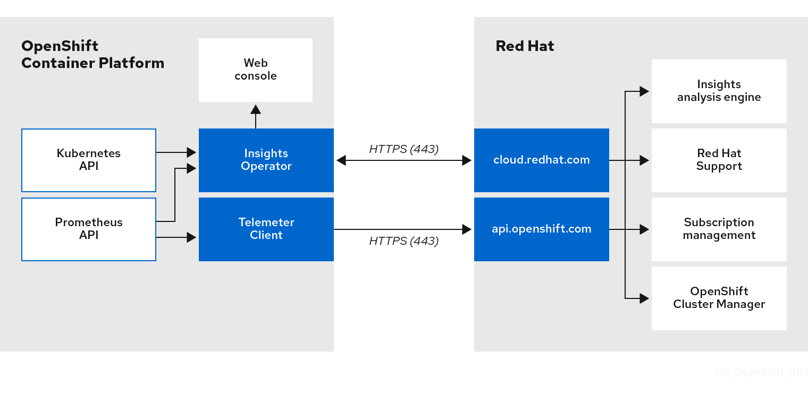

# About remote health monitoring { #about-remote-health-monitoring }

OpenShift Container Platform collects telemetry and configuration data about your cluster and reports it to Red Hat by using the Telemeter Client and the Insights Operator. The data that is provided to Red Hat enables the benefits outlined in this document.

A cluster that reports data to Red Hat through Telemetry and the Insights Operator is considered a *connected cluster*.

Telemetry is the term that Red Hat uses to describe the information being sent to Red Hat by the OpenShift Container Platform Telemeter Client. Lightweight attributes are sent from connected clusters to Red Hat to enable subscription management automation, monitor the health of clusters, assist with support, and improve customer experience.

The Insights Operator gathers OpenShift Container Platform configuration data and sends it to Red Hat. The data is used to produce insights about potential issues that a cluster might be exposed to. These insights are communicated to cluster administrators on [OpenShift Cluster Manager](https://console.redhat.com/openshift).

More information is provided in this document about these two processes.

## Telemetry and Insights Operator benefits { #telemetry-insights-operator-benefits_about-remote-health-monitoring }

Telemetry and the Insights Operator enable certain benefits to end users such as accelerated issue resolution, streamlined customer support, optimized software releases, and prioritized new features.

These benefits are listed as follows:

- **Enhanced identification and resolution of issues**. Events that might seem normal to an end-user can be observed by Red Hat from a broader perspective across a fleet of clusters. Some issues can be more rapidly identified from this point of view and resolved without an end-user needing to open a support case or file a Jira issue.
- **Advanced release management**. OpenShift Container Platform offers the `candidate`, `fast`, and `stable` release channels, which enable you to choose an update strategy. The graduation of a release from `fast` to `stable` is dependent on the success rate of updates and on the events seen during upgrades. With the information provided by connected clusters, Red Hat can improve the quality of releases to `stable` channels and react more rapidly to issues found in the `fast` channels.
- **Targeted prioritization of new features and functionality**. The data collected provides insights about which areas of OpenShift Container Platform are used most. With this information, Red Hat can focus on developing the new features and functionality that have the greatest impact for our customers.
- **A streamlined support experience**. You can provide a cluster ID for a connected cluster when creating a support ticket on the Red Hat Customer Portal. This enables Red Hat to deliver a streamlined support experience that is specific to your cluster, by using the connected information. This document provides more information about that enhanced support experience.
- **Predictive analytics**. The insights displayed for your cluster on [OpenShift Cluster Manager](https://console.redhat.com/openshift) are enabled by the information collected from connected clusters. Red Hat is investing in applying deep learning, machine learning, and artificial intelligence automation to help identify issues that OpenShift Container Platform clusters are exposed to.

**Additional resources**

- [Red Hat Customer Portal](https://access.redhat.com/support/)

## About Telemetry { #telemetry-about-telemetry_about-remote-health-monitoring }

Telemetry sends a carefully chosen subset of the cluster monitoring metrics to Red Hat. The Telemeter Client fetches the metrics values every four minutes and thirty seconds and uploads the data to Red Hat. These metrics are described in this document.

This stream of data is used by Red Hat to monitor the clusters in real-time and to react as necessary to problems that impact our customers. Red Hat can use the streamed data to roll out OpenShift Container Platform upgrades to customers to minimize service impact and continuously improve the upgrade experience.

This debugging information is available to Red Hat Support and Engineering teams with the same restrictions as accessing data reported through support cases. All connected cluster information is used by Red Hat to help make OpenShift Container Platform better and more intuitive to use.

**Additional resources**

- [OpenShift Container Platform update documentation](../../updating/updating_a_cluster/updating-cluster-web-console.md#updating-cluster-web-console)

### Information collected by Telemetry { #what-information-is-collected_about-remote-health-monitoring }

Telemetry collects specific information, such as system, sizing, and usage information.

System information
:   - Version information, including the OpenShift Container Platform cluster version and installed update details that are used to determine update version availability
    - Update information, including the number of updates available per cluster, the channel and image repository used for an update, update progress information, and the number of errors that occur in an update
    - The unique random identifier that is generated during an installation
    - Configuration details that help Red Hat Support to provide beneficial support for customers, including node configuration at the cloud infrastructure level, hostnames, IP addresses, Kubernetes pod names, namespaces, and services
    - The OpenShift Container Platform framework components installed in a cluster and their condition and status
    - Events for all namespaces listed as "related objects" for a degraded Operator
    - Information about degraded software
    - Information about the validity of certificates
    - The name of the provider platform that OpenShift Container Platform is deployed on and the data center location

Sizing Information
:   - Sizing information about clusters, machine types, and machines, including the number of CPU cores and the amount of RAM used for each
    - The number of etcd members and the number of objects stored in the etcd cluster
    - Number of application builds by build strategy type

Usage information
:   - Usage information about components, features, and extensions
    - Usage details about Technology Previews and unsupported configurations

    Telemetry does not collect identifying information such as usernames or passwords. Red Hat does not intend to collect personal information. If Red Hat discovers that personal information has been inadvertently received, Red Hat will delete such information. To the extent that any telemetry data constitutes personal data, please refer to the [Red Hat Privacy Statement](https://www.redhat.com/en/about/privacy-policy) for more information about Red Hat’s privacy practices.

**Additional resources**

- [Showing data collected by Telemetry](showing-data-collected-by-remote-health-monitoring.md#showing-data-collected-from-the-cluster_showing-data-collected-by-remote-health-monitoring)
- [Upstream cluster-monitoring-operator source code](https://github.com/openshift/cluster-monitoring-operator/blob/master/manifests/0000_50_cluster-monitoring-operator_04-config.yaml)
- [Remote health reporting](remote-health-reporting.md#remote-health-reporting)

## About the Insights Operator { #insights-operator-about_about-remote-health-monitoring }

The Insights Operator periodically gathers configuration and component failure status and, by default, reports that data every two hours to Red Hat. This information enables Red Hat to assess configuration and deeper failure data than is reported through Telemetry.

Users of OpenShift Container Platform can display the report of each cluster in the [Advisor](https://console.redhat.com/openshift/insights/advisor/) service on Red Hat Hybrid Cloud Console. If any issues have been identified, Red Hat Lightspeed provides further details and, if available, steps on how to solve a problem.

The Insights Operator does not collect identifying information, such as user names, passwords, or certificates. For information about Red Hat Lightspeed data collection and controls, see Red Hat Lightspeed Data &amp; Application Security.

Red Hat uses all connected cluster information to:

- Identify potential cluster issues and provide a solution and preventive actions in the [Advisor](https://console.redhat.com/openshift/insights/advisor/) service on Red Hat Hybrid Cloud Console
- Improve OpenShift Container Platform by providing aggregated and critical information to product and support teams
- Make OpenShift Container Platform more intuitive

**Additional resources**

- [Red Hat Lightspeed Data &amp; Application Security](https://console.redhat.com/security/insights)
- [Remote health reporting](remote-health-reporting.md#remote-health-reporting)

### Information collected by the Insights Operator { #insights-operator-what-information-is-collected_about-remote-health-monitoring }

The Insights Operator collects specific information.

The type of information is listed as follows:

- General information about your cluster and its components to identify issues that are specific to your OpenShift Container Platform version and environment.
- Configuration files, such as the image registry configuration, of your cluster to determine incorrect settings and issues that are specific to parameters you set.
- Errors that occur in the cluster components.
- Progress information of running updates, and the status of any component upgrades.
- Details of the platform that OpenShift Container Platform is deployed on and the region that the cluster is located in
- Cluster workload information transformed into discreet Secure Hash Algorithm (SHA) values, which allows Red Hat to assess workloads for security and version vulnerabilities without disclosing sensitive details.
- Workload information about the operating system and runtime environment, including runtime kinds, names, and version. This data gives Red Hat a better understanding of how you use OpenShift Container Platform containers so that we can proactively help you make investment decisions to drive optimal utilization.
- If an Operator reports an issue, information is collected about core OpenShift Container Platform pods in the `openshift-&#42;` and `kube-&#42;` projects. This includes state, resource, security context, volume information, and more.

**Additional resources**

- [Showing data collected by the Insights Operator](showing-data-collected-by-remote-health-monitoring.md#insights-operator-showing-data-collected-from-the-cluster_showing-data-collected-by-remote-health-monitoring)
- [What data is being collected by the Insights Operator in OpenShift? (Knowledgebase article)](https://access.redhat.com/solutions/7066188)
- [Enabling features using feature gates](../../nodes/clusters/nodes-cluster-enabling-features.md#nodes-cluster-enabling-features)
- [Insights Operator upstream project (GitHub)](https://github.com/openshift/insights-operator/blob/master/docs/gathered-data.md)

## Understanding Telemetry and Insights Operator data flow { #understanding-telemetry-and-insights-operator-data-flow_about-remote-health-monitoring }

The Telemeter Client collects selected time series data from the Prometheus API. The time series data is uploaded to api.openshift.com every four minutes and thirty seconds for processing.

The Insights Operator gathers selected data from the Kubernetes API and the Prometheus API into an archive. The archive is uploaded to [OpenShift Cluster Manager](https://console.redhat.com/openshift) every two hours for processing. The Insights Operator also downloads the latest Red Hat Lightspeed analysis from [OpenShift Cluster Manager](https://console.redhat.com/openshift). This is used to populate the **Red Hat Lightspeed status** pop-up that is included in the **Overview** page in the OpenShift Container Platform web console.

All of the communication with Red Hat occurs over encrypted channels by using Transport Layer Security (TLS) and mutual certificate authentication. All of the data is encrypted in transit and at rest.

Access to the systems that handle customer data is controlled through multi-factor authentication and strict authorization controls. Access is granted on a need-to-know basis and is limited to required operations.

Telemetry and Insights Operator data flow
:   

**Additional resources**

- [About OpenShift Container Platform monitoring](https://docs.redhat.com/en/documentation/monitoring_stack_for_red_hat_openshift/latest/html/about_monitoring/about-ocp-monitoring)
- [Configuring your firewall](../../installing/install_config/configuring-firewall.md#configuring-firewall)

## Additional details about how remote health monitoring data is used { #additional-details-about-how-remote-health-monitoring-data-is-used_about-remote-health-monitoring }

Red Hat collects data about your use of the Red Hat Product(s) for specific purposes.

For more information about date collected to enable remote health monitoring, see "Information collected by Telemetry" and "Information collected by the Insights Operator".

Red Hat collects data about your use of the Red Hat Product(s) for purposes such as providing support and upgrades, optimizing performance or configuration, minimizing service impacts, identifying and remediating threats, troubleshooting, improving the offerings and user experience, responding to issues, and for billing purposes if applicable.

Collection safeguards
:   Red Hat employs technical and organizational measures designed to protect the telemetry and configuration data.

Sharing
:   Red Hat might share the data collected through Telemetry and the Insights Operator internally within Red Hat to improve your user experience. Red Hat might share telemetry and configuration data with its business partners in an aggregated form that does not identify customers to help the partners better understand their markets and their customers' use of Red Hat offerings or to ensure the successful integration of products jointly supported by those partners.

Third parties
:   Red Hat may engage certain third parties to assist in the collection, analysis, and storage of the Telemetry and configuration data.

User control / enabling and disabling telemetry and configuration data collection
:   You can disable OpenShift Container Platform Telemetry and the Insights Operator by following the instructions "Remote health reporting".

**Additional resources**

- [Information collected by Telemetry](about-remote-health-monitoring.md#what-information-is-collected_about-remote-health-monitoring)
- [Information collected by the Insights Operator](about-remote-health-monitoring.md#insights-operator-what-information-is-collected_about-remote-health-monitoring)
- [Remote health reporting](remote-health-reporting.md#remote-health-reporting)
