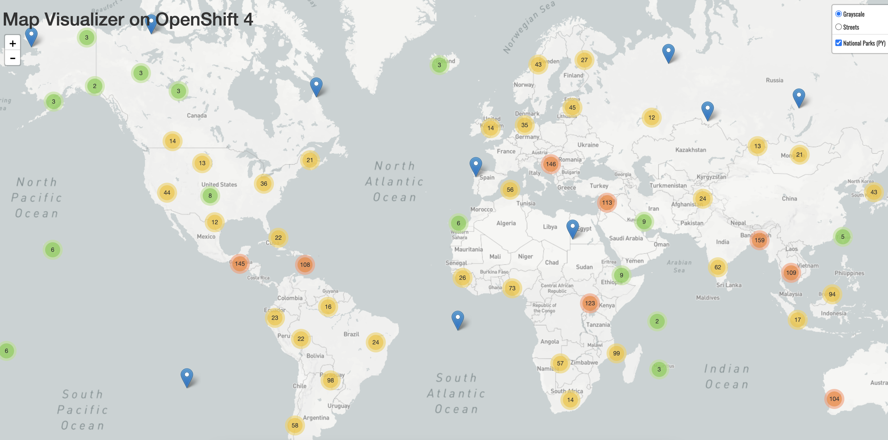

# Tutorial: Deploying an application by using the CLI { #dev-app-cli }

To learn how to stand up an application on OpenShift Container Platform by using the OpenShift CLI (`oc`), follow the provided tutorial. In this tutorial, you will deploy the services that are required for an application that displays a map of national parks across the world.

To complete this tutorial, you will perform the following steps:

1. [Create a project for the application](dev-app-cli.md#getting-started-cli-creating-new-project_dev-app-cli).

    This step allows your application to be isolated from other cluster user’s workloads.

2. [Grant view permissions](dev-app-cli.md#getting-started-cli-granting-permissions_dev-app-cli).

    This step grants `view` permissions to interact with the OpenShift API to help discover services and other resources running within the project.

3. [Deploy the front-end application](dev-app-cli.md#getting-started-cli-deploying-first-image_dev-app-cli).

    This step deploys the `parksmap` front-end application, exposes it externally, and scales it up to two instances.

4. [Deploy the back-end application](dev-app-cli.md#getting-started-cli-deploying-python-app_dev-app-cli).

    This step deploys the `nationalparks` back-end application and exposes it externally.

5. [Deploy the database application](dev-app-cli.md#getting-started-cli-connecting-database_dev-app-cli).

    This step deploys the `mongodb-nationalparks` MongoDB database, loads data into the database, and sets up the necessary credentials to access the database.

After you complete these steps, you can [view the national parks application in a web browser](dev-app-cli.md#getting-started-cli-view_dev-app-cli).

## Prerequisites { #prerequisites_dev-app-cli }

Before you start this tutorial, ensure that you have the following required prerequisites:

- You have installed the [OpenShift CLI (`oc`)](../cli_reference/openshift_cli/getting-started-cli.md#installing-openshift-cli).

- You have access to a test OpenShift Container Platform cluster.

    If your organization does not have a cluster to test on, you can request access to the [Developer Sandbox](https://developers.redhat.com/developer-sandbox) to get a trial of OpenShift Container Platform.

- You have the appropriate permissions, such as the `cluster-admin` [cluster role](../authentication/using-rbac.md#viewing-cluster-roles_using-rbac), to create a project and applications within it.

    If you do not have the required permissions, contact your cluster administrator. You need the `self-provisioner` role to create a project and the `admin` role on the project to modify resources in that project.

    If you are using Developer Sandbox, a project is created for you with the required permissions.

- You have [logged in to your cluster by using the OpenShift CLI (`oc`)](../cli_reference/openshift_cli/getting-started-cli.md#cli-logging-in_cli-developer-commands).

## Creating a project { #getting-started-cli-creating-new-project_dev-app-cli }

Create a new project to contain all required resources and application components for the tutorial.

A *project* enables a community of users to organize and manage their content in isolation. Projects are OpenShift Container Platform extensions to Kubernetes namespaces. Projects have additional features that enable user self-provisioning. Each project has its own set of objects, policies, constraints, and service accounts.

Cluster administrators can allow developers to create their own projects. In most cases, you automatically have access to your own projects. Administrators can grant access to other projects as needed.

This procedure creates a new project called `user-getting-started`. You will use this project throughout the rest of this tutorial.

!!! warning

    If you are using Developer Sandbox to complete this tutorial, skip this procedure. A project has already been created for you.

**Prerequisites**

- You have logged in to the OpenShift CLI (`oc`).

**Procedure**

- Create a project by running the following command:

    ```terminal
    $ oc new-project user-getting-started
    ```

    ```terminal title="Example output"
    Now using project "user-getting-started" on server "https://openshift.example.com:6443".
    ...
    ```

**Additional resources**

- [oc new-project](../cli_reference/openshift_cli/developer-cli-commands.md#oc-new-project)

## Granting view permissions { #getting-started-cli-granting-permissions_dev-app-cli }

Configure the necessary permissions for the application to access the required cluster resources.

OpenShift Container Platform automatically creates several service accounts in every project. The `default` service account takes responsibility for running the pods. OpenShift Container Platform uses and injects this service account into every pod that launches.

By default, the `default` service account has limited permissions to interact with the OpenShift API.

As a requirement of the application, you must assign the `view` role to the `default` service account to allow it to communicate with the OpenShift API to learn about pods, services, and resources within the project.

**Prerequisites**

- You have access to an OpenShift Container Platform cluster.
- You have installed the OpenShift CLI (`oc`).
- You have `cluster-admin` or project-level `admin` privileges.

**Procedure**

- Add the `view` role to the `default` service account in the `user-getting-started` project by running the following command:

    ```terminal
    $ oc adm policy add-role-to-user view -z default -n user-getting-started
    ```

    !!! warning

        If you are using a different project, replace `user-getting-started` with the name of your project.

**Additional resources**

- [RBAC overview](../authentication/using-rbac.md#authorization-overview_using-rbac)
- [oc adm policy add-role-to-user](../cli_reference/openshift_cli/administrator-cli-commands.md#oc-adm-policy-add-role-to-user)

## Deploying the front-end application { #getting-started-cli-deploying-first-image_dev-app-cli }

Deploy the front-end application that provides the external-facing web component for the tutorial.

The simplest way to deploy an application in OpenShift Container Platform is to run a provided container image.

The following procedure deploys `parksmap`, which is the front-end component of the `national-parks-app` application. The web application displays an interactive map of the locations of national parks across the world.

**Prerequisites**

- You have access to an OpenShift Container Platform cluster.
- You have installed the OpenShift CLI (`oc`).

**Procedure**

- Deploy the `parksmap` application by running the following command:

    ```terminal
    $ oc new-app quay.io/openshiftroadshow/parksmap:latest --name=parksmap -l 'app=national-parks-app,component=parksmap,role=frontend,app.kubernetes.io/part-of=national-parks-app'
    ```

    ```text title="Example output"
    --> Found container image 0c2f55f (4 years old) from quay.io for "quay.io/openshiftroadshow/parksmap:latest"

        * An image stream tag will be created as "parksmap:latest" that will track this image

    --> Creating resources with label app=national-parks-app,app.kubernetes.io/part-of=national-parks-app,component=parksmap,role=frontend ...
        imagestream.image.openshift.io "parksmap" created
        deployment.apps "parksmap" created
        service "parksmap" created
    --> Success
        Application is not exposed. You can expose services to the outside world by executing one or more of the commands below:
         'oc expose service/parksmap'
        Run 'oc status' to view your app.
    ```

**Additional resources**

- [oc new-app](../cli_reference/openshift_cli/developer-cli-commands.md#oc-new-app)

### Exposing the front-end service { #getting-started-cli-creating-route_dev-app-cli }

By default, services running on OpenShift Container Platform are not accessible externally. To expose your service so that external clients can access it, you can create a *route*.

A `Route` object is a OpenShift Container Platform networking resource similar to a Kubernetes `Ingress` object. The default OpenShift Container Platform router (HAProxy) uses the HTTP header of the incoming request to determine where to proxy the connection.

Optionally, you can define security, such as TLS, for the route.

**Prerequisites**

- You have deployed the `parksmap` front-end application.
- You have `cluster-admin` or project-level `admin` privileges.

**Procedure**

- Create a route to expose the `parksmap` front-end application by running the following command:

    ```terminal
    $ oc create route edge parksmap --service=parksmap
    ```

**Verification**

- Verify that the application route was successfully created by running the following command:

    ```terminal
    $ oc get route parksmap
    ```

    ```terminal title="Example output"
    NAME        HOST/PORT                                                   PATH   SERVICES   PORT       TERMINATION   WILDCARD
    parksmap    parksmap-user-getting-started.apps.cluster.example.com             parksmap   8080-tcp   edge          None
    ```

**Additional resources**

- [oc create route edge](../cli_reference/openshift_cli/developer-cli-commands.md#oc-create-route-edge)
- [oc get](../cli_reference/openshift_cli/developer-cli-commands.md#oc-get)

### Viewing pod details { #getting-started-cli-examining-pod_dev-app-cli }

Retrieve detailed pod information to confirm the running status and resource configuration of the applications in this tutorial.

OpenShift Container Platform uses the Kubernetes concept of a *pod*, which is one or more containers deployed together on one host, and the smallest compute unit that can be defined, deployed, and managed. Pods are the rough equivalent of a machine instance, physical or virtual, to a container.

You can view the pods in your cluster and to determine the health of those pods and the cluster as a whole.

**Prerequisites**

- You have deployed the `parksmap` front-end application.

**Procedure**

- List all pods in the current project by running the following command:

    ```terminal
    $ oc get pods
    ```

    ```terminal title="Example output"
    NAME                       READY   STATUS    RESTARTS   AGE
    parksmap-5f9579955-6sng8   1/1     Running   0          77s
    ```

- Show details for a pod by running the following command:

    ```terminal
    $ oc describe pod parksmap-5f9579955-6sng8
    ```

    ```terminal title="Example output"
    Name:             parksmap-5f9579955-6sng8
    Namespace:        user-getting-started
    Priority:         0
    Service Account:  default
    Node:             ci-ln-fr1rt92-72292-4fzf9-worker-a-g9g7c/10.0.128.4
    Start Time:       Wed, 26 Mar 2025 14:03:19 -0400
    Labels:           app=national-parks-app
                      app.kubernetes.io/part-of=national-parks-app
                      component=parksmap
                      deployment=parksmap
                      pod-template-hash=848bd4954b
                      role=frontend
    ...
    ```

- View logs for a pod by running the following command:

    ```terminal
    $ oc logs parksmap-5f9579955-6sng8
    ```

    ```terminal title="Example output"
    ...
    2025-03-26 18:03:24.774  INFO 1 --- [           main] o.s.m.s.b.SimpleBrokerMessageHandler     : Started.
    2025-03-26 18:03:24.798  INFO 1 --- [           main] s.b.c.e.t.TomcatEmbeddedServletContainer : Tomcat started on port(s): 8080 (http)
    2025-03-26 18:03:24.801  INFO 1 --- [           main] c.o.evg.roadshow.ParksMapApplication     : Started ParksMapApplication in 4.053 seconds (JVM running for 4.46)
    ```

**Additional resources**

- [oc describe](../cli_reference/openshift_cli/developer-cli-commands.md#oc-describe)
- [oc get](../cli_reference/openshift_cli/developer-cli-commands.md#oc-get)
- [Viewing pods](../cli_reference/openshift_cli/getting-started-cli.md#viewing-pods)
- [Viewing pod logs](../cli_reference/openshift_cli/getting-started-cli.md#viewing-pod-logs)

### Scaling up the deployment { #getting-started-cli-scaling-app_dev-app-cli }

Scale the application deployment up or down to meet workload demands.

In Kubernetes, a `Deployment` object defines how an application deploys. In most cases when you deploy an application, OpenShift Container Platform creates the `Pod`, `Service`, `ReplicaSet`, and `Deployment` resources for you.

When you deploy the `parksmap` image, a deployment resource is created. In this example, only one pod is deployed. You might want to scale up your application to keep up with user demand or to ensure that your application is always running even if one pod is down.

The following procedure scales the `parksmap` deployment to use two instances.

**Prerequisites**

- You have deployed the `parksmap` front-end application.

**Procedure**

- Scale your deployment from one pod instance to two pod instances by running the following command:

    ```terminal
    $ oc scale --replicas=2 deployment/parksmap
    ```

    ```text title="Example output"
    deployment.apps/parksmap scaled
    ```

**Verification**

- Verify that your deployment scaled up properly by running the following command:

    ```terminal
    $ oc get pods
    ```

    ```terminal title="Example output"
    NAME                       READY   STATUS    RESTARTS   AGE
    parksmap-5f9579955-6sng8   1/1     Running   0          7m39s
    parksmap-5f9579955-8tgft   1/1     Running   0          24s
    ```

    Verify that two `parksmap` pods are listed.

    !!! tip

        To scale your deployment back down to one pod instance, pass in `1` to the `--replicas` option:

        ```terminal
        $ oc scale --replicas=1 deployment/parksmap
        ```

**Additional resources**

- [oc scale](../cli_reference/openshift_cli/developer-cli-commands.md#oc-scale)

## Deploying the back-end application { #getting-started-cli-deploying-python-app_dev-app-cli }

Deploy the back-end application that provides the service that queries the database to return the national park data required for your application.

The following procedure deploys `nationalparks`, which is the back-end component for the `national-parks-app` application. The Python application performs 2D geo-spatial queries against a MongoDB database to locate and return map coordinates of all national parks in the world.

**Prerequisites**

- You have deployed the `parksmap` front-end application.

**Procedure**

- Create the `nationalparks` back-end application by running the following command:

    ```terminal
    $ oc new-app https://github.com/openshift-roadshow/nationalparks-py.git --name nationalparks -l 'app=national-parks-app,component=nationalparks,role=backend,app.kubernetes.io/part-of=national-parks-app,app.kubernetes.io/name=python' --allow-missing-images=true
    ```

    ```text title="Example output"
    --> Found image 9531750 (2 weeks old) in image stream "openshift/python" under tag "3.11-ubi8" for "python"

        Python 3.11
        -----------
    ...

    --> Creating resources with label app=national-parks-app,app.kubernetes.io/name=python,app.kubernetes.io/part-of=national-parks-app,component=nationalparks,role=backend ...
        imagestream.image.openshift.io "nationalparks" created
        buildconfig.build.openshift.io "nationalparks" created
        deployment.apps "nationalparks" created
        service "nationalparks" created
    --> Success
        Build scheduled, use 'oc logs -f buildconfig/nationalparks' to track its progress.
        Application is not exposed. You can expose services to the outside world by executing one or more of the commands below:
         'oc expose service/nationalparks'
        Run 'oc status' to view your app.
    ```

### Exposing the back-end service { #getting-started-cli-creating-route-backend_dev-app-cli }

To expose the back-end service so that it is accessible externally, create a route.

**Prerequisites**

- You have deployed the `nationalparks` back-end application.
- You have `cluster-admin` or project-level `admin` privileges.

**Procedure**

1. Create a route to expose the `nationalparks` back-end application by running the following command:

    ```terminal
    $ oc create route edge nationalparks --service=nationalparks
    ```

2. Label the `nationalparks` route by running the following command:

    ```terminal
    $ oc label route nationalparks type=parksmap-backend
    ```

    The application code expects the `nationalparks` route to be labeled with `type=parksmap-backend`.

**Additional resources**

- [oc label](../cli_reference/openshift_cli/developer-cli-commands.md#oc-label)

## Deploying the database application { #getting-started-cli-connecting-database_dev-app-cli }

Deploy a MongoDB database application to contain the information that your application requires. For this tutorial, you will deploy a database application called `mongodb-nationalparks` that holds the national park location information.

**Prerequisites**

- You have deployed the `parksmap` front-end application.
- You have deployed the `nationalparks` back-end application.

**Procedure**

- Deploy the `mongodb-nationalparks` database application by running the following command:

    ```terminal
    $ oc new-app registry.redhat.io/rhmap47/mongodb --name mongodb-nationalparks -e MONGODB_USER=mongodb -e MONGODB_PASSWORD=mongodb -e MONGODB_DATABASE=mongodb -e MONGODB_ADMIN_PASSWORD=mongodb -l 'app.kubernetes.io/part-of=national-parks-app,app.kubernetes.io/name=mongodb'
    ```

    ```text title="Example output"
    --> Found container image 7a61087 (12 days old) from quay.io for "quay.io/mongodb/mongodb-enterprise-server"

        * An image stream tag will be created as "mongodb-nationalparks:latest" that will track this image

    --> Creating resources with label app.kubernetes.io/name=mongodb,app.kubernetes.io/part-of=national-parks-app ...
        imagestream.image.openshift.io "mongodb-nationalparks" created
        deployment.apps "mongodb-nationalparks" created
        service "mongodb-nationalparks" created
    --> Success
        Application is not exposed. You can expose services to the outside world by executing one or more of the commands below:
         'oc expose service/mongodb-nationalparks'
        Run 'oc status' to view your app.
    ```

### Providing access to the database by creating a secret { #getting-started-cli-creating-secret_dev-app-cli }

Create a `Secret` resource to securely provide the back-end application with the sensitive database connection credentials.

The `nationalparks` application needs information, such as the database name, username, and passwords, to access the MongoDB database. However, because this information is sensitive, you should not store it directly in the pod.

You can use a *secret* to store sensitive information, and share that secret with workloads.

`Secret` objects provide a mechanism to hold sensitive information such as passwords, OpenShift Container Platform client configuration files, and private source repository credentials. Secrets decouple sensitive content from the pods. You can mount secrets into containers by using a volume plugin or by passing the secret in as an environment variable. The system can then use secrets to provide the pod with the sensitive information.

The following procedure creates the `nationalparks-mongodb-parameters` secret and mounts it to the `nationalparks` workload.

**Prerequisites**

- You have deployed the `nationalparks` back-end application.
- You have deployed the `mongodb-nationalparks` database application.

**Procedure**

1. Create the secret with the required database access information by running the following command:

    ```terminal
    $ oc create secret generic nationalparks-mongodb-parameters --from-literal=DATABASE_SERVICE_NAME=mongodb-nationalparks --from-literal=MONGODB_USER=mongodb --from-literal=MONGODB_PASSWORD=mongodb --from-literal=MONGODB_DATABASE=mongodb --from-literal=MONGODB_ADMIN_PASSWORD=mongodb
    ```

2. Import the environment from the secret to the `nationalparks` workload by running the following command:

    ```terminal
    $ oc set env --from=secret/nationalparks-mongodb-parameters deploy/nationalparks
    ```

3. Wait for the `nationalparks` deployment to roll out a new revision with this environment information. Check the status of the `nationalparks` deployment by running the following command:

    ```terminal
    $ oc rollout status deployment nationalparks
    ```

    ```terminal title="Example output"
    deployment "nationalparks" successfully rolled out
    ```

**Additional resources**

- [Understanding secrets](../nodes/pods/nodes-pods-secrets.md#nodes-pods-secrets-about_nodes-pods-secrets)
- [oc create secret generic](../cli_reference/openshift_cli/developer-cli-commands.md#oc-create-secret-generic)
- [oc set env](../cli_reference/openshift_cli/developer-cli-commands.md#oc-set-env)
- [oc rollout status](../cli_reference/openshift_cli/developer-cli-commands.md#oc-rollout-status)

### Loading data into the database { #getting-started-cli-load-data-output_dev-app-cli }

After you have deployed the `mongodb-nationalparks` database application, load the national park location information into the database.

**Prerequisites**

- You have deployed the `nationalparks` back-end application.
- You have deployed the `mongodb-nationalparks` database application.

**Procedure**

- Load the national parks data by running the following command:

    ```terminal
    $ oc exec $(oc get pods -l component=nationalparks | tail -n 1 | awk '{print $1;}') -- curl -s http://localhost:8080/ws/data/load
    ```

    ```text title="Example output"
    "Items inserted in database: 2893"
    ```

**Verification**

- Verify that the map data was loaded properly by running the following command:

    ```terminal
    $ oc exec $(oc get pods -l component=nationalparks | tail -n 1 | awk '{print $1;}') -- curl -s http://localhost:8080/ws/data/all
    ```

    ```terminal title="Example output (trimmed)"
    ...
    , {"id": "Great Zimbabwe", "latitude": "-20.2674635", "longitude": "30.9337986", "name": "Great Zimbabwe"}]
    ```

**Additional resources**

- [oc exec](../cli_reference/openshift_cli/developer-cli-commands.md#oc-exec)

## Viewing the application in a web browser { #getting-started-cli-view_dev-app-cli }

After you have deployed the necessary applications and loaded data into the database, you are now ready view your application through a browser. You can get the URL for the application by retrieving the route information for the front-end application.

**Prerequisites**

- You have deployed the `parksmap` front-end application.
- You have deployed the `nationalparks` back-end application.
- You have deployed the `mongodb-nationalparks` database application.
- You have loaded the data into the `mongodb-nationalparks` database.

**Procedure**

1. Get your route information to retrieve your map application URL by running the following command:

    ```terminal
    $ oc get route parksmap
    ```

    ```terminal title="Example output"
    NAME       HOST/PORT                                                  PATH   SERVICES    PORT       TERMINATION   WILDCARD
    parksmap   parksmap-user-getting-started.apps.cluster.example.com            parksmap    8080-tcp   edge          None
    ```

2. From the above output, copy the value in the `HOST/PORT` column.

3. Add `https://` in front of the copied value to get the application URL. This is necessary because the route is a secured route.

    ```text title="Example application URL"
    https://parksmap-user-getting-started.apps.cluster.example.com
    ```

4. Paste this application URL into your web browser. Your browser should display a map of the national parks across the world.

    **Figure 1. National parks across the world**

    

    If you allow the application to access your location, the map will center on your location.
