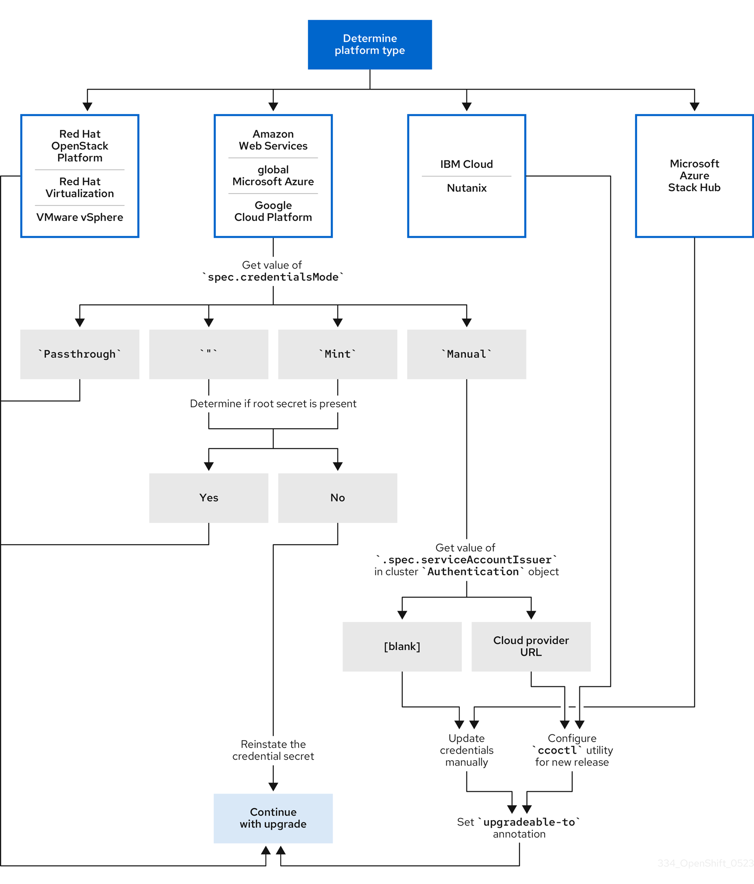

# Preparing to update a cluster with manually maintained credentials { #preparing-manual-creds-update }

Before you update a cluster that uses manually maintained credentials, accommodate any new or changed cloud provider credentials in the target release. This preparation ensures the Cloud Credential Operator (CCO) does not block the upgrade.

The CCO `Upgradeable` status for a cluster with manually maintained credentials is `False` by default.

- For minor releases, for example, from 4.12 to 4.13, this status prevents you from updating until you have addressed any updated permissions and annotated the `CloudCredential` resource to indicate that the permissions are updated as needed for the next version. This annotation changes the `Upgradeable` status to `True`.
- For z-stream releases, for example, from 4.13.0 to 4.13.1, no permissions are added or changed, so the update is not blocked.

## Update requirements for clusters with manually maintained credentials { #about-manually-maintained-credentials-upgrade_preparing-manual-creds-update }

Before you update a cluster that uses manually maintained credentials with the Cloud Credential Operator (CCO), you must update the cloud provider resources for the new release.

If the cloud credential management for your cluster was configured using the CCO utility (`ccoctl`), use the `ccoctl` utility to update the resources. Clusters that were configured to use manual mode without the `ccoctl` utility require manual updates for the resources.

After updating the cloud provider resources, you must update the `upgradeable-to` annotation for the cluster to indicate that it is ready to update.

!!! note

    The process to update the cloud provider resources and the `upgradeable-to` annotation can only be completed by using command-line tools.

### Cloud credential configuration options and update requirements by platform type { #cco-platform-options_preparing-manual-creds-update }

Some platforms only support using the CCO in one mode. For clusters that are installed on those platforms, the platform type determines the credentials update requirements.

For platforms that support using the CCO in multiple modes, you must determine which mode the cluster is configured to use and take the required actions for that configuration.

**Figure 1. Credentials update requirements by platform type**



Red Hat OpenStack Platform (RHOSP) and VMware vSphere
:   These platforms do not support using the CCO in manual mode. Clusters on these platforms handle changes in cloud provider resources automatically and do not require an update to the `upgradeable-to` annotation.

    Administrators of clusters on these platforms should skip the manually maintained credentials section of the update process.

IBM Cloud and Nutanix
:   Clusters installed on these platforms are configured using the `ccoctl` utility.

    Administrators of clusters on these platforms must take the following actions:

    1. Extract and prepare the `CredentialsRequest` custom resources (CRs) for the new release.
    2. Configure the `ccoctl` utility for the new release and use it to update the cloud provider resources.
    3. Indicate that the cluster is ready to update with the `upgradeable-to` annotation.

Microsoft Azure Stack Hub
:   These clusters use manual mode with long-term credentials and do not use the `ccoctl` utility.

    Administrators of clusters on these platforms must take the following actions:

    1. Extract and prepare the `CredentialsRequest` custom resources (CRs) for the new release.
    2. Manually update the cloud provider resources for the new release.
    3. Indicate that the cluster is ready to update with the `upgradeable-to` annotation.

Amazon Web Services (AWS), global Microsoft Azure, and Google Cloud
:   Clusters installed on these platforms support multiple CCO modes.

    The required update process depends on the mode that the cluster is configured to use. If you are not sure what mode the CCO is configured to use on your cluster, you can use the web console or the CLI to determine this information.

**Additional resources**

- [Determining the Cloud Credential Operator mode by using the web console](preparing-manual-creds-update.md#cco-determine-mode-gui_preparing-manual-creds-update)
- [Determining the Cloud Credential Operator mode by using the CLI](preparing-manual-creds-update.md#cco-determine-mode-cli_preparing-manual-creds-update)
- [Extracting and preparing credentials request resources](preparing-manual-creds-update.md#cco-ccoctl-upgrading-extracting_preparing-manual-creds-update)
- [About the Cloud Credential Operator](../../authentication/managing_cloud_provider_credentials/about-cloud-credential-operator.md#about-cloud-credential-operator)

### Determining the Cloud Credential Operator mode by using the web console { #cco-determine-mode-gui_preparing-manual-creds-update }

You can determine what mode the Cloud Credential Operator (CCO) is configured to use by using the web console.

Before you perform upgrades or troubleshoot, ensure you understand your cluster’s credential management configuration.

!!! note

    Only Amazon Web Services (AWS), global Microsoft Azure, and Google Cloud clusters support multiple CCO modes.

**Prerequisites**

- You have access to an OpenShift Container Platform account with cluster administrator permissions.

**Procedure**

1. Log in to the OpenShift Container Platform web console as a user with the `cluster-admin` role.

2. Navigate to **Administration** → **Cluster Settings**.

3. On the **Cluster Settings** page, select the **Configuration** tab.

4. Under **Configuration resource**, select **CloudCredential**.

5. On the **CloudCredential details** page, select the **YAML** tab.

6. In the YAML block, check the value of `spec.credentialsMode`. The following values are possible, though not all are supported on all platforms:

    - `''`: The CCO is operating in the default mode. In this configuration, the CCO operates in mint or passthrough mode, depending on the credentials provided during installation.
    - `Mint`: The CCO is operating in mint mode.
    - `Passthrough`: The CCO is operating in passthrough mode.
    - `Manual`: The CCO is operating in manual mode.

    !!! warning

        To determine the specific configuration of an AWS, Google Cloud, or global Microsoft Azure cluster that has a `spec.credentialsMode` of `''`, `Mint`, or `Manual`, you must investigate further.

        AWS and Google Cloud clusters support using mint mode with the root secret deleted. If the cluster is specifically configured to use mint mode or uses mint mode by default, you must determine if the root secret is present on the cluster before updating.

        An AWS, Google Cloud, or global Microsoft Azure cluster that uses manual mode might be configured to create and manage cloud credentials from outside of the cluster with AWS STS, Google Cloud Workload Identity, or Microsoft Entra Workload ID. You can determine whether your cluster uses this strategy by examining the cluster `Authentication` object.

7. AWS or Google Cloud clusters that use mint mode only: To determine whether the cluster is operating without the root secret, navigate to **Workloads** → **Secrets** and look for the root secret for your cloud provider.

    !!! note

        Ensure that the **Project** dropdown is set to **All Projects**.

    | Platform     | Secret name       |
    | ------------ | ----------------- |
    | AWS          | `aws-creds`       |
    | Google Cloud | `gcp-credentials` |

    - If you see one of these values, your cluster is using mint or passthrough mode with the root secret present.
    - If you do not see these values, your cluster is using the CCO in mint mode with the root secret removed.

8. AWS, Google Cloud, or global Microsoft Azure clusters that use manual mode only: To determine whether the cluster is configured to create and manage cloud credentials from outside of the cluster, you must check the cluster `Authentication` object YAML values.

    1. Navigate to **Administration** → **Cluster Settings**.

    2. On the **Cluster Settings** page, select the **Configuration** tab.

    3. Under **Configuration resource**, select **Authentication**.

    4. On the **Authentication details** page, select the **YAML** tab.

    5. In the YAML block, check the value of the `.spec.serviceAccountIssuer` parameter.

        - A value that contains a URL that is associated with your cloud provider indicates that the CCO is using manual mode with short-term credentials for components. These clusters are configured using the `ccoctl` utility to create and manage cloud credentials from outside of the cluster.
        - An empty value (`''`) indicates that the cluster is using the CCO in manual mode but was not configured using the `ccoctl` utility.

**Additional resources**

- [Extracting and preparing credentials request resources](preparing-manual-creds-update.md#cco-ccoctl-upgrading-extracting_preparing-manual-creds-update)

### Determining the Cloud Credential Operator mode by using the CLI { #cco-determine-mode-cli_preparing-manual-creds-update }

You can determine what mode the Cloud Credential Operator (CCO) is configured to use by using the CLI.

Before you perform upgrades or troubleshoot, ensure you understand your cluster’s credential management configuration.

!!! note

    Only Amazon Web Services (AWS), global Microsoft Azure, and Google Cloud clusters support multiple CCO modes.

**Prerequisites**

- You have access to an OpenShift Container Platform account with cluster administrator permissions.
- You have installed the OpenShift CLI (`oc`).

**Procedure**

1. Log in to `oc` on the cluster as a user with the `cluster-admin` role.

2. To determine the mode that the CCO is configured to use, enter the following command:

    ```terminal
    $ oc get cloudcredentials cluster \
      -o=jsonpath={.spec.credentialsMode}
    ```

    The following output values are possible, though not all are supported on all platforms:

    - `''`: The CCO is operating in the default mode. In this configuration, the CCO operates in mint or passthrough mode, depending on the credentials provided during installation.
    - `Mint`: The CCO is operating in mint mode.
    - `Passthrough`: The CCO is operating in passthrough mode.
    - `Manual`: The CCO is operating in manual mode.

    !!! warning

        To determine the specific configuration of an AWS, Google Cloud, or global Microsoft Azure cluster that has a `spec.credentialsMode` of `''`, `Mint`, or `Manual`, you must investigate further.

        AWS and Google Cloud clusters support using mint mode with the root secret deleted. If the cluster is specifically configured to use mint mode or uses mint mode by default, you must determine if the root secret is present on the cluster before updating.

        An AWS, Google Cloud, or global Microsoft Azure cluster that uses manual mode might be configured to create and manage cloud credentials from outside of the cluster with AWS STS, Google Cloud Workload Identity, or Microsoft Entra Workload ID. You can determine whether your cluster uses this strategy by examining the cluster `Authentication` object.

3. AWS or Google Cloud clusters that use mint mode only: To determine whether the cluster is operating without the root secret, run the following command:

    ```terminal
    $ oc get secret <secret_name> \
      -n=kube-system
    ```

    where `<secret_name>` is `aws-creds` for AWS or `gcp-credentials` for Google Cloud.

    If the root secret is present, the output of this command returns information about the secret. An error indicates that the root secret is not present on the cluster.

4. AWS, Google Cloud, or global Microsoft Azure clusters that use manual mode only: To determine whether the cluster is configured to create and manage cloud credentials from outside of the cluster, run the following command:

    ```terminal
    $ oc get authentication cluster \
      -o jsonpath \
      --template='{ .spec.serviceAccountIssuer }'
    ```

    This command displays the value of the `.spec.serviceAccountIssuer` parameter in the cluster `Authentication` object.

    - An output of a URL that is associated with your cloud provider indicates that the CCO is using manual mode with short-term credentials for components. These clusters are configured using the `ccoctl` utility to create and manage cloud credentials from outside of the cluster.
    - An empty output indicates that the cluster is using the CCO in manual mode but was not configured using the `ccoctl` utility.

### Determining the next steps in the update { #cco-determine-mode-next_preparing-manual-creds-update }

After you determine the Cloud Credential Operator mode, it is important to understand how to proceed with the update. 

**Procedure**

- If you are updating a cluster that has the CCO operating in mint or passthrough mode and the root secret is present, you do not need to update any cloud provider resources and can continue to the next part of the update process.

- If your cluster is using the CCO in mint mode with the root secret removed, you must reinstate the credential secret with the administrator-level credential before continuing to the next part of the update process.

- If your cluster was configured using the CCO utility (`ccoctl`), you must take the following actions:

    1. Extract and prepare the `CredentialsRequest` custom resources (CRs) for the new release.
    2. Configure the `ccoctl` utility for the new release and use it to update the cloud provider resources.
    3. Update the `upgradeable-to` annotation to indicate that the cluster is ready to update.

- If your cluster is using the CCO in manual mode but was not configured using the `ccoctl` utility, you must take the following actions:

    1. Extract and prepare the `CredentialsRequest` custom resources (CRs) for the new release.
    2. Manually update the cloud provider resources for the new release.
    3. Update the `upgradeable-to` annotation to indicate that the cluster is ready to update.

**Additional resources**

- [Extracting and preparing credentials request resources](preparing-manual-creds-update.md#cco-ccoctl-upgrading-extracting_preparing-manual-creds-update)

## Extracting and preparing credentials request resources { #cco-ccoctl-upgrading-extracting_preparing-manual-creds-update }

Before updating a cluster that uses the Cloud Credential Operator (CCO) in manual mode, you must extract and prepare the `CredentialsRequest` custom resources (CRs) for the new release.

**Prerequisites**

- Install the OpenShift CLI (`oc`) that matches the version for your updated version.
- Log in to the cluster as user with `cluster-admin` privileges.

**Procedure**

1. Obtain the pull spec for the update that you want to apply by running the following command:

    ```terminal
    $ oc adm upgrade
    ```

    The output of this command includes pull specs for the available updates similar to the following:

    ```text title="Partial example output"
    ...
    Recommended updates:

    VERSION IMAGE
    4.22.0  quay.io/openshift-release-dev/ocp-release@sha256:6a899c54dda6b844bb12a247e324a0f6cde367e880b73ba110c056df6d018032
    ...
    ```

2. Set a `$RELEASE_IMAGE` variable with the release image that you want to use by running the following command:

    ```terminal
    $ RELEASE_IMAGE=<update_pull_spec>
    ```

    where `<update_pull_spec>` is the pull spec for the release image that you want to use. For example:

    ```text
    quay.io/openshift-release-dev/ocp-release@sha256:6a899c54dda6b844bb12a247e324a0f6cde367e880b73ba110c056df6d018032
    ```

3. Extract the list of `CredentialsRequest` custom resources (CRs) from the OpenShift Container Platform release image by running the following command:

    ```terminal
    $ oc adm release extract \
      --from=$RELEASE_IMAGE \
      --credentials-requests \
      --included \
      --to=<path_to_directory_for_credentials_requests>
    ```

    where:

    `--included`
    :   Includes only the manifests that your specific cluster configuration requires for the target release.

`<path_to_directory_for_credentials_requests>`
:   Specifies the path to the directory where you want to store the `CredentialsRequest` objects. If the specified directory does not exist, this command creates it. This command creates a YAML file for each `CredentialsRequest` object.

1. For each `CredentialsRequest` CR in the release image, ensure that a namespace that matches the text in the `spec.secretRef.namespace` field exists in the cluster. This field is where the generated secrets that hold the credentials configuration are stored.

    ```yaml title="Sample AWS CredentialsRequest object"
    apiVersion: cloudcredential.openshift.io/v1
    kind: CredentialsRequest
    metadata:
      name: cloud-credential-operator-iam-ro
      namespace: openshift-cloud-credential-operator
    spec:
      providerSpec:
        apiVersion: cloudcredential.openshift.io/v1
        kind: AWSProviderSpec
        statementEntries:
        - effect: Allow
          action:
          - iam:GetUser
          - iam:GetUserPolicy
          - iam:ListAccessKeys
          resource: "*"
      secretRef:
        name: cloud-credential-operator-iam-ro-creds
        namespace: openshift-cloud-credential-operator
    ```

    where:

    `openshift-cloud-credential-operator`
    :   Indicates the namespace which must exist to hold the generated secret. The `CredentialsRequest` CRs for other platforms have a similar format with different platform-specific values.

2. For any `CredentialsRequest` CR for which the cluster does not already have a namespace with the name specified in `spec.secretRef.namespace`, create the namespace by running the following command:

    ```terminal
    $ oc create namespace <component_namespace>
    ```

**Next steps**

- If the cloud credential management for your cluster was configured using the CCO utility (`ccoctl`), configure the `ccoctl` utility for a cluster update and use it to update your cloud provider resources.
- If your cluster was not configured with the `ccoctl` utility, manually update your cloud provider resources.

**Additional resources**

- [Configuring the Cloud Credential Operator utility for a cluster update](preparing-manual-creds-update.md#cco-ccoctl-configuring_preparing-manual-creds-update)
- [Manually updating cloud provider resources](preparing-manual-creds-update.md#manually-maintained-credentials-upgrade_preparing-manual-creds-update)

## Configuring the Cloud Credential Operator utility for a cluster update { #_configuring_the_cloud_credential_operator_utility_for_a_cluster_update }

To upgrade a cluster that uses the Cloud Credential Operator (CCO) in manual mode to create and manage cloud credentials from outside of the cluster, extract and prepare the CCO utility (`ccoctl`) binary.

!!! note

    The `ccoctl` utility is a Linux binary that must run in a Linux environment.

**Prerequisites**

- You have access to an OpenShift Container Platform account with cluster administrator access.
- You have installed the OpenShift CLI (`oc`).
- Your cluster was configured using the `ccoctl` utility to create and manage cloud credentials from outside of the cluster.
- You have extracted the `CredentialsRequest` custom resources (CRs) from the OpenShift Container Platform release image and ensured that a namespace that matches the text in the `spec.secretRef.namespace` field exists in the cluster.

**Procedure**

1. Set a variable for the OpenShift Container Platform release image by running the following command:

    ```
    $ RELEASE_IMAGE=$(oc get clusterversion -o jsonpath={..desired.image})
    ```

2. Obtain the CCO container image from the OpenShift Container Platform release image by running the following command:

    ```terminal
    $ CCO_IMAGE=$(oc adm release info --image-for='cloud-credential-operator' $RELEASE_IMAGE -a ~/.pull-secret)
    ```

    !!! note

        Ensure that the architecture of the `$RELEASE_IMAGE` matches the architecture of the environment in which you will use the `ccoctl` tool.

3. Extract the `ccoctl` binary from the CCO container image within the OpenShift Container Platform release image by running the following command:

    ```terminal
    $ oc image extract $CCO_IMAGE \
      --file="/usr/bin/ccoctl.<rhel_version>" \
      -a ~/.pull-secret
    ```

    For `<rhel_version>`, specify the value that corresponds to the version of Red Hat Enterprise Linux (RHEL) that the host uses. If no value is specified, `ccoctl.rhel8` is used by default. The following values are valid:

    - `rhel8`: Specify this value for hosts that use RHEL 8.

    - `rhel9`: Specify this value for hosts that use RHEL 9.

        !!! note

            The `ccoctl` binary is created in the directory from where you executed the command and not in `/usr/bin/`. You must rename the directory or move the `ccoctl.<rhel_version>` binary to `ccoctl`.

4. Change the permissions to make `ccoctl` executable by running the following command:

    ```terminal
    $ chmod 775 ccoctl
    ```

**Verification**

- To verify that `ccoctl` is ready to use, display the help file. Use a relative file name when you run the command, for example:

    ```terminal
    $ ./ccoctl
    ```

    ```terminal title="Example output"
    OpenShift credentials provisioning tool

    Usage:
      ccoctl [command]

    Available Commands:
      aws          Manage credentials objects for AWS cloud
      azure        Manage credentials objects for Azure
      gcp          Manage credentials objects for Google cloud
      help         Help about any command
      ibmcloud     Manage credentials objects for IBM Cloud
      nutanix      Manage credentials objects for Nutanix

    Flags:
      -h, --help   help for ccoctl

    Use "ccoctl [command] --help" for more information about a command.
    ```

## Updating cloud provider resources with the Cloud Credential Operator utility { #cco-ccoctl-upgrading_preparing-manual-creds-update }

Update the cloud provider resources for your OpenShift Container Platform cluster by using the CCO utility (`ccoctl`). The process for upgrading these resources is similar to creating the resources during installation.

!!! note

    On AWS clusters, some `ccoctl` commands make AWS API calls to create or modify AWS resources. You can use the `--dry-run` flag to avoid making API calls. Using this flag creates JSON files on the local file system instead. You can review and modify the JSON files and then apply them with the AWS CLI tool using the `--cli-input-json` parameters.

**Prerequisites**

- You have extracted the `CredentialsRequest` custom resources (CRs) from the OpenShift Container Platform release image and ensured that a namespace that matches the text in the `spec.secretRef.namespace` field exists in the cluster.
- You have extracted and configured the `ccoctl` binary from the release image.

**Procedure**

1. Create the output directory if it does not already exist by running the following command:

    ```terminal
    $ mkdir -p <path_to_ccoctl_output_dir>
    ```

2. Extract the bound service account signing key from the cluster and save it to the output directory by running the following command:

    ```terminal
    $ oc get secret bound-service-account-signing-key \
      -n openshift-kube-apiserver \
      -ojsonpath='{ .data.service-account\.pub }' | base64 \
      -d > <path_to_ccoctl_output_dir>/serviceaccount-signer.public
    ```

3. Use the `ccoctl` tool to process all `CredentialsRequest` objects by running the command for your cloud provider. The following commands process `CredentialsRequest` objects:

    ```terminal title="Amazon Web Services (AWS)"
    $ ccoctl aws create-all \
      --name=<name> \
      --region=<aws_region> \
      --credentials-requests-dir=<path_to_credentials_requests_directory> \
      --output-dir=<path_to_ccoctl_output_dir> \
      --public-key-file= \
      <path_to_ccoctl_output_dir>/serviceaccount-signer.public \
      --create-private-s3-bucket \
      --permissions-boundary-arn=<policy_arn>
    ```

    where:

    `<name>`
    :   Specifies the name used to tag any cloud resources that are created for tracking.

    `<aws_region>`
    :   Specifies the AWS region in which cloud resources will be created.

    `<path_to_credentials_requests_directory>`
    :   Specifies the directory containing the files for the component `CredentialsRequest` objects.

    `<path_to_ccoctl_output_dir>`
    :   Specifies the path to the output directory. For `--public-key-file`, this directory contains the `serviceaccount-signer.public` file that you extracted from the cluster.

    `<policy_arn>`
    :   Optional: Specifies the Amazon Resource Name (ARN) of the AWS IAM policy to use as the permissions boundary for the IAM roles created by the `ccoctl` utility.

    !!! note

        By default, the `ccoctl` utility stores the OpenID Connect (OIDC) configuration files in a public S3 bucket and uses the S3 URL as the public OIDC endpoint. To store the OIDC configuration in a private S3 bucket that is accessed by the IAM identity provider through a public CloudFront distribution URL instead, use the `--create-private-s3-bucket` parameter. This is an optional parameter.

    !!! note

        To create the AWS resources individually, use the "Creating AWS resources individually" procedure in the "Installing a cluster on AWS with customizations" content. This option might be useful if you need to review the JSON files that the `ccoctl` tool creates before modifying AWS resources, or if the process the `ccoctl` tool uses to create AWS resources automatically does not meet the requirements of your organization.

    ```terminal title="Google Cloud"
    $ ccoctl gcp create-all \
      --name=<name> \
      --region=<gcp_region> \
      --project=<gcp_project_id> \
      --credentials-requests-dir=<path_to_credentials_requests_directory> \
      --output-dir=<path_to_ccoctl_output_dir> \
      --public-key-file=<path_to_ccoctl_output_dir>/serviceaccount-signer.public \
      --key-storage-method=<key_storage_method>
    ```

    where:

    `<name>`
    :   Specifies the user-defined name for all created Google Cloud resources used for tracking.

    `<gcp_region>`
    :   Specifies the Google Cloud region in which cloud resources will be created.

    `<gcp_project_id>`
    :   Specifies the Google Cloud project ID in which cloud resources will be created.

    `<path_to_credentials_requests_directory>`
    :   Specifies the directory containing the files of `CredentialsRequest` manifests to create Google Cloud service accounts.

    `<path_to_ccoctl_output_dir>`
    :   Specifies the path to the output directory. For `--public-key-file`, this directory contains the `serviceaccount-signer.public` file that you extracted from the cluster.

    `<key_storage_method>`
    :   Optional: Specifies the method for storing OIDC JWK files. Accepted values are `public-bucket` and `pool-jwk-file`. The default value `public-bucket` creates a public GCS bucket to host the OIDC configuration and JWK files. The `pool-jwk-file` value attaches the JWK directly to the workload identity pool provider without creating a public bucket.

    !!! note

        If your cluster was previously configured with the `public-bucket` method and you switch to `pool-jwk-file`, the existing GCS bucket is no longer used. You can delete the old `<name>-oidc` bucket from your Google Cloud project to avoid retaining an unnecessary public resource.

    ```terminal title="IBM Cloud"
    $ ccoctl ibmcloud create-service-id \
      --credentials-requests-dir=<path_to_credential_requests_directory> \
      --name=<cluster_name> \
      --output-dir=<installation_directory> \
      --resource-group-name=<resource_group_name>
    ```

    where:

    `<path_to_credential_requests_directory>`
    :   Specifies the directory containing the files for the component `CredentialsRequest` objects.

    `<cluster_name>`
    :   Specifies the name of the OpenShift Container Platform cluster.

    `<installation_directory>`
    :   Optional: Specifies the directory in which you want the `ccoctl` utility to create objects. By default, the utility creates objects in the directory in which the commands are run.

    `<resource_group_name>`
    :   Optional: Specifies the name of the resource group used for scoping the access policies.

    ```terminal title="Microsoft Azure"
    $ ccoctl azure create-managed-identities \
      --name <azure_infra_name> \
      --output-dir=<path_to_ccoctl_output_dir> \
      --region <azure_region> \
      --subscription-id <azure_subscription_id> \
      --credentials-requests-dir <path_to_directory_for_credentials_requests> \
      --issuer-url "${OIDC_ISSUER_URL}" \
      --dnszone-resource-group-name <azure_dns_zone_resourcegroup_name> \
      --installation-resource-group-name "${AZURE_INSTALL_RG}" \
      --preserve-existing-roles
    ```

    where:

    `<azure_infra_name>`
    :   Specifies the value of the `name` parameter used to create an Azure resource group. To use an existing Azure resource group instead of creating a new one, specify the `--oidc-resource-group-name` argument with the existing group name as its value.

    `<path_to_ccoctl_output_dir>`
    :   Specifies the path to the output directory.

    `<azure_region>`
    :   Specifies the region of the existing cluster.

    `<azure_subscription_id>`
    :   Specifies the subscription ID of the existing cluster.

    `<path_to_directory_for_credentials_requests>`
    :   Specifies the directory containing the files for the component `CredentialsRequest` objects.

    `"${OIDC_ISSUER_URL}"`
    :   Specifies the OIDC issuer URL from the existing cluster. You can obtain this value by running the following command:

        ```terminal
        $ oc get authentication cluster \
          -o jsonpath \
          --template='{ .spec.serviceAccountIssuer }'
        ```

    `<azure_dns_zone_resourcegroup_name>`
    :   Specifies the name of the resource group that contains the DNS zone.

    `"${AZURE_INSTALL_RG}"`
    :   Specifies the Azure resource group name. You can obtain this value by running the following command:

        ```terminal
        $ oc get infrastructure cluster \
          -o jsonpath \
          --template '{ .status.platformStatus.azure.resourceGroupName }'
        ```

        !!! note

            Specifying the flag `ccoctl.azure.create-managed-identities.preserve-existing-roles` ensures that any custom role assignments you define on managed identities are not removed during OpenShift Container Platform updates. This flag is optional.

    ```terminal title="Nutanix"
    $ ccoctl nutanix create-shared-secrets \
      --credentials-requests-dir=<path_to_credentials_requests_directory> \
      --output-dir=<ccoctl_output_dir> \
      --credentials-source-filepath=<path_to_credentials_file>
    ```

    where:

    `<path_to_credentials_requests_directory>`
    :   Specifies the path to the directory that contains the files for the component `CredentialsRequests` objects.

    `<ccoctl_output_dir>`
    :   Optional: Specifies the directory in which you want the `ccoctl` utility to create objects. By default, the utility creates objects in the directory in which the commands are run.

    `<path_to_credentials_file>`
    :   Optional: Specifies the directory that contains the credentials data YAML file. By default, `ccoctl` expects this file to be in `<home_directory>/.nutanix/credentials`.

    For each `CredentialsRequest` object, `ccoctl` creates the required provider resources and a permissions policy as defined in each `CredentialsRequest` object from the OpenShift Container Platform release image.

4. Apply the secrets to your cluster by running the following command:

    ```terminal
    $ ls <path_to_ccoctl_output_dir>/manifests/*-credentials.yaml | xargs -I{} oc apply -f {}
    ```

**Verification**

You can verify that the required provider resources and permissions policies are created by querying the cloud provider. For more information, refer to your cloud provider documentation on listing roles or service accounts.

**Next steps**

- Update the `upgradeable-to` annotation to indicate that the cluster is ready to upgrade.

**Additional resources**

- [Indicating that the cluster is ready to upgrade](preparing-manual-creds-update.md#cco-manual-upgrade-annotation_preparing-manual-creds-update)

## Manually updating cloud provider resources { #manually-maintained-credentials-upgrade_preparing-manual-creds-update }

Meet the requirements of the target release by manually updating cloud provider credentials. Update these credentials by creating secrets for new components and by adjusting the permissions for existing components.

Before you upgrade a cluster with manually maintained credentials, you must create secrets for any new credentials for the release image that you are upgrading to. You must also review the required permissions for existing credentials and accommodate any new permissions requirements in the new release for those components.

**Prerequisites**

- You have extracted the `CredentialsRequest` custom resources (CRs) from the OpenShift Container Platform release image and ensured that a namespace that matches the text in the `spec.secretRef.namespace` field exists in the cluster.

**Procedure**

1. Create YAML files with secrets for any `CredentialsRequest` custom resources that the new release image adds. The secrets must be stored using the namespace and secret name defined in the `spec.secretRef` for each `CredentialsRequest` object.

    ```yaml title="Sample AWS CredentialsRequest object with secrets"
    apiVersion: cloudcredential.openshift.io/v1
    kind: CredentialsRequest
    metadata:
      name: <component_credentials_request>
      namespace: openshift-cloud-credential-operator
      ...
    spec:
      providerSpec:
        apiVersion: cloudcredential.openshift.io/v1
        kind: AWSProviderSpec
        statementEntries:
        - effect: Allow
          action:
          - s3:CreateBucket
          - s3:DeleteBucket
          resource: "*"
          ...
      secretRef:
        name: <component_secret>
        namespace: <component_namespace>
      ...
    ```

    ```yaml title="Sample AWS Secret object"
    apiVersion: v1
    kind: Secret
    metadata:
      name: <component_secret>
      namespace: <component_namespace>
    data:
      aws_access_key_id: <base64_encoded_aws_access_key_id>
      aws_secret_access_key: <base64_encoded_aws_secret_access_key>
    ```

    !!! note

        Global Azure and Azure Stack Hub use the same `CredentialsRequest` object and secret formats.

    ```yaml title="Sample Azure CredentialsRequest object with secrets"
    apiVersion: cloudcredential.openshift.io/v1
    kind: CredentialsRequest
    metadata:
      name: <component_credentials_request>
      namespace: openshift-cloud-credential-operator
      ...
    spec:
      providerSpec:
        apiVersion: cloudcredential.openshift.io/v1
        kind: AzureProviderSpec
        roleBindings:
        - role: Contributor
          ...
      secretRef:
        name: <component_secret>
        namespace: <component_namespace>
      ...
    ```

    ```yaml title="Sample Azure Secret object"
    apiVersion: v1
    kind: Secret
    metadata:
      name: <component_secret>
      namespace: <component_namespace>
    data:
      azure_subscription_id: <base64_encoded_azure_subscription_id>
      azure_client_id: <base64_encoded_azure_client_id>
      azure_client_secret: <base64_encoded_azure_client_secret>
      azure_tenant_id: <base64_encoded_azure_tenant_id>
      azure_resource_prefix: <base64_encoded_azure_resource_prefix>
      azure_resourcegroup: <base64_encoded_azure_resourcegroup>
      azure_region: <base64_encoded_azure_region>
    ```

    ```yaml title="Sample Google Cloud CredentialsRequest object with secrets"
    apiVersion: cloudcredential.openshift.io/v1
    kind: CredentialsRequest
    metadata:
      name: <component_credentials_request>
      namespace: openshift-cloud-credential-operator
      ...
    spec:
      providerSpec:
        apiVersion: cloudcredential.openshift.io/v1
        kind: GCPProviderSpec
          predefinedRoles:
          - roles/iam.securityReviewer
          - roles/iam.roleViewer
          skipServiceCheck: true
          ...
      secretRef:
        name: <component_secret>
        namespace: <component_namespace>
      ...
    ```

    ```yaml title="Sample Google Cloud Secret object"
    apiVersion: v1
    kind: Secret
    metadata:
      name: <component_secret>
      namespace: <component_namespace>
    data:
      service_account.json: <base64_encoded_gcp_service_account_file>
    ```

2. If the `CredentialsRequest` custom resources for any existing credentials that are stored in secrets have changed permissions requirements, update the permissions as required.

**Next steps**

- Update the `upgradeable-to` annotation to indicate that the cluster is ready to upgrade.

**Additional resources**

- [Manually creating long-term credentials for AWS](../../installing/installing_aws/ipi/installing-aws-customizations.md#manually-create-iam_installing-aws-customizations)
- [Manually creating long-term credentials for Azure](../../installing/installing_azure/ipi/installing-azure-customizations.md#manually-create-iam_installing-azure-customizations)
- [Manually creating long-term credentials for Azure Stack Hub](../../installing/installing_azure_stack_hub/ipi/installing-azure-stack-hub-default.md#manually-create-iam_installing-azure-stack-hub-default)
- [Manually creating long-term credentials for Google Cloud](../../installing/installing_gcp/installing-gcp-customizations.md#manually-create-iam_installing-gcp-customizations)
- [Indicating that the cluster is ready to upgrade](preparing-manual-creds-update.md#cco-manual-upgrade-annotation_preparing-manual-creds-update)

## Indicating that the cluster is ready to upgrade { #cco-manual-upgrade-annotation_preparing-manual-creds-update }

Modify the `CloudCredential` resource to include an `upgradeable-to` annotation. This signals that you updated manually maintained credentials and that the cluster is ready to upgrade.

**Prerequisites**

- For the release image that you are upgrading to, you have processed any new credentials manually or by using the Cloud Credential Operator utility (`ccoctl`).
- You have installed the OpenShift CLI (`oc`).

**Procedure**

1. Log in to `oc` on the cluster as a user with the `cluster-admin` role.

2. Edit the `CloudCredential` resource to add an `upgradeable-to` annotation within the `metadata` field by running the following command:

    ```terminal
    $ oc edit cloudcredential cluster
    ```

    ```yaml title="Text to add"
    ...
      metadata:
        annotations:
          cloudcredential.openshift.io/upgradeable-to: <version_number>
    ...
    ```

    Where `<version_number>` is the version that you are upgrading to, in the format `x.y.z`. For example, use `4.12.2` for OpenShift Container Platform 4.12.2.

    It may take several minutes after adding the annotation for the upgradeable status to change.

**Verification**

1. In the **Administrator** perspective of the web console, navigate to **Administration** → **Cluster Settings**.

2. To view the CCO status details, click **cloud-credential** in the **Cluster Operators** list.

    - If the **Upgradeable** status in the **Conditions** section is **False**, verify that the `upgradeable-to` annotation is free of typographical errors.

3. When the **Upgradeable** status in the **Conditions** section is **True**, begin the OpenShift Container Platform upgrade.
