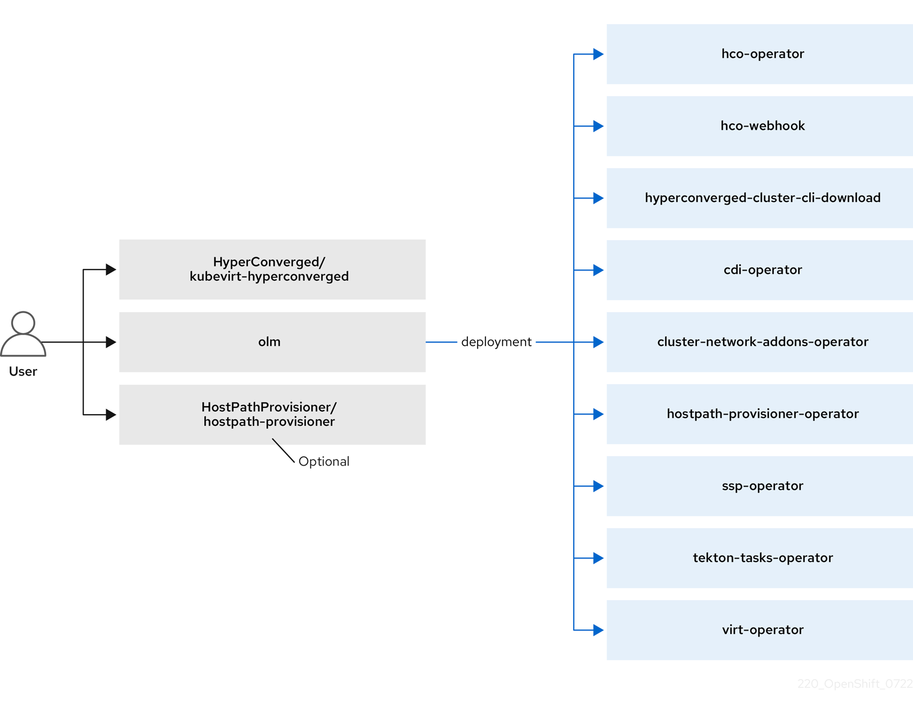
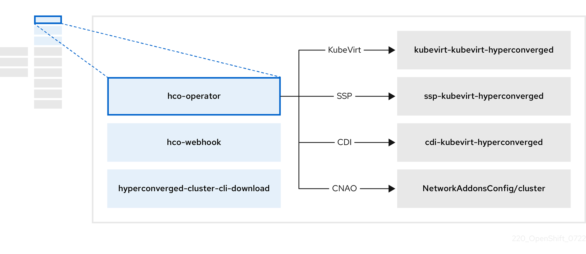
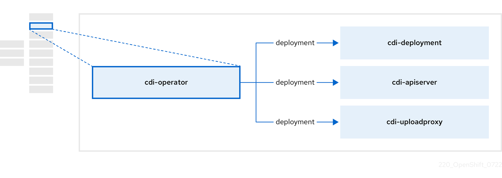
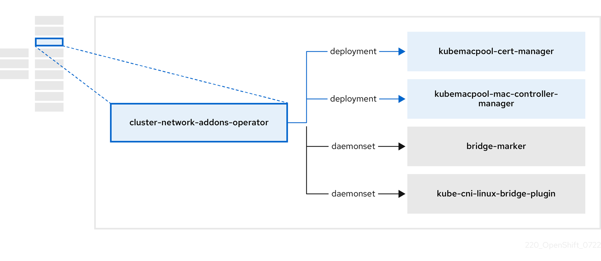
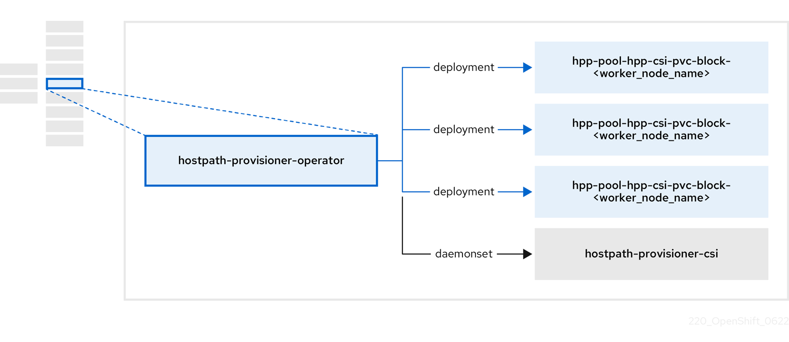
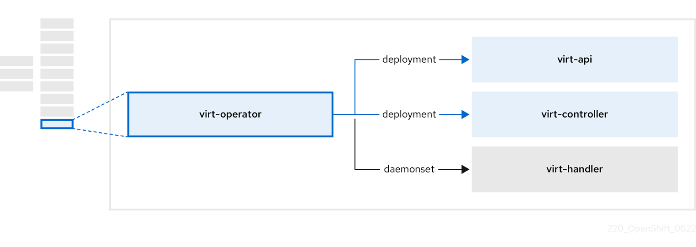

# OpenShift Virtualization Architecture { #virt-architecture }

OpenShift Virtualization architecture consists of several Operators and components that manage the lifecycle, storage, networking, and scheduling of virtual machine workloads within the cluster.

The Operator Lifecycle Manager (OLM) deploys operator pods for each component of OpenShift Virtualization:

- Compute: `virt-operator`
- Storage: `cdi-operator`
- Network: `cluster-network-addons-operator`
- Scaling: `ssp-operator`

OLM also deploys the `hyperconverged-cluster-operator` pod, which is responsible for the deployment, configuration, and life cycle of other components, and several helper pods: `hco-webhook`, and `hyperconverged-cluster-cli-download`.

After all operator pods are successfully deployed, you should create the `HyperConverged` custom resource (CR). The configurations set in the `HyperConverged` CR serve as the single source of truth and the entrypoint for OpenShift Virtualization, and guide the behavior of the CRs.

The `HyperConverged` CR creates corresponding CRs for the operators of all other components within its reconciliation loop. Each operator then creates resources such as daemon sets, config maps, and additional components for the OpenShift Virtualization control plane. For example, when the HyperConverged Operator (HCO) creates the `KubeVirt` CR, the OpenShift Virtualization Operator reconciles it and creates additional resources such as `virt-controller`, `virt-handler`, and `virt-api`.

The OLM deploys the Hostpath Provisioner (HPP) Operator, but it is not functional until you create a `hostpath-provisioner` CR.

## About the HyperConverged Operator (HCO) { #virt-about-hco-operator_virt-architecture }

The HCO, `hco-operator`, provides a single entry point for deploying and managing OpenShift Virtualization and several helper operators with opinionated defaults. It also creates custom resources (CRs) for those operators.

**HyperConverged Operator components**

| **Component**                                    | **Description**                                                                                              |
| ------------------------------------------------ | ------------------------------------------------------------------------------------------------------------ |
| `deployment/hco-webhook`                         | Validates the `HyperConverged` custom resource contents.                                                     |
| `deployment/hyperconverged-cluster-cli-download` | Provides the `virtctl` tool binaries to the cluster so that you can download them directly from the cluster. |
| `KubeVirt/kubevirt-kubevirt-hyperconverged`      | Contains all operators, CRs, and objects needed by OpenShift Virtualization.                                 |
| `SSP/ssp-kubevirt-hyperconverged`                | A Scheduling, Scale, and Performance (SSP) CR. This is automatically created by the HCO.                     |
| `CDI/cdi-kubevirt-hyperconverged`                | A Containerized Data Importer (CDI) CR. This is automatically created by the HCO.                            |
| `NetworkAddonsConfig/cluster`                    | A CR that instructs and is managed by the `cluster-network-addons-operator`.                                 |

## About the Containerized Data Importer (CDI) Operator { #virt-about-cdi-operator_virt-architecture }

The CDI Operator, `cdi-operator`, manages CDI and its related resources, which imports a virtual machine (VM) image into a persistent volume claim (PVC) by using a data volume.

**CDI Operator components**

| **Component**                | **Description**                                                                                                                                        |
| ---------------------------- | ------------------------------------------------------------------------------------------------------------------------------------------------------ |
| `deployment/cdi-apiserver`   | Manages the authorization to upload VM disks into PVCs by issuing secure upload tokens.                                                                |
| `deployment/cdi-uploadproxy` | Directs external disk upload traffic to the appropriate upload server pod so that it can be written to the correct PVC. Requires a valid upload token. |
| `pod/cdi-importer`           | Helper pod that imports a virtual machine image into a PVC when creating a data volume.                                                                |

## About the Cluster Network Addons Operator { #virt-about-cluster-network-addons-operator_virt-architecture }

The Cluster Network Addons Operator, `cluster-network-addons-operator`, deploys networking components on a cluster and manages the related resources for extended network functionality.

**Cluster Network Addons Operator components**

| **Component**                                   | **Description**                                                                                                                                              |
| ----------------------------------------------- | ------------------------------------------------------------------------------------------------------------------------------------------------------------ |
| `deployment/kubemacpool-cert-manager`           | Manages TLS certificates of Kubemacpool’s webhooks.                                                                                                          |
| `deployment/kubemacpool-mac-controller-manager` | Provides a MAC address pooling service for virtual machine (VM) network interface cards (NICs).                                                              |
| `daemonset/bridge-marker`                       | Marks network bridges available on nodes as node resources.                                                                                                  |
| `daemonset/kube-cni-linux-bridge-plugin`        | Installs Container Network Interface (CNI) plugins on cluster nodes, enabling the attachment of VMs to Linux bridges through network attachment definitions. |

## About the Hostpath Provisioner (HPP) Operator { #virt-about-hpp-operator_virt-architecture }

The HPP Operator, `hostpath-provisioner-operator`, deploys and manages the multi-node HPP and related resources.

**HPP Operator components**

| **Component**                                              | **Description**                                                                                                               |
| ---------------------------------------------------------- | ----------------------------------------------------------------------------------------------------------------------------- |
| `deployment/hpp-pool-hpp-csi-pvc-block-<worker_node_name>` | Provides a worker for each node where the HPP is designated to run. The pods mount the specified backing storage on the node. |
| `daemonset/hostpath-provisioner-csi`                       | Implements the Container Storage Interface (CSI) driver interface of the HPP.                                                 |
| `daemonset/hostpath-provisioner`                           | Implements the legacy driver interface of the HPP.                                                                            |

## About the Scheduling, Scale, and Performance (SSP) Operator { #virt-about-ssp-operator_virt-architecture }

The SSP Operator, `ssp-operator`, deploys the common templates, the related default boot sources, the pipeline tasks, and the template validator.

## About the OpenShift Virtualization Operator { #virt-about-virt-operator_virt-architecture }

The OpenShift Virtualization Operator, `virt-operator`, deploys, upgrades, and manages OpenShift Virtualization without disrupting current virtual machine (VM) workloads. In addition, the OpenShift Virtualization Operator deploys the common instance types and common preferences.

**virt-operator components**

| **Component**                | **Description**                                                                                                                                                              |
| ---------------------------- | ---------------------------------------------------------------------------------------------------------------------------------------------------------------------------- |
| `deployment/virt-api`        | HTTP API server that serves as the entry point for all virtualization-related flows.                                                                                         |
| `deployment/virt-controller` | Observes the creation of a new VM instance object and creates a corresponding pod. When the pod is scheduled on a node, `virt-controller` updates the VM with the node name. |
| `daemonset/virt-handler`     | Monitors any changes to a VM and instructs `virt-launcher` to perform the required operations. This component is node-specific.                                              |
| `pod/virt-launcher`          | Contains the VM that was created by the user as implemented by `libvirt` and `qemu`.                                                                                         |

**Additional resources**

- [virtctl client commands](../getting_started/virt-using-the-cli-tools.md#virt-using-the-cli-tools)
