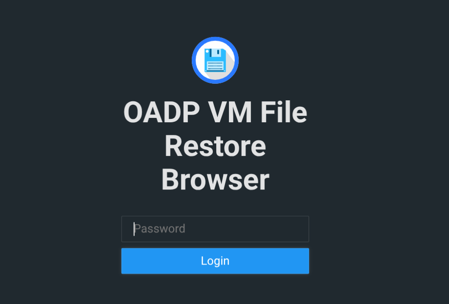
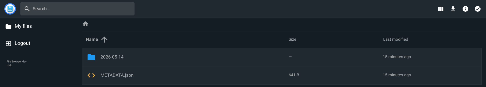
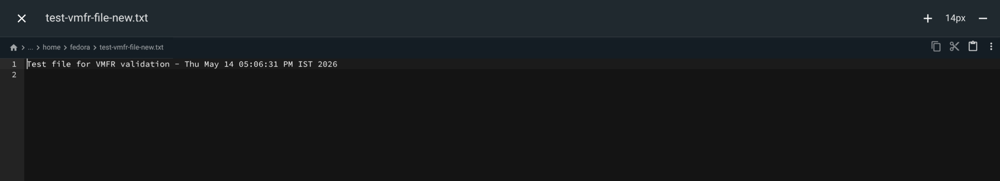

# Use virtual machine file restore { #virt-using-vm-file-restore }

Discover VM backups, restore files, and access restored files through a web browser or SSH-based tools.

## Enable OADP VMFR { #oadp-vmfr-enabling_virt-using-vm-file-restore }

Enable OADP virtual machine file restore (VMFR) by configuring the `DataProtectionApplication` (DPA) custom resource (CR) with the `vmFileRestore` section. You can allow file-level restore operations for VM backups.

**Prerequisites**

- You are logged in to the cluster with the `cluster-admin` role.
- The OADP Operator is installed.
- The `DataProtectionApplication` (DPA) CR is configured.
- OpenShift Virtualization is installed and running on the cluster.
- You have a default storage class configured on the cluster.

**Procedure**

1. Edit the `DataProtectionApplication` CR to enable the VMFR feature:

    ```yaml
    apiVersion: oadp.openshift.io/v1alpha1
    kind: DataProtectionApplication
    metadata:
      name: oadp-backup
      namespace: openshift-adp
    spec:
      configuration:
        nodeAgent:
          enable: true
          uploaderType: kopia
        velero:
          defaultPlugins:
            - kubevirt
            - csi
            - openshift
            - aws
          disableFsBackup: false
      vmFileRestore:
        enable: true
      backupLocations:
        - velero:
            config:
              profile: "default"
              region: <region>
            provider: aws
            default: true
            credential:
              key: cloud
              name: <cloud_credentials>
            objectStorage:
              bucket: <bucket_name>
              prefix: velero
    ```

    where:

    `kubevirt`
    :   Specifies the `kubevirt` Velero plugin in the `defaultPlugins` list. This plugin is required for VM backup and file-level restore operations.

    `vmFileRestore`
    :   Specifies the section in the DPA `spec` to enable the VMFR feature.

    `enable`
    :   Specifies whether to enable the VMFR feature. Set to `true` to enable the feature.

2. Apply the DPA configuration by running the following command:

    ```terminal
    $ oc apply -f <dpa_cr_filename>
    ```

    Replace `<dpa_cr_filename>` with the file name containing the DPA CR configuration.

**Verification**

1. To verify that the DPA is reconciled with the VMFR feature enabled, run the following command:

    ```terminal
    $ oc get dpa -n openshift-adp -o yaml
    ```

    In the output, verify that the `status.conditions` section includes a condition with `type: VMFileRestoreReady` and `status: "True"`.

2. To verify that the `oadp-vm-file-restore-controller-manager` pod is running, run the following command:

    ```terminal
    $ oc get pod -n openshift-adp
    ```

    The output should include a running `oadp-vm-file-restore-controller-manager` pod.

## Create a VirtualMachineBackupsDiscovery CR { #oadp-vmfr-creating-vmbd_virt-using-vm-file-restore }

Create a `VirtualMachineBackupsDiscovery` (VMBD) custom resource (CR) to identify which Velero backups contain a specified virtual machine (VM). You can locate available backups before performing a file-level restore.

After you create a VMBD CR, the CR undergoes the following phases:

- The initial phase for the CR is `New`.
- The controller compiles candidate backups and verifies VM presence in each backup.
- Upon successful discovery, the `status.phase` field of the VMBD CR is updated to `Completed`.

!!! warning

    Create all VMFR custom resources in the protected namespace, which is `openshift-adp` by default.

**Prerequisites**

- You are logged in to the cluster with the `cluster-admin` role.
- You have installed the OADP Operator.
- You have configured the `DataProtectionApplication` (DPA) CR with the VMFR feature enabled.
- You have existing Velero backups that contain virtual machine data.

**Procedure**

1. Create a `VirtualMachineBackupsDiscovery` CR YAML manifest file with the following configuration:

    ```yaml
    apiVersion: oadp.openshift.io/v1alpha1
    kind: VirtualMachineBackupsDiscovery
    metadata:
      name: find-my-vm-backups
      namespace: openshift-adp
    spec:
      virtualMachineName: "production-web-server"
      virtualMachineNamespace: "production"
    ```

    where:

    `name`
    :   Specifies a name for the VMBD CR. For example, `find-my-vm-backups`.

    `namespace`
    :   Specifies the namespace where the VMBD CR is created. This must be the OADP protected namespace, typically `openshift-adp`.

    `virtualMachineName`
    :   Specifies the name of the virtual machine to search for in backups. For example, `production-web-server`.

    `virtualMachineNamespace`
    :   Specifies the namespace of the target virtual machine. For example, `production`.

2. Optional: To filter backups by a time range, add `startTime` and `endTime` fields to the `spec` section:

    ```yaml
    apiVersion: oadp.openshift.io/v1alpha1
    kind: VirtualMachineBackupsDiscovery
    metadata:
      name: find-my-vm-backups
      namespace: openshift-adp
    spec:
      virtualMachineName: "production-web-server"
      virtualMachineNamespace: "production"
      startTime: "2025-08-01"
      endTime: "2025-09-01"
    ```

    where:

    `startTime`
    :   Specifies the start of the time range to filter backups. Backups created before this date are excluded.

    `endTime`
    :   Specifies the end of the time range to filter backups. Backups created after this date are excluded.

3. Optional: To discover specific backups by name, add the `requestedBackups` field to the `spec` section:

    ```yaml
    apiVersion: oadp.openshift.io/v1alpha1
    kind: VirtualMachineBackupsDiscovery
    metadata:
      name: find-my-vm-backups
      namespace: openshift-adp
    spec:
      virtualMachineName: "production-web-server"
      virtualMachineNamespace: "production"
      requestedBackups:
        - "initial-backup-from-2024-01-01"
        - "last-working-from-2025-07-28"
    ```

    where:

    `requestedBackups`
    :   Specifies a list of backup names to include in the discovery. These backups are included regardless of any time range filter.

4. To apply the VMBD CR configuration, run the following command:

    ```terminal
    $ oc apply -f <vmbd_cr_filename>
    ```

    Replace `<vmbd_cr_filename>` with the file name containing the VMBD CR configuration.

**Verification**

- To verify that the VMBD CR is successfully created and discovery is complete, run the following command:

    ```terminal
    $ oc get vmbd find-my-vm-backups -n openshift-adp -o yaml
    ```

    ```yaml
    apiVersion: oadp.openshift.io/v1alpha1
    kind: VirtualMachineBackupsDiscovery
    metadata:
      name: find-my-vm-backups
      namespace: openshift-adp
    spec:
      virtualMachineName: "production-web-server"
      virtualMachineNamespace: "production"
    status:
      phase: Completed
      validBackups:
        - name: "backup-2025-09-20"
          namespace: openshift-adp
          createdAt: "2025-09-20T02:00:00Z"
        - name: "backup-2025-09-15"
          namespace: openshift-adp
          createdAt: "2025-09-15T02:00:00Z"
      backupDiscoveryProgress:
        - name: "backup-2025-09-20"
          namespace: openshift-adp
          status: Completed
          message: "VM found in backup"
          createdAt: "2025-09-20T02:00:00Z"
        - name: "backup-2025-09-15"
          namespace: openshift-adp
          status: Completed
          message: "VM found in backup"
          createdAt: "2025-09-15T02:00:00Z"
      conditions:
        - type: Ready
          status: "True"
          message: "Successfully discovered 2 valid backups"
          reason: DiscoverySuccessful
      discoveryStats:
        totalCandidates: 2
        completed: 2
        failed: 0
        inProgress: 0
        pending: 0
        skipped: 0
      observedGeneration: 1
    ```

    where:

    `phase: Completed`
    :   Specifies that the discovery process is complete.

    `validBackups`
    :   Specifies the list of backups that contain the specified virtual machine. Each entry includes the `name`, `namespace`, and `createdAt` timestamp.

    `backupDiscoveryProgress`
    :   Specifies the discovery progress for each candidate backup, including the `status` and `message`.

    `discoveryStats`
    :   Specifies the total number of candidate backups processed and the count of completed, failed, in-progress, pending, and skipped results.

    `observedGeneration`
    :   Specifies the last generation value processed by the controller.

## Create a VirtualMachineFileRestore CR { #oadp-vmfr-creating-vmfr_virt-using-vm-file-restore }

Create a `VirtualMachineFileRestore` (VMFR) custom resource (CR) to make files from discovered virtual machine (VM) backups accessible for browsing and downloading. You can recover individual files without restoring the entire VM.

After you create a VMFR CR, the CR undergoes the following phases:

- The initial phase for the CR is `New`.
- The controller validates the referenced discovery, restores PVCs, and creates file-serving resources.
- Upon successful setup, the `status.phase` field of the VMFR CR is updated to `Completed`.

!!! note

    All VMFR custom resources must be created in the protected namespace, which is `openshift-adp` by default.

**Prerequisites**

- You are logged in to the cluster with the `cluster-admin` role.
- You have installed the OADP Operator.
- You have configured the `DataProtectionApplication` (DPA) CR with the VMFR feature enabled.
- You have created a `VirtualMachineBackupsDiscovery` (VMBD) CR and its `status.phase` is `Completed`.

**Procedure**

1. \[Optional\] Create a secret containing the credentials for accessing the file browser:

    If you do not create a secret, the VMFR controller creates a secret for you and references it in the VMFR CR.

    ```yaml
    apiVersion: v1
    kind: Secret
    metadata:
      name: vmfr-credentials
      namespace: openshift-adp
    type: Opaque
    data:
      password: <base64_encoded_password>
      username: <base64_encoded_username>
    ```

    where:

    `password`
    :   Specifies the base64-encoded password for the file browser. The password must be at least 12 characters long before encoding.

    `username`
    :   Specifies the base64-encoded username for the file browser.

2. Create a `VirtualMachineFileRestore` CR YAML manifest file with the following configuration.

    To configure file browser access:

    ```yaml
    apiVersion: oadp.openshift.io/v1alpha1
    kind: VirtualMachineFileRestore
    metadata:
      name: restore-config-files
      namespace: openshift-adp
    spec:
      backupsDiscoveryRef: find-my-vm-backups
      selectedBackups:
        - backup-2025-09-20
        - backup-2025-09-15
      fileAccess:
        fileBrowser:
          credentialsSecretRef:
            name: vmfr-credentials
          exposeExternally: true
    ```

    To configure SSH access:

    ```yaml
    apiVersion: oadp.openshift.io/v1alpha1
    kind: VirtualMachineFileRestore
    metadata:
      name: restore-config-files
      namespace: openshift-adp
    spec:
      backupsDiscoveryRef: find-my-vm-backups
      selectedBackups:
        - backup-2025-09-20
        - backup-2025-09-15
      fileAccess:
        ssh: {}
    ```

    where:

    `name`
    :   Specifies a name for the VMFR CR. For example, `restore-config-files`.

    `namespace`
    :   Specifies the namespace where the VMFR CR is created. This must be the OADP protected namespace, typically `openshift-adp`.

    `backupsDiscoveryRef`
    :   Specifies the name of the VMBD CR that contains the discovery results. This VMBD CR must be in the `Completed` phase.

    `selectedBackups`
    :   Specifies a list of backup names from the VMBD valid results to restore. A Velero restore operation is created for each backup in this list.

    `fileAccess`
    :   Specifies the configuration for accessing the restored files.

    `fileBrowser`
    :   Specifies the file browser configuration for web-based access.

    `credentialsSecretRef`
    :   Specifies the name of the Kubernetes secret that contains the credentials for file browser access.

    `exposeExternally`
    :   Specifies whether to create an external route for accessing the file browser. Set to `true` to create a publicly accessible route.

    `ssh`
    :   Specifies the SSH access configuration. Set to `{}` to enable SSH access with autogenerated credentials. The controller generates an SSH key pair and stores it in a Kubernetes secret. Optionally, you can also specify a `username`, and `publickey` for enabling the SSH access as shown in the following example:

    ```yaml
    ...
       ssh: 
         username: fedora
         publicKey: ""
    ```

3. To apply the VMFR CR configuration, run the following command:

    ```terminal
    $ oc apply -f <vmfr_cr_filename>
    ```

    Replace `<vmfr_cr_filename>` with the file name containing the VMFR CR configuration.

**Verification**

- To verify that the VMFR CR is successfully created and file access is available, run the following command:

    ```terminal
    $ oc get vmfr restore-config-files -n openshift-adp -o yaml
    ```

    ```yaml
    apiVersion: oadp.openshift.io/v1alpha1
    kind: VirtualMachineFileRestore
    metadata:
      name: restore-config-files
      namespace: openshift-adp
    spec:
      backupsDiscoveryRef: find-my-vm-backups
      selectedBackups:
        - backup-2025-09-20
        - backup-2025-09-15
      fileAccess:
        fileBrowser:
          credentialsSecretRef:
            name: vmfr-credentials
          exposeExternally: true
    status:
      phase: Completed
      fileServingInfo:
        fileBrowser:
          clusterAccess: https://restore-config-files-fileserver-svc.production-production-web-server-a1b2c3.svc.cluster.local:8443
          publicAccess: https://restore-config-files.vmfr.apps.example.com
          credentialsSecretRef:
            name: restore-config-files-filebrowser-xk4wm
            namespace: production-production-web-server-a1b2c3
      conditions:
        - type: Ready
          status: "True"
          message: "File restore completed, files accessible via file server and external route"
          reason: Completed
        - type: Available
          status: "True"
          message: "File server is accessible and serving files"
          reason: FileServerAvailable
      pvcRestores:
        - pvcName: production-web-server-dv
          pvcNamespace: production
          pvcUID: 05ac1521-2a16-4a71-b81f-ccad592b89cd
          restores:
            - veleroBackupName: backup-2025-09-20
              veleroBackupNamespace: openshift-adp
              veleroRestoreName: vmfr-restore-config-files-backup-2025-09-20-89lfl
              veleroRestoreNamespace: openshift-adp
              phase: Completed
              state: available
              timestamp: "2025-09-20T02:00:00Z"
            - veleroBackupName: backup-2025-09-15
              veleroBackupNamespace: openshift-adp
              veleroRestoreName: vmfr-restore-config-files-backup-2025-09-15-bfqx4
              veleroRestoreNamespace: openshift-adp
              phase: Completed
              state: available
              timestamp: "2025-09-15T02:00:00Z"
          size: 150Mi
      createdNamespace: production-production-web-server-a1b2c3
      observedGeneration: 1
    ```

    where:

    `phase: Completed`
    :   Specifies that the file restore process is complete and file-serving endpoints are available.

    `fileServingInfo.fileBrowser`
    :   Specifies the endpoint details and credentials for accessing the restored files through the file browser.

    `clusterAccess`
    :   Specifies the cluster-internal URL for accessing the file browser.

    `publicAccess`
    :   Specifies the externally accessible URL for the file browser. This field is present only when `exposeExternally` is set to `true`.

    `credentialsSecretRef`
    :   Specifies the Kubernetes secret that contains the generated credentials for accessing the file browser interface, including the `name` and `namespace` of the secret.

    `pvcRestores`
    :   Specifies the restore status grouped by PVC. Each PVC entry includes the `pvcName`, `pvcNamespace`, `pvcUID`, and a `restores` list with details for each backup restore.

    `state`
    :   Specifies the state of the restored PVC. Possible values include `available`, `processing`, `failed`, `backup-deleted`, `backup-missing`, `unsupported-plugin`, and `extraction-failed`.

    `createdNamespace`
    :   Specifies the temporary namespace created for hosting the file-serving resources. This namespace is cleaned up when you delete the VMFR CR.

## Access restored files through a web browser { #oadp-vmfr-accessing-files-web_virt-using-vm-file-restore }

Access restored virtual machine (VM) files through a web browser by using the file browser interface provided by the `VirtualMachineFileRestore` (VMFR) custom resource (CR). You can browse, preview, and download files from VM backups.

**Prerequisites**

- You are logged in to the cluster with the `cluster-admin` role.
- A `VirtualMachineFileRestore` (VMFR) CR with the `fileAccess.fileBrowser` section configured exists.
- The VMFR CR `status.phase` is `Completed`.

**Procedure**

1. To retrieve the file browser access URLs, run the following command:

    ```terminal
    $ oc get vmfr <vmfr_cr_name> -n openshift-adp -o jsonpath='{.status.fileServingInfo.fileBrowser}'
    ```

    Replace `<vmfr_cr_name>` with the name of the VMFR CR. The output includes the `clusterAccess` URL for cluster-internal access and the `publicAccess` URL if `exposeExternally` is set to `true`.

2. If the VMFR CR has `exposeExternally` set to `true`, open a web browser and navigate to the `publicAccess` URL from the status output.

    If `exposeExternally` is not enabled, set up port forwarding to the file-serving service by running the following command:

    ```terminal
    $ oc port-forward svc/vmfr-<vmfr_cr_name>-fileserver-svc -n <restore_namespace> 8443:8443
    ```

    Replace `<vmfr_cr_name>` with the name of the VMFR CR and `<restore_namespace>` with the namespace from the `status.createdNamespace` field. Then navigate to `https://localhost:8443` in your web browser.

3. Log in by using the credentials from the secret you created for file browser access.

    **Figure 1. OADP VM File Restore Browser login page**

    

4. Browse the files organized by date, backup name, and PVC name.

    **Figure 2. File browser listing showing backup contents**

    

5. View the file content by selecting the file. To download a file, select the file and click **Download**. To download a directory as an archive, select the directory and click **Download**.

    **Figure 3. File preview in the file browser**

    

## Access restored files through SSH { #oadp-vmfr-accessing-files-ssh_virt-using-vm-file-restore }

Access restored virtual machine (VM) files through SSH by using `rsync`, `scp`, or `sftp` with the `VirtualMachineFileRestore` (VMFR) custom resource (CR). You can transfer files from VM backups efficiently.

When you configure SSH access, the VMFR controller autogenerates an SSH key pair and stores it in a Kubernetes secret. The default SSH username is `oadp`. The SSH file server listens on port `2222`.

The remote path for restored files follows the format `/restores/<date>/<backup_name>/<vm_name>/<path_to_file>`.

**Prerequisites**

- You are logged in to the cluster with the `cluster-admin` role.
- You have created a `VirtualMachineFileRestore` (VMFR) CR with the `fileAccess.ssh` section configured.
- The VMFR CR `status.phase` is `Completed`.

**Procedure**

1. To retrieve the SSH access information, run the following command:

    ```terminal
    $ oc get vmfr <vmfr_cr_name> -o jsonpath='{.status.fileServingInfo.ssh}' | jq
    ```

    Replace `<vmfr_cr_name>` with the name of the VMFR CR. The output includes the `clusterAccess` URL and `credentialsSecretRef` containing the name and namespace of the generated SSH key secret.

2. Retrieve the private key from the generated secret and save it to a file:

    ```terminal
    $ oc get secret <secret_name> -n <secret_namespace> -o jsonpath='{.data.privateKey}' | base64 -d > id-rsa
    ```

    Replace `<secret_name>` and `<secret_namespace>` with the values from the `status.fileServingInfo.ssh.credentialsSecretRef` field.

3. Set the correct permissions on the private key file:

    ```terminal
    $ chmod 600 id-rsa
    ```

4. Get the name of the file server service created in the VMFR namespace:

    ```terminal
    $ oc get svc -n <created_namespace> | grep fileserver
    ```

    Replace `<created_namespace>` with the value from the `status.createdNamespace` field of the VMFR CR.

5. To copy a file from the backup by using `scp`, run the following command:

    ```terminal
    $ scp -P 2222 -i id-rsa \
      -o StrictHostKeyChecking=no \
      -o UserKnownHostsFile=/dev/null \
      oadp@<fileserver_svc>.<created_namespace>.svc.cluster.local:<remote_path> \
      <local_destination>
    ```

    where:

    `<fileserver_svc>`
    :   Specifies the name of the file server service.

    `<created_namespace>`
    :   Specifies the namespace from the `status.createdNamespace` field.

    `<remote_path>`
    :   Specifies the path to the file in the format `/restores/<date>/<backup_name>/<vm_name>/<path_to_file>`.

    `<local_destination>`
    :   Specifies the local file path to save the restored file.

6. To start an interactive SFTP session, run the following command:

    ```terminal
    $ sftp -P 2222 -i id-rsa \
      -o StrictHostKeyChecking=no \
      oadp@<fileserver_svc>.<created_namespace>.svc.cluster.local
    ```

## Delete a VirtualMachineFileRestore CR { #oadp-vmfr-deleting-vmfr_virt-using-vm-file-restore }

Delete a `VirtualMachineFileRestore` (VMFR) custom resource (CR) to clean up file-serving resources after you have recovered the files you need. This helps you free cluster resources used by the file-serving pod and temporary namespace.

When you delete a VMFR CR, the controller performs the following cleanup operations:

- Stops the file-serving pod and associated services.
- Deletes the restored PVCs.
- Deletes the temporary namespace if one was automatically created.

**Prerequisites**

- You are logged in to the cluster with the `cluster-admin` role.
- You have a `VirtualMachineFileRestore` CR that you want to delete.

**Procedure**

- To delete a `VirtualMachineFileRestore` CR, run the following command:

    ```terminal
    $ oc delete vmfr <vmfr_cr_name> -n openshift-adp
    ```

    Replace `<vmfr_cr_name>` with the name of the VMFR CR.

**Verification**

- To verify that the VMFR CR is deleted and resources are cleaned up, run the following command:

    ```terminal
    $ oc get vmfr -n openshift-adp
    ```

    The deleted VMFR CR should not appear in the output.

## Test the VM file restore workflow { #oadp-vmfr-end-to-end-workflow_virt-using-vm-file-restore }

Complete an end-to-end workflow that creates a VM, backs it up, and restores individual files through SSH to test the VM file restore feature or verify your configuration.

**Prerequisites**

- You are logged in to the cluster with the `cluster-admin` role.
- You have installed the OADP Operator.
- OpenShift Virtualization is installed and running on the cluster.
- You have installed the `virtctl` CLI tool to access the VM.

**Procedure**

1. Create a secret for the cloud storage credentials by running the following command:

    ```terminal
    $ oc create secret generic <secret_name> -n openshift-adp --from-file cloud=<credentials_file_path>
    ```

    where:

    `<secret_name>`
    :   Specifies the name of the cloud credentials secret.

    `<credentials_file_path>`
    :   Specifies the path to the file that contains the cloud storage credentials.

2. Create a `DataProtectionApplication` (DPA) CR with the VMFR feature enabled and the `kubevirt` plugin:

    ```yaml
    apiVersion: oadp.openshift.io/v1alpha1
    kind: DataProtectionApplication
    metadata:
      name: vmfr-dpa
      namespace: openshift-adp
    spec:
      backupLocations:
        - velero:
            credential:
              key: cloud
              name: <secret_name>
            default: true
            objectStorage:
              bucket: <bucket_name>
              prefix: velero
            provider: <provider>
      configuration:
        velero:
          defaultPlugins:
            - csi
            - openshift
            - kubevirt
            - <provider>
          disableFsBackup: false
        nodeAgent:
          enable: true
          uploaderType: kopia
      vmFileRestore:
        enable: true
    ```

    where:

    `<secret_name>`
    :   Specifies the name of the cloud credentials secret you created.

    `<bucket_name>`
    :   Specifies the name of the object storage bucket.

    `<provider>`
    :   Specifies the cloud provider plugin, such as `aws`, `gcp`, or `azure`.

    `vmFileRestore`
    :   Enables the VMFR feature by setting the `enable` field to `true`.

3. Apply the DPA configuration by running the following command:

    ```terminal
    $ oc apply -f <dpa_cr_filename>
    ```

4. Verify that the DPA is reconciled and the VMFR feature is enabled by running the following command:

    ```terminal
    $ oc get dpa -n openshift-adp -o yaml
    ```

    In the output, verify that the `status.conditions` section includes a condition with `type: VMFileRestoreReady` and `status: "True"`.

5. Verify that the `velero`, `nodeAgent`, and `oadp-vm-file-restore-controller-manager` pods are running by running the following command:

    ```terminal
    $ oc get pod -n openshift-adp
    ```

6. Generate an SSH key pair for accessing the VM:

    ```terminal
    $ ssh-keygen -t ed25519 -f ~/.ssh/<vm_key_name> -C "<vm_key_name>"
    ```

    Replace `<vm_key_name>` with a name for the SSH folder and the key file.

7. Create a namespace for the VM by running the following command:

    ```terminal
    $ oc create ns <vm_namespace>
    ```

8. Create a Kubernetes secret with the SSH public key in the VM namespace:

    ```terminal
    $ oc create secret generic <ssh_secret_name> \
      --from-file=key=<path_to_public_key> \
      -n <vm_namespace>
    ```

    where:

    `<ssh_secret_name>`
    :   Specifies the name of the secret that contains the SSH public key.

    `<path_to_public_key>`
    :   Specifies the path to the SSH public key file you created in an earlier step. For example, `$HOME/.ssh/vm-key.pub`.

    `<vm_namespace>`
    :   Specifies the namespace for the VM.

9. Create a `VirtualMachine` CR by using the built-in VM template `fedora-server-small`:

    ```terminal
    $ oc process -n openshift fedora-server-small -p NAME=<vm_name> | oc apply -n <vm_namespace> -f -
    ```

    where:

    `<vm_name>`
    :   Specifies the name of the VM.

    `<vm_namespace>`
    :   Specifies the namespace for the VM.

10. Wait for the VM to be ready:

    ```terminal
    $ oc wait --for=condition=Ready vmi/<vm_name> -n <vm_namespace>
    ```

11. Patch the VM configuration `accessCredentials` object with the SSH public key:

    ```terminal
    $ oc patch vm <vm_name> -n <vm_namespace> --type=merge -p '{"spec":{"template":{"spec":{"accessCredentials":[{"sshPublicKey":{"propagationMethod":{"noCloud":{}},"source":{"secret":{"secretName":"<ssh_secret_name>"}}}}]}}}}'
    ```

    where:

    `<vm_name>`
    :   Specifies the name of the VM.

    `<vm_namespace>`
    :   Specifies the namespace for the VM.

    `<ssh_secret_name>`
    :   Specifies the name of the secret that contains the SSH public key.

12. SSH to the VM and create a test file:

    ```terminal
    $ virtctl ssh <vm_user>@vmi/<vm_name> \
      -n <vm_namespace> \
      --identity-file=$HOME/.ssh/<vm_key_name> \
      --local-ssh-opts="-o StrictHostKeyChecking=no" \
      -c "echo 'Test file for VMFR validation - $(date)' > /home/fedora/test-vmfr-file.txt"
    ```

    where:

    `<vm_user>`
    :   Specifies the name of the VM user. For the in-built VM template, the user name is `fedora`.

13. Create a `Backup` CR to back up the VM namespace:

    ```yaml
    apiVersion: velero.io/v1
    kind: Backup
    metadata:
      name: <backup_name>
      namespace: openshift-adp
    spec:
      includedNamespaces:
        - <vm_namespace>
      snapshotMoveData: true
    ```

14. Apply the `Backup` CR by running the following command:

    ```terminal
    $ oc apply -f <backup_cr_filename>
    ```

15. Verify that the backup is complete by running the following command:

    ```terminal
    $ oc get backup.velero <backup_name> -n openshift-adp -o jsonpath='{.status.phase}'
    ```

    The output should display `Completed`.

16. Create a `VirtualMachineBackupsDiscovery` CR to identify which backups contain the target VM:

    ```yaml
    apiVersion: oadp.openshift.io/v1alpha1
    kind: VirtualMachineBackupsDiscovery
    metadata:
      name: <vmbd_name>
      namespace: openshift-adp
    spec:
      virtualMachineName: <vm_name>
      virtualMachineNamespace: <vm_namespace>
    ```

17. Apply the VMBD CR by running the following command:

    ```terminal
    $ oc apply -f <vmbd_cr_filename>
    ```

18. Verify that the discovery is complete by running the following command:

    ```terminal
    $ oc get vmbd <vmbd_name> -n openshift-adp
    ```

    The `PHASE` column should display `Completed`.

19. Create a `VirtualMachineFileRestore` CR with SSH access to restore files from the discovered backups:

    ```yaml
    apiVersion: oadp.openshift.io/v1alpha1
    kind: VirtualMachineFileRestore
    metadata:
      name: <vmfr_name>
      namespace: openshift-adp
    spec:
      backupsDiscoveryRef: <vmbd_name>
      fileAccess:
        ssh: {}
    ```

    The `ssh: {}` configuration instructs the controller to autogenerate an SSH key pair and store it in a Kubernetes secret. The default SSH username is `oadp`.

20. Apply the VMFR CR by running the following command:

    ```terminal
    $ oc apply -f <vmfr_cr_filename>
    ```

21. Wait for the VMFR phase to complete:

    ```terminal
    $ oc get vmfr <vmfr_name> -n openshift-adp
    ```

    The `PHASE` column should display `Completed`.

22. Retrieve the SSH access information by running the following command:

    ```terminal
    $ oc get vmfr <vmfr_name> -o jsonpath='{.status.fileServingInfo.ssh}' | jq
    ```

    The output includes the `clusterAccess` URL and the `credentialsSecretRef` containing the name and namespace of the auto generated SSH key secret.

23. Retrieve the private key from the auto generated secret and save it to a file:

    ```terminal
    $ oc get secret <secret_name> -n <secret_namespace> -o jsonpath='{.data.privateKey}' | base64 -d > id-rsa
    ```

    Replace `<secret_name>` and `<secret_namespace>` with the values from the `status.fileServingInfo.ssh.credentialsSecretRef` field.

24. Copy the private key to the VM so that you can use it for `scp` from within the VM:

    ```terminal
    $ virtctl scp id-rsa \
      <vm_user>@vmi/<vm_name>:/home/<vm_user>/id-rsa \
      -n <vm_namespace> \
      --identity-file=$HOME/.ssh/<vm_key_name>
    ```

25. Update the file permissions on the private key inside the VM:

    ```terminal
    $ virtctl ssh <vm_user>@vmi/<vm_name> \
      -n <vm_namespace> \
      --identity-file=$HOME/.ssh/<vm_key_name> \
      --local-ssh-opts="-o StrictHostKeyChecking=no" \
      -c "chmod 600 /home/<vm_user>/id-rsa"
    ```

26. Get the name of the file server service created in the VMFR namespace:

    ```terminal
    $ SVC=$(oc get svc -n <created_namespace> | grep fileserver | awk '{print $1}')
    ```

    Replace `<created_namespace>` with the value from the `status.createdNamespace` field of the VMFR CR.

27. Restore the file by using `scp` from within the VM. The remote path format is `/restores/<date>/<backup_name>/<vm_name>/<path_to_file>`:

    ```terminal
    $ virtctl ssh <vm_user>@vmi/<vm_name> \
      -n <vm_namespace> \
      --identity-file=$HOME/.ssh/<vm_key_name> \
      --local-ssh-opts="-o StrictHostKeyChecking=no" \
      -c "scp -P 2222 \
      -i /home/<vm_user>/id-rsa \
      -o StrictHostKeyChecking=no \
      -o UserKnownHostsFile=/dev/null \
      oadp@<fileserver_svc>.<created_namespace>.svc.cluster.local:<remote_path> \
      /tmp/restored.txt"
    ```

    where:

    `<fileserver_svc>`
    :   Specifies the name of the file server service you retrieved in an earlier step.

    `<created_namespace>`
    :   Specifies the namespace from the `status.createdNamespace` field.

    `<remote_path>`
    :   Specifies the path to the file in the format `/restores/<date>/<backup_name>/<vm_name>/<path_to_file>`. For example, `"/restores/2026-02-10/test-backup/fedora-vm-test/home/fedora/test-vmfr-file.txt"`

28. Verify that the restored file is intact by comparing MD5 checksums:

    ```terminal
    $ virtctl ssh <vm_user>@vmi/<vm_name> \
      -n <vm_namespace> \
      --identity-file=$HOME/.ssh/<vm_key_name> \
      --local-ssh-opts="-o StrictHostKeyChecking=no" \
      -c "echo '===MD5 Checksums===' && md5sum /home/fedora/test-vmfr-file.txt /tmp/restored.txt"
    ```

    The checksums of the original and restored files should match. You should see an output as shown in the following example:

    ```terminal
    ===MD5 Checksums===
    92245490c552e83baf5f2a2e898d9fff  /home/fedora/test-vmfr-file.txt
    92245490c552e83baf5f2a2e898d9fff  /tmp/restored.txt
    ```

29. After you have recovered the files, delete the VMFR CR to clean up resources:

    ```terminal
    $ oc delete vmfr <vmfr_name> -n openshift-adp
    ```

**Additional resources**

- [Recover individual files from virtual machine backups](virt-recovering-individual-files-from-vm-backups.md#virt-recovering-individual-files-from-vm-backups)
- [Backing up and restoring virtual machines](virt-backup-restore-overview.md#virt-backup-restore-overview)
- [Introduction to OpenShift API for Data Protection](../../backup_and_restore/application_backup_and_restore/oadp-intro.md#oadp-introduction)
