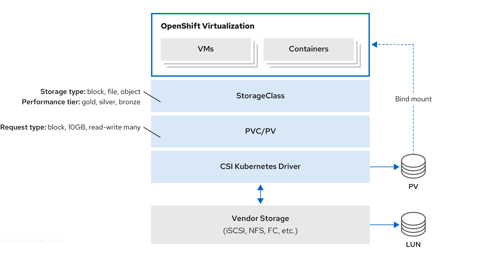

# Understanding virtual machine storage with the CSI paradigm { #virt-storage-with-csi-paradigm }

Virtual machines (VMs) in OpenShift Virtualization use PersistentVolume (PV) and PersistentVolumeClaim (PVC) paradigms to manage storage. This ensures seamless integration with the Container Storage Interface (CSI).

## Virtual machine CSI storage overview { #virt-storage-vp-csi-overview_virt-storage-with-csi-paradigm }

OpenShift Virtualization integrates with the Container Storage Interface (CSI) to manage virtual machine (VM) storage.

Storage classes define storage capabilities such as performance tiers and types. PersistentVolumeClaims (PVCs) request storage resources, which bind to PersistentVolumes (PVs). CSI drivers connect Kubernetes to vendor storage backends, including iSCSI, NFS, and Fibre Channel.

!!! warning

    A VM can start even if its PVC is already mounted by another pod. This behavior follows Kubernetes PVC access semantics and can lead to data corruption if multiple writers access the same volume.

