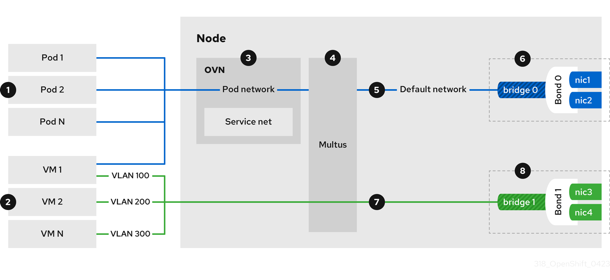

# Networking overview { #virt-networking }

To connect virtual machines (VMs) to cluster networks, configure default and user-defined networking options in OpenShift Virtualization.

OpenShift Virtualization supports single-stack IPv6 clusters for VMs that are connected to an OVN-Kubernetes localnet network, Linux bridge Container Network Interface (CNI) plugin, and Single Root I/O Virtualization (SR-IOV) network devices.

The following figure illustrates the typical network setup of OpenShift Virtualization. Other configurations are also possible.

**Figure 1. OpenShift Virtualization networking overview**

 Pods and VMs run on the same network infrastructure so you can easily connect your containerized and virtualized workloads.

 You can connect VMs to the default pod network and to any number of secondary networks.

 The default pod network provides connectivity between all its members, service abstraction, IP management, micro segmentation, and other functionality.

!!! note

    When deploying VM networks on public clouds, you can choose from the following solutions:

    - The default pod network: The standard out-of-the-box configuration.
    - Primary layer 2 user-defined network (UDN): This is the preferred approach. It provides a flat layer 2 network for VMs, sticky IP addresses, and direct east-west connectivity.
    - Secondary layer 2 network attachment definition (NAD): This approach provides an isolated layer 2 overlay network to connect VMs on different nodes, without configuring any additional physical networking infrastructure.

    For the default pod network and the primary user-defined network, egress traffic relies on Network Address Translation (NAT). Ingress traffic requires load balancer services integrated with the cloud provider’s native load balancers.

    The layer 2 secondary network does not provide external ingress or egress routing.

 Multus is a "meta" CNI plugin that enables a pod or virtual machine to connect to additional network interfaces by using other compatible CNI plugins.

 The default pod network is overlay-based, tunneled through the underlying machine network.

 You can define the machine network over a selected set of network interface controllers (NICs).

 Secondary VM networks are typically bridged directly to a physical network, with or without VLAN encapsulation. It is also possible to create virtual overlay networks for secondary networks.

!!! warning

    The following features are not supported on Red Hat OpenShift Service on AWS, Microsoft Azure, Red Hat OpenShift Dedicated, Google Cloud, and Oracle(R) Cloud Infrastructure (OCI):

    - Connecting VMs directly to the underlay network
    - Using Border Gateway Protocol (BGP) to allow direct routing to VMs
    - Using Ethernet Virtual Private Network (EVPN) with BGP to extend layer 2 connectivity for primary cluster-scoped UDNs

 Secondary VM networks can be defined on dedicated set of NICs, as shown in figure 1, or they can use the machine network.

## OpenShift Virtualization networking glossary { #virt-networking-glossary_virt-networking-overview }

Definitions of key OpenShift Virtualization networking terms and technologies.

Container Network Interface (CNI)
:   A [Cloud Native Computing Foundation](https://www.cncf.io/) project, focused on container network connectivity. OpenShift Virtualization uses CNI plugins to build upon the basic Kubernetes networking functionality.

Multus
:   A "meta" CNI plugin that allows multiple CNIs to exist so that a pod or virtual machine can use the interfaces it needs.

Custom resource definition (CRD)
:   A [Kubernetes](https://kubernetes.io/docs/concepts/extend-kubernetes/api-extension/custom-resources/) API resource that allows you to define custom resources, or an object defined by using the CRD API resource.

`NetworkAttachmentDefinition`
:   A CRD introduced by the Multus project that allows you to attach pods, virtual machines, and virtual machine instances to one or more networks.

`UserDefinedNetwork`
:   A namespace-scoped CRD introduced by the user-defined network (UDN) API that can be used to create a tenant network that isolates the tenant namespace from other namespaces.

`ClusterUserDefinedNetwork`
:   A cluster-scoped CRD introduced by the user-defined network API that cluster administrators can use to create a shared network across multiple namespaces.

`NodeNetworkConfigurationPolicy`
:   A CRD introduced by the nmstate project, describing the requested network configuration on nodes. You update the node network configuration, including adding and removing interfaces, by applying a `NodeNetworkConfigurationPolicy` manifest to the cluster.

## Manage overlay networks { #virt-nw-overview-manage-overlay-nw_virt-networking-overview }

To ensure your virtual machines (VMs) connect reliably by using the standard OpenShift Container Platform networking model, configure the default pod network for cluster-wide connectivity. 

Overlay networks provide a flexible, software-defined layer of connectivity on top of a physical network, enabling services like network segmentation, custom routing, and simplified management without altering the underlying hardware.

Connect a VM to the default pod network
:   Each VM is connected by default to the default internal pod network. You can add or remove network interfaces by editing the VM specification.

    You can access a virtual machine (VM) that is connected to the default internal pod network on a stable fully qualified domain name (FQDN) by using headless services.

Connect a VM to a custom primary overlay network
:   Configure a primary user-defined network (UDN) that supports multi-namespace connectivity to provide isolated and flexible traffic paths for your workloads.

    Cluster administrators can configure a primary `UserDefinedNetwork` CRD to create a tenant network that isolates the tenant namespace from other namespaces without requiring network policies. Additionally, cluster administrators can use the `ClusterUserDefinedNetwork` CRD to create a shared OVN layer 2 network across multiple namespaces.

    User-defined networks with the layer 2 overlay topology are useful for VM workloads, and a good alternative to secondary networks in environments where physical network access is limited, such as the public cloud. The layer 2 topology enables seamless migration of VMs without the need for Network Address Translation (NAT), and also provides persistent IP addresses that are preserved between reboots and during live migration.

Connect a VM to a custom secondary overlay network
:   Configure a secondary UDN with layer 2 topology to create a private isolated communication channel between a group of VMs across different nodes. A layer 2 topology connects workloads by a cluster-wide logical switch. The OVN-Kubernetes CNI plugin uses the Geneve (Generic Network Virtualization Encapsulation) protocol to create an overlay network between nodes. You can use this overlay network to connect VMs on different nodes, without having to configure any additional physical networking infrastructure.

Configure external ingress by exposing a VM as a service
:   You can expose a VM within the cluster or outside the cluster by creating a `Service` object. For on-premise clusters, you can configure a load balancing service by using the MetalLB Operator. You can install the MetalLB Operator by using the OpenShift Container Platform web console or the CLI.

Add a VM to a Service Mesh
:   OpenShift Virtualization is integrated with Red Hat OpenShift Service Mesh. You can monitor, visualize, and control traffic between pods and virtual machines on the default pod network with IPv4.

## Connect to the provider’s physical network { #virt-nw-overview-connect-vm-to-physical-nw_virt-networking-overview }

To give virtual machines (VMs) access to the internet or other physical devices, you configure the node network, define the secondary network, and attach the VM to the secondary network.

Connect a VM to the physical network by using an Open vSwitch bridge
:   You can connect a VM to the physical network infrastructure by configuring an OVN-Kubernetes secondary user-defined network (UDN) with the localnet topology.

    A localnet topology connects the secondary network to the physical underlay. This enables both east-west cluster traffic and access to services running outside the cluster, but it requires additional configuration of the underlying Open vSwitch (OVS) bridge on cluster nodes.

    Cluster administrators can use the following steps to configure the localnet UDN:

1. Install the Kubernetes NMState Operator which provides a state-driven network configuration across cluster nodes.
2. Use the `NodeNetworkConfigurationPolicy` custom resource (CR) to configure OVS bridges and add the appropriate bridge mappings on the nodes.
3. Use the `ClusterUserDefinedNetwork` CR from the UDN API to attach their workload to the underlay network through the OVS bridges configured in the previous step.

Connect a VM to the physical network by using a Linux bridge
:   Install the Kubernetes NMState Operator to configure Linux bridges, VLANs, and bonding for your secondary networks. The OVN-Kubernetes `localnet` topology is the recommended way of connecting a VM to the underlying physical network, but OpenShift Virtualization also supports Linux bridge networks.

    !!! note

        You cannot directly attach to the default machine network when using Linux bridge networks.

    You can create a Linux bridge network and attach a VM to the network by performing the following steps:

1. Prepare the node network by creating a Linux bridge node network configuration policy (NNCP).
2. Define the secondary Linux bridge network by creating a network attachment definition (NAD).
3. Attach the VM to the Linux bridge network.

Connect a VM to the physical network by using an SR-IOV device
:   You can use Single Root I/O Virtualization (SR-IOV) network devices with additional networks on your OpenShift Container Platform cluster installed on bare metal or Red Hat OpenStack Platform (RHOSP) infrastructure for applications that require high bandwidth or low latency.

    You must install the SR-IOV Network Operator on your cluster to manage SR-IOV network devices and network attachments.

    You can connect a VM to an SR-IOV network by performing the following steps:

1. Configure an SR-IOV physical network device by creating a `SriovNetworkNodePolicy` CR.
2. Define the SR-IOV secondary network by creating an `SriovNetwork` object.
3. Connect the VM to the SR-IOV network by including the network details in the VM configuration.

Connect a VM to the physical network by using DPDK drivers with SR-IOV hardware
:   The Data Plane Development Kit (DPDK) provides a set of libraries and drivers for fast packet processing. You can configure clusters and VMs to run DPDK workloads over SR-IOV networks by performing the following steps:

1. Configure the node hardware.
2. Configure the VM namespace for DPDK.
3. Configure the VM and guest OS to run DPDK applications.

### Comparing Linux bridge CNI and OVN-Kubernetes localnet topology { #virt-nw-overview-comparing-localnet-linuxbridge_virt-networking-overview }

A comparison of features available when using the Linux bridge CNI compared to the localnet topology for an OVN-Kubernetes plugin.

**Linux bridge CNI compared to an OVN-Kubernetes localnet topology**

| Feature                                       | Available on Linux bridge CNI                          | Available on OVN-Kubernetes localnet |
| --------------------------------------------- | ------------------------------------------------------ | ------------------------------------ |
| Layer 2 access to the underlay native network | Only on secondary network interface controllers (NICs) | Yes                                  |
| Layer 2 access to underlay VLANs              | Yes                                                    | Yes                                  |
| Layer 2 trunk access                          | Yes                                                    | No                                   |
| Network policies                              | No                                                     | Yes                                  |
| MAC spoof filtering                           | Yes                                                    | Yes (Always on)                      |

## Manage VM network interface configuration { #virt-nw-overview-manage-vm-nw-config_virt-networking-overview }

Manage virtual machine (VM) network configuration to scale connectivity without incurring application downtime, troubleshoot network latency, define and automate management of MAC address pools, configure IP addresses, and isolate live migration traffic.

Hot plug secondary network interfaces
:   You can add or remove secondary network interfaces without stopping your VM. OpenShift Virtualization supports hot plugging and hot unplugging for secondary interfaces that use bridge binding and the VirtIO device driver. OpenShift Virtualization also supports hot plugging secondary interfaces that use the SR-IOV binding.

Access a VM by using its external FQDN
:   You can access a virtual machine (VM) that is attached to a secondary network interface from outside the cluster by using its fully qualified domain name (FQDN). To connect to a VM by using its external FQDN, you must configure the DNS server, retrieve the cluster FQDN, and then connect to the VM by using the `ssh` command.

Manage the link state of a VM network interface
:   You can manage the link state of a primary or secondary VM network interface by using the OpenShift Container Platform web console or the command line. By specifying the link state, you can logically connect or disconnect the virtual network interface controller (vNIC) from a network.

    !!! note

        OpenShift Virtualization does not support link state management for Single Root I/O Virtualization (SR-IOV) secondary network interfaces and their link states are not reported.

Configure and view VM IP address
:   You can configure the IP address of a secondary network interface when you create a VM. The IP address is provisioned with cloud-init. You can view the IP address of a VM by using the OpenShift Container Platform web console or the command line. The network information is collected by the QEMU guest agent.

Manage MAC address pools for VM network interfaces
:   The KubeMacPool component allocates MAC addresses for VM network interfaces from a shared MAC address pool. This ensures that each network interface is assigned a unique MAC address. A virtual machine instance created from that VM retains the assigned MAC address across reboots.

Configure a dedicated network for live migration
:   You can configure a dedicated Multus network for live migration. A dedicated network minimizes the effects of network saturation on tenant workloads during live migration.

## Configure VM SSH access { #virt-nw-overview-vm-ssh-config_virt-networking-overview }

You can use SSH to securely access your virtual machines (VMs) from the command line. 

To set up your SSH configuration, use one of the following methods:

Use the `virtctl ssh` command
:   You create an SSH key pair, add the public key to a VM, and connect to the VM by running the `virtctl ssh` command with the private key.

    You can add public SSH keys to Red Hat Enterprise Linux (RHEL) 9 VMs at runtime or at first boot to VMs with guest operating systems that can be configured by using a cloud-init data source.

Use the `virtctl port-forward` command
:   You add the `virtctl port-foward` command to your `.ssh/config` file and connect to the VM by using OpenSSH.

Service
:   You create a service, associate the service with the VM, and connect to the IP address and port exposed by the service.

Secondary network
:   You configure a secondary network, attach a VM to the secondary network interface, and connect to its allocated IP address.

**Additional resources**

- [Connect a virtual machine to the default pod network](virt-connecting-vm-to-default-pod-network.md#virt-connecting-vm-to-default-pod-network)
- [Connect a virtual machine to a custom primary overlay network](virt-connecting-vm-to-primary-udn.md#virt-connecting-vm-to-primary-udn)
- [Connect a VM to a custom secondary overlay network](virt-connecting-vm-to-ovn-secondary-network.md#virt-connecting-vm-to-ovn-secondary-network)
- [Configure external ingress by exposing a VM as a service](virt-exposing-vm-with-service.md#virt-exposing-vm-with-service)
- [Add a VM to a Service Mesh](virt-connecting-vm-to-service-mesh.md#virt-connecting-vm-to-service-mesh)
- [Connect a VM to the physical network by using an Open vSwitch bridge](virt-connecting-vm-to-secondary-udn.md#virt-connecting-vm-to-secondary-udn)
- [Access a virtual machine by using its internal FQDN](virt-accessing-vm-internal-fqdn.md#virt-accessing-vm-internal-fqdn)
- [Installing the MetalLB Operator](../../networking/networking_operators/metallb-operator/metallb-operator-install.md#metallb-operator-install)
- [Connect a virtual machine to the physical network by using a Linux bridge](virt-connecting-vm-to-linux-bridge.md#virt-connecting-vm-to-linux-bridge)
- [Install the Kubernetes NMState Operator](../../networking/networking_operators/k8s-nmstate-about-the-k8s-nmstate-operator.md#k8s-nmstate-about-the-k8s-nmstate-operator)
- [Connect a VM to the physical network by using an SR-IOV device](virt-connecting-vm-to-sriov.md#virt-connecting-vm-to-sriov)
- [Install the SR-IOV Network Operator](../../networking/networking_operators/sr-iov-operator/installing-sriov-operator.md#installing-sriov-operator)
- [Connect a VM to the physical network by using DPDK drivers with SR-IOV hardware](virt-using-dpdk-with-sriov.md#virt-using-dpdk-with-sriov)
- [Configure a dedicated network for live migration](virt-dedicated-network-live-migration.md#virt-dedicated-network-live-migration)
- [Access a VM by using its external FQDN](virt-accessing-vm-secondary-network-fqdn.md#virt-accessing-vm-secondary-network-fqdn)
- [Manage the link state of a virtual machine interface](virt-setting-interface-link-state.md#virt-setting-interface-link-state)
- [Hot plugging secondary network interfaces](virt-hot-plugging-network-interfaces.md#virt-hot-plugging-network-interfaces)
- [Configure and view VM IP address](virt-configuring-viewing-ips-for-vms.md#virt-configuring-viewing-ips-for-vms)
- [Manage MAC address pools for network interfaces](virt-using-mac-address-pool-for-vms.md#virt-using-mac-address-pool-for-vms)
- [SSH access for virtual machines](../managing_vms/ssh/virt-accessing-vm-ssh.md#virt-accessing-vm-ssh)
