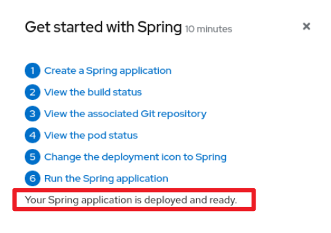
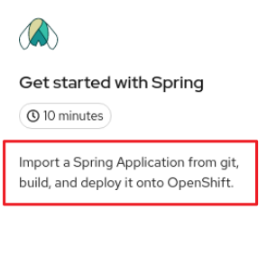
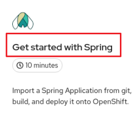
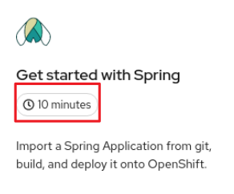
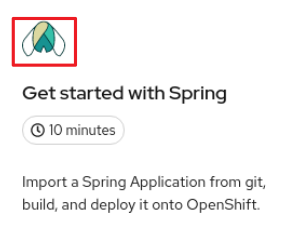
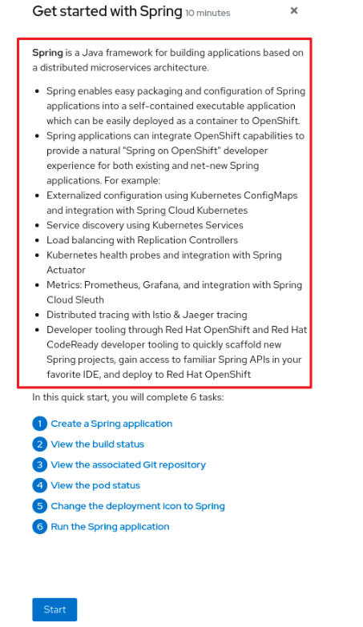

# Creating quick start tutorials in the web console { #creating-quick-start-tutorials }

If you are creating quick start tutorials for the OpenShift Container Platform web console, follow these guidelines to keep a consistent user experience across all quick starts.

## Understanding quick starts { #understanding-quick-starts_creating-quick-start-tutorials }

A quick start is a guided tutorial with user tasks. In the web console, you can access quick starts under the **Help** menu. They are especially useful for getting oriented with an application, Operator, or other product offering.

A quick start primarily consists of tasks and steps. Each task has multiple steps, and each quick start has multiple tasks. For example:

- Task 1

    - Step 1
    - Step 2
    - Step 3

- Task 2

    - Step 1
    - Step 2
    - Step 3

- Task 3

    - Step 1
    - Step 2
    - Step 3

## Quick start user workflow { #quick-start-user-workflow_creating-quick-start-tutorials }

When you interact with an existing quick start tutorial, this is the expected workflow experience:

1. In the **Administrator** or **Developer** perspective, click the **Help icon** and select **Quick Starts**.

2. Click a quick start card.

3. In the panel that is displayed, click **Start**.

4. Complete the on-screen instructions, then click **Next**.

5. In the **Check your work** module that is displayed, answer the question to confirm that you successfully completed the task.

    1. If you select **Yes**, click **Next** to continue to the next task.
    2. If you select **No**, repeat the task instructions and check your work again.

6. Repeat steps 1 through 6 above to complete the remaining tasks in the quick start.

7. After completing the final task, click **Close** to close the quick start.

## Quick start components { #quick-start-components_creating-quick-start-tutorials }

A quick start consists of the following sections:

- **Card**: The catalog tile that provides the basic information of the quick start, including title, description, time commitment, and completion status

- **Introduction**: A brief overview of the goal and tasks of the quick start

- **Task headings**: Hyper-linked titles for each task in the quick start

- **Check your work module**: A module for a user to confirm that they completed a task successfully before advancing to the next task in the quick start

- **Hints**: An animation to help users identify specific areas of the product

- **Buttons**

    - **Next and back buttons**: Buttons for navigating the steps and modules within each task of a quick start
    - **Final screen buttons**: Buttons for closing the quick start, going back to previous tasks within the quick start, and viewing all quick starts

The main content area of a quick start includes the following sections:

- **Card copy**
- **Introduction**
- **Task steps**
- **Modals and in-app messaging**
- **Check your work module**

## Contributing quick starts { #contributing-quick-starts_creating-quick-start-tutorials }

OpenShift Container Platform introduces the quick start custom resource, which is defined by a `ConsoleQuickStart` object. Operators and administrators can use this resource to contribute quick starts to the cluster.

**Prerequisites**

- You must have cluster administrator privileges.

**Procedure**

1. To create a new quick start, run:

    ```yaml
    $ oc get -o yaml consolequickstart spring-with-s2i > my-quick-start.yaml
    ```

2. Run:

    ```yaml
    $ oc create -f my-quick-start.yaml
    ```

3. Update the YAML file using the guidance outlined in this documentation.

4. Save your edits.

### Viewing the quick start API documentation { #viewing-quick-start-api-documentation_creating-quick-start-tutorials }

You can view the API documentation for the `ConsoleQuickStart` resource by using the `oc explain` command.

**Procedure**

- To see the quick start API documentation, run:

    ```terminal
    $ oc explain consolequickstarts
    ```

    Run `oc explain -h` for more information about `oc explain` usage.

### Mapping the elements in the quick start to the quick start CR { #understanding-quick-start-elements_creating-quick-start-tutorials }

These mappings show where each part of the quick start custom resource (CR) is displayed in the quick start within the web console.

#### Conclusion element { #conclusion-quick-start-element_creating-quick-start-tutorials }

```yaml title="Viewing the conclusion element in the YAML file"
...
summary:
  failed: Try the steps again.
  success: Your Spring application is running.
title: Run the Spring application
conclusion: >-
  Your Spring application is deployed and ready.
```

The `conclusion` field defines the conclusion text.

In the web console, the conclusion is displayed in the last section of the quick start.



#### Description element { #description-quick-start-element_creating-quick-start-tutorials }

```yaml title="Viewing the description element in the YAML file"
apiVersion: console.openshift.io/v1
kind: ConsoleQuickStart
metadata:
  name: spring-with-s2i
spec:
  description: 'Import a Spring Application from git, build, and deploy it onto OpenShift.'
...
```

The `description` field defines the description text.

In the web console, the description is displayed on the introductory tile of the quick start on the **Quick Starts** page.



#### The `displayName` element { #displayName-quick-start-element_creating-quick-start-tutorials }

```yaml title="Viewing the displayName element in the YAML file"
apiVersion: console.openshift.io/v1
kind: ConsoleQuickStart
metadata:
  name: spring-with-s2i
spec:
  description: 'Import a Spring Application from git, build, and deploy it onto OpenShift.'
  displayName: Get started with Spring
  durationMinutes: 10
```

The `displayName` field defines the display name text.

In the web console, the display name is displayed on the introductory tile of the quick start on the **Quick Starts** page.



#### The `durationMinutes` element { #duration-minutes-quick-start-element_creating-quick-start-tutorials }

```yaml title="Viewing the durationMinutes element in the YAML file"
apiVersion: console.openshift.io/v1
kind: ConsoleQuickStart
metadata:
  name: spring-with-s2i
spec:
  description: 'Import a Spring Application from git, build, and deploy it onto OpenShift.'
  displayName: Get started with Spring
  durationMinutes: 10
```

The `durationMinutes` field defines, in minutes, how long the quick start should take to complete.

In the web console, the duration minutes element is displayed on the introductory tile of the quick start on the **Quick Starts** page.



#### Icon element { #icon-quick-start-element_creating-quick-start-tutorials }

```yaml title="Viewing the icon element in the YAML file"
...
spec:
  description: 'Import a Spring Application from git, build, and deploy it onto OpenShift.'
  displayName: Get started with Spring
  durationMinutes: 10
  icon: >-
    data:image/svg+xml;base64,PHN2ZyB4bWxucz0iaHR0cDovL3d3dy53My5vcmcvMjAwMC9zdmciIGlkPSJMYXllcl8xIiBkYXRhLW5hbWU9IkxheWVyIDEiIHZpZXdCb3g9IjAgMCAxMDI0IDEwMjQiPjxkZWZzPjxzdHlsZT4uY2xzLTF7ZmlsbDojMTUzZDNjO30uY2xzLTJ7ZmlsbDojZDhkYTlkO30uY2xzLTN7ZmlsbDojNThjMGE4O30uY2xzLTR7ZmlsbDojZmZmO30uY2xzLTV7ZmlsbDojM2Q5MTkxO308L3N0eWxlPjwvZGVmcz48dGl0bGU+c25vd2Ryb3BfaWNvbl9yZ2JfZGVmYXVsdDwvdGl0bGU+PHBhdGggY2xhc3M9ImNscy0xIiBkPSJNMTAxMi42OSw1OTNjLTExLjEyLTM4LjA3LTMxLTczLTU5LjIxLTEwMy44LTkuNS0xMS4zLTIzLjIxLTI4LjI5LTM5LjA2LTQ3Ljk0QzgzMy41MywzNDEsNzQ1LjM3LDIzNC4xOCw2NzQsMTY4Ljk0Yy01LTUuMjYtMTAuMjYtMTAuMzEtMTUuNjUtMTUuMDdhMjQ2LjQ5LDI0Ni40OSwwLDAsMC0zNi41NS0yNi44LDE4Mi41LDE4Mi41LDAsMCwwLTIwLjMtMTEuNzcsMjAxLjUzLDIwMS41MywwLDAsMC00My4xOS0xNUExNTUuMjQsMTU1LjI0LDAsMCwwLDUyOCw5NS4yYy02Ljc2LS42OC0xMS43NC0uODEtMTQuMzktLjgxaDBsLTEuNjIsMC0xLjYyLDBhMTc3LjMsMTc3LjMsMCwwLDAtMzEuNzcsMy4zNSwyMDguMjMsMjA4LjIzLDAsMCwwLTU2LjEyLDE3LjU2LDE4MSwxODEsMCwwLDAtMjAuMjcsMTEuNzUsMjQ3LjQzLDI0Ny40MywwLDAsMC0zNi41NywyNi44MUMzNjAuMjUsMTU4LjYyLDM1NSwxNjMuNjgsMzUwLDE2OWMtNzEuMzUsNjUuMjUtMTU5LjUsMTcyLTI0MC4zOSwyNzIuMjhDOTMuNzMsNDYwLjg4LDgwLDQ3Ny44Nyw3MC41Miw0ODkuMTcsNDIuMzUsNTIwLDIyLjQzLDU1NC45LDExLjMxLDU5MywuNzIsNjI5LjIyLTEuNzMsNjY3LjY5LDQsNzA3LjMxLDE1LDc4Mi40OSw1NS43OCw4NTkuMTIsMTE4LjkzLDkyMy4wOWEyMiwyMiwwLDAsMCwxNS41OSw2LjUyaDEuODNsMS44Ny0uMzJjODEuMDYtMTMuOTEsMTEwLTc5LjU3LDE0My40OC0xNTUuNiwzLjkxLTguODgsNy45NS0xOC4wNSwxMi4yLTI3LjQzcTUuNDIsOC41NCwxMS4zOSwxNi4yM2MzMS44NSw0MC45MSw3NS4xMiw2NC42NywxMzIuMzIsNzIuNjNsMTguOCwyLjYyLDQuOTUtMTguMzNjMTMuMjYtNDkuMDcsMzUuMy05MC44NSw1MC42NC0xMTYuMTksMTUuMzQsMjUuMzQsMzcuMzgsNjcuMTIsNTAuNjQsMTE2LjE5bDUsMTguMzMsMTguOC0yLjYyYzU3LjItOCwxMDAuNDctMzEuNzIsMTMyLjMyLTcyLjYzcTYtNy42OCwxMS4zOS0xNi4yM2M0LjI1LDkuMzgsOC4yOSwxOC41NSwxMi4yLDI3LjQzLDMzLjQ5LDc2LDYyLjQyLDE0MS42OSwxNDMuNDgsMTU1LjZsMS44MS4zMWgxLjg5YTIyLDIyLDAsMCwwLDE1LjU5LTYuNTJjNjMuMTUtNjQsMTAzLjk1LTE0MC42LDExNC44OS0yMTUuNzhDMTAyNS43Myw2NjcuNjksMTAyMy4yOCw2MjkuMjIsMTAxMi42OSw1OTNaIi8+PHBhdGggY2xhc3M9ImNscy0yIiBkPSJNMzY0LjE1LDE4NS4yM2MxNy44OS0xNi40LDM0LjctMzAuMTUsNDkuNzctNDAuMTFhMjEyLDIxMiwwLDAsMSw2NS45My0yNS43M0ExOTgsMTk4LDAsMCwxLDUxMiwxMTYuMjdhMTk2LjExLDE5Ni4xMSwwLDAsMSwzMiwzLjFjNC41LjkxLDkuMzYsMi4wNiwxNC41MywzLjUyLDYwLjQxLDIwLjQ4LDg0LjkyLDkxLjA1LTQ3LjQ0LDI0OC4wNi0yOC43NSwzNC4xMi0xNDAuNywxOTQuODQtMTg0LjY2LDI2OC40MmE2MzAuODYsNjMwLjg2LDAsMCwwLTMzLjIyLDU4LjMyQzI3Niw2NTUuMzQsMjY1LjQsNTk4LDI2NS40LDUyMC4yOSwyNjUuNCwzNDAuNjEsMzExLjY5LDI0MC43NCwzNjQuMTUsMTg1LjIzWiIvPjxwYXRoIGNsYXNzPSJjbHMtMyIgZD0iTTUyNy41NCwzODQuODNjODQuMDYtOTkuNywxMTYuMDYtMTc3LjI4LDk1LjIyLTIzMC43NCwxMS42Miw4LjY5LDI0LDE5LjIsMzcuMDYsMzEuMTMsNTIuNDgsNTUuNSw5OC43OCwxNTUuMzgsOTguNzgsMzM1LjA3LDAsNzcuNzEtMTAuNiwxMzUuMDUtMjcuNzcsMTc3LjRhNjI4LjczLDYyOC43MywwLDAsMC0zMy4yMy01OC4zMmMtMzktNjUuMjYtMTMxLjQ1LTE5OS0xNzEuOTMtMjUyLjI3QzUyNi4zMywzODYuMjksNTI3LDM4NS41Miw1MjcuNTQsMzg0LjgzWiIvPjxwYXRoIGNsYXNzPSJjbHMtNCIgZD0iTTEzNC41OCw5MDguMDdoLS4wNmEuMzkuMzksMCwwLDEtLjI3LS4xMWMtMTE5LjUyLTEyMS4wNy0xNTUtMjg3LjQtNDcuNTQtNDA0LjU4LDM0LjYzLTQxLjE0LDEyMC0xNTEuNiwyMDIuNzUtMjQyLjE5LTMuMTMsNy02LjEyLDE0LjI1LTguOTIsMjEuNjktMjQuMzQsNjQuNDUtMzYuNjcsMTQ0LjMyLTM2LjY3LDIzNy40MSwwLDU2LjUzLDUuNTgsMTA2LDE2LjU5LDE0Ny4xNEEzMDcuNDksMzA3LjQ5LDAsMCwwLDI4MC45MSw3MjNDMjM3LDgxNi44OCwyMTYuOTMsODkzLjkzLDEzNC41OCw5MDguMDdaIi8+PHBhdGggY2xhc3M9ImNscy01IiBkPSJNNTgzLjQzLDgxMy43OUM1NjAuMTgsNzI3LjcyLDUxMiw2NjQuMTUsNTEyLDY2NC4xNXMtNDguMTcsNjMuNTctNzEuNDMsMTQ5LjY0Yy00OC40NS02Ljc0LTEwMC45MS0yNy41Mi0xMzUuNjYtOTEuMThhNjQ1LjY4LDY0NS42OCwwLDAsMSwzOS41Ny03MS41NGwuMjEtLjMyLjE5LS4zM2MzOC02My42MywxMjYuNC0xOTEuMzcsMTY3LjEyLTI0NS42Niw0MC43MSw1NC4yOCwxMjkuMSwxODIsMTY3LjEyLDI0NS42NmwuMTkuMzMuMjEuMzJhNjQ1LjY4LDY0NS42OCwwLDAsMSwzOS41Nyw3MS41NEM2ODQuMzQsNzg2LjI3LDYzMS44OCw4MDcuMDUsNTgzLjQzLDgxMy43OVoiLz48cGF0aCBjbGFzcz0iY2xzLTQiIGQ9Ik04ODkuNzUsOTA4YS4zOS4zOSwwLDAsMS0uMjcuMTFoLS4wNkM4MDcuMDcsODkzLjkzLDc4Nyw4MTYuODgsNzQzLjA5LDcyM2EzMDcuNDksMzA3LjQ5LDAsMCwwLDIwLjQ1LTU1LjU0YzExLTQxLjExLDE2LjU5LTkwLjYxLDE2LjU5LTE0Ny4xNCwwLTkzLjA4LTEyLjMzLTE3My0zNi42Ni0yMzcuNHEtNC4yMi0xMS4xNi04LjkzLTIxLjdjODIuNzUsOTAuNTksMTY4LjEyLDIwMS4wNSwyMDIuNzUsMjQyLjE5QzEwNDQuNzksNjIwLjU2LDEwMDkuMjcsNzg2Ljg5LDg4OS43NSw5MDhaIi8+PC9zdmc+Cg==
...
```

The `icon` field defines the icon as a base64 value.

In the web console, the icon is displayed on the introductory tile of the quick start on the **Quick Starts** page.



#### Introduction element { #introduction-quick-start-element_creating-quick-start-tutorials }

```yaml title="Viewing the introduction element in the YAML file"
...
  introduction: >-
    **Spring** is a Java framework for building applications based on a distributed microservices architecture.

    - Spring enables easy packaging and configuration of Spring applications into a self-contained executable application which can be easily deployed as a container to OpenShift.

    - Spring applications can integrate OpenShift capabilities to provide a natural "Spring on OpenShift" developer experience for both existing and net-new Spring applications. For example:

    - Externalized configuration using Kubernetes ConfigMaps and integration with Spring Cloud Kubernetes

    - Service discovery using Kubernetes Services

    - Load balancing with Replication Controllers

    - Kubernetes health probes and integration with Spring Actuator

    - Metrics: Prometheus, Grafana, and integration with Spring Cloud Sleuth

    - Distributed tracing with Istio

    - Developer tooling through Red Hat OpenShift and Red Hat CodeReady developer tooling to quickly scaffold new Spring projects, gain access to familiar Spring APIs in your favorite IDE, and deploy to Red Hat OpenShift
...
```

The `introduction` field introduces the quick start and lists the tasks within it.

In the web console, after you click a quick start card, a side panel slides in that introduces the quick start and lists the tasks within it.



### Adding a custom icon to a quick start { #adding-custom-icon-to-quick-start_creating-quick-start-tutorials }

A default icon is provided for all quick starts. You can provide your own custom icon.

**Procedure**

1. Find the `.svg` file that you want to use as your custom icon.

2. Use an [online tool to convert the text to base64](https://cryptii.com/pipes/text-to-base64).

3. In the YAML file, add `icon: >-`, then on the next line include `data:image/svg+xml;base64` followed by the output from the base64 conversion. For example:

    ```yaml
    icon: >-
       data:image/svg+xml;base64,PHN2ZyB4bWxucz0iaHR0cDovL3d3dy53My5vcmcvMjAwMC9zdmciIHJvbGU9ImltZyIgdmlld.
    ```

### Limiting access to a quick start { #limiting-access-to-quick-starts_creating-quick-start-tutorials }

Not all quick starts should be available for everyone. The `accessReviewResources` section of the YAML file provides the ability to limit access to the quick start.

To only allow the user to access the quick start if they have the ability to create `HelmChartRepository` resources, use the following configuration:

```yaml
accessReviewResources:
  - group: helm.openshift.io
    resource: helmchartrepositories
    verb: create
```

To only allow the user to access the quick start if they have the ability to list Operator groups and package manifests, thus ability to install Operators, use the following configuration:

```yaml
accessReviewResources:
  - group: operators.coreos.com
    resource: operatorgroups
    verb: list
  - group: packages.operators.coreos.com
    resource: packagemanifests
    verb: list
```

### Linking to other quick starts { #linking-to-other-quick-starts_creating-quick-start-tutorials }

You can link a quick start to another quick start by setting the `nextQuickStart` field.

In the `nextQuickStart` section of the YAML file, enter the `name`, not the `displayName`, of the quick start to which you want to link. For example:

```yaml
nextQuickStart:
  - add-healthchecks
```

### Supported tags for quick starts { #supported-tags-for-quick-starts_creating-quick-start-tutorials }

Write your quick start content in markdown using these tags. The markdown is converted to HTML.

| Tag         | Description                           |
| ----------- | ------------------------------------- |
| `'b',`      | Defines bold text.                    |
| `'img',`    | Embeds an image.                      |
| `'i',`      | Defines italic text.                  |
| `'strike',` | Defines strike-through text.          |
| `'s',`      | Defines smaller text                  |
| `'del',`    | Defines smaller text.                 |
| `'em',`     | Defines emphasized text.              |
| `'strong',` | Defines important text.               |
| `'a',`      | Defines an anchor tag.                |
| `'p',`      | Defines paragraph text.               |
| `'h1',`     | Defines a level 1 heading.            |
| `'h2',`     | Defines a level 2 heading.            |
| `'h3',`     | Defines a level 3 heading.            |
| `'h4',`     | Defines a level 4 heading.            |
| `'ul',`     | Defines an unordered list.            |
| `'ol',`     | Defines an ordered list.              |
| `'li',`     | Defines a list item.                  |
| `'code',`   | Defines a text as code.               |
| `'pre',`    | Defines a block of preformatted text. |
| `'button',` | Defines a button in text.             |

### Quick start highlighting markdown reference { #quick-start-highlighting-reference_creating-quick-start-tutorials }

You can use highlighting, or hints, in a quick start to add a link that highlights and animates a component of the web console.

The markdown syntax contains:

- Bracketed link text
- The `highlight` keyword, followed by the ID of the element that you want to animate

#### Perspective switcher { #quick-start-highlighting-perspective-switcher_creating-quick-start-tutorials }

```text
[Perspective switcher]{{highlight qs-perspective-switcher}}
```

#### Administrator perspective navigation links { #quick-start-highlighting-admin-perspective_creating-quick-start-tutorials }

```text
[Home]{{highlight qs-nav-home}}
[Operators]{{highlight qs-nav-operators}}
[Workloads]{{highlight qs-nav-workloads}}
[Serverless]{{highlight qs-nav-serverless}}
[Networking]{{highlight qs-nav-networking}}
[Storage]{{highlight qs-nav-storage}}
[Service catalog]{{highlight qs-nav-servicecatalog}}
[Compute]{{highlight qs-nav-compute}}
[User management]{{highlight qs-nav-usermanagement}}
[Administration]{{highlight qs-nav-administration}}
```

#### Developer perspective navigation links { #quick-start-highlighting-dev-perspective_creating-quick-start-tutorials }

```text
[Add]{{highlight qs-nav-add}}
[Topology]{{highlight qs-nav-topology}}
[Search]{{highlight qs-nav-search}}
[Project]{{highlight qs-nav-project}}
[Helm]{{highlight qs-nav-helm}}
```

#### Common navigation links { #quick-start-highlighting-common-nav_creating-quick-start-tutorials }

```text
[Builds]{{highlight qs-nav-builds}}
[Pipelines]{{highlight qs-nav-pipelines}}
[Monitoring]{{highlight qs-nav-monitoring}}
```

#### Masthead links { #quick-start-highlighting-masthead-links_creating-quick-start-tutorials }

```text
[CloudShell]{{highlight qs-masthead-cloudshell}}
[Utility Menu]{{highlight qs-masthead-utilitymenu}}
[User Menu]{{highlight qs-masthead-usermenu}}
[Applications]{{highlight qs-masthead-applications}}
[Import]{{highlight qs-masthead-import}}
[Help]{{highlight qs-masthead-help}}
[Notifications]{{highlight qs-masthead-notifications}}
```

### Code snippet markdown reference { #quick-starts-accessing-and-executing-code-snippets_creating-quick-start-tutorials }

Embed executable and copyable CLI code snippets in a quick start using this markdown syntax. Executing a snippet requires the Web Terminal Operator; copying works with or without it installed.

#### Syntax for inline code snippets { #quick-starts-syntax-for-inline-code-snippets_creating-quick-start-tutorials }

```
`code block`{{copy}}
`code block`{{execute}}
```

!!! note

    If the `execute` syntax is used, the **Copy to clipboard** action is present whether you have the Web Terminal Operator installed or not.

#### Syntax for multi-line code snippets { #quick-starts-syntax-for-multi-line-code-snippets_creating-quick-start-tutorials }

````
```
multi line code block
```{{copy}}

```
multi line code block
```{{execute}}
````

## Quick start content guidelines { #quick-start-content-guidelines_creating-quick-start-tutorials }

Follow these content guidelines when writing quick starts for the OpenShift Container Platform web console.

### Card copy { #quick-start-content-guidelines-card-copy_creating-quick-start-tutorials }

You can customize the title and description on a quick start card, but you cannot customize the status.

- Keep your description to one to two sentences.

- Start with a verb and communicate the goal of the user. Correct example:

    ```
    Create a serverless application.
    ```

### Introduction { #quick-start-content-guidelines-introduction_creating-quick-start-tutorials }

After clicking a quick start card, a side panel slides in that introduces the quick start and lists the tasks within it.

- Make your introduction content clear, concise, informative, and friendly.

- State the outcome of the quick start. A user should understand the purpose of the quick start before they begin.

- Give action to the user, not the quick start.

    - **Correct example**:

        ```
        In this quick start, you will deploy a sample application to {product-title}.
        ```

    - **Incorrect example**:

        ```
        This quick start shows you how to deploy a sample application to {product-title}.
        ```

- The introduction should be a maximum of four to five sentences, depending on the complexity of the feature. A long introduction can overwhelm the user.

- List the quick start tasks after the introduction content, and start each task with a verb. Do not specify the number of tasks because the copy would need to be updated every time a task is added or removed.

    - **Correct example**:

        ```
        Tasks to complete: Create a serverless application; Connect an event source; Force a new revision
        ```

    - **Incorrect example**:

        ```
        You will complete these 3 tasks: Creating a serverless application; Connecting an event source; Forcing a new revision
        ```

### Task steps { #quick-start-content-guidelines-task-steps_creating-quick-start-tutorials }

After the user clicks **Start**, a series of steps is displayed that they must perform to complete the quick start.

Follow these general guidelines when writing task steps:

- Use "Click" for buttons and labels. Use "Select" for checkboxes, radio buttons, and drop-down menus.

- Use "Click" by itself. Do not add "on" after it.

    - **Correct example**:

        ```
        Click OK.
        ```

    - **Incorrect example**:

        ```
        Click on the OK button.
        ```

- Tell users how to navigate between **Administrator** and **Developer** perspectives. Even if you think a user might already be in the appropriate perspective, give them instructions on how to get there so that they are definitely where they need to be.

    Examples:

    ```
    Enter the Developer perspective: In the main navigation, click the dropdown menu and select Developer.
    Enter the Administrator perspective: In the main navigation, click the dropdown menu and select Admin.
    ```

- Use the "Location, action" structure. Tell a user where to go before telling them what to do.

    - **Correct example**:

        ```
        In the node.js deployment, hover over the icon.
        ```

    - **Incorrect example**:

        ```
        Hover over the icon in the node.js deployment.
        ```

- Keep your product terminology capitalization consistent.

- If you must specify a menu type or list as a dropdown, write "dropdown” as one word without a hyphen.

- Clearly distinguish between a user action and additional information on product functionality.

    - **User action**:

        ```
        Change the time range of the dashboard by clicking the dropdown menu and selecting time range.
        ```

    - **Additional information**:

        ```
        To look at data in a specific time frame, you can change the time range of the dashboard.
        ```

- Avoid directional language, such as "In the upper-right corner, click the icon". Directional language becomes outdated every time UI layouts change. Also, a direction for desktop users might not be accurate for users with a different screen size. Instead, identify something using its name.

    - **Correct example**:

        ```
        In the navigation menu, click Settings.
        ```

    - **Incorrect example**:

        ```
        In the left-hand menu, click Settings.
        ```

- Do not identify items by color alone, such as "Click the gray circle". Color identifiers are not useful for sight-limited users, especially colorblind users. Instead, identify an item using its name or copy, such as button copy.

    - **Correct example**:

        ```
        The success message indicates a connection.
        ```

    - **Incorrect example**:

        ```
        The message with a green icon indicates a connection.
        ```

- Use the second-person point of view, you, consistently:

    - **Correct example**:

        ```
        Set up your environment.
        ```

    - **Incorrect example**:

        ```
        Let's set up our environment.
        ```

### Check your work module { #quick-start-content-guidelines-check-your-work-module_creating-quick-start-tutorials }

- After a user completes a step, a **Check your work** module displays. This module prompts the user to answer a yes or no question about the step results, which gives them the opportunity to review their work. For this module, you only need to write a single yes or no question.

    - If the user answers **Yes**, a checkmark displays.
    - If the user answers **No**, an error message displays with a link to relevant documentation, if necessary. The user then has the opportunity to go back and try again.

### Formatting UI elements { #quick-start-content-guidelines-formatting-UI-elements_creating-quick-start-tutorials }

Format UI elements by using these guidelines:

- Copy for buttons, dropdowns, tabs, fields, and other UI controls: Write the copy as it is displayed in the UI and bold it.
- All other UI elements (including page, window, and panel names): Write the copy as it is displayed in the UI and bold it.
- Code or user-entered text: Use monospaced font.
- Hints: If a hint to a navigation or masthead element is included, style the text as you would a link.
- CLI commands: Use monospaced font.
- In running text, use a bold, monospaced font for a command.
- If a parameter or option is a variable value, use an italic monospaced font.
- Use a bold, monospaced font for the parameter and a monospaced font for the option.

**Additional resources**

- [PatternFly’s brand voice and tone guidelines](https://www.patternfly.org/ux-writing/brand-voice-and-tone)
- [PatternFly’s UX writing style guide](https://www.patternfly.org/ux-writing/about)
