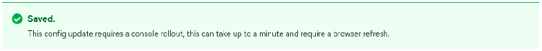

# Customizing the web console in OpenShift Container Platform { #customizing-web-console }

You can customize the OpenShift Container Platform web console to set a custom logo, product name, links, notifications, and command-line downloads. This is especially helpful if you need to tailor the web console to meet specific corporate or government requirements.

## Adding a custom logo and product name { #adding-a-custom-logo_customizing-web-console }

You can create custom branding by adding a custom logo or custom product name. You can set both or one without the other, as these settings are independent of each other.

**Prerequisites**

- You must have administrator privileges.
- Create a file of the logo that you want to use. The logo can be a file in any common image format, including GIF, JPG, PNG, or SVG, and is constrained to a `max-height` of `60px`. Image size must not exceed 1 MB due to constraints on the `ConfigMap` object size.

**Procedure**

1. Import your logo file into a config map in the `openshift-config` namespace:

    ```terminal
    $ oc create configmap console-custom-logo --from-file /path/to/console-custom-logo.png -n openshift-config
    ```

    !!! tip

        You can alternatively apply the following YAML to create the config map:

        ```yaml
        apiVersion: v1
        kind: ConfigMap
        metadata:
          name: console-custom-logo
          namespace: openshift-config
        binaryData:
          console-custom-logo.png: <base64-encoded_logo> ...
        ```

        Replace `<base64-encoded_logo>` with a base64-encoded string of the logo.

2. Edit the web console’s Operator configuration to include `customLogoFile` and `customProductName`:

    ```terminal
    $ oc edit consoles.operator.openshift.io cluster
    ```

    ```yaml
    apiVersion: operator.openshift.io/v1
    kind: Console
    metadata:
      name: cluster
    spec:
      customization:
        customLogoFile:
          key: console-custom-logo.png
          name: console-custom-logo
        customProductName: My Console
    ```

    Once the Operator configuration is updated, it will sync the custom logo config map into the console namespace, mount it to the console pod, and redeploy.

3. Check for success. If there are any issues, the console cluster Operator will report a `Degraded` status, and the console Operator configuration will also report a `CustomLogoDegraded` status, but with reasons such as `KeyOrFilenameInvalid` or `NoImageProvided`.

    To check the `clusteroperator`, run:

    ```terminal
    $ oc get clusteroperator console -o yaml
    ```

    To check the console Operator configuration, run:

    ```terminal
    $ oc get consoles.operator.openshift.io -o yaml
    ```

## Creating custom links in the web console { #creating-custom-links_customizing-web-console }

You can create a `ConsoleLink` custom resource to add a link to the help menu, user menu, application menu, or namespace dashboard in the web console.

**Prerequisites**

- You must have administrator privileges.

**Procedure**

1. From **Administration** → **Custom Resource Definitions**, click **ConsoleLink**.

2. Select the **Instances** tab.

3. Click **Create Console Link** and edit the file:

    ```yaml
    apiVersion: console.openshift.io/v1
    kind: ConsoleLink
    metadata:
      name: example
    spec:
      href: 'https://www.example.com'
      location: HelpMenu
      text: Link 1
    ```

    The `location` field accepts `HelpMenu`, `UserMenu`, `ApplicationMenu`, or `NamespaceDashboard`.

    To make the custom link appear in all namespaces, follow this example:

    ```yaml
    apiVersion: console.openshift.io/v1
    kind: ConsoleLink
    metadata:
      name: namespaced-dashboard-link-for-all-namespaces
    spec:
      href: 'https://www.example.com'
      location: NamespaceDashboard
      text: This appears in all namespaces
    ```

    To make the custom link appear in only some namespaces, follow this example:

    ```yaml
    apiVersion: console.openshift.io/v1
    kind: ConsoleLink
    metadata:
      name: namespaced-dashboard-for-some-namespaces
    spec:
      href: 'https://www.example.com'
      location: NamespaceDashboard
      # This text will appear in a box called "Launcher" under "namespace" or "project" in the web console
      text: Custom Link Text
      namespaceDashboard:
        namespaces:
        # for these specific namespaces
        - my-namespace
        - your-namespace
        - other-namespace
    ```

    To make the custom link appear in the application menu, follow this example:

    ```yaml
    apiVersion: console.openshift.io/v1
    kind: ConsoleLink
    metadata:
      name: application-menu-link-1
    spec:
      href: 'https://www.example.com'
      location: ApplicationMenu
      text: Link 1
      applicationMenu:
        section: My New Section
        # image that is 24x24 in size
        imageURL: https://via.placeholder.com/24
    ```

4. Click **Save** to apply your changes.

## Console and download route customization { #customizing-console-and-download-routes-overview_customizing-web-console }

You can customize the `console` and `downloads` routes by using the `ingress` config route configuration API. Using this API centralizes route configuration for both routes and takes precedence over the deprecated `console-operator` config method.

If the `console` custom route is configured in both the `ingress` config and the `console-operator` config, the `ingress` config custom route configuration takes precedence. Configuring custom routes through the `console-operator` config is deprecated.

## Customizing the console route { #customizing-the-console-route_customizing-web-console }

You can customize the console route by setting the custom hostname and TLS certificate in the `spec.componentRoutes` field of the cluster `Ingress` configuration.

**Prerequisites**

- You have logged in to the cluster as a user with administrative privileges.

- You have created a secret in the `openshift-config` namespace containing the TLS certificate and key. This is required if the domain for the custom hostname suffix does not match the cluster domain suffix. The secret is optional if the suffix matches.

    !!! tip

        You can create a TLS secret by using the `oc create secret tls` command.

**Procedure**

1. Edit the cluster `Ingress` configuration:

    ```terminal
    $ oc edit ingress.config.openshift.io cluster
    ```

2. Set the custom hostname and optionally the serving certificate and key:

    ```yaml
    apiVersion: config.openshift.io/v1
    kind: Ingress
    metadata:
      name: cluster
    spec:
      componentRoutes:
        - name: console
          namespace: openshift-console
          hostname: <custom_hostname>
          servingCertKeyPairSecret:
            name: <secret_name>
    ```

    The `hostname` field specifies the custom hostname. The `servingCertKeyPairSecret.name` field references a secret in the `openshift-config` namespace that contains a TLS certificate (`tls.crt`) and key (`tls.key`). This is required if the domain for the custom hostname suffix does not match the cluster domain suffix. The secret is optional if the suffix matches.

3. Save the file to apply the changes.

    !!! note

        Add a DNS record for the custom console route that points to the application ingress load balancer.

## Customizing the download route { #customizing-the-download-route_customizing-web-console }

You can customize the download route by setting the custom hostname and TLS certificate in the `spec.componentRoutes` field of the cluster `Ingress` configuration.

**Prerequisites**

- You have logged in to the cluster as a user with administrative privileges.

- You have created a secret in the `openshift-config` namespace containing the TLS certificate and key. This is required if the domain for the custom hostname suffix does not match the cluster domain suffix. The secret is optional if the suffix matches.

    !!! tip

        You can create a TLS secret by using the `oc create secret tls` command.

**Procedure**

1. Edit the cluster `Ingress` configuration:

    ```terminal
    $ oc edit ingress.config.openshift.io cluster
    ```

2. Set the custom hostname and optionally the serving certificate and key:

    ```yaml
    apiVersion: config.openshift.io/v1
    kind: Ingress
    metadata:
      name: cluster
    spec:
      componentRoutes:
        - name: downloads
          namespace: openshift-console
          hostname: <custom_hostname>
          servingCertKeyPairSecret:
            name: <secret_name>
    ```

    The `hostname` field specifies the custom hostname. The `servingCertKeyPairSecret.name` field references a secret in the `openshift-config` namespace that contains a TLS certificate (`tls.crt`) and key (`tls.key`). This is required if the domain for the custom hostname suffix does not match the cluster domain suffix. The secret is optional if the suffix matches.

3. Save the file to apply the changes.

    !!! note

        Add a DNS record for the custom downloads route that points to the application ingress load balancer.

## Customizing the login page { #customizing-the-login-page_customizing-web-console }

You can customize the login page to display Terms of Service information or apply custom branding for third-party login providers.

Custom login pages can also be helpful if you use a third-party login provider, such as GitHub or Google, to show users a branded page that they trust and expect before being redirected to the authentication provider. You can also render custom error pages during the authentication process.

!!! note

    Customizing the error template is limited to identity providers (IDPs) that use redirects, such as request header and OIDC-based IDPs. It does not have an effect on IDPs that use direct password authentication, such as LDAP and htpasswd.

**Prerequisites**

- You must have administrator privileges.

**Procedure**

1. Run the following commands to create templates you can modify:

    ```terminal
    $ oc adm create-login-template > login.html
    ```

    ```terminal
    $ oc adm create-provider-selection-template > providers.html
    ```

    ```terminal
    $ oc adm create-error-template > errors.html
    ```

2. Create the secrets:

    ```terminal
    $ oc create secret generic login-template --from-file=login.html -n openshift-config
    ```

    ```terminal
    $ oc create secret generic providers-template --from-file=providers.html -n openshift-config
    ```

    ```terminal
    $ oc create secret generic error-template --from-file=errors.html -n openshift-config
    ```

3. Run:

    ```terminal
    $ oc edit oauths cluster
    ```

4. Update the specification:

    ```yaml
    apiVersion: config.openshift.io/v1
    kind: OAuth
    metadata:
      name: cluster
    # ...
    spec:
      templates:
        error:
            name: error-template
        login:
            name: login-template
        providerSelection:
            name: providers-template
    ```

    Run `oc explain oauths.spec.templates` to understand the options.

## Defining a template for an external log link { #defining-template-for-external-log-links_customizing-web-console }

If you are connected to a service that helps you browse your logs, but you need to generate URLs in a particular way, then you can define a template for your link.

**Prerequisites**

- You must have administrator privileges.

**Procedure**

1. From **Administration** → **Custom Resource Definitions**, click **ConsoleExternalLogLink**.

2. Select the **Instances** tab.

3. Click **Create Console External Log Link** and edit the file:

    ```yaml
    apiVersion: console.openshift.io/v1
    kind: ConsoleExternalLogLink
    metadata:
      name: example
    spec:
      hrefTemplate: >-
        https://example.com/logs?resourceName=${resourceName}&containerName=${containerName}&resourceNamespace=${resourceNamespace}&podLabels=${podLabels}
      text: Example Logs
    ```

## Creating custom notification banners { #creating-custom-notification-banners_customizing-web-console }

You can create a `ConsoleNotification` custom resource to display a banner at the top or bottom of every page in the web console.

**Prerequisites**

- You must have administrator privileges.

**Procedure**

1. From **Administration** → **Custom Resource Definitions**, click **ConsoleNotification**.

2. Select the **Instances** tab.

3. Click **Create Console Notification** and edit the file:

    ```yaml
    apiVersion: console.openshift.io/v1
    kind: ConsoleNotification
    metadata:
      name: example
    spec:
      text: This is an example notification message with an optional link.
      location: BannerTop
      link:
        href: 'https://www.example.com'
        text: Optional link text
      color: '#fff'
      backgroundColor: '#0088ce'
    ```

    The `location` field accepts `BannerTop`, `BannerBottom`, or `BannerTopBottom`.

4. Click **Create** to apply your changes.

## Customizing CLI downloads { #creating-custom-CLI-downloads_customizing-web-console }

You can configure links for downloading the CLI with custom link text and URLs, which can point directly to file packages or to an external page that provides the packages.

**Prerequisites**

- You must have administrator privileges.

**Procedure**

1. Navigate to **Administration** → **Custom Resource Definitions**.

2. Select **ConsoleCLIDownload** from the list of Custom Resource Definitions (CRDs).

3. Click the **YAML** tab, and then make your edits:

    ```yaml
    apiVersion: console.openshift.io/v1
    kind: ConsoleCLIDownload
    metadata:
      name: example-cli-download-links
    spec:
      description: |
        This is an example of download links
      displayName: example
      links:
      - href: 'https://www.example.com/public/example.tar'
        text: example for linux
      - href: 'https://www.example.com/public/example.mac.zip'
        text: example for mac
      - href: 'https://www.example.com/public/example.win.zip'
        text: example for windows
    ```

4. Click the **Save** button.

## Adding YAML examples to Kubernetes resources { #adding-yaml-examples-to-kube-resources_customizing-web-console }

You can dynamically add YAML examples to any Kubernetes resources at any time.

**Prerequisites**

- You must have cluster administrator privileges.

**Procedure**

1. From **Administration** → **Custom Resource Definitions**, click **ConsoleYAMLSample**.

2. Click **YAML** and edit the file:

    ```yaml
    apiVersion: console.openshift.io/v1
    kind: ConsoleYAMLSample
    metadata:
      name: example
    spec:
      targetResource:
        apiVersion: batch/v1
        kind: Job
      title: Example Job
      description: An example Job YAML sample
      yaml: |
        apiVersion: batch/v1
        kind: Job
        metadata:
          name: countdown
        spec:
          template:
            metadata:
              name: countdown
            spec:
              containers:
              - name: counter
                image: centos:7
                command:
                - "bin/bash"
                - "-c"
                - "for i in 9 8 7 6 5 4 3 2 1 ; do echo $i ; done"
              restartPolicy: Never
    ```

    Use `spec.snippet` to indicate that the YAML sample is not the full YAML resource definition, but a fragment that can be inserted into the existing YAML document at the user’s cursor.

3. Click **Save**.

## Customizing user perspectives { #odc-customizing-user-perspectives_customizing-web-console }

As a cluster administrator, you can show or hide OpenShift Container Platform web console perspectives, such as **Administrator** and **Developer**, for all users or for a specific user role. This lets you limit each user’s view to only the perspectives and cluster resources that are relevant to their role.

By default, the web console provides the **Administrator** and **Developer** perspectives, though more might be available depending on installed console plugins. For example, you can hide the **Administrator** perspective from unprivileged users so that they cannot manage cluster resources, users, and projects, or show the **Developer** perspective to users with the developer role so that they can create, deploy, and monitor applications.

You can also customize the perspective visibility for users based on role-based access control (RBAC). For example, if you customize a perspective for monitoring purposes, which requires specific permissions, you can define that the perspective is visible only to users with required permissions.

Each perspective includes the following mandatory parameters, which you can edit in the YAML view:

- `id`: Defines the ID of the perspective to show or hide
- `visibility`: Defines the state of the perspective along with access review checks, if needed
- `state`: Defines whether the perspective is enabled, disabled, or needs an access review check

!!! note

    By default, all perspectives are enabled. When you customize the user perspective, your changes are applicable to the entire cluster.

### Customizing a perspective using YAML view { #odc-customizing-a-perspective-using-YAML-view_customizing-web-console }

You can customize the visibility of a perspective in the web console by using the YAML view.

**Prerequisites**

- You must have administrator privileges.

**Procedure**

1. In the **Administrator** perspective, navigate to **Administration** → **Cluster Settings**.

2. Select the **Configuration** tab and click the **Console (operator.openshift.io)** resource.

3. Click the **YAML** tab and make your customization:

    1. To enable or disable a perspective, insert the snippet for **Add user perspectives** and edit the YAML code as needed:

        ```yaml
        apiVersion: operator.openshift.io/v1
        kind: Console
        metadata:
          name: cluster
        spec:
          customization:
            perspectives:
              - id: admin
                visibility:
                  state: Enabled
              - id: dev
                visibility:
                  state: Enabled
        ```

    2. To hide a perspective based on RBAC permissions, insert the snippet for **Hide user perspectives** and edit the YAML code as needed:

        ```yaml
        apiVersion: operator.openshift.io/v1
        kind: Console
        metadata:
          name: cluster
        spec:
          customization:
            perspectives:
              - id: admin
                requiresAccessReview:
                  - group: rbac.authorization.k8s.io
                    resource: clusterroles
                    verb: list
              - id: dev
                state: Enabled
        ```

    3. To customize a perspective based on your needs, create your own YAML snippet:

        ```yaml
        apiVersion: operator.openshift.io/v1
        kind: Console
        metadata:
          name: cluster
        spec:
          customization:
            perspectives:
              - id: admin
                visibility:
                  state: AccessReview
                  accessReview:
                    missing:
                      - resource: deployment
                        verb: list
                    required:
                      - resource: namespaces
                        verb: list
              - id: dev
                visibility:
                  state: Enabled
        ```

4. Click **Save**.

### Customizing a perspective using form view { #odc-customizing-a-perspective-using-form-view_customizing-web-console }

You can customize the visibility of a perspective in the web console by using the form view.

**Prerequisites**

- You must have administrator privileges.

**Procedure**

1. In the **Administrator** perspective, navigate to **Administration** → **Cluster Settings**.

2. Select the **Configuration** tab and click the **Console (operator.openshift.io)** resource.

3. Click **Actions** → **Customize** on the right side of the page.

4. In the **General** settings, customize the perspective by selecting one of the following options from the dropdown list:

    - **Enabled**: Enables the perspective for all users

    - **Only visible for privileged users**: Enables the perspective for users who can list all namespaces

    - **Only visible for unprivileged users**: Enables the perspective for users who cannot list all namespaces

    - **Disabled**: Disables the perspective for all users

        A notification opens to confirm that your changes are saved.

        !!! note

            When you customize the user perspective, your changes are automatically saved and take effect after a browser refresh.

## Developer catalog and sub-catalog customization { #odc_con_customizing-a-developer-catalog-or-its-sub-catalogs_customizing-web-console }

As a cluster administrator, you have the ability to organize and manage the Developer catalog or its sub-catalogs. You can enable or disable the sub-catalog types or disable the entire developer catalog.

The `developerCatalog.types` object includes the following parameters that you must define in a snippet to use them in the YAML view:

- `state`: Defines if a list of developer catalog types should be enabled or disabled.
- `enabled`: Defines a list of developer catalog types (sub-catalogs) that are visible to users.
- `disabled`: Defines a list of developer catalog types (sub-catalogs) that are not visible to users.

You can enable or disable the following developer catalog types (sub-catalogs) using the YAML view or the form view.

- `Builder Images`
- `Templates`
- `Devfiles`
- `Samples`
- `Helm Charts`
- `Event Sources`
- `Event Sinks`
- `Operator Backed`

### Customizing a developer catalog or its sub-catalogs using the YAML view { #odc_customizing-a-developer-catalog-or-its-sub-catalogs-using-the-yaml-view_customizing-web-console }

You can customize a developer catalog by editing the YAML content in the YAML view.

**Prerequisites**

- An OpenShift web console session with cluster administrator privileges.

**Procedure**

1. In the **Administrator** perspective of the web console, navigate to **Administration** → **Cluster Settings**.

2. Select the **Configuration** tab, click the **Console (operator.openshift.io)** resource and view the **Details** page.

3. Click the **YAML** tab to open the editor and edit the YAML content as needed.

    For example, to disable a developer catalog type, insert the following snippet that defines a list of disabled developer catalog resources:

    ```yaml
    apiVersion: operator.openshift.io/v1
    kind: Console
    metadata:
      name: cluster
    ...
    spec:
      customization:
        developerCatalog:
          categories:
          types:
            state: Disabled
            disabled:
              - BuilderImage
              - Devfile
              - HelmChart
    ...
    ```

4. Click **Save**.

    !!! note

        By default, the developer catalog types are enabled in the Administrator view of the Web Console.

### Customizing a developer catalog or its sub-catalogs using the form view { #odc_customizing-a-developer-catalog-or-its-sub-catalogs-using-the-form-view_customizing-web-console }

You can customize a developer catalog by using the form view in the Web Console.

**Prerequisites**

- An OpenShift web console session with cluster administrator privileges.
- The Developer perspective is enabled.

**Procedure**

1. In the **Administrator** perspective, navigate to **Administration** → **Cluster Settings**.

2. Select the **Configuration** tab and click the **Console (operator.openshift.io)** resource.

3. Click **Actions** → **Customize**.

4. Enable or disable items in the **Pre-pinned navigation items**, **Add page**, and **Developer Catalog** sections.

    **Verification**

    After you have customized the developer catalog, your changes are automatically saved in the system and take effect in the browser after a refresh. 

    !!! note

        As an administrator, you can define the navigation items that appear by default for all users. You can also reorder the navigation items.

    !!! tip

        You can use a similar procedure to customize Web UI items such as Quick starts, Cluster roles, and Actions.

#### Example YAML file changes { #con_example-yaml-file-changes_customizing-web-console }

You can dynamically add the following snippets in the YAML editor for customizing a developer catalog.

Use the following snippet to display all the sub-catalogs by setting the *state* type to **Enabled**.

```yaml
apiVersion: operator.openshift.io/v1
kind: Console
metadata:
  name: cluster
...
spec:
  customization:
    developerCatalog:
      categories:
      types:
        state: Enabled
```

Use the following snippet to disable all sub-catalogs by setting the *state* type to **Disabled**:

```yaml
apiVersion: operator.openshift.io/v1
kind: Console
metadata:
  name: cluster
...
spec:
  customization:
    developerCatalog:
      categories:
      types:
        state: Disabled
```

Use the following snippet when a cluster administrator defines a list of sub-catalogs, which are enabled in the Web Console.

```yaml
apiVersion: operator.openshift.io/v1
kind: Console
metadata:
  name: cluster
...
spec:
  customization:
    developerCatalog:
      categories:
      types:
        state: Enabled
        enabled:
          - BuilderImage
          - Devfile
          - HelmChart
          - ...
```
