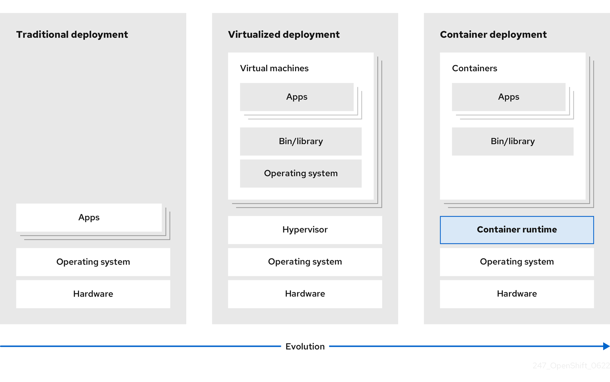
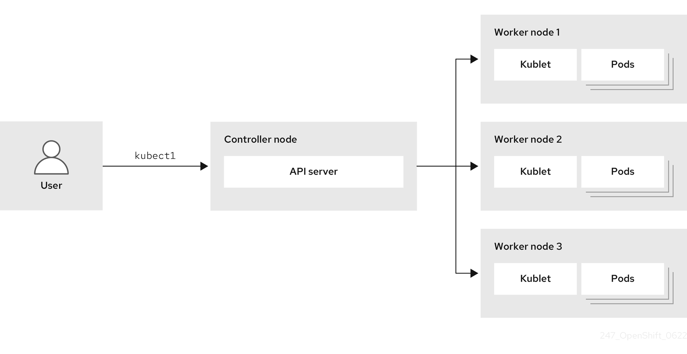
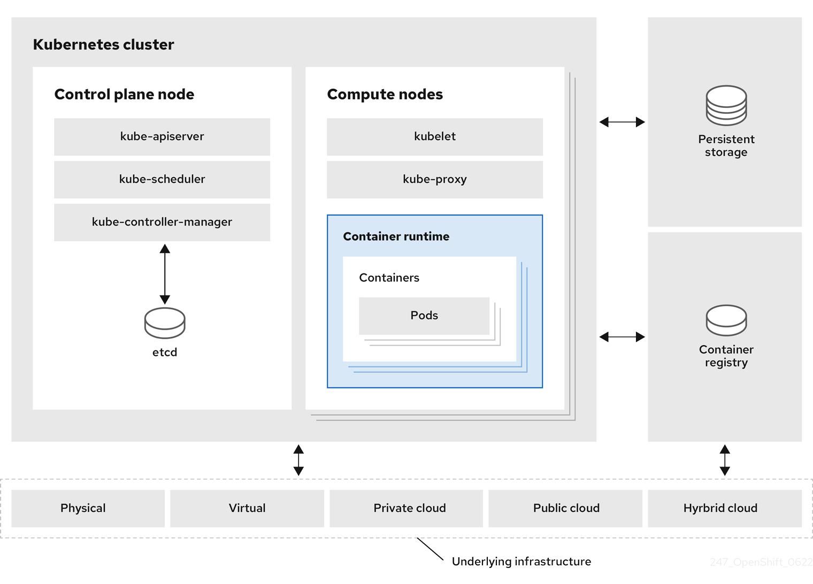

# Kubernetes overview { #kubernetes-overview }

You can run and manage container-based workloads by using Kubernetes, an open source container orchestration tool developed by Google. 

The most common Kubernetes use case is to deploy an array of interconnected microservices, building an application in a cloud native way. You can create Kubernetes clusters that can span hosts across on-premise, public, private, or hybrid clouds.

Traditionally, applications were deployed on top of a single operating system. With virtualization, you can split the physical host into several virtual hosts. Working on virtual instances on shared resources is not optimal for efficiency and scalability. Because a virtual machine (VM) consumes as many resources as a physical machine, providing resources to a VM such as CPU, RAM, and storage can be expensive. Also, you might see your application degrading in performance due to virtual instance usage on shared resources.

**Figure 1. Evolution of container technologies for classical deployments**

To solve this problem, you can use containerization technologies that segregate applications in a containerized environment. Similar to a VM, a container has its own filesystem, vCPU, memory, process space, dependencies, and more. Containers are decoupled from the underlying infrastructure, and are portable across clouds and OS distributions. Containers are inherently much lighter than a fully-featured OS, and are lightweight isolated processes that run on the operating system kernel. VMs are slower to boot, and are an abstraction of physical hardware. VMs run on a single machine with the help of a hypervisor.

You can perform the following actions by using Kubernetes:

- Sharing resources
- Orchestrating containers across multiple hosts
- Installing new hardware configurations
- Running health checks and self-healing applications
- Scaling containerized applications

## Kubernetes components { #kubernetes-components_kubernetes-overview }

To effectively manage and maintain a Kubernetes cluster, you must understand its core infrastructure and control plane components. This reference details the function of each component and how they interact to run your workloads.

**Kubernetes components**

| Component                 | Purpose                                                                                                                                                         |
| ------------------------- | --------------------------------------------------------------------------------------------------------------------------------------------------------------- |
| `kube-proxy`              | Runs on every node in the cluster and maintains the network traffic between the Kubernetes resources.                                                           |
| `kube-controller-manager` | Governs the state of the cluster.                                                                                                                               |
| `kube-scheduler`          | Allocates pods to nodes.                                                                                                                                        |
| `etcd`                    | Stores cluster data.                                                                                                                                            |
| `kube-apiserver`          | Validates and configures data for the API objects.                                                                                                              |
| `kubelet`                 | Runs on nodes and reads the container manifests. Ensures that the defined containers have started and are running.                                              |
| `kubectl`                 | Allows you to define how you want to run workloads. Use the `kubectl` command to interact with the `kube-apiserver`.                                            |
| Node                      | Node is a physical machine or a VM in a Kubernetes cluster. The control plane manages every node and schedules pods across the nodes in the Kubernetes cluster. |
| container runtime         | container runtime runs containers on a host operating system. You must install a container runtime on each node so that pods can run on the node.               |
| Persistent storage        | Stores the data even after the device is shut down. Kubernetes uses persistent volumes to store the application data.                                           |
| `container-registry`      | Stores and accesses the container images.                                                                                                                       |
| Pod                       | The pod is the smallest logical unit in Kubernetes. A pod contains one or more containers to run in a worker node.                                              |

## Kubernetes resources { #kubernetes-resources_kubernetes-overview }

To extend and automate your Kubernetes cluster capabilities, you can use custom resources and Operators.

A custom resource is an extension of the Kubernetes API. Operators are software extensions which manage applications and their components with the help of custom resources. Kubernetes uses a declarative model when you want a fixed desired result while dealing with cluster resources. By using Operators, Kubernetes defines its states in a declarative way. You can modify the Kubernetes cluster resources by using imperative commands. An Operator acts as a control loop which continuously compares the desired state of resources with the actual state of resources and puts actions in place to bring reality in line with the desired state.

**Figure 2. Kubernetes cluster overview**

**Kubernetes Resources**

| Resource      | Purpose                                                                    |
| ------------- | -------------------------------------------------------------------------- |
| Service       | Kubernetes uses services to expose a running application on a set of pods. |
| `ReplicaSets` | Kubernetes uses the `ReplicaSets` to maintain the constant pod number.     |
| Deployment    | A resource object that maintains the life cycle of an application.         |

Kubernetes is a core component of an OpenShift Container Platform. You can use OpenShift Container Platform for developing and running containerized applications. With its foundation in Kubernetes, the OpenShift Container Platform incorporates the same technology that serves as the engine for massive telecommunications, streaming video, gaming, banking, and other applications. You can extend your containerized applications beyond a single cloud to on-premise and multi-cloud environments by using the OpenShift Container Platform.

## Kubernetes architecture { #kubernetes-architecture_kubernetes-overview }

You can run Kubernetes containers across various machines and environments. 

A cluster is a single computational unit consisting of multiple nodes in a cloud environment. A Kubernetes cluster includes a control plane and compute nodes.

The control plane node controls and maintains the state of a cluster. You can run the Kubernetes application by using compute nodes. You can use the Kubernetes namespace to differentiate cluster resources in a cluster. Namespace scoping is applicable for resource objects, such as deployments, services, and pods. You cannot use namespace for cluster-wide resource objects such as storage classes, nodes, and persistent volumes.

**Figure 3. Architecture of Kubernetes**

## Kubernetes conceptual guidelines { #kubernetes-conceptual-guidelines_kubernetes-overview }

To more effectively deploy and scale applications, you should understand how Kubernetes aligns with OpenShift Container Platform.

Before getting started with the OpenShift Container Platform, consider these conceptual guidelines of Kubernetes:

- Start with one or more worker nodes to run the container workloads.
- Manage the deployment of those workloads from one or more control plane nodes.
- Wrap containers in a deployment unit called a pod. By using pods provides extra metadata with the container and offers the ability to group several containers in a single deployment entity.
- Create special kinds of assets. For example, services are represented by a set of pods and a policy that defines how they are accessed. This policy allows containers to connect to the services that they need even if they do not have the specific IP addresses for the services. Replication controllers are another special asset that indicates how many pod replicas are required to run at a time. You can use this capability to automatically scale your application to adapt to its current demand.

The API to OpenShift Container Platform cluster is 100% Kubernetes. Nothing changes between a container running on any other Kubernetes and running on OpenShift Container Platform. No changes to the application. OpenShift Container Platform brings added-value features to provide enterprise-ready enhancements to Kubernetes. OpenShift Container Platform CLI tool  (`oc`) is compatible with `kubectl`. While the Kubernetes API is 100% accessible within OpenShift Container Platform, the `kubectl` command-line lacks many features that could make it more user-friendly. OpenShift Container Platform offers a set of features and command-line tool like `oc`. Although Kubernetes excels at managing your applications, it does not specify or manage platform-level requirements or deployment processes. Powerful and flexible platform management tools and processes are important benefits that OpenShift Container Platform offers. You must add authentication, networking, security, monitoring, and logs management to your containerization platform.
