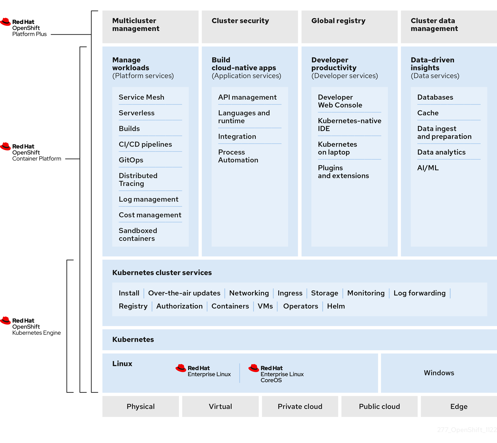

# About OpenShift Kubernetes Engine { #oke-about }

You can use the Red  Hat OpenShift Kubernetes Engine as a way to launch containers in an enterprise-class Kubernetes production platform.

!!! note

    As of 27 April 2020, Red Hat has decided to rename Red Hat OpenShift Container Engine to Red Hat OpenShift Kubernetes Engine to better communicate what value the product offering delivers.

OpenShift Kubernetes Engine is a subscription offering that provides OpenShift Container Platform with a limited set of supported features at a lower list price. OpenShift Kubernetes Engine and OpenShift Container Platform are the same product and, therefore, all software and features are delivered in both. There is only one download, OpenShift Container Platform. OpenShift Kubernetes Engine uses the OpenShift Container Platform documentation and support services and bug errata for this reason.

You download and install OpenShift Kubernetes Engine the same way as OpenShift Container Platform, as they are the same binary distribution, but OpenShift Kubernetes Engine offers a subset of the features that OpenShift Container Platform offers.

## OpenShift Kubernetes Engine and OpenShift Container Platform comparison { #oke_similarities_and_differences_oke-about }

To help decide whether to use OpenShift Kubernetes Engine or OpenShift Container Platform, you should understand the similarities and differences between the two platforms. 

You can see the similarities and differences in the following table:

**Product comparison for OpenShift Kubernetes Engine and OpenShift Container Platform**

<table>
<thead>
<tr>
  <th colspan="2"></th>
  <th>OpenShift Kubernetes Engine</th>
  <th>OpenShift Container Platform</th>
</tr>
</thead>
<tbody>
<tr>
  <th colspan="2">Fully Automated Installers</th>
  <td>Yes</td>
  <td>Yes</td>
</tr>
<tr>
  <th colspan="2">Over the Air Smart Upgrades</th>
  <td>Yes</td>
  <td>Yes</td>
</tr>
<tr>
  <th colspan="2">Enterprise Secured Kubernetes</th>
  <td>Yes</td>
  <td>Yes</td>
</tr>
<tr>
  <th colspan="2">Kubectl and oc automated command line</th>
  <td>Yes</td>
  <td>Yes</td>
</tr>
<tr>
  <th colspan="2">Operator Lifecycle Manager (OLM)</th>
  <td>Yes</td>
  <td>Yes</td>
</tr>
<tr>
  <th colspan="2">Administrator Web console</th>
  <td>Yes</td>
  <td>Yes</td>
</tr>
<tr>
  <th colspan="2">OpenShift Virtualization</th>
  <td>Yes</td>
  <td>Yes</td>
</tr>
<tr>
  <th colspan="2">User Workload Monitoring</th>
  <td></td>
  <td>Yes</td>
</tr>
<tr>
  <th colspan="2">Cluster Monitoring</th>
  <td>Yes</td>
  <td>Yes</td>
</tr>
<tr>
  <th colspan="2">Cost Management SaaS Service</th>
  <td>Yes</td>
  <td>Yes</td>
</tr>
<tr>
  <th colspan="2">Platform Logging</th>
  <td></td>
  <td>Yes</td>
</tr>
<tr>
  <th colspan="2">Developer Web Console</th>
  <td></td>
  <td>Yes</td>
</tr>
<tr>
  <th colspan="2">Developer Application Catalog</th>
  <td></td>
  <td>Yes</td>
</tr>
<tr>
  <th colspan="2">Source to Image and Builder Automation (Tekton)</th>
  <td></td>
  <td>Yes</td>
</tr>
<tr>
  <th colspan="2">OpenShift Service Mesh (Maistra and Kiali)</th>
  <td></td>
  <td>Yes</td>
</tr>
<tr>
  <th colspan="2">Distributed Tracing Platform</th>
  <td></td>
  <td>Yes</td>
</tr>
<tr>
  <th colspan="2">OpenShift Serverless (Knative)</th>
  <td></td>
  <td>Yes</td>
</tr>
<tr>
  <th colspan="2">OpenShift Pipelines (Jenkins and Tekton)</th>
  <td></td>
  <td>Yes</td>
</tr>
<tr>
  <th colspan="2">Embedded Component of IBM Cloud(R) Pak and RHT MW Bundles</th>
  <td></td>
  <td>Yes</td>
</tr>
<tr>
  <th colspan="2">OpenShift sandboxed containers</th>
  <td></td>
  <td>Yes</td>
</tr>
</tbody>
</table>

Core Kubernetes and container orchestration
:   OpenShift Kubernetes Engine offers full access to an enterprise-ready Kubernetes environment that is easy to install and offers an extensive compatibility test matrix with many of the software elements that you might use in your data center.

    OpenShift Kubernetes Engine offers the same service level agreements, bug fixes, and common vulnerabilities and errors protection as OpenShift Container Platform. OpenShift Kubernetes Engine includes a Red Hat Enterprise Linux (RHEL) Virtual Datacenter and Red Hat Enterprise Linux CoreOS (RHCOS) entitlement that allows you to use an integrated Linux operating system with container runtime from the same technology provider.

    The OpenShift Kubernetes Engine subscription is compatible with the Red Hat OpenShift support for Windows Containers subscription.

Enterprise-ready configurations
:   OpenShift Kubernetes Engine uses the same security options and default settings as the OpenShift Container Platform. Default security context constraints, pod security policies, best practice network and storage settings, service account configuration, SELinux integration, HAproxy edge routing configuration, and all other standard protections that OpenShift Container Platform offers are available in OpenShift Kubernetes Engine. OpenShift Kubernetes Engine offers full access to the integrated monitoring solution that OpenShift Container Platform uses, which is based on Prometheus and offers deep coverage and alerting for common Kubernetes issues.

    OpenShift Kubernetes Engine uses the same installation and upgrade automation as OpenShift Container Platform.

Standard infrastructure services
:   With an OpenShift Kubernetes Engine subscription, you receive support for all storage plugins that OpenShift Container Platform supports.

    In terms of networking, OpenShift Kubernetes Engine offers full and supported access to the Kubernetes Container Network Interface (CNI) and therefore allows you to use any third-party SDN that supports OpenShift Container Platform. It also allows you to use the included Open vSwitch software defined network to its fullest extent. OpenShift Kubernetes Engine allows you to take full advantage of the OVN Kubernetes overlay, Multus, and Multus plugins that are supported on OpenShift Container Platform. OpenShift Kubernetes Engine allows customers to use a Kubernetes Network Policy to create microsegmentation between deployed application services on the cluster.

    You can also use the `Route` API objects that are found in OpenShift Container Platform, including its sophisticated integration with the HAproxy edge routing layer as an out of the box Kubernetes Ingress Controller.

Core user experience
:   OpenShift Kubernetes Engine users have full access to Kubernetes Operators, pod deployment strategies, Helm, and OpenShift Container Platform templates. OpenShift Kubernetes Engine users can use both the `oc` and `kubectl` command-line interfaces. OpenShift Kubernetes Engine also offers an administrator web-based console that shows all aspects of the deployed container services and offers a container-as-a service experience. OpenShift Kubernetes Engine grants access to the Operator Life Cycle Manager that helps you control access to content on the cluster and life cycle operator-enabled services that you use. With an OpenShift Kubernetes Engine subscription, you receive access to the Kubernetes namespace, the OpenShift `Project` API object, and cluster-level Prometheus monitoring metrics and events.

Maintained and curated content
:   With an OpenShift Kubernetes Engine subscription, you receive access to the OpenShift Container Platform content from the Red Hat Ecosystem Catalog and Red Hat Connect ISV marketplace. You can access all maintained and curated content that the OpenShift Container Platform eco-system offers.

OpenShift Data Foundation compatible
:   OpenShift Kubernetes Engine is compatible and supported with your purchase of OpenShift Data Foundation.

Red Hat Middleware compatible
:   OpenShift Kubernetes Engine is compatible and supported with individual Red Hat Middleware product solutions. Red Hat Middleware Bundles that include OpenShift embedded in them only contain OpenShift Container Platform.

OpenShift Serverless
:   OpenShift Kubernetes Engine does not include OpenShift Serverless support. Use OpenShift Container Platform for this support.

Quay Integration compatible
:   OpenShift Kubernetes Engine is compatible and supported with a Red Hat Quay purchase.

OpenShift Virtualization
:   OpenShift Kubernetes Engine includes support for the Red Hat product offerings derived from the kubevirt.io open source project.

Advanced cluster management
:   OpenShift Kubernetes Engine is compatible with your additional purchase of Red Hat Advanced Cluster Management (RHACM) for Kubernetes. An OpenShift Kubernetes Engine subscription does not offer a cluster-wide log aggregation solution.

    Red Hat OpenShift Service Mesh capabilities derived from the open-source istio.io and kiali.io projects that offer OpenTracing observability for containerized services on OpenShift Container Platform are not supported in OpenShift Kubernetes Engine.

Advanced networking
:   The standard networking solutions in OpenShift Container Platform are supported with an OpenShift Kubernetes Engine subscription. The OpenShift Container Platform Kubernetes CNI plugin for automation of multi-tenant network segmentation between OpenShift Container Platform projects is entitled for use with OpenShift Kubernetes Engine. OpenShift Kubernetes Engine offers all the granular control of the source IP addresses that are used by application services on the cluster. Those egress IP address controls are entitled for use with OpenShift Kubernetes Engine. OpenShift Container Platform offers ingress routing to on cluster services that use non-standard ports when no public cloud provider is in use via the VIP pods found in OpenShift Container Platform. That ingress solution is supported in OpenShift Kubernetes Engine. OpenShift Kubernetes Engine users are supported for the Kubernetes ingress control object, which offers integrations with public cloud providers. Red Hat Service Mesh, which is derived from the istio.io open source project, is not supported in OpenShift Kubernetes Engine. Also, the Kourier Ingress Controller found in OpenShift Serverless is not supported on OpenShift Kubernetes Engine.

OpenShift sandboxed containers
:   OpenShift Kubernetes Engine does not include OpenShift sandboxed containers. Use OpenShift Container Platform for this support.

Developer experience
:   With OpenShift Kubernetes Engine, the following capabilities are not supported:

    - The OpenShift Container Platform developer experience utilities and tools, such as Red Hat OpenShift Dev Spaces.
    - The OpenShift Container Platform pipeline feature that integrates a streamlined, Kubernetes-enabled Jenkins and Tekton experience in the user’s project space.
    - The OpenShift Container Platform source-to-image feature, which allows you to easily deploy source code, dockerfiles, or container images across the cluster.
    - Build strategies, builder pods, or Tekton container deployments.
    - The `odo` developer command line.
    - The developer persona in the OpenShift Container Platform web console.

Feature summary
:   The following table is a summary of the feature availability in OpenShift Kubernetes Engine and OpenShift Container Platform. Where applicable, it includes the name of the Operator that enables a feature.

    **Features in OpenShift Kubernetes Engine and OpenShift Container Platform**

<table>
<thead>
<tr>
  <th>Feature</th>
  <th>OpenShift Kubernetes Engine</th>
  <th>OpenShift Container Platform</th>
  <th>Operator name</th>
</tr>
</thead>
<tbody>
<tr>
  <td>Fully Automated Installers (installer-provisioned infrastructure)</td>
  <td>Included</td>
  <td>Included</td>
  <td>N/A</td>
</tr>
<tr>
  <td>Customizable Installers (user-provisioned infrastructure)</td>
  <td>Included</td>
  <td>Included</td>
  <td>N/A</td>
</tr>
<tr>
  <td>Disconnected Installation</td>
  <td>Included</td>
  <td>Included</td>
  <td>N/A</td>
</tr>
<tr>
  <td>Red&#160;Hat Enterprise Linux (RHEL) or Red&#160;Hat Enterprise Linux CoreOS (RHCOS) entitlement</td>
  <td>Included</td>
  <td>Included</td>
  <td>N/A</td>
</tr>
<tr>
  <td>Existing RHEL manual attach to cluster (BYO)</td>
  <td>Included</td>
  <td>Included</td>
  <td>N/A</td>
</tr>
<tr>
  <td>CRIO Runtime</td>
  <td>Included</td>
  <td>Included</td>
  <td>N/A</td>
</tr>
<tr>
  <td>Over the Air Smart Upgrades and Operating System (RHCOS) Management</td>
  <td>Included</td>
  <td>Included</td>
  <td>N/A</td>
</tr>
<tr>
  <td>Enterprise Secured Kubernetes</td>
  <td>Included</td>
  <td>Included</td>
  <td>N/A</td>
</tr>
<tr>
  <td>Kubectl and <code>oc</code> automated command line</td>
  <td>Included</td>
  <td>Included</td>
  <td>N/A</td>
</tr>
<tr>
  <td>Auth Integrations, RBAC, SCC, Multi-Tenancy Admission Controller</td>
  <td>Included</td>
  <td>Included</td>
  <td>N/A</td>
</tr>
<tr>
  <td>Operator Lifecycle Manager (OLM)</td>
  <td>Included</td>
  <td>Included</td>
  <td>N/A</td>
</tr>
<tr>
  <td>Administrator web console</td>
  <td>Included</td>
  <td>Included</td>
  <td>N/A</td>
</tr>
<tr>
  <td>OpenShift Virtualization</td>
  <td>Included</td>
  <td>Included</td>
  <td>OpenShift Virtualization Operator</td>
</tr>
<tr>
  <td>Compliance Operator provided by Red Hat</td>
  <td>Included</td>
  <td>Included</td>
  <td>Compliance Operator</td>
</tr>
<tr>
  <td>File Integrity Operator</td>
  <td>Included</td>
  <td>Included</td>
  <td>File Integrity Operator</td>
</tr>
<tr>
  <td>Gatekeeper Operator</td>
  <td>Not Included - Requires separate subscription</td>
  <td>Not Included - Requires separate subscription</td>
  <td>Gatekeeper Operator</td>
</tr>
<tr>
  <td>Klusterlet</td>
  <td>Not Included - Requires separate subscription</td>
  <td>Not Included - Requires separate subscription</td>
  <td>N/A</td>
</tr>
<tr>
  <td>Kube Descheduler Operator provided by Red Hat</td>
  <td>Included</td>
  <td>Included</td>
  <td>Kube Descheduler Operator</td>
</tr>
<tr>
  <td>Local Storage provided by Red Hat</td>
  <td>Included</td>
  <td>Included</td>
  <td>Local Storage Operator</td>
</tr>
<tr>
  <td>Node Feature Discovery provided by Red Hat</td>
  <td>Included</td>
  <td>Included</td>
  <td>Node Feature Discovery Operator</td>
</tr>
<tr>
  <td>Performance Profile controller</td>
  <td>Included</td>
  <td>Included</td>
  <td>N/A</td>
</tr>
<tr>
  <td>PTP Operator provided by Red Hat</td>
  <td>Included</td>
  <td>Included</td>
  <td>PTP Operator</td>
</tr>
<tr>
  <td>Service Telemetry Operator provided by Red Hat</td>
  <td>Not Included</td>
  <td>Included</td>
  <td>Service Telemetry Operator</td>
</tr>
<tr>
  <td>SR-IOV Network Operator</td>
  <td>Included</td>
  <td>Included</td>
  <td>SR-IOV Network Operator</td>
</tr>
<tr>
  <td>Vertical Pod Autoscaler</td>
  <td>Included</td>
  <td>Included</td>
  <td>Vertical Pod Autoscaler</td>
</tr>
<tr>
  <td>Cluster Monitoring (Prometheus)</td>
  <td>Included</td>
  <td>Included</td>
  <td>Cluster Monitoring</td>
</tr>
<tr>
  <td>Device Manager (for example, GPU)</td>
  <td>Included</td>
  <td>Included</td>
  <td>N/A</td>
</tr>
<tr>
  <td>Log Forwarding</td>
  <td>Included</td>
  <td>Included</td>
  <td>Red Hat OpenShift Logging Operator</td>
</tr>
<tr>
  <td>Telemeter and Insights Connected Experience</td>
  <td>Included</td>
  <td>Included</td>
  <td>N/A</td>
</tr>
<tr>
  <td><strong>Feature</strong></td>
  <td><strong>OpenShift Kubernetes Engine</strong></td>
  <td><strong>OpenShift Container Platform</strong></td>
  <td><strong>Operator name</strong></td>
</tr>
<tr>
  <td>OpenShift Cloud Manager SaaS Service</td>
  <td>Included</td>
  <td>Included</td>
  <td>N/A</td>
</tr>
<tr>
  <td>OVS and OVN SDN</td>
  <td>Included</td>
  <td>Included</td>
  <td>N/A</td>
</tr>
<tr>
  <td>MetalLB</td>
  <td>Included</td>
  <td>Included</td>
  <td>MetalLB Operator</td>
</tr>
<tr>
  <td>HAProxy Ingress Controller</td>
  <td>Included</td>
  <td>Included</td>
  <td>N/A</td>
</tr>
<tr>
  <td>Ingress Cluster-wide Firewall</td>
  <td>Included</td>
  <td>Included</td>
  <td>N/A</td>
</tr>
<tr>
  <td>Egress Pod and Namespace Granular Control</td>
  <td>Included</td>
  <td>Included</td>
  <td>N/A</td>
</tr>
<tr>
  <td>Ingress Non-Standard Ports</td>
  <td>Included</td>
  <td>Included</td>
  <td>N/A</td>
</tr>
<tr>
  <td>Multus and Available Multus Plugins</td>
  <td>Included</td>
  <td>Included</td>
  <td>N/A</td>
</tr>
<tr>
  <td>Network Policies</td>
  <td>Included</td>
  <td>Included</td>
  <td>N/A</td>
</tr>
<tr>
  <td>IPv6 Single and Dual Stack</td>
  <td>Included</td>
  <td>Included</td>
  <td>N/A</td>
</tr>
<tr>
  <td>CNI Plugin ISV Compatibility</td>
  <td>Included</td>
  <td>Included</td>
  <td>N/A</td>
</tr>
<tr>
  <td>CSI Plugin ISV Compatibility</td>
  <td>Included</td>
  <td>Included</td>
  <td>N/A</td>
</tr>
<tr>
  <td>RHT and IBM(R) middleware à la carte purchases (not included in OpenShift Container Platform or OpenShift Kubernetes Engine)</td>
  <td>Included</td>
  <td>Included</td>
  <td>N/A</td>
</tr>
<tr>
  <td>ISV or Partner Operator and Container Compatibility (not included in OpenShift Container Platform or OpenShift Kubernetes Engine)</td>
  <td>Included</td>
  <td>Included</td>
  <td>N/A</td>
</tr>
<tr>
  <td>Embedded software catalog</td>
  <td>Included</td>
  <td>Included</td>
  <td>N/A</td>
</tr>
<tr>
  <td>Embedded Marketplace</td>
  <td>Included</td>
  <td>Included</td>
  <td>N/A</td>
</tr>
<tr>
  <td>Quay Compatibility (not included)</td>
  <td>Included</td>
  <td>Included</td>
  <td>N/A</td>
</tr>
<tr>
  <td>OpenShift API for Data Protection (OADP)</td>
  <td>Included</td>
  <td>Included</td>
  <td>OADP Operator</td>
</tr>
<tr>
  <td>RHEL Software Collections and RHT SSO Common Service (included)</td>
  <td>Included</td>
  <td>Included</td>
  <td>N/A</td>
</tr>
<tr>
  <td>Embedded Registry</td>
  <td>Included</td>
  <td>Included</td>
  <td>N/A</td>
</tr>
<tr>
  <td>Helm</td>
  <td>Included</td>
  <td>Included</td>
  <td>N/A</td>
</tr>
<tr>
  <td>User Workload Monitoring</td>
  <td>Not Included</td>
  <td>Included</td>
  <td>N/A</td>
</tr>
<tr>
  <td>Cost Management SaaS Service</td>
  <td>Included</td>
  <td>Included</td>
  <td>Cost Management Metrics Operator</td>
</tr>
<tr>
  <td>Platform Logging</td>
  <td>Not Included</td>
  <td>Included</td>
  <td>Red Hat OpenShift Logging Operator</td>
</tr>
<tr>
  <td>Developer Web Console</td>
  <td>Not Included</td>
  <td>Included</td>
  <td>N/A</td>
</tr>
<tr>
  <td>Developer Application Catalog</td>
  <td>Not Included</td>
  <td>Included</td>
  <td>N/A</td>
</tr>
<tr>
  <td>Source to Image and Builder Automation (Tekton)</td>
  <td>Not Included</td>
  <td>Included</td>
  <td>N/A</td>
</tr>
<tr>
  <td>OpenShift Service Mesh</td>
  <td>Not Included</td>
  <td>Included</td>
  <td>OpenShift Service Mesh Operator</td>
</tr>
<tr>
  <td><strong>Feature</strong></td>
  <td><strong>OpenShift Kubernetes Engine</strong></td>
  <td><strong>OpenShift Container Platform</strong></td>
  <td><strong>Operator name</strong></td>
</tr>
<tr>
  <td>OpenShift Serverless</td>
  <td>Not Included</td>
  <td>Included</td>
  <td>OpenShift Serverless Operator</td>
</tr>
<tr>
  <td>Web Terminal provided by Red Hat</td>
  <td>Not Included</td>
  <td>Included</td>
  <td>Web Terminal Operator</td>
</tr>
<tr>
  <td>Red&#160;Hat OpenShift Pipelines</td>
  <td>Not Included</td>
  <td>Included</td>
  <td>OpenShift Pipelines Operator</td>
</tr>
<tr>
  <td>Embedded Component of IBM Cloud(R) Pak and RHT MW Bundles</td>
  <td>Not Included</td>
  <td>Included</td>
  <td>N/A</td>
</tr>
<tr>
  <td>Red&#160;Hat OpenShift GitOps</td>
  <td>Not Included</td>
  <td>Included</td>
  <td>Red&#160;Hat OpenShift GitOps Operator</td>
</tr>
<tr>
  <td>Red&#160;Hat OpenShift Dev Spaces</td>
  <td>Not Included</td>
  <td>Included</td>
  <td>Red&#160;Hat OpenShift Dev Spaces</td>
</tr>
<tr>
  <td>Red&#160;Hat OpenShift Local</td>
  <td>Not Included</td>
  <td>Included</td>
  <td>N/A</td>
</tr>
<tr>
  <td>Quay Bridge Operator provided by Red Hat</td>
  <td>Not Included</td>
  <td>Included</td>
  <td>Quay Bridge Operator</td>
</tr>
<tr>
  <td>Quay Container Security provided by Red Hat</td>
  <td>Not Included</td>
  <td>Included</td>
  <td>Quay Operator</td>
</tr>
<tr>
  <td>Red&#160;Hat OpenShift Distributed Tracing Platform (Jaeger)</td>
  <td>Not Included</td>
  <td>Included</td>
  <td>Red&#160;Hat OpenShift Distributed Tracing Platform (Jaeger) Operator</td>
</tr>
<tr>
  <td>Red Hat OpenShift Kiali</td>
  <td>Not Included</td>
  <td>Included</td>
  <td>Kiali Operator</td>
</tr>
<tr>
  <td>Metering provided by Red Hat (deprecated)</td>
  <td>Not Included</td>
  <td>Included</td>
  <td>N/A</td>
</tr>
<tr>
  <td>Cost management for OpenShift</td>
  <td>Not included</td>
  <td>Included</td>
  <td>N/A</td>
</tr>
<tr>
  <td>JBoss Web Server provided by Red Hat</td>
  <td>Not included</td>
  <td>Included</td>
  <td>JWS Operator</td>
</tr>
<tr>
  <td>Red Hat Build of Quarkus</td>
  <td>Not included</td>
  <td>Included</td>
  <td>N/A</td>
</tr>
<tr>
  <td>Kourier Ingress Controller</td>
  <td>Not included</td>
  <td>Included</td>
  <td>N/A</td>
</tr>
<tr>
  <td>RHT Middleware Bundles Sub Compatibility (not included in OpenShift Container Platform)</td>
  <td>Not included</td>
  <td>Included</td>
  <td>N/A</td>
</tr>
<tr>
  <td>IBM Cloud(R)  Pak Sub Compatibility (not included in OpenShift Container Platform)</td>
  <td>Not included</td>
  <td>Included</td>
  <td>N/A</td>
</tr>
<tr>
  <td>OpenShift Do (<code>odo</code>)</td>
  <td>Not included</td>
  <td>Included</td>
  <td>N/A</td>
</tr>
<tr>
  <td>Source to Image and Tekton Builders</td>
  <td>Not included</td>
  <td>Included</td>
  <td>N/A</td>
</tr>
<tr>
  <td>OpenShift Serverless FaaS</td>
  <td>Not included</td>
  <td>Included</td>
  <td>N/A</td>
</tr>
<tr>
  <td>IDE Integrations</td>
  <td>Not included</td>
  <td>Included</td>
  <td>N/A</td>
</tr>
<tr>
  <td>OpenShift sandboxed containers</td>
  <td>Not included</td>
  <td>Not included</td>
  <td>OpenShift sandboxed containers Operator</td>
</tr>
<tr>
  <td>Windows Machine Config Operator</td>
  <td>Community Windows Machine Config Operator included - no subscription required</td>
  <td>Red Hat Windows Machine Config Operator included - Requires separate subscription</td>
  <td>Windows Machine Config Operator</td>
</tr>
<tr>
  <td>Red&#160;Hat Quay</td>
  <td>Not Included - Requires separate subscription</td>
  <td>Not Included - Requires separate subscription</td>
  <td>Quay Operator</td>
</tr>
<tr>
  <td>Red Hat Advanced Cluster Management</td>
  <td>Not Included - Requires separate subscription</td>
  <td>Not Included - Requires separate subscription</td>
  <td>Advanced Cluster Management for Kubernetes</td>
</tr>
<tr>
  <td>Red Hat Advanced Cluster Security</td>
  <td>Not Included - Requires separate subscription</td>
  <td>Not Included - Requires separate subscription</td>
  <td>N/A</td>
</tr>
<tr>
  <td>OpenShift Data Foundation</td>
  <td>Not Included - Requires separate subscription</td>
  <td>Not Included - Requires separate subscription</td>
  <td>OpenShift Data Foundation</td>
</tr>
<tr>
  <td><strong>Feature</strong></td>
  <td><strong>OpenShift Kubernetes Engine</strong></td>
  <td><strong>OpenShift Container Platform</strong></td>
  <td><strong>Operator name</strong></td>
</tr>
<tr>
  <td>Ansible Automation Platform Resource Operator</td>
  <td>Not Included - Requires separate subscription</td>
  <td>Not Included - Requires separate subscription</td>
  <td>Ansible Automation Platform Resource Operator</td>
</tr>
<tr>
  <td>Business Automation provided by Red Hat</td>
  <td>Not Included - Requires separate subscription</td>
  <td>Not Included - Requires separate subscription</td>
  <td>Business Automation Operator</td>
</tr>
<tr>
  <td>Data Grid provided by Red Hat</td>
  <td>Not Included - Requires separate subscription</td>
  <td>Not Included - Requires separate subscription</td>
  <td>Data Grid Operator</td>
</tr>
<tr>
  <td>Red Hat Integration provided by Red Hat</td>
  <td>Not Included - Requires separate subscription</td>
  <td>Not Included - Requires separate subscription</td>
  <td>Red Hat Integration Operator</td>
</tr>
<tr>
  <td>Red Hat Integration - 3Scale provided by Red Hat</td>
  <td>Not Included - Requires separate subscription</td>
  <td>Not Included - Requires separate subscription</td>
  <td>3scale</td>
</tr>
<tr>
  <td>Red Hat Integration - 3Scale APICast gateway provided by Red Hat</td>
  <td>Not Included - Requires separate subscription</td>
  <td>Not Included - Requires separate subscription</td>
  <td>3scale APIcast</td>
</tr>
<tr>
  <td>Red Hat Integration - AMQ Broker</td>
  <td>Not Included - Requires separate subscription</td>
  <td>Not Included - Requires separate subscription</td>
  <td>AMQ Broker</td>
</tr>
<tr>
  <td>Red Hat Integration - AMQ Broker LTS</td>
  <td>Not Included - Requires separate subscription</td>
  <td>Not Included - Requires separate subscription</td>
  <td></td>
</tr>
<tr>
  <td>Red Hat Integration - AMQ Interconnect</td>
  <td>Not Included - Requires separate subscription</td>
  <td>Not Included - Requires separate subscription</td>
  <td>AMQ Interconnect</td>
</tr>
<tr>
  <td>Red Hat Integration - AMQ Online</td>
  <td>Not Included - Requires separate subscription</td>
  <td>Not Included - Requires separate subscription</td>
  <td></td>
</tr>
<tr>
  <td>Red Hat Integration - AMQ Streams</td>
  <td>Not Included - Requires separate subscription</td>
  <td>Not Included - Requires separate subscription</td>
  <td>AMQ Streams</td>
</tr>
<tr>
  <td>Red Hat Integration - Camel K</td>
  <td>Not Included - Requires separate subscription</td>
  <td>Not Included - Requires separate subscription</td>
  <td>Camel K</td>
</tr>
<tr>
  <td>Red Hat Integration - Fuse Console</td>
  <td>Not Included - Requires separate subscription</td>
  <td>Not Included - Requires separate subscription</td>
  <td>Fuse Console</td>
</tr>
<tr>
  <td>Red Hat Integration - Fuse Online</td>
  <td>Not Included - Requires separate subscription</td>
  <td>Not Included - Requires separate subscription</td>
  <td>Fuse Online</td>
</tr>
<tr>
  <td>Red Hat Integration - Service Registry Operator</td>
  <td>Not Included - Requires separate subscription</td>
  <td>Not Included - Requires separate subscription</td>
  <td>Service Registry</td>
</tr>
<tr>
  <td>API Designer provided by Red Hat</td>
  <td>Not Included - Requires separate subscription</td>
  <td>Not Included - Requires separate subscription</td>
  <td>API Designer</td>
</tr>
<tr>
  <td>JBoss EAP provided by Red Hat</td>
  <td>Not Included - Requires separate subscription</td>
  <td>Not Included - Requires separate subscription</td>
  <td>JBoss EAP</td>
</tr>
<tr>
  <td>Smart Gateway Operator</td>
  <td>Not Included - Requires separate subscription</td>
  <td>Not Included - Requires separate subscription</td>
  <td>Smart Gateway Operator</td>
</tr>
<tr>
  <td>Kubernetes NMState Operator</td>
  <td>Included</td>
  <td>Included</td>
  <td>N/A</td>
</tr>
</tbody>
</table>
